# storyBASE Repository README

## State

The storyBASE is currently **empty**. No RDF triples have been inserted, and no transactions have been recorded. The system is in its initial state, awaiting the first transaction to begin building the knowledge graph.[^1]

[^1]: Snapshot statistics show `inserted: 0, deleted: 0, skippedDuplicates: 0, deleteMisses: 0` with a warning "No transactions found in input." This indicates a completely uninitialized graph state.

---

## Stories

### `/README.story` – storyBASE Repository README

**Intent:**  
This story generates a living README that tracks the current state of the storyBASE knowledge graph, summarizes all active `.story` files, describes repository assets, and chronicles transaction history.

**Relationship to the Whole:**  
The README serves as the **entry point and health dashboard** for the storyBASE. It provides a human-readable view of what would otherwise be opaque RDF data, helping contributors understand what exists, what's planned, and how the graph has evolved.

**Approach from Current State:**  
Since the storyBASE is empty, this document reflects:
- **State**: No triples, no history.
- **Stories**: Only this README story exists.
- **Assets**: The ontology (SKOS/RDF schema) is present but unpopulated.
- **Transactions**: None yet recorded.

Future updates will expand each section as transactions populate the graph with Opportunity analysis, Strategy definitions, Product specs, Architecture details, and Proof artifacts.

---

## Assets

### Repository Structure

```
/
├── README.story          # This file (autogenerated README generator)
├── ONTOLOGY.rdf          # SKOS/RDF schema defining Narrative Architecture concepts
└── (storyBASE graph)     # RDF triples (currently empty)
```

### Asset Descriptions

#### `README.story`
- **Type**: `.story` prompt file  
- **Purpose**: Instructs storyWRITER to generate this README by querying the storyBASE snapshot.  
- **Destination**: `/` (repository root)  
- **Model**: `anthropic/claude-sonnet-4.5`  
- **Output**: Markdown summary of state, stories, assets, and transactions.

#### `ONTOLOGY.rdf`
- **Type**: RDF/XML ontology  
- **Purpose**: Defines the **Narrative Architecture** concept scheme with 8 top-level domains (Opportunity, Strategy, Product, Architecture, Organization, Proof, Templates, Calibration, Style) and ~200+ narrower concepts.  
- **Structure**: SKOS taxonomy with `skos:Concept`, `skos:narrower`, `xkos:next` (sequential phases), and cross-domain `skos:related` links.  
- **Phase Model**: Concepts are organized into an implementation sequence (Site → Foundations → Plans → Structural Engineering → Walls → Roof → Glazing → Interior Design → Furnishing) using XKOS.

```mermaid
graph TD
    NA[Narrative Architecture]
    NA --> Opp[Opportunity]
    NA --> Strat[Strategy]
    NA --> Prod[Product]
    NA --> Arch[Architecture]
    NA --> Org[Organization]
    NA --> Proof[Proof]
    NA --> Tmpl[Templates]
    NA --> Cal[Calibration]
    NA --> Style[Style]
    
    Opp --> MarketContext
    Opp --> ActorIncentive
    Opp --> TechSocial
    Opp --> TrendForecast
    
    Strat --> StratOverview
    Strat --> NarrativeAnchor
    Strat --> NarrRoadmap
    Strat --> OrgChange
    
    Prod --> ProdOverview
    Prod --> ProdLadder
    Prod --> SolutionArch
    
    Arch --> ArchOverview
    Arch --> TechExplain
    Arch --> TechDocs
    
    Org --> RoleTop
    Org --> Process
    
    Proof --> CaseStudies
    Proof --> Outcomes
    Proof --> Metrics
    
    Tmpl --> SalesDecks
    Tmpl --> LandingPages
    Tmpl --> PRDs
    Tmpl --> SocialPosts
    Tmpl --> CustDocs
    
    Cal --> NarrTestPrompts
    
    Style --> StyleProfiles
    Style --> DictionVoice
    Style --> StyleMetrics
    Style --> StyleReview
```



---

## Transactions

**No transactions have been recorded.**[^2]

When the first transaction is committed, this section will summarize:
- **Transaction ID** and timestamp  
- **Operations**: Insertions, deletions, updates  
- **Affected Concepts**: Which parts of the Narrative Architecture were modified  
- **Significance**: How the change advances storyBASE toward completeness (e.g., "Added TAM/SAM/SOM model under Opportunity → Market Context, enabling initial market sizing for Strategy development")

[^2]: The SNAPSHOT shows a warning: "No transactions found in input. Provide items[0].json.transactions array or one item per transaction with json.query." This confirms zero transaction history in the current storyBASE state.

---

**Next Steps:**  
To activate the storyBASE, commit the first transaction by adding RDF triples under any top-level concept (e.g., defining a `#TimingThesis` under `#Opportunity`, or a `#Tagline` under `#NarrativeAnchor`). The README will update to reflect the new state, active stories, and transaction history.