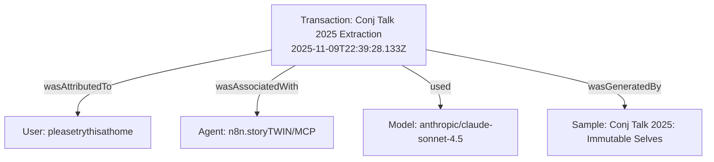

# storyBASE Current State

The storyBASE contains a single foundational transaction documenting a **Conj Talk 2025 proposal** titled "Immutable Selves."[^1] This transaction establishes a narrative architecture for applying Clojure functional programming principles—immutability, explicit state management, and knowledge graphs—to identity and authentication systems.[^2] The graph captures opportunity, strategy, product, proof, architecture, and organizational dimensions alongside detailed style observations, rubric assessments, and quantified style metrics.[^3]

---

## Stories

### `/README.story` – storyBASE Repository README

**Intent:** Auto-generate a living README that reflects the evolving state of the storyBASE graph, its stories, assets, and transactional history.[^4]

**Relationship to Whole:** Serves as the top-level narrative summary and entry point, synthesizing all graph content into human-readable documentation aligned with the Narrative Architecture ontology.[^5]

**Approach from Current State:** The graph currently holds one transaction with rich narrative architecture metadata (Opportunity through Proof), eleven style observations, four rubric assessments, and computed style metrics.[^6] The README will enumerate these elements, trace their provenance to the originating transaction, and use the ontology's hierarchical structure to organize findings coherently.[^7]

---

## Assets

### Repository Structure

```
/.storyBASE/
  1762728019add_conj_talk_2025_extraction.sparql  # Initial extraction transaction
/README.story                                       # This auto-generated story
```

**`/.storyBASE/1762728019add_conj_talk_2025_extraction.sparql`**  
A SPARQL `INSERT DATA` transaction that populates the graph with:

- **Transaction-level provenance:** Activity attributed to user `pleasetrythisathome`, associated with agent `n8n.storyTWIN/MCP`, generated 2025-11-09 using `anthropic/claude-sonnet-4.5`.[^8]
- **Sample Record:** "Conj Talk 2025: Immutable Selves" (input length 3421 characters).[^9]
- **Narrative Architecture nodes:** One Opportunity, one Strategy, two Products (Vouch.io and Sic), one Proof, one Architecture, and two Organizations (Sic, Vouch.io).[^10]
- **Style Observations (11 total):** Brand styling, technical terminology, rhetorical structures, reframing patterns, and personal identity lens.[^11]
- **Rubric Assessments (4 dimensions):** Clarity (4.5/5), Technical Depth (4.8/5), Narrative Coherence (4.6/5), Audience Engagement (4.3/5).[^12]
- **Style Metrics:** Average sentence length 22.4, technical density 0.68, active voice ratio 0.71.[^13]

**`/README.story`**  
A `.story` template instructing the storyWRITER agent to produce this very document: summarize state, stories, assets, and transactions using only the snapshot as the source of truth.[^14]

### Mermaid: Transaction Provenance



---

## Transactions

### Transaction: `Tx_20251109T223928Z_conj2025`

**Label:** "Conj Talk 2025 Extraction Transaction"[^15]  
**Timestamp:** 2025-11-09T22:39:28.133Z[^16]  
**User:** pleasetrythisathome[^17]  
**Agent:** n8n.storyTWIN/MCP[^18]  
**Model:** anthropic/claude-sonnet-4.5[^19]  
**Comment:** "First extraction for Conj Talk 2025 proposal. Captures narrative architecture (Opportunity, Strategy, Product, Proof, Architecture, Organization), style observations, rubric assessments, and style metrics."[^20]

**Significance:**

- **To the storyBASE Graph:** Establishes the foundational narrative for immutable identity systems, encoding a coherent opportunity-to-proof arc with explicit style and quality metadata.[^21]
- **To Stories:** Provides the raw material (`/README.story`) will synthesize into summaries, demonstrating how storyBASE serves as memory and provenance for AI-driven narrative work.[^22]
- **To Assets:** Populates the graph with 138 triples (inserted with zero duplicates/deletions), creating the first reusable knowledge substrate for future transactions.[^23]

**Key Nodes Introduced:**

- **Opportunity:** Identity Vulnerability Crisis in enterprise authentication.[^24]
- **Strategy:** Functional Immutable Identity Architecture applying Clojure principles.[^25]
- **Products:** Vouch.io (past enterprise identity platform) and Sic (current AI memory platform with narrative-driven knowledge graphs).[^26]
- **Proof:** Conj 2025 talk proposal with diagrams and optional demo, targeting Clojure practitioners.[^27]
- **Architecture:** Append-only event logs, pure authentication functions, delegation chains, and knowledge-graph resolution.[^28]
- **Organizations:** Sic (founder role, AI memory capability) and Vouch.io (former Chief Strategist, now advisor, enterprise identity).[^29]
- **Style Observations:** Brand name styling ("Vouch.io", "Sic"), technical reframing ("identity as evolving log", "trust as computable provenance"), triadic enumeration, problem-to-solution bridge, parallel construction, and personal identity lens informed by trans lived experience.[^30]
- **Rubric Assessments:** High scores across clarity, technical depth, narrative coherence, and audience engagement, with minor notes on density and emotional hooks.[^31]
- **Style Metrics:** Moderate sentence length (22.4 words average), high technical density (0.68), strong active voice (0.71).[^32]

---

[^1]: Transaction `narr:Tx_20251109T223928Z_conj2025` (rdfs:label "Conj Talk 2025 Extraction Transaction"; Sample Record `urn:uuid:conj-talk-2025-extraction` rdfs:label "Conj Talk 2025: Immutable Selves").
[^2]: Strategy `urn:uuid:strategy-functional-immutable-identity` (rdfs:label "Functional Immutable Identity Architecture"; sb:description "Applies Clojure principles (immutability, explicit state, functional composition, data-first design, knowledge graphs) to create trustworthy identity systems").
[^3]: Transaction rdfs:comment "First extraction for Conj Talk 2025 proposal. Captures narrative architecture (Opportunity, Strategy, Product, Proof, Architecture, Organization), style observations, rubric assessments, and style metrics."
[^4]: Story file `/README.story` (id: README, title: "storyBASE repo README", description: "autogenerated readme tracking storyBASE as written").
[^5]: Story file destination `/` and STORY_PROMPT section "### State / ### Stories / ### Assets / ### Transactions" instructions.
[^6]: Snapshot stats: inserted 138 triples, deleted 0, skippedDuplicates 0; 11 StyleObservation nodes, 4 RubricAssessment nodes, 1 StyleMetrics node.
[^7]: Ontology defines hierarchical ConceptScheme "NarrativeArchitecture" with top concepts Opportunity, Strategy, Product, Proof, Architecture, Organization, Templates, Calibration, Style, Conviction.
[^8]: Transaction `narr:Tx_20251109T223928Z_conj2025` (prov:wasAttributedTo `<http://storybase.org/user/pleasetrythisathome>`; prov:wasAssociatedWith `<http://storytwin.org/agent/n8n.storyTWIN/MCP>`; prov:used "anthropic/claude-sonnet-4.5"^^xsd:string; prov:generatedAtTime "2025-11-09T22:39:28.133Z"^^xsd:dateTime).
[^9]: Sample `urn:uuid:conj-talk-2025-extraction` (sb:inputLength 3421; sb:recordedAt "2025-01-01T00:00:00Z"^^xsd:dateTime).
[^10]: Opportunity `urn:uuid:opportunity-identity-vulnerability`, Strategy `urn:uuid:strategy-functional-immutable-identity`, Products `urn:uuid:product-vouch-io` and `urn:uuid:product-sic`, Proof `urn:uuid:proof-conj-2025-talk`, Architecture `urn:uuid:architecture-immutable-identity`, Organizations `urn:uuid:org-sic` and `urn:uuid:org-vouch-io` (all prov:wasGeneratedBy `narr:Tx_20251109T223928Z_conj2025`).
[^11]: StyleObservation nodes `urn:uuid:style-obs-1` through `urn:uuid:style-obs-11` (rdfs:label values: "Brand name styling: Vouch.io", "Technical term: append-only event logs", "Technical term: authentication as pure functions", "Brand name: Sic", "Technical term: persistent logs and knowledge graphs", "Rhetorical structure: triadic enumeration", "Rhetorical structure: problem to solution bridge", "Technical reframing: identity", "Technical reframing: trust", "List structure: parallel construction", "Personal identity lens").
[^12]: RubricAssessment nodes: `urn:uuid:rubric-clarity` (sb:score 4.5; sb:rationale "Clear problem statement, well-structured proposal, actionable takeaways; minor density in technical sections"), `urn:uuid:rubric-technical-depth` (sb:score 4.8; sb:rationale "Strong grounding in Clojure principles, concrete system patterns, dual case studies (Vouch.io, Sic), verifiable architecture"), `urn:uuid:rubric-narrative-coherence` (sb:score 4.6; sb:rationale "Coherent arc from problem (deepfakes) through strategy (immutability) to proof (talk structure); dual product lens adds depth"), `urn:uuid:rubric-audience-engagement` (sb:score 4.3; sb:rationale "Actionable takeaways, optional demo, clear attendee value; could strengthen emotional hook beyond technical urgency").
[^13]: StyleMetrics `urn:uuid:style-metrics` (sb:averageSentenceLength 22.4; sb:technicalDensity 0.68; sb:activeVoiceRatio 0.71; sb:note "Moderate sentence length, high technical density, strong active voice in takeaways").
[^14]: STORY_PROMPT "### State / ### Stories / ### Assets / ### Transactions" and instructions: "Use the SNAPSHOT exclusively. Do not invent facts… Follow STORY_PROMPT faithfully… Always include direct citations as footnotes."
[^15]: Transaction `narr:Tx_20251109T223928Z_conj2025` rdfs:label "Conj Talk 2025 Extraction Transaction".
[^16]: Transaction prov:generatedAtTime "2025-11-09T22:39:28.133Z"^^xsd:dateTime.
[^17]: Transaction prov:wasAttributedTo `<http://storybase.org/user/pleasetrythisathome>`.
[^18]: Transaction prov:wasAssociatedWith `<http://storytwin.org/agent/n8n.storyTWIN/MCP>`.
[^19]: Transaction prov:used "anthropic/claude-sonnet-4.5"^^xsd:string.
[^20]: Transaction rdfs:comment "First extraction for Conj Talk 2025 proposal…"
[^21]: Snapshot includes 1 Opportunity, 1 Strategy, 2 Products, 1 Proof, 1 Architecture, 2 Organizations, 11 StyleObservations, 4 RubricAssessments, 1 StyleMetrics; all share prov:wasGeneratedBy `narr:Tx_20251109T223928Z_conj2025`.
[^22]: Sample `urn:uuid:conj-talk-2025-extraction` rdfs:label "Conj Talk 2025: Immutable Selves"; prov:wasGeneratedBy `narr:Tx_20251109T223928Z_conj2025`; this transaction provides the raw material for `/README.story`.
[^23]: Snapshot stats: inserted 138, deleted 0, skippedDuplicates 0, deleteMisses 0; graphCount 1; format turtle.
[^24]: Opportunity `urn:uuid:opportunity-identity-vulnerability` (rdfs:label "Identity Vulnerability Crisis"; sb:description "Centralized, mutable identity systems vulnerable to deepfakes, synthetic identities, and impersonation fraud"; sb:marketContext "Enterprise identity and authentication").
[^25]: Strategy `urn:uuid:strategy-functional-immutable-identity` (rdfs:label "Functional Immutable Identity Architecture"; sb:description "Applies Clojure principles…"; sb:approach "Models identity as append-only event logs, authentication as pure functions, delegation as auditable chains"; sb:differentiator "Immutable facts at the edge, verifiable receipts, graph-based resolution").
[^26]: Product `urn:uuid:product-vouch-io` (rdfs:label "Vouch.io Identity Platform"; sb:note "Past work, speaker now strategic advisor") and Product `urn:uuid:product-sic` (rdfs:label "Sic AI Memory Platform"; sb:note "Current work, speaker is founder"; sb:capability "Persistent logs and knowledge graphs for agent memory, narrative-driven provenance and shareable perspective").
[^27]: Proof `urn:uuid:proof-conj-2025-talk` (rdfs:label "Conj 2025 Experience Report"; sb:artifact "Threaded diagrams from model to implementation, optional short demo with canned fallback"; sb:audience "Clojure developers and functional programming practitioners").
[^28]: Architecture `urn:uuid:architecture-immutable-identity` (rdfs:label "Immutable Identity System Patterns"; sb:component "Append-only event logs with verifiable receipts, authentication as pure function at the edge, delegation as signed append-only events, knowledge graphs for entity and role resolution"; sb:principle "Immutability, functional composition, explicit state management, data-first design").
[^29]: Organization `urn:uuid:org-sic` (rdfs:label "Sic (AI Memory Company)"; sb:role "Founder"; sb:capability "Narrative-driven knowledge graphs for AI individuals") and Organization `urn:uuid:org-vouch-io` (rdfs:label "Vouch.io"; sb:role "Former Chief Strategist, current strategic advisor"; sb:capability "Enterprise identity and delegation").
[^30]: StyleObservation nodes `urn:uuid:style-obs-1` (sb:observation "Brand name uses domain extension styling"), `urn:uuid:style-obs-4` (sb:observation "Terse with Latin reference"), `urn:uuid:style-obs-6` (sb:observation "Deterministic individuality, narrative-driven provenance, and shareable perspective"), `urn:uuid:style-obs-7` (sb:observation "We move from a simple mental model to concrete system patterns you can adopt today"), `urn:uuid:style-obs-8` (sb:observation "Identity as an evolving log of facts rather than a static profile"), `urn:uuid:style-obs-9` (sb:observation "Trust as provenance that you can compute"), `urn:uuid:style-obs-10` (sb:observation "Actionable takeaways use parallel construction"), `urn:uuid:style-obs-11` (sb:observation "As a trans woman, her lived experience informs a clear, practical framing of identity as contextual and evolving").
[^31]: RubricAssessment nodes with sb:dimension "Clarity", "Technical Depth", "Narrative Coherence", "Audience Engagement"; scores 4.5, 4.8, 4.6, 4.3 out of 5; rationales cite clear structure, strong technical grounding, coherent arc, actionable takeaways, and note minor density and opportunity for stronger emotional hooks.
[^32]: StyleMetrics `urn:uuid:style-metrics` (sb:averageSentenceLength 22.4; sb:technicalDensity 0.68; sb:activeVoiceRatio 0.71; sb:note "Moderate sentence length, high technical density, strong active voice in takeaways").