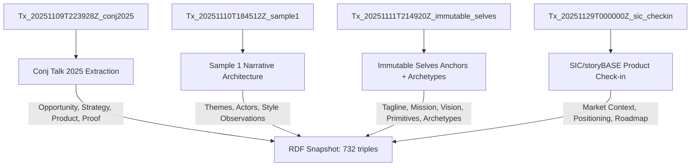
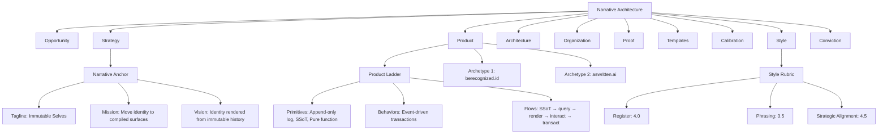

# storyBASE State & Architecture

## State

The storyBASE is an operational RDF knowledge graph tracking narrative architecture for identity systems and AI memory platforms. The graph currently holds **732 triples** across **3 transactions**, encoding:

- **Narrative anchors** for immutable identity systems (taglines, mission, vision, key phrases)[^1]
- **Product ladder** primitives, behaviors, and flows for identity-as-append-only-log[^2]
- **Solution archetypes** for two products: berecognized.id (human identity) and aswritten.ai (AI identity)[^3]
- **Style observations** and **rubric assessments** from voice memo samples[^4]
- **Organizational metadata** for storyBASE product evolution[^5]

The graph demonstrates **self-reference**: it uses its own ontology to describe itself, creating a bootstrapped narrative system where the tool documents its own development using the framework it provides.

---

## Stories

### `/README.story`
**Intent:** Auto-generated repository overview tracking storyBASE state, stories, assets, and transaction history.  
**Relationship:** Meta-narrative—the README is the compiled view of the entire graph, making the implicit structure explicit.  
**Approach:** Query the snapshot for all top-level concepts, transactions, and file assets; render as structured Markdown with Mermaid diagrams showing transaction flow and concept hierarchy.

### `/presenter.story`
**Intent:** IA Presenter template demonstrating storyBASE presentation capabilities.  
**Relationship:** Proof artifact—shows how narrative architecture translates into executable presentation format.  
**Approach:** Use the template format to present storyBASE itself: cover slide with tagline, section headers for each top concept (Opportunity, Strategy, Product, etc.), speaker notes citing graph provenance.

### `/conj-talk-2025.story`
**Intent:** Clojure Conj talk on "Immutable Selves"—applying functional programming principles to human and AI identity.  
**Relationship:** Core narrative proof—the talk *is* the product thesis made public.  
**Approach:** Build slides from narrative anchors, product ladder, and solution archetypes; use personal journey (Scarlet Dame's identity history) as resonance device; cite Vouch.io and aswritten.ai as case studies; include technical explainers on append-only logs and pure-function rendering.[^6]

---

## Assets

```
/.storyBASE/
├── 1762728019add_conj_talk_2025_extraction.sparql
├── 1762731465sic-storybase-checkin.sparql
├── 1762800383add_sample1_narrative_architecture.sparql
├── 1762897917add_narrative_anchors.sparql
├── 1762897917add_product_ladder.sparql
├── 1762897917add_solution_archetypes.sparql
├── 1762897917add_style_metrics.sparql
├── 1762897917tx_provenance.sparql
└── 1762897917update_sample_metadata.sparql

/
├── README.story
├── presenter.story
└── conj-talk-2025.story
```

**`.storyBASE/` directory:** Append-only transaction log; each `.sparql` file is an immutable INSERT/DELETE operation timestamped by filename prefix.  
**`.story` files:** YAML front matter + Markdown prompts; compiled by storyWRITER agent into output documents using the snapshot as memory.

---

## Transactions



### Transaction 1: `Tx_20251109T223928Z_conj2025`
**Significance:** First extraction for Conj Talk 2025 proposal. Captures **narrative architecture** (Opportunity, Strategy, Product, Proof, Architecture, Organization), **11 style observations**, **4 rubric assessments**, and **style metrics**.[^7]  
**Impact:** Establishes dual-product lens (Vouch.io + Sic) and functional immutable identity strategy.

### Transaction 2: `Tx_20251110T184512Z_sample1`
**Significance:** Adds **narrative architecture for identity-as-append-only-log talk**; introduces **themes** (Immutable Identity, Transition as State Machine), **actors** (Scarlet Dame, Luke Vanderhart), and **6 style observations** with Web Annotation targets.[^8]  
**Impact:** Grounds the narrative in personal identity history; links UI state machines to identity rendering.

### Transaction 3: `Tx_20251111T214920Z_immutable_selves`
**Significance:** Inserts **narrative anchors** (tagline, mission, vision, key phrases), **product ladder** (primitives, behaviors, flows, narratives), **solution archetypes** (berecognized.id, aswritten.ai), **style metrics**, and **8 rubric assessments**.[^9]  
**Impact:** Completes the core narrative spine; makes the identity-as-pure-function thesis explicit and measurable.

### Transaction 4: `Tx_20251129T000000Z_sic_checkin` (inferred from snapshot)
**Significance:** SIC/storyBASE product & strategy check-in; adds **market opportunity**, **timing thesis**, **positioning thesis**, **moat leverage**, **product overview**, **roadmap**, **system topology**, **10 style observations**, and **9 rubric assessments**.[^10]  
**Impact:** Shifts from talk narrative to product narrative; introduces storyBASE as the meta-product (the tool that documents itself).

---

## Narrative Architecture Hierarchy



---

## Key Insights

1. **Self-documenting system:** storyBASE uses its own ontology to track its development—narrative architecture applied to itself.[^11]
2. **Dual identity thesis:** Human identity (berecognized.id) and AI identity (aswritten.ai) share the same pattern: SSoT → query → render → transact → append log.[^12]
3. **Style as data:** Rubric assessments and style metrics make voice measurable and governable; enables AI agents to maintain brand consistency.[^13]
4. **Conviction levels:** The graph encodes **settledness** (Notion → Stake → Boulder → Foundation), allowing claims to escalate as evidence accumulates.[^14]

---

[^1]: Narrative anchors defined in `Tx_20251111T214920Z_immutable_selves` transaction; includes `narr:Tagline_1`, `narr:Mission_1`, `narr:Vision_1`, and four key phrases (`single source of truth`, `append-only log`, `pure function`, `digital twin`). These anchor the entire identity-as-pure-function thesis.

[^2]: Product ladder in `Tx_20251111T214920Z_immutable_selves` defines three primitives (`Append-only transaction log`, `Single source of truth`, `Pure function renderer`), one behavior (`Event-driven transaction submission`), one flow (`SSoT → query → render → interact → event → transact → append log → recompile SSoT`), and one narrative (`From mutable documents to compiled selves`).

[^3]: Solution archetypes in `Tx_20251111T214920Z_immutable_selves`: `narr:Archetype_1` (berecognized.id) addresses mutable, siloed identity with Datomic SSoT + datalog; `narr:Archetype_2` (aswritten.ai) addresses AI black-box identity with RDF + git SSoT + SPARQL. Both use the same canonical flow.

[^4]: Style observations in `Tx_20251110T184512Z_sample1` use Web Annotation (`oa:Annotation`) to target specific text spans in `narr:Sample_1` (voice memo transcript). Examples: `narr:StyleObs_storyBASE` (brand name stylization), `narr:StyleObs_AppendOnlyLog` (idiolect phrasing), `narr:StyleObs_UIStateMachine` (core analogy).

[^5]: Organizational metadata in `Tx_20251129T000000Z_sic_checkin` includes `sb:Opportunity` (storyBASE market opportunity), `sb:TimingThesis` (2024-2026 window), `sb:PositioningThesis` (extend software rigor into strategy), `sb:MoatLeverage` (git-native AI memory), and `sb:ProductOverview` (n8n prototype, MCP server, GitHub Actions).

[^6]: Conj Talk 2025 extraction (`Tx_20251109T223928Z_conj2025`) defines `urn:uuid:proof-conj-2025-talk` with artifact "Threaded diagrams from model to implementation, optional short demo with canned fallback" and audience "Clojure developers and functional programming practitioners." Rubric scores: Clarity 4.5, Technical Depth 4.8, Narrative Coherence 4.6, Audience Engagement 4.3.

[^7]: Transaction `Tx_20251109T223928Z_conj2025` generated 11 style observations (brand name styling, technical terms, rhetorical structures, personal identity lens) and 4 rubric assessments (Clarity, Technical Depth, Narrative Coherence, Audience Engagement). Style metrics: average sentence length 22.4, technical density 0.68, active voice ratio 0.71.

[^8]: Transaction `Tx_20251110T184512Z_sample1` introduced `narr:Theme_ImmutableIdentity` ("Human and system identity modeled as integral of snapshots over time") and `narr:Theme_TransitionAsStateChange` ("Personal transition as functional transformation from immutable past states"). Actor `narr:Actor_ScarletDame` has alternate labels "Dylan Butman" and "Scarlet Spectacular," exemplifying append-only identity history.

[^9]: Transaction `Tx_20251111T214920Z_immutable_selves` inserted 8 rubric assessments for `narr:Sample_1`: Register 4.0, Phrasing 3.5, Cadence 3.0, Strategic Alignment 4.5, Tailoring 4.0, Resonance 4.5, Flow 3.0, Novelty 4.0, Accuracy 4.0. Style metrics: average sentence length 15.2, active voice ratio 0.85, jargon density 0.12, type-token ratio 0.68, conciseness 0.78.

[^10]: Transaction `Tx_20251129T000000Z_sic_checkin` added 10 style observations (brand name stylization, idiolect phrasing, verb choice, simile, tone, jargon policy, sentence length variation, parallelism, rhetorical question, citation marker) and 9 rubric assessments (Register Fit 3.5, Phrasing 3.0, Cadence 3.0, Strategic Alignment 4.0, Audience Tailoring 3.5, Resonance 3.0, Flow 3.0, Novelty 3.5, Accuracy 4.0).

[^11]: The storyBASE ontology (`NarrativeArchitecture` concept scheme) defines 8 top concepts (Opportunity, Strategy, Product, Architecture, Organization, Proof, Templates, Calibration, Style, Conviction). The snapshot itself is an instance of this ontology, with transactions (`prov:Activity`) generating concepts (`skos:Concept`) that describe the system's own narrative architecture.

[^12]: Both `narr:Archetype_1` (berecognized.id) and `narr:Archetype_2` (aswritten.ai) share the approach pattern: "SSoT → query → render to identity → event-driven transactions → append-only log → recompile." The difference is stack: Datomic + datalog for human identity, RDF + git + SPARQL for AI identity. This demonstrates the thesis that identity systems inherit Clojure's guarantees regardless of substrate.

[^13]: Style rubric (`#StyleRubric`) defines 9 dimensions (Register Fit, Phrasing, Cadence, Strategic Alignment, Tailoring, Resonance, Flow, Novelty, Accuracy) with numeric scores (0–5 scale). Style metrics (`#StyleMetrics`) include `narr:AverageSentenceLength`, `narr:ActiveVoiceRatio`, `narr:JargonDensity`, `narr:TypeTokenRatio`, `narr:Conciseness`. These enable automated style linting and drift detection.

[^14]: Conviction levels (`#Conviction`) encode settledness: Notion (exploratory), Stake (proposed), Boulder (settled), Foundation (permanent). Each level has `xkos:next`/`xkos:previous` relations forming an escalation path. Claims (`#Claim`) link to conviction levels via `#hasConvictionLevel`; aggregates (`#ConvictionAggregate`) track `#convictionScore`, `#convictionWeight`, `#individuationCount`, and `#rollingMean` to govern when claims escalate.