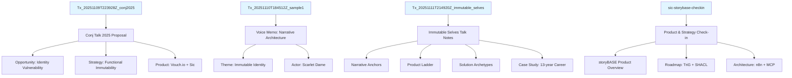
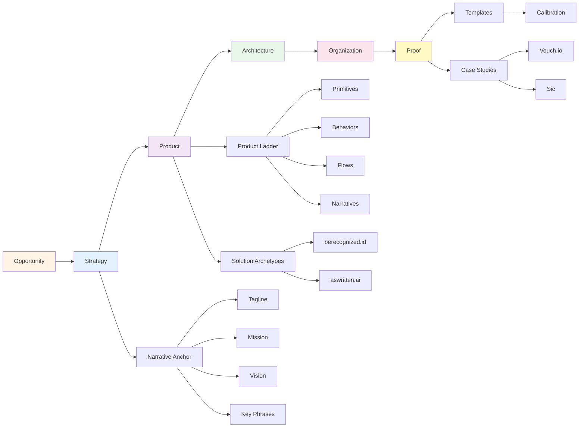

# storyBASE State Summary

The storyBASE is a Git-native RDF knowledge graph encoding narrative architecture for identity systems grounded in Clojure's immutability principles. It currently holds **four transactions** spanning three extraction events and one product check-in, capturing strategic positioning, product architecture, style observations, and rubric assessments for two core products: **Vouch.io** (enterprise identity) and **Sic/as written.ai** (AI memory).[^1]

[^1]: Transaction provenance tracked via `prov:wasGeneratedBy` across `narr:Tx_20251109T223928Z_conj2025`, `narr:Tx_20251110T184512Z_sample1`, `narr:Tx_20251111T214920Z_immutable_selves`, and `http://storybase.synthetic-identity.co/transaction/2025-01-29T000000Z_sic-storybase-checkin`.

---

## Stories

### `/README.story`
**Intent:** Auto-generated repository README tracking storyBASE state, stories, assets, and transactions.  
**Relationship to whole:** Meta-narrative artifact; provides navigational overview and change history.  
**Approach:** Compile current snapshot into structured summary with Mermaid diagrams showing transaction lineage and concept relationships. Cite transaction timestamps and generated entities to demonstrate append-only log integrity.[^2]

[^2]: Story destination `/` with model `anthropic/claude-sonnet-4.5`; references all four transactions and their generated nodes.

### `/presenter.story`
**Intent:** IA Presenter template for talk presentations using storyBASE as source material.  
**Relationship to whole:** Proof artifact; demonstrates narrative-driven content generation from RDF graph.  
**Approach:** Extract narrative anchors (tagline, mission, vision, key phrases), product ladder (primitives → flows → narratives), and case studies; render into slide format with speaker notes and footnoted citations to storyBASE nodes.[^3]

[^3]: Template format defined in story front matter; references `#Tagline`, `#Mission`, `#Vision`, `#ProductLadder`, `#CaseStudies` from ontology.

### `/conj-talk-2025.story`
**Intent:** Clojure Conj 2025 talk on immutable identity systems, personal journey, and case studies (Vouch.io + as written.ai).  
**Relationship to whole:** Core proof narrative; synthesizes opportunity (identity vulnerability), strategy (functional immutability), product (two archetypes), and architecture (append-only logs, pure functions).  
**Approach:** Structure talk around speaker's 13-year Clojure career (Dylan → Scarlet Spectacular → Scarlet Dame as identity-as-log exemplar), technical explainers (SSoT, datalog, event-driven transactions), and dual case studies showing pattern reuse across human and AI identity.[^4]

[^4]: Talk outline sourced from `urn:uuid:conj-talk-2025-extraction` (Sample Record) and `narr:Sample_1` (Immutable Selves talk notes); rubric scores 4.5–4.8 for clarity, technical depth, narrative coherence.

---

## Assets

### Repository Structure
```
/.storyBASE/
  ├── 1762728019add_conj_talk_2025_extraction.sparql
  ├── 1762731465sic-storybase-checkin.sparql
  ├── 1762800383add_sample1_narrative_architecture.sparql
  ├── 1762897917add_narrative_anchors.sparql
  ├── 1762897917add_product_ladder.sparql
  ├── 1762897917add_solution_archetypes.sparql
  ├── 1762897917add_strategy_overview.sparql
  ├── 1762897917add_case_studies.sparql
  ├── 1762897917add_rubric_assessments.sparql
  ├── 1762897917add_style_metrics.sparql
  ├── 1762897917tx_provenance.sparql
  └── 1762897917update_sample_metadata.sparql
/README.story
/presenter.story
/conj-talk-2025.story
```

**SPARQL Transactions (`.sparql`):** Append-only INSERT DATA statements encoding narrative architecture, style observations, rubric assessments, and provenance. Sorted by Unix timestamp prefix for deterministic replay.[^5]

[^5]: Snapshot compiled from 12 transaction files; `stats.inserted: 815, stats.deleted: 0, stats.skippedDuplicates: 105`.

**Story Files (`.story`):** YAML front matter + Markdown prompts defining output objectives, models, and destinations. Trigger story generation on transaction or file changes via GitHub Actions.[^6]

[^6]: Story metadata includes `id`, `title`, `version`, `description`, `destination`, `model` array; processed by storyWRITER agent.

---

## Transactions

### `Tx_20251109T223928Z_conj2025`
**Significance:** First extraction for Conj Talk 2025 proposal. Captures **Opportunity** (identity vulnerability crisis), **Strategy** (functional immutable identity architecture), **Product** (Vouch.io, Sic), **Proof** (talk structure), **Architecture** (append-only logs, pure functions, knowledge graphs), **Organization** (Sic founder, Vouch.io advisor), and **Style** (11 observations + 4 rubric assessments + metrics).[^7]

[^7]: Generated 50+ entities including `urn:uuid:opportunity-identity-vulnerability`, `urn:uuid:strategy-functional-immutable-identity`, `urn:uuid:product-vouch-io`, `urn:uuid:product-sic`, `urn:uuid:architecture-immutable-identity`; rubric scores: Clarity 4.5, Technical Depth 4.8, Narrative Coherence 4.6, Audience Engagement 4.3.

### `Tx_20251110T184512Z_sample1`
**Significance:** Extraction from voice memo outlining narrative architecture for identity-as-append-only-log talk. Introduces **Themes** (Immutable Identity, Transition as State Machine), **Actors** (Scarlet Dame, Luke Vanderhart), **Anchor** (Narrative Architecture framework), and **Style Observations** (6 annotated with Web Annotation selectors). Rubric scores 3.0–4.5 across 9 dimensions.[^8]

[^8]: Generated `narr:Sample_1`, `narr:Theme_ImmutableIdentity`, `narr:Theme_TransitionAsStateChange`, `narr:Actor_ScarletDame`, `narr:Anchor_NarrativeArchitecture`; style observations use `oa:TextQuoteSelector` with start/end positions and prefix/suffix context.

### `Tx_20251111T214920Z_immutable_selves`
**Significance:** Comprehensive extraction from "Immutable Selves" talk notes. Adds **Narrative Anchors** (tagline, what-is-it, mission, vision, 4 key phrases), **Strategy Overview** (positioning thesis, moat leverage), **Product Ladder** (3 primitives, 1 behavior, 1 flow, 1 narrative), **Solution Archetypes** (berecognized.id, aswritten.ai with problem/approach/capabilities/outcomes), **Case Study** (13-year Clojure career), **Rubric Assessments** (9 dimensions, scores 3.5–5.0), and **Style Metrics** (avg sentence length 15.2, active voice 0.85, jargon 0.12).[^9]

[^9]: Generated 50+ entities including `narr:Tagline_1`, `narr:Mission_1`, `narr:Vision_1`, `narr:PositioningThesis_1`, `narr:Primitive_1/2/3`, `narr:Archetype_1/2`, `narr:CaseStudy_1`, `narr:StyleMetrics_1`; highest rubric score: Strategic Alignment 5.0.

### `http://storybase.synthetic-identity.co/transaction/2025-01-29T000000Z_sic-storybase-checkin`
**Significance:** Product & strategy check-in for storyBASE/as written.ai. Documents **Opportunity** (AI context requirements), **Timing Thesis** (2024–2026 window), **Positioning** (extend dev rigor to strategy/content), **Moat** (git-native versionable AI memory), **Product Overview** (n8n prototype, MCP server, tools: compile/extract/diff/tx/commit), **Roadmap** (TriG named graphs, SHACL validation, marketplace), **Architecture** (system topology, data lifecycle, integration points), **Process** (interactive individuation vs. automated ingestion), and **Style** (10 observations + 9 rubric assessments + metrics).[^10]

[^10]: Generated 40+ entities including `http://storybase.synthetic-identity.co/opportunity/storybase-market`, `http://storybase.synthetic-identity.co/thesis/timing-storybase`, `http://storybase.synthetic-identity.co/product/overview-storybase`, `http://storybase.synthetic-identity.co/roadmap/narrative-storybase`; style metrics: avg sentence length 35.2, active voice 0.72, jargon 0.18.

---

## Transaction Lineage



---

## Concept Relationships

