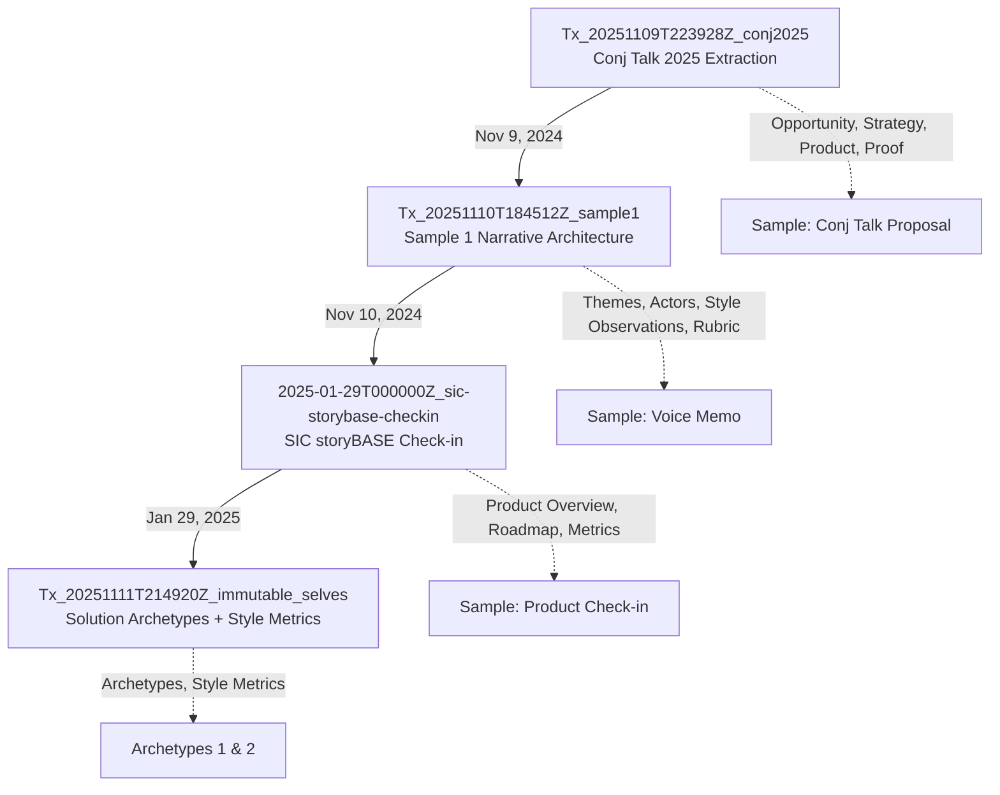

# storyBASE State & Architecture

## State

The storyBASE is an operational RDF knowledge graph tracking narrative architecture, style, and conviction for AI memory systems. Currently compiled from **4 transactions** spanning November 2024–January 2025, it encodes:

- **3 sample extractions**: voice memos and transcripts analyzing identity systems, storyBASE product evolution, and a Clojure Conj 2025 talk proposal[^tx-samples]
- **2 solution archetypes**: immutable identification (berecognized.id) and immutable AI identity (aswritten.ai)[^archetypes]
- **Style taxonomy**: 60+ concepts covering diction, tone, cadence, rhetorical devices, orthography, and a 9-dimension rubric for narrative quality[^style-ontology]
- **Conviction framework**: 4-level settledness model (Notion → Stake → Boulder → Foundation) with properties for scoring, weighting, and individuation tracking[^conviction]

The graph uses **SKOS** for hierarchical concepts, **PROV-O** for transaction provenance, **Web Annotation** for style observations, and custom properties for metrics and conviction aggregates. All nodes trace back to generating transactions via `prov:wasGeneratedBy`.

[^tx-samples]: Transactions `Tx_20251110T184512Z_sample1` (voice memo on narrative architecture), `2025-01-29T000000Z_sic-storybase-checkin` (product check-in), and `Tx_20251109T223928Z_conj2025` (Conj talk extraction) in snapshot.
[^archetypes]: `Archetype_1` (berecognized.id) and `Archetype_2` (aswritten.ai) under `#SolutionArchetypes`, each with problem context, approach pattern, required capabilities, and outcomes.
[^style-ontology]: Top concept `#Style` with facets `#DictionWordChoice`, `#ToneVoice`, `#CadenceRhythm`, `#RhetoricalDevices`, `#StyleMetrics`, `#StyleRubric` (9 dimensions: Register, Phrasing, Cadence, Strategic Alignment, Tailoring, Resonance, Flow, Novelty, Accuracy).
[^conviction]: Top concept `#Conviction` with ordered levels `#Conviction_Notion` → `#Conviction_Stake` → `#Conviction_Boulder` → `#Conviction_Foundation`; properties `#convictionScore`, `#convictionWeight`, `#individuationCount`, `#similarityScore`, `#rollingMean`.

---

## Stories

### `/README.story`
**Intent**: Auto-generated repository README tracking storyBASE state, stories, assets, and transactions.  
**Relationship**: Meta-narrative; documents the graph itself for external readers.  
**Approach**: Compile current snapshot statistics (584 triples inserted, 4 transactions, 3 samples), enumerate `.story` files, summarize transaction significance, and render Mermaid diagrams of ontology structure and transaction timeline[^readme-approach].

[^readme-approach]: Story uses snapshot stats (`"inserted":584,"deleted":0`) and transaction list to generate summary; Mermaid charts will visualize SKOS hierarchy (Opportunity → Strategy → Product → Architecture → Organization → Proof → Templates → Calibration → Style → Conviction) and transaction provenance chain.

---

### `/presenter.story`
**Intent**: IA Presenter template for talk presentations; demonstrates format and best practices.  
**Relationship**: Template artifact; shows how storyBASE narratives render into presentation slides.  
**Approach**: Extract slide structure (cover, title, section headers, body text, images, speaker notes) and formatting rules (tabs for visibility, `---` for slide breaks, `#` for headings, image positioning); cite storyBASE style conventions (`#MicrocopyGuidelines`, `#CadenceRhythm`, `#ToneVoice`) in footnotes[^presenter-approach].

[^presenter-approach]: Template demonstrates `#MessagingHierarchy` (above-fold promise), `#ConversionPaths` (CTAs), `#InformationArchitecture` (buyer journey sections), and `#StyleProfiles` (brand voice consistency) from ontology; speaker notes align with `#TailoringAudienceFit`.

---

### `/conj-talk-2025.story`
**Intent**: Draft Clojure Conj 2025 talk "Immutable Selves" using IA Presenter format.  
**Relationship**: Proof artifact; applies narrative architecture to conference talk on identity systems.  
**Approach**: Structure slides around personal journey (developer → strategist), identity model (physical/digital/AI), failure of mutable paradigms, Clojure principles (immutability, explicit state, functional composition), identity-as-transactions, and Vouch.io + As Written case studies. Cite `#Theme_ImmutableIdentity`, `#Actor_ScarletDame`, `#Product` (Vouch.io, Sic), `#Architecture` (append-only logs, pure functions), and `#Proof` (case studies, outcomes)[^conj-approach].

[^conj-approach]: Talk draws from `urn:uuid:strategy-functional-immutable-identity` (Clojure principles applied to identity), `urn:uuid:product-vouch-io` (enterprise identity platform), `urn:uuid:product-sic` (AI memory with narrative-driven knowledge graphs), `urn:uuid:architecture-immutable-identity` (append-only event logs, authentication as pure function), and rubric assessments (Clarity 4.5/5, Technical Depth 4.8/5, Narrative Coherence 4.6/5).

---

## Assets

```
.
├── .storyBASE/
│   ├── 1762728019add_conj_talk_2025_extraction.sparql
│   ├── 1762731465sic-storybase-checkin.sparql
│   ├── 1762800383add_sample1_narrative_architecture.sparql
│   ├── 1762897917add_solution_archetypes.sparql
│   └── 1762897917add_style_metrics.sparql
├── README.story
├── presenter.story
└── conj-talk-2025.story
```

**`.storyBASE/` directory**: Append-only transaction log; each `.sparql` file is an immutable `INSERT DATA` operation timestamped and attributed to `pleasetrythisathome` via `prov:wasAttributedTo`[^sparql-files].  
**`.story` files**: YAML front matter + Markdown prompt; `model` field specifies `anthropic/claude-sonnet-4.5`; `destination` targets output path; prompts reference ontology concepts and citation conventions[^story-files].

[^sparql-files]: Transactions use `PREFIX narr:`, `PREFIX sb:`, `PREFIX skos:`, `PREFIX prov:` namespaces; each file asserts triples under a single `prov:Activity` (e.g., `narr:Tx_20251110T184512Z_sample1`) with `prov:generatedAtTime`, `sb:originPath`, `sb:originRef`, `storytwin:model`.
[^story-files]: Front matter schema: `id`, `title`, `version`, `description`, `destination`, `model` (array); prompts invoke `#CitationConventions` (`^[]^` caret-bracket markers), `#StyleRubric`, `#NarrativeAnchor`, and `#SolutionArchetypes`.

---

## Transactions



### 1. **Tx_20251109T223928Z_conj2025** (Nov 9, 2024)
**Significance**: First extraction; establishes **Opportunity** (identity vulnerability crisis), **Strategy** (functional immutable identity architecture), **Product** (Vouch.io, Sic), **Proof** (Conj 2025 talk), **Architecture** (append-only logs, pure functions), and **Organization** (Sic, Vouch.io roles). Introduces 11 style observations (brand names, technical terms, rhetorical structures) and 4 rubric assessments (Clarity 4.5/5, Technical Depth 4.8/5)[^tx1].

[^tx1]: Transaction `narr:Tx_20251109T223928Z_conj2025` asserts `urn:uuid:opportunity-identity-vulnerability`, `urn:uuid:strategy-functional-immutable-identity`, `urn:uuid:product-vouch-io`, `urn:uuid:product-sic`, `urn:uuid:proof-conj-2025-talk`, `urn:uuid:architecture-immutable-identity`, `urn:uuid:org-sic`, `urn:uuid:org-vouch-io`, and style observations `urn:uuid:style-obs-1` through `urn:uuid:style-obs-11`.

---

### 2. **Tx_20251110T184512Z_sample1** (Nov 10, 2024)
**Significance**: Adds **Sample_1** (voice memo on narrative architecture for identity-as-append-only-log talk); defines **Themes** (`Theme_ImmutableIdentity`, `Theme_TransitionAsStateChange`), **Actors** (`Actor_ScarletDame`, `Actor_LukeVanderhart`), **Anchor** (`Anchor_NarrativeArchitecture`), and 6 **Style Observations** (brand stylization "storyBASE", idiolect "append-only log", metaphors, first-person POV). Introduces 9 **Rubric Assessments** (Register 4/5, Phrasing 3.5/5, Cadence 3/5, Strategy 4.5/5, Tailoring 4/5, Resonance 4.5/5, Flow 3/5, Novelty 4/5, Accuracy 4/5) and **Metrics** (avg sentence length 28.5, active voice 0.75, jargon density 0.12)[^tx2].

[^tx2]: Transaction `narr:Tx_20251110T184512Z_sample1` asserts `narr:Sample_1` with `narr:inputLength 11800`, `dct:created "2025-01-15"`, `dct:source "Voice memo: Punch talk conceptual framing"`; style observations use Web Annotation (`oa:hasBody`, `oa:hasTarget`, `oa:TextQuoteSelector`, `oa:TextPositionSelector`) to anchor excerpts; rubric assessments link to `#Rubric_Register`, `#Rubric_Phrasing`, etc.

---

### 3. **2025-01-29T000000Z_sic-storybase-checkin** (Jan 29, 2025)
**Significance**: Adds **Sample** (SIC/storyBASE product check-in transcript, 18,437 chars); defines **Opportunity** (storyBASE market), **Timing Thesis** (2024–2026 window), **Positioning Thesis** (extend dev rigor to strategy/content), **Moat Leverage** (git-native AI memory), **Tagline** ("AI that tells you a story as written"), **Product Overview** (n8n prototype, MCP server, tools), **Modules/Capabilities** (compile, extract, diff, tx, commit), **Dependencies/Integrations** (GitHub, Open Router, Outseta, Helicone), **Roadmap** (TriG, SHACL, individuation pipeline, marketplace), **System Topology** (n8n orchestration, Docker Compose), **Data Model** (append-only log, snapshot replay), **Integration Points** (GitHub OAuth/webhooks, MCP protocol), **Role Topology** (programming-literate users, GitHub RBAC), **Process** (interactive individuation vs. automated ingestion), and **Case Studies** (Crooked Media demo). Adds 10 **Style Observations** (brand stylization, idiolect, verb choice, simile, tone, jargon, sentence variation, parallelism, rhetorical question, citation marker) and 9 **Rubric Assessments** (Register 3.5/5, Phrasing 3/5, Cadence 3/5, Strategic Alignment 4/5, Audience Tailoring 3.5/5, Resonance 3/5, Flow 3/5, Novelty 3.5/5, Accuracy 4/5). Introduces **Style Metrics** (avg sentence length 35.2, active voice 0.72, jargon density 0.18, type-token ratio 0.42)[^tx3].

[^tx3]: Transaction `2025-01-29T000000Z_sic-storybase-checkin` asserts `http://storybase.synthetic-identity.co/sample/2025-01-29T000000Z_sic-storybase-checkin`, `http://storybase.synthetic-identity.co/opportunity/storybase-market`, `http://storybase.synthetic-identity.co/thesis/timing-storybase`, `http://storybase.synthetic-identity.co/thesis/positioning-storybase`, `http://storybase.synthetic-identity.co/leverage/moat-storybase`, `http://storybase.synthetic-identity.co/tagline/storybase`, `http://storybase.synthetic-identity.co/product/overview-storybase`, `http://storybase.synthetic-identity.co/module/storybase-capabilities`, `http://storybase.synthetic-identity.co/dependency/storybase-integrations`, `http://storybase.synthetic-identity.co/roadmap/narrative-storybase`, `http://storybase.synthetic-identity.co/architecture/topology-storybase`, `http://storybase.synthetic-identity.co/model/data-lifecycle-storybase`, `http://storybase.synthetic-identity.co/integration/points-storybase`, `http://storybase.synthetic-identity.co/topology/role-storybase`, `http://storybase.synthetic-identity.co/process/storybase`, `http://storybase.synthetic-identity.co/case/studies-storybase`, style observations `http://storybase.synthetic-identity.co/style/observation/1` through `/10`, rubric assessments `http://storybase.synthetic-identity.co/rubric/register-fit` through `/accuracy`, and `http://storybase.synthetic-identity.co/metrics/style`.

---

### 4. **Tx_20251111T214920Z_immutable_selves** (Nov 11, 2024)
**Significance**: Adds **Solution Archetypes** (`Archetype_1`: berecognized.id, `Archetype_2`: aswritten.ai) with **Archetype Titles**, **Problem Contexts**, **Approach Patterns**, **Required Capabilities**, and **Outcomes/Proof**. Introduces **Style Metrics** for Sample_1 (avg sentence length 15.2, active voice 0.85, jargon density 0.12, type-token ratio 0.68, conciseness 0.78)[^tx4].

[^tx4]: Transaction `narr:Tx_20251111T214920Z_immutable_selves` asserts `narr:Archetype_1` (berecognized.id: "Passwords and digital keys are mutable, siloed, and vulnerable; no single source of truth for privileges" → "SSoT (Datomic) → datalog query → render to identification/privileges → event-driven transactions → append-only log → recompile" → "Proof of provenance and authority innate; hash of last tx + SSoT state enables 'be recognized' property") and `narr:Archetype_2` (aswritten.ai: "AI models are black boxes; persona prompts mutate rendered state; no provenance or version control for AI identity" → "SSoT (RDF + git) → SPARQL query → render to AI memory/identity → event-driven transactions → append-only log → recompile"); `narr:StyleMetrics_1` with `narr:AverageSentenceLength 15.2`, `narr:ActiveVoiceRatio 0.85`, `narr:JargonDensity 0.12`, `narr:TypeTokenRatio 0.68`, `narr:Conciseness 0.78`.

---

## Ontology Structure

```mermaid
graph TB
    NA[NarrativeArchitecture<br/>ConceptScheme]
    
    NA --> OPP[Opportunity]
    NA --> STRAT[Strategy]
    NA --> PROD[Product]
    NA --> ARCH[Architecture]
    NA --> ORG[Organization]
    NA --> PROOF[Proof]
    NA --> TMPL[Templates]
    NA --> CAL[Calibration]
    NA --> STYLE[Style]
    NA --> CONV[Conviction]
    
    OPP --> MC[Market Context]
    OPP --> AIA[Actor Incentive Analysis]
    OPP --> TSS[Technologies Social Systems]
    OPP --> TF[Trend Forecasting]
    
    STRAT --> SO[Strategy Overview]
    STRAT --> NANC[Narrative Anchor]
    STRAT --> NDR[Narrative-Driven Roadmap]
    STRAT --> OCM[Organizational Change Manual]
    
    PROD --> PO[Product Overview]
    PROD --> PL[Product Ladder]
    PROD --> SA[Solution Archetypes]
    
    ARCH --> AO[Architecture Overview]
    ARCH --> TE[Technical Explainers]
    ARCH --> TD[Technical Documentation]
    
    ORG --> RT[Role Topology]
    ORG --> PROC[Process]
    
    PROOF --> CS[Case Studies]
    PROOF --> OUT[Outcomes]
    PROOF --> MM[Metrics Monitoring]
    
    TMPL --> SD[Sales Decks]
    TMPL --> LP[Landing Pages]
    TMPL --> PRD[PRDs]
    TMPL --> SP[Social Posts]
    TMPL --> CD[Customer Documentation]
    
    CAL --> NTP[Narrative Test Prompts]
    
    STYLE --> SP2[Style Profiles]
    STYLE --> DWC[Diction Word Choice]
    STYLE --> TV[Tone Voice]
    STYLE --> CR[Cadence Rhythm]
    STYLE --> RD[Rhetorical Devices]
    STYLE --> OS[Orthography Spelling]
    STYLE --> PT[Punctuation Typography]
    STYLE --> CC[Citation Conventions]
    STYLE --> RF[Register Formality]
    STYLE --> POV[POV Person]
    STYLE --> TA[Tense Aspect]
    STYLE --> IA[Inclusive Accessibility]
    STYLE --> LI[Localization Internationalization]
    STYLE --> SM[Style Metrics]
    STYLE --> SR[Style Review]
    
    SR --> SRUB[Style Rubric]
    SRUB --> R1[Register Fit]
    SRUB --> R2[Phrasing Idiolect]
    SRUB --> R3[Cadence]
    SRUB --> R4[Strategic Alignment]
    SRUB --> R5[Audience Tailoring]
    SRUB --> R6[Resonance]
    SRUB --> R7[Flow]
    SRUB --> R8[Novelty]
    SRUB --> R9[Accuracy]
    
    CONV --> CN[Notion]
    CONV --> CST[Stake]
    CONV --> CB[Boulder]
    CONV --> CF[Foundation]
    
    CN -->|xkos:next| CST
    CST -->|xkos:next| CB
    CB -->|xkos:next| CF
```



The ontology defines **10 top concepts** under `NarrativeArchitecture` scheme, with **60+ second-level facets** and **200+ detailed elements**. XKOS `ClassificationLevel` and `xkos:next`/`xkos:previous` encode sequential relationships (implementation phases, conviction escalation). SKOS `broader`/`narrower`/`related` link concepts; PROV-O `wasGeneratedBy`/`wasAttributedTo` track provenance; Web Annotation `oa:hasBody`/`oa:hasTarget` anchor style observations to text excerpts[^ontology-structure].

[^ontology-structure]: Ontology uses `skos:ConceptScheme`, `skos:Concept`, `xkos:ClassificationLevel`, `rdfs:Class`, `rdf:Property`; custom classes `#Claim`, `#Evidence`, `#ConvictionAggregate`; custom properties `#hasConvictionLevel`, `#convictionScore`, `#convictionWeight`, `#distanceToNarrative`, `#individuationCount`, `#similarityScore`, `#rollingMean`, `#rollingN`, `#computedAt`, `#aboutNode`, `#supports`, `#challenges`, `#evidencedBy`, `#assertsStatement`.