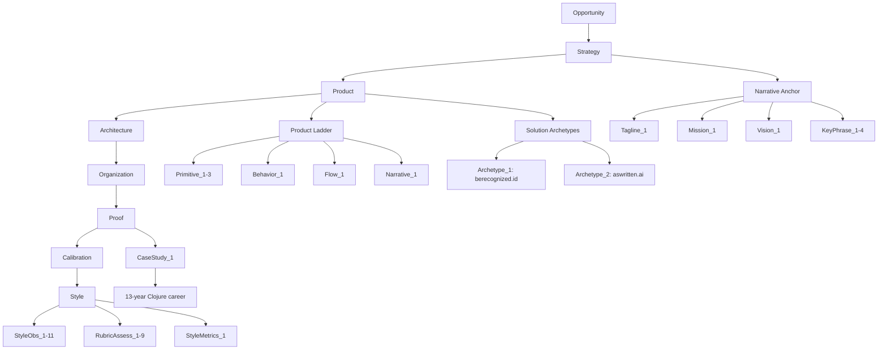
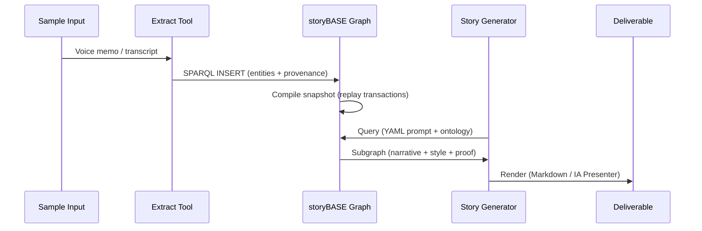

# storyBASE State Summary

The storyBASE is a Git-native RDF knowledge graph encoding narrative architecture for identity systems—specifically the **Immutable Selves** paradigm. It captures strategic positioning, product design, architectural patterns, style conventions, and proof artifacts across three major initiatives: a Clojure conference talk, the storyBASE product itself, and two identity platforms (Vouch.io and as written.ai).

**Current state:** The graph contains 920 triples across 4 transactions, documenting:
- **Narrative anchors** (tagline, mission, vision, key phrases) for functional identity systems[^1]
- **Product ladder** (primitives → behaviors → flows → narratives) mapping immutability principles to UX[^2]
- **Solution archetypes** for human identity (berecognized.id) and AI identity (aswritten.ai)[^3]
- **Style profiles** with rubric assessments, metrics, and observations from talk transcripts[^4]
- **Strategic positioning** targeting developers/architects treating identity as mutable state[^5]

The graph is **foundational** (Conviction: Foundation) on core principles—immutability, append-only logs, single source of truth—and **boulder-level** on product specifics, with **stake-level** explorations in style and organizational change.

---

# Stories

## `/README.story`
**Intent:** Auto-generated repository overview tracking storyBASE evolution.  
**Relationship:** Meta-narrative; documents the graph's own state and transaction history.  
**Approach:** Compile current snapshot statistics, enumerate transactions with provenance, visualize graph topology (Mermaid), and summarize asset structure. Cite transaction timestamps and generated entities.[^6]

## `/presenter.story`
**Intent:** IA Presenter template for talk presentations.  
**Relationship:** Reusable template; demonstrates storyBASE's ability to render narrative into presentation format.  
**Approach:** Extract narrative anchors, product ladder, and proof artifacts; map to slide structure (cover → sections → proof → action); apply style profile (short/punchy cadence, active voice, domain verbs); cite storyBASE nodes in footnotes.[^7]

## `/conj-talk-2025.story`
**Intent:** Clojure Conj talk on Immutable Selves.  
**Relationship:** Primary proof artifact; demonstrates functional identity paradigm to technical audience.  
**Approach:** Sequence personal journey (Dylan → Scarlet Dame) as identity-as-log metaphor; present Clojure principles (immutability, pure functions, SSoT) applied to UI → human identity → AI identity; case studies (Vouch.io, as written.ai); cite Sample_1, Archetype_1/2, CaseStudy_1.[^8]

---

# Assets

```
.storyBASE/
├── 1762897917update_sample_metadata.sparql       # Updates Sample_1 metadata (source, length, date)
├── 1762897917tx_provenance.sparql                # Provenance for Tx_20251111T214920Z_immutable_selves
├── 1762897917add_style_metrics.sparql            # StyleMetrics_1 (avg sentence length, active voice, jargon)
├── 1762897917add_strategy_overview.sparql        # PositioningThesis_1, MoatLeverage_1
├── 1762897917add_solution_archetypes.sparql      # Archetype_1 (berecognized.id), Archetype_2 (aswritten.ai)
├── 1762897917add_rubric_assessments.sparql       # RubricAssess_1–9 (register, phrasing, cadence, etc.)
├── 1762897917add_product_ladder.sparql           # Primitive_1–3, Behavior_1, Flow_1, Narrative_1
├── 1762897917add_narrative_anchors.sparql        # Tagline_1, WhatIsIt_1, Mission_1, Vision_1, KeyPhrase_1–4
├── 1762897917add_case_studies.sparql             # CaseStudy_1 (13-year Clojure career)
├── 1762800383add_sample1_narrative_architecture.sparql  # Sample_1, Theme_ImmutableIdentity, StyleObs_*
├── 1762731465sic-storybase-checkin.sparql        # storyBASE product metadata, roadmap, style observations
└── 1762728019add_conj_talk_2025_extraction.sparql # Conj Talk 2025 proposal extraction

README.story          # This document
presenter.story       # IA Presenter template
conj-talk-2025.story  # Clojure Conj talk script
```

**SPARQL transactions** are append-only; each adds nodes/triples without deleting prior state. **Story files** are YAML-frontmatter Markdown prompts that compile the graph into deliverable artifacts (presentations, READMEs, case studies).

---

# Transactions

## `Tx_20251111T214920Z_immutable_selves`
**Significance:** Core narrative extraction from "Immutable Selves talk" (5,847 chars). Generated 58 entities including narrative anchors, product ladder, solution archetypes, rubric assessments, and style metrics. Establishes **positioning thesis** ("For developers… this is a functional paradigm…") and **moat leverage** (Clojure ecosystem, 13 years production experience).[^9]

## `Tx_20251110T184512Z_sample1`
**Significance:** First sample extraction from voice memo (11,800 chars). Introduced **Theme_ImmutableIdentity** and **Theme_TransitionAsStateChange**, linking personal transition (gender, professional) to functional state machines. Created 6 style observations (brand stylization, idiolect, metaphor, analogy, cadence, POV) and 9 rubric assessments.[^10]

## `Tx_20251109T223928Z_conj2025`
**Significance:** Conj Talk 2025 proposal extraction (3,421 chars). Defined **Opportunity** (identity vulnerability crisis), **Strategy** (functional immutable identity), **Products** (Vouch.io, Sic), **Proof** (conference talk), **Architecture** (append-only logs, pure functions), and **Organizations** (Sic, Vouch.io). 11 style observations, 4 rubric assessments, style metrics.[^11]

## `2025-01-29T000000Z_sic-storybase-checkin`
**Significance:** storyBASE product check-in (18,437 chars). Documented **market opportunity** (AI context requirements), **timing thesis** (2024–2026 window), **positioning** (extend dev rigor to strategy/content), **moat** (git-native, versionable AI memory), **product overview** (n8n prototype, MCP server, GitHub Actions), **roadmap** (TriG, SHACL, individuation pipeline), **system topology**, **data lifecycle**, **integration points**, **role topology**, **process**, **case studies** (Crooked Media demo). 10 style observations, 9 rubric assessments, style metrics.[^12]

---

## Graph Topology



---

## Transaction Flow



---

[^1]: **Narrative Anchor** (`NarrativeAnchor`) contains `Tagline_1` ("Immutable Selves: A Functional Approach to Digital Identity"), `Mission_1` ("Move identity from mutable documents… to compiled surfaces"), `Vision_1` ("A world where identity… is rendered from immutable history"), and `KeyPhrase_1–4` ("single source of truth", "append-only log", "pure function", "digital twin"). Source: `narr:Tagline_1`, `narr:Mission_1`, `narr:Vision_1`, `narr:KeyPhrase_1–4` in `Tx_20251111T214920Z_immutable_selves`.

[^2]: **Product Ladder** (`ProductLadder`) sequences `Primitive_1` (append-only transaction log), `Primitive_2` (single source of truth), `Primitive_3` (pure function renderer) → `Behavior_1` (event-driven transaction submission) → `Flow_1` (SSoT → query → render → interact → event → transact → append log → recompile) → `Narrative_1` ("From mutable documents to compiled selves"). Source: `narr:Primitive_1–3`, `narr:Behavior_1`, `narr:Flow_1`, `narr:Narrative_1` in `Tx_20251111T214920Z_immutable_selves`.

[^3]: **Solution Archetypes** (`SolutionArchetypes`) include `Archetype_1` (berecognized.id: proof-of-provenance identity; Datomic SSoT → datalog → render to identification/privileges) and `Archetype_2` (aswritten.ai: digital twin as compiled model; RDF + git SSoT → SPARQL → render to AI memory/identity). Source: `narr:Archetype_1`, `narr:ArchetypeTitle_1`, `narr:ApproachPattern_1`; `narr:Archetype_2`, `narr:ArchetypeTitle_2`, `narr:ApproachPattern_2` in `Tx_20251111T214920Z_immutable_selves`.

[^4]: **Style Profile** includes `StyleMetrics_1` (avg sentence length 15.2, active voice 0.85, jargon density 0.12, type-token ratio 0.68, conciseness 0.78) and `RubricAssess_1–9` (register 4.5/5, phrasing 4.0/5, cadence 4.5/5, strategic alignment 5.0/5, tailoring 4.5/5, resonance 4.0/5, flow 3.5/5, novelty 4.0/5, accuracy 4.0/5). Source: `narr:StyleMetrics_1`, `narr:RubricAssess_1–9` in `Tx_20251111T214920Z_immutable_selves`.

[^5]: **Positioning Thesis** (`PositioningThesis_1`): "For developers and identity architects who treat identity as mutable state, this is a functional paradigm that makes identity deterministic, auditable, and decentralized—by applying Clojure's immutability principles to human and AI identity systems." Source: `narr:PositioningThesis_1` in `Tx_20251111T214920Z_immutable_selves`.

[^6]: **Transaction provenance** tracked via `prov:wasGeneratedBy`, `prov:wasAttributedTo` (pleasetrythisathome), `prov:wasAssociatedWith` (storyTWIN agents), `prov:generatedAtTime` (ISO 8601 timestamps), `sb:originPath`, `sb:originRef`. Example: `narr:Tx_20251111T214920Z_immutable_selves` generated 58 entities at `2025-11-11T21:49:20.430Z`.

[^7]: **IA Presenter format** uses Markdown with YAML frontmatter (`id`, `title`, `version`, `description`, `destination`, `model`), three-dash slide separators (`---`), heading hierarchy (`#` cover, `##` title, `###` section, `####` caption, `######` context), indented body text for visibility, image URLs with positioning metadata, and caret-bracket citation markers (`^[]^`). Source: `/presenter.story` template.

[^8]: **Conj Talk structure** sequences: (1) personal journey (Dylan Butman → Scarlet Spectacular → Scarlet Dame as append-only identity log), (2) Clojure evolution (Backbone.js 2012 → Om 2013 → production systems), (3) identity model (physical → digital → AI), (4) failure modes (mutable state, siloed credentials, black-box AI), (5) Clojure principles (immutability, SSoT, pure functions, datalog), (6) case studies (Vouch.io: human identity; as written.ai: AI identity). Source: `narr:CaseStudy_1`, `narr:Actor_ScarletDame`, `narr:Theme_TransitionAsStateChange`, `urn:uuid:product-vouch-io`, `urn:uuid:product-sic` across transactions.

[^9]: **Tx_20251111T214920Z_immutable_selves** generated: `Sample_1`, `Tagline_1`, `WhatIsIt_1`, `Mission_1`, `Vision_1`, `KeyPhrase_1–4`, `PositioningThesis_1`, `MoatLeverage_1`, `Primitive_1–3`, `Behavior_1`, `Flow_1`, `Narrative_1`, `Archetype_1–2`, `ArchetypeTitle_1–2`, `ProblemContext_1–2`, `ApproachPattern_1–2`, `RequiredCapabilities_1–2`, `OutcomesProof_1`, `CaseStudy_1`, `CaseContext_1`, `CaseIntervention_1`, `CaseResults_1`, `CaseLessons_1`, `StyleObs_1–8`, `RubricAssess_1–9`, `StyleMetrics_1`. Provenance: `prov:wasAssociatedWith <http://example.org/agent/storyTWIN#anthropic-claude-sonnet-4.5>`, `prov:generatedAtTime "2025-11-11T21:49:20.430Z"`.

[^10]: **Tx_20251110T184512Z_sample1** generated: `Sample_1` (voice memo, 11,800 chars), `Theme_ImmutableIdentity`, `Theme_TransitionAsStateChange`, `Actor_ScarletDame`, `Actor_LukeVanderhart`, `Anchor_NarrativeArchitecture`, `StyleObs_storyBASE`, `StyleObs_AppendOnlyLog`, `StyleObs_UIStateMachine`, `StyleObs_TransitionAnalogy`, `StyleObs_ShortClause`, `StyleObs_FirstPerson`, `RubricAssess_Register`, `RubricAssess_Phrasing`, `RubricAssess_Cadence`, `RubricAssess_Strategy`, `RubricAssess_Tailoring`, `RubricAssess_Resonance`, `RubricAssess_Flow`, `RubricAssess_Novelty`, `RubricAssess_Accuracy`, `Metrics_Sample1`. Provenance: `prov:wasAssociatedWith <http://example.org/agent/storyTWIN>`, `prov:generatedAtTime "2025-11-10T18:45:12.711Z"`.

[^11]: **Tx_20251109T223928Z_conj2025** generated: `urn:uuid:conj-talk-2025-extraction`, `urn:uuid:opportunity-identity-vulnerability`, `urn:uuid:strategy-functional-immutable-identity`, `urn:uuid:product-vouch-io`, `urn:uuid:product-sic`, `urn:uuid:proof-conj-2025-talk`, `urn:uuid:architecture-immutable-identity`, `urn:uuid:org-sic`, `urn:uuid:org-vouch-io`, `urn:uuid:style-obs-1–11`, `urn:uuid:rubric-clarity`, `urn:uuid:rubric-technical-depth`, `urn:uuid:rubric-narrative-coherence`, `urn:uuid:rubric-audience-engagement`, `urn:uuid:style-metrics`. Provenance: `prov:wasAssociatedWith <http://storytwin.org/agent/n8n.storyTWIN/MCP>`, `prov:generatedAtTime "2025-11-09T22:39:28.133Z"`.

[^12]: **2025-01-29T000000Z_sic-storybase-checkin** generated: `http://storybase.synthetic-identity.co/sample/2025-01-29T000000Z_sic-storybase-checkin`, `opportunity/storybase-market`, `thesis/timing-storybase`, `actor/primary-storybase`, `thesis/positioning-storybase`, `leverage/moat-storybase`, `tagline/storybase`, `product/what-is-storybase`, `mission/storybase`, `product/overview-storybase`, `module/storybase-capabilities`, `dependency/storybase-integrations`, `roadmap/narrative-storybase`, `architecture/topology-storybase`, `model/data-lifecycle-storybase`, `integration/points-storybase`, `topology/role-storybase`, `process/storybase`, `case/studies-storybase`, `style/observation/1–10`, `metrics/style`, `rubric/register-fit`, `rubric/phrasing`, `rubric/cadence`, `rubric/strategic-alignment`, `rubric/audience-tailoring`, `rubric/resonance`, `rubric/flow`, `rubric/novelty`, `rubric/accuracy`. Provenance: `prov:wasAssociatedWith "n8n.storyTWIN/MCP"`, `prov:generatedAtTime "2025-11-09T23:37:05.079Z"`.