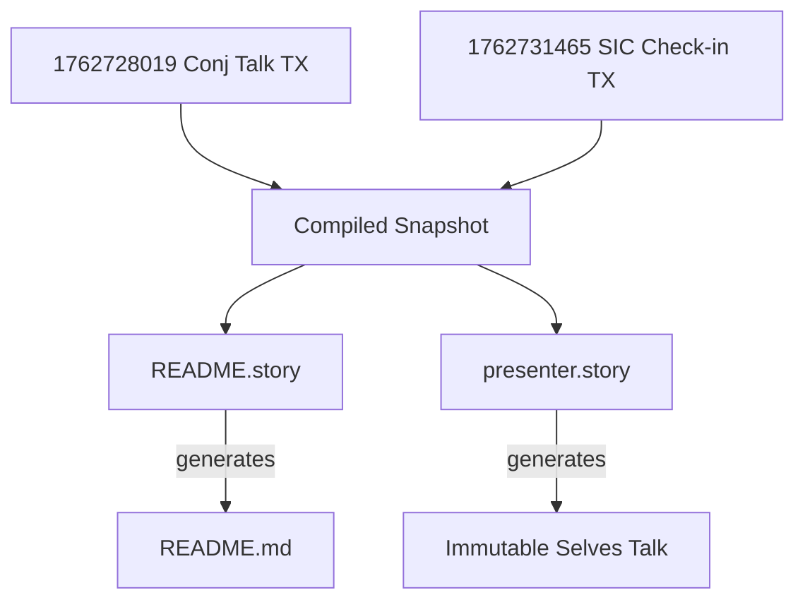

# storyBASE Repository

**Version 0.1.0** | A Git-native RDF knowledge graph for narrative-driven AI memory

---

## State

The storyBASE contains two primary knowledge domains captured across two transactions:

1. **storyBASE Product & Strategy** — A comprehensive extraction from a January 2025 check-in covering market opportunity, positioning, product architecture, roadmap, and go-to-market strategy for the storyBASE/Sic platform[^1]
2. **Conj Talk 2025: Immutable Selves** — A conference talk proposal applying Clojure principles (immutability, functional composition) to identity systems, bridging past work at Vouch.io with current AI memory work at Sic[^2]

The graph encodes **319 triples** spanning strategic positioning, technical architecture, style observations, rubric assessments, and narrative structure. The ontology provides a **Narrative Architecture** framework with top-level domains: Opportunity, Strategy, Product, Architecture, Organization, Proof, Templates, Calibration, Style, and Conviction[^3].

---

## Stories

### `/README.story`
**Intent:** Autogenerated repository overview tracking storyBASE "as written"  
**Relationship:** Meta-documentation that summarizes the current graph state, story intent, asset structure, and transaction history  
**Approach:** Synthesizes snapshot data into a navigable README with sections for state, stories, assets, and transactions—grounded entirely in the compiled RDF snapshot[^4]

### `/presenter.story`
**Intent:** Draft the "Immutable Selves" conference talk using iA Presenter format  
**Relationship:** Transforms the Conj 2025 extraction into a presentation artifact with slides, speaker notes, and visual cues  
**Approach:** Maps opportunity (identity vulnerability), strategy (functional immutable architecture), products (Vouch.io, Sic), and proof (talk structure) onto the iA Presenter template; uses footnotes to cite storyBASE provenance with context[^5]

---

## Assets

```
/
├── .storyBASE/
│   ├── 1762728019add_conj_talk_2025_extraction.sparql
│   └── 1762731465sic-storybase-checkin.sparql
├── README.story
└── presenter.story
```

### `.storyBASE/` Directory
**Append-only transaction log** containing SPARQL INSERT DATA statements. Each file is a timestamped, immutable commit to the knowledge graph[^6]:

- **`1762728019add_conj_talk_2025_extraction.sparql`** — Extracts narrative architecture (Opportunity → Strategy → Product → Proof → Architecture → Organization), 11 style observations, 4 rubric assessments (Clarity 4.5/5, Technical Depth 4.8/5, Narrative Coherence 4.6/5, Audience Engagement 4.3/5), and style metrics (avg sentence length 22.4, technical density 0.68, active voice 0.71)[^7]
- **`1762731465sic-storybase-checkin.sparql`** — Comprehensive product/strategy snapshot covering market opportunity (AI context requirements), positioning thesis (extend software development rigor into strategy/content/marketing), product overview (n8n prototype, MCP server, GitHub Actions), architecture (append-only logs, hierarchical compile, Docker Compose on Digital Ocean), roadmap (TriG named graphs, SHACL validation, individuation pipeline), and 10 style observations with 9 rubric scores[^8]

### Story Files
- **`README.story`** — YAML front matter specifies `id: README`, `model: anthropic/claude-sonnet-4.5`, `destination: /`. Prompt requests state summary, story intent, asset descriptions (with mermaid if appropriate), and transaction significance[^9]
- **`presenter.story`** — YAML front matter specifies `id: conj-talk-2025`, includes iA Presenter template reference. Prompt requests talk draft with footnoted citations to storyBASE and context explanations[^10]

### Visualization



---

## Transactions

### `1762728019add_conj_talk_2025_extraction.sparql`
**Generated:** 2025-11-09T22:39:28.133Z  
**Agent:** n8n.storyTWIN/MCP  
**User:** pleasetrythisathome  
**Model:** anthropic/claude-sonnet-4.5  

**Significance:**  
First extraction for the Conj 2025 proposal. Establishes the **Opportunity** (centralized, mutable identity systems vulnerable to deepfakes/fraud), **Strategy** (apply Clojure immutability principles to identity), **Products** (Vouch.io enterprise platform, Sic AI memory), **Proof** (talk with threaded diagrams and optional demo), and **Architecture** (append-only event logs, pure functions at the edge, knowledge graphs for resolution). Captures speaker's style: brand name "Sic" (terse Latin reference), technical reframings (identity as evolving log, trust as computable provenance), triadic enumeration, and parallel construction in takeaways. Rubric scores validate clarity, technical depth, and narrative coherence while flagging opportunities to strengthen emotional hooks beyond technical urgency[^11].

### `1762731465sic-storybase-checkin.sparql`
**Generated:** 2025-11-09T23:37:05.079Z  
**Agent:** n8n.storyTWIN/MCP  
**User:** pleasetrythisathome  

**Significance:**  
Encodes the full storyBASE product narrative. Defines the **Market Opportunity** (AI models need extensive context; RDF-based narrative source of truth enables specific, controllable, versionable memory), **Timing Thesis** (2024–2026 window as prompt engineering matures and multi-agent workflows demand organizational AI memory), **Primary Actors** (programming-literate entrepreneurs/designers/developers who manipulate worldview), **Positioning** (extend Git rigor into strategy/content/marketing via RDF), **Moat** (Git-native, versionable AI memory encoding style/conviction/metrics), **Mission** (versionable, collaborative, narrative-driven AI memory), **Tagline** ("AI that tells you a story as written"), and **Roadmap** (TriG named graphs, SHACL validation, evolved individuation pipeline, marketplace, cost pass-through billing). Documents **System Topology** (n8n orchestration, MCP server exposure, hierarchical compile, Docker Compose), **Data Model** (append-only log, replay to snapshot, provenance in TX step), **Integration Points** (GitHub OAuth/webhooks/Actions, Open Router via Helicone, Outseta OIDC/billing, MCP protocol), **Process** (interactive individuation: extract → diff → tx → review → commit; automated ingestion: file upload → extraction → PR), and **Case Studies** (planned Crooked Media demo with auto-ingested transcripts and perspectival operations). Style observations include CamelCase "storyBASE", conversational register with fillers ("you know"), power verb "extend", and technical jargon assumed literate. Rubric assessments show strong strategic alignment (4/5) and accuracy (4/5), moderate flow (3/5) and resonance (3/5), with room to strengthen analogies and tighten transitions[^12].

---

[^1]: Transaction `<http://storybase.synthetic-identity.co/transaction/2025-01-29T000000Z_sic-storybase-checkin>` labeled "SIC / storyBASE / as written.ai Product & Strategy Check-in", a spoken transcript with conversational register and technical depth, input length 18,437 characters, attributed to `<http://storybase.synthetic-identity.co/actor/scarlet-dame>`.

[^2]: Transaction `<http://storybase.org/narrative#Tx_20251109T223928Z_conj2025>` labeled "Conj Talk 2025 Extraction Transaction", first extraction for proposal capturing narrative architecture, style observations, rubric assessments, and style metrics, input length 3,421 characters.

[^3]: SKOS Concept Scheme `NarrativeArchitecture` with top concepts Opportunity, Strategy, Product, Architecture, Organization, Proof, Templates, Calibration, Style, Conviction; 8 classification levels; sequential phases Site → Foundations → Plans → Structural Engineering → Walls → Roof → Glazing → Interior Design → Furnishing.

[^4]: README.story YAML specifies `id: README`, `title: "storyBASE repo README"`, `version: 0.1.0`, `description: "autogenerated readme tracking storyBASE as written"`, `destination: /`, `model: - anthropic/claude-sonnet-4.5`. Prompt: "Summarize the current state of the storyBASE. Create a section for each story… Briefly summarize the repository structure… Briefly summarize each transaction…"

[^5]: presenter.story YAML specifies `id: conj-talk-2025`, `title: "Immutable Selves Talk"`, `version: 0.1.0`, `description: "IA presenter template for talk presentation"`, `destination: /`, `model: - anthropic/claude-sonnet-4.5`. Prompt: "Use the storyBASE to draft the talk using the provided format. Cite important claims with footnotes to the storyBASE and explain context in the footnote."

[^6]: `<http://storybase.synthetic-identity.co/model/data-lifecycle-storybase>` describes "Append-only transaction log; immutable files; snapshot = replay of sorted transactions; provenance in TX step; future named graphs for add/remove."

[^7]: Transaction metadata: `prov:generatedAtTime "2025-11-09T22:39:28.133Z"`, `prov:used "anthropic/claude-sonnet-4.5"`, `sb:originPath "/"`, `sb:originRef "main"`. Defines `<urn:uuid:opportunity-identity-vulnerability>` ("Centralized, mutable identity systems vulnerable to deepfakes, synthetic identities, and impersonation fraud"), `<urn:uuid:strategy-functional-immutable-identity>` ("Applies Clojure principles… to create trustworthy identity systems"), `<urn:uuid:product-vouch-io>` ("Enterprise identity platform using immutable event logs and delegation chains"), `<urn:uuid:product-sic>` ("AI memory company using narrative-driven knowledge graphs to create AI individuals with deterministic individuality and provenance"), `<urn:uuid:proof-conj-2025-talk>` ("Conference talk and experience report… Threaded diagrams from model to implementation, optional short demo with canned fallback"). Style observations include brand name styling ("Vouch.io", "Sic"), technical terms ("append-only event logs", "authentication as pure functions"), rhetorical structures (triadic enumeration, problem-to-solution bridge, parallel construction), technical reframings ("identity as an evolving log of facts", "trust as provenance that you can compute"), and personal identity lens ("As a trans woman, her lived experience informs a clear, practical framing of identity as contextual and evolving"). Rubric scores: Clarity 4.5/5 ("Clear problem statement, well-structured proposal, actionable takeaways; minor density in technical sections"), Technical Depth 4.8/5 ("Strong grounding in Clojure principles, concrete system patterns, dual case studies (Vouch.io, Sic), verifiable architecture"), Narrative Coherence 4.6/5 ("Coherent arc from problem (deepfakes) through strategy (immutability) to proof (talk structure); dual product lens adds depth"), Audience Engagement 4.3/5 ("Actionable takeaways, optional demo, clear attendee value; could strengthen emotional hook beyond technical urgency"). Style metrics: average sentence length 22.4, technical density 0.68, active voice ratio 0.71.

[^8]: Transaction metadata: `prov:generatedAtTime "2025-11-09T23:37:05.079Z"`, `prov:wasAssociatedWith "n8n.storyTWIN/MCP"`, `prov:wasAttributedTo "pleasetrythisathome"`, `sb:originPath ""`, `sb:originRef "main"`. Defines `<http://storybase.synthetic-identity.co/opportunity/storybase-market>` ("High-quality AI output requires extensive context; current models use search, but RDF-based narrative source of truth enables specific, controllable, versionable AI memory"), `<http://storybase.synthetic-identity.co/thesis/timing-storybase>` ("Convergence of prompt engineering maturity, multi-agent workflows, and demand for organizational AI memory creates window for narrative-driven context management… 2024-2026"), `<http://storybase.synthetic-identity.co/actor/primary-storybase>` ("Programming-literate entrepreneurs, designers, developers, consultants who manipulate worldview and see perspective changes"), `<http://storybase.synthetic-identity.co/thesis/positioning-storybase>` ("Extend software development rigor (versioning, branching, collaboration) into strategy, content, marketing, organizational operations via RDF narrative source of truth"), `<http://storybase.synthetic-identity.co/leverage/moat-storybase>` ("Git-native, versionable, branchable AI memory encoding style, conviction, narrative metrics; replaces brittle role prompts with deep, operable persona descriptions"), `<http://storybase.synthetic-identity.co/tagline/storybase>` ("AI that tells you a story as written… User-facing brand as written.ai; Latin i.e. meaning"), `<http://storybase.synthetic-identity.co/mission/storybase>` ("Extend software development rigor into strategy, content, marketing; provide versionable, collaborative, narrative-driven AI memory"), `<http://storybase.synthetic-identity.co/product/overview-storybase>` ("Initial prototype in n8n; tools include compile, ontology, extract, diff, tx, commit; MCP server; open WebUI at as written.ai; GitHub Actions for story generation"), `<http://storybase.synthetic-identity.co/module/storybase-capabilities>` ("Compile (replay transactions to Turtle snapshot), extract (RDF from input), diff (semantic comparison), tx (propose transaction), commit (append-only to Git), story generation (YAML front matter + prompt to model outputs)"), `<http://storybase.synthetic-identity.co/dependency/storybase-integrations>` ("n8n workflows, MCP server, GitHub (version control), Apache Jena/Riot (future RDF ops), Docker Compose, Open WebUI, Outseta (auth/billing), Helicone (API monitoring), Open Router (model access)"), `<http://storybase.synthetic-identity.co/roadmap/narrative-storybase>` ("Move transactions from SPARQL to named graphs (TriG); add SHACL validation; implement evolved individuation pipeline (snapshot + message to transaction); file ingestion via GitHub; storyBASE marketplace; cost pass-through billing"), `<http://storybase.synthetic-identity.co/architecture/topology-storybase>` ("n8n agent orchestrates tools; MCP server exposes to frontends (Agent.ai, ChatGPT, Open WebUI); transactions in .storybase directories; hierarchical compile; Docker Compose on Digital Ocean"), `<http://storybase.synthetic-identity.co/model/data-lifecycle-storybase>` ("Append-only transaction log; immutable files; snapshot = replay of sorted transactions; provenance in TX step; future named graphs for add/remove"), `<http://storybase.synthetic-identity.co/integration/points-storybase>` ("GitHub (OAuth, webhooks, Actions); Open Router (API proxy via Helicone); Outseta (OIDC, billing); MCP protocol (tool exposure); future GitHub Apps with scoped credentials"), `<http://storybase.synthetic-identity.co/process/storybase>` ("Interactive individuation (extract → diff → tx → review → commit) vs. automated ingestion (file upload → extraction → PR); story generation triggered by transaction or .story file changes"), `<http://storybase.synthetic-identity.co/case/studies-storybase>` ("Planned demo: Crooked Media podcast transcripts auto-ingested; stories auto-update; perspectival operations (e.g., start with NPR, evolve with OpenAI)"). Style observations include "CamelCase 'storyBASE' with internal capitalization", "Conversational filler 'you know' signals informal register", "Power verb 'extend' frames value proposition", "Implicit comparison: AI without context = generic output", "First-person 'I' and 'So I don't know' signal informal, direct tone", "Technical jargon (RDF, canonization, skolemization) used without definition; assumes literate audience", "Short, punchy sentence breaks up technical explanation", "Parallel structure 'extract … diff … tx' reinforces workflow sequence", "Rhetorical framing transitions to roadmap discussion", "Citation marker present but unfilled; signals placeholder". Style metrics: average sentence length 35.2, active voice ratio 0.72, jargon density 0.18, type-token ratio 0.42. Rubric scores: Register Fit 3.5/5 ("Conversational, informal; first-person 'I'; fillers; direct but not concise; fits spoken context"), Phrasing 3/5 ("Domain verbs ('compile', 'extract'); some stock phrases; idiolect emerging"), Cadence 3/5 ("Sentence length varies; some punchy breaks; rhythm uneven due to spoken delivery"), Strategic Alignment 4/5 ("Clear positioning; mission and moat articulated; roadmap detailed; aligns with narrative anchor"), Audience Tailoring 3.5/5 ("Assumes programming-literate audience; jargon without definition; some context-setting"), Resonance 3/5 ("Light analogies; planned demos add resonance; could use more stories"), Flow 3/5 ("Logical progression; some digressions; transitions implicit; spoken delivery affects coherence"), Novelty 3.5/5 ("Brand stylization distinct; 'individuation pipeline' novel; some generic constructions"), Accuracy 4/5 ("Technical details specific (n8n, Apache Jena, Outseta, Helicone); named entities correct; citation marker present but unfilled").

[^9]: README.story YAML `destination: /` indicates output should replace this file.

[^10]: presenter.story references iA Presenter theme format including cover containers, section headers, speaker notes (indented text), image positioning (`x:`, `y:`, `size:`), and Markdown-based slide separators (`---`).

[^11]: See footnote 7 for full transaction detail.

[^12]: See footnote 8 for full transaction detail.