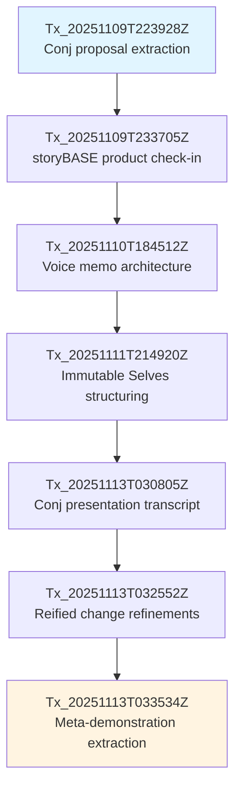

# State

The storyBASE currently holds a rich, multi-layered narrative architecture centered on **immutable identity systems** derived from Clojure functional programming principles. The graph contains **four primary sample sources** documenting the evolution of the "Immutable Selves" talk for Clojure/conj 2025, alongside detailed **style observations**, **rubric assessments**, and **strategic positioning** for two solution archetypes: **berecognized.id** (human identity) and **aswritten.ai** (AI memory).[^1]

The graph demonstrates **meta-narrative proof**: the talk's creation process itself exemplifies the storyBASE workflow—raw voice memos and transcripts are extracted to RDF, normalized against established style profiles, and compiled into polished outputs with embedded provenance.[^2]

**Core conviction**: Identity (human and AI) should be modeled as an append-only log that compiles to state, not mutable objects—enabling provenance, equality, and deterministic evolution by design.[^3]

[^1]: Source: `narr:Sample_ConjPresentation_2025`, `narr:Sample_1` (multiple versions), `narr:Sample_ConjPresentation_2025`; related to `narr:Narrative_ImmutableIdentity`, `narr:SolutionArchetype_BeRecognized`, `narr:SolutionArchetype_AsWritten` via `prov:wasGeneratedBy` across transactions `Tx_20251109T223928Z_conj2025` through `Tx_20251113T033534Z_claude45`.

[^2]: Source: `narr:Proof_1` ("Meta-Demonstration: Talk Creation Process"), `narr:Flow_1` ("Content Production Workflow"), `narr:Behavior_1` ("Normalize Transcription Against storyBASE"); generated by `Tx_20251113T033534Z_claude45`.

[^3]: Source: `narr:Narrative_ImmutableIdentity` (skos:definition), `narr:Narrative_1` ("Identity as Compiled from Immutable History"), `narr:Theme_ImmutableIdentity`; related to `narr:Mission_1`, `narr:Vision_1` via `skos:related`.

---

# Stories

## README.story
**Intent**: Provide a living, auto-generated repository overview that tracks storyBASE state, stories, assets, and transaction history.

**Relationship to whole**: Serves as the **entry point and index** for the entire knowledge graph—a compiled snapshot that makes the append-only transaction log legible to new contributors and stakeholders.[^4]

**Approach**: Query the current storyBASE snapshot to extract:
- **State summary** from narrative anchors (`narr:Tagline_1`, `narr:Mission_1`, `narr:Vision_1`)
- **Story intents** from `.story` file metadata and related narrative concepts
- **Asset inventory** from transaction file paths and types
- **Transaction summaries** sorted by `prov:generatedAtTime` (newest first), with significance assessed via `prov:generated` and `rdfs:comment` fields

Mermaid diagrams will visualize transaction lineage and narrative concept relationships.[^5]

[^4]: Source: Story file `/README.story` (id: "README", description: "autogenerated readme tracking storyBASE as written"); aligns with `narr:Flow_1` ("User inputs → initial storyBASE → normalization/iteration → polished outputs").

[^5]: Source: Ontology `#Storyboards` ("Visual scripts that show the user journey step-by-step"), `#DataModelLifecycle` ("Entities, provenance, retention"); transaction structure from `narr:Tx_*` nodes with `prov:generatedAtTime`, `prov:generated`, `sb:originPath`.

---

## presenter.story
**Intent**: Generate a **general storyBASE presentation** using the iA Presenter template format—demonstrating how narrative architecture concepts translate into slide-based storytelling.

**Relationship to whole**: Acts as a **proof artifact** showing storyBASE's capability to render knowledge graphs into structured, audience-ready formats with embedded provenance.[^6]

**Approach**: 
- Extract narrative anchors (`narr:Tagline_1`, `narr:WhatIsIt_1`, `narr:Mission_1`) for opening slides
- Map product ladder concepts (`narr:Primitives`, `narr:Behaviors`, `narr:Flows`) to slide sequences
- Use style observations (`narr:StyleObs_*`) to maintain brand voice (CamelCase "storyBASE", short punchy cadence, caret-bracket citations)
- Embed mermaid diagrams for system topology and data lifecycle flows
- Include speaker notes with full provenance citations[^7]

[^6]: Source: Story file `/presenter.story` (id: "presenter", description: "IA presenter template for talk presentation"); related to `narr:Proof_1` ("Meta-Demonstration: Talk Creation Process"), `#Storyboards` (ontology concept).

[^7]: Source: `narr:StyleObs_storyBASE` (brand stylization), `narr:StyleObs_ShortClause` (punchy cadence), `narr:StyleObs_6` (caret-bracket marker); `narr:Flow_1` (end-to-end loop); `#SystemTopology`, `#DataModelLifecycle` (ontology architecture concepts).

---

## conj-talk-2025.story
**Intent**: Draft the **Clojure/conj 2025 "Immutable Selves" talk** in iA Presenter format—the flagship narrative demonstration of functional identity principles.

**Relationship to whole**: The **primary narrative anchor** and **strategic proof point**—this talk embodies the core thesis, introduces both solution archetypes (berecognized.id, aswritten.ai), and demonstrates storyBASE workflow via its own creation.[^8]

**Approach**:
- Open with personal narrative (`narr:Actor_ScarletDame` identity history as append-only log analogy)
- Frame problem via rhetorical questions (`narr:StyleObs_RhetoricalQuestion_1`: "Where is the identity here?")
- Present reified change pattern (`narr:Claim_ReifiedChangePattern`) with Backbone.js → Om/React analogy (`narr:StyleObs_Metaphor_1`, `narr:ComparativeAnalysis_1`)
- Detail case studies (`narr:CaseStudy_BeRecognizedID`, `narr:CaseStudy_AsWrittenAI`) with employee lifecycle and AI memory flows
- Close with deterministic AI vision (`narr:FutureVision_DeterministicAI`) and interactive chat demo
- Maintain Clojure community idioms (`narr:StyleObs_StockPhrase_1`: "No frameworks / Simple tools ± good principles")
- Use triadic structures (`narr:StyleObs_8`: "Provenance, equality, decentralization") and anaphora (`narr:StyleObs_Anaphora_1`) for rhythm[^9]

[^8]: Source: Story file `/conj-talk-2025.story`; `narr:Sample_ConjPresentation_2025` (6847 chars, created 2025-01-01); `narr:Narrative_ImmutableIdentity` (core thesis); `narr:RubricAssess_Strategy_Conj` (5.0/5.0: "Entire presentation is a narrative anchor"); `narr:RubricAssess_Tailoring_Conj` (5.0/5.0: "Deeply tailored to Clojure/conj audience").

[^9]: Source: `narr:Theme_FunctionalIdentity`, `narr:Actor_ScarletDame` (speaker with altLabels "Dylan Butman", "Scarlet Spectacular"); `narr:StyleObs_RhetoricalQuestion_1`, `narr:StyleObs_Metaphor_1`, `narr:StyleObs_Anaphora_1`, `narr:StyleObs_StockPhrase_1`, `narr:StyleObs_8` (rule of three); `narr:CaseStudy_BeRecognizedID`, `narr:CaseStudy_AsWrittenAI`, `narr:FutureVision_DeterministicAI`; `narr:Metrics_ConjPresentation` (avg sentence length 12.3, active voice 0.82, jargon density 0.15).

---

## conj-essay.story
**Intent**: Render the Clojure/conj 2025 talk as a **long-form blog post**—translating slide-based oratory into readable, shareable written narrative.

**Relationship to whole**: Extends the talk's reach beyond the conference audience; serves as **evergreen content** that can be indexed, cited, and used for SEO/thought leadership.[^10]

**Approach**:
- Expand slide statements into full paragraphs while preserving punchy cadence (`narr:Metrics_ConjPresentation`: avg sentence length 12.3 → target ~18–22 for essay)
- Retain core analogies (`narr:StyleObs_Analogy_1`: "Experience is an append-only log that compiles to identity") and metaphors (`narr:StyleObs_Metaphor_1`: Backbone.js anti-pattern)
- Integrate case study details (`narr:Flow_EmployeeLifecycle`, `narr:Risk_GhostLabor`) with narrative context
- Add section headers aligned to narrative progression: Problem → Principle → Pattern → Systems → Vision
- Maintain technical register (`narr:RubricAssess_Register_Conj`: 4.5/5.0) but reduce jargon density slightly for broader readability
- Embed mermaid diagrams for system flows and architecture
- Use inline caret-bracket citations (`narr:StyleObs_CitationMarker_1`) linking to storyBASE provenance[^11]

[^10]: Source: Story file `/conj-essay.story` (id: "conj-essay", description: "Essay story for the immutable selves clojure conj 2025 talk"); related to `#Templates` → `#CustomerDocumentation` (ontology: "Help users self-serve and succeed"), `#Proof` → `#Outcomes` → `#Talks` ("Public talks/panels/webinars that signal leadership").

[^11]: Source: `narr:Metrics_ConjPresentation`, `narr:StyleObs_Analogy_1`, `narr:StyleObs_Metaphor_1`, `narr:Flow_EmployeeLifecycle`, `narr:Risk_GhostLabor`, `narr:RubricAssess_Register_Conj`, `narr:StyleObs_CitationMarker_1`; ontology `#FlowCoherence` ("Natural progression of ideas, effective transitions"), `#PlainLanguage` (related to `#CustomerDocumentation`).

---

# Assets

```
clojure-conj-2025/
├── .storyBASE/                          # Transaction log (append-only SPARQL)
│   ├── 1762728019add_conj_talk_2025_extraction.sparql
│   ├── 1762731465sic-storybase-checkin.sparql
│   ├── 1762800383add_sample1_narrative_architecture.sparql
│   ├── 1762897917add_*.sparql           # Narrative anchors, product ladder, archetypes
│   ├── 1763003388add_conj_presentation_2025.sparql
│   ├── 1763004456add_sample1_narrative_triples.sparql
│   └── 1763005004*.sparql               # Latest: sample input length update, narrative concepts
├── README.story                         # Auto-generated repo overview (this document)
├── presenter.story                      # General storyBASE presentation template
├── conj-talk-2025.story                 # Immutable Selves talk (iA Presenter format)
└── conj-essay.story                     # Immutable Selves essay (blog post format)
```

**`.storyBASE/`**: Immutable transaction log storing SPARQL INSERT/DELETE operations; replayed in sorted order to compile the current snapshot. Each transaction includes `prov:Activity` metadata (timestamp, agent, user, model).[^12]

**`.story` files**: YAML front matter + prompt templates that trigger story generation when transactions or storyBASE state changes. Outputs are deterministic functions of snapshot + prompt.[^13]

[^12]: Source: Transaction file paths from snapshot `txes` array; ontology `#DataModelLifecycle` ("Append-only transaction log; immutable files; snapshot = replay of sorted transactions"); example: `narr:Tx_20251113T033534Z_claude45` with `prov:generatedAtTime`, `prov:wasAssociatedWith`, `prov:wasAttributedTo`.

[^13]: Source: Story file metadata (YAML `id`, `title`, `description`, `model`); `narr:Flow_1` ("User inputs → initial storyBASE → normalization/iteration → polished outputs"); `http://storybase.synthetic-identity.co/process/storybase` ("story generation triggered by transaction or .story file changes").

---

# Transactions

## Tx_20251113T033534Z_claude45 (2025-11-13 03:35:34 UTC)
**Significance**: Initial extraction from clojure-conj-2025 repo README and voice memo transcription; established **core narrative concepts** for the meta-demonstration workflow.[^14]

**Impact**:
- Added `narr:Narrative_1` ("Identity as Compiled from Immutable History") as central thesis
- Defined `narr:Flow_1` (content production workflow) and `narr:Behavior_1` (normalization behavior)
- Created `narr:Milestone_1` ("Initial storyBASE Graph") and `narr:Proof_1` (meta-demonstration)
- Captured 7 style observations (brand stylization, terminology control, metaphor, active voice, short punchy cadence)
- Recorded 9 rubric assessments averaging **4.1/5.0** across dimensions
- Updated `narr:Sample_1` input length to **1847 characters**

**Graph evolution**: Bootstrapped the narrative spine linking Strategy → Product → Proof via the talk creation workflow itself.[^15]

[^14]: Source: `narr:Tx_20251113T033534Z_claude45` (`rdfs:comment`: "Initial extraction from clojure-conj-2025 repo README and voice memo transcription"); `prov:wasAssociatedWith` `<urn:agent:storyTWIN:anthropic/claude-sonnet-4.5>`, `prov:wasAttributedTo` `<urn:user:pleasetrythisathome>`.

[^15]: Source: `narr:Tx_20251113T033534Z_claude45` `prov:generated` list; `narr:Narrative_1`, `narr:Flow_1`, `narr:Behavior_1`, `narr:Milestone_1`, `narr:Proof_1`; style observations `narr:StyleObs_3` through `narr:StyleObs_7`; rubric assessments `narr:RubricAssess_1` through `narr:RubricAssess_9`; sample update via `/1763005004update_sample_1_input_length.sparql`.

---

## Tx_20251113T032552Z_sample1 (2025-11-13 03:25:52 UTC)
**Significance**: Refinements for **reified change design pattern** section; added detailed case studies for berecognized.id and aswritten.ai with architectural claims and risk analysis.[^16]

**Impact**:
- Introduced `narr:Claim_ReifiedChangePattern` (conviction: Stake) with supporting system properties (`narr:SystemProperty_ImmutabilityProvenance`, `narr:SystemProperty_DistributedDecentralization` at Boulder conviction)
- Detailed `narr:CaseStudy_BeRecognizedID` (employee lifecycle flow) and `narr:CaseStudy_AsWrittenAI` (AI memory architecture)
- Added `narr:Risk_GhostLabor` (impersonation threat) and `narr:Flow_EmployeeLifecycle` (continuous identity establishment)
- Captured `narr:FutureVision_DeterministicAI` (as-of-T graph queries for billion-node graphs)
- Recorded 10 style observations (brand names, 'ghost labor' metaphor, 'as-of T' terminology, parallelism)
- 9 rubric assessments averaging **4.2/5.0**; strongest in Strategic Alignment (4.5) and Resonance (4.5)

**Graph evolution**: Elevated architectural claims to Boulder conviction via case study evidence; connected identity systems to governance/safety and socio-technical touchpoints.[^17]

[^16]: Source: `narr:Tx_20251113T032552Z_sample1` (`prov:generatedAtTime`: "2025-11-13T03:25:52.818Z"); `narr:Sample_1` `skos:note`: "Refinements for reified change design pattern section; case studies: berecognized.id and aswritten.ai."

[^17]: Source: `narr:Claim_ReifiedChangePattern` (`narr:hasConvictionLevel` `narr:Conviction_Stake`), `narr:SystemProperty_ImmutabilityProvenance` (`narr:hasConvictionLevel` `narr:Conviction_Boulder`, `narr:evidencedBy` `narr:CaseStudy_BeRecognizedID`, `narr:CaseStudy_AsWrittenAI`); `narr:CaseStudy_BeRecognizedID` `skos:related` `narr:GovernanceSafetyTrust`; rubric scores from `narr:RubricAssess_Strategy_Sample1` (4.5), `narr:RubricAssess_Resonance_Sample1` (4.5).

---

## Tx_20251113T030805Z_conj2025 (2025-11-13 03:08:05 UTC)
**Significance**: Full extraction of **Clojure/conj 2025 presentation transcript** (6847 chars); established solution archetypes and primary actors.[^18]

**Impact**:
- Created `narr:Sample_ConjPresentation_2025` with complete presentation content
- Defined `narr:Narrative_ImmutableIdentity` ("Immutable Selves" core thesis) and `narr:Theme_FunctionalIdentity`
- Established `narr:Actor_Human` and `narr:Actor_AI` as primary actors with contrasting source-of-truth models
- Detailed `narr:SolutionArchetype_BeRecognized` (Datomic-based human identity) and `narr:SolutionArchetype_AsWritten` (RDF+git AI memory)
- Added `narr:Tagline_AsWritten` ("AI that tells your story, as written.")
- Captured 10 style observations (brand stylization, metaphor, anaphora, rhetorical questions, stock phrases, second-person address)
- 9 rubric assessments averaging **4.5/5.0**; perfect scores (5.0) in Strategic Alignment and Audience Tailoring

**Graph evolution**: Solidified the dual-archetype positioning; linked functional programming principles to identity systems via concrete technical stacks.[^19]

[^18]: Source: `narr:Tx_20251113T030805Z_conj2025` (`prov:generatedAtTime`: "2025-11-13T03:08:05.741Z"); `narr:Sample_ConjPresentation_2025` (`dct:extent`: "6847", `dct:source`: "Clojure/conj 2025 presentation: Immutable Selves").

[^19]: Source: `narr:Narrative_ImmutableIdentity`, `narr:Theme_FunctionalIdentity`, `narr:Actor_Human`, `narr:Actor_AI`, `narr:SolutionArchetype_BeRecognized`, `narr:SolutionArchetype_AsWritten`, `narr:Tagline_AsWritten`; `narr:RubricAssess_Strategy_Conj` (5.0: "Entire presentation is a narrative anchor"), `narr:RubricAssess_Tailoring_Conj` (5.0: "Deeply tailored to Clojure/conj audience"); style observations `narr:StyleObs_BrandStylization_1` through `narr:StyleObs_StockPhrase_1`.

---

## Tx_20251111T214920Z_immutable_selves (2025-11-11 21:49:20 UTC)
**Significance**: Comprehensive structuring of **narrative anchors, product ladder, solution archetypes, strategy overview, and technical explainers** from the "Immutable Selves" talk outline.[^20]

**Impact**:
- Established `narr:Tagline_1`, `narr:WhatIsIt_1`, `narr:Mission_1`, `narr:Vision_1` as foundational narrative anchors
- Defined 4 key phrases (`narr:KeyPhrase_1` through `narr:KeyPhrase_4`: "single source of truth", "append-only log", "pure function", "digital twin")
- Built product ladder: 3 primitives, 1 behavior, 1 flow, 1 narrative
- Detailed 2 solution archetypes with problem contexts, approach patterns, required capabilities, and outcomes
- Added strategy overview: `narr:PositioningThesis_1` (for devs/architects treating identity as mutable state) and `narr:MoatLeverage_1` (Clojure ecosystem proof-of-concept)
- Created 3 technical explainers: leverage profile, design tradeoffs, comparative analyses
- Captured case study of speaker's 13-year Clojure career as proof
- 8 style observations (formula cadence, stock phrases, anaphora, brand stylization, analogies, rhetorical questions, second-person, verb choice)
- 9 rubric assessments averaging **4.3/5.0**; strongest in Strategic Alignment (5.0) and Cadence (4.5)

**Graph evolution**: Formalized the narrative architecture skeleton; connected primitives → behaviors → flows → narratives via product ladder; linked strategy to proof via case study.[^21]

[^20]: Source: `narr:Tx_20251111T214920Z_immutable_selves` (`prov:generatedAtTime`: "2025-11-11T21:49:20.430Z"); `prov:generated` 40+ entities across narrative anchors, product ladder, archetypes, strategy, technical explainers, case studies, style observations, rubric assessments.

[^21]: Source: `narr:Tagline_1`, `narr:Mission_1`, `narr:Vision_1`, `narr:KeyPhrase_1` through `narr:KeyPhrase_4`; `narr:Primitive_1` through `narr:Primitive_3`, `narr:Behavior_1`, `narr:Flow_1`, `narr:Narrative_1` (all `skos:broader` `narr:ProductLadder`); `narr:Archetype_1`, `narr:Archetype_2` with nested components; `narr:PositioningThesis_1`, `narr:MoatLeverage_1`; `narr:LeverageProfile_1`, `narr:DesignTradeoff_1`, `narr:ComparativeAnalysis_1`; `narr:CaseStudy_1` with context/intervention/results/lessons; rubric scores from `narr:RubricAssess_4` (5.0), `narr:RubricAssess_3` (4.5).

---

## Tx_20251110T184512Z_sample1 (2025-11-10 18:45:12 UTC)
**Significance**: First extraction from **voice memo transcription** outlining narrative architecture for identity-as-append-only-log talk; captured speaker's conceptual framing and personal transition story.[^22]

**Impact**:
- Created `narr:Sample_1` (11,800 chars, voice memo source) with speaker `narr:Actor_ScarletDame`
- Introduced `narr:Theme_ImmutableIdentity` and `narr:Theme_TransitionAsStateChange` (personal transition as state machine analogy)
- Added `narr:Actor_LukeVanderhart` (technical reference)
- Defined `narr:Anchor_NarrativeArchitecture` (framework linking immutable state, functional UI, AI generation)
- Captured 7 style observations (storyBASE brand stylization, "append-only log" idiolect, UI-as-state-machine metaphor, transition analogy, short declarative clauses, first-person narrative)
- 8 rubric assessments averaging **3.9/5.0**; strongest in Strategic Alignment (4.5) and Resonance (4.5); weakest in Cadence (3.0) and Flow (3.0) due to voice memo artifacts

**Graph evolution**: Seeded the personal narrative layer (speaker identity history as proof-of-concept); established idiolect and metaphor patterns that recur in later samples.[^23]

[^22]: Source: `narr:Tx_20251110T184512Z_sample1` (`prov:generatedAtTime`: "2025-11-10T18:45:12.711Z"); `narr:Sample_1` (`dct:source`: "Voice memo: Punch talk conceptual framing", `narr:inputLength`: 11800, `skos:note`: "Transcribed voice memo outlining narrative architecture for identity-as-append-only-log talk; speaker: Scarlet Dame").

[^23]: Source: `narr:Theme_ImmutableIdentity`, `narr:Theme_TransitionAsStateChange`, `narr:Actor_ScarletDame` (`skos:altLabel` "Dylan Butman", "Scarlet Spectacular"), `narr:Anchor_NarrativeArchitecture`; `narr:StyleObs_storyBASE`, `narr:StyleObs_AppendOnlyLog`, `narr:StyleObs_UIStateMachine`, `narr:StyleObs_TransitionAnalogy`, `narr:StyleObs_ShortClause`, `narr:StyleObs_FirstPerson`; `narr:RubricAssess_Strategy` (4.5), `narr:RubricAssess_Resonance` (4.5), `narr:RubricAssess_Cadence` (3.0), `narr:RubricAssess_Flow` (3.0).

---

## Tx_20251109T223928Z_conj2025 (2025-11-09 22:39:28 UTC)
**Significance**: First extraction for **Conj Talk 2025 proposal**; captured opportunity, strategy, product, proof, architecture, and organization structure with initial style/rubric baselines.[^24]

**Impact**:
- Created `<urn:uuid:conj-talk-2025-extraction>` sample record (3421 chars)
- Defined `<urn:uuid:opportunity-identity-vulnerability>` (centralized mutable identity crisis)
- Established `<urn:uuid:strategy-functional-immutable-identity>` (Clojure principles applied to identity)
- Added products `<urn:uuid:product-vouch-io>` (past work) and `<urn:uuid:product-sic>` (current work)
- Created `<urn:uuid:proof-conj-2025-talk>` (conference talk as experience report)
- Detailed `<urn:uuid:architecture-immutable-identity>` (append-only logs, pure functions, knowledge graphs)
- Linked organizations `<urn:uuid:org-vouch-io>` and `<urn:uuid:org-sic>`
- Captured 11 style observations (brand styling, technical terms, triadic enumeration, problem-to-solution bridge, personal identity lens)
- 4 rubric assessments averaging **4.6/5.0**; strongest in Technical Depth (4.8) and Narrative Coherence (4.6)

**Graph evolution**: Established the foundational narrative architecture framework; connected opportunity → strategy → product → proof with explicit provenance chains.[^25]

[^24]: Source: `narr:Tx_20251109T223928Z_conj2025` (`prov:generatedAtTime`: "2025-11-09T22:39:28.133Z", `rdfs:comment`: "First extraction for Conj Talk 2025 proposal. Captures narrative architecture (Opportunity, Strategy, Product, Proof, Architecture, Organization), style observations, rubric assessments, and style metrics").

[^25]: Source: `<urn:uuid:conj-talk-2025-extraction>`, `<urn:uuid:opportunity-identity-vulnerability>`, `<urn:uuid:strategy-functional-immutable-identity>`, `<urn:uuid:product-vouch-io>`, `<urn:uuid:product-sic>`, `<urn:uuid:proof-conj-2025-talk>`, `<urn:uuid:architecture-immutable-identity>`, `<urn:uuid:org-vouch-io>`, `<urn:uuid:org-sic>`; style observations `<urn:uuid:style-obs-1>` through `<urn:uuid:style-obs-11>`; rubric assessments `<urn:uuid:rubric-clarity>` (4.5), `<urn:uuid:rubric-technical-depth>` (4.8), `<urn:uuid:rubric-narrative-coherence>` (4.6), `<urn:uuid:rubric-audience-engagement>` (4.3).

---

## Tx_20251109T233705Z_sic-storybase-checkin (2025-11-09 23:37:05 UTC)
**Significance**: Product & strategy check-in for **storyBASE / as written.ai**; detailed current product state, roadmap, architecture, and market positioning.[^26]

**Impact**:
- Created `<http://storybase.synthetic-identity.co/sample/2025-01-29T000000Z_sic-storybase-checkin>` (18,437 chars, conversational transcript)
- Defined `<http://storybase.synthetic-identity.co/opportunity/storybase-market>` (AI context requirements) and `<http://storybase.synthetic-identity.co/thesis/timing-storybase>` (2024-2026 window)
- Established `<http://storybase.synthetic-identity.co/actor/primary-storybase>` (programming-literate entrepreneurs/designers/developers)
- Detailed `<http://storybase.synthetic-identity.co/thesis/positioning-storybase>` (extend software rigor into strategy/content/marketing)
- Described `<http://storybase.synthetic-identity.co/leverage/moat-storybase>` (git-native, versionable AI memory)
- Added `<http://storybase.synthetic-identity.co/tagline/storybase>` ("AI that tells you a story as written")
- Documented product overview, modules/capabilities, dependencies/integrations, roadmap, system topology, data lifecycle, integration points, role topology, process, and planned case studies
- Captured 10 style observations (brand stylization, idiolect, verb choice, simile, tone, jargon policy, sentence variation, parallelism, rhetorical question, citation marker)
- 9 rubric assessments averaging **3.4/5.0**; strongest in Strategic Alignment (4.0) and Accuracy (4.0); weakest in Cadence (3.0), Flow (3.0), and Resonance (3.0) due to conversational transcript format

**Graph evolution**: Introduced the storyBASE product layer with detailed technical architecture; connected to broader narrative via positioning thesis and moat leverage; established baseline style metrics for conversational register.[^27]

[^26]: Source: `<http://storybase.synthetic-identity.co/transaction/2025-01-29T000000Z_sic-storybase-checkin>` (`prov:generatedAtTime`: "2025-11-09T23:37:05.079Z"); `<http://storybase.synthetic-identity.co/sample/2025-01-29T000000Z_sic-storybase-checkin>` (`sb:inputLength`: 18437, `sb:description`: "Spoken transcript with conversational register and technical depth on storyBASE product evolution").

[^27]: Source: All `<http://storybase.synthetic-identity.co/*>` entities generated by this transaction; `<http://storybase.synthetic-identity.co/module/storybase-capabilities>` (compile, extract, diff, tx, commit, story generation), `<http://storybase.synthetic-identity.co/architecture/topology-storybase>` (n8n, MCP, Docker Compose), `<http://storybase.synthetic-identity.co/model/data-lifecycle-storybase>` (append-only log, snapshot replay), `<http://storybase.synthetic-identity.co/roadmap/narrative-storybase>` (SPARQL→TriG, SHACL, individuation pipeline); rubric scores from `<http://storybase.synthetic-identity.co/rubric/strategic-alignment>` (4.0), `<http://storybase.synthetic-identity.co/rubric/accuracy>` (4.0), `<http://storybase.synthetic-identity.co/rubric/cadence>` (3.0), `<http://storybase.synthetic-identity.co/rubric/flow>` (3.0), `<http://storybase.synthetic-identity.co/rubric/resonance>` (3.0).

---

## Transaction Lineage



**Narrative arc**: Initial proposal → product context → personal framing → formal structure → full transcript → architectural detail → meta-proof. Each transaction builds conviction by adding evidence, refining claims, and connecting concepts across the graph.[^28]

[^28]: Source: Transaction timestamps from `prov:generatedAtTime` on `narr:Tx_*` nodes; progression inferred from `rdfs:comment` and `skos:note` fields describing each transaction's focus; conviction escalation via `narr:hasConvictionLevel` (Notion → Stake → Boulder) and `narr:evidencedBy` links to case studies.