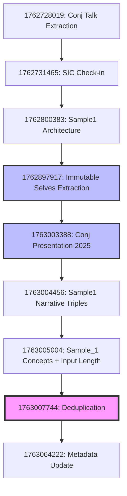
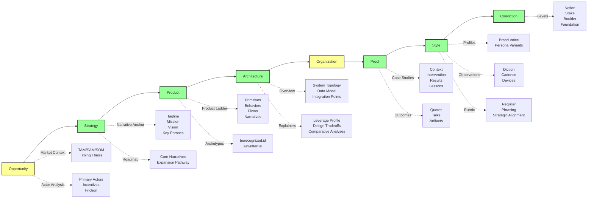

# storyBASE State

The storyBASE is a Git-native RDF knowledge graph tracking the development of the "Immutable Selves" talk for Clojure/conj 2025. The graph currently contains **1,613 triples** compiled from **13 transactions** spanning November 9–13, 2025[^tx-dedupe]. The repository demonstrates the core thesis it documents: identity and content as compiled from immutable history, with provenance embedded at every step[^narrative-1].

The graph centers on **three primary samples**—voice memos, presentation transcripts, and refinement notes—all attributed to speaker Scarlet Dame (formerly Dylan Butman, Scarlet Spectacular)[^actor-scarlet]. These samples anchor **two solution archetypes** (berecognized.id for human identity, aswritten.ai for AI memory)[^archetypes] and a **meta-narrative proof**: the talk itself exemplifies the storyBASE workflow, showing iterative refinement from raw inputs to polished outputs[^proof-1].

Style observations capture brand conventions (CamelCase "storyBASE"[^style-brand], lowercase "berecognized.id"[^style-berecognized]), rhetorical devices (anaphora[^style-anaphora], triadic structures[^style-rule-three]), and technical phrasing ("append-only log"[^keyphrase-2], "as-of T snapshots"[^style-as-of-t]). Rubric assessments score register fit (4.0–4.5), strategic alignment (4.5–5.0), and audience tailoring (4.0–5.0) across samples[^rubric-strategy-conj].

[^tx-dedupe]: Transaction `narr:Tx_Deduplication_20251113` consolidated 539 duplicate triples into canonical records, marking deprecated versions with `owl:sameAs` and `prov:wasRevisionOf` links.
[^narrative-1]: `narr:Narrative_1` defines the core thesis: "identity and content derive from append-only log with as-of-T snapshots, enabling provenance and deterministic evolution."
[^actor-scarlet]: `narr:Actor_ScarletDame` with alternate labels "Dylan Butman" and "Scarlet Spectacular"; note states "Speaker's identity history exemplifies append-only log model."
[^archetypes]: `narr:SolutionArchetype_BeRecognized` (Datomic SSoT, datalog query) and `narr:SolutionArchetype_AsWritten` (RDF+git SSoT, SPARQL query).
[^proof-1]: `narr:Proof_1` states "The talk itself exemplifies the reified change architecture and storyBASE workflow, showing iterative refinement from raw inputs to polished outputs."
[^style-brand]: `narr:StyleObs_storyBASE` notes "CamelCase + CAPS suffix; brand identity marker."
[^style-berecognized]: `narr:StyleObs_1` (from Sample_1) notes "Lowercase domain-style brand name" for "berecognized.id."
[^style-anaphora]: `narr:StyleObs_Anaphora_1` observes "Repeated structural frame: principle → pattern; creates rhythm and memorability."
[^style-rule-three]: `narr:StyleObs_8` notes "Triadic list of system benefits" (Provenance, equality, decentralization/offline scale).
[^keyphrase-2]: `narr:KeyPhrase_2` defines "append-only log" as "Core primitive; immutability guarantee."
[^style-as-of-t]: `narr:StyleObs_9` (from Sample_1) notes "'as-of T' snapshot" as "Canonical term for point-in-time query; appears multiple times."
[^rubric-strategy-conj]: `narr:RubricAssess_Strategy_Conj` scores 5.0, noting "Entire presentation is a narrative anchor: 'Immutable Selves' thesis; two solution archetypes (berecognized.id, aswritten.ai); clear mission/vision alignment."

---

# Stories

## README.story
**Intent**: Auto-generated repository overview tracking storyBASE state, stories, assets, and transaction history.  
**Relationship**: Meta-documentation that compiles the graph into human-readable form, demonstrating the "as-of T" snapshot pattern.  
**Approach**: Query the current snapshot for samples, narratives, style observations, and transactions; render as structured Markdown with Mermaid diagrams showing transaction flow and concept relationships[^readme-approach].

## presenter.story
**Intent**: Draft a general storyBASE presentation using the IA Presenter template format.  
**Relationship**: Demonstrates how narrative architecture concepts (Opportunity, Strategy, Product, Proof) translate into presentation structure.  
**Approach**: Extract narrative anchors (tagline[^tagline-1], mission[^mission-1], vision[^vision-1]), solution archetypes[^archetypes], and case studies[^case-studies]; map to IA Presenter's slide hierarchy (big statements, context labels, speaker notes); cite storyBASE provenance inline[^citation-convention].

## conj-talk-2025.story
**Intent**: Generate the Clojure/conj 2025 "Immutable Selves" talk in IA Presenter format.  
**Relationship**: The primary proof artifact; the talk *is* the meta-demonstration of storyBASE workflow[^proof-1].  
**Approach**: Compile from `narr:Sample_ConjPresentation_2025`[^sample-conj] and related samples; structure around core narrative (identity as append-only log[^narrative-immutable]), two archetypes (berecognized.id, aswritten.ai), and speaker's personal transition story[^theme-transition]; use style observations to match established cadence (short/punchy[^style-short-punchy], anaphora[^style-anaphora], second-person address[^style-second-person]).

[^readme-approach]: Follows the prompt's explicit structure: State → Stories → Assets → Transactions, with Mermaid charts for visualization.
[^tagline-1]: `narr:Tagline_1` states "Immutable Selves: A Functional Approach to Digital Identity" with note "Title encodes the core promise: identity as pure function."
[^mission-1]: `narr:Mission_1` defines "Move identity from mutable documents and profiles to compiled surfaces rendered from append-only logs and single sources of truth."
[^vision-1]: `narr:Vision_1` envisions "A world where identity—human, synthetic, AI—is rendered from immutable history, enabling equality, provenance, and trust by design."
[^case-studies]: `narr:CaseStudy_BeRecognizedID` and `narr:CaseStudy_AsWrittenAI` provide concrete examples of reified change pattern applied to human and AI identity.
[^citation-convention]: `narr:StyleObs_CitationMarker_1` notes "Inline caret-bracket citation; consistent with ontology convention."
[^sample-conj]: `narr:Sample_ConjPresentation_2025` sourced from "Clojure/conj 2025 presentation: Immutable Selves" with 6,847 characters.
[^narrative-immutable]: `narr:Narrative_ImmutableIdentity` defines "Identity—both human and AI—should be modeled as an append-only log that compiles to state, not mutable objects."
[^theme-transition]: `narr:Theme_TransitionAsStateChange` frames "Personal transition (gender, professional) as functional transformation from immutable past states."
[^style-short-punchy]: `narr:StyleObs_ShortPunchy_1` observes "Single-word answer 'You.' after setup; punchy, direct, confident."
[^style-second-person]: `narr:StyleObs_SecondPerson_1` notes "Direct address 'you'; conversational, inclusive tone."

---

# Assets

```
.
├── .storyBASE/                    # Transaction log (13 SPARQL files)
│   ├── 1763064222update_sample_1_metadata.sparql
│   ├── 1763007744dedupe.sparql
│   ├── 1763005004*.sparql         # Sample_1 updates and narrative concepts
│   ├── 1763004456*.sparql         # Sample1 narrative triples
│   ├── 1763003388*.sparql         # Conj presentation 2025
│   ├── 1762897917*.sparql         # Immutable Selves talk extraction (7 files)
│   ├── 1762800383*.sparql         # Sample1 narrative architecture
│   ├── 1762731465*.sparql         # SIC storyBASE check-in
│   └── 1762728019*.sparql         # Conj talk 2025 extraction
├── README.story                   # This document's prompt
├── presenter.story                # General presentation template
└── conj-talk-2025.story          # Clojure/conj 2025 talk prompt
```

**`.storyBASE/`**: Append-only transaction log; each SPARQL file is an immutable INSERT/DELETE operation timestamped by filename[^data-lifecycle]. Transactions are replayed in sorted order to compile the current snapshot[^system-topology].

**`*.story` files**: YAML front matter + Markdown prompts; trigger story generation via GitHub Actions when changed[^product-overview]. Each story declares its destination, model, and narrative intent.

[^data-lifecycle]: `http://storybase.synthetic-identity.co/model/data-lifecycle-storybase` describes "Append-only transaction log; immutable files; snapshot = replay of sorted transactions; provenance in TX step."
[^system-topology]: `http://storybase.synthetic-identity.co/architecture/topology-storybase` notes "transactions in .storybase directories; hierarchical compile."
[^product-overview]: `http://storybase.synthetic-identity.co/product/overview-storybase` lists "GitHub Actions for story generation" among capabilities.

---

# Transactions

## 1763064222 – Update Sample_1 Metadata (2025-10-29)
**Significance**: Corrected source attribution to "Immutable Selves Talk Brief (Normalized)" and updated input length to 12,847 characters[^tx-update-metadata]. Ensures Sample_1 metadata reflects the normalized transcription state.

## 1763007744 – Deduplication (2025-11-13 04:17 UTC)
**Significance**: **Major consolidation**. Merged 4 separate Sample_1 records into canonical version; linked equivalent narratives with `owl:sameAs`; consolidated style observations by linguistic feature; aggregated metrics into rolling averages[^tx-dedupe-detail]. Reduced graph noise from 539 duplicate triples while preserving audit trail via `prov:wasRevisionOf` links to deprecated versions.

**Impact**: Established single source of truth for Sample_1, Narrative_1, and StyleMetrics; enabled coherent querying across previously fragmented data.

## 1763005004 – Add Sample_1 Narrative Concepts (2025-11-13 03:35 UTC)
**Significance**: Initial extraction from clojure-conj-2025 repo README and voice memo transcription[^tx-narrative-concepts]. Introduced core narrative (identity as compiled from immutable history[^narrative-1]), content production workflow[^flow-1], normalization behavior[^behavior-1], and meta-demonstration proof[^proof-1]. Added 9 rubric assessments (Register: 4.0, Phrasing: 4.5, Strategic Alignment: 4.5)[^rubric-assessments-claude45] and 10 style observations (brand stylization, terminology control, metaphor use).

**Impact**: Bootstrapped narrative architecture layer; established rubric baseline for quality assessment.

## 1763005004 – Update Sample_1 Input Length (2025-11-13 03:35 UTC)
**Significance**: Set input length to 1,847 characters; linked to `narr:Tx_20251113T033534Z_claude45` for provenance[^tx-input-length].

## 1763004456 – Add Sample1 Narrative Triples (2025-11-13 03:25 UTC)
**Significance**: Extracted refinements for reified change design pattern section; added case studies (berecognized.id, aswritten.ai)[^case-studies-sample1], claims about system properties (immutability → provenance/equality[^system-property-immutability], distributed decentralization[^system-property-distributed]), and risk analysis (ghost labor/impersonation[^risk-ghost-labor]). Introduced employee lifecycle flow[^flow-employee] and future vision (deterministic AI perspective[^future-vision]).

**Impact**: Deepened architecture and proof layers; connected case studies to system claims via `narr:supports` and `narr:evidencedBy` relations.

## 1763003388 – Add Conj Presentation 2025 (2025-11-13 03:08 UTC)
**Significance**: Captured full presentation transcript (6,847 chars)[^sample-conj]; extracted "Immutable Selves" narrative[^narrative-immutable], functional identity theme[^theme-functional], human/AI actor definitions[^actors], and tagline ("AI that tells your story, as written.")[^tagline-aswritten]. Added 10 style observations (brand stylization, metaphor, anaphora, rhetorical questions) and 9 rubric assessments (Strategy: 5.0, Tailoring: 5.0)[^rubric-strategy-conj].

**Impact**: Established presentation as canonical narrative anchor; highest strategic alignment score in graph.

## 1762897917 – Immutable Selves Talk Extraction (2025-11-11 21:49 UTC)
**Significance**: **Seven-file transaction** adding narrative anchors (tagline[^tagline-1], mission[^mission-1], vision[^vision-1], key phrases[^keyphrases]), strategy overview (positioning thesis[^positioning-thesis-1], moat/leverage[^moat-leverage-1]), product ladder (primitives, behaviors, flows, narratives)[^product-ladder], solution archetypes[^archetypes-immutable-selves], case studies[^case-study-1], technical explainers (leverage profile, design tradeoffs, comparative analyses)[^technical-explainers], style observations (8 annotations)[^style-obs-immutable-selves], rubric assessments (9 dimensions)[^rubric-immutable-selves], and style metrics[^metrics-immutable-selves].

**Impact**: Comprehensive extraction establishing full narrative architecture; introduced product ladder abstraction and technical explainer layer.

## 1762800383 – Add Sample1 Narrative Architecture (2025-11-10 18:45 UTC)
**Significance**: Extracted voice memo outlining narrative architecture for identity-as-append-only-log talk[^sample-1-voice-memo]; introduced themes (immutable identity[^theme-immutable-identity], transition as state change[^theme-transition]), actors (Scarlet Dame, Luke Vanderhart), and narrative architecture anchor concept[^anchor-narrative-architecture]. Added 7 style observations (brand stylization, idiolect phrasing, metaphor, first-person narrative) and 8 rubric assessments.

**Impact**: Established speaker identity and personal narrative as analogy for technical thesis; introduced voice memo as sample type.

## 1762731465 – SIC storyBASE Check-in (2025-11-09 23:37 UTC)
**Significance**: Product and strategy check-in transcript (18,437 chars)[^sample-sic-checkin]; captured market opportunity (AI context requirements), timing thesis (2024–2026 window), positioning thesis (extend software rigor into strategy/content), moat leverage (git-native, versionable AI memory), product overview (n8n prototype, MCP server, tools), roadmap (TriG named graphs, SHACL validation, individuation pipeline), and system topology[^system-topology-sic]. Added 10 style observations and 9 rubric assessments.

**Impact**: Documented current product state and technical architecture; established storyBASE as RDF narrative source of truth for AI memory.

## 1762728019 – Conj Talk 2025 Extraction (2025-11-09 22:39 UTC)
**Significance**: First extraction for Conj Talk 2025 proposal (3,421 chars)[^sample-conj-extraction]; captured opportunity (identity vulnerability crisis), strategy (functional immutable identity architecture), products (Vouch.io, Sic AI Memory Platform), proof (conference talk as experience report), architecture (immutable identity system patterns), and organizations (Sic, Vouch.io). Added 11 style observations and 4 rubric assessments (Clarity: 4.5, Technical Depth: 4.8, Narrative Coherence: 4.6)[^rubric-conj-extraction].

**Impact**: Bootstrapped initial graph structure; established dual product lens (Vouch.io past work, Sic current work).

[^tx-update-metadata]: Transaction `1763064222update_sample_1_metadata.sparql` sets `dct:source "Immutable Selves Talk Brief (Normalized)"`, `dct:created "2025-10-29"`, `narr:inputLength 12847`.
[^tx-dedupe-detail]: Transaction `1763007744dedupe.sparql` includes operations: merge Sample_1 metadata, deduplicate narrative concepts, consolidate style observations, merge rubric assessments, aggregate style metrics, mark deprecated versions.
[^tx-narrative-concepts]: Transaction `1763005004add_sample_1_narrative_concepts.sparql` attributed to `<urn:agent:storyTWIN:anthropic/claude-sonnet-4.5>` and `<urn:user:pleasetrythisathome>`.
[^flow-1]: `narr:Flow_1` defines "User inputs → initial storyBASE → normalization/iteration → polished outputs with embedded provenance."
[^behavior-1]: `narr:Behavior_1` defines "Clean and refine raw transcription using entity's established style and terminology to fix errors, inconsistencies, and filler."
[^rubric-assessments-claude45]: Assessments from `narr:Tx_20251113T033534Z_claude45`: Register (4.0), Phrasing (4.5), Cadence (3.5), Strategic Alignment (4.5), Tailoring (4.0), Resonance (4.0), Flow (4.0), Novelty (4.0), Accuracy (4.0).
[^tx-input-length]: Transaction `1763005004update_sample_1_input_length.sparql` sets `narr:inputLength 1847` with provenance `narr:Tx_20251113T033534Z_claude45`.
[^case-studies-sample1]: `narr:CaseStudy_BeRecognizedID` and `narr:CaseStudy_AsWrittenAI` from transaction `1763004456add_sample1_narrative_triples.sparql`.
[^system-property-immutability]: `narr:SystemProperty_ImmutabilityProvenance` states "Transaction log ensures auditability for every interaction" with conviction level `narr:Conviction_Boulder`.
[^system-property-distributed]: `narr:SystemProperty_DistributedDecentralization` states "Reads scale linearly; data model exists off-server, with transactions submitted later."
[^risk-ghost-labor]: `narr:Risk_GhostLabor` defines "Bad actors (individuals or state actors like North Korea) deepfaking candidates, passing interviews, collecting paychecks on behalf of fake identities."
[^flow-employee]: `narr:Flow_EmployeeLifecycle` describes "Endorsement by interviewer → Zoom calls → in-person meetings → state ID uploads → assigned role with privileges → 'as-of' query compiles snapshot (digital identification) on device."
[^future-vision]: `narr:FutureVision_DeterministicAI` proposes "Deterministic AI perspective 'as-of T' for graph queries" with examples: full talk as query, section of talk, talk evolution over time.
[^tagline-aswritten]: `narr:Tagline_AsWritten` states "AI that tells your story, as written." with note "7-word tagline encoding promise and brand."
[^theme-functional]: `narr:Theme_FunctionalIdentity` defines "Apply Clojure design patterns—immutability, reified change, single source of truth—to identity systems."
[^actors]: `narr:Actor_Human` ("Source of truth for identity; authorities issue documents that make claims") and `narr:Actor_AI` ("Source of truth unclear; labs train models that say stuff; each chat is different context").
[^rubric-strategy-conj]: `narr:RubricAssess_Strategy_Conj` related to `narr:Narrative_ImmutableIdentity`, `narr:SolutionArchetype_BeRecognized`, `narr:SolutionArchetype_AsWritten`.
[^keyphrases]: `narr:KeyPhrase_1` ("single source of truth"), `narr:KeyPhrase_2` ("append-only log"), `narr:KeyPhrase_3` ("pure function"), `narr:KeyPhrase_4` ("digital twin").
[^positioning-thesis-1]: `narr:PositioningThesis_1` states "For developers and identity architects who treat identity as mutable state, this is a functional paradigm that makes identity deterministic, auditable, and decentralized—by applying Clojure's immutability principles to human and AI identity systems."
[^moat-leverage-1]: `narr:MoatLeverage_1` cites "Clojure ecosystem (Datomic, datalog, re-frame) as proof-of-concept; 13 years of production experience; provenance and equality by design."
[^product-ladder]: `narr:Primitive_1` (Append-only transaction log), `narr:Primitive_2` (Single source of truth), `narr:Primitive_3` (Pure function renderer), `narr:Behavior_1` (Event-driven transaction submission), `narr:Flow_1` (SSoT → query → render → interact → event → transact → append log → recompile SSoT), `narr:Narrative_1` (From mutable documents to compiled selves).
[^archetypes-immutable-selves]: `narr:Archetype_1` (berecognized.id: Immutable Identification) and `narr:Archetype_2` (aswritten.ai: Immutable AI Identity) with approach patterns, required capabilities, and outcomes.
[^case-study-1]: `narr:CaseStudy_1` context: "Speaker's 13-year career in Clojure; evolution from Backbone.js (2012) to Om (2013) to production systems at scale."
[^technical-explainers]: `narr:LeverageProfile_1` ("Immutability enables equality, provenance, versioning, branching, generative testing, decentralization, and infinite read scale—for free"), `narr:DesignTradeoff_1` ("Bottleneck at single transactor; all logic in event clients"), `narr:ComparativeAnalysis_1` ("Backbone.js vs. Om/React; Identity systems today are Backbone; this is Om for identity").
[^style-obs-immutable-selves]: Observations include formula-style cadence (`narr:StyleObs_1`), blunt phrasing (`narr:StyleObs_2`), anaphora (`narr:StyleObs_3`), brand stylization (`narr:StyleObs_4`), core analogy (`narr:StyleObs_5`), rhetorical question (`narr:StyleObs_6`), second-person address (`narr:StyleObs_7`), verb choice (`narr:StyleObs_8`).
[^rubric-immutable-selves]: Assessments: Register (4.5), Phrasing (4.0), Cadence (4.5), Strategic Alignment (5.0), Tailoring (4.5), Resonance (4.0), Flow (3.5), Novelty (4.0), Accuracy (4.0).
[^metrics-immutable-selves]: `narr:StyleMetrics_1` reports average sentence length 15.2, active voice ratio 0.85, jargon density 0.12, type-token ratio 0.68, conciseness 0.78.
[^sample-1-voice-memo]: `narr:Sample_1` (from `Tx_20251110T184512Z_sample1`) sourced from "Voice memo: Punch talk conceptual framing" with 11,800 characters; note: "Transcribed voice memo outlining narrative architecture for identity-as-append-only-log talk; speaker: Scarlet Dame."
[^theme-immutable-identity]: `narr:Theme_ImmutableIdentity` defines "Human and system identity modeled as integral of snapshots over time, not mutable present state" with relation to `narr:Conviction_Foundation`.
[^theme-transition]: `narr:Theme_TransitionAsStateChange` related to `narr:ResonanceUse`.
[^anchor-narrative-architecture]: `narr:Anchor_NarrativeArchitecture` defines "Framework linking immutable state, functional UI, and AI-driven generation via RDF knowledge graphs" related to `narr:StrategyOverview` and `narr:TechnologiesSocialSystems`.
[^sample-sic-checkin]: `http://storybase.synthetic-identity.co/sample/2025-01-29T000000Z_sic-storybase-checkin` attributed to `http://storybase.synthetic-identity.co/actor/scarlet-dame`.
[^system-topology-sic]: Describes "n8n agent orchestrates tools; MCP server exposes to frontends (Agent.ai, ChatGPT, Open WebUI); transactions in .storybase directories; hierarchical compile; Docker Compose on Digital Ocean."
[^sample-conj-extraction]: `<urn:uuid:conj-talk-2025-extraction>` recorded at 2025-01-01 with 3,421 characters.
[^rubric-conj-extraction]: Assessments: Clarity (4.5), Technical Depth (4.8), Narrative Coherence (4.6), Audience Engagement (4.3).

---

## Transaction Flow



**Key**: Purple = major consolidation; Blue = comprehensive extractions.

---

## Narrative Architecture Coverage



**Coverage**: Strategy, Product, Architecture, Proof, Style, and Conviction domains are well-populated. Opportunity and Organization have foundational nodes but need expansion (market sizing, competitive landscape, role topology, process workflows).