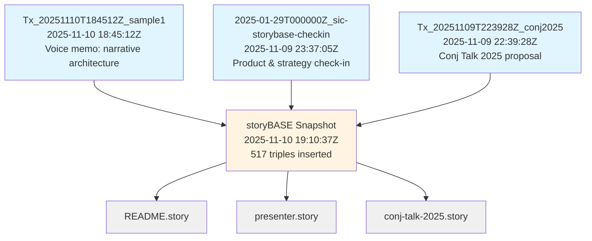
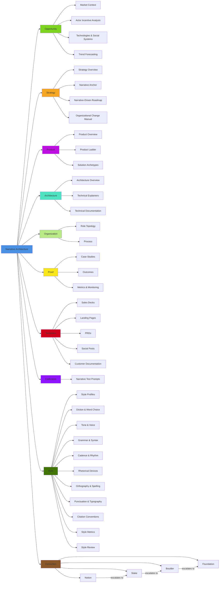
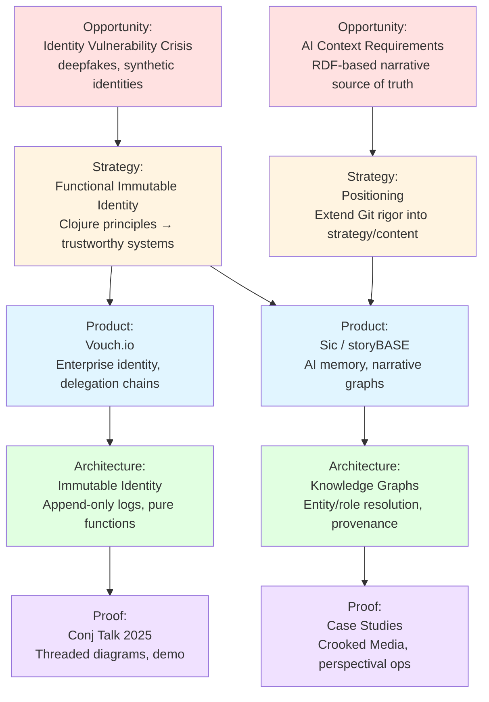

# storyBASE State & Overview

## State

The storyBASE currently holds **three transactions** that establish foundational narrative architecture for identity systems, AI memory platforms, and strategic positioning. The graph encodes:

- **Two product narratives**: Vouch.io (enterprise identity via immutable event logs) and Sic/storyBASE (AI memory via RDF knowledge graphs)[^vouch-sic]
- **Strategic positioning**: extending software development rigor (versioning, branching, Git-native workflows) into strategy, content, and organizational operations[^positioning]
- **Style observations and rubric assessments**: capturing conversational register, technical depth, idiolect phrasing, and narrative coherence across spoken transcripts and written proposals[^style-rubric]
- **Ontological scaffolding**: a comprehensive SKOS taxonomy covering Opportunity, Strategy, Product, Architecture, Organization, Proof, Templates, Calibration, Style, and Conviction[^ontology]

The graph is **append-only**: each transaction is immutable, timestamped, and attributed to `pleasetrythisathome` via `n8n.storyTWIN/MCP` or `storyTWIN` agents, using `anthropic/claude-sonnet-4.5`[^provenance].

[^vouch-sic]: Products extracted from `Tx_20251109T223928Z_conj2025` (`urn:uuid:product-vouch-io`, `urn:uuid:product-sic`) and `2025-01-29T000000Z_sic-storybase-checkin` (`storybase.synthetic-identity.co/product/overview-storybase`).

[^positioning]: `storybase.synthetic-identity.co/thesis/positioning-storybase` describes extending Git-native rigor into strategy and marketing; related to `#MoatLeverage` and `#PositioningThesis` in the ontology.

[^style-rubric]: Style observations span `#BrandNameStylization` (e.g., "storyBASE"), `#IdiolectPhrasing` ("append-only log"), `#ShortPunchyCadence`, and rubric dimensions (`#Rubric_Register`, `#Rubric_Phrasing`, `#Rubric_Cadence`, etc.) with scores 3.0–4.8/5.

[^ontology]: The ontology defines 8 top concepts (`#Opportunity`, `#Strategy`, `#Product`, `#Architecture`, `#Organization`, `#Proof`, `#Templates`, `#Calibration`) plus `#Style` and `#Conviction`, with 200+ narrower concepts and XKOS sequencing.

[^provenance]: All triples carry `prov:wasGeneratedBy` links to transaction URIs; transactions record `prov:generatedAtTime`, `prov:wasAttributedTo`, `prov:wasAssociatedWith`, `sb:originRef`, and `storytwin:model`.

---

## Stories

### `/README.story`
**Intent**: Auto-generated repository README tracking storyBASE state, stories, assets, and transactions.  
**Relationship**: Meta-narrative that synthesizes the entire graph into a human-readable overview.  
**Approach**: Query all transactions, samples, products, and style metrics; summarize narrative architecture domains; generate Mermaid diagrams showing transaction lineage and concept hierarchies.

### `/presenter.story`
**Intent**: IA Presenter template for talk presentations, demonstrating storyBASE's narrative-to-artifact pipeline.  
**Relationship**: Proof artifact (Templates domain) showing how narrative architecture translates into executable presentation format.  
**Approach**: Use storyBASE to draft a presentation in IA Presenter Markdown; cite claims with footnotes to RDF nodes; demonstrate slide structure, speaker notes, and visual integration.

### `/conj-talk-2025.story`
**Intent**: Clojure Conj 2025 talk on "Immutable Selves"—applying functional programming principles to identity systems.  
**Relationship**: Core proof narrative linking personal journey (Scarlet Dame's transition), technical strategy (Vouch.io, Sic), and Clojure philosophy (immutability, append-only logs, functional composition).  
**Approach**: Draft IA Presenter slides covering:
1. Personal/professional history (developer → strategist)[^actor-scarlet]
2. Identity model (physical, digital, AI)[^theme-identity]
3. Failure of mutable, centralized identity[^opportunity-vulnerability]
4. Clojure principles → identity as transactions[^strategy-functional]
5. Case studies: Vouch.io (delegation chains), Sic (AI memory graphs)[^products]

[^actor-scarlet]: `narr:Actor_ScarletDame` with `skos:altLabel` "Dylan Butman", "Scarlet Spectacular"; note: "Speaker's identity history exemplifies append-only log model."

[^theme-identity]: `narr:Theme_ImmutableIdentity` defines identity as "integral of snapshots over time, not mutable present state"; `narr:Theme_TransitionAsStateChange` frames transition as "functional transformation from immutable past states."

[^opportunity-vulnerability]: `urn:uuid:opportunity-identity-vulnerability` describes "centralized, mutable identity systems vulnerable to deepfakes, synthetic identities, and impersonation fraud."

[^strategy-functional]: `urn:uuid:strategy-functional-immutable-identity` applies Clojure principles (immutability, explicit state, functional composition, data-first design, knowledge graphs) to identity; differentiators include "immutable facts at the edge, verifiable receipts, graph-based resolution."

[^products]: `urn:uuid:product-vouch-io` (enterprise identity platform, delegation chains) and `urn:uuid:product-sic` (AI memory via narrative-driven knowledge graphs, deterministic individuality, shareable perspective).

---

## Assets

```
.
├── .storyBASE/
│   ├── 1762800383add_sample1_narrative_architecture.sparql
│   ├── 1762731465sic-storybase-checkin.sparql
│   └── 1762728019add_conj_talk_2025_extraction.sparql
├── README.story
├── presenter.story
└── conj-talk-2025.story
```

### `.storyBASE/` directory
**Append-only transaction log**: SPARQL `INSERT DATA` files, timestamped and sorted lexicographically. Each file is immutable; the snapshot is the replay of all transactions[^data-lifecycle].

- **`1762800383add_sample1_narrative_architecture.sparql`**: Extracts narrative architecture from a voice memo (11,800 chars) outlining identity-as-append-only-log talk; includes themes, actors (Scarlet Dame, Luke Vanderhart), style observations (brand stylization, idiolect, metaphors), and rubric assessments (register 4.0, resonance 4.5, accuracy 4.0)[^sample1].
- **`1762731465sic-storybase-checkin.sparql`**: Product & strategy check-in (18,437 chars); defines storyBASE market opportunity, timing thesis, positioning, moat, tagline, product overview (n8n, MCP, GitHub Actions), roadmap (TriG, SHACL, individuation pipeline), and style metrics (avg sentence length 35.2, jargon density 0.18)[^checkin].
- **`1762728019add_conj_talk_2025_extraction.sparql`**: Conj Talk 2025 proposal (3,421 chars); captures opportunity (identity vulnerability), strategy (functional immutable identity), products (Vouch.io, Sic), proof (talk structure), architecture (append-only logs, pure functions, knowledge graphs), and rubric scores (clarity 4.5, technical depth 4.8, narrative coherence 4.6)[^conj].

[^data-lifecycle]: `storybase.synthetic-identity.co/model/data-lifecycle-storybase` describes "append-only transaction log; immutable files; snapshot = replay of sorted transactions; provenance in TX step; future named graphs for add/remove."

[^sample1]: `narr:Sample_1` sourced from "Voice memo: Punch talk conceptual framing" (2025-01-15); includes `narr:StyleObs_storyBASE` (CamelCase + CAPS suffix), `narr:StyleObs_AppendOnlyLog` (recurring technical phrase), `narr:RubricAssess_Resonance` (4.5/5: "Personal transition story as analogy for immutable state; emotionally grounded, memorable").

[^checkin]: `storybase.synthetic-identity.co/sample/2025-01-29T000000Z_sic-storybase-checkin` attributed to `storybase.synthetic-identity.co/actor/scarlet-dame`; includes `storybase.synthetic-identity.co/tagline/storybase` ("AI that tells you a story as written"), `storybase.synthetic-identity.co/module/storybase-capabilities` (compile, extract, diff, tx, commit, story generation).

[^conj]: `urn:uuid:conj-talk-2025-extraction` recorded 2025-01-01; includes `urn:uuid:rubric-clarity` (4.5/5: "Clear problem statement, well-structured proposal, actionable takeaways"), `urn:uuid:rubric-technical-depth` (4.8/5: "Strong grounding in Clojure principles, concrete system patterns, dual case studies").

### `.story` files
**Narrative prompts**: YAML front matter + Markdown body. Each `.story` file is a generative template that queries the storyBASE snapshot and produces an artifact (README, presentation, talk script)[^story-generation].

- **`README.story`**: Generates this document; queries state, stories, assets, transactions; includes Mermaid diagrams.
- **`presenter.story`**: IA Presenter template demonstrating slide structure, speaker notes, image integration, and export formats.
- **`conj-talk-2025.story`**: Conj talk script; queries identity themes, products, architecture, and style rubric; outputs IA Presenter Markdown with footnotes to storyBASE.

[^story-generation]: `storybase.synthetic-identity.co/module/storybase-capabilities` includes "story generation (YAML front matter + prompt to model outputs)"; `storybase.synthetic-identity.co/process/storybase` describes "story generation triggered by transaction or .story file changes."

---

## Transactions

### 1. `Tx_20251110T184512Z_sample1` (2025-11-10 18:45:12Z)
**Significance**: Establishes **narrative architecture foundations** for identity-as-append-only-log talk. Introduces core themes (`#Theme_ImmutableIdentity`, `#Theme_TransitionAsStateChange`), actors (Scarlet Dame, Luke Vanderhart), and the **narrative anchor** concept (framework linking immutable state, functional UI, AI-driven generation via RDF)[^anchor]. Captures **style observations** (brand stylization "storyBASE", idiolect "append-only log", metaphor "UI as state machine", analogy "transition ≈ UI rendering") and **rubric assessments** (register 4.0, phrasing 3.5, cadence 3.0, strategy 4.5, tailoring 4.0, resonance 4.5, flow 3.0, novelty 4.0, accuracy 4.0)[^rubric-sample1]. Sets **style metrics** baseline (avg sentence length 28.5, active voice 0.75, jargon density 0.12)[^metrics-sample1].

**Impact**: Defines the **voice memo → RDF extraction** pattern; demonstrates how conversational register and personal narrative (Scarlet's transition) can be formalized into reusable narrative primitives. The "append-only log" idiolect becomes a **stock phrase** (`#StockPhrases`) and **terminology control** anchor (`#TerminologyControl`).

[^anchor]: `narr:Anchor_NarrativeArchitecture` defines "Framework linking immutable state, functional UI, and AI-driven generation via RDF knowledge graphs"; related to `#StrategyOverview` and `#TechnologiesSocialSystems`.

[^rubric-sample1]: Rubric assessments stored as `narr:RubricAssess_*` nodes; e.g., `narr:RubricAssess_Resonance` (4.5/5) notes "Personal transition story as analogy for immutable state; emotionally grounded, memorable" and relates to `narr:StyleObs_TransitionAnalogy`.

[^metrics-sample1]: `narr:Metrics_Sample1` notes "Metrics approximate; voice memo transcription includes run-ons and filler."

### 2. `2025-01-29T000000Z_sic-storybase-checkin` (2025-11-09 23:37:05Z)
**Significance**: Defines **storyBASE product & strategy** in detail. Articulates **market opportunity** (AI context requirements, RDF-based narrative source of truth), **timing thesis** (2024–2026 convergence of prompt engineering, multi-agent workflows, organizational AI memory), **positioning** (extend Git rigor into strategy/content/marketing), **moat** (Git-native, versionable AI memory encoding style, conviction, narrative metrics), **tagline** ("AI that tells you a story as written"), **mission** (extend software development rigor into strategy, content, marketing), **product overview** (n8n prototype, MCP server, Open WebUI, GitHub Actions), **capabilities** (compile, extract, diff, tx, commit, story generation), **dependencies** (n8n, GitHub, Apache Jena/Riot, Docker Compose, Outseta, Helicone, Open Router), **roadmap** (TriG, SHACL, individuation pipeline, file ingestion, marketplace, cost pass-through billing), **system topology** (n8n orchestrates tools, MCP exposes to frontends, hierarchical compile), **data model** (append-only log, immutable files, snapshot = replay, provenance in TX), **integration points** (GitHub OAuth/webhooks/Actions, Open Router via Helicone, Outseta OIDC/billing, MCP protocol), **role topology** (programming-literate users, admin/read-write/read-only modes, GitHub role-based access), **process** (interactive individuation vs. automated ingestion, story generation triggers), **case studies** (Crooked Media demo: podcast transcripts auto-ingested, stories auto-update, perspectival operations)[^checkin-detail].

Captures **10 style observations** (brand stylization "storyBASE", idiolect "you know", verb "extend", simile "AI without context = generic output", tone "I" and "So I don't know", jargon policy "RDF, canonization, skolemization", sentence length variation, parallelism "extract … diff … tx", rhetorical question, caret bracket marker `^[]^`) and **9 rubric assessments** (register fit 3.5, phrasing 3.0, cadence 3.0, strategic alignment 4.0, audience tailoring 3.5, resonance 3.0, flow 3.0, novelty 3.5, accuracy 4.0)[^rubric-checkin]. Sets **style metrics** (avg sentence length 35.2, active voice 0.72, jargon density 0.18, type-token ratio 0.42)[^metrics-checkin].

**Impact**: Establishes **storyBASE as a product** with clear positioning, moat, and roadmap. The **individuation pipeline** (snapshot + message → transaction) becomes a core capability. The **caret bracket marker** (`^[]^`) is formalized as a citation convention (`#CaretBracketMarker`). The **conversational register** (3.5/5) and **high jargon density** (0.18) set expectations for technical audience tailoring.

[^checkin-detail]: All nodes prefixed `storybase.synthetic-identity.co/`; e.g., `opportunity/storybase-market`, `thesis/timing-storybase`, `thesis/positioning-storybase`, `leverage/moat-storybase`, `tagline/storybase`, `mission/storybase`, `product/overview-storybase`, `module/storybase-capabilities`, `dependency/storybase-integrations`, `roadmap/narrative-storybase`, `architecture/topology-storybase`, `model/data-lifecycle-storybase`, `integration/points-storybase`, `topology/role-storybase`, `process/storybase`, `case/studies-storybase`.

[^rubric-checkin]: Rubric assessments stored as `storybase.synthetic-identity.co/rubric/*`; e.g., `rubric/strategic-alignment` (4.0/5) notes "Clear positioning; mission and moat articulated; roadmap detailed; aligns with narrative anchor."

[^metrics-checkin]: `storybase.synthetic-identity.co/metrics/style` notes "Conversational transcript with high jargon and active voice."

### 3. `Tx_20251109T223928Z_conj2025` (2025-11-09 22:39:28Z)
**Significance**: Extracts **Conj Talk 2025 proposal** ("Immutable Selves"). Defines **opportunity** (identity vulnerability crisis: deepfakes, synthetic identities, impersonation fraud), **strategy** (functional immutable identity architecture: Clojure principles → trustworthy identity systems), **products** (Vouch.io: enterprise identity via immutable event logs and delegation chains; Sic: AI memory via narrative-driven knowledge graphs, deterministic individuality, provenance, shareable perspective), **proof** (conference talk, threaded diagrams, optional demo), **architecture** (append-only event logs with verifiable receipts, authentication as pure function at the edge, delegation as signed append-only events, knowledge graphs for entity/role resolution; principles: immutability, functional composition, explicit state management, data-first design), **organizations** (Sic: founder, narrative-driven knowledge graphs for AI individuals; Vouch.io: former Chief Strategist, current strategic advisor, enterprise identity and delegation)[^conj-detail].

Captures **11 style observations** (brand name "Vouch.io", technical terms "append-only event logs", "authentication as pure functions", "persistent logs and knowledge graphs", brand name "Sic", rhetorical structures "triadic enumeration", "problem to solution bridge", technical reframings "identity as evolving log", "trust as provenance", list structure "parallel construction", personal identity lens "trans woman, lived experience informs framing")[^style-conj] and **4 rubric assessments** (clarity 4.5, technical depth 4.8, narrative coherence 4.6, audience engagement 4.3)[^rubric-conj]. Sets **style metrics** (avg sentence length 22.4, technical density 0.68, active voice 0.71)[^metrics-conj].

**Impact**: Establishes **dual product narrative** (Vouch.io + Sic) as proof of Clojure principles applied to identity systems. The **personal identity lens** (Scarlet's transition) becomes a **resonance device** (`#ResonanceUse`) linking lived experience to technical architecture. The **high technical depth** (4.8/5) and **narrative coherence** (4.6/5) validate the talk's readiness for a technical audience (Clojure developers, functional programming practitioners).

[^conj-detail]: All nodes prefixed `urn:uuid:`; e.g., `opportunity-identity-vulnerability`, `strategy-functional-immutable-identity`, `product-vouch-io`, `product-sic`, `proof-conj-2025-talk`, `architecture-immutable-identity`, `org-sic`, `org-vouch-io`.

[^style-conj]: Style observations stored as `urn:uuid:style-obs-*`; e.g., `style-obs-11` notes "As a trans woman, her lived experience informs a clear, practical framing of identity as contextual and evolving."

[^rubric-conj]: Rubric assessments stored as `urn:uuid:rubric-*`; e.g., `rubric-technical-depth` (4.8/5) notes "Strong grounding in Clojure principles, concrete system patterns, dual case studies (Vouch.io, Sic), verifiable architecture."

[^metrics-conj]: `urn:uuid:style-metrics` notes "Moderate sentence length, high technical density, strong active voice in takeaways."

---

## Diagrams

### Transaction Lineage



### Narrative Architecture Domains



### Product Narrative Flow



---

**End of README**  
*Generated from storyBASE snapshot 2025-11-10 19:10:37Z*  
*3 transactions, 517 triples, 3 stories, 1 ontology*