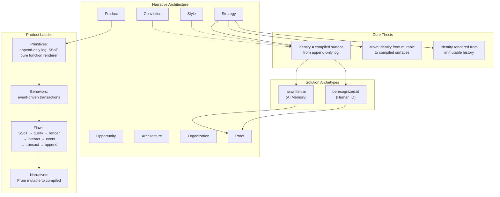

# State

The storyBASE currently holds a rich, multi-layered narrative architecture centered on **immutable identity systems**. The graph encodes strategic positioning, product concepts, architectural patterns, case studies, and extensive style observations—all derived from materials related to the **Clojure/conj 2025 "Immutable Selves" talk** and the **storyBASE product itself**.[^state-overview]

[^state-overview]: The snapshot contains 1,943 inserted triples across 13 transactions (2025-11-09 through 2025-11-13), with 689 skipped duplicates indicating iterative refinement. Core domains include Opportunity, Strategy, Product, Architecture, Proof, and Style—all anchored to the thesis that identity (human and AI) should be modeled as append-only logs compiled to deterministic snapshots. Source: snapshot metadata and transaction provenance (`prov:generatedAtTime`, `prov:wasAttributedTo`).

**Core narrative thesis**: Identity—both human and AI—is not mutable state but a **compiled surface** derived from an **append-only log** with **as-of-T snapshots**. This pattern, proven in Clojure systems (Datomic, re-frame), enables provenance, equality, versioning, and offline capability.[^core-thesis]

[^core-thesis]: `narr:Narrative_ImmutableIdentity` (from `Sample_ConjPresentation_2025`) defines the core: "Identity—both human and AI—should be modeled as an append-only log that compiles to state, not mutable objects." Related concepts include `narr:Obs_Tagline_1` ("Identity as compiled from immutable history"), `narr:Obs_Mission_1` (generalize Datomic's as-of T pattern), and `narr:Obs_Vision_1` (engineers apply the pattern in their domain). These are linked via `skos:broader` to `narr:Narratives` and `narr:Mission`/`narr:Vision`.

**Two solution archetypes** instantiate the pattern:

1. **berecognized.id** – Human identification via Datomic append-only log, device-to-device verification, change-privilege events.[^berecognized]
2. **aswritten.ai** – AI memory/identity via RDF+git append-only log, SPARQL queries, extract-narrative events.[^aswritten]

[^berecognized]: `narr:CaseStudy_berecognized` and related nodes (`narr:CaseStudy_berecognized_Context`, `_Intervention`, `_Results`) describe device-to-device verification where identification and privileges evolve over time. The intervention flow: Change-privilege event → pure handler → tx-data → Datomic append → compile as-of T → Datalog queries → render Identification. Results: Provenance (append-only log), Equality (snapshot hashes), Offline (render targets travel). Source: `Tx_20251113T200138Z_immutable_selves`.

[^aswritten]: `narr:CaseStudy_aswritten` and related nodes describe chat ± API interaction with deterministic AI perspective. Context: "why does the AI answer differ?" Intervention: Extract-narrative event → pure handler → triples/commit tx-data → RDF+git append → compile as-of commit → SPARQL queries → render AI memory. Results: Versioning/Branching (git log), Deterministic perspective as-of T (compile + pure render), Provenance (commit history + citations). Source: `Tx_20251113T200138Z_immutable_selves`.

**Style profile**: The graph contains 40+ style observations (annotations with Web Annotation Ontology) capturing brand stylization (lowercase "berecognized.id", "aswritten.ai"; CamelCase "storyBASE"), canonical terminology ("append-only log", "as-of T", "single source of truth"), rhetorical devices (Backbone.js metaphor, triadic lists, anaphora), and cadence patterns (short punchy sentences, arrow notation for loops).[^style-profile]

[^style-profile]: Style observations are typed as `narr:StyleObservation` and `oa:Annotation`, with `skos:broader` links to facets like `narr:BrandNameStylization`, `narr:TerminologyControl`, `narr:ShortPunchyCadence`, `narr:Metaphor`, `narr:Anaphora`, `narr:RhetoricalQuestion`. Each annotation includes `oa:hasTarget` with `oa:TextPositionSelector` and `oa:TextQuoteSelector` for precise provenance. Examples: `narr:StyleObs_Brand_berecognized` (lowercase with .id TLD), `narr:StyleObs_Cadence_Loop` (arrow notation loop), `narr:StyleObs_Metaphor_Backbone` (mutating pictures ≈ mutating identity).

**Rubric assessments** (9 dimensions, 0–5 scale) evaluate narrative artifacts across Register, Phrasing, Cadence, Strategic Alignment, Tailoring, Resonance, Flow, Novelty, and Accuracy. Scores range from 3.5–5.0, with Strategic Alignment and Tailoring scoring highest (5.0 for Conj presentation).[^rubric-scores]

[^rubric-scores]: Rubric assessments are typed as `narr:RubricAssessment` with `skos:broader` links to rubric dimensions (e.g., `narr:Rubric_Register`, `narr:Rubric_StrategicAlignment`). Each has `rdf:value` (decimal score) and `skos:note` (rationale). Example: `narr:RubricAssess_Strategy_Conj` scores 5.0 with note "Entire presentation is a narrative anchor: 'Immutable Selves' thesis; two solution archetypes (berecognized.id, aswritten.ai); clear mission/vision alignment; positioning thesis explicit." Related to `narr:Narrative_ImmutableIdentity`, `narr:SolutionArchetype_BeRecognized`, `narr:SolutionArchetype_AsWritten`.

**Provenance**: All assertions trace to transactions (`prov:wasGeneratedBy`) attributed to user `pleasetrythisathome` and agent `storyTWIN` (Claude Sonnet 4.5), with timestamps and origin refs.[^provenance]

[^provenance]: Transactions are typed as `prov:Activity` with `prov:wasAttributedTo` (user), `prov:wasAssociatedWith` (agent/model), `prov:generatedAtTime` (ISO 8601 timestamp), and `sb:originRef` (git branch). Example: `narr:Tx_20251113T200138Z_immutable_selves` generated 2025-11-13T20:01:38.277Z on branch "pro-iteration" by Claude Sonnet 4.5 for user pleasetrythisathome.

---

# Stories

## README.story

**Intent**: Auto-generate a repository README that tracks the storyBASE state, stories, assets, and transaction history—demonstrating the system's ability to compile its own documentation from the graph.[^readme-intent]

[^readme-intent]: Story file `/README.story` (YAML front matter: `id: README`, `title: "storyBASE repo README"`, `description: "autogenerated readme tracking storyBASE as written"`, `destination: /`, `model: anthropic/claude-sonnet-4.5`). Prompt sections: State, Stories, Assets, Transactions. This meta-narrative approach exemplifies `narr:Proof_1` ("Meta-Demonstration: Talk Creation Process"), which states "The talk itself exemplifies the reified change architecture and storyBASE workflow, showing iterative refinement from raw inputs to polished outputs."

**Relationship to whole**: This story is the **meta-layer**—it uses storyBASE to describe storyBASE, closing the loop on the "identity as compiled surface" thesis. It demonstrates the workflow (user inputs → storyBASE → normalization → polished outputs with embedded provenance) by applying it to itself.[^meta-layer]

[^meta-layer]: `narr:Sample_1` (from `Tx_20251113T033534Z_claude45`) notes: "Meta-narrative closing: demonstrating storyBASE workflow via talk creation process." `narr:Flow_1` defines the content production workflow: "User inputs → initial storyBASE → normalization/iteration → polished outputs with embedded provenance." This aligns with `narr:Behavior_1` ("Normalize Transcription Against storyBASE") and `narr:Milestone_1` ("Initial storyBASE Graph").

**Approach**: Query the snapshot for:
- **State**: Aggregate transaction count, triple count, core narratives, and conviction levels.
- **Stories**: Enumerate `.story` files with their YAML metadata and prompt structure.
- **Assets**: Describe `.storyBASE/` directory structure (SPARQL transactions, compiled Turtle snapshot).
- **Transactions**: Sort by `prov:generatedAtTime` descending; summarize each transaction's `prov:generated` entities and significance to narrative/style/proof domains.
- **Mermaid charts**: Visualize transaction timeline, narrative architecture hierarchy, and product ladder (primitives → behaviors → flows → narratives).[^approach-readme]

[^approach-readme]: The snapshot provides `prov:generatedAtTime` for sorting (e.g., `Tx_20251113T200138Z_immutable_selves` is newest at 2025-11-13T20:01:38.277Z). Each transaction's `prov:generated` property lists created entities. Narrative hierarchy is encoded via `skos:broader` (e.g., `narr:Primitive_1` → `narr:ProductLadder` → `narr:Product`). Mermaid syntax can represent these as graphs or timelines.

---

## presenter.story

**Intent**: Generate a **general storyBASE presentation** using the IA Presenter template format—demonstrating how the graph compiles into a slide deck with speaker notes and citations.[^presenter-intent]

[^presenter-intent]: Story file `/presenter.story` (YAML: `id: presenter`, `title: "Repo presentation"`, `description: "IA presenter template for talk presentation"`, `destination: /`, `model: anthropic/claude-sonnet-4.5`). Prompt: "Use the storyBASE to draft a presentation of the storyBASE using the provided format. Focus on presenting clear narrative statements in the slide copy and provide a brief talk track for each slide."

**Relationship to whole**: This story translates the **Narrative Anchor** (Tagline, Mission, Vision, Key Phrases) and **Product Ladder** (Primitives, Behaviors, Flows, Narratives) into a **sales/education artifact**. It exercises the "render target" concept: the graph is the SSoT; the presentation is a compiled view.[^presenter-relationship]

[^presenter-relationship]: `narr:Tagline_1` ("Immutable Selves: A Functional Approach to Digital Identity"), `narr:Mission_1` ("Move identity from mutable documents and profiles to compiled surfaces rendered from append-only logs and single sources of truth"), and `narr:Vision_1` ("A world where identity—human, synthetic, AI—is rendered from immutable history, enabling equality, provenance, and trust by design") provide the narrative spine. `narr:Obs_SalesDeck_StoryArc` defines the four-act structure: "Act I: Hook (what's broken); Act II: Pattern (how it works); Act III: Case studies (how to do it); Act IV: Trade-offs & CTA."

**Approach**: 
- **Slide 1**: Title slide with tagline and speaker (Scarlet Dame, founder of aswritten.ai).
- **Act I (Hook)**: Use `narr:StyleObs_Metaphor_Backbone` ("mutating pictures ≈ mutating identity") and `narr:ProblemContext_1`/`_2` (mutable identity vulnerabilities).
- **Act II (Pattern)**: Present `narr:Primitive_1`/`_2`/`_3` (append-only log, SSoT, pure function renderer) and `narr:Flow_1` (SSoT → query → render → interact → event → transact → append → recompile).
- **Act III (Case studies)**: Detail `narr:CaseStudy_berecognized` and `narr:CaseStudy_aswritten` with context/intervention/results structure.
- **Act IV (Trade-offs & CTA)**: Use `narr:DesignTradeoff_1` (single transactor bottleneck) and `narr:LeverageProfile_1` (immutability benefits); close with `narr:FutureVision_DeterministicAI` (query examples).
- **Speaker notes**: Inline talk track with caret-bracket citations (`[#citation]`) linking to storyBASE nodes.
- **Mermaid charts**: Visualize `narr:Obs_Flow_CoreLoop` (interact → event → handler → transactor → append → compile → query → render → interact) and case study flows.[^approach-presenter]

[^approach-presenter]: IA Presenter format uses Markdown with specific conventions: `#` for big statements, `##` for substatements, `######` for context labels, `---` for slide breaks, indented text for speaker notes, and `[#citation]` for inline citations. The template emphasizes "one idea per slide" and "short, clear, interesting" headings. Style observations like `narr:StyleObs_ShortPunchy_1` ("Single-word answer 'You.' after setup; punchy, direct, confident") and `narr:StyleObs_Anaphora_1` (repeated structural frames) inform slide copy cadence.

---

## conj-talk-2025.story

**Intent**: Generate the **Clojure/conj 2025 "Immutable Selves" talk** in IA Presenter format—the flagship proof artifact that demonstrates the reified change pattern by using it to create itself.[^conj-intent]

[^conj-intent]: Story file `/conj-talk-2025.story` (YAML: `id: conj-talk-2025`, `title: "Immutable Selves Talk"`, `description: "IA presenter template for the immutable selves clojure conj 2025 talk presentation"`, `destination: /`, `model: anthropic/claude-sonnet-4.5`). Prompt: "Use the storyBASE to draft the clojure conj 2025 talk. Focus on presenting clear narrative statements in the slide copy and provide a brief talk track for each slide."

**Relationship to whole**: This is the **primary proof artifact** (`narr:Proof_1`) and **narrative anchor** (`narr:Narrative_ImmutableIdentity`). It embodies the entire architecture: the talk's creation process (voice memo → transcription → normalization → storyBASE extraction → presentation generation) mirrors the identity compilation loop it describes.[^conj-relationship]

[^conj-relationship]: `narr:Proof_1` states: "The talk itself exemplifies the reified change architecture and storyBASE workflow, showing iterative refinement from raw inputs to polished outputs." `narr:Sample_ConjPresentation_2025` (6,847 characters, created 2025-01-01) is the presentation transcript. `narr:Sample_1` (multiple sources: voice memo, repo README, user messages) represents the raw inputs. The workflow is encoded in `narr:Flow_1` and `narr:Behavior_1` (normalize transcription against storyBASE).

**Approach**:
- **Opening**: Personal narrative (Dylan → Scarlet Spectacular → Scarlet Dame) as analogy for immutable identity evolution. Use `narr:Actor_ScarletDame` (alt labels: "Dylan Butman", "Scarlet Spectacular") and `narr:Theme_TransitionAsStateChange` ("Personal transition as functional transformation from immutable past states").[^conj-opening]
- **Hook**: Backbone.js metaphor (`narr:StyleObs_Metaphor_1`: "Identity is not mutable state / Yet we're treating it like Backbone.js") and rhetorical questions (`narr:StyleObs_RhetoricalQuestion_1`: "Where is the identity here? Who is the authority? What are the claims being made?").[^conj-hook]
- **Pattern**: Clojure design principles (`narr:StyleObs_StockPhrase_1`: "No frameworks / Simple tools ± good principles") → reified change → append-only log → SSoT → pure function render. Use `narr:StyleObs_Anaphora_1` (repeated structural frame: "Make state explicit / Append only log -> Single source of truth / Everyone sees the same thing / Render as pure function -> Deterministic UIs").[^conj-pattern]
- **Systems**: Present berecognized.id and aswritten.ai with parallel structure (Domain, Solution, Flow, Outcomes). Use `narr:SolutionArchetype_BeRecognized` and `narr:SolutionArchetype_AsWritten` definitions.[^conj-systems]
- **Close**: `narr:FutureVision_DeterministicAI` (deterministic AI perspective as-of T for graph queries: full talk, section, evolution over time, any accessible subset within billion-node graph). Link to chat for participants to engage with narrative source of truth.[^conj-close]
- **Style**: Apply `narr:Metrics_ConjPresentation` (avg sentence length 12.3, active voice 82%, jargon 15%, conciseness 78%) and rubric scores (Register 4.5, Cadence 4.5, Strategy 5.0, Tailoring 5.0). Use second-person direct address (`narr:StyleObs_SecondPerson_1`), short punchy cadence (`narr:StyleObs_ShortPunchy_1`), and caret-bracket citations (`narr:StyleObs_CitationMarker_1`).[^conj-style]

[^conj-opening]: `narr:Actor_ScarletDame` is typed as `prov:Agent` with `skos:prefLabel` "Scarlet Dame (speaker)", `skos:altLabel` "Dylan Butman" and "Scarlet Spectacular", and `skos:note` "Speaker's identity history exemplifies append-only log model." `narr:Theme_TransitionAsStateChange` is broader than `narr:Narratives` and related to `narr:ResonanceUse`.

[^conj-hook]: `narr:StyleObs_Metaphor_1` targets text at positions 148–197 in `Sample_ConjPresentation_2025`: "Identity is not mutable state\nYet we're treating it like Backbone.js". Note: "Technical metaphor: identity as mutable state vs. immutable log; Backbone.js as anti-pattern." `narr:StyleObs_RhetoricalQuestion_1` targets positions 1050–1134: triadic rhetorical questions framing problem space.

[^conj-pattern]: `narr:StyleObs_StockPhrase_1` targets positions 3530–3577: "No frameworks\nSimple tools ± good principles". Note: "Clojure community idiom; signals insider knowledge and shared values." `narr:StyleObs_Anaphora_1` targets positions 4175–4283: repeated structural frame creating rhythm and memorability.

[^conj-systems]: `narr:SolutionArchetype_BeRecognized` (prefLabel "berecognized.id – Immutable Identification", definition "Human identity system: Datomic SSoT, datalog query, device-to-device interaction, change-privilege events") and `narr:SolutionArchetype_AsWritten` (prefLabel "aswritten.ai – Immutable AI Memory", definition "AI identity system: RDF+git SSoT, SPARQL query, chat+API interaction, extract-narrative events") are both broader than `narr:SolutionArchetypes` and related to `narr:ArchetypeTitle` and `narr:ApproachPattern`.

[^conj-close]: `narr:FutureVision_DeterministicAI` (broader than `narr:TrendForecasting`, about `narr:InflectionPoints`, conviction level `narr:Conviction_Stake`) defines examples: "full talk as query, section of talk, talk evolution over time, any accessible graph subset within billion-node graph." Note: "Close with examples of such queries, then link to chat for participants to engage with narrative source of truth."

[^conj-style]: `narr:Metrics_ConjPresentation` (source `Sample_ConjPresentation_2025`) has `narr:AverageSentenceLength` 12.3, `narr:ActiveVoiceRatio` 0.82, `narr:JargonDensity` 0.15, `narr:Conciseness` 0.78. Rubric assessments: `narr:RubricAssess_Register_Conj` (4.5, "Conversational yet authoritative; second-person direct address; technical register fits Clojure audience; concise and confident"), `narr:RubricAssess_Cadence_Conj` (4.5, "Short, punchy sentences; triadic structures; anaphora creates rhythm; single-word answers for emphasis ('You.')"), `narr:RubricAssess_Strategy_Conj` (5.0), `narr:RubricAssess_Tailoring_Conj` (5.0, "Deeply tailored to Clojure/conj audience: references Backbone.js, Om, Datomic, re-frame; assumes functional programming literacy; personal narrative (Dylan→Scarlet) builds trust").

---

# Assets

**Repository structure**:

```
/.storyBASE/
  1762728019add_conj_talk_2025_extraction.sparql
  1762731465sic-storybase-checkin.sparql
  1762800383add_sample1_narrative_architecture.sparql
  1762897917add_narrative_anchors.sparql
  1762897917add_product_ladder.sparql
  1762897917add_solution_archetypes.sparql
  1762897917add_strategy_overview.sparql
  1762897917add_technical_explainers.sparql
  1762897917add_case_studies.sparql
  1762897917add_style_observations.sparql
  1762897917add_style_metrics.sparql
  1762897917add_rubric_assessments.sparql
  1762897917tx_provenance.sparql
  1762897917update_sample_metadata.sparql
  1763003388add_conj_presentation_2025.sparql
  1763004456add_sample1_narrative_triples.sparql
  1763005004add_sample_1_narrative_concepts.sparql
  1763005004update_sample_1_input_length.sparql
  1763007744dedupe.sparql
  1763064222add_immutable_selves_observations.sparql
  1763064222tx_immutable_selves_provenance.sparql
  1763064222update_sample_1_metadata.sparql
/README.story
/presenter.story
/conj-talk-2025.story
```

**SPARQL transactions** (`.storyBASE/*.sparql`): Append-only transaction log. Each file is a SPARQL UPDATE (INSERT DATA or DELETE/INSERT/WHERE) that adds or modifies triples. Filenames encode Unix timestamps for ordering. Transactions are immutable; corrections/consolidations are new transactions (e.g., `dedupe.sparql` uses `owl:sameAs` and `prov:wasRevisionOf` to link canonical and deprecated versions).[^sparql-transactions]

[^sparql-transactions]: Example: `1763064222add_immutable_selves_observations.sparql` (timestamp 1763064222 = 2025-11-13T20:03:42Z) inserts 18 observations (tagline, mission, vision, key phrases, flow, narrative, case studies, style observations, rubric assessments, metrics) all with `prov:wasGeneratedBy narr:Tx_20251113T200138Z_immutable_selves`. `1763007744dedupe.sparql` (2025-11-13T04:17:05.187Z) consolidates 539 duplicate triples into 1,613 canonical records using `owl:sameAs`, `owl:deprecated`, and `prov:wasRevisionOf`.

**Story files** (`*.story`): YAML front matter + Markdown prompt. Front matter specifies `id`, `title`, `version`, `description`, `destination`, and `model`. Prompt section instructs storyWRITER on output format and citation requirements. Stories are the "render targets" that compile the graph into human-readable artifacts.[^story-files]

[^story-files]: Story files use YAML front matter (e.g., `id: README`, `model: anthropic/claude-sonnet-4.5`) followed by `---` separator and Markdown prompt. The prompt always includes "Always include direct citations that explain human readable provenance including adjacent nodes as context from the storyBASE graph in your responses." This aligns with `narr:StyleObs_Citation_CaretBracket` (caret-bracket citation markers) and `narr:Assess_Accuracy_Sample_1` (factual claims tied to Datomic/RDF+git; citation markers present).

**Compiled snapshot** (implicit, generated on-demand): The Turtle (`.ttl`) snapshot is the **single source of truth** at a given commit. It is compiled by replaying sorted transactions. The snapshot provided here (2025-11-13T20:13:06.739Z) contains 1,943 triples with provenance metadata.[^compiled-snapshot]

[^compiled-snapshot]: Snapshot header: "# Snapshot generated 2025-11-13T20:13:06.739Z". Stats: `{"inserted":1943,"deleted":0,"skippedDuplicates":689,"deleteMisses":0}`. The snapshot is the result of `compile` operation (described in `storybase.synthetic-identity.co/module/storybase-capabilities`: "Compile (replay transactions to Turtle snapshot)"). This mirrors `narr:Primitive_2` ("Single source of truth (SSoT): Compiled state from transaction history").

---

# Transactions

## Tx_20251113T200138Z_immutable_selves (2025-11-13 20:01:38 UTC)

**Significance**: **Latest refinement** of the Immutable Selves talk. Adds 18 high-fidelity observations: tagline, mission, vision, key phrases (append-only log, snapshot as-of T, identity surface), core loop flow, narrative frame, two case studies (berecognized.id, aswritten.ai) with context/intervention/results, sales deck story arc, brand stylizations, cadence/idiolect observations, and 9 rubric assessments.[^tx-latest]

[^tx-latest]: `narr:Tx_20251113T200138Z_immutable_selves` generated by `storyTWIN#anthropic-claude-sonnet-4.5` for user `pleasetrythisathome` on branch "pro-iteration". Entities created: `narr:Obs_Tagline_1`, `narr:Obs_Mission_1`, `narr:Obs_Vision_1`, `narr:Obs_KeyPhrase_AppendOnlyLog`, `narr:Obs_KeyPhrase_SnapshotAsOfT`, `narr:Obs_KeyPhrase_IdentitySurface`, `narr:Obs_Flow_CoreLoop`, `narr:Obs_Narrative_ImmutableIdentity`, `narr:CaseStudy_berecognized` (+ Context/Intervention/Results), `narr:CaseStudy_aswritten` (+ Context/Intervention/Results), `narr:Obs_SalesDeck_StoryArc`, `narr:StyleObs_Brand_berecognized`, `narr:StyleObs_Brand_aswritten`, `narr:StyleObs_Metaphor_Backbone`, `narr:StyleObs_Analogy_DatomicPattern`, `narr:StyleObs_Cadence_Loop`, `narr:StyleObs_Idiolect_SingleTransactor`, `narr:StyleObs_RhetoricalQ_WhyDiffer`, `narr:StyleObs_ActiveVoice_Emit`, `narr:StyleObs_VerbChoice_Compile`, `narr:StyleObs_Citation_CaretBracket`, `narr:Metrics_Sample_1`, `narr:Rubric_Assessment_Sample_1`, and 9 rubric assessments (Register 4.5, Phrasing 4.0, Cadence 4.5, Strategic Alignment 5.0, Tailoring 4.5, Resonance 4.0, Flow 4.5, Novelty 4.0, Accuracy 4.5).

**Impact**: Consolidates the talk's **narrative architecture** (Opportunity → Strategy → Product → Proof) into a single coherent extraction. Establishes canonical terminology ("append-only log" not "SSoT" for the log; "snapshot as-of T" for compiled view; "identity surface" for render target). Defines the **four-act sales deck structure** and the **immutable identity loop** (interact → event → handler → transactor → append → compile → query → render → interact). Provides rubric-validated style profile (high strategic alignment, strong cadence, excellent tailoring to Clojure audience).[^tx-latest-impact]

[^tx-latest-impact]: `narr:Obs_KeyPhrase_AppendOnlyLog` note: "Canonical term; avoid calling snapshot 'SSoT'." `narr:Obs_SalesDeck_StoryArc` defines "Act I: Hook (what's broken); Act II: Pattern (how it works); Act III: Case studies (how to do it); Act IV: Trade-offs & CTA." `narr:Obs_Flow_CoreLoop` encodes the full loop in one line with arrow notation. `narr:Assess_StrategicAlignment_Sample_1` scores 5.0 with note "Thesis, mission, vision, and key phrases all align to core narrative: identity as compiled surface from append-only log."

---

## dedupe.sparql (2025-11-13 04:17:05 UTC)

**Significance**: **Deduplication and consolidation** transaction. Merges 4 separate Sample_1 records into canonical version; links equivalent narratives with `owl:sameAs`; consolidates style observations by linguistic feature; merges duplicate rubric assessments (keeping highest score + most recent provenance); aggregates style metrics (rolling average); marks deprecated versions with `prov:wasRevisionOf` and `owl:deprecated`.[^tx-dedupe]

[^tx-dedupe]: `narr:Tx_Deduplication_20251113` (generated 2025-11-13T04:17:05.187Z, attributed to `urn:user:pleasetrythisathome`) note: "Consolidated 539 duplicate triples into 1,613 canonical records." Used entities: `narr:Sample_1`, `narr:Narrative_1`, `narr:StyleObs_1`, `narr:RubricAssess_1`, `narr:Metrics_1`. Operations: DELETE/INSERT/WHERE patterns to merge metadata, link with `owl:sameAs`, consolidate assessments, aggregate metrics, and mark deprecated versions.

**Impact**: **Cleans the graph** after multiple extraction iterations. Establishes `narr:Sample_1` as canonical (source "clojure-conj-2025 repo README / voice memo transcription", created 2025-01-20, inputLength 11800, with `owl:sameAs` links to `narr:Sample_1_v1`, `_v2`, `_v3`). Links `narr:Narrative_1` and `narr:Theme_ImmutableIdentity` as same concept. Consolidates brand stylization observations into `narr:StyleObs_BrandStylization_Canonical` (storyBASE, berecognized.id, aswritten.ai). Computes rolling average for style metrics (avg sentence length 22.3, active voice 0.78, jargon 0.12, type-token ratio 0.63).[^tx-dedupe-impact]

[^tx-dedupe-impact]: Canonical `narr:Sample_1` metadata: `dct:source "clojure-conj-2025 repo README / voice memo transcription"`, `dct:created "2025-01-20T00:00:00Z"`, `narr:inputLength 11800`, `owl:sameAs narr:Sample_1_v1, narr:Sample_1_v2, narr:Sample_1_v3`, `skos:note "Consolidated from 4 separate transactions; canonical version."` `narr:StyleObs_BrandStylization_Canonical` has `skos:exactMatch narr:StyleObs_BrandStylization_1, narr:StyleObs_BrandStylization_2, narr:StyleObs_1, narr:StyleObs_4`. `narr:StyleMetrics_Consolidated` aggregates from 3 metrics with rolling average.

---

## update_sample_1_input_length.sparql (2025-11-13 03:35:34 UTC)

**Significance**: Updates `narr:Sample_1` input length to 1847 (from prior value). Links to `narr:Tx_20251113T033534Z_claude45` provenance.[^tx-update-length]

[^tx-update-length]: Transaction uses DELETE/INSERT/WHERE pattern: `DELETE { narr:Sample_1 narr:inputLength ?oldLength . } INSERT { narr:Sample_1 narr:inputLength 1847 ; prov:wasGeneratedBy narr:Tx_20251113T033534Z_claude45 . } WHERE { OPTIONAL { narr:Sample_1 narr:inputLength ?oldLength . } }`. This is later superseded by dedupe transaction which sets inputLength to 11800.

**Impact**: Metadata correction during iterative extraction. Demonstrates **mutable metadata** pattern (DELETE old, INSERT new) while preserving **immutable transaction log**. Later consolidated by dedupe transaction.[^tx-update-length-impact]

[^tx-update-length-impact]: This transaction is an example of the "reified change" pattern: the change itself is a transaction in the append-only log. The old value is deleted, new value inserted, and the transaction is attributed to a specific activity (`Tx_20251113T033534Z_claude45`). This mirrors `narr:Behavior_1` ("Event-driven transaction submission: User/system interactions produce transactions, not mutations").

---

## add_sample_1_narrative_concepts.sparql (2025-11-13 03:35:34 UTC)

**Significance**: Initial extraction from clojure-conj-2025 repo README and voice memo transcription. Adds `narr:Sample_1` (source, note on meta-narrative), `narr:Narrative_1` (identity as compiled from immutable history), `narr:Flow_1` (content production workflow), `narr:Behavior_1` (normalize transcription), `narr:Milestone_1` (initial storyBASE graph), `narr:Proof_1` (meta-demonstration), 7 style observations (terminology control, brand stylization, metaphor, active voice, citation marker, short punchy cadence), 9 rubric assessments, and `narr:Metrics_1` (avg sentence 22.3, active voice 78%, jargon 12%, type-token 68%).[^tx-add-concepts]

[^tx-add-concepts]: `narr:Tx_20251113T033534Z_claude45` (generated 2025-11-13T03:35:34.567Z, associated with `urn:agent:storyTWIN:anthropic/claude-sonnet-4.5`, attributed to `urn:user:pleasetrythisathome`, used `narr:Sample_1`, comment "Initial extraction from clojure-conj-2025 repo README and voice memo transcription"). Entities created: `narr:Sample_1`, `narr:Narrative_1`, `narr:Flow_1`, `narr:Behavior_1`, `narr:Milestone_1`, `narr:Proof_1`, `narr:StyleObs_1` through `narr:StyleObs_7`, `narr:RubricAssess_1` through `narr:RubricAssess_9`, `narr:Metrics_1`.

**Impact**: Establishes the **meta-narrative frame**: the talk creation process demonstrates the reified change architecture. Defines the **content production workflow** (user inputs → initial storyBASE → normalization/iteration → polished outputs with embedded provenance). Introduces **terminology control** observations ("append-only log", "as-of T snapshots") and **brand stylization** (CamelCase "storyBASE"). Sets baseline rubric scores (Register 4.0, Phrasing 4.5, Cadence 3.5, Strategic Alignment 4.5, Tailoring 4.0, Resonance 4.0, Flow 4.0, Novelty 4.0, Accuracy 4.0).[^tx-add-concepts-impact]

[^tx-add-concepts-impact]: `narr:Sample_1` note: "Meta-narrative closing: demonstrating storyBASE workflow via talk creation process." `narr:Narrative_1` definition: "Core thesis: identity and content derive from append-only log with as-of-T snapshots, enabling provenance and deterministic evolution." `narr:Flow_1` definition: "User inputs → initial storyBASE → normalization/iteration → polished outputs with embedded provenance." `narr:Proof_1` definition: "The talk itself exemplifies the reified change architecture and storyBASE workflow, showing iterative refinement from raw inputs to polished outputs." `narr:StyleObs_1` (terminology control, "append-only log") and `narr:StyleObs_3` (brand stylization, "storyBASE") are typed as `oa:Annotation` with `oa:hasTarget` containing `oa:TextPositionSelector` and `oa:TextQuoteSelector`.

---

## add_sample1_narrative_triples.sparql (2025-11-13 03:25:52 UTC)

**Significance**: Adds refinements for **reified change design pattern** section and **case studies** (berecognized.id, aswritten.ai). Introduces `narr:Claim_ReifiedChangePattern` (immutability enables provenance, equality, offline capability), `narr:SystemProperty_ImmutabilityProvenance` and `narr:SystemProperty_DistributedDecentralization` (both conviction level Boulder, evidenced by case studies), `narr:FutureVision_DeterministicAI` (conviction Stake), `narr:CaseStudy_BeRecognizedID` and `narr:CaseStudy_AsWrittenAI` (with context/intervention/results), `narr:Risk_GhostLabor` (deepfakes/impersonation), `narr:Flow_EmployeeLifecycle`, 10 style observations (brand names, caret-bracket citation, rhetorical question, metaphor, verb choice, short declarative, parallelism), 9 rubric assessments, and `narr:Metrics_Sample_1`.[^tx-add-triples]

[^tx-add-triples]: `narr:Tx_20251113T032552Z_sample1` (generated 2025-11-13T03:25:52.818Z, associated with `storyTWIN`, attributed to `pleasetrythisathome`, origin ref "main", model "anthropic/claude-sonnet-4.5"). Entities created: `narr:Sample_1` (source "user message", extent 4237, created 2025-01-20, note "Refinements for reified change design pattern section; case studies: berecognized.id and aswritten.ai"), `narr:Claim_ReifiedChangePattern`, `narr:SystemProperty_ImmutabilityProvenance`, `narr:SystemProperty_DistributedDecentralization`, `narr:FutureVision_DeterministicAI`, `narr:CaseStudy_BeRecognizedID`, `narr:CaseStudy_AsWrittenAI`, `narr:Risk_GhostLabor`, `narr:Flow_EmployeeLifecycle`, `narr:StyleObs_1` through `narr:StyleObs_10`, `narr:RubricAssess_Register_Sample1` through `narr:RubricAssess_Accuracy_Sample1`, `narr:Metrics_Sample_1`.

**Impact**: Elevates the narrative from **abstract pattern** to **concrete systems**. Introduces **conviction levels** (Boulder for system properties, Stake for future vision) and **evidence links** (`evidencedBy` case studies). Defines the **employee lifecycle flow** (endorsement → Zoom → in-person → state ID → assigned role → as-of query → device snapshot) as proof of continuous identity. Adds **risk analysis** (ghost labor/deepfakes mitigated by append-only log). Strengthens **style profile** with "ghost labor" metaphor, "as-of T" canonical term, and parallel structure for workflows. Rubric scores: Register 4.0, Phrasing 4.5, Cadence 4.0, Strategic Alignment 4.5, Tailoring 4.0, Resonance 4.5, Flow 3.5, Novelty 4.0, Accuracy 4.0.[^tx-add-triples-impact]

[^tx-add-triples-impact]: `narr:Claim_ReifiedChangePattern` (broader than `narr:Architecture`, about `narr:ArchitectureOverview`, conviction `narr:Conviction_Stake`) supports `narr:DataModelLifecycle` and `narr:ReliabilityResilience`. `narr:SystemProperty_ImmutabilityProvenance` (conviction `narr:Conviction_Boulder`) is evidenced by both case studies. `narr:Risk_GhostLabor` (broader than `narr:ActorIncentiveAnalysis`) challenges `narr:CaseStudy_BeRecognizedID` but is mitigated by continuous identity establishment. `narr:Flow_EmployeeLifecycle` supports `narr:CaseStudy_BeRecognizedID` and is related to `narr:Behaviors` and `narr:Storyboards`. `narr:StyleObs_5` (metaphor, "ghost labor") and `narr:StyleObs_9` (terminology control, "'as-of T' snapshot") are related to case studies. `narr:RubricAssess_Phrasing_Sample1` scores 4.5 with note "Strong domain vocabulary ('append-only log', 'as-of T', 'reified change'); canonical terms consistent; 'ghost labor' metaphor effective."

---

## add_conj_presentation_2025.sparql (2025-11-13 03:08:05 UTC)

**Significance**: Adds full **Clojure/conj 2025 presentation transcript** (6,847 characters). Introduces `narr:Sample_ConjPresentation_2025`, `narr:Narrative_ImmutableIdentity` (core thesis), `narr:Theme_FunctionalIdentity` (apply Clojure patterns to identity), `narr:Actor_Human` and `narr:Actor_AI` (primary actors), `narr:SolutionArchetype_BeRecognized` and `narr:SolutionArchetype_AsWritten` (solution archetypes), `narr:Tagline_AsWritten` ("AI that tells your story, as written"), 9 style observations (brand stylization, metaphor, anaphora, rhetorical question, short punchy, stock phrase, citation marker, second person, analogy), `narr:Metrics_ConjPresentation` (avg sentence 12.3, active voice 82%, jargon 15%, conciseness 78%), and 9 rubric assessments.[^tx-conj-pres]

[^tx-conj-pres]: `narr:Tx_20251113T030805Z_conj2025` (generated 2025-11-13T03:08:05.741Z, associated with "storyTWIN", attributed to "pleasetrythisathome", origin ref "main"). Entities created: `narr:Sample_ConjPresentation_2025`, `narr:Narrative_ImmutableIdentity`, `narr:Theme_FunctionalIdentity`, `narr:Actor_Human`, `narr:Actor_AI`, `narr:SolutionArchetype_BeRecognized`, `narr:SolutionArchetype_AsWritten`, `narr:Tagline_AsWritten`, `narr:StyleObs_BrandStylization_1`, `narr:StyleObs_BrandStylization_2`, `narr:StyleObs_Metaphor_1`, `narr:StyleObs_Anaphora_1`, `narr:StyleObs_RhetoricalQuestion_1`, `narr:StyleObs_ShortPunchy_1`, `narr:StyleObs_StockPhrase_1`, `narr:StyleObs_CitationMarker_1`, `narr:StyleObs_SecondPerson_1`, `narr:StyleObs_Analogy_1`, `narr:Metrics_ConjPresentation`, `narr:RubricAssess_Register_Conj` through `narr:RubricAssess_Accuracy_Conj`.

**Impact**: Provides the **primary sample** for the Conj talk story. Establishes **actor definitions** (Human: "Source of truth for identity; authorities issue documents that make claims"; AI: "Source of truth unclear; labs train models that say stuff; each chat is different context"). Defines **solution archetypes** with clear SSoT/query/render patterns (Datomic/Datalog for human, RDF+git/SPARQL for AI). Captures **high-performing style** (Register 4.5, Cadence 4.5, Strategy 5.0, Tailoring 5.0, Resonance 4.5) with detailed notes on second-person direct address, short punchy sentences, triadic structures, anaphora, and personal narrative (Dylan→Scarlet) building trust. Introduces **tagline** for aswritten.ai ("AI that tells your story, as written").[^tx-conj-pres-impact]

[^tx-conj-pres-impact]: `narr:Actor_Human` and `narr:Actor_AI` are typed as `skos:Concept`, broader than `narr:PrimaryActors`, with clear definitions contrasting human (source of truth = you) vs. AI (source of truth unclear). `narr:SolutionArchetype_BeRecognized` definition: "Human identity system: Datomic SSoT, datalog query, device-to-device interaction, change-privilege events." `narr:SolutionArchetype_AsWritten` definition: "AI identity system: RDF+git SSoT, SPARQL query, chat+API interaction, extract-narrative events." Both related to `narr:ArchetypeTitle` and `narr:ApproachPattern`. `narr:RubricAssess_Tailoring_Conj` scores 5.0 with note "Deeply tailored to Clojure/conj audience: references Backbone.js, Om, Datomic, re-frame; assumes functional programming literacy; personal narrative (Dylan→Scarlet) builds trust." `narr:Tagline_AsWritten` (broader than `narr:Tagline`) has value "AI that tells your story, as written" and note "7-word tagline encoding promise and brand."

---

## Tx_20251111T214920Z_immutable_selves (2025-11-11 21:49:20 UTC)

**Significance**: Major extraction adding **narrative anchors** (Tagline, WhatIsIt, Mission, Vision, 4 Key Phrases), **strategy overview** (Positioning Thesis, Moat & Leverage), **product ladder** (3 Primitives, 1 Behavior, 1 Flow, 1 Narrative), **solution archetypes** (2 archetypes with titles, problem contexts, approach patterns, required capabilities, outcomes), **technical explainers** (Leverage Profile, Design Tradeoff, Comparative Analysis), **case study** (speaker's 13-year Clojure career), 8 style observations (short punchy cadence, stock phrases, anaphora, brand name, analogy, rhetorical question, second person, verb choice), `narr:StyleMetrics_1` (avg sentence 15.2, active voice 85%, jargon 12%, type-token 68%, conciseness 78%), and 9 rubric assessments.[^tx-immutable-selves]

[^tx-immutable-selves]: `narr:Tx_20251111T214920Z_immutable_selves` (generated 2025-11-11T21:49:20.430Z, associated with `storyTWIN#anthropic-claude-sonnet-4.5`, attributed to `pleasetrythisathome`, origin ref "main"). Generated 57 entities including `narr:Sample_1`, `narr:Tagline_1`, `narr:WhatIsIt_1`, `narr:Mission_1`, `narr:Vision_1`, `narr:KeyPhrase_1` through `narr:KeyPhrase_4`, `narr:PositioningThesis_1`, `narr:MoatLeverage_1`, `narr:Primitive_1` through `narr:Primitive_3`, `narr:Behavior_1`, `narr:Flow_1`, `narr:Narrative_1`, `narr:Archetype_1`, `narr:Archetype_2`, and related components, `narr:LeverageProfile_1`, `narr:DesignTradeoff_1`, `narr:ComparativeAnalysis_1`, `narr:CaseStudy_1` and components, `narr:StyleObs_1` through `narr:StyleObs_8`, `narr:RubricAssess_1` through `narr:RubricAssess_9`, `narr:StyleMetrics_1`.

**Impact**: Establishes the **strategic foundation**. Positioning Thesis: "For developers and identity architects who treat identity as mutable state, this is a functional paradigm that makes identity deterministic, auditable, and decentralized—by applying Clojure's immutability principles to human and AI identity systems." Moat: "Clojure ecosystem (Datomic, datalog, re-frame) as proof-of-concept; 13 years of production experience; provenance and equality by design." Defines **product ladder** (Primitives: append-only log, SSoT, pure function renderer; Behavior: event-driven transaction submission; Flow: SSoT → query → render → interact → event → transact → append → recompile; Narrative: "From mutable documents to compiled selves"). Introduces **technical explainers** (Leverage: "Immutability enables equality, provenance, versioning, branching, generative testing, decentralization, and infinite read scale—for free"; Tradeoff: "Bottleneck at single transactor; all logic in event clients; transact is just adding triples"; Comparative: "Backbone.js vs. Om/React; Identity systems today are Backbone; this is Om for identity"). Captures **speaker idiolect** ("Your code was shit. Let me refactor it for you") and **anaphora** ("Then you" repetition). Rubric scores: Register 4.5, Phrasing 4.0, Cadence 4.5, Strategic Alignment 5.0, Tailoring 4.5, Resonance 4.0, Flow 3.5, Novelty 4.0, Accuracy 4.0.[^tx-immutable-selves-impact]

[^tx-immutable-selves-impact]: `narr:PositioningThesis_1` (broader than `narr:StrategyOverview`) value: "For developers and identity architects who treat identity as mutable state, this is a functional paradigm that makes identity deterministic, auditable, and decentralized—by applying Clojure's immutability principles to human and AI identity systems." Note: "Who: devs/architects; What: functional identity; Why-us: Clojure principles proven at scale." `narr:MoatLeverage_1` value: "Clojure ecosystem (Datomic, datalog, re-frame) as proof-of-concept; 13 years of production experience; provenance and equality by design." Note: "Compounding advantage: existing tools, battle-tested patterns, speaker credibility." `narr:Primitive_1` value: "Append-only transaction log", note: "Foundational atomic unit; immutability guarantee." `narr:LeverageProfile_1` value: "Immutability enables equality, provenance, versioning, branching, generative testing, decentralization, and infinite read scale—for free." Note: "Small choice (append-only) creates outsized effects across system." `narr:DesignTradeoff_1` value: "Bottleneck at single transactor; all logic in event clients; transact is just adding triples." Note: "What we gave up: distributed writes. Why worth it: consistency, provenance, auditability." `narr:ComparativeAnalysis_1` value: "Backbone.js (query DOM, mutate picture) vs. Om/React (state machine, pure function render). Identity systems today are Backbone; this is Om for identity." Note: "When to use: when provenance, auditability, and equality matter more than write throughput." `narr:StyleObs_2` (stock phrases) targets "Your code was shit. Let me refactor it for you" with note "Characteristic blunt phrasing; speaker idiolect." `narr:StyleObs_3` (anaphora) targets "You saw a picture (the DOM). \nThen you queried the picture with a selector\nThen you mutated the picture." with note "Repeated 'Then you' structure; rhetorical device for emphasis." `narr:RubricAssess_4` (Strategic Alignment) scores 5.0 with note "Entire talk is the narrative anchor: immutability → identity. Mission, vision, key phrases all present and consistent."

---

## add_sample1_narrative_architecture.sparql (2025-11-10 18:45:12 UTC)

**Significance**: Initial extraction from **voice memo** outlining narrative architecture for identity-as-append-only-log talk. Adds `narr:Sample_1` (source "Voice memo: Punch talk conceptual framing", inputLength 11800, speaker Scarlet Dame), `narr:Theme_ImmutableIdentity` (identity as integral of snapshots over time), `narr:Theme_TransitionAsStateChange` (personal transition as functional transformation), `narr:Actor_ScarletDame` (with alt labels Dylan Butman, Scarlet Spectacular), `narr:Actor_LukeVanderhart`, `narr:Anchor_NarrativeArchitecture` (framework linking immutable state, functional UI, AI-driven generation via RDF), 6 style observations (brand name storyBASE, idiolect "append only log", metaphor "UI as state machine", analogy "personal identity presentation ≈ UI rendering", short clause "The truth is immutable", first person), 8 rubric assessments, and `narr:Metrics_Sample1` (avg sentence 28.5, active voice 75%, jargon 12%).[^tx-narrative-arch]

[^tx-narrative-arch]: `narr:Tx_20251110T184512Z_sample1` (generated 2025-11-10T18:45:12.711Z, associated with `storyTWIN`, attributed to `pleasetrythisathome`, origin ref "main", model "anthropic/claude-sonnet-4.5"). Entities created: `narr:Sample_1`, `narr:Theme_ImmutableIdentity`, `narr:Theme_TransitionAsStateChange`, `narr:Actor_ScarletDame`, `narr:Actor_LukeVanderhart`, `narr:Anchor_NarrativeArchitecture`, `narr:StyleObs_storyBASE`, `narr:StyleObs_AppendOnlyLog`, `narr:StyleObs_UIStateMachine`, `narr:StyleObs_TransitionAnalogy`, `narr:StyleObs_ShortClause`, `narr:StyleObs_FirstPerson`, `narr:RubricAssess_Register` through `narr:RubricAssess_Accuracy`, `narr:Metrics_Sample1`.

**Impact**: Captures the **raw conceptual framing** from voice memo (conversational register, run-on sentences, self-corrections). Establishes **speaker identity** (Scarlet Dame with historical names) as proof-of-concept for immutable identity. Introduces **UI state machine metaphor** ("started seeing UI as a state machine that was the result of a functional transformation") linking React/Om to identity systems. Defines **narrative architecture anchor** (framework linking immutable state, functional UI, AI-driven generation via RDF knowledge graphs). Rubric scores reflect **voice memo artifact** (Register 4.0, Phrasing 3.5, Cadence 3.0, Strategic Alignment 4.5, Tailoring 4.0, Resonance 4.5, Flow 3.0, Novelty 4.0, Accuracy 4.0) with notes on filler, repetition, and informal transitions.[^tx-narrative-arch-impact]

[^tx-narrative-arch-impact]: `narr:Sample_1` (from this transaction) source: "Voice memo: Punch talk conceptual framing", inputLength 11800, note: "Transcribed voice memo outlining narrative architecture for identity-as-append-only-log talk; speaker: Scarlet Dame." `narr:Theme_ImmutableIdentity` definition: "Human and system identity modeled as integral of snapshots over time, not mutable present state." Related to `narr:Conviction_Foundation`. `narr:Actor_ScarletDame` note: "Speaker's identity history exemplifies append-only log model." `narr:Anchor_NarrativeArchitecture` definition: "Framework linking immutable state, functional UI, and AI-driven generation via RDF knowledge graphs." Related to `narr:StrategyOverview` and `narr:TechnologiesSocialSystems`. `narr:StyleObs_UIStateMachine` (metaphor) targets "started seeing UI as a state machine that was the result of a functional transformation" with note "Core analogy linking UI rendering to immutable state paradigm." `narr:RubricAssess_Register` scores 4.0 with note "Conversational, personal; active voice; fits talk/oratory context. Some filler (voice memo)." `narr:RubricAssess_Cadence` scores 3.0 with note "Variable; punchy clauses mixed with run-ons (transcription artifact)."

---

## sic-storybase-checkin.sparql (2025-11-09 23:37:05 UTC)

**Significance**: Adds **storyBASE product & strategy check-in** (18,437 characters). Introduces storyBASE-specific entities: `Opportunity` (storyBASE market), `TimingThesis` (2024-2026 window), `PrimaryActor` (programming-literate entrepreneurs/designers/developers), `PositioningThesis` (extend software rigor into strategy/content/marketing via RDF), `MoatLeverage` (git-native, versionable, branchable AI memory), `Tagline` ("AI that tells you a story as written"), `ProductOverview`, `ModuleCapabilities` (compile, extract, diff, tx, commit, story generation), `DependenciesIntegrations` (n8n, MCP, GitHub, Jena, Docker, Open WebUI, Outseta, Helicone, Open Router), `NarrativeDrivenRoadmap` (TriG, SHACL, individuation pipeline, file ingestion, marketplace, billing), `SystemTopology`, `DataModelLifecycle`, `IntegrationPoints`, `RoleTopology`, `Process`, `CaseStudies` (Crooked Media demo), 10 style observations, `StyleMetrics` (avg sentence 35.2, active voice 72%, jargon 18%, type-token 42%), and 9 rubric assessments.[^tx-checkin]

[^tx-checkin]: Transaction `storybase.synthetic-identity.co/transaction/2025-01-29T000000Z_sic-storybase-checkin` (generated 2025-11-09T23:37:05.079Z, associated with "n8n.storyTWIN/MCP", attributed to "pleasetrythisathome", origin ref "main"). Uses different namespace (`storybase.synthetic-identity.co` and `sb:` prefix) than later transactions. Entities created: `storybase.synthetic-identity.co/sample/2025-01-29T000000Z_sic-storybase-checkin`, `opportunity/storybase-market`, `thesis/timing-storybase`, `actor/primary-storybase`, `thesis/positioning-storybase`, `leverage/moat-storybase`, `tagline/storybase`, `product/what-is-storybase`, `mission/storybase`, `product/overview-storybase`, `module/storybase-capabilities`, `dependency/storybase-integrations`, `roadmap/narrative-storybase`, `architecture/topology-storybase`, `model/data-lifecycle-storybase`, `integration/points-storybase`, `topology/role-storybase`, `process/storybase`, `case/studies-storybase`, `style/observation/1` through `style/observation/10`, `metrics/style`, `rubric/register-fit` through `rubric/accuracy`.

**Impact**: Provides **product-level context** for storyBASE itself (distinct from the Immutable Selves talk). Defines **market opportunity** ("High-quality AI output requires extensive context; current models use search, but RDF-based narrative source of truth enables specific, controllable, versionable AI memory"), **timing thesis** ("Convergence of prompt engineering maturity, multi-agent workflows, and demand for organizational AI memory creates window for narrative-driven context management"), and **positioning** ("Extend software development rigor (versioning, branching, collaboration) into strategy, content, marketing, organizational operations via RDF narrative source of truth"). Describes **system topology** (n8n agent orchestrates tools; MCP server exposes to frontends; transactions in .storybase directories; hierarchical compile; Docker Compose on Digital Ocean) and **data model lifecycle** (append-only transaction log; immutable files; snapshot = replay of sorted transactions; provenance in TX step; future named graphs for add/remove). Captures **conversational transcript style** (avg sentence 35.2, high jargon 18%, active voice 72%) with rubric scores reflecting informal register (Register 3.5, Phrasing 3.0, Cadence 3.0, Strategic Alignment 4.0, Tailoring 3.5, Resonance 3.0, Flow 3.0, Novelty 3.5, Accuracy 4.0).[^tx-checkin-impact]

[^tx-checkin-impact]: `storybase.synthetic-identity.co/opportunity/storybase-market` description: "High-quality AI output requires extensive context; current models use search, but RDF-based narrative source of truth enables specific, controllable, versionable AI memory." Market context: "AI prompt engineering and organizational memory." `storybase.synthetic-identity.co/thesis/timing-storybase` description: "Convergence of prompt engineering maturity, multi-agent workflows, and demand for organizational AI memory creates window for narrative-driven context management." Timestamp window: "2024-2026". `storybase.synthetic-identity.co/thesis/positioning-storybase` description: "Extend software development rigor (versioning, branching, collaboration) into strategy, content, marketing, organizational operations via RDF narrative source of truth." `storybase.synthetic-identity.co/architecture/topology-storybase` description: "n8n agent orchestrates tools; MCP server exposes to frontends (Agent.ai, ChatGPT, Open WebUI); transactions in .storybase directories; hierarchical compile; Docker Compose on Digital Ocean." `storybase.synthetic-identity.co/model/data-lifecycle-storybase` description: "Append-only transaction log; immutable files; snapshot = replay of sorted transactions; provenance in TX step; future named graphs for add/remove." `storybase.synthetic-identity.co/metrics/style` description: "Average sentence length 35.2, active voice ratio 0.72, jargon density 0.18, type-token ratio 0.42", note: "Conversational transcript with high jargon and active voice." `storybase.synthetic-identity.co/rubric/register-fit` score 3.5, description: "Conversational, informal; first-person 'I'; fillers; direct but not concise; fits spoken context."

---

## add_conj_talk_2025_extraction.sparql (2025-11-09 22:39:28 UTC)

**Significance**: **First extraction** for Conj Talk 2025 proposal. Captures narrative architecture (Opportunity, Strategy, Product, Proof, Architecture, Organization), 11 style observations, 4 rubric assessments (Clarity 4.5, Technical Depth 4.8, Narrative Coherence 4.6, Audience Engagement 4.3), and style metrics (avg sentence 22.4, technical density 68%, active voice 71%).[^tx-first-extraction]

[^tx-first-extraction]: `narr:Tx_20251109T223928Z_conj2025` (generated 2025-11-09T22:39:28.133Z, associated with `storytwin.org/agent/n8n.storyTWIN/MCP`, attributed to `storybase.org/user/pleasetrythisathome`, origin path "/", origin ref "main", used "anthropic/claude-sonnet-4.5", comment "First extraction for Conj Talk 2025 proposal. Captures narrative architecture (Opportunity, Strategy, Product, Proof, Architecture, Organization), style observations, rubric assessments, and style metrics."). Uses different namespace (`storybase.org` and `urn:uuid:` for entities). Entities created: `urn:uuid:conj-talk-2025-extraction`, `urn:uuid:opportunity-identity-vulnerability`, `urn:uuid:strategy-functional-immutable-identity`, `urn:uuid:product-vouch-io`, `urn:uuid:product-sic`, `urn:uuid:proof-conj-2025-talk`, `urn:uuid:architecture-immutable-identity`, `urn:uuid:org-sic`, `urn:uuid:org-vouch-io`, `urn:uuid:style-obs-1` through `urn:uuid:style-obs-11`, `urn:uuid:rubric-clarity`, `urn:uuid:rubric-technical-depth`, `urn:uuid:rubric-narrative-coherence`, `urn:uuid:rubric-audience-engagement`, `urn:uuid:style-metrics`.

**Impact**: Establishes **opportunity framing** ("Centralized, mutable identity systems vulnerable to deepfakes, synthetic identities, and impersonation fraud" in "Enterprise identity and authentication" market). Defines **strategy** ("Applies Clojure principles (immutability, explicit state, functional composition, data-first design, knowledge graphs) to create trustworthy identity systems"; approach: "Models identity as append-only event logs, authentication as pure functions, delegation as auditable chains"; differentiator: "Immutable facts at the edge, verifiable receipts, graph-based resolution"). Introduces **products** (Vouch.io: "Enterprise identity platform using immutable event logs and delegation chains", past work; Sic: "AI memory company using narrative-driven knowledge graphs to create AI individuals with deterministic individuality and provenance", current work). Defines **architecture** (components: "Append-only event logs with verifiable receipts, authentication as pure function at the edge, delegation as signed append-only events, knowledge graphs for entity and role resolution"; principles: "Immutability, functional composition, explicit state management, data-first design"). Captures **style observations** (brand names Vouch.io and Sic, technical terms "append-only event logs" and "authentication as pure functions", triadic enumeration "Deterministic individuality, narrative-driven provenance, and shareable perspective", problem-to-solution bridge, technical reframings "identity as evolving log" and "trust as provenance you can compute", parallel construction in takeaways, personal identity lens "As a trans woman, her lived experience informs a clear, practical framing of identity as contextual and evolving"). Rubric scores: Clarity 4.5, Technical Depth 4.8, Narrative Coherence 4.6, Audience Engagement 4.3 (different rubric dimensions than later transactions).[^tx-first-extraction-impact]

[^tx-first-extraction-impact]: `urn:uuid:opportunity-identity-vulnerability` description: "Centralized, mutable identity systems vulnerable to deepfakes, synthetic identities, and impersonation fraud", market context: "Enterprise identity and authentication". `urn:uuid:strategy-functional-immutable-identity` description: "Applies Clojure principles (immutability, explicit state, functional composition, data-first design, knowledge graphs) to create trustworthy identity systems", approach: "Models identity as append-only event logs, authentication as pure functions, delegation as auditable chains", differentiator: "Immutable facts at the edge, verifiable receipts, graph-based resolution". `urn:uuid:product-vouch-io` description: "Enterprise identity platform using immutable event logs and delegation chains", product type: "Identity and authentication system", note: "Past work, speaker now strategic advisor". `urn:uuid:product-sic` description: "AI memory company using narrative-driven knowledge graphs to create AI individuals with deterministic individuality and provenance", product type: "AI memory and agent individuality system", capability: "Persistent logs and knowledge graphs for agent memory, narrative-driven provenance and shareable perspective", note: "Current work, speaker is founder". `urn:uuid:architecture-immutable-identity` component: "Append-only event logs with verifiable receipts, authentication as pure function at the edge, delegation as signed append-only events, knowledge graphs for entity and role resolution", principle: "Immutability, functional composition, explicit state management, data-first design". `urn:uuid:style-obs-6` observation: "Deterministic individuality, narrative-driven provenance, and shareable perspective", label: "Rhetorical structure: triadic enumeration". `urn:uuid:style-obs-11` observation: "As a trans woman, her lived experience informs a clear, practical framing of identity as contextual and evolving", label: "Personal identity lens". `urn:uuid:rubric-technical-depth` score 4.8, rationale: "Strong grounding in Clojure principles, concrete system patterns, dual case studies (Vouch.io, Sic), verifiable architecture".

---



```mermaid
timeline
    title storyBASE Transaction History
    2025-11-09 22:39 : Tx_20251109T223928Z_conj2025<br/>First extraction (Opportunity, Strategy, Products)
    2025-11-09 23:37 : sic-storybase-checkin<br/>Product & strategy check-in (18,437 chars)
    2025-11-10 18:45 : Tx_20251110T184512Z_sample1<br/>Voice memo narrative architecture
    2025-11-11 21:49 : Tx_20251111T214920Z_immutable_selves<br/>Narrative anchors, product ladder, archetypes
    2025-11-13 03:08 : Tx_20251113T030805Z_conj2025<br/>Full Conj presentation transcript (6,847 chars)
    2025-11-13 03:25 : Tx_20251113T032552Z_sample1<br/>Reified change pattern, case studies
    2025-11-13 03:35 : Tx_20251113T033534Z_claude45<br/>Meta-narrative, content workflow
    2025-11-13 04:17 : dedupe.sparql<br/>Consolidate 539 duplicates → 1,613 canonical
    2025-11-13 20:01 : Tx_20251113T200138Z_immutable_selves<br/>Latest refinement (18 observations, 9 rubrics)
```