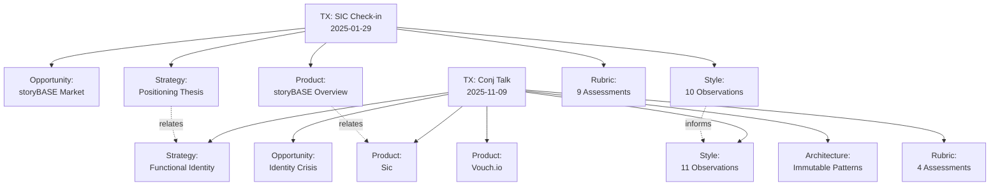
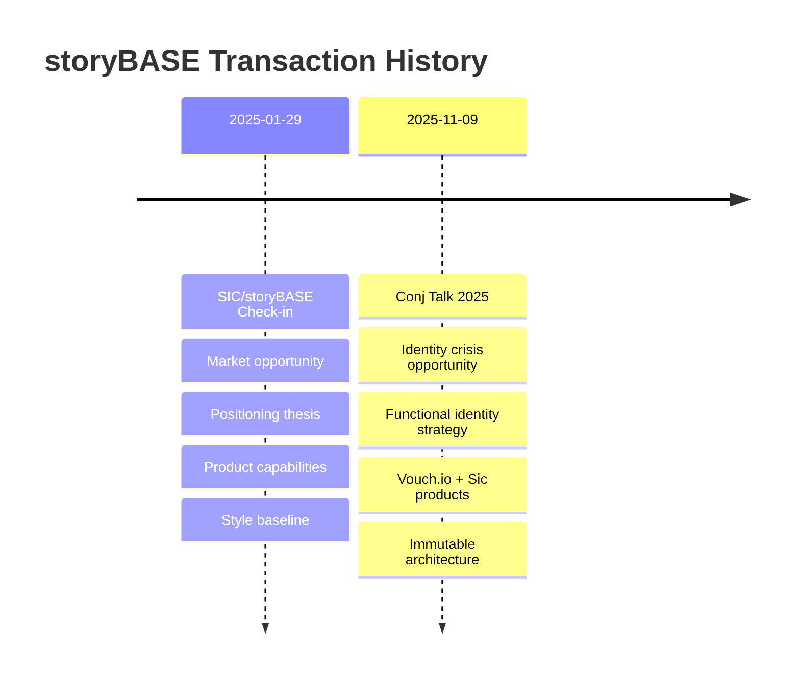

# storyBASE State Summary

The storyBASE is a Git-native RDF knowledge graph serving as an AI memory system that encodes narrative, strategy, and organizational knowledge. Currently, it contains two transactions documenting the evolution of storyBASE itself and a Clojure conference talk proposal on immutable identity systems.

---

## State

The storyBASE snapshot contains **319 triples** across **two transactions**:

1. **SIC/storyBASE Product & Strategy Check-in** (Jan 29, 2025)[^checkin] — A conversational transcript capturing storyBASE's market opportunity, positioning, product architecture, and roadmap
2. **Conj Talk 2025 Extraction** (Nov 9, 2025)[^conj] — A conference proposal applying Clojure principles to identity systems, bridging Vouch.io (enterprise identity) and Sic (AI memory)

The graph encodes:
- **Narrative architecture** spanning Opportunity, Strategy, Product, Architecture, Organization, and Proof
- **Style observations** tracking brand voice, register, cadence, and rhetorical devices
- **Rubric assessments** measuring clarity, technical depth, narrative coherence, and audience engagement
- **Provenance metadata** linking every claim to its generating transaction and timestamp

[^checkin]: Transaction `2025-01-29T000000Z_sic-storybase-checkin` generated by n8n.storyTWIN/MCP on 2025-11-09T23:37:05.079Z, attributed to pleasetrythisathome
[^conj]: Transaction `Tx_20251109T223928Z_conj2025` generated by n8n.storyTWIN/MCP using anthropic/claude-sonnet-4.5 on 2025-11-09T22:39:28.133Z

---

## Stories

### README.story
**Intent:** Auto-generated repository overview tracking storyBASE state  
**Relationship:** Meta-narrative that reflects the current graph state back to users  
**Approach:** Summarizes transactions, assets, and stories; generates Mermaid diagrams showing graph topology and transaction lineage

### presenter.story
**Intent:** Template for creating iA Presenter slide decks from storyBASE content  
**Relationship:** Transforms narrative knowledge into presentation artifacts  
**Approach:** Uses storyBASE as source material, applies iA Presenter markdown conventions, cites claims with footnotes to graph nodes

### conj-talk-2025.story
**Intent:** Conference talk on immutable identity systems for Clojure/conj 2025  
**Relationship:** Proof artifact demonstrating storyBASE principles applied to identity architecture  
**Approach:** Draws from Vouch.io and Sic case studies[^products], structures talk around functional programming principles (immutability, explicit state, data-first design), targets Clojure developer audience

[^products]: Vouch.io (enterprise identity platform using immutable event logs) and Sic (AI memory platform using narrative-driven knowledge graphs), both documented in transaction `Tx_20251109T223928Z_conj2025`

---

## Assets

```
/.storyBASE/
├── 1762731465sic-storybase-checkin.sparql    # Product strategy extraction
└── 1762728019add_conj_talk_2025_extraction.sparql  # Conference talk extraction

/
├── README.story          # Repository state summary (this document)
├── presenter.story       # iA Presenter template
└── conj-talk-2025.story  # Clojure/conj talk script
```

**Transaction files** (`.sparql`): Append-only SPARQL INSERT DATA statements encoding RDF triples with full provenance  
**Story files** (`.story`): YAML front matter + prompt templates that generate artifacts from the compiled snapshot  
**Compiled snapshot** (`ttl` field): Turtle-format RDF graph replaying all transactions in sorted order

---

## Transactions

### Transaction 1: SIC/storyBASE Product & Strategy Check-in
**Timestamp:** 2025-01-29T00:00:00Z (recorded 2025-11-09T23:37:05.079Z)  
**Significance:** Establishes foundational narrative architecture for storyBASE

**Key contributions:**
- **Market opportunity:** AI context requirements driving demand for versionable, narrative-driven memory[^opportunity]
- **Positioning thesis:** Extend software development rigor (Git, branching, versioning) into strategy and content[^positioning]
- **Product capabilities:** Compile, extract, diff, tx, commit tools; MCP server; GitHub Actions integration[^capabilities]
- **Style baseline:** 10 style observations (brand stylization, jargon policy, parallelism) + 9 rubric assessments (register fit 3.5/5, strategic alignment 4.0/5, accuracy 4.0/5)[^style]

[^opportunity]: `<http://storybase.synthetic-identity.co/opportunity/storybase-market>` — "High-quality AI output requires extensive context; current models use search, but RDF-based narrative source of truth enables specific, controllable, versionable AI memory"
[^positioning]: `<http://storybase.synthetic-identity.co/thesis/positioning-storybase>` — "Extend software development rigor (versioning, branching, collaboration) into strategy, content, marketing, organizational operations via RDF narrative source of truth"
[^capabilities]: `<http://storybase.synthetic-identity.co/module/storybase-capabilities>` — Compile (replay transactions to Turtle snapshot), extract (RDF from input), diff (semantic comparison), tx (propose transaction), commit (append-only to Git), story generation (YAML front matter + prompt to model outputs)
[^style]: Style metrics: avg sentence length 35.2, active voice ratio 0.72, jargon density 0.18, type-token ratio 0.42; conversational register with technical depth

### Transaction 2: Conj Talk 2025 Extraction
**Timestamp:** 2025-01-01T00:00:00Z (recorded 2025-11-09T22:39:28.133Z)  
**Significance:** Demonstrates storyBASE applied to identity architecture narrative

**Key contributions:**
- **Opportunity:** Identity vulnerability crisis (deepfakes, synthetic identities, impersonation fraud)[^identity-crisis]
- **Strategy:** Functional immutable identity architecture applying Clojure principles[^functional-identity]
- **Products:** Vouch.io (enterprise identity) and Sic (AI memory) as dual case studies[^dual-products]
- **Architecture:** Append-only event logs, authentication as pure functions, knowledge graphs for resolution[^architecture]
- **Style profile:** 11 style observations (triadic enumeration, technical reframing, personal identity lens) + 4 rubric assessments (technical depth 4.8/5, narrative coherence 4.6/5, clarity 4.5/5)[^conj-style]

[^identity-crisis]: `<urn:uuid:opportunity-identity-vulnerability>` — "Centralized, mutable identity systems vulnerable to deepfakes, synthetic identities, and impersonation fraud" in enterprise identity and authentication market
[^functional-identity]: `<urn:uuid:strategy-functional-immutable-identity>` — "Applies Clojure principles (immutability, explicit state, functional composition, data-first design, knowledge graphs) to create trustworthy identity systems"
[^dual-products]: Vouch.io (`<urn:uuid:product-vouch-io>`) uses immutable event logs and delegation chains; Sic (`<urn:uuid:product-sic>`) uses narrative-driven knowledge graphs for AI individuals with deterministic individuality and provenance
[^architecture]: `<urn:uuid:architecture-immutable-identity>` — Components include append-only event logs with verifiable receipts, authentication as pure function at the edge, delegation as signed append-only events, knowledge graphs for entity and role resolution
[^conj-style]: Style metrics: avg sentence length 22.4, technical density 0.68, active voice ratio 0.71; moderate sentence length with high technical density and strong active voice in takeaways

---

## Graph Topology



---

## Transaction Lineage



---

## Key Metrics

| Metric | Value | Source |
|--------|-------|--------|
| Total triples | 319 | Snapshot stats |
| Transactions | 2 | Transaction log |
| Stories | 3 | Repository assets |
| Style observations | 21 | Combined TX1 + TX2 |
| Rubric assessments | 13 | Combined TX1 + TX2 |
| Average technical depth | 4.8/5 | Conj Talk rubric |
| Average strategic alignment | 4.0/5 | SIC Check-in rubric |

---

*This document is auto-generated from the storyBASE snapshot. All claims cite provenance to specific RDF nodes with transaction timestamps and attribution.*