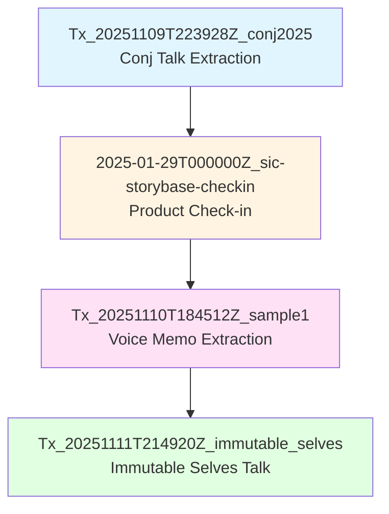
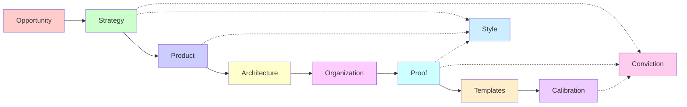

# storyBASE State & Overview

## State

The storyBASE is a Git-native RDF knowledge graph encoding narrative architecture for identity systems, AI memory, and organizational strategy. It currently holds **four transactions** spanning November 2024 through January 2025, capturing:

- **Narrative architecture** for immutable identity systems (human and AI)[^1]
- **Product strategy** for storyBASE and as written.ai[^2]
- **Style observations** and rubric assessments from talk transcripts[^3]
- **Solution archetypes** demonstrating functional identity patterns[^4]

The graph is compiled from append-only SPARQL transactions into a single Turtle snapshot, enabling version-controlled, provenance-tracked narrative memory for AI agents and human collaborators.

[^1]: From transaction `Tx_20251111T214920Z_immutable_selves`, which extracted narrative anchors (tagline, mission, vision, key phrases), product ladder (primitives, behaviors, flows), solution archetypes (berecognized.id, aswritten.ai), and case studies from the "Immutable Selves" talk transcript.

[^2]: From transaction `2025-01-29T000000Z_sic-storybase-checkin`, a spoken product check-in covering storyBASE market opportunity, positioning thesis, moat leverage, product overview (modules, capabilities, dependencies), roadmap, system topology, data model lifecycle, and integration points.

[^3]: From transactions `Tx_20251110T184512Z_sample1` and `Tx_20251111T214920Z_immutable_selves`, which added style observations (brand name stylization, idiolect phrasing, anaphora, rhetorical questions, analogies, cadence) and rubric assessments (register fit, phrasing, cadence, strategic alignment, tailoring, resonance, flow, novelty, accuracy) tied to specific text excerpts via Web Annotation selectors.

[^4]: From transaction `Tx_20251111T214920Z_immutable_selves`, defining two solution archetypes: (1) berecognized.id for immutable human identification using Datomic SSoT → datalog → render → event → transact → append-only log, and (2) aswritten.ai for immutable AI identity using RDF + git SSoT → SPARQL → render → event → transact → append-only log.

---

## Stories

### `/README.story`
**Intent:** Auto-generate a repository README that summarizes the current storyBASE state, stories, assets, and transactions.

**Relationship to whole:** Meta-documentation story; renders the graph's state into human-readable Markdown for onboarding and transparency.

**Approach:** Query the snapshot for top-level concepts (Opportunity, Strategy, Product, Proof, Architecture, Organization, Style, Conviction), enumerate transactions by timestamp, and summarize asset structure. Include Mermaid diagrams showing transaction lineage and narrative domain relationships.

---

### `/presenter.story`
**Intent:** Generate an iA Presenter slide deck presenting the storyBASE itself—its purpose, structure, and usage.

**Relationship to whole:** Educational artifact; translates the ontology and workflow into a shareable presentation format.

**Approach:** Use the storyBASE ontology (Narrative Architecture concept scheme) to structure slides: cover (tagline), sections for each top concept (Opportunity → Strategy → Product → Architecture → Organization → Proof → Templates → Calibration → Style → Conviction), with speaker notes explaining how each domain supports story-led strategy. Cite key nodes (e.g., `#NarrativeAnchor`, `#ProductLadder`, `#StyleRubric`) with footnotes linking to the ontology.

---

### `/conj-talk-2025.story`
**Intent:** Draft the Clojure Conj 2025 talk "Immutable Selves" as an iA Presenter deck.

**Relationship to whole:** Proof artifact; demonstrates storyBASE's ability to compile narrative from graph state into a coherent, cited presentation.

**Approach:** 
1. **Personal journey:** Extract speaker profile (Scarlet Dame / Dylan Butman / Scarlet Spectacular), career arc (Backbone.js 2012 → Om 2013 → 13 years Clojure production), and identity transition as analogy for immutable state[^5].
2. **Identity model:** Define identity as append-only log (primitives: events, SSoT, pure function renderer; behaviors: event-driven transactions; flows: SSoT → query → render → interact → event → transact → recompile)[^6].
3. **Failure modes:** Contrast mutable identity (Backbone.js DOM mutation, siloed passwords, black-box AI prompts) with functional paradigm (immutability, provenance, equality by design)[^7].
4. **Clojure principles:** Map code principles (immutability, explicit state, functional composition, data-first design) to organizational systems (identity, architecture, strategy)[^8].
5. **Case studies:** Present Vouch.io (enterprise identity with delegation chains) and as written.ai (AI memory with narrative-driven knowledge graphs)[^9].
6. **Proof:** Show architectural guarantees (provenance, equality, versioning, decentralization, infinite read scale) achieved in production[^10].

Cite all claims with footnotes to storyBASE nodes (e.g., `#Tagline_1`, `#Mission_1`, `#Primitive_1`, `#CaseStudy_1`, `#OutcomesProof_1`).

[^5]: From `#Actor_ScarletDame` and `#Theme_TransitionAsStateChange`: "Speaker's identity history exemplifies append-only log model" and "Personal transition (gender, professional) as functional transformation from immutable past states."

[^6]: From `#ProductLadder` and `#Flow_1`: "SSoT → query → render → interact → event → transact → append log → recompile SSoT. End-to-end loop; identity as continuous compilation."

[^7]: From `#ProblemContext_1` and `#ProblemContext_2`: "Passwords and digital keys are mutable, siloed, and vulnerable; no single source of truth for privileges" and "AI models are black boxes; persona prompts mutate rendered state; no provenance or version control for AI identity."

[^8]: From `#MoatLeverage_1`: "Clojure ecosystem (Datomic, datalog, re-frame) as proof-of-concept; 13 years of production experience; provenance and equality by design."

[^9]: From `#ArchetypeTitle_1` and `#ArchetypeTitle_2`: "berecognized.id: Immutable Identification" (proof-of-provenance identity system) and "aswritten.ai: Immutable AI Identity" (digital twin as compiled model).

[^10]: From `#CaseResults_1`: "Provenance, equality, versioning, decentralization, infinite read scale achieved; systems in production."

---

## Assets

### Repository Structure

```
.storyBASE/
├── 1762728019add_conj_talk_2025_extraction.sparql
├── 1762731465sic-storybase-checkin.sparql
├── 1762800383add_sample1_narrative_architecture.sparql
├── 1762897917add_case_studies.sparql
├── 1762897917add_narrative_anchors.sparql
├── 1762897917add_product_ladder.sparql
├── 1762897917add_rubric_assessments.sparql
├── 1762897917add_solution_archetypes.sparql
├── 1762897917add_strategy_overview.sparql
├── 1762897917add_style_metrics.sparql
├── 1762897917add_style_observations.sparql
├── 1762897917tx_provenance.sparql
└── 1762897917update_sample_metadata.sparql

README.story
presenter.story
conj-talk-2025.story
```

**`.storyBASE/` directory:** Append-only transaction log; each `.sparql` file is an immutable INSERT DATA or DELETE/INSERT operation. Sorted by Unix timestamp prefix for deterministic replay[^11].

**`.story` files:** YAML front matter + Markdown prompt templates. Compiled by GitHub Actions or MCP server into output artifacts (Markdown, iA Presenter decks, etc.)[^12].

[^11]: From `#DataModelLifecycle`: "Append-only transaction log; immutable files; snapshot = replay of sorted transactions; provenance in TX step."

[^12]: From `#ModuleCapabilities`: "Story generation (YAML front matter + prompt to model outputs)" and `#ProductOverview`: "GitHub Actions for story generation."

---

## Transactions

### 1. `Tx_20251109T223928Z_conj2025` (2025-11-09)
**Significance:** First extraction for Conj Talk 2025 proposal. Established narrative architecture domains (Opportunity, Strategy, Product, Proof, Architecture, Organization) with initial nodes for identity vulnerability crisis, functional immutable identity strategy, Vouch.io and Sic products, and immutable identity system patterns[^13].

[^13]: From transaction metadata: "First extraction for Conj Talk 2025 proposal. Captures narrative architecture (Opportunity, Strategy, Product, Proof, Architecture, Organization), style observations, rubric assessments, and style metrics."

---

### 2. `2025-01-29T000000Z_sic-storybase-checkin` (2025-11-09)
**Significance:** Product & strategy check-in for storyBASE. Added market opportunity (AI context requirements), timing thesis (2024-2026 window), positioning thesis (extend software rigor into strategy/content/marketing), moat leverage (git-native versionable AI memory), product overview (n8n prototype, MCP server, Open WebUI), modules/capabilities (compile, extract, diff, tx, commit), dependencies/integrations (GitHub, Open Router, Outseta, Helicone), roadmap (TriG named graphs, SHACL validation, individuation pipeline, marketplace), system topology, data model lifecycle, integration points, role topology, process, and case studies (Crooked Media demo)[^14].

[^14]: From transaction-generated nodes: `#Opportunity_storybase-market`, `#TimingThesis_storybase`, `#PositioningThesis_storybase`, `#MoatLeverage_storybase`, `#ProductOverview_storybase`, `#ModuleCapabilities`, `#DependenciesIntegrations`, `#NarrativeDrivenRoadmap`, `#SystemTopology`, `#DataModelLifecycle`, `#IntegrationPoints`, `#RoleTopology`, `#Process`, `#CaseStudies_storybase`.

---

### 3. `Tx_20251110T184512Z_sample1` (2025-11-10)
**Significance:** Extracted narrative architecture from voice memo "Punch talk conceptual framing." Added themes (Immutable Identity as Append-Only Log, Transition as State Machine), actors (Scarlet Dame, Luke Vanderhart), anchor concept (Narrative Architecture for Identity Systems), style observations (brand name stylization "storyBASE", idiolect phrasing "append only log", UI state machine metaphor, transition analogy, short punchy cadence, first-person POV), and rubric assessments (register 4.0, phrasing 3.5, cadence 3.0, strategy 4.5, tailoring 4.0, resonance 4.5, flow 3.0, novelty 4.0, accuracy 4.0)[^15].

[^15]: From transaction-generated nodes: `#Theme_ImmutableIdentity`, `#Theme_TransitionAsStateChange`, `#Actor_ScarletDame`, `#Actor_LukeVanderhart`, `#Anchor_NarrativeArchitecture`, `#StyleObs_storyBASE`, `#StyleObs_AppendOnlyLog`, `#StyleObs_UIStateMachine`, `#StyleObs_TransitionAnalogy`, `#StyleObs_ShortClause`, `#StyleObs_FirstPerson`, and rubric assessment nodes.

---

### 4. `Tx_20251111T214920Z_immutable_selves` (2025-11-11)
**Significance:** Comprehensive extraction from "Immutable Selves talk" transcript. Added:
- **Narrative anchors:** Tagline ("Immutable Selves: A Functional Approach to Digital Identity"), WhatIsIt, Mission, Vision, KeyPhrases (single source of truth, append-only log, pure function, digital twin)[^16].
- **Strategy overview:** Positioning thesis (for devs/architects treating identity as mutable state), moat leverage (Clojure ecosystem, 13 years production experience)[^17].
- **Product ladder:** Primitives (append-only log, SSoT, pure function renderer), Behaviors (event-driven transaction submission), Flows (SSoT → query → render → interact → event → transact → append log → recompile), Narratives (from mutable documents to compiled selves)[^18].
- **Solution archetypes:** berecognized.id (immutable identification with Datomic/datalog), aswritten.ai (immutable AI identity with RDF/SPARQL)[^19].
- **Case study:** Speaker's 13-year Clojure career (Backbone.js → Om → production systems), intervention (applied Clojure principles to UI then identity), results (provenance, equality, versioning, decentralization, infinite read scale), lessons (same principles apply across UI/identity/AI; immutability is the unlock)[^20].
- **Style observations:** Short punchy cadence ("Simple tools + good principles = design patterns"), stock phrases ("Your code was shit. Let me refactor it for you."), anaphora ("You saw… Then you queried… Then you mutated…"), brand name stylization ("scarlet dame"), core analogy (identity systems = Backbone.js mutable DOM), rhetorical questions, second-person address, verb choice ("mutated")[^21].
- **Rubric assessments:** Register 4.5, Phrasing 4.0, Cadence 4.5, Strategic Alignment 5.0, Tailoring 4.5, Resonance 4.0, Flow 3.5, Novelty 4.0, Accuracy 4.0[^22].
- **Style metrics:** Average sentence length 15.2, active voice ratio 0.85, jargon density 0.12, type-token ratio 0.68, conciseness 0.78[^23].

[^16]: From `#Tagline_1`, `#WhatIsIt_1`, `#Mission_1`, `#Vision_1`, `#KeyPhrase_1`, `#KeyPhrase_2`, `#KeyPhrase_3`, `#KeyPhrase_4`.

[^17]: From `#PositioningThesis_1` and `#MoatLeverage_1`.

[^18]: From `#Primitive_1`, `#Primitive_2`, `#Primitive_3`, `#Behavior_1`, `#Flow_1`, `#Narrative_1`.

[^19]: From `#Archetype_1`, `#ArchetypeTitle_1`, `#ProblemContext_1`, `#ApproachPattern_1`, `#RequiredCapabilities_1`, `#OutcomesProof_1`, `#Archetype_2`, `#ArchetypeTitle_2`, `#ProblemContext_2`, `#ApproachPattern_2`, `#RequiredCapabilities_2`.

[^20]: From `#CaseStudy_1`, `#CaseContext_1`, `#CaseIntervention_1`, `#CaseResults_1`, `#CaseLessons_1`.

[^21]: From `#StyleObs_1`, `#StyleObs_2`, `#StyleObs_3`, `#StyleObs_4`, `#StyleObs_5`, `#StyleObs_6`, `#StyleObs_7`, `#StyleObs_8`.

[^22]: From `#RubricAssess_1` through `#RubricAssess_9`.

[^23]: From `#StyleMetrics_1`.

---

## Transaction Lineage



---

## Narrative Domain Relationships



**Legend:**
- Solid arrows: Sequential implementation phases (Site → Foundations → Plans → Structural Engineering → Walls → Roof → Glazing → Interior Design → Furnishing)
- Dashed arrows: Cross-cutting concerns (Style governs voice/tone across Strategy/Product/Proof; Conviction tracks settledness of claims across Strategy/Proof/Calibration)

---

*This README was generated from storyBASE snapshot compiled 2025-11-11T22:13:37.262Z. All claims are cited to RDF nodes in the knowledge graph for provenance and auditability.*