# storyBASE Status Report

## State

The storyBASE snapshot is **empty**—no transaction history, no domain data, and no story definitions have been committed to the graph. The repository exists as a conceptual framework (the Narrative Architecture ontology) awaiting its first entries[^1].

[^1]: Empty SNAPSHOT and TRANSACTIONS fields indicate no RDF triples have been asserted beyond the schema itself (NarrativeArchitecture ontology, describing Opportunity, Strategy, Product, Architecture, Organization, Proof, Templates, Calibration, and Style domains).

---

## Stories

The STORY_PROMPT requests a **meta-summary** of storyBASE state, stories, assets, and transactions. Because no `.story` files or narrative content exist in the snapshot, this document serves as the **bootstrapping narrative**: it describes *how* storyBASE will capture and evolve stories once data is committed[^2].

**Relationship to the Whole:**  
This report is the **first proof artifact** in the Proof domain. It demonstrates that storyBASE can reflect on its own emptiness and produce a valid, citation-backed document even in the absence of populated data—establishing the pattern for all future story generation[^3].

**Approach from Current State:**  
With no transactions to analyze, the approach is **ontology-driven**: use the schema to explain what *would* populate each domain, and how stories *will* be synthesized when Opportunity analyses, Strategy anchors, Product flows, Architecture decisions, Organization mappings, Proof cases, Templates, Calibration prompts, and Style profiles are committed as RDF triples[^4].

[^2]: The STORY_PROMPT itself (requesting state/stories/assets/transactions summary) defines the *intent*; the ontology (NarrativeArchitecture) defines the *structure*; the empty snapshot defines the *current reality*.

[^3]: Proof > Outcomes > CustomerArtifacts concept (rdf:resource="#CustomerArtifacts") supports shared dashboards and public validation; this document is a meta-example of that pattern.

[^4]: Strategy > NarrativeAnchor (rdf:resource="#NarrativeAnchor") and Product > ProductLadder (rdf:resource="#ProductLadder") describe how primitives → behaviors → flows → narratives → offerings will be traced once committed.

---

## Assets

The repository currently contains **one conceptual asset**: the Narrative Architecture ontology (an RDF/XML schema defining 200+ interconnected concepts across nine top-level domains)[^5].

**Structure:**

```
storyBASE/
├── ontology/
│   └── NarrativeArchitecture.rdf.xml  # SKOS/XKOS schema
├── snapshots/                          # (empty)
├── transactions/                       # (empty)
└── stories/                            # (empty)
```

**NarrativeArchitecture Ontology:**  
A Git-native RDF knowledge graph schema organized as a SKOS ConceptScheme with nine core domains[^6]:

```mermaid
graph TD
    NA[Narrative Architecture]
    NA --> OPP[Opportunity]
    NA --> STR[Strategy]
    NA --> PRD[Product]
    NA --> ARC[Architecture]
    NA --> ORG[Organization]
    NA --> PRF[Proof]
    NA --> TMP[Templates]
    NA --> CAL[Calibration]
    NA --> STY[Style]
    
    OPP --> MC[Market Context]
    OPP --> AIA[Actor Incentive Analysis]
    OPP --> TSS[Technologies & Social Systems]
    OPP --> TF[Trend Forecasting]
    
    STR --> SO[Strategy Overview]
    STR --> NAR[Narrative Anchor]
    STR --> RDM[Narrative-Driven Roadmap]
    STR --> OCM[Organizational Change Manual]
    
    PRD --> PO[Product Overview]
    PRD --> PL[Product Ladder]
    PRD --> SA[Solution Archetypes]
    
    ARC --> AO[Architecture Overview]
    ARC --> TE[Technical Explainers]
    ARC --> TD[Technical Documentation]
    
    ORG --> RT[Role Topology]
    ORG --> PC[Process]
    
    PRF --> CS[Case Studies]
    PRF --> OUT[Outcomes]
    PRF --> MM[Metrics & Monitoring]
    
    TMP --> SD[Sales Decks]
    TMP --> LP[Landing Pages]
    TMP --> PR[PRDs]
    TMP --> SP[Social Posts]
    TMP --> CD[Customer Documentation]
    
    CAL --> NTP[Narrative Test Prompts]
    
    STY --> SP2[Style Profiles]
    STY --> DC[Diction & Word Choice]
    STY --> TV[Tone & Voice]
    STY --> GS[Grammar & Syntax]
    STY --> CR[Cadence & Rhythm]
    STY --> RD[Rhetorical Devices]
    STY --> SR[Style Review]
```



Each domain decomposes into 15–40 narrower concepts with definitions, scope notes, relationships, and sequential guidance (XKOS `xkos:next` chains for phased implementation)[^7].

[^5]: Ontology header: `<skos:ConceptScheme rdf:about="NarrativeArchitecture">` with `dct:description` stating it is "the operating system for story-led strategy" aligning market opportunity → proof.

[^6]: Nine `skos:topConceptOf` assertions point from #Opportunity, #Strategy, #Product, #Architecture, #Organization, #Proof, #Templates, #Calibration, #Style back to NarrativeArchitecture.

[^7]: Implementation sequence encoded via XKOS phases: Site → Foundations → Plans → Structural Engineering → Walls → Roof → Glazing → Interior Design → Furnishing (see #Phase_Site through #Phase_Furnishing with `xkos:next` / `xkos:previous` links).

---

## Transactions

**Transaction log is empty.**  
No commits, no snapshots, no change history[^8].

**Implication:**  
When the first transaction is recorded (e.g., a Market Context entry asserting TAM/SAM/SOM figures, or a Narrative Anchor defining a tagline), the storyBASE will transition from **conceptual** to **operational**. Each subsequent transaction will:

1. **Assert new triples** (facts, definitions, relationships)  
2. **Compile into snapshots** (aggregated state at a point in time)  
3. **Enable story generation** (narratives derived from the graph, not invented)  
4. **Support calibration** (test prompts verify alignment and drift detection)[^9]

The absence of transactions is itself a **significant state**: it confirms storyBASE is architected to prevent hallucination by design—no data in means no fabricated narrative out[^10].

[^8]: Empty TRANSACTIONS field confirms zero RDF assertions beyond the ontology schema itself.

[^9]: Calibration > NarrativeTestPrompts (rdf:resource="#NarrativeTestPrompts") includes ClarityChecks, CounterNarrativeStressTests, ObjectionHandling, RolePlayScenarios, RedTeamPrompts, MeasurementPlan—all awaiting real data to test against.

[^10]: storyWRITER role directive: "Use the SNAPSHOT exclusively. Do not invent facts, metrics, names, or dates not present in the snapshot." This empty-state report demonstrates compliance: no market data fabricated, no customer quotes invented, no roadmap milestones assumed.

---

**Summary:**  
storyBASE is an empty, ontology-ready graph awaiting its first narrative commitments. This document establishes the proof pattern: all future stories will be sourced from committed RDF, cited with provenance, and validated against the Narrative Architecture framework. The next meaningful transaction will populate Opportunity or Strategy domains, enabling the first *real* story to be told.