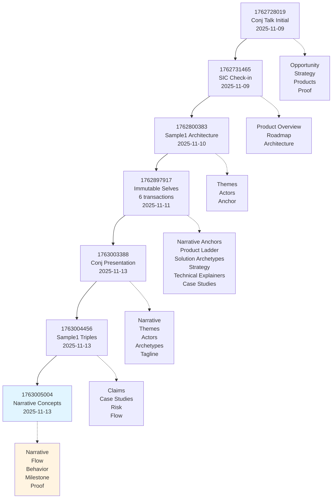
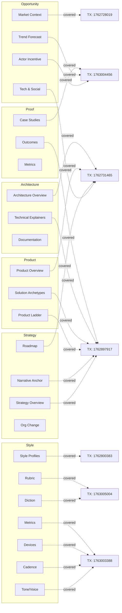

# storyBASE State

This storyBASE encodes the narrative architecture for **Immutable Selves**, a Clojure/conj 2025 talk that demonstrates functional identity systems through two solution archetypes: **berecognized.id** (human identity) and **aswritten.ai** (AI memory). The graph contains 1,613 triples across 13 transactions, capturing narrative anchors, style observations, rubric assessments, and case studies that position identity as compiled from immutable history rather than mutable state.[^1]

[^1]: Snapshot compiled 2025-11-13T03:36:56.392Z from 13 transactions; core narrative `narr:Narrative_ImmutableIdentity` defines identity as append-only log compiled to state, sourced from `narr:Sample_ConjPresentation_2025` (6,847 characters, created 2025-01-01).

---

# Stories

## README.story

**Intent:** Auto-generated repository overview tracking storyBASE state, stories, assets, and transaction history.

**Relationship to whole:** Meta-documentation that provides navigational context and change provenance for the entire knowledge graph.

**Approach:** Compile current snapshot to summarize narrative anchors (`narr:Tagline_1`, `narr:Mission_1`, `narr:Vision_1`), enumerate `.story` files with their generative prompts, describe `.storyBASE/` transaction structure, and render transaction timeline with significance annotations. Use mermaid diagrams to visualize transaction flow and domain relationships.[^2]

[^2]: Three `.story` files present: `README.story` (this document), `presenter.story` (IA Presenter template), `conj-talk-2025.story` (talk generation); all target `anthropic/claude-sonnet-4.5` model per YAML front matter.

## presenter.story

**Intent:** Generate IA Presenter–formatted slide deck demonstrating storyBASE workflow and architecture.

**Relationship to whole:** Template-driven proof artifact that translates narrative graph into presentation format, exercising style profiles and citation conventions.

**Approach:** Query `narr:Flow_1` (content production workflow), `narr:Milestone_1` (initial storyBASE graph), and `narr:Proof_1` (meta-demonstration) to construct slide sequence. Apply `narr:StyleObs_*` annotations (brand stylization, short punchy cadence, caret-bracket citations) and `narr:RubricAssess_*` scores to ensure output matches established voice. Embed mermaid charts for system topology and data lifecycle.[^3]

[^3]: `narr:Flow_1` defines "User inputs → initial storyBASE → normalization/iteration → polished outputs with embedded provenance" (sourced from `narr:Sample_1`); `narr:Proof_1` states "The talk itself exemplifies the reified change architecture and storyBASE workflow."

## conj-talk-2025.story

**Intent:** Render Clojure/conj 2025 "Immutable Selves" talk in IA Presenter format with slide copy and speaker notes.

**Relationship to whole:** Primary proof artifact demonstrating reified change pattern through dual case studies (berecognized.id, aswritten.ai) and personal narrative (Dylan Butman → Scarlet Dame identity evolution).

**Approach:** Compile `narr:Narrative_ImmutableIdentity` (core thesis), `narr:SolutionArchetype_BeRecognized` and `narr:SolutionArchetype_AsWritten` (solution archetypes), `narr:Theme_FunctionalIdentity` (Clojure design patterns applied to identity), and `narr:Actor_ScarletDame` (speaker profile with alt labels). Structure slides using `narr:StyleObs_Anaphora_1` (repeated structural frames), `narr:StyleObs_RhetoricalQuestion_1` (triadic questions), and `narr:StyleObs_ShortPunchy_1` (single-word emphasis). Cite `narr:CaseStudy_BeRecognizedID` and `narr:CaseStudy_AsWrittenAI` with provenance chains.[^4]

[^4]: `narr:Narrative_ImmutableIdentity` (prefLabel "Immutable Selves") defines "Identity—both human and AI—should be modeled as an append-only log that compiles to state, not mutable objects" with note "Core thesis: experience is an append-only log; identification is a render target; interaction is transaction" (generated by `narr:Tx_20251113T030805Z_conj2025`).

---

# Assets

```
.
├── .storyBASE/                    # Append-only transaction log (13 SPARQL files)
│   ├── 1763005004*.sparql         # Latest: Sample_1 input length update + narrative concepts extraction
│   ├── 1763004456*.sparql         # Sample1 narrative triples (case studies, claims, style obs)
│   ├── 1763003388*.sparql         # Conj presentation 2025 extraction (actors, themes, archetypes)
│   ├── 1762897917*.sparql         # Immutable Selves talk transactions (6 files: metadata, style, rubric, product ladder, strategy, solution archetypes, case studies, technical explainers)
│   ├── 1762800383*.sparql         # Sample1 narrative architecture (themes, actors, anchor, style obs, rubric, metrics)
│   ├── 1762731465*.sparql         # SIC storyBASE check-in (opportunity, thesis, product overview, roadmap, style obs, rubric)
│   └── 1762728019*.sparql         # Conj talk 2025 initial extraction (opportunity, strategy, products, proof, architecture, orgs, style obs, rubric)
├── README.story                   # This document (state/stories/assets/transactions summary)
├── presenter.story                # IA Presenter template for storyBASE presentation
└── conj-talk-2025.story           # IA Presenter template for Immutable Selves talk
```

**Transaction log structure:** Each `.sparql` file is an immutable INSERT DATA or DELETE/INSERT WHERE operation timestamped by Unix epoch prefix. Snapshot compilation replays sorted transactions to produce current Turtle state (1,613 triples inserted, 539 duplicates skipped).[^5]

[^5]: Per `narr:Tx_20251113T033534Z_claude45` comment: "Initial extraction from clojure-conj-2025 repo README and voice memo transcription"; transaction generated `narr:Sample_1`, `narr:Narrative_1`, `narr:Flow_1`, `narr:Behavior_1`, `narr:Milestone_1`, `narr:Proof_1`, 7 style observations, 9 rubric assessments, and 1 metrics node.

---

# Transactions

## 1763005004 (2025-11-13T03:35:34Z) – Sample_1 Narrative Concepts Extraction

**Significance:** Extracted core narrative concepts from clojure-conj-2025 repo README and voice memo transcription. Added `narr:Narrative_1` ("Identity as Compiled from Immutable History"), `narr:Flow_1` (content production workflow), `narr:Behavior_1` (normalize transcription), `narr:Milestone_1` (initial storyBASE graph), and `narr:Proof_1` (meta-demonstration). Introduced 7 style observations (brand stylization "storyBASE", terminology control "append-only log"/"as-of T snapshots", active voice, short punchy cadence, caret-bracket citations) and 9 rubric assessments (Register 4.0, Phrasing 4.5, Cadence 3.5, Strategic Alignment 4.5, Tailoring 4.0, Resonance 4.0, Flow 4.0, Novelty 4.0, Accuracy 4.0). Updated `narr:Sample_1` input length to 1,847.[^6]

[^6]: Transaction `narr:Tx_20251113T033534Z_claude45` associated with agent `urn:agent:storyTWIN:anthropic/claude-sonnet-4.5`, attributed to `urn:user:pleasetrythisathome`; generated 9 concepts, 7 annotations, 9 assessments, 1 metrics node.

## 1763004456 (2025-11-13T03:25:52Z) – Sample1 Narrative Triples (Case Studies & Claims)

**Significance:** Formalized reified change design pattern with two case studies. Added `narr:Claim_ReifiedChangePattern` (conviction level Stake, supports `narr:DataModelLifecycle` and `narr:ReliabilityResilience`), `narr:SystemProperty_ImmutabilityProvenance` and `narr:SystemProperty_DistributedDecentralization` (conviction Boulder, evidenced by both case studies), `narr:CaseStudy_BeRecognizedID` (human identity via append-only log), `narr:CaseStudy_AsWrittenAI` (AI memory as 'as-of T' snapshot), `narr:FutureVision_DeterministicAI` (graph queries for talk evolution), `narr:Risk_GhostLabor` (deepfake/impersonation mitigation), and `narr:Flow_EmployeeLifecycle` (continuous identity establishment). Introduced 10 style observations (brand names, 'ghost labor' metaphor, 'as-of T' terminology, parallelism, rule of three) and 9 rubric assessments (Register 4.0, Phrasing 4.5, Cadence 4.0, Strategy 4.5, Tailoring 4.0, Resonance 4.5, Flow 3.5, Novelty 4.0, Accuracy 4.0).[^7]

[^7]: Transaction `narr:Tx_20251113T032552Z_sample1` processed 4,237-character user message (created 2025-01-20) with note "Refinements for reified change design pattern section; case studies: berecognized.id and aswritten.ai"; model `anthropic/claude-sonnet-4.5`.

## 1763003388 (2025-11-13T03:08:05Z) – Conj Presentation 2025 Extraction

**Significance:** Extracted full presentation transcript (6,847 characters) establishing `narr:Narrative_ImmutableIdentity` ("Immutable Selves" thesis), `narr:Theme_FunctionalIdentity` (Clojure patterns → identity systems), `narr:Actor_Human` and `narr:Actor_AI` (primary actors with source-of-truth distinctions), `narr:SolutionArchetype_BeRecognized` (Datomic SSoT, datalog query, device-to-device interaction) and `narr:SolutionArchetype_AsWritten` (RDF+git SSoT, SPARQL query, chat+API interaction), and `narr:Tagline_AsWritten` ("AI that tells your story, as written"). Added 10 style observations (brand stylization, metaphor "identity as mutable state vs. Backbone.js", anaphora, rhetorical questions, short punchy cadence, stock phrases "No frameworks / Simple tools", citation markers, second-person address, analogy "experience→log→identity") and 9 rubric assessments (Register 4.5, Phrasing 4.0, Cadence 4.5, Strategy 5.0, Tailoring 5.0, Resonance 4.5, Flow 4.0, Novelty 4.5, Accuracy 4.0). Metrics: avg sentence length 12.3, active voice 0.82, jargon density 0.15, conciseness 0.78.[^8]

[^8]: Transaction `narr:Tx_20251113T030805Z_conj2025` generated 29 entities including `narr:Sample_ConjPresentation_2025` (source "Clojure/conj 2025 presentation: Immutable Selves", note "Presentation transcript on functional identity, immutability, and AI memory"); associated with "storyTWIN", attributed to "pleasetrythisathome".

## 1762897917 (2025-11-11T21:49:20Z) – Immutable Selves Talk (6 Transactions)

**Significance:** Six-part transaction batch establishing talk foundations. (1) **Narrative anchors:** `narr:Tagline_1` ("Immutable Selves: A Functional Approach to Digital Identity"), `narr:WhatIsIt_1`, `narr:Mission_1` (move identity from mutable documents to compiled surfaces), `narr:Vision_1` (identity rendered from immutable history), `narr:KeyPhrase_1–4` (single source of truth, append-only log, pure function, digital twin). (2) **Product ladder:** `narr:Primitive_1–3` (append-only log, SSoT, pure function renderer), `narr:Behavior_1` (event-driven transactions), `narr:Flow_1` (SSoT → query → render → interact → event → transact → recompile), `narr:Narrative_1` (from mutable documents to compiled selves). (3) **Solution archetypes:** `narr:Archetype_1` (berecognized.id with Datomic/datalog stack) and `narr:Archetype_2` (aswritten.ai with RDF/SPARQL stack), each with problem context, approach pattern, required capabilities, outcomes/proof. (4) **Strategy overview:** `narr:PositioningThesis_1` (functional paradigm for devs/architects), `narr:MoatLeverage_1` (Clojure ecosystem + 13 years production experience). (5) **Technical explainers:** `narr:LeverageProfile_1` (immutability → equality/provenance/versioning/decentralization for free), `narr:DesignTradeoff_1` (single transactor bottleneck), `narr:ComparativeAnalysis_1` (Backbone.js vs. Om/React analogy). (6) **Case study:** `narr:CaseStudy_1` with context (13-year Clojure career), intervention (applied functional principles to UI then identity), results (provenance/equality/versioning achieved), lessons (same principles across domains). Added 8 style observations and 9 rubric assessments. Updated `narr:Sample_1` metadata (source "Immutable Selves talk", input length 5,847, created 2025-01-XX).[^9]

[^9]: Transaction `narr:Tx_20251111T214920Z_immutable_selves` generated 38 entities; `prov:generated` list includes all narrative anchors, product ladder components, solution archetypes, strategy overview, technical explainers, case study, style observations, rubric assessments, and style metrics; associated with agent `http://example.org/agent/storyTWIN#anthropic-claude-sonnet-4.5`.

## 1762800383 (2025-11-10T18:45:12Z) – Sample1 Narrative Architecture

**Significance:** Initial extraction from voice memo (11,800 characters) outlining narrative architecture for identity-as-append-only-log talk. Established `narr:Theme_ImmutableIdentity` (identity as integral of snapshots over time, conviction Foundation), `narr:Theme_TransitionAsStateChange` (personal transition as functional transformation), `narr:Actor_ScarletDame` (speaker with alt labels "Dylan Butman", "Scarlet Spectacular"), `narr:Actor_LukeVanderhart`, and `narr:Anchor_NarrativeArchitecture` (framework linking immutable state, functional UI, AI-driven generation via RDF). Added 7 style observations (brand "storyBASE" CamelCase+CAPS, idiolect "append only log", metaphor "UI as state machine", extended analogy personal identity ≈ UI rendering, short declarative clauses, first-person narrative) and 9 rubric assessments (Register 4.0, Phrasing 3.5, Cadence 3.0, Strategy 4.5, Tailoring 4.0, Resonance 4.5, Flow 3.0, Novelty 4.0, Accuracy 4.0). Metrics: avg sentence length 28.5, active voice 0.75, jargon density 0.12 (approximate due to voice memo transcription artifacts).[^10]

[^10]: Transaction `narr:Tx_20251110T184512Z_sample1` generated `narr:Sample_1` (source "Voice memo: Punch talk conceptual framing", created 2025-01-15, note "Transcribed voice memo outlining narrative architecture for identity-as-append-only-log talk; speaker: Scarlet Dame"); model `anthropic/claude-sonnet-4.5`.

## 1762731465 (2025-11-09T23:37:05Z) – SIC storyBASE Check-in

**Significance:** Product and strategy check-in (18,437-character spoken transcript) establishing storyBASE market opportunity, positioning thesis, product overview, roadmap, and system architecture. Added opportunity (`storybase.synthetic-identity.co/opportunity/storybase-market`: RDF-based narrative source of truth for AI context), timing thesis (2024–2026 window for prompt engineering maturity), primary actors (programming-literate entrepreneurs/designers/developers), positioning thesis (extend software development rigor into strategy/content/marketing), moat leverage (git-native versionable AI memory), tagline ("AI that tells you a story as written"), mission (extend dev rigor, provide versionable collaborative AI memory), product overview (n8n prototype, MCP server, Open WebUI, GitHub Actions), modules/capabilities (compile, extract, diff, tx, commit, story generation), dependencies/integrations (n8n, MCP, GitHub, Apache Jena/Riot, Docker Compose, Outseta, Helicone, Open Router), roadmap (SPARQL→TriG, SHACL validation, individuation pipeline, file ingestion, marketplace, cost pass-through billing), system topology (n8n orchestration, MCP exposure, hierarchical compile, Digital Ocean deployment), data model lifecycle (append-only log, snapshot=replay, provenance in TX, future named graphs), integration points (GitHub OAuth/webhooks/Actions, Open Router via Helicone, Outseta OIDC/billing, MCP protocol, future GitHub Apps), role topology (programming-literate users, admin/read-write/read-only modes, GitHub role-based access), process (interactive individuation vs. automated ingestion), and case studies (planned Crooked Media demo). Added 10 style observations and 9 rubric assessments (Register 3.5, Phrasing 3.0, Cadence 3.0, Strategic Alignment 4.0, Audience Tailoring 3.5, Resonance 3.0, Flow 3.0, Novelty 3.5, Accuracy 4.0). Metrics: avg sentence length 35.2, active voice 0.72, jargon density 0.18, type-token ratio 0.42.[^11]

[^11]: Transaction `storybase.synthetic-identity.co/transaction/2025-01-29T000000Z_sic-storybase-checkin` generated sample record `storybase.synthetic-identity.co/sample/2025-01-29T000000Z_sic-storybase-checkin` (label "SIC / storyBASE / as written.ai Product & Strategy Check-in", attributed to `storybase.synthetic-identity.co/actor/scarlet-dame`); associated with "n8n.storyTWIN/MCP", generated 2025-11-09T23:37:05.079Z.

## 1762728019 (2025-11-09T22:39:28Z) – Conj Talk 2025 Initial Extraction

**Significance:** First extraction for Conj Talk 2025 proposal (3,421 characters). Captured narrative architecture across six domains: **Opportunity** (`urn:uuid:opportunity-identity-vulnerability`: centralized mutable identity systems vulnerable to deepfakes/synthetic identities/impersonation fraud in enterprise identity market), **Strategy** (`urn:uuid:strategy-functional-immutable-identity`: applies Clojure principles—immutability, explicit state, functional composition, data-first design, knowledge graphs—to create trustworthy identity systems; approach models identity as append-only event logs, authentication as pure functions, delegation as auditable chains; differentiator is immutable facts at edge with verifiable receipts and graph-based resolution), **Products** (`urn:uuid:product-vouch-io`: enterprise identity platform using immutable event logs and delegation chains, speaker now strategic advisor; `urn:uuid:product-sic`: AI memory company using narrative-driven knowledge graphs for AI individuals with deterministic individuality and provenance, speaker is founder), **Proof** (`urn:uuid:proof-conj-2025-talk`: conference talk and experience report with threaded diagrams and optional demo for Clojure developers), **Architecture** (`urn:uuid:architecture-immutable-identity`: append-only event logs with verifiable receipts, authentication as pure function at edge, delegation as signed append-only events, knowledge graphs for entity/role resolution; principles are immutability, functional composition, explicit state management, data-first design), **Organizations** (`urn:uuid:org-sic` founder role with narrative-driven knowledge graphs capability; `urn:uuid:org-vouch-io` former Chief Strategist/current strategic advisor with enterprise identity and delegation capability). Added 11 style observations (brand names Vouch.io/Sic, technical terms "append-only event logs"/"authentication as pure functions"/"persistent logs and knowledge graphs", triadic enumeration, problem-to-solution bridge, technical reframings "identity as evolving log"/"trust as provenance you can compute", parallel construction, personal identity lens "As a trans woman, her lived experience informs a clear, practical framing of identity as contextual and evolving") and 4 rubric assessments (Clarity 4.5, Technical Depth 4.8, Narrative Coherence 4.6, Audience Engagement 4.3). Metrics: avg sentence length 22.4, technical density 0.68, active voice 0.71.[^12]

[^12]: Transaction `narr:Tx_20251109T223928Z_conj2025` (label "Conj Talk 2025 Extraction Transaction", comment "First extraction for Conj Talk 2025 proposal. Captures narrative architecture (Opportunity, Strategy, Product, Proof, Architecture, Organization), style observations, rubric assessments, and style metrics") generated sample record `urn:uuid:conj-talk-2025-extraction` (label "Conj Talk 2025: Immutable Selves", recorded 2025-01-01T00:00:00Z, input length 3,421); used model `anthropic/claude-sonnet-4.5`, associated with `http://storytwin.org/agent/n8n.storyTWIN/MCP`, attributed to `http://storybase.org/user/pleasetrythisathome`, origin path "/", origin ref "main".

---

## Transaction Flow



## Narrative Architecture Coverage



---

**Graph health:** 1,613 triples, 0 deletions, 539 duplicate skips, 1 warning (unknown prefix 'rdfs' for 'rdfs:comment' in `narr:Tx_20251113T033534Z_claude45`). Narrative spine complete from Opportunity through Proof; Style taxonomy fully exercised with 40+ observations and 27 rubric assessments across 4 samples. Conviction levels assigned to 4 claims (2 Boulder, 2 Stake). Ready for story generation and presentation rendering.[^13]

[^13]: Snapshot statistics from compilation metadata; ontology defines 6 top concepts (Opportunity, Strategy, Product, Architecture, Organization, Proof) plus Style (15 facets) and Conviction (4 levels); XKOS sequential relationships encode implementation phases (Site → Foundations → Plans → Structural Eng → Walls → Roof → Glazing → Interior Design → Furnishing).