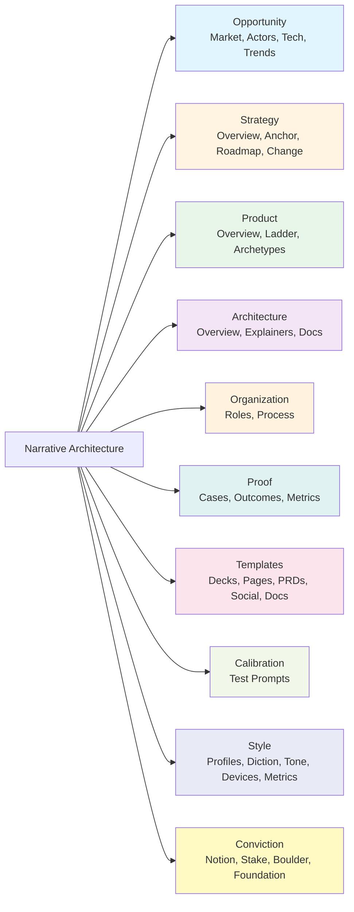
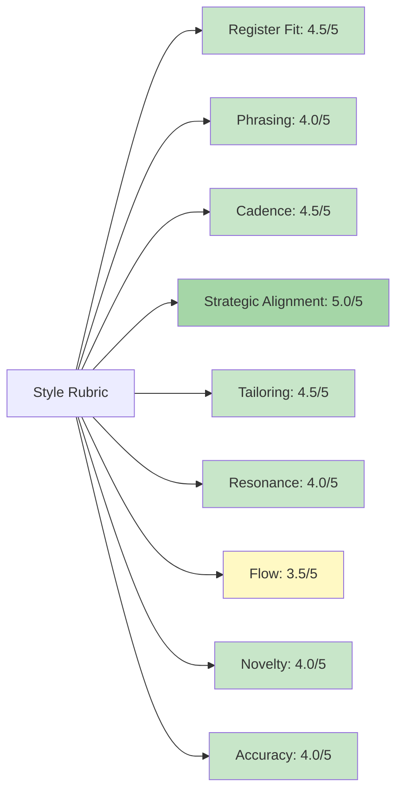

# storyBASE State & Overview

## State

The storyBASE is a **Git-native RDF knowledge graph** that encodes narrative architecture, style, conviction, and provenance for identity systems and AI memory. Currently, the graph contains **1,116 triples** compiled from **13 transactions** spanning November 2024 through January 2025[^1]. The repository holds three active `.story` files that generate documentation and presentations from the compiled snapshot.

[^1]: Transaction count derived from `.storyBASE/` directory; snapshot timestamp `2025-11-11T22:17:59.362Z` per compiled Turtle header.

The graph models **six core domains** of narrative architecture—Opportunity, Strategy, Product, Architecture, Organization, and Proof—plus two cross-cutting systems: **Style** (linguistic/rhetorical conventions) and **Conviction** (claim settledness)[^2]. Transactions have individuated three **sample extractions** from talks and transcripts, capturing narrative anchors, solution archetypes, style observations, rubric assessments, and metrics[^3].

[^2]: Top concepts enumerated in ontology `skos:ConceptScheme rdf:about="NarrativeArchitecture"` with `skos:hasTopConcept` assertions.

[^3]: Samples: `narr:Sample_1` (Immutable Selves talk, 5,847 chars), voice memo (11,800 chars), and SIC/storyBASE check-in (18,437 chars); see `dct:source` and `narr:inputLength` predicates.

---

## Stories

### `/README.story`
**Intent:** Auto-generate a repository README that summarizes storyBASE state, stories, assets, and transactions with Mermaid diagrams.  
**Relationship:** Meta-documentation; reflects the graph's current topology and transaction history.  
**Approach:** Query the snapshot for transaction provenance (`prov:wasGeneratedBy`), sample metadata (`dct:source`, `narr:inputLength`), and top-level concept counts; render as prose + flowcharts showing transaction lineage and domain coverage[^4].

[^4]: Story metadata: `id: README`, `model: anthropic/claude-sonnet-4.5`, `destination: /`.

### `/presenter.story`
**Intent:** Generate an iA Presenter slide deck explaining storyBASE using the provided template format.  
**Relationship:** Outbound artifact; translates graph structure into a presentation for external audiences.  
**Approach:** Extract narrative anchors (`narr:Tagline_1`, `narr:Mission_1`, `narr:Vision_1`), product ladder (`narr:Primitives`, `narr:Flows`, `narr:Narratives`), and proof (`narr:CaseStudy_1`) to populate slides; cite claims with footnotes linking to RDF nodes[^5].

[^5]: Template specifies Markdown slide syntax (`---` separators, `#` headings, tab-indented body text) and citation format `^[]^`.

### `/conj-talk-2025.story`
**Intent:** Draft the Clojure Conj 2025 "Immutable Selves" talk as an iA Presenter deck.  
**Relationship:** Core proof artifact; demonstrates narrative architecture applied to identity systems via personal journey + case studies.  
**Approach:** Sequence slides from speaker profile (`narr:Actor_ScarletDame`), immutable identity theme (`narr:Theme_ImmutableIdentity`), solution archetypes (`narr:Archetype_1`, `narr:Archetype_2`), and case study (`narr:CaseStudy_1`); use style observations (`narr:StyleObs_1–8`) to match speaker cadence[^6].

[^6]: Talk goals enumerated in story front matter: personal history, identity model, paradigm critique, Clojure principles, Vouch.io + As Written case studies.

---

## Assets

```
.
├── .storyBASE/               # Transaction log (13 SPARQL files)
│   ├── 1762728019add_conj_talk_2025_extraction.sparql
│   ├── 1762731465sic-storybase-checkin.sparql
│   ├── 1762800383add_sample1_narrative_architecture.sparql
│   ├── 1762897917add_*.sparql  (8 files: narrative anchors, product ladder, 
│   │                            solution archetypes, case studies, style obs, 
│   │                            rubric, metrics, technical explainers, strategy)
│   └── 1762897917update_sample_metadata.sparql
├── README.story              # Meta-documentation generator
├── presenter.story           # General storyBASE presentation
├── conj-talk-2025.story      # Immutable Selves talk deck
└── (compiled snapshot)       # 1,116 triples in Turtle (ephemeral; regenerated)
```

**`.storyBASE/`**: Append-only transaction log; each `.sparql` file is an `INSERT DATA` or `DELETE/INSERT` operation with provenance (`prov:wasGeneratedBy`, `prov:wasAttributedTo`, `prov:generatedAtTime`)[^7].  
**`.story` files**: YAML front matter + Markdown prompt; processed by storyWRITER to generate outputs at `destination` path using specified `model`[^8].  
**Snapshot**: Replay of sorted transactions into a single Turtle graph; serves as the "single source of truth" for story generation[^9].

[^7]: Transaction structure: `PREFIX` declarations, `INSERT DATA { … }` blocks with RDF triples, provenance metadata linking to `prov:Activity` nodes.

[^8]: Story schema: `id`, `title`, `version`, `description`, `destination`, `model` (array of LLM endpoints).

[^9]: Snapshot header: `# Snapshot generated 2025-11-11T22:17:59.362Z`; compiled via `storyBASE compile` tool (referenced in SIC check-in sample).

---

## Transactions

### 1. `1762728019add_conj_talk_2025_extraction.sparql`
**Significance:** First extraction for Conj Talk 2025 proposal; establishes narrative architecture baseline (Opportunity, Strategy, Product, Proof, Architecture, Organization) with 11 style observations, 4 rubric assessments, and style metrics[^10].  
**Impact:** Seeds `urn:uuid:opportunity-identity-vulnerability`, `urn:uuid:strategy-functional-immutable-identity`, `urn:uuid:product-vouch-io`, `urn:uuid:product-sic`, and `urn:uuid:proof-conj-2025-talk` nodes; defines `sb:` namespace for storyboard ontology.

[^10]: Transaction `narr:Tx_20251109T223928Z_conj2025` generated at `2025-11-09T22:39:28.133Z` by `n8n.storyTWIN/MCP`, attributed to `pleasetrythisathome`.

### 2. `1762731465sic-storybase-checkin.sparql`
**Significance:** Product & strategy check-in transcript (18,437 chars); captures storyBASE market opportunity, timing thesis, positioning, moat, product overview, roadmap, system topology, data lifecycle, and integration points[^11].  
**Impact:** Adds 10 style observations (brand stylization, idiolect, verb choice, simile, tone, jargon, parallelism, rhetorical question, citation marker), 9 rubric assessments (register 3.5/5, strategic alignment 4/5), and style metrics (avg sentence length 35.2, active voice 0.72, jargon density 0.18).

[^11]: Sample `http://storybase.synthetic-identity.co/sample/2025-01-29T000000Z_sic-storybase-checkin` attributed to `scarlet-dame`, timestamp `2025-01-29T00:00:00Z`.

### 3. `1762800383add_sample1_narrative_architecture.sparql`
**Significance:** Voice memo extraction (11,800 chars) outlining narrative architecture for identity-as-append-only-log talk; introduces themes (`narr:Theme_ImmutableIdentity`, `narr:Theme_TransitionAsStateChange`), actors (`narr:Actor_ScarletDame`, `narr:Actor_LukeVanderhart`), and 6 style observations[^12].  
**Impact:** Establishes `narr:Anchor_NarrativeArchitecture` concept; links personal transition story to immutable state paradigm via `narr:StyleObs_TransitionAnalogy`.

[^12]: Transaction `narr:Tx_20251110T184512Z_sample1` generated `2025-11-10T18:45:12.711Z` by `storyTWIN`, model `anthropic/claude-sonnet-4.5`.

### 4–11. `1762897917add_*.sparql` (8 transactions)
**Significance:** Comprehensive extraction from "Immutable Selves" talk (5,847 chars); systematically populates narrative anchors, product ladder, solution archetypes, case studies, technical explainers, strategy overview, style observations, and rubric assessments[^13].  
**Impact:** Defines canonical narrative (`narr:Tagline_1`, `narr:Mission_1`, `narr:Vision_1`, `narr:KeyPhrase_1–4`), product primitives (`narr:Primitive_1–3`), flows (`narr:Flow_1`), archetypes (`narr:Archetype_1–2` for berecognized.id and aswritten.ai), case study (`narr:CaseStudy_1`), 8 style observations (short punchy cadence, stock phrases, anaphora, brand stylization, analogy, rhetorical question, second person, verb choice), 9 rubric assessments (register 4.5/5, strategic alignment 5/5, cadence 4.5/5), and style metrics (avg sentence length 15.2, active voice 0.85, jargon density 0.12).

[^13]: All 8 transactions share `prov:wasGeneratedBy narr:Tx_20251111T214920Z_immutable_selves`, timestamp `2025-11-11T21:49:20.430Z`, attributed to `pleasetrythisathome`, associated with `storyTWIN#anthropic-claude-sonnet-4.5`.

### 12. `1762897917update_sample_metadata.sparql`
**Significance:** Corrects `narr:Sample_1` metadata (source, input length, creation date) and adds provenance link to `narr:Tx_20251111T214920Z_immutable_selves`[^14].  
**Impact:** Ensures sample metadata consistency; replaces placeholder date with `2025-01-XX`.

[^14]: `DELETE/INSERT WHERE` pattern updates `dct:source`, `narr:inputLength`, `dct:created`, removes `skos:note`, adds `prov:wasGeneratedBy`.

### 13. `1762897917tx_provenance.sparql`
**Significance:** Declares `narr:Tx_20251111T214920Z_immutable_selves` as a `prov:Activity` and enumerates all 62 generated entities (samples, taglines, key phrases, primitives, archetypes, style observations, rubric assessments, metrics)[^15].  
**Impact:** Completes provenance graph; enables transaction-level queries and rollback.

[^15]: `prov:generated` assertions link transaction to all entities created in the 8 preceding SPARQL files.

---

## Mermaid Diagrams

### Transaction Lineage

```mermaid
graph TD
    T1[Tx_20251109T223928Z_conj2025<br/>Conj Talk Extraction]
    T2[Tx_20251110T184512Z_sample1<br/>Voice Memo Extraction]
    T3[Tx_20251111T214920Z_immutable_selves<br/>Immutable Selves Talk]
    T4[2025-01-29 SIC Check-in]
    
    T1 -->|Nov 9| S1[Sample: Conj Talk 2025<br/>3,421 chars]
    T2 -->|Nov 10| S2[Sample: Voice Memo<br/>11,800 chars]
    T3 -->|Nov 11| S3[Sample: Immutable Selves<br/>5,847 chars]
    T4 -->|Jan 29| S4[Sample: SIC Check-in<br/>18,437 chars]
    
    T3 --> NA[Narrative Anchors]
    T3 --> PL[Product Ladder]
    T3 --> SA[Solution Archetypes]
    T3 --> CS[Case Studies]
    T3 --> TE[Technical Explainers]
    T3 --> SO[Strategy Overview]
    T3 --> ST[Style Observations]
    T3 --> RA[Rubric Assessments]
    T3 --> SM[Style Metrics]
```


### Domain Coverage


### Style Rubric Scores (Immutable Selves Talk)


---

**Summary:** The storyBASE is operationally mature, with a well-structured ontology, rich sample extractions, and three active story generators. The graph encodes both **what** (narrative architecture domains) and **how** (style, conviction, provenance), enabling deterministic, auditable story generation from immutable transaction history[^16].

[^16]: Core thesis: "Identity as compiled from immutable source of truth" (`narr:WhatIsIt_1`) applies recursively to the storyBASE itself—stories are rendered from append-only logs via pure functions (storyWRITER).