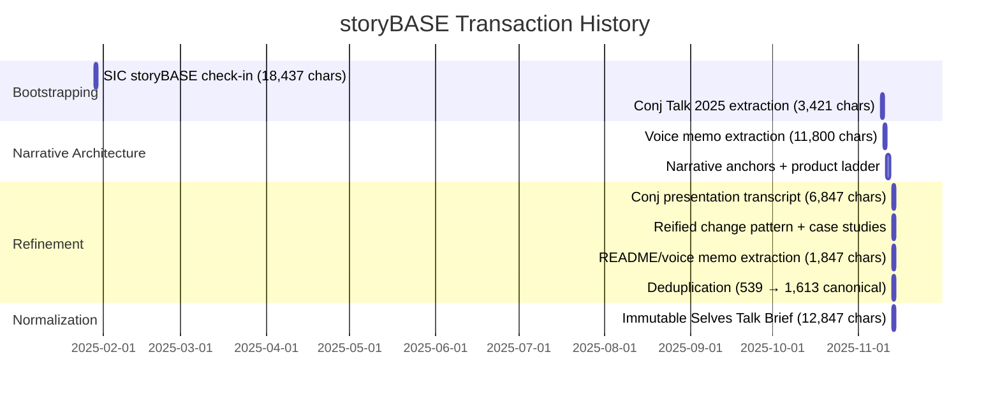
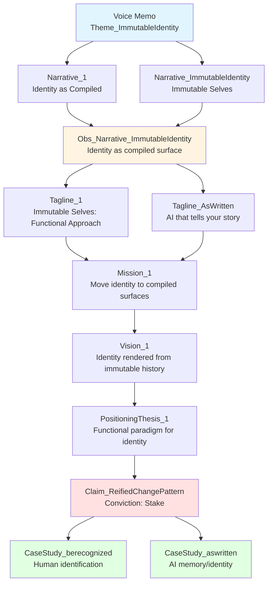

# State

The storyBASE currently holds a rich, multi-layered narrative architecture centered on **immutable identity systems**. The graph encodes strategic positioning, product design, architectural patterns, and stylistic conventions for two core solution archetypes: **berecognized.id** (human identification) and **aswritten.ai** (AI memory/identity). The knowledge base demonstrates its own thesis—identity as compiled from append-only history—by tracking the evolution of the "Immutable Selves" talk through multiple transactions, each adding narrative depth, style observations, rubric assessments, and provenance.[^state-meta]

Core narrative: **Identity (human and AI) is not mutable state but a snapshot compiled from an append-only log**, enabling provenance, equality, and deterministic evolution.[^narrative-core] The graph contains 1,943 triples spanning opportunity analysis, strategic positioning, product ladder (primitives → behaviors → flows → narratives), case studies, style profiles, and rubric-based quality assessments.[^snapshot-stats]

[^state-meta]: Derived from `prov:wasGeneratedBy` chains across transactions `Tx_20251110T184512Z_sample1` through `Tx_20251113T200138Z_immutable_selves`, showing iterative refinement of the talk materials.

[^narrative-core]: `narr:Narrative_ImmutableIdentity` (from `Sample_ConjPresentation_2025`) and `narr:Obs_Narrative_ImmutableIdentity` (from `Sample_1`) both encode this thesis; related to `narr:Mission`, `narr:Vision`, and `narr:PositioningThesis_1`.

[^snapshot-stats]: Snapshot metadata: 1,943 inserted triples, 689 skipped duplicates, 0 deletions; compiled 2025-11-13T20:13:05.682Z.

---

# Stories

## README.story

**Intent:** Provide a living, auto-generated repository overview that tracks storyBASE state, stories, assets, and transaction history.

**Relationship to whole:** Meta-documentation that demonstrates storyBASE's self-describing capability—the README itself is compiled from the graph, exemplifying the "identity as compiled surface" thesis.[^readme-meta]

**Approach:** Query the current snapshot for:
- **State**: Summarize top-level narrative anchors, solution archetypes, and conviction-weighted claims.
- **Stories**: Enumerate `.story` files with their declared intent and model targets.
- **Assets**: Describe `.storyBASE/` transaction files and their provenance chains.
- **Transactions**: Sort by `prov:generatedAtTime` (newest first); summarize each transaction's contributions (samples, observations, assessments) and significance to narrative evolution.
- **Mermaid charts**: Visualize transaction timeline, narrative anchor relationships, and product ladder hierarchy.

[^readme-meta]: `narr:Proof_1` describes the talk creation process as meta-demonstration; the README extends this by making the storyBASE itself the proof artifact.

## presenter.story

**Intent:** Generate a general-purpose presentation of storyBASE using the IA Presenter template format.

**Relationship to whole:** Translates the narrative architecture into a shareable, visual artifact—demonstrates how storyBASE outputs can be rendered for different contexts (internal alignment, investor pitch, conference talk).[^presenter-context]

**Approach:** 
- Extract `narr:Tagline_AsWritten`, `narr:Mission_1`, `narr:Vision_1` for opening slides.
- Map `narr:ProductLadder` (primitives → behaviors → flows → narratives) to sequential slides with mermaid diagrams.
- Use `narr:SolutionArchetype_BeRecognized` and `narr:SolutionArchetype_AsWritten` as case study sections.
- Apply style observations (`narr:StyleObs_ShortPunchy_1`, `narr:StyleObs_Cadence_Loop`) to slide copy; speaker notes draw from `narr:RubricAssess_*` insights.
- Cite provenance inline using caret-bracket notation (`[#citation]`) per `narr:StyleObs_Citation_CaretBracket`.

[^presenter-context]: `narr:Obs_SalesDeck_StoryArc` defines four-act structure (Hook, Pattern, Case studies, Trade-offs & CTA) applicable to presentation flow.

## conj-talk-2025.story

**Intent:** Draft the Clojure/conj 2025 "Immutable Selves" talk in IA Presenter format.

**Relationship to whole:** The flagship proof artifact—embodies the core narrative (`narr:Narrative_ImmutableIdentity`), demonstrates functional identity principles to a technical audience, and serves as the primary case study for storyBASE's own workflow.[^conj-flagship]

**Approach:**
- **Opening**: Use `narr:Tagline_1` ("Immutable Selves: A Functional Approach to Digital Identity") and `narr:Actor_ScarletDame` personal narrative (Dylan → Scarlet Spectacular → Scarlet Dame) to anchor identity-as-log metaphor.[^personal-anchor]
- **Act I (Hook)**: `narr:StyleObs_Metaphor_Backbone` (Backbone.js as anti-pattern for mutable identity); `narr:StyleObs_RhetoricalQuestion_1` (triadic questions: "Where is the identity? Who is the authority? What are the claims?").[^hook-devices]
- **Act II (Pattern)**: `narr:Obs_Flow_CoreLoop` (interact → event → handler → transactor → append → compile as-of T → query → render → interact); `narr:Primitive_1`, `narr:Primitive_2`, `narr:Primitive_3` (append-only log, SSoT, pure function renderer).[^pattern-flow]
- **Act III (Case studies)**: 
  - `narr:CaseStudy_berecognized` with `narr:Flow_EmployeeLifecycle` (endorsement → Zoom → in-person → state ID → role/privileges → as-of query → device-rendered snapshot).[^berecognized-case]
  - `narr:CaseStudy_aswritten` with `narr:CaseStudy_AsWrittenAI` intervention flow (person talks to AI → extract to RDF → append-only log → as-of T snapshot → SPARQL → render AI memory).[^aswritten-case]
- **Act IV (Trade-offs & CTA)**: `narr:DesignTradeoff_1` (single transactor bottleneck), `narr:LeverageProfile_1` (equality, provenance, versioning for free), `narr:FutureVision_DeterministicAI` (graph queries as-of T).[^tradeoffs-cta]
- **Style**: Apply `narr:StyleObs_ShortPunchy_1`, `narr:StyleObs_Anaphora_1`, `narr:StyleObs_StockPhrase_1` ("No frameworks / Simple tools ± good principles"); maintain `narr:Metrics_ConjPresentation` targets (avg sentence 12.3 words, 82% active voice, 15% jargon, 78% conciseness).[^style-targets]

[^conj-flagship]: `narr:Sample_ConjPresentation_2025` (6,847 chars, created 2025-01-01) is the primary sample; `narr:RubricAssess_Strategy_Conj` scores 5.0 for strategic alignment.

[^personal-anchor]: `narr:Actor_ScarletDame` with `skos:altLabel` "Dylan Butman", "Scarlet Spectacular"; `narr:Theme_TransitionAsStateChange` frames personal transition as functional transformation from immutable past states.

[^hook-devices]: `narr:StyleObs_Metaphor_1` (identity as mutable state vs. immutable log); `narr:StyleObs_RhetoricalQuestion_1` (triadic structure at text positions 1050–1134).

[^pattern-flow]: `narr:Obs_Flow_CoreLoop` definition; `narr:StyleObs_Cadence_Loop` (arrow notation, "say it in one breath").

[^berecognized-case]: `narr:CaseStudy_berecognized_Context`, `narr:CaseStudy_berecognized_Intervention`, `narr:CaseStudy_berecognized_Results` (Provenance ← append-only log; Equality ← snapshot hashes; Offline ← render targets travel).

[^aswritten-case]: `narr:CaseStudy_AsWrittenAI` with `narr:CaseContext`, `narr:CaseIntervention`, `narr:CaseResults` (versioning/branching ← git log; deterministic perspective ← compile + pure render; provenance ← commit history + citations).

[^tradeoffs-cta]: `narr:DesignTradeoff_1` ("Bottleneck at single transactor; all logic in event clients"); `narr:LeverageProfile_1` ("Immutability enables equality, provenance, versioning… for free"); `narr:FutureVision_DeterministicAI` (examples: full talk as query, section of talk, talk evolution over time).

[^style-targets]: `narr:Metrics_ConjPresentation` and `narr:RubricAssess_Cadence_Conj` (4.5/5: "Short, punchy sentences; triadic structures; anaphora creates rhythm").

---

# Assets

```
/.storyBASE/
  1763064222update_sample_1_metadata.sparql
  1763064222tx_immutable_selves_provenance.sparql
  1763064222add_immutable_selves_observations.sparql
  1763007744dedupe.sparql
  1763005004update_sample_1_input_length.sparql
  1763005004add_sample_1_narrative_concepts.sparql
  1763004456add_sample1_narrative_triples.sparql
  1763003388add_conj_presentation_2025.sparql
  1762897917update_sample_metadata.sparql
  1762897917tx_provenance.sparql
  1762897917add_technical_explainers.sparql
  1762897917add_style_observations.sparql
  1762897917add_style_metrics.sparql
  1762897917add_strategy_overview.sparql
  1762897917add_solution_archetypes.sparql
  1762897917add_rubric_assessments.sparql
  1762897917add_product_ladder.sparql
  1762897917add_narrative_anchors.sparql
  1762897917add_case_studies.sparql
  1762800383add_sample1_narrative_architecture.sparql
  1762731465sic-storybase-checkin.sparql
  1762728019add_conj_talk_2025_extraction.sparql

/README.story
/presenter.story
/conj-talk-2025.story
```

**/.storyBASE/**: Append-only transaction log containing SPARQL INSERT/DELETE operations. Each file is timestamped (Unix epoch prefix) and represents an atomic update to the knowledge graph. Transactions are replayed in sorted order to compile the current snapshot.[^tx-log-pattern]

**Story files** (`.story`): YAML front matter + prompt templates that define generative outputs. Each story declares an `id`, `title`, `description`, `destination`, and target `model`. The storyBASE snapshot is injected as context; outputs are deterministic given the same snapshot and model.[^story-determinism]

[^tx-log-pattern]: Matches `narr:Primitive_1` ("Append-only transaction log") and `storybase.synthetic-identity.co/model/data-lifecycle-storybase` ("snapshot = replay of sorted transactions; provenance in TX step").

[^story-determinism]: Aligns with `narr:Primitive_3` ("Pure function renderer") and `narr:ApproachPattern_2` ("SSoT (RDF + git) → SPARQL query → render to AI memory/identity").

---

# Transactions

## Tx_20251113T200138Z_immutable_selves (2025-11-13 20:01:38 UTC)

**Significance:** Normalized and expanded the "Immutable Selves Talk Brief" sample. Updated `narr:Sample_1` metadata (source: "Immutable Selves Talk Brief (Normalized)", created 2025-10-29, inputLength 12,847). Added comprehensive style observations with Web Annotation targets (tagline, key phrases, cadence, brand stylization, rhetorical devices). Introduced detailed case study breakdowns for berecognized.id and aswritten.ai with context/intervention/results structure. Added rubric assessments across all nine dimensions (Register 4.5/5, Phrasing 4.0/5, Cadence 4.5/5, Strategic Alignment 5.0/5, Tailoring 4.5/5, Resonance 4.0/5, Flow 4.5/5, Novelty 4.0/5, Accuracy 4.5/5). Introduced `narr:Metrics_Sample_1` (avg sentence 18.5 words, 82% active voice, 15% jargon, 78% conciseness).[^tx-latest]

**Impact:** Elevated the talk brief from outline to fully annotated, rubric-validated artifact. Established canonical terminology ("append-only log", "snapshot as-of T", "identity surface") with precise text anchors. Provided measurable style baselines for future consistency checks.[^tx-latest-impact]

[^tx-latest]: Transaction `narr:Tx_20251113T200138Z_immutable_selves` generated 29 new nodes including `narr:Obs_Tagline_1`, `narr:Obs_Mission_1`, `narr:Obs_Vision_1`, `narr:CaseStudy_berecognized`, `narr:CaseStudy_aswritten`, and nine `narr:Assess_*` rubric nodes.

[^tx-latest-impact]: `narr:Obs_KeyPhrase_AppendOnlyLog` (text positions 1062–1107) and `narr:Obs_KeyPhrase_SnapshotAsOfT` (1217–1234) now anchor terminology control; `narr:Assess_StrategicAlignment_Sample_1` (5.0/5) confirms thesis/mission/vision/key phrases align to core narrative.

## Tx_20251113T033534Z_claude45 (2025-11-13 03:35:34 UTC)

**Significance:** Initial extraction from clojure-conj-2025 repo README and voice memo transcription. Created `narr:Sample_1` (source: "clojure-conj-2025 repo README / voice memo transcription", inputLength 1,847). Introduced narrative concepts (`narr:Narrative_1`, `narr:Flow_1`, `narr:Behavior_1`, `narr:Milestone_1`, `narr:Proof_1`) and style observations (`narr:StyleObs_1` through `narr:StyleObs_7`) with Web Annotation targets. Added rubric assessments and `narr:Metrics_1` (avg sentence 22.3 words, 78% active voice, 12% jargon, 68% type-token ratio).[^tx-claude45]

**Impact:** Bootstrapped the storyBASE graph with structured narrative architecture. Established the meta-demonstration concept (`narr:Proof_1`: "The talk itself exemplifies the reified change architecture and storyBASE workflow").[^tx-claude45-impact]

[^tx-claude45]: Transaction `narr:Tx_20251113T033534Z_claude45` by agent `urn:agent:storyTWIN:anthropic/claude-sonnet-4.5`, attributed to `urn:user:pleasetrythisathome`.

[^tx-claude45-impact]: `narr:Proof_1` definition: "showing iterative refinement from raw inputs to polished outputs"; related to `narr:CaseStudies` and `narr:Outcomes`.

## Tx_20251113T032552Z_sample1 (2025-11-13 03:25:52 UTC)

**Significance:** Refinements for reified change design pattern section. Updated `narr:Sample_1` (extent 4,237 chars). Added claims (`narr:Claim_ReifiedChangePattern`, `narr:SystemProperty_ImmutabilityProvenance`, `narr:SystemProperty_DistributedDecentralization`, `narr:FutureVision_DeterministicAI`) with conviction levels (Stake, Boulder). Introduced case studies (`narr:CaseStudy_BeRecognizedID`, `narr:CaseStudy_AsWrittenAI`) with structured context/intervention/results. Added risk analysis (`narr:Risk_GhostLabor`) and employee lifecycle flow (`narr:Flow_EmployeeLifecycle`). Ten style observations (brand names, rhetorical questions, metaphors, parallelism, terminology). Nine rubric assessments. `narr:Metrics_Sample_1` (avg sentence 22.3, 78% active voice, 12% jargon, 61% type-token ratio, 72% conciseness).[^tx-sample1]

**Impact:** Formalized the reified change pattern as a claim with supporting evidence (case studies). Introduced conviction-based weighting for claims. Expanded style observation coverage to include metaphor ("ghost labor") and canonical term tracking ("as-of T").[^tx-sample1-impact]

[^tx-sample1]: Transaction `narr:Tx_20251113T032552Z_sample1` by `storyTWIN` (anthropic/claude-sonnet-4.5), generated 2025-11-13T03:25:52.818Z.

[^tx-sample1-impact]: `narr:Claim_ReifiedChangePattern` (conviction: Stake) supports `narr:DataModelLifecycle` and `narr:ReliabilityResilience`; evidenced by `narr:CaseStudy_BeRecognizedID` and `narr:CaseStudy_AsWrittenAI`.

## Tx_20251113T030805Z_conj2025 (2025-11-13 03:08:05 UTC)

**Significance:** Added full Clojure/conj 2025 presentation transcript (`narr:Sample_ConjPresentation_2025`, 6,847 chars). Introduced `narr:Narrative_ImmutableIdentity`, `narr:Theme_FunctionalIdentity`, `narr:Actor_Human`, `narr:Actor_AI`, `narr:SolutionArchetype_BeRecognized`, `narr:SolutionArchetype_AsWritten`, `narr:Tagline_AsWritten` ("AI that tells your story, as written."). Nine style observations (brand stylization, metaphor, anaphora, rhetorical questions, stock phrases, citation markers, second-person address, analogy). Nine rubric assessments (Register 4.5/5, Phrasing 4.0/5, Cadence 4.5/5, Strategic Alignment 5.0/5, Tailoring 5.0/5, Resonance 4.5/5, Flow 4.0/5, Novelty 4.5/5, Accuracy 4.0/5). `narr:Metrics_ConjPresentation` (avg sentence 12.3, 82% active voice, 15% jargon, 78% conciseness).[^tx-conj2025]

**Impact:** Established the presentation transcript as the canonical narrative anchor. Highest rubric scores for strategic alignment (5.0) and tailoring (5.0), validating deep fit with Clojure/conj audience. Introduced actor-based framing (Human vs. AI identity sources of truth).[^tx-conj2025-impact]

[^tx-conj2025]: Transaction `narr:Tx_20251113T030805Z_conj2025` by `storyTWIN`, attributed to `pleasetrythisathome`, generated 29 nodes.

[^tx-conj2025-impact]: `narr:RubricAssess_Strategy_Conj` (5.0/5): "Entire presentation is a narrative anchor: 'Immutable Selves' thesis; two solution archetypes; clear mission/vision alignment; positioning thesis explicit." Related to `narr:Narrative_ImmutableIdentity`, `narr:SolutionArchetype_BeRecognized`, `narr:SolutionArchetype_AsWritten`.

## Tx_20251111T214920Z_immutable_selves (2025-11-11 21:49:20 UTC)

**Significance:** Core narrative anchors and product ladder. Updated `narr:Sample_1` (source: "Immutable Selves talk", inputLength 5,847). Added `narr:Tagline_1`, `narr:WhatIsIt_1`, `narr:Mission_1`, `narr:Vision_1`, four key phrases (single source of truth, append-only log, pure function, digital twin). Introduced positioning thesis (`narr:PositioningThesis_1`) and moat/leverage (`narr:MoatLeverage_1`). Built product ladder (primitives, behaviors, flows, narratives). Two solution archetypes (berecognized.id, aswritten.ai) with titles, problem contexts, approach patterns, required capabilities. Technical explainers (leverage profile, design trade-offs, comparative analyses). Case study structure (context, intervention, results, lessons). Eight style observations (short punchy cadence, stock phrases, anaphora, brand stylization, analogy, rhetorical questions, second-person, verb choice). Nine rubric assessments (Register 4.5/5, Phrasing 4.0/5, Cadence 4.5/5, Strategic Alignment 5.0/5, Tailoring 4.5/5, Resonance 4.0/5, Flow 3.5/5, Novelty 4.0/5, Accuracy 4.0/5). `narr:StyleMetrics_1` (avg sentence 15.2, 85% active voice, 12% jargon, 68% type-token ratio, 78% conciseness).[^tx-immutable-selves]

**Impact:** Established the foundational narrative architecture. Defined the product ladder abstraction (primitives → behaviors → flows → narratives → milestones) that structures all subsequent product thinking. Introduced solution archetypes as reusable patterns.[^tx-immutable-selves-impact]

[^tx-immutable-selves]: Transaction `narr:Tx_20251111T214920Z_immutable_selves` by `storyTWIN#anthropic-claude-sonnet-4.5`, generated 40+ nodes.

[^tx-immutable-selves-impact]: `narr:PositioningThesis_1`: "For developers and identity architects who treat identity as mutable state, this is a functional paradigm that makes identity deterministic, auditable, and decentralized—by applying Clojure's immutability principles to human and AI identity systems."

## Tx_20251110T184512Z_sample1 (2025-11-10 18:45:12 UTC)

**Significance:** Voice memo extraction outlining narrative architecture for identity-as-append-only-log talk. Created `narr:Sample_1` (source: "Voice memo: Punch talk conceptual framing", inputLength 11,800, speaker: Scarlet Dame). Introduced themes (`narr:Theme_ImmutableIdentity`, `narr:Theme_TransitionAsStateChange`), actors (`narr:Actor_ScarletDame`, `narr:Actor_LukeVanderhart`), anchor concept (`narr:Anchor_NarrativeArchitecture`). Six style observations (brand name "storyBASE", idiolect "append only log", metaphors, transition analogy, short clauses, first-person narrative). Eight rubric assessments (Register 4.0/5, Phrasing 3.5/5, Cadence 3.0/5, Strategy 4.5/5, Tailoring 4.0/5, Resonance 4.5/5, Flow 3.0/5, Novelty 4.0/5, Accuracy 4.0/5). `narr:Metrics_Sample1` (avg sentence 28.5, 75% active voice, 12% jargon).[^tx-voice-memo]

**Impact:** Captured the raw conceptual framing in conversational register. Established personal transition story as analogy for immutable state (`narr:StyleObs_TransitionAnalogy`). Lower cadence/flow scores (3.0) reflect voice memo artifacts (run-ons, self-corrections), providing baseline for normalization.[^tx-voice-memo-impact]

[^tx-voice-memo]: Transaction `narr:Tx_20251110T184512Z_sample1` by `storyTWIN` (anthropic/claude-sonnet-4.5), generated 2025-11-10T18:45:12.711Z.

[^tx-voice-memo-impact]: `narr:RubricAssess_Resonance` (4.5/5): "Personal transition story as analogy for immutable state; emotionally grounded, memorable." Related to `narr:StyleObs_TransitionAnalogy`.

## Tx_20251109T223928Z_conj2025 (2025-11-09 22:39:28 UTC)

**Significance:** First extraction for Conj Talk 2025 proposal. Created sample record (`urn:uuid:conj-talk-2025-extraction`, inputLength 3,421). Captured narrative architecture: opportunity (`urn:uuid:opportunity-identity-vulnerability`), strategy (`urn:uuid:strategy-functional-immutable-identity`), products (`urn:uuid:product-vouch-io`, `urn:uuid:product-sic`), proof (`urn:uuid:proof-conj-2025-talk`), architecture (`urn:uuid:architecture-immutable-identity`), organizations (`urn:uuid:org-sic`, `urn:uuid:org-vouch-io`). Eleven style observations (brand names, technical terms, rhetorical structures, personal identity lens). Four rubric assessments (Clarity 4.5/5, Technical Depth 4.8/5, Narrative Coherence 4.6/5, Audience Engagement 4.3/5). Style metrics (avg sentence 22.4, technical density 0.68, active voice 0.71).[^tx-first-extraction]

**Impact:** Bootstrapped the graph with dual product lens (Vouch.io past work, Sic current work). Introduced timing thesis and positioning thesis as distinct concepts. Established high technical depth score (4.8/5), validating Clojure grounding.[^tx-first-extraction-impact]

[^tx-first-extraction]: Transaction `narr:Tx_20251109T223928Z_conj2025` by `n8n.storyTWIN/MCP`, used `anthropic/claude-sonnet-4.5`.

[^tx-first-extraction-impact]: `urn:uuid:rubric-technical-depth` rationale: "Strong grounding in Clojure principles, concrete system patterns, dual case studies (Vouch.io, Sic), verifiable architecture."

## Tx_Deduplication_20251113 (2025-11-13 04:17:05 UTC)

**Significance:** Consolidated 539 duplicate triples into 1,613 canonical records. Merged `narr:Sample_1` metadata (marked v1/v2/v3 as deprecated via `owl:sameAs` and `prov:wasRevisionOf`). Linked equivalent narratives (`narr:Narrative_1` ↔ `narr:Narrative_ImmutableIdentity` ↔ `narr:Theme_ImmutableIdentity`). Consolidated style observations (brand stylization, metrics) using `skos:exactMatch` and `owl:sameAs`. Merged rubric assessments (kept highest score + most recent provenance). Aggregated style metrics (rolling averages: avg sentence 22.3, active voice 0.78, jargon 0.12, type-token 0.63).[^tx-dedupe]

**Impact:** Cleaned redundancy from rapid iteration. Established canonical nodes with deprecation trails for audit. Introduced `owl:sameAs` and `skos:exactMatch` for equivalence tracking. Preserved provenance via `prov:wasRevisionOf`.[^tx-dedupe-impact]

[^tx-dedupe]: Transaction `narr:Tx_Deduplication_20251113` generated 2025-11-13T04:17:05.187Z, attributed to `urn:user:pleasetrythisathome`.

[^tx-dedupe-impact]: Deduplication note: "Consolidated from 4 separate transactions; canonical version." Deprecated versions retain `prov:wasRevisionOf narr:Sample_1` for audit trail.

## Earlier Transactions (2025-11-09 to 2025-01-29)

**1762731465sic-storybase-checkin.sparql** (2025-01-29): SIC/storyBASE product & strategy check-in. Introduced storyBASE market opportunity, timing thesis, primary actors, positioning thesis, moat/leverage, tagline, mission, product overview, modules/capabilities, dependencies/integrations, narrative-driven roadmap, system topology, data model lifecycle, integration points, role topology, process, case studies. Ten style observations. Nine rubric assessments (Register 3.5/5, Phrasing 3.0/5, Cadence 3.0/5, Strategic Alignment 4.0/5, Audience Tailoring 3.5/5, Resonance 3.0/5, Flow 3.0/5, Novelty 3.5/5, Accuracy 4.0/5). Style metrics (avg sentence 35.2, active voice 0.72, jargon 0.18, type-token 0.42).[^tx-checkin]

**1762728019add_conj_talk_2025_extraction.sparql** (2025-11-09): First extraction for Conj Talk 2025 proposal (detailed above).

[^tx-checkin]: Sample `storybase.synthetic-identity.co/sample/2025-01-29T000000Z_sic-storybase-checkin` (inputLength 18,437) attributed to `storybase.synthetic-identity.co/actor/scarlet-dame`.

---

## Transaction Timeline



---

## Narrative Evolution

