# storyBASE State & Documentation

## State

The storyBASE is an operational RDF knowledge graph tracking narrative architecture for identity systems and AI memory platforms. The graph currently contains **696 triples** across **4 transactions**, encoding:

- **Narrative anchors** for "Immutable Selves" — a vision positioning identity (human and AI) as compiled from immutable event logs[^1]
- **Solution archetypes** for two products: `berecognized.id` (proof-of-provenance identity) and `aswritten.ai` (immutable AI identity)[^2]
- **Style observations and rubric assessments** from three sample inputs: a voice memo on narrative architecture, a Conj 2025 talk proposal, and a storyBASE product check-in[^3]
- **Ontology-driven structure** defining Opportunity, Strategy, Product, Architecture, Organization, Proof, Templates, Calibration, Style, and Conviction as top-level domains[^4]

The graph is **append-only**: each transaction is immutable, and the current snapshot is a replay of sorted `.sparql` files in `/.storyBASE/`[^5].

[^1]: `narr:Tagline_1` → "Immutable Selves: A Functional Approach to Digital Identity"; `narr:Mission_1` → "Move identity from mutable documents and profiles to compiled surfaces rendered from append-only logs and single sources of truth." (Transaction `Tx_20251111T214920Z_immutable_selves`)
[^2]: `narr:Archetype_1` (berecognized.id) and `narr:Archetype_2` (aswritten.ai) under `narr:SolutionArchetypes`, each with `ProblemContext`, `ApproachPattern`, `RequiredCapabilities`, and `OutcomesProof` nodes (Transaction `Tx_20251111T214920Z_immutable_selves`)
[^3]: Three `prov:Activity` nodes: `Tx_20251110T184512Z_sample1` (voice memo, 11,800 chars), `Tx_20251109T223928Z_conj2025` (talk proposal, 3,421 chars), `Tx_20251109T223928Z_conj2025` (product check-in, 18,437 chars); each with `StyleObservation` and `RubricAssessment` children
[^4]: SKOS `ConceptScheme` "NarrativeArchitecture" with 8 `skos:hasTopConcept` relations; ontology defines 200+ narrower concepts organized via `skos:broader` and `xkos:next`/`xkos:previous` for sequencing
[^5]: Snapshot compiled 2025-11-11T22:01:49.441Z; transaction files sorted lexicographically by timestamp prefix (e.g., `1762897917add_style_metrics.sparql`)

---

## Stories

### `/README.story`
**Intent:** Auto-generate a repository README summarizing storyBASE state, stories, assets, and transactions.  
**Relationship:** Meta-documentation; renders the graph's current state into human-readable Markdown with Mermaid diagrams.  
**Approach:** Query the snapshot for transaction provenance, sample metadata, and top-level concept counts; generate sections for State (triple count, domains), Stories (this list), Assets (file tree), and Transactions (chronological summary with significance notes). Include a Mermaid graph showing transaction → generated entities flow.

### `/presenter.story`
**Intent:** Produce an iA Presenter slide deck introducing storyBASE using the provided template format.  
**Relationship:** Outbound artifact; translates narrative architecture concepts into a presentation for stakeholders/users.  
**Approach:** Extract `NarrativeAnchor` (tagline, mission, vision), `ProductOverview` (modules, capabilities), and `Proof` (case studies, metrics) from the snapshot. Map to iA Presenter sections: cover (tagline), problem (mutable identity crisis), solution (immutable architecture), proof (Vouch.io/Sic case studies), action (call-to-action). Cite claims with footnotes linking to RDF nodes (e.g., `narr:Mission_1`).

### `/conj-talk-2025.story`
**Intent:** Draft the "Immutable Selves" Clojure Conj 2025 talk as an iA Presenter deck.  
**Relationship:** Core proof artifact; demonstrates narrative architecture applied to identity systems for a technical audience.  
**Approach:** Structure slides around:
1. **Personal journey** (`narr:Actor_ScarletDame` → speaker identity history as append-only log exemplar)
2. **Identity model** (`narr:Theme_ImmutableIdentity` → identity as integral of snapshots)
3. **Failure modes** (`narr:ProblemContext_1`, `narr:ProblemContext_2` → mutable/siloed identity vulnerabilities)
4. **Clojure principles** (immutability, pure functions, data-first design from `narr:ApproachPattern_1`, `narr:ApproachPattern_2`)
5. **Case studies** (Vouch.io: `urn:uuid:product-vouch-io`; Sic: `urn:uuid:product-sic`)

Cite technical claims to `narr:RequiredCapabilities_1` (Datomic, datalog) and `narr:RequiredCapabilities_2` (RDF, SPARQL). Use speaker notes for detailed explanations; slides show only key phrases and diagrams.

---

## Assets

```
/
├── .storyBASE/                      # Append-only transaction log
│   ├── 1762728019add_conj_talk_2025_extraction.sparql
│   ├── 1762731465sic-storybase-checkin.sparql
│   ├── 1762800383add_sample1_narrative_architecture.sparql
│   ├── 1762897917tx_provenance.sparql
│   ├── 1762897917add_style_metrics.sparql
│   ├── 1762897917add_solution_archetypes.sparql
│   └── 1762897917add_narrative_anchors.sparql
├── README.story                     # This document's generator
├── presenter.story                  # storyBASE intro deck generator
└── conj-talk-2025.story             # Conj talk deck generator
```

**`.storyBASE/`**: Immutable SPARQL `INSERT DATA` files; each transaction is timestamped (Unix epoch prefix) and appends triples to the graph. Compiled snapshot is the union of all files sorted by name[^6].

**`*.story`**: YAML front matter + Markdown prompt templates. Each specifies `id`, `title`, `destination`, and `model` (e.g., `anthropic/claude-sonnet-4.5`). The prompt body instructs the AI on how to query the snapshot and render output[^7].

[^6]: Snapshot generation: `sort /.storyBASE/*.sparql | riot --syntax=SPARQL | tdb2.tdbloader` (conceptual; actual implementation uses JavaScript RDF libraries)
[^7]: Story files are processed by a GitHub Action or local script that compiles the snapshot, injects it as context, and invokes the specified model with the prompt

---

## Transactions

```mermaid
graph TD
    T1[Tx_20251109T223928Z_conj2025<br/>Conj Talk Extraction]
    T2[Tx_20251109T223928Z_sic-storybase-checkin<br/>Product Check-in]
    T3[Tx_20251110T184512Z_sample1<br/>Voice Memo Extraction]
    T4[Tx_20251111T214920Z_immutable_selves<br/>Narrative Anchors & Archetypes]
    
    T1 -->|generates| S1[Sample: Conj Talk 2025<br/>3,421 chars]
    T1 -->|generates| A1[Architecture: Immutable Identity Patterns]
    T1 -->|generates| P1[Products: Vouch.io, Sic]
    T1 -->|generates| R1[Rubric: Clarity 4.5, Tech Depth 4.8]
    
    T2 -->|generates| S2[Sample: SIC Product Check-in<br/>18,437 chars]
    T2 -->|generates| O1[Opportunity: storyBASE Market]
    T2 -->|generates| M1[Modules: compile, extract, diff, tx, commit]
    T2 -->|generates| R2[Rubric: Strategic Alignment 4.0]
    
    T3 -->|generates| S3[Sample: Voice Memo<br/>11,800 chars]
    T3 -->|generates| TH1[Themes: Immutable Identity, Transition as State Machine]
    T3 -->|generates| ST1[Style Obs: storyBASE, append-only log, UI state machine]
    T3 -->|generates| R3[Rubric: Resonance 4.5, Cadence 3.0]
    
    T4 -->|generates| NA1[Narrative Anchors: Tagline, Mission, Vision]
    T4 -->|generates| AR1[Archetype 1: berecognized.id]
    T4 -->|generates| AR2[Archetype 2: aswritten.ai]
    T4 -->|generates| SM1[Style Metrics: Avg Sentence 15.2, Active Voice 0.85]
    
    style T1 fill:#e1f5ff
    style T2 fill:#e1f5ff
    style T3 fill:#e1f5ff
    style T4 fill:#e1f5ff
```



### Transaction 1: `Tx_20251109T223928Z_conj2025`
**File:** `1762728019add_conj_talk_2025_extraction.sparql`  
**Timestamp:** 2025-11-09T22:39:28.133Z  
**Agent:** `n8n.storyTWIN/MCP`  
**Significance:** First extraction for Conj Talk 2025 proposal. Establishes:
- **Opportunity** (`urn:uuid:opportunity-identity-vulnerability`): "Centralized, mutable identity systems vulnerable to deepfakes, synthetic identities, and impersonation fraud"
- **Strategy** (`urn:uuid:strategy-functional-immutable-identity`): "Applies Clojure principles (immutability, explicit state, functional composition) to create trustworthy identity systems"
- **Products** (Vouch.io, Sic) with capability descriptions
- **Architecture** (`urn:uuid:architecture-immutable-identity`): "Append-only event logs with verifiable receipts, authentication as pure function at the edge"
- **Rubric scores**: Clarity 4.5/5, Technical Depth 4.8/5, Narrative Coherence 4.6/5[^8]

[^8]: `urn:uuid:rubric-clarity`, `urn:uuid:rubric-technical-depth`, `urn:uuid:rubric-narrative-coherence` with `sb:score` and `sb:rationale` properties

### Transaction 2: `Tx_20251109T223928Z_sic-storybase-checkin`
**File:** `1762731465sic-storybase-checkin.sparql`  
**Timestamp:** 2025-11-09T23:37:05.079Z  
**Agent:** `n8n.storyTWIN/MCP`  
**Significance:** Product & strategy check-in for storyBASE. Adds:
- **Market Opportunity** (`storybase-market`): "High-quality AI output requires extensive context; RDF-based narrative source of truth enables specific, controllable, versionable AI memory"
- **Timing Thesis** (`timing-storybase`): "Convergence of prompt engineering maturity, multi-agent workflows, and demand for organizational AI memory creates window for narrative-driven context management (2024-2026)"
- **Product Overview** (`product/overview-storybase`): "Initial prototype in n8n; tools include compile, ontology, extract, diff, tx, commit; MCP server; open WebUI at as written.ai"
- **Modules & Capabilities**: Compile (replay transactions to Turtle snapshot), extract (RDF from input), diff (semantic comparison), tx (propose transaction), commit (append-only to Git)
- **Style Observations** (10 total): Brand name stylization ("storyBASE"), idiolect phrasing ("you know"), verb choice ("extend"), jargon policy (RDF, canonization, skolemization used without definition)
- **Rubric scores**: Strategic Alignment 4.0/5, Register Fit 3.5/5, Accuracy 4.0/5[^9]

[^9]: `storybase.synthetic-identity.co/rubric/strategic-alignment`, `/rubric/register-fit`, `/rubric/accuracy` with `sb:score`, `sb:maxScore`, `sb:description`

### Transaction 3: `Tx_20251110T184512Z_sample1`
**File:** `1762800383add_sample1_narrative_architecture.sparql`  
**Timestamp:** 2025-11-10T18:45:12.711Z  
**Agent:** `storyTWIN` (anthropic/claude-sonnet-4.5)  
**Significance:** Voice memo extraction outlining narrative architecture for identity-as-append-only-log talk. Introduces:
- **Themes**: `Theme_ImmutableIdentity` ("Human and system identity modeled as integral of snapshots over time, not mutable present state"), `Theme_TransitionAsStateChange` ("Personal transition (gender, professional) as functional transformation from immutable past states")
- **Actors**: `Actor_ScarletDame` (speaker; identity history exemplifies append-only log model), `Actor_LukeVanderhart` (related to technical explainers)
- **Anchor Concept**: `Anchor_NarrativeArchitecture` ("Framework linking immutable state, functional UI, and AI-driven generation via RDF knowledge graphs")
- **Style Observations** (6 total, using Web Annotation ontology): `StyleObs_storyBASE` (brand name CamelCase + CAPS suffix), `StyleObs_AppendOnlyLog` (recurring technical phrase), `StyleObs_UIStateMachine` (core analogy linking UI rendering to immutable state), `StyleObs_TransitionAnalogy` (extended analogy: personal identity presentation ≈ UI rendering from state), `StyleObs_ShortClause` (declarative, emphatic cadence), `StyleObs_FirstPerson` (first-person narrative; conversational register)
- **Rubric scores**: Register 4.0/5, Phrasing 3.5/5, Resonance 4.5/5, Flow 3.0/5[^10]
- **Metrics**: Average sentence length 28.5, active voice ratio 0.75, jargon density 0.12[^11]

[^10]: `narr:RubricAssess_Register`, `narr:RubricAssess_Phrasing`, `narr:RubricAssess_Resonance`, `narr:RubricAssess_Flow` with `rdf:value` (numeric score) and `skos:note` (rationale)
[^11]: `narr:Metrics_Sample1` with `narr:AverageSentenceLength`, `narr:ActiveVoiceRatio`, `narr:JargonDensity` properties; note indicates "voice memo transcription includes run-ons and filler"

### Transaction 4: `Tx_20251111T214920Z_immutable_selves`
**File:** `1762897917tx_provenance.sparql` + 3 data files  
**Timestamp:** 2025-11-11T21:49:20.430Z  
**Agent:** `storyTWIN#anthropic-claude-sonnet-4.5`  
**Significance:** Consolidates narrative anchors, solution archetypes, and style metrics for "Immutable Selves" talk. Generates 50+ entities:
- **Narrative Anchors**: `Tagline_1` ("Immutable Selves: A Functional Approach to Digital Identity"), `WhatIsIt_1` ("A vision for human and AI identity as compiled from immutable source of truth, applying Clojure principles to identity systems"), `Mission_1`, `Vision_1` ("A world where identity—human, synthetic, AI—is rendered from immutable history, enabling equality, provenance, and trust by design"), `KeyPhrase_1` ("single source of truth"), `KeyPhrase_2` ("append-only log"), `KeyPhrase_3` ("pure function"), `KeyPhrase_4` ("digital twin")
- **Solution Archetypes**:
  - **Archetype 1** (`berecognized.id`): Problem ("Passwords and digital keys are mutable, siloed, and vulnerable; no single source of truth for privileges"), Approach ("SSoT (Datomic) → datalog query → render to identification/privileges → event-driven transactions → append-only log → recompile"), Required Capabilities ("Datomic (SSoT), datalog (query), multimodal renderer, event system, single transactor"), Outcomes ("Proof of provenance and authority innate; hash of last tx + SSoT state enables 'be recognized' property")
  - **Archetype 2** (`aswritten.ai`): Problem ("AI models are black boxes; persona prompts mutate rendered state; no provenance or version control for AI identity"), Approach ("SSoT (RDF + git) → SPARQL query → render to AI memory/identity → event-driven transactions → append-only log → recompile"), Required Capabilities ("RDF graph, git versioning, SPARQL, multimodal renderer, event system, transactor")
- **Style Metrics**: `StyleMetrics_1` with average sentence length 15.2, active voice ratio 0.85, jargon density 0.12, type-token ratio 0.68, conciseness 0.78; note: "Short sentences, high active voice, moderate jargon (technical audience), good lexical diversity, concise"
- **Rubric Assessments** (9 total, scores not detailed in this transaction but referenced via `prov:generated`)[^12]

[^12]: Transaction `Tx_20251111T214920Z_immutable_selves` uses `prov:generated` to list 50+ entities including `narr:Sample_1`, `narr:Tagline_1`, `narr:Archetype_1`, `narr:Archetype_2`, `narr:StyleMetrics_1`, `narr:RubricAssess_1` through `narr:RubricAssess_9`, `narr:StyleObs_1` through `narr:StyleObs_8`

---

## Mermaid: Ontology Top-Level Structure

```mermaid
graph LR
    NA[NarrativeArchitecture<br/>ConceptScheme]
    
    NA --> OPP[Opportunity]
    NA --> STR[Strategy]
    NA --> PRD[Product]
    NA --> ARC[Architecture]
    NA --> ORG[Organization]
    NA --> PRF[Proof]
    NA --> TMP[Templates]
    NA --> CAL[Calibration]
    NA --> STY[Style]
    NA --> CNV[Conviction]
    
    OPP --> MC[Market Context]
    OPP --> AI[Actor & Incentive Analysis]
    OPP --> TS[Technologies & Social Systems]
    OPP --> TF[Trend Forecasting]
    
    STR --> SO[Strategy Overview]
    STR --> NAN[Narrative Anchor]
    STR --> NDR[Narrative-Driven Roadmap]
    STR --> OCM[Organizational Change Manual]
    
    PRD --> PO[Product Overview]
    PRD --> PL[Product Ladder]
    PRD --> SA[Solution Archetypes]
    
    ARC --> AO[Architecture Overview]
    ARC --> TE[Technical Explainers]
    ARC --> TD[Technical Documentation]
    
    ORG --> RT[Role Topology]
    ORG --> PR[Process]
    
    PRF --> CS[Case Studies]
    PRF --> OUT[Outcomes]
    PRF --> MM[Metrics & Monitoring]
    
    TMP --> SD[Sales Decks]
    TMP --> LP[Landing Pages]
    TMP --> PRDS[PRDs]
    TMP --> SP[Social Posts]
    TMP --> CD[Customer Documentation]
    
    CAL --> NTP[Narrative Test Prompts]
    
    STY --> SPR[Style Profiles]
    STY --> DWC[Diction & Word Choice]
    STY --> TV[Tone & Voice]
    STY --> GS[Grammar & Syntax]
    STY --> CR[Cadence & Rhythm]
    STY --> RD[Rhetorical Devices]
    STY --> SM[Style Metrics]
    STY --> SR[Style Review]
    
    CNV --> CN[Notion]
    CNV --> CST[Stake]
    CNV --> CB[Boulder]
    CNV --> CF[Foundation]
    
    style NA fill:#f9f9f9,stroke:#333,stroke-width:2px
    style OPP fill:#e1f5ff
    style STR fill:#fff4e1
    style PRD fill:#e8f5e9
    style ARC fill:#f3e5f5
    style ORG fill:#fff3e0
    style PRF fill:#e0f2f1
    style TMP fill:#fce4ec
    style CAL fill:#f1f8e9
    style STY fill:#e8eaf6
    style CNV fill:#fff9c4
```



---

**End of README**  
*Generated from storyBASE snapshot 2025-11-11T22:01:49.441Z*  
*696 triples | 4 transactions | 10 top-level domains | 200+ concepts*