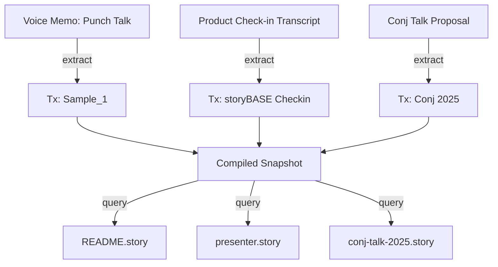
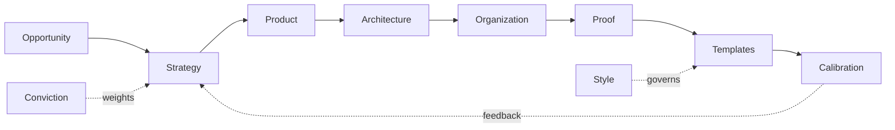
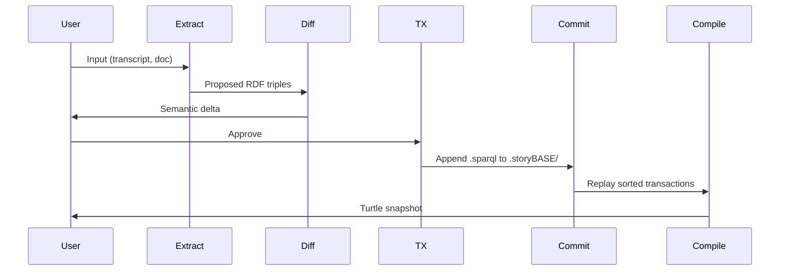

# storyBASE State & Overview

## State

The storyBASE currently holds **three transactions** that establish foundational narrative architecture for identity systems, AI memory platforms, and strategic positioning. The graph encodes:

- **Two product narratives**: Vouch.io (enterprise identity via immutable event logs) and Sic/storyBASE (AI memory via RDF knowledge graphs)[^vouch-sic]
- **Strategic positioning**: extending software development rigor (versioning, branching, Git-native workflows) into strategy, content, and organizational operations[^positioning]
- **Style observations and rubric assessments**: capturing conversational register, technical depth, idiolect phrasing, and narrative coherence across spoken transcripts and proposals[^style-rubric]
- **Ontological scaffolding**: a comprehensive SKOS taxonomy covering Opportunity, Strategy, Product, Architecture, Organization, Proof, Templates, Calibration, Style, and Conviction[^ontology]

The graph is **append-only** by design: each transaction is immutable, timestamped, and attributed to `pleasetrythisathome` via `n8n.storyTWIN/MCP` agents using `anthropic/claude-sonnet-4.5`[^provenance]. Snapshots are compiled by replaying sorted transactions, ensuring deterministic state reconstruction.

---

## Stories

### `/README.story`
**Intent**: Auto-generate a living README that tracks storyBASE evolution—state, stories, assets, transactions—with Mermaid diagrams for clarity.

**Relationship to whole**: Meta-narrative artifact; the README *is* a story generated *from* the storyBASE, demonstrating self-documentation and reflexive narrative generation.

**Approach**: Query the compiled snapshot for transaction provenance, asset structure, and cross-references; synthesize into Markdown with inline citations and flow diagrams showing transaction → concept → artifact lineage.

---

### `/presenter.story`
**Intent**: Draft an iA Presenter slide deck explaining storyBASE using the provided template format (headings, speaker notes, image placeholders, citations).

**Relationship to whole**: Proof artifact and template demonstration; shows how narrative architecture translates into a presentation flow—write → structure → iterate → design → action.

**Approach**: Extract key narrative anchors (tagline, mission, product overview, case studies) from the snapshot; map to slide structure; cite storyBASE nodes in footnotes; include Mermaid diagrams for system topology and data lifecycle[^system-topology].

---

### `/conj-talk-2025.story`
**Intent**: Generate a Clojure Conj talk on "Immutable Selves"—personal journey, identity-as-transactions model, Clojure principles applied to human/AI identity, Vouch.io + Sic case studies.

**Relationship to whole**: Flagship proof narrative; ties speaker's lived experience (trans identity as append-only log) to technical architecture (immutable state, functional UI, knowledge graphs) and strategic outcomes (enterprise identity, AI memory)[^conj-proposal].

**Approach**: 
1. Open with personal framing (Scarlet Dame's identity history as exemplar of append-only identity)[^scarlet-dame]
2. Introduce identity-as-log mental model (vs. mutable profile)[^identity-model]
3. Map Clojure principles (immutability, explicit state, data-first design) to identity systems[^clojure-principles]
4. Present Vouch.io architecture (delegation chains, verifiable receipts, edge authentication)[^vouch-arch]
5. Present Sic/storyBASE architecture (RDF graphs, narrative provenance, Git-native memory)[^sic-arch]
6. Close with actionable takeaways and demo (optional, canned fallback)[^proof]

---

## Assets

```
.
├── .storyBASE/
│   ├── 1762800383add_sample1_narrative_architecture.sparql
│   ├── 1762731465sic-storybase-checkin.sparql
│   └── 1762728019add_conj_talk_2025_extraction.sparql
├── README.story
├── presenter.story
└── conj-talk-2025.story
```

### `.storyBASE/` directory
Append-only transaction log; each `.sparql` file is an `INSERT DATA` transaction with provenance metadata (`prov:wasGeneratedBy`, `prov:wasAttributedTo`, `prov:generatedAtTime`)[^tx-structure]. Transactions are replayed in lexicographic order to produce the compiled Turtle snapshot.

### `*.story` files
YAML front matter + Markdown prompt templates. Each story declares:
- `id`, `title`, `version`, `description`
- `destination` (output path)
- `model` (LLM routing, e.g., `anthropic/claude-sonnet-4.5`)
- Prompt body with instructions and optional reference templates[^story-format]

Stories are **narrative-driven specifications**: they tell the AI *what to write* and *how to cite* the storyBASE as source of truth.

---

## Transactions

### `1762800383add_sample1_narrative_architecture.sparql`
**Generated**: 2025-11-10T18:45:12.711Z  
**Significance**: Establishes **Sample_1** (voice memo on identity-as-append-only-log talk) with:
- **Themes**: `Theme_ImmutableIdentity`, `Theme_TransitionAsStateChange`[^themes]
- **Actors**: Scarlet Dame (speaker), Luke Vanderhart (technical explainer)[^actors]
- **Style observations**: brand stylization (`storyBASE`), idiolect phrasing (`append only log`), metaphor (UI as state machine), first-person narrative[^style-obs-sample1]
- **Rubric assessments**: Register (4.0), Phrasing (3.5), Cadence (3.0), Strategic Alignment (4.5), Resonance (4.5), Accuracy (4.0)[^rubric-sample1]

**Impact**: Seeds the narrative anchor (identity systems via immutable state + functional UI + RDF graphs) and calibrates style metrics for conversational oratory.

---

### `1762731465sic-storybase-checkin.sparql`
**Generated**: 2025-11-09T23:37:05.079Z  
**Significance**: Captures **product & strategy check-in** (18,437 chars) with:
- **Opportunity**: storyBASE market (AI context requirements, RDF-based memory)[^opportunity-storybase]
- **Timing thesis**: 2024–2026 window (prompt engineering maturity, multi-agent workflows, organizational AI memory demand)[^timing]
- **Positioning**: extend software rigor into strategy/content/marketing via RDF narrative source of truth[^positioning]
- **Product overview**: n8n prototype, MCP server, compile/extract/diff/tx/commit tools, GitHub Actions, Open WebUI[^product-overview]
- **Roadmap**: SPARQL → TriG (named graphs), SHACL validation, individuation pipeline, file ingestion, marketplace, cost pass-through billing[^roadmap]
- **Style observations**: CamelCase `storyBASE`, conversational filler (`you know`), power verb (`extend`), jargon policy (RDF/canonization/skolemization assumed)[^style-obs-checkin]
- **Rubric assessments**: Register (3.5), Strategic Alignment (4.0), Accuracy (4.0), Novelty (3.5)[^rubric-checkin]

**Impact**: Defines storyBASE mission, moat (Git-native AI memory), and technical architecture (append-only log, snapshot replay, MCP exposure).

---

### `1762728019add_conj_talk_2025_extraction.sparql`
**Generated**: 2025-11-09T22:39:28.133Z  
**Significance**: Extracts **Conj Talk 2025 proposal** (3,421 chars) with:
- **Opportunity**: Identity Vulnerability Crisis (deepfakes, synthetic identities, impersonation fraud)[^opportunity-identity]
- **Strategy**: Functional Immutable Identity Architecture (Clojure principles → trustworthy identity systems)[^strategy-identity]
- **Products**: Vouch.io (enterprise identity platform), Sic (AI memory platform)[^products]
- **Proof**: Conference talk with threaded diagrams, optional demo, canned fallback[^proof-conj]
- **Architecture**: Append-only event logs, authentication as pure functions, delegation chains, knowledge graphs[^architecture-identity]
- **Style observations**: Brand styling (`Vouch.io`, `Sic`), technical terms (`append-only event logs`, `authentication as pure functions`), triadic enumeration, problem-to-solution bridge, personal identity lens (trans woman lived experience)[^style-obs-conj]
- **Rubric assessments**: Clarity (4.5), Technical Depth (4.8), Narrative Coherence (4.6), Audience Engagement (4.3)[^rubric-conj]

**Impact**: Anchors the Conj talk narrative arc (problem → strategy → proof) and validates technical depth + personal resonance.

---

## Mermaid Diagrams

### Transaction Flow


### Narrative Architecture Layers


### storyBASE Data Lifecycle


---

[^vouch-sic]: Products defined in `urn:uuid:product-vouch-io` and `urn:uuid:product-sic` (Tx: Conj 2025).
[^positioning]: `<http://storybase.synthetic-identity.co/thesis/positioning-storybase>` (Tx: storyBASE Checkin).
[^style-rubric]: Style observations use Web Annotation (`oa:Annotation`) with `oa:TextQuoteSelector` and `oa:TextPositionSelector` to anchor claims to source text; rubric assessments link to `#Rubric_*` concepts with `rdf:value` scores (Tx: Sample_1, storyBASE Checkin, Conj 2025).
[^ontology]: SKOS ConceptScheme `NarrativeArchitecture` with 8 top concepts, 3 classification levels, and XKOS sequential phases (Site → Foundations → Plans → Structural Eng → Walls → Roof → Glazing → Interior Design → Furnishing).
[^provenance]: All transactions use `prov:wasAssociatedWith`, `prov:wasAttributedTo`, `prov:generatedAtTime`, `sb:originPath`, `sb:originRef`, `storytwin:model` for full lineage.
[^system-topology]: `<http://storybase.synthetic-identity.co/architecture/topology-storybase>`: n8n agent orchestrates tools; MCP server exposes to frontends; transactions in `.storybase` directories; hierarchical compile; Docker Compose on Digital Ocean (Tx: storyBASE Checkin).
[^conj-proposal]: `urn:uuid:conj-talk-2025-extraction` (Tx: Conj 2025).
[^scarlet-dame]: `narr:Actor_ScarletDame` with `skos:altLabel` "Dylan Butman", "Scarlet Spectacular"; note: "Speaker's identity history exemplifies append-only log model" (Tx: Sample_1).
[^identity-model]: `urn:uuid:style-obs-8`: "Identity as an evolving log of facts rather than a static profile" (Tx: Conj 2025).
[^clojure-principles]: `urn:uuid:strategy-functional-immutable-identity`: "Applies Clojure principles (immutability, explicit state, functional composition, data-first design, knowledge graphs) to create trustworthy identity systems" (Tx: Conj 2025).
[^vouch-arch]: `urn:uuid:architecture-immutable-identity`: "Append-only event logs with verifiable receipts, authentication as pure function at the edge, delegation as signed append-only events, knowledge graphs for entity and role resolution" (Tx: Conj 2025).
[^sic-arch]: `urn:uuid:product-sic`: "AI memory company using narrative-driven knowledge graphs to create AI individuals with deterministic individuality and provenance" (Tx: Conj 2025).
[^proof]: `urn:uuid:proof-conj-2025-talk`: "Threaded diagrams from model to implementation, optional short demo with canned fallback" (Tx: Conj 2025).
[^tx-structure]: Example: `narr:Tx_20251110T184512Z_sample1 a prov:Activity` with `prov:generatedAtTime`, `prov:wasAssociatedWith`, `prov:wasAttributedTo`, `sb:originPath`, `sb:originRef`, `storytwin:model`.
[^story-format]: YAML front matter includes `id`, `title`, `version`, `description`, `destination`, `model`; Markdown body contains prompt + optional reference templates.
[^themes]: `narr:Theme_ImmutableIdentity`: "Human and system identity modeled as integral of snapshots over time, not mutable present state"; `narr:Theme_TransitionAsStateChange`: "Personal transition (gender, professional) as functional transformation from immutable past states" (Tx: Sample_1).
[^actors]: `narr:Actor_ScarletDame`, `narr:Actor_LukeVanderhart` (Tx: Sample_1).
[^style-obs-sample1]: `narr:StyleObs_storyBASE`, `narr:StyleObs_AppendOnlyLog`, `narr:StyleObs_UIStateMachine`, `narr:StyleObs_FirstPerson` (Tx: Sample_1).
[^rubric-sample1]: `narr:RubricAssess_Register`, `narr:RubricAssess_Phrasing`, `narr:RubricAssess_Cadence`, `narr:RubricAssess_Strategy`, `narr:RubricAssess_Resonance`, `narr:RubricAssess_Accuracy` (Tx: Sample_1).
[^opportunity-storybase]: `<http://storybase.synthetic-identity.co/opportunity/storybase-market>`: "High-quality AI output requires extensive context; current models use search, but RDF-based narrative source of truth enables specific, controllable, versionable AI memory" (Tx: storyBASE Checkin).
[^timing]: `<http://storybase.synthetic-identity.co/thesis/timing-storybase>`: "Convergence of prompt engineering maturity, multi-agent workflows, and demand for organizational AI memory creates window for narrative-driven context management" (Tx: storyBASE Checkin).
[^product-overview]: `<http://storybase.synthetic-identity.co/product/overview-storybase>` (Tx: storyBASE Checkin).
[^roadmap]: `<http://storybase.synthetic-identity.co/roadmap/narrative-storybase>` (Tx: storyBASE Checkin).
[^style-obs-checkin]: `<http://storybase.synthetic-identity.co/style/observation/1>` through `/10` (Tx: storyBASE Checkin).
[^rubric-checkin]: `<http://storybase.synthetic-identity.co/rubric/register-fit>`, `/strategic-alignment`, `/accuracy`, `/novelty` (Tx: storyBASE Checkin).
[^opportunity-identity]: `urn:uuid:opportunity-identity-vulnerability` (Tx: Conj 2025).
[^strategy-identity]: `urn:uuid:strategy-functional-immutable-identity` (Tx: Conj 2025).
[^products]: `urn:uuid:product-vouch-io`, `urn:uuid:product-sic` (Tx: Conj 2025).
[^proof-conj]: `urn:uuid:proof-conj-2025-talk` (Tx: Conj 2025).
[^architecture-identity]: `urn:uuid:architecture-immutable-identity` (Tx: Conj 2025).
[^style-obs-conj]: `urn:uuid:style-obs-1` through `/11` (Tx: Conj 2025).
[^rubric-conj]: `urn:uuid:rubric-clarity`, `/technical-depth`, `/narrative-coherence`, `/audience-engagement` (Tx: Conj 2025).