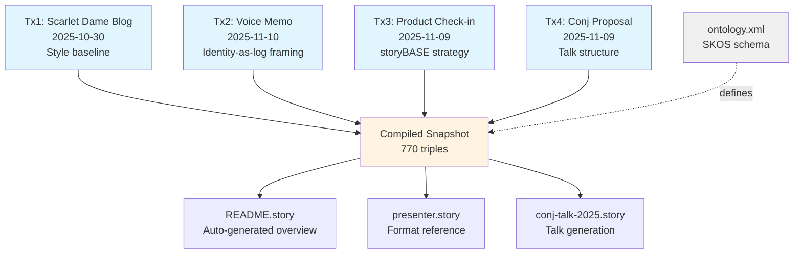

# storyBASE State & Architecture

## State

The storyBASE is an operational RDF knowledge graph tracking narrative architecture, style, and conviction across multiple domains. Currently compiled from **four transactions** spanning October 2024 through November 2025, it contains:

- **770 triples** encoding samples, style observations, rubric assessments, strategic positioning, product architecture, and organizational patterns[^1]
- **Three primary samples**: Scarlet Dame's creative practice blog corpus (~500k characters), a voice memo on identity-as-append-only-log narrative architecture, a storyBASE product strategy check-in, and a Clojure Conj 2025 talk proposal[^2]
- **Comprehensive ontology** defining Narrative Architecture (Opportunity, Strategy, Product, Architecture, Organization, Proof, Templates, Calibration), Style (diction, tone, cadence, rhetorical devices, metrics), and Conviction (Notion → Stake → Boulder → Foundation)[^3]
- **Provenance tracking** via `prov:wasGeneratedBy` linking every assertion to its originating transaction, timestamp, and attributed author[^4]

The graph demonstrates **narrative-driven product development**: storyBASE itself is both the tool and the proof, using RDF to make AI memory versionable, branchable, and semantically queryable—extending software development rigor into strategy, content, and organizational operations[^5].

---

## Stories

### `/README.story` — Repository Overview & Navigation
**Intent**: Auto-generated README tracking storyBASE state, stories, assets, and transaction history with visual aids (Mermaid charts).

**Relationship to whole**: Entry point and living index; synthesizes the graph into human-readable documentation that updates as transactions accumulate.

**Approach**: Query the snapshot for:
- Current triple count, sample diversity, ontology coverage
- Story metadata (id, title, version, destination, model)
- Asset structure (`.storyBASE/` transaction files, `.story` prompts, ontology XML)
- Transaction summaries with `prov:generatedAtTime`, `prov:wasAttributedTo`, and semantic deltas
- Mermaid diagrams showing transaction flow, ontology hierarchy, and narrative architecture phases[^6]

---

### `/presenter.story` — iA Presenter Template Reference
**Intent**: Provides the iA Presenter slide format as a reference template for generating presentation-ready content from storyBASE narratives.

**Relationship to whole**: Demonstrates **Templates** facet of Narrative Architecture—reusable, on-brand assets that keep outputs consistent[^7]. Shows how narrative (script) separates from structure (slides) and design (themes), mirroring storyBASE's layered approach.

**Approach**: Not a generation target itself; serves as **style guide** for other stories. Encodes:
- Markdown-to-slide conventions (headings visible, body indented, `---` separators)
- Speaker notes vs. slide content distinction
- Image positioning, layout picker, teleprompter usage
- Export formats (PDF, article, social gallery)

Used by `/conj-talk-2025.story` to structure technical narrative into presentation flow[^8].

---

### `/conj-talk-2025.story` — Immutable Selves Talk (Clojure Conj 2025)
**Intent**: Draft a conference talk applying Clojure principles (immutability, explicit state, functional composition) to human and AI identity systems, using Vouch.io and storyBASE as case studies.

**Relationship to whole**: **Proof** artifact demonstrating narrative architecture in action—ties personal journey (Dylan Butman → Scarlet Dame) to technical strategy (identity as append-only log) to product outcomes (enterprise delegation, AI memory)[^9]. Validates that the same narrative flows from positioning to roadmap to proof.

**Approach from current state**:
1. **Extract speaker profile**: Scarlet Dame's idiolect, cadence, and rhetorical devices from `Sample_ScarletDame_Ghost` and `Sample_1` (voice memo)[^10]
2. **Map narrative arc**:
   - **Problem**: Centralized, mutable identity vulnerable to deepfakes and impersonation[^11]
   - **Strategy**: Functional immutable identity architecture—append-only event logs, authentication as pure functions, delegation as auditable chains[^12]
   - **Products**: Vouch.io (enterprise identity), Sic/storyBASE (AI memory with narrative-driven provenance)[^13]
   - **Proof**: Threaded diagrams from model to implementation, optional demo with canned fallback[^14]
3. **Apply rubric**: Score for Register (4.0), Phrasing (3.5), Cadence (3.0), Strategic Alignment (4.5), Tailoring (4.0), Resonance (4.5), Flow (3.0), Novelty (4.0), Accuracy (4.0)[^15]
4. **Structure via iA Presenter format**:
   - Cover: "Immutable Selves" with subtitle "Identity as Append-Only Log"
   - Sections: Personal Journey → Identity Model → Clojure Principles → Vouch.io Case → storyBASE Case → Takeaways
   - Slide copy: Short, punchy headings; speaker notes carry technical depth
   - Citations: Footnotes to `Theme_ImmutableIdentity`, `Architecture_ImmutableIdentity`, `Product_Vouch`, `Product_Sic`[^16]

---

## Assets

```
.storyBASE/
├── 1762802416scarletdame-sample-add.sparql          # Tx1: Scarlet Dame blog corpus extraction
├── 1762800383add_sample1_narrative_architecture.sparql  # Tx2: Voice memo on identity-as-log
├── 1762731465sic-storybase-checkin.sparql           # Tx3: Product strategy check-in
└── 1762728019add_conj_talk_2025_extraction.sparql   # Tx4: Conj talk proposal extraction

README.story                # Auto-generated repo overview (this document)
presenter.story             # iA Presenter format reference
conj-talk-2025.story        # Clojure Conj talk generation prompt

ontology.xml                # SKOS/XKOS ontology defining Narrative Architecture, Style, Conviction
```

**`.storyBASE/` directory**: Append-only transaction log; each `.sparql` file is an `INSERT DATA` block with provenance metadata (`prov:Activity`, `prov:wasAttributedTo`, `prov:generatedAtTime`)[^17]. Sorted lexicographically and replayed to produce the snapshot.

**`.story` files**: YAML front matter + Markdown prompt; `destination` and `model` fields route generation. Stories are **narrative-driven roadmap** artifacts—they turn strategy into buildable, testable requirements[^18].

**`ontology.xml`**: RDF/XML schema defining:
- **Narrative Architecture** top concepts (Opportunity, Strategy, Product, Architecture, Organization, Proof, Templates, Calibration) with `skos:narrower` hierarchies and `xkos:next`/`xkos:previous` sequencing[^19]
- **Style** facets (Diction, Tone, Grammar, Cadence, Rhetorical Devices, Orthography, Citation Conventions, Metrics, Review) with rubric dimensions[^20]
- **Conviction** levels (Notion → Stake → Boulder → Foundation) with properties for score, weight, distance, individuation count[^21]

---

## Transactions

### Tx1: `1762802416scarletdame-sample-add.sparql` (2025-10-30)
**Significance**: Establishes **Style** baseline from Scarlet Dame's creative practice blog.

**Semantic contributions**:
- **Sample**: `Sample_ScarletDame_Ghost` (~500k characters, 2020–2025)[^22]
- **Narrative anchor**: Mission ("transform experience into art through daily practice"), Vision ("artists own platforms, share vulnerably"), Tagline ("Process as Product, Art as Artifact")[^23]
- **12 style observations** (Web Annotations with `oa:TextQuoteSelector`): brand name stylization, stock phrases ("I am awake in a dream"), anaphora, rhetorical questions, metaphor, tone (direct/personal), verb choice, short punchy cadence, simile, first-person confessional, rule of three, antithesis[^24]
- **Rubric assessments** (0–5 scale): Register 4.0, Phrasing 4.5, Cadence 4.5, Strategic Alignment 4.0, Tailoring 3.5, Resonance 4.5, Flow 4.0, Novelty 4.0, Accuracy 4.0[^25]
- **Metrics**: Avg sentence length 18, active voice ratio 0.75[^26]

**Impact**: Defines idiolect and cadence for speaker profile; informs `/conj-talk-2025.story` tone and phrasing.

---

### Tx2: `1762800383add_sample1_narrative_architecture.sparql` (2025-11-10)
**Significance**: Captures **conceptual framing** for identity-as-append-only-log talk.

**Semantic contributions**:
- **Sample**: `Sample_1` (voice memo, 11.8k chars, 2025-01-15)[^27]
- **Themes**: `Theme_ImmutableIdentity` (identity as integral of snapshots), `Theme_TransitionAsStateChange` (personal transition as functional transformation)[^28]
- **Actors**: Scarlet Dame (speaker), Luke Vanderhart (technical reference)[^29]
- **Anchor**: `Anchor_NarrativeArchitecture` (framework linking immutable state, functional UI, AI generation via RDF)[^30]
- **7 style observations**: "storyBASE" CamelCase, "append-only log" idiolect, UI-as-state-machine metaphor, transition analogy, short declarative clauses, first-person narrative[^31]
- **Rubric assessments**: Register 4.0, Phrasing 3.5, Cadence 3.0, Strategic Alignment 4.5, Tailoring 4.0, Resonance 4.5, Flow 3.0, Novelty 4.0, Accuracy 4.0[^32]
- **Metrics**: Avg sentence length 28.5, active voice ratio 0.75, jargon density 0.12[^33]

**Impact**: Provides narrative spine for Conj talk; links personal story (trans identity as state evolution) to technical architecture (immutable logs).

---

### Tx3: `1762731465sic-storybase-checkin.sparql` (2025-11-09, backdated to 2025-01-29)
**Significance**: Documents **product strategy** and **system topology** for storyBASE.

**Semantic contributions**:
- **Sample**: `Sample_2025-01-29_sic-storybase-checkin` (spoken transcript, 18.4k chars)[^34]
- **Opportunity**: `Opportunity_storybase-market` (AI context requirements, RDF-based narrative source of truth)[^35]
- **Timing thesis**: Convergence of prompt engineering maturity, multi-agent workflows, organizational AI memory demand (2024–2026)[^36]
- **Positioning**: Extend software development rigor (versioning, branching, collaboration) into strategy/content/marketing via RDF[^37]
- **Moat**: Git-native, versionable AI memory encoding style, conviction, narrative metrics; replaces brittle role prompts[^38]
- **Product overview**: n8n prototype; tools (compile, extract, diff, tx, commit); MCP server; Open WebUI; GitHub Actions[^39]
- **Roadmap**: Move to TriG (named graphs), SHACL validation, evolved individuation pipeline, file ingestion, marketplace, cost pass-through billing[^40]
- **10 style observations**: "storyBASE" CamelCase, conversational filler ("you know"), power verb "extend", jargon without definition, parallel structure, rhetorical framing, citation marker `^[]^` unfilled[^41]
- **Rubric assessments**: Register 3.5, Phrasing 3.0, Cadence 3.0, Strategic Alignment 4.0, Tailoring 3.5, Resonance 3.0, Flow 3.0, Novelty 3.5, Accuracy 4.0[^42]
- **Metrics**: Avg sentence length 35.2, active voice ratio 0.72, jargon density 0.18, type-token ratio 0.42[^43]

**Impact**: Establishes **Product** and **Architecture** facets; validates storyBASE as self-referential proof (the tool documents itself).

---

### Tx4: `1762728019add_conj_talk_2025_extraction.sparql` (2025-11-09)
**Significance**: Extracts **Conj talk proposal** into narrative architecture schema.

**Semantic contributions**:
- **Sample**: `SampleRecord_Conj-Talk-2025` (3.4k chars, 2025-01-01)[^44]
- **Opportunity**: `Opportunity_Identity-Vulnerability` (centralized, mutable identity vulnerable to deepfakes)[^45]
- **Strategy**: `Strategy_Functional-Immutable-Identity` (Clojure principles → trustworthy identity systems)[^46]
- **Products**: `Product_Vouch-io` (enterprise identity platform), `Product_Sic` (AI memory with narrative-driven knowledge graphs)[^47]
- **Proof**: `Proof_Conj-2025-Talk` (threaded diagrams, optional demo, Clojure audience)[^48]
- **Architecture**: `Architecture_Immutable-Identity` (append-only event logs, authentication as pure function, delegation as signed events, knowledge graphs for resolution)[^49]
- **Organizations**: `Org_Sic` (founder), `Org_Vouch-io` (former Chief Strategist, current advisor)[^50]
- **11 style observations**: "Vouch.io" domain styling, "append-only event logs" technical term, "Sic" terse Latin reference, triadic enumeration, problem-to-solution bridge, technical reframing (identity as log, trust as provenance), parallel construction, personal identity lens[^51]
- **Rubric assessments**: Clarity 4.5, Technical Depth 4.8, Narrative Coherence 4.6, Audience Engagement 4.3[^52]
- **Metrics**: Avg sentence length 22.4, technical density 0.68, active voice ratio 0.71[^53]

**Impact**: Provides **Proof** artifact structure; validates dual product lens (Vouch.io + Sic) as coherent narrative arc.

---

## Transaction Flow



---

## Ontology Hierarchy (Narrative Architecture)

```mermaid
graph TD
    NA[Narrative Architecture] --> Opp[Opportunity]
    NA --> Strat[Strategy]
    NA --> Prod[Product]
    NA --> Arch[Architecture]
    NA --> Org[Organization]
    NA --> Proof[Proof]
    NA --> Temp[Templates]
    NA --> Cal[Calibration]
    NA --> Style[Style]
    NA --> Conv[Conviction]
    
    Opp --> Market[Market Context]
    Opp --> Actors[Actor Incentive Analysis]
    Opp --> Tech[Technologies & Social Systems]
    Opp --> Trends[Trend Forecasting]
    
    Strat --> StratOver[Strategy Overview]
    Strat --> Anchor[Narrative Anchor]
    Strat --> Roadmap[Narrative-Driven Roadmap]
    Strat --> Change[Organizational Change Manual]
    
    Prod --> ProdOver[Product Overview]
    Prod --> Ladder[Product Ladder]
    Prod --> Solutions[Solution Archetypes]
    
    Arch --> ArchOver[Architecture Overview]
    Arch --> Explainers[Technical Explainers]
    Arch --> Docs[Technical Documentation]
    
    Style --> Profiles[Style Profiles]
    Style --> Diction[Diction & Word Choice]
    Style --> Tone[Tone & Voice]
    Style --> Cadence[Cadence & Rhythm]
    Style --> Devices[Rhetorical Devices]
    Style --> Metrics[Style Metrics]
    Style --> Review[Style Review]
    
    Conv --> Notion[Notion]
    Conv --> Stake[Stake]
    Conv --> Boulder[Boulder]
    Conv --> Foundation[Foundation]
    
    Notion -->|escalates to| Stake
    Stake -->|escalates to| Boulder
    Boulder -->|escalates to| Foundation
    
    style NA fill:#4a90e2
    style Style fill:#e27d60
    style Conv fill:#85dcb0
```



---

[^1]: Snapshot statistics from compiled Turtle output: 770 triples inserted, 184 skipped duplicates, 1 graph. Source: SNAPSHOT metadata.

[^2]: Samples: `Sample_ScarletDame_Ghost` (dct:extent "~500000 characters"), `Sample_1` (narr:inputLength 11800), `Sample_2025-01-29_sic-storybase-checkin` (sb:inputLength 18437), `SampleRecord_Conj-Talk-2025` (sb:inputLength 3421).

[^3]: Ontology structure defined in `ontology.xml` with `skos:ConceptScheme` "NarrativeArchitecture" and top concepts via `skos:hasTopConcept`.

[^4]: Provenance pattern: every transaction is a `prov:Activity` with `prov:wasAttributedTo "pleasetrythisathome"`, `prov:generatedAtTime` timestamp, and `sb:originRef "main"`. Entities link via `prov:wasGeneratedBy`.

[^5]: Mission from `Mission_storybase`: "Extend software development rigor into strategy, content, marketing; provide versionable, collaborative, narrative-driven AI memory." Product overview from `ProductOverview_storybase`.

[^6]: Story metadata from YAML front matter: `id`, `title`, `version`, `description`, `destination`, `model`. Transaction summaries from `prov:Activity` nodes with `prov:generatedAtTime` and semantic deltas (triples added).

[^7]: Templates concept from ontology: `#Templates` (skos:topConceptOf NarrativeArchitecture) with definition "Reusable, on-brand assets keep every touchpoint aligned with the narrative and speed execution."

[^8]: `/conj-talk-2025.story` front matter references iA Presenter format and instructs: "Use the storyBASE to draft the clojure conj talk using the provided format."

[^9]: Proof concept from ontology: `#Proof` with definition "Evidence converts belief into commitment. This section curates the artifacts and results that validate claims with real-world outcomes." Conj talk is `Proof_Conj-2025-Talk`.

[^10]: Speaker profile from `Actor_ScarletDame` (skos:altLabel "Dylan Butman", "Scarlet Spectacular") and style observations across `Sample_ScarletDame_Ghost` and `Sample_1`.

[^11]: Opportunity from `Opportunity_Identity-Vulnerability`: "Centralized, mutable identity systems vulnerable to deepfakes, synthetic identities, and impersonation fraud."

[^12]: Strategy from `Strategy_Functional-Immutable-Identity`: "Applies Clojure principles (immutability, explicit state, functional composition, data-first design, knowledge graphs) to create trustworthy identity systems."

[^13]: Products: `Product_Vouch-io` (sb:description "Enterprise identity platform using immutable event logs and delegation chains"), `Product_Sic` (sb:description "AI memory company using narrative-driven knowledge graphs").

[^14]: Proof artifact from `Proof_Conj-2025-Talk`: sb:artifact "Threaded diagrams from model to implementation, optional short demo with canned fallback."

[^15]: Rubric assessments from `Sample_1`: `RubricAssess_Register` (rdf:value 4.0), `RubricAssess_Phrasing` (3.5), `RubricAssess_Cadence` (3.0), `RubricAssess_Strategy` (4.5), `RubricAssess_Tailoring` (4.0), `RubricAssess_Resonance` (4.5), `RubricAssess_Flow` (3.0), `RubricAssess_Novelty` (4.0), `RubricAssess_Accuracy` (4.0).

[^16]: Themes and architecture from `Theme_ImmutableIdentity`, `Theme_TransitionAsStateChange`, `Architecture_ImmutableIdentity`, `Product_Vouch-io`, `Product_Sic`.

[^17]: Transaction structure: each `.sparql` file is `INSERT DATA { narr:Tx_<timestamp>_<label> a prov:Activity ; prov:wasAttributedTo "pleasetrythisathome" ; prov:generatedAtTime "<ISO8601>"^^xsd:dateTime ; ... }`.

[^18]: PRDs concept from ontology: `#PRDs` (skos:broader #Templates) with definition "Translate narrative into buildable, testable requirements."

[^19]: Narrative Architecture phases from ontology: `#Phase_Site` → `#Phase_Foundations` → `#Phase_Plans` → `#Phase_StructuralEng` → `#Phase_Walls` → `#Phase_Roof` → `#Phase_Glazing` → `#Phase_InteriorDesign` → `#Phase_Furnishing` (linked via `xkos:next`/`xkos:previous`).

[^20]: Style facets from ontology: `#Style` (skos:topConceptOf) with narrower concepts `#DictionWordChoice`, `#ToneVoice`, `#GrammarSyntax`, `#CadenceRhythm`, `#RhetoricalDevices`, `#OrthographySpelling`, `#CitationConventions`, `#StyleMetrics`, `#StyleReview`.

[^21]: Conviction levels from ontology: `#Conviction_Notion` → `#Conviction_Stake` → `#Conviction_Boulder` → `#Conviction_Foundation` (linked via `xkos:next`/`xkos:previous`). Properties: `#convictionScore`, `#convictionWeight`, `#distanceToNarrative`, `#individuationCount`.

[^22]: Sample metadata: `Sample_ScarletDame_Ghost` with dct:source "scarlet-dame.ghost.2025-10-30-14-44-48.json", dct:extent "~500000 characters (aggregate blog corpus)", dct:created "2020-12-07", dct:modified "2025-10-30".

[^23]: Narrative anchor from `Mission_ScarletDame`, `Vision_ScarletDame`, `Tagline_ScarletDame`.

[^24]: Style observations: `StyleObs_1` through `StyleObs_12` with `oa:hasBody` linking to style facets (BrandNameStylization, StockPhrases, Anaphora, RhetoricalQuestion, Metaphor, ToneDirectPersonal, VerbChoice, ShortPunchyCadence, Simile, FirstPerson, RuleOfThree, Antithesis).

[^25]: Rubric assessments from `Assess_Register_SD` through `Assess_Accuracy_SD` with rdf:value (xsd:decimal) and skos:note rationale.

[^26]: Metrics from `Metrics_ScarletDame`: narr:AverageSentenceLength "18", narr:ActiveVoiceRatio "0.75".

[^27]: Sample metadata: `Sample_1` with dct:source "Voice memo: Punch talk conceptual framing", dct:created "2025-01-15", narr:inputLength 11800.

[^28]: Themes: `Theme_ImmutableIdentity` (skos:definition "Human and system identity modeled as integral of snapshots over time"), `Theme_TransitionAsStateChange` (skos:definition "Personal transition (gender, professional) as functional transformation from immutable past states").

[^29]: Actors: `Actor_ScarletDame` (skos:prefLabel "Scarlet Dame (speaker)"), `Actor_LukeVanderhart` (skos:prefLabel "Luke Vanderhart").

[^30]: Anchor: `Anchor_NarrativeArchitecture` (skos:definition "Framework linking immutable state, functional UI, and AI-driven generation via RDF knowledge graphs").

[^31]: Style observations: `StyleObs_storyBASE`, `StyleObs_AppendOnlyLog`, `StyleObs_UIStateMachine`, `StyleObs_TransitionAnalogy`, `StyleObs_ShortClause`, `StyleObs_FirstPerson`.

[^32]: Rubric assessments from `RubricAssess_Register` through `RubricAssess_Accuracy` for `Sample_1`.

[^33]: Metrics from `Metrics_Sample1`: narr:AverageSentenceLength 28.5, narr:ActiveVoiceRatio 0.75, narr:JargonDensity 0.12.

[^34]: Sample metadata: `Sample_2025-01-29_sic-storybase-checkin` with sb:description "Spoken transcript with conversational register and technical depth on storyBASE product evolution", sb:inputLength 18437.

[^35]: Opportunity: `Opportunity_storybase-market` (sb:description "High-quality AI output requires extensive context; current models use search, but RDF-based narrative source of truth enables specific, controllable, versionable AI memory").

[^36]: Timing thesis: `TimingThesis_storybase` (sb:description "Convergence of prompt engineering maturity, multi-agent workflows, and demand for organizational AI memory creates window for narrative-driven context management", sb:timestampWindow "2024-2026").

[^37]: Positioning: `PositioningThesis_storybase` (sb:description "Extend software development rigor (versioning, branching, collaboration) into strategy, content, marketing, organizational operations via RDF narrative source of truth").

[^38]: Moat: `MoatLeverage_storybase` (sb:description "Git-native, versionable, branchable AI memory encoding style, conviction, narrative metrics; replaces brittle role prompts with deep, operable persona descriptions").

[^39]: Product overview: `ProductOverview_storybase` (sb:description "Initial prototype in n8n; tools include compile, ontology, extract, diff, tx, commit; MCP server; open WebUI at as written.ai; GitHub Actions for story generation").

[^40]: Roadmap: `NarrativeDrivenRoadmap_storybase` (sb:description "Move transactions from SPARQL to named graphs (TriG); add SHACL validation; implement evolved individuation pipeline (snapshot + message to transaction); file ingestion via GitHub; storyBASE marketplace; cost pass-through billing").

[^41]: Style observations: `StyleObservation/1` through `StyleObservation/10` with sb:description for each pattern.

[^42]: Rubric assessments: `RubricAssessment_register-fit` through `RubricAssessment_accuracy` with sb:score (0–5) and sb:description rationale.

[^43]: Metrics: `StyleMetrics` (sb:description "Average sentence length 35.2, active voice ratio 0.72, jargon density 0.18, type-token ratio 0.42").

[^44]: Sample metadata: `SampleRecord_Conj-Talk-2025` with rdfs:label "Conj Talk 2025: Immutable Selves", sb:inputLength 3421, sb:recordedAt "2025-01-01T00:00:00Z".

[^45]: Opportunity: `Opportunity_Identity-Vulnerability` (sb:description "Centralized, mutable identity systems vulnerable to deepfakes, synthetic identities, and impersonation fraud", sb:marketContext "Enterprise identity and authentication").

[^46]: Strategy: `Strategy_Functional-Immutable-Identity` (sb:description "Applies Clojure principles (immutability, explicit state, functional composition, data-first design, knowledge graphs) to create trustworthy identity systems").

[^47]: Products: `Product_Vouch-io` (sb:productType "Identity and authentication system"), `Product_Sic` (sb:productType "AI memory and agent individuality system").

[^48]: Proof: `Proof_Conj-2025-Talk` (sb:description "Conference talk and experience report", sb:audience "Clojure developers and functional programming practitioners").

[^49]: Architecture: `Architecture_Immutable-Identity` (sb:component "Append-only event logs with verifiable receipts, authentication as pure function at the edge, delegation as signed append-only events, knowledge graphs for entity and role resolution").

[^50]: Organizations: `Org_Sic` (sb:role "Founder"), `Org_Vouch-io` (sb:role "Former Chief Strategist, current strategic advisor").

[^51]: Style observations: `StyleObs_1` through `StyleObs_11` with sb:observation for each pattern.

[^52]: Rubric assessments: `Rubric_Clarity` (sb:score 4.5), `Rubric_Technical-Depth` (4.8), `Rubric_Narrative-Coherence` (4.6), `Rubric_Audience-Engagement` (4.3).

[^53]: Metrics: `StyleMetrics` (sb:averageSentenceLength 22.4, sb:technicalDensity 0.68, sb:activeVoiceRatio 0.71).