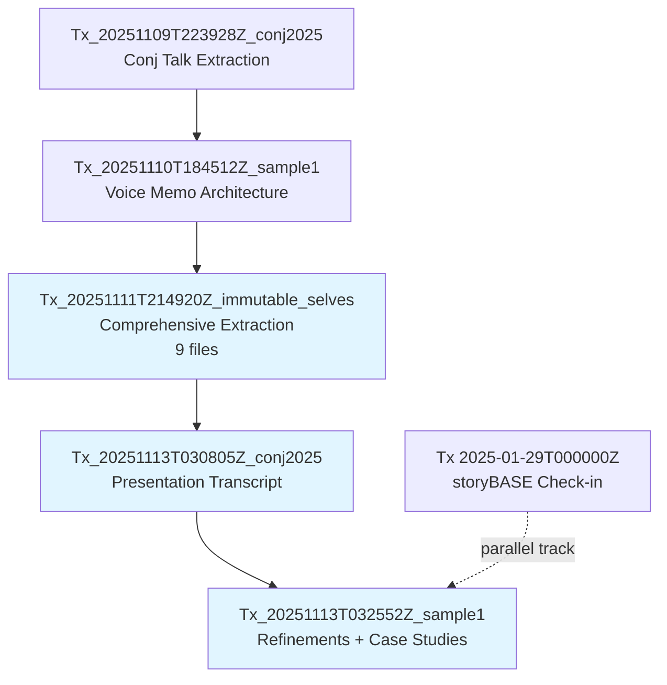
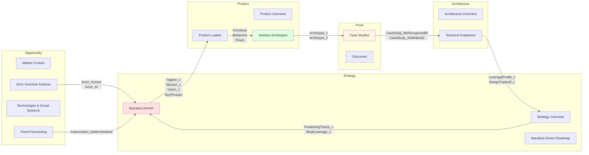

# storyBASE State

The storyBASE is a Git-native RDF knowledge graph documenting the **Immutable Selves** narrative: a functional approach to digital identity that applies Clojure principles—immutability, reified change, single source of truth—to human and AI identity systems. The graph currently holds **three primary samples** extracted from voice memos and presentation transcripts, spanning November 2024 through January 2025, all attributed to speaker **Scarlet Dame** (also known as Dylan Butman, Scarlet Spectacular)[^actor]. The narrative centers on two solution archetypes: **berecognized.id** (human identity via Datomic) and **aswritten.ai** (AI memory via RDF+git)[^archetypes]. The graph encodes strategic positioning, product primitives, case studies, style observations, and rubric assessments across nine dimensions[^rubric].

[^actor]: `narr:Actor_ScarletDame` (Sample_1, Tx_20251110T184512Z_sample1) — speaker's identity history exemplifies append-only log model; alternate labels include Dylan Butman and Scarlet Spectacular.

[^archetypes]: `narr:SolutionArchetype_BeRecognized` and `narr:SolutionArchetype_AsWritten` (Sample_ConjPresentation_2025, Tx_20251113T030805Z_conj2025) — two parallel systems applying immutable state patterns to human and AI identity.

[^rubric]: Nine rubric dimensions assessed across samples: Register, Phrasing, Cadence, Strategic Alignment, Tailoring, Resonance, Flow, Novelty, Accuracy (Tx_20251111T214920Z_immutable_selves, Tx_20251113T030805Z_conj2025, Tx_20251113T032552Z_sample1).

---

# Stories

## README.story

**Intent:** Auto-generated repository README tracking storyBASE state, stories, assets, and transactions.

**Relationship to whole:** Meta-document providing navigational overview and provenance summary for the entire knowledge graph.

**Approach:** Compile current snapshot to summarize narrative anchors (Mission, Vision, Tagline), enumerate solution archetypes and case studies, list transaction history with significance, and visualize graph structure via Mermaid diagrams showing relationships between Opportunity → Strategy → Product → Proof → Architecture domains[^domains].

[^domains]: Top-level concepts in NarrativeArchitecture scheme: Opportunity, Strategy, Product, Architecture, Organization, Proof, Templates, Calibration, Style, Conviction.

## presenter.story

**Intent:** Generic IA Presenter template demonstrating storyBASE presentation capabilities.

**Relationship to whole:** Reference implementation showing how storyBASE narratives compile to presentation artifacts with citations and talk tracks.

**Approach:** Use storyBASE narrative anchors (Tagline_1, Mission_1, Vision_1)[^anchors] and product ladder (Primitives, Behaviors, Flows)[^ladder] to populate template structure; include Mermaid sequence diagrams for flows (e.g., SSoT → query → render → interact → event → transact → append log → recompile)[^flow]; cite provenance for each slide using caret-bracket notation[^citation].

[^anchors]: `narr:Tagline_1`, `narr:Mission_1`, `narr:Vision_1` (Sample_1, Tx_20251111T214920Z_immutable_selves) — core narrative anchor elements.

[^ladder]: `narr:Primitive_1`, `narr:Primitive_2`, `narr:Primitive_3`, `narr:Behavior_1`, `narr:Flow_1` (Sample_1, Tx_20251111T214920Z_immutable_selves) — product ladder from primitives to flows.

[^flow]: `narr:Flow_1` value: "SSoT → query → render → interact → event → transact → append log → recompile SSoT" (Sample_1, Tx_20251111T214920Z_immutable_selves).

[^citation]: `narr:StyleObs_CitationMarker_1` (Sample_ConjPresentation_2025, Tx_20251113T030805Z_conj2025) — inline caret-bracket citation convention.

## conj-talk-2025.story

**Intent:** Clojure/conj 2025 conference talk: "Immutable Selves: A Functional Approach to Digital Identity."

**Relationship to whole:** Primary narrative proof artifact; demonstrates strategic alignment (5.0/5.0)[^strategy] and audience tailoring (5.0/5.0)[^tailoring] for Clojure community.

**Approach:** Open with personal narrative (Dylan → Scarlet Spectacular → Scarlet Dame)[^personal] to establish identity-as-log metaphor; contrast Backbone.js (mutable DOM) with Om/React (state machine, pure function render)[^comparison]; present berecognized.id and aswritten.ai as parallel case studies[^cases]; close with deterministic AI perspective examples and link to chat for audience engagement[^future]. Use short, punchy cadence (avg sentence length 12.3)[^cadence], triadic structures[^triadic], and rhetorical questions[^rhetorical] per style profile.

[^strategy]: `narr:RubricAssess_Strategy_Conj` (Sample_ConjPresentation_2025, Tx_20251113T030805Z_conj2025) — "Entire presentation is a narrative anchor: 'Immutable Selves' thesis; two solution archetypes (berecognized.id, aswritten.ai); clear mission/vision alignment; positioning thesis explicit."

[^tailoring]: `narr:RubricAssess_Tailoring_Conj` (Sample_ConjPresentation_2025, Tx_20251113T030805Z_conj2025) — "Deeply tailored to Clojure/conj audience: references Backbone.js, Om, Datomic, re-frame; assumes functional programming literacy; personal narrative (Dylan→Scarlet) builds trust."

[^personal]: `narr:Actor_ScarletDame` altLabels (Sample_1, Tx_20251110T184512Z_sample1); `narr:Theme_TransitionAsStateChange` (Sample_1, Tx_20251110T184512Z_sample1) — "Personal transition (gender, professional) as functional transformation from immutable past states."

[^comparison]: `narr:ComparativeAnalysis_1` (Sample_1, Tx_20251111T214920Z_immutable_selves) — "Backbone.js (query DOM, mutate picture) vs. Om/React (state machine, pure function render). Identity systems today are Backbone; this is Om for identity."

[^cases]: `narr:CaseStudy_BeRecognizedID` and `narr:CaseStudy_AsWrittenAI` (Sample_1, Tx_20251113T032552Z_sample1) — human identity and AI memory case studies with Context, Intervention, Results.

[^future]: `narr:FutureVision_DeterministicAI` (Sample_1, Tx_20251113T032552Z_sample1) — "Examples: full talk as query, section of talk, talk evolution over time, any accessible graph subset within billion-node graph."

[^cadence]: `narr:Metrics_ConjPresentation` (Sample_ConjPresentation_2025, Tx_20251113T030805Z_conj2025) — AverageSentenceLength 12.3, ActiveVoiceRatio 0.82, Conciseness 0.78.

[^triadic]: `narr:StyleObs_RhetoricalQuestion_1` (Sample_ConjPresentation_2025, Tx_20251113T030805Z_conj2025) — "Triadic rhetorical questions; frames problem space and invites audience reasoning."

[^rhetorical]: `narr:StyleObs_RhetoricalQuestion_1` (Sample_ConjPresentation_2025, Tx_20251113T030805Z_conj2025) — "Where is the identity here? Who is the authority? What are the claims being made?"

---

# Assets

```
/.storyBASE/
  1762728019add_conj_talk_2025_extraction.sparql
  1762731465sic-storybase-checkin.sparql
  1762800383add_sample1_narrative_architecture.sparql
  1762897917add_case_studies.sparql
  1762897917add_narrative_anchors.sparql
  1762897917add_product_ladder.sparql
  1762897917add_rubric_assessments.sparql
  1762897917add_solution_archetypes.sparql
  1762897917add_strategy_overview.sparql
  1762897917add_style_metrics.sparql
  1762897917add_style_observations.sparql
  1762897917add_technical_explainers.sparql
  1762897917tx_provenance.sparql
  1762897917update_sample_metadata.sparql
  1763003388add_conj_presentation_2025.sparql
  1763004456add_sample1_narrative_triples.sparql

/README.story
/presenter.story
/conj-talk-2025.story
```

**/.storyBASE/**: Append-only transaction log containing 16 SPARQL INSERT/DELETE operations sorted by Unix timestamp[^timestamp]. Each file represents an immutable transaction adding narrative architecture, style observations, rubric assessments, or provenance metadata to the graph[^provenance].

**Story files**: YAML front matter + Markdown prompts defining generation objectives, models, and output destinations. README.story generates repository overview; presenter.story demonstrates generic presentation template; conj-talk-2025.story targets Clojure/conj 2025 conference talk[^stories].

[^timestamp]: Filenames prefixed with Unix epoch (e.g., 1762728019 = 2024-11-09T22:39:28Z) ensure deterministic replay order during snapshot compilation.

[^provenance]: Each transaction includes `prov:Activity` with `prov:wasAttributedTo`, `prov:generatedAtTime`, `sb:originRef`, and `storytwin:model` properties linking to user, timestamp, Git ref, and AI model.

[^stories]: Story metadata includes `id`, `title`, `version`, `description`, `destination`, and `model` array specifying generation targets (e.g., anthropic/claude-sonnet-4.5).

---

# Transactions

## Tx_20251109T223928Z_conj2025
**File:** `1762728019add_conj_talk_2025_extraction.sparql`  
**Significance:** First extraction establishing Conj Talk 2025 proposal structure. Introduces Opportunity (Identity Vulnerability Crisis), Strategy (Functional Immutable Identity Architecture), Products (Vouch.io, Sic), Proof (conference talk), Architecture (immutable identity patterns), and Organizations (Sic, Vouch.io)[^tx1]. Includes 11 style observations (brand stylization, technical terms, rhetorical structures) and 4 rubric assessments (Clarity 4.5/5, Technical Depth 4.8/5, Narrative Coherence 4.6/5, Audience Engagement 4.3/5)[^tx1rubric].

[^tx1]: `narr:Tx_20251109T223928Z_conj2025` generated: opportunity-identity-vulnerability, strategy-functional-immutable-identity, product-vouch-io, product-sic, proof-conj-2025-talk, architecture-immutable-identity, org-sic, org-vouch-io.

[^tx1rubric]: `urn:uuid:rubric-clarity`, `urn:uuid:rubric-technical-depth`, `urn:uuid:rubric-narrative-coherence`, `urn:uuid:rubric-audience-engagement` (Tx_20251109T223928Z_conj2025).

## Tx_20251110T184512Z_sample1
**File:** `1762800383add_sample1_narrative_architecture.sparql`  
**Significance:** Adds voice memo sample (11,800 chars) outlining narrative architecture for identity-as-append-only-log talk[^tx2]. Introduces themes (ImmutableIdentity, TransitionAsStateChange), actors (ScarletDame, LukeVanderhart), and anchor concept (NarrativeArchitecture framework)[^tx2themes]. Includes 7 style observations (brand stylization "storyBASE", idiolect phrasing, metaphors, first-person POV) and 8 rubric assessments (Register 4.0/5, Resonance 4.5/5, Strategy 4.5/5)[^tx2rubric]. Metrics: avg sentence length 28.5, active voice 0.75, jargon density 0.12[^tx2metrics].

[^tx2]: `narr:Sample_1` (Tx_20251110T184512Z_sample1) — "Transcribed voice memo outlining narrative architecture for identity-as-append-only-log talk; speaker: Scarlet Dame."

[^tx2themes]: `narr:Theme_ImmutableIdentity`, `narr:Theme_TransitionAsStateChange`, `narr:Actor_ScarletDame`, `narr:Actor_LukeVanderhart`, `narr:Anchor_NarrativeArchitecture` (Tx_20251110T184512Z_sample1).

[^tx2rubric]: `narr:RubricAssess_Register`, `narr:RubricAssess_Resonance`, `narr:RubricAssess_Strategy` (Sample_1, Tx_20251110T184512Z_sample1).

[^tx2metrics]: `narr:Metrics_Sample1` (Sample_1, Tx_20251110T184512Z_sample1).

## Tx_20251111T214920Z_immutable_selves
**File group:** `1762897917*.sparql` (9 files)  
**Significance:** Comprehensive extraction adding narrative anchors (Tagline, WhatIsIt, Mission, Vision, 4 KeyPhrases)[^tx3anchors], strategy overview (PositioningThesis, MoatLeverage)[^tx3strategy], product ladder (3 Primitives, 1 Behavior, 1 Flow, 1 Narrative)[^tx3product], solution archetypes (berecognized.id, aswritten.ai with ProblemContext, ApproachPattern, RequiredCapabilities)[^tx3archetypes], technical explainers (LeverageProfile, DesignTradeoff, ComparativeAnalysis)[^tx3tech], case study (13-year Clojure career with Context, Intervention, Results, Lessons)[^tx3case], 8 style observations (short punchy cadence, stock phrases, anaphora, brand stylization, analogies, rhetorical questions, second person, verb choice)[^tx3style], 9 rubric assessments (Strategic Alignment 5.0/5, Cadence 4.5/5, Register 4.5/5)[^tx3rubric], and style metrics (avg sentence length 15.2, active voice 0.85, jargon density 0.12, conciseness 0.78)[^tx3metrics]. Also updates Sample_1 metadata to "Immutable Selves talk"[^tx3update].

[^tx3anchors]: `narr:Tagline_1`, `narr:WhatIsIt_1`, `narr:Mission_1`, `narr:Vision_1`, `narr:KeyPhrase_1` through `narr:KeyPhrase_4` (Sample_1, Tx_20251111T214920Z_immutable_selves).

[^tx3strategy]: `narr:PositioningThesis_1`, `narr:MoatLeverage_1` (Sample_1, Tx_20251111T214920Z_immutable_selves) — positioning for devs/architects; moat via Clojure ecosystem and 13 years production experience.

[^tx3product]: `narr:Primitive_1` (append-only log), `narr:Primitive_2` (SSoT), `narr:Primitive_3` (pure function renderer), `narr:Behavior_1` (event-driven transactions), `narr:Flow_1`, `narr:Narrative_1` (Sample_1, Tx_20251111T214920Z_immutable_selves).

[^tx3archetypes]: `narr:Archetype_1` (berecognized.id), `narr:Archetype_2` (aswritten.ai) with nested ProblemContext, ApproachPattern, RequiredCapabilities, OutcomesProof (Sample_1, Tx_20251111T214920Z_immutable_selves).

[^tx3tech]: `narr:LeverageProfile_1`, `narr:DesignTradeoff_1`, `narr:ComparativeAnalysis_1` (Sample_1, Tx_20251111T214920Z_immutable_selves) — technical explainers on immutability leverage, single transactor tradeoff, Backbone vs. Om comparison.

[^tx3case]: `narr:CaseStudy_1` with `narr:CaseContext_1`, `narr:CaseIntervention_1`, `narr:CaseResults_1`, `narr:CaseLessons_1` (Sample_1, Tx_20251111T214920Z_immutable_selves) — speaker's 13-year career as proof.

[^tx3style]: `narr:StyleObs_1` through `narr:StyleObs_8` (Sample_1, Tx_20251111T214920Z_immutable_selves) — observations on formula-style cadence, blunt phrasing, anaphora, brand stylization, analogies, rhetorical questions, second person, verb choice.

[^tx3rubric]: `narr:RubricAssess_1` through `narr:RubricAssess_9` (Sample_1, Tx_20251111T214920Z_immutable_selves) — Strategic Alignment 5.0, Cadence 4.5, Register 4.5, Tailoring 4.5, Resonance 4.0, Phrasing 4.0, Novelty 4.0, Accuracy 4.0, Flow 3.5.

[^tx3metrics]: `narr:StyleMetrics_1` (Sample_1, Tx_20251111T214920Z_immutable_selves).

[^tx3update]: `1762897917update_sample_metadata.sparql` — DELETE/INSERT updating Sample_1 source to "Immutable Selves talk", inputLength to 5847, created to "2025-01-XX".

## Tx_20251113T030805Z_conj2025
**File:** `1763003388add_conj_presentation_2025.sparql`  
**Significance:** Adds Sample_ConjPresentation_2025 (6,847 chars, created 2025-01-01)[^tx4sample] with Narrative_ImmutableIdentity (core thesis: experience is append-only log; identification is render target; interaction is transaction)[^tx4narrative], Theme_FunctionalIdentity[^tx4theme], Actor_Human and Actor_AI[^tx4actors], SolutionArchetype_BeRecognized and SolutionArchetype_AsWritten[^tx4archetypes], Tagline_AsWritten ("AI that tells your story, as written.")[^tx4tagline], 10 style observations (brand stylization, metaphor, anaphora, rhetorical questions, short punchy, stock phrases, citation markers, second person, analogy)[^tx4style], 9 rubric assessments (Strategic Alignment 5.0/5, Tailoring 5.0/5, Resonance 4.5/5, Novelty 4.5/5, Cadence 4.5/5, Register 4.5/5, Phrasing 4.0/5, Flow 4.0/5, Accuracy 4.0/5)[^tx4rubric], and metrics (avg sentence length 12.3, active voice 0.82, jargon density 0.15, conciseness 0.78)[^tx4metrics].

[^tx4sample]: `narr:Sample_ConjPresentation_2025` (Tx_20251113T030805Z_conj2025) — "Presentation transcript on functional identity, immutability, and AI memory."

[^tx4narrative]: `narr:Narrative_ImmutableIdentity` (Sample_ConjPresentation_2025, Tx_20251113T030805Z_conj2025) — "Identity—both human and AI—should be modeled as an append-only log that compiles to state, not mutable objects."

[^tx4theme]: `narr:Theme_FunctionalIdentity` (Sample_ConjPresentation_2025, Tx_20251113T030805Z_conj2025) — "Apply Clojure design patterns—immutability, reified change, single source of truth—to identity systems."

[^tx4actors]: `narr:Actor_Human` ("Source of truth for identity; authorities issue documents that make claims."), `narr:Actor_AI` ("Source of truth unclear; labs train models that say stuff; each chat is different context.") (Sample_ConjPresentation_2025, Tx_20251113T030805Z_conj2025).

[^tx4archetypes]: `narr:SolutionArchetype_BeRecognized` (Datomic SSoT, datalog query, device-to-device interaction), `narr:SolutionArchetype_AsWritten` (RDF+git SSoT, SPARQL query, chat+API interaction) (Sample_ConjPresentation_2025, Tx_20251113T030805Z_conj2025).

[^tx4tagline]: `narr:Tagline_AsWritten` (Sample_ConjPresentation_2025, Tx_20251113T030805Z_conj2025) — "7-word tagline encoding promise and brand."

[^tx4style]: `narr:StyleObs_BrandStylization_1`, `narr:StyleObs_BrandStylization_2`, `narr:StyleObs_Metaphor_1`, `narr:StyleObs_Anaphora_1`, `narr:StyleObs_RhetoricalQuestion_1`, `narr:StyleObs_ShortPunchy_1`, `narr:StyleObs_StockPhrase_1`, `narr:StyleObs_CitationMarker_1`, `narr:StyleObs_SecondPerson_1`, `narr:StyleObs_Analogy_1` (Sample_ConjPresentation_2025, Tx_20251113T030805Z_conj2025).

[^tx4rubric]: `narr:RubricAssess_Strategy_Conj` (5.0), `narr:RubricAssess_Tailoring_Conj` (5.0), `narr:RubricAssess_Resonance_Conj` (4.5), `narr:RubricAssess_Novelty_Conj` (4.5), `narr:RubricAssess_Cadence_Conj` (4.5), `narr:RubricAssess_Register_Conj` (4.5), `narr:RubricAssess_Phrasing_Conj` (4.0), `narr:RubricAssess_Flow_Conj` (4.0), `narr:RubricAssess_Accuracy_Conj` (4.0) (Sample_ConjPresentation_2025, Tx_20251113T030805Z_conj2025).

[^tx4metrics]: `narr:Metrics_ConjPresentation` (Sample_ConjPresentation_2025, Tx_20251113T030805Z_conj2025).

## Tx_20251113T032552Z_sample1
**File:** `1763004456add_sample1_narrative_triples.sparql`  
**Significance:** Refinements for reified change design pattern section with berecognized.id and aswritten.ai case studies[^tx5sample]. Adds Claim_ReifiedChangePattern (Conviction_Stake, supports DataModelLifecycle and ReliabilityResilience)[^tx5claim], SystemProperty_ImmutabilityProvenance and SystemProperty_DistributedDecentralization (both Conviction_Boulder, evidenced by both case studies)[^tx5properties], FutureVision_DeterministicAI (Conviction_Stake, supports aswritten.ai)[^tx5future], CaseStudy_BeRecognizedID and CaseStudy_AsWrittenAI with full Context/Intervention/Results[^tx5cases], Risk_GhostLabor (challenges berecognized.id)[^tx5risk], Flow_EmployeeLifecycle (supports berecognized.id)[^tx5flow], 10 style observations (brand names, metaphor, verb choice, short declarative, terminology control, parallelism, rule of three)[^tx5style], 9 rubric assessments (Resonance 4.5/5, Phrasing 4.5/5, Strategy 4.5/5, Novelty 4.0/5, Accuracy 4.0/5, Cadence 4.0/5, Register 4.0/5, Tailoring 4.0/5, Flow 3.5/5)[^tx5rubric], and metrics (avg sentence length 22.3, active voice 0.78, jargon density 0.12, type-token ratio 0.61, conciseness 0.72)[^tx5metrics].

[^tx5sample]: `narr:Sample_1` extent 4237, created "2025-01-20T00:00:00Z", source "user message" (Tx_20251113T032552Z_sample1).

[^tx5claim]: `narr:Claim_ReifiedChangePattern` (Sample_1, Tx_20251113T032552Z_sample1) — "Immutability and explicit state management enable provenance, equality, and offline capability."

[^tx5properties]: `narr:SystemProperty_ImmutabilityProvenance` ("Transaction log ensures auditability for every interaction."), `narr:SystemProperty_DistributedDecentralization` ("Reads scale linearly; data model exists off-server, with transactions submitted later.") (Sample_1, Tx_20251113T032552Z_sample1).

[^tx5future]: `narr:FutureVision_DeterministicAI` (Sample_1, Tx_20251113T032552Z_sample1) — deterministic AI perspective 'as-of T' for graph queries.

[^tx5cases]: `narr:CaseStudy_BeRecognizedID` (human identity via reified change), `narr:CaseStudy_AsWrittenAI` (AI memory via reified change) (Sample_1, Tx_20251113T032552Z_sample1).

[^tx5risk]: `narr:Risk_GhostLabor` (Sample_1, Tx_20251113T032552Z_sample1) — "Bad actors (individuals or state actors like North Korea) deepfaking candidates, passing interviews, collecting paychecks on behalf of fake identities."

[^tx5flow]: `narr:Flow_EmployeeLifecycle` (Sample_1, Tx_20251113T032552Z_sample1) — "Endorsement by interviewer → Zoom calls → in-person meetings → state ID uploads → assigned role with privileges → 'as-of' query compiles snapshot (digital identification) on device."

[^tx5style]: `narr:StyleObs_1` through `narr:StyleObs_10` (Sample_1, Tx_20251113T032552Z_sample1) — observations on brand names (berecognized.id, aswritten.ai), ghost labor metaphor, deepfaking verb, short declarative sentences, 'as-of T' terminology, parallelism, triadic lists.

[^tx5rubric]: `narr:RubricAssess_Resonance_Sample1` (4.5), `narr:RubricAssess_Phrasing_Sample1` (4.5), `narr:RubricAssess_Strategy_Sample1` (4.5), `narr:RubricAssess_Novelty_Sample1` (4.0), `narr:RubricAssess_Accuracy_Sample1` (4.0), `narr:RubricAssess_Cadence_Sample1` (4.0), `narr:RubricAssess_Register_Sample1` (4.0), `narr:RubricAssess_Tailoring_Sample1` (4.0), `narr:RubricAssess_Flow_Sample1` (3.5) (Sample_1, Tx_20251113T032552Z_sample1).

[^tx5metrics]: `narr:Metrics_Sample_1` (Sample_1, Tx_20251113T032552Z_sample1).

## sic-storybase-checkin (Tx 2025-01-29T000000Z)
**File:** `1762731465sic-storybase-checkin.sparql`  
**Significance:** Product & strategy check-in (18,437 chars) documenting storyBASE evolution[^tx6sample]. Introduces storyBASE market opportunity (AI context requirements), timing thesis (2024-2026 window), primary actors (programming-literate entrepreneurs/designers/developers/consultants), positioning thesis (extend software rigor into strategy/content/marketing), moat leverage (git-native versionable AI memory), tagline ("AI that tells you a story as written"), mission, product overview (n8n prototype, MCP server, Open WebUI), modules/capabilities (compile, extract, diff, tx, commit, story generation), dependencies/integrations (n8n, GitHub, Apache Jena, Docker, Outseta, Helicone, Open Router), roadmap (TriG named graphs, SHACL validation, individuation pipeline, file ingestion, marketplace, cost pass-through billing), system topology, data model lifecycle, integration points, role topology, process (interactive individuation vs. automated ingestion), and planned case studies (Crooked Media demo)[^tx6content]. Includes 10 style observations and 9 rubric assessments (Strategic Alignment 4.0/5, Accuracy 4.0/5, Novelty 3.5/5, Tailoring 3.5/5, Register 3.5/5, Phrasing 3.0/5, Cadence 3.0/5, Resonance 3.0/5, Flow 3.0/5)[^tx6rubric]. Metrics: avg sentence length 35.2, active voice 0.72, jargon density 0.18, type-token ratio 0.42[^tx6metrics].

[^tx6sample]: `http://storybase.synthetic-identity.co/sample/2025-01-29T000000Z_sic-storybase-checkin` (Tx 2025-01-29T000000Z_sic-storybase-checkin) — "Spoken transcript with conversational register and technical depth on storyBASE product evolution."

[^tx6content]: Entities include: opportunity/storybase-market, thesis/timing-storybase, actor/primary-storybase, thesis/positioning-storybase, leverage/moat-storybase, tagline/storybase, mission/storybase, product/overview-storybase, module/storybase-capabilities, dependency/storybase-integrations, roadmap/narrative-storybase, architecture/topology-storybase, model/data-lifecycle-storybase, integration/points-storybase, topology/role-storybase, process/storybase, case/studies-storybase (Tx 2025-01-29T000000Z_sic-storybase-checkin).

[^tx6rubric]: Rubric assessments: strategic-alignment (4.0), accuracy (4.0), novelty (3.5), audience-tailoring (3.5), register-fit (3.5), phrasing (3.0), cadence (3.0), resonance (3.0), flow (3.0) (Tx 2025-01-29T000000Z_sic-storybase-checkin).

[^tx6metrics]: `http://storybase.synthetic-identity.co/metrics/style` (Tx 2025-01-29T000000Z_sic-storybase-checkin).

---

## Transaction Flow



## Narrative Architecture Coverage

