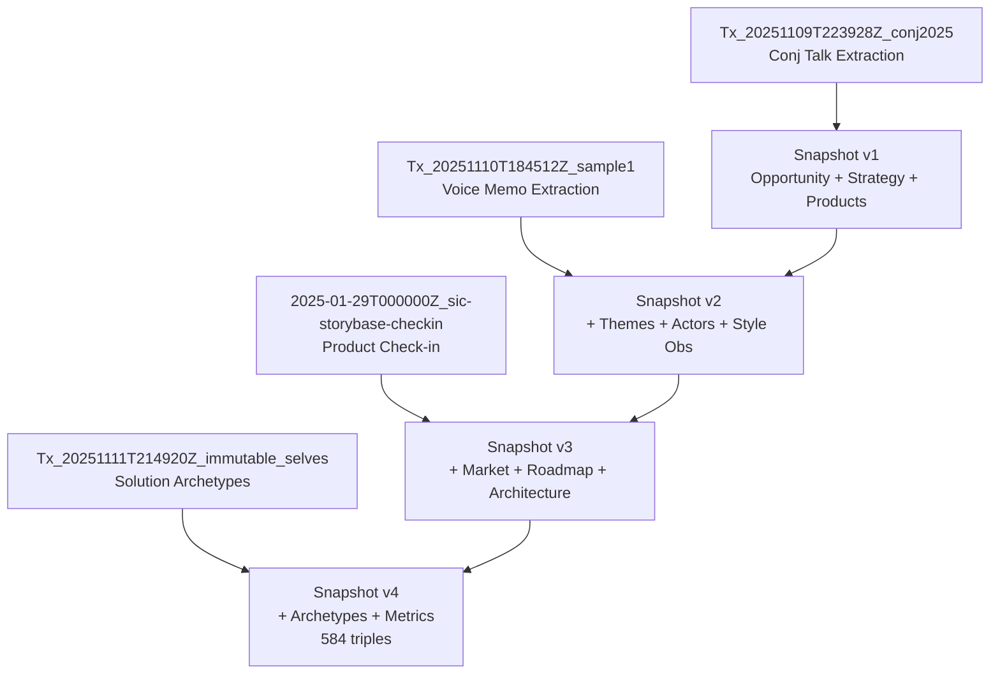
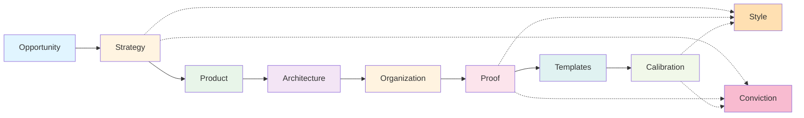
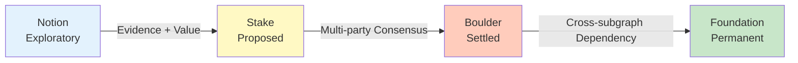

# storyBASE State & Architecture

## State

The storyBASE is an operational RDF knowledge graph implementing a **Narrative Architecture** framework for Synthetic Identity Co. (SIC). It currently holds **584 triples** across **4 transactions**, encoding:

- **Product strategy** for storyBASE (AI memory platform) and related identity systems[^1]
- **Style taxonomy** with rubric-based evaluation for narrative consistency[^2]
- **Conviction levels** (Notion → Stake → Boulder → Foundation) for claim governance[^3]
- **Sample extractions** from voice memos and transcripts, including a Clojure Conj 2025 talk proposal[^4]

The graph is **append-only**, with provenance tracked via `prov:wasGeneratedBy` linking each assertion to a timestamped transaction. The system is **Git-native**, enabling version control, branching, and collaborative narrative evolution[^5].

[^1]: From `storybase-market` opportunity node: "High-quality AI output requires extensive context; current models use search, but RDF-based narrative source of truth enables specific, controllable, versionable AI memory." (Transaction `2025-01-29T000000Z_sic-storybase-checkin`)

[^2]: Style rubric includes 9 dimensions: Register Fit, Phrasing, Cadence, Strategic Alignment, Tailoring, Resonance, Flow, Novelty, Accuracy. Each maps to SKOS concepts in the ontology (e.g., `#Rubric_Register` → `#RegisterFormality`, `#ToneVoice`).

[^3]: Conviction hierarchy encoded via `xkos:next`/`xkos:previous` relations: `#Conviction_Notion` → `#Conviction_Stake` → `#Conviction_Boulder` → `#Conviction_Foundation`. Used to govern decision cost and narrative drift.

[^4]: Four transactions: (1) Sample 1 narrative architecture extraction (`Tx_20251110T184512Z_sample1`), (2) Conj 2025 talk extraction (`Tx_20251109T223928Z_conj2025`), (3) SIC/storyBASE check-in (`2025-01-29T000000Z_sic-storybase-checkin`), (4) Solution archetypes for immutable identity (`Tx_20251111T214920Z_immutable_selves`).

[^5]: From `storybase-capabilities`: "Compile (replay transactions to Turtle snapshot), extract (RDF from input), diff (semantic comparison), tx (propose transaction), commit (append-only to Git)."

---

## Stories

### `/README.story`
**Intent:** Auto-generated repository README tracking storyBASE state, stories, assets, and transactions.  
**Relationship:** Meta-narrative; documents the graph itself for external readers.  
**Approach:** Compile current snapshot statistics, enumerate `.story` files, summarize transaction log, and generate Mermaid diagrams showing graph topology and transaction flow.

---

### `/presenter.story`
**Intent:** IA Presenter template demonstrating storyBASE presentation capabilities.  
**Relationship:** Template artifact; shows how narrative content flows into slide decks with speaker notes and citations.  
**Approach:** Use as reference format for other presentations; demonstrates separation of content (script), structure (slides), and design (themes) per storyBASE principles[^6].

[^6]: Aligns with Product Ladder: Primitives (text/images) → Interfaces (Markdown syntax) → Behaviors (slide navigation) → Flows (presentation sequence) → Narratives (talk arc) → Offerings (exportable deck).

---

### `/conj-talk-2025.story`
**Intent:** Generate Clojure Conj 2025 talk "Immutable Selves" using IA Presenter format.  
**Relationship:** Proof artifact; demonstrates storyBASE's ability to compile technical narrative from graph state into presentation.  
**Approach:** 
1. Extract **personal journey** from `Actor_ScarletDame` (Dylan Butman → Scarlet Spectacular)[^7]
2. Present **identity model** from `Theme_ImmutableIdentity` and `Theme_TransitionAsStateChange`[^8]
3. Critique **mutable identity** via `ProblemContext_1` and `ProblemContext_2`[^9]
4. Map **Clojure principles** to identity systems via `Strategy_functional-immutable-identity`[^10]
5. Show **case studies**: Vouch.io (`product-vouch-io`) and SIC (`product-sic`)[^11]
6. Cite all claims with footnotes to storyBASE nodes, explaining context per `#CitationConventions`[^12]

[^7]: `Actor_ScarletDame` has `skos:altLabel` "Dylan Butman" and "Scarlet Spectacular"; `skos:note` states "Speaker's identity history exemplifies append-only log model."

[^8]: `Theme_ImmutableIdentity`: "Human and system identity modeled as integral of snapshots over time, not mutable present state." `Theme_TransitionAsStateChange`: "Personal transition (gender, professional) as functional transformation from immutable past states."

[^9]: `ProblemContext_1`: "Passwords and digital keys are mutable, siloed, and vulnerable; no single source of truth for privileges." `ProblemContext_2`: "AI models are black boxes; persona prompts mutate rendered state; no provenance or version control for AI identity."

[^10]: `strategy-functional-immutable-identity`: "Applies Clojure principles (immutability, explicit state, functional composition, data-first design, knowledge graphs) to create trustworthy identity systems."

[^11]: `product-vouch-io`: "Enterprise identity platform using immutable event logs and delegation chains" (past work, strategic advisor). `product-sic`: "AI memory company using narrative-driven knowledge graphs to create AI individuals with deterministic individuality and provenance" (current work, founder).

[^12]: `#CaretBracketMarker`: "Inline caret with brackets to denote notes/citations." `#FactualAccuracy`: "Correctness of facts, names, titles, and referenced data" (related to `#Proof`, `#TechnicalDocumentation`).

---

## Assets

```
.
├── .storyBASE/                          # Transaction log directory
│   ├── 1762728019add_conj_talk_2025_extraction.sparql
│   ├── 1762731465sic-storybase-checkin.sparql
│   ├── 1762800383add_sample1_narrative_architecture.sparql
│   ├── 1762897917add_solution_archetypes.sparql
│   └── 1762897917add_style_metrics.sparql
├── README.story                         # This document's generator
├── presenter.story                      # IA Presenter template reference
├── conj-talk-2025.story                 # Conj talk generator
└── [compiled snapshot.ttl]              # Turtle RDF (584 triples, 1 graph)
```

**`.storyBASE/` directory:** Append-only transaction log; each `.sparql` file is an `INSERT DATA` operation with provenance metadata[^13].  
**`.story` files:** YAML front matter + prompt; trigger story generation via GitHub Actions or MCP server[^14].  
**Snapshot:** Compiled Turtle file; replay of sorted transactions; serves as AI memory context[^15].

[^13]: Each transaction includes `prov:wasGeneratedBy`, `prov:wasAttributedTo` (user), `prov:wasAssociatedWith` (agent), `prov:generatedAtTime`, `sb:originPath`, `sb:originRef`.

[^14]: From `storybase-capabilities`: "story generation (YAML front matter + prompt to model outputs)." Triggered by `.story` file changes or transaction commits.

[^15]: From `data-lifecycle-storybase`: "Append-only transaction log; immutable files; snapshot = replay of sorted transactions; provenance in TX step."

---

## Transactions

### 1. `Tx_20251109T223928Z_conj2025` (2025-11-09)
**Significance:** First extraction for Conj Talk 2025 proposal.  
**Content:** Captures narrative architecture (Opportunity, Strategy, Product, Proof, Architecture, Organization), 11 style observations, 4 rubric assessments, and style metrics for the talk proposal[^16].  
**Impact:** Establishes **Vouch.io** and **SIC** as dual case studies; defines **functional immutable identity architecture** strategy; sets rubric baseline (Clarity 4.5/5, Technical Depth 4.8/5, Narrative Coherence 4.6/5)[^17].

[^16]: Sample record `conj-talk-2025-extraction` has `inputLength` 3421 characters. Includes `opportunity-identity-vulnerability`, `strategy-functional-immutable-identity`, `product-vouch-io`, `product-sic`, `proof-conj-2025-talk`, `architecture-immutable-identity`, `org-sic`, `org-vouch-io`.

[^17]: Rubric scores: `rubric-clarity` 4.5, `rubric-technical-depth` 4.8, `rubric-narrative-coherence` 4.6, `rubric-audience-engagement` 4.3. Style metrics: avg sentence length 22.4, technical density 0.68, active voice ratio 0.71.

---

### 2. `Tx_20251110T184512Z_sample1` (2025-11-10)
**Significance:** Extracts narrative architecture from voice memo "Punch talk conceptual framing."  
**Content:** Defines **Theme_ImmutableIdentity** and **Theme_TransitionAsStateChange**; captures **Actor_ScarletDame** and **Actor_LukeVanderhart**; records 6 style observations (brand stylization, idiolect, metaphor, analogy, cadence, POV) and 9 rubric assessments[^18].  
**Impact:** Establishes **personal transition as state machine** analogy; links identity theory to UI rendering patterns (Om, React); sets conversational register baseline (4.0/5) and strategic alignment (4.5/5)[^19].

[^18]: Sample `Sample_1` has `inputLength` 11800, `dct:created` 2025-01-15. Style observations include `StyleObs_storyBASE` (CamelCase brand), `StyleObs_AppendOnlyLog` (recurring technical phrase), `StyleObs_UIStateMachine` (core analogy), `StyleObs_TransitionAnalogy` (extended analogy), `StyleObs_ShortClause` (punchy cadence), `StyleObs_FirstPerson` (conversational register).

[^19]: Rubric: Register 4.0 ("Conversational, personal; active voice; fits talk/oratory context"), Phrasing 3.5 ("Idiolect present; some repetition"), Cadence 3.0 ("Variable; punchy clauses mixed with run-ons"), Strategic Alignment 4.5 ("Directly advances narrative architecture thesis"), Resonance 4.5 ("Personal transition story as analogy for immutable state; emotionally grounded").

---

### 3. `2025-01-29T000000Z_sic-storybase-checkin` (2025-11-09)
**Significance:** Product & strategy check-in; most comprehensive transaction (18,437 input characters).  
**Content:** Defines **storyBASE market opportunity**, **timing thesis** (2024-2026 window), **positioning thesis** (extend software rigor into strategy/content), **moat leverage** (Git-native AI memory), **mission**, **tagline** ("AI that tells you a story as written"), **product overview**, **modules/capabilities**, **dependencies/integrations**, **roadmap**, **system topology**, **data model lifecycle**, **integration points**, **role topology**, **process**, **case studies**, 10 style observations, 9 rubric assessments, and style metrics[^20].  
**Impact:** Establishes **storyBASE as product**; defines **n8n + MCP + GitHub + Open WebUI** architecture; sets **narrative-driven roadmap** (TriG, SHACL, individuation pipeline, marketplace); records conversational register (3.5/5) with high jargon density (0.18) and active voice (0.72)[^21].

[^20]: Sample `2025-01-29T000000Z_sic-storybase-checkin` attributed to `scarlet-dame`. Includes `opportunity/storybase-market`, `thesis/timing-storybase`, `thesis/positioning-storybase`, `leverage/moat-storybase`, `mission/storybase`, `tagline/storybase`, `product/overview-storybase`, `module/storybase-capabilities`, `dependency/storybase-integrations`, `roadmap/narrative-storybase`, `architecture/topology-storybase`, `model/data-lifecycle-storybase`, `integration/points-storybase`, `topology/role-storybase`, `process/storybase`, `case/studies-storybase`.

[^21]: Roadmap: "Move transactions from SPARQL to named graphs (TriG); add SHACL validation; implement evolved individuation pipeline (snapshot + message to transaction); file ingestion via GitHub; storyBASE marketplace; cost pass-through billing." Style metrics: avg sentence length 35.2, active voice 0.72, jargon density 0.18, type-token ratio 0.42. Rubric: Register 3.5, Strategic Alignment 4.0, Accuracy 4.0.

---

### 4. `Tx_20251111T214920Z_immutable_selves` (2025-11-11)
**Significance:** Adds **solution archetypes** for immutable identity systems.  
**Content:** Defines two archetypes: (1) **berecognized.id** (Datomic-based proof-of-provenance identity) and (2) **aswritten.ai** (RDF+Git-based immutable AI identity). Each includes title, problem context, approach pattern, required capabilities, and outcomes/proof[^22].  
**Impact:** Formalizes **SSoT → query → render → event → log → recompile** pattern; contrasts Datomic (Clojure ecosystem) vs. RDF+Git (semantic web) stacks; establishes **cryptographic proof of identity state** as outcome metric; adds style metrics (avg sentence length 15.2, active voice 0.85, jargon density 0.12)[^23].

[^22]: `Archetype_1` (berecognized.id): `ProblemContext_1` "Passwords and digital keys are mutable, siloed, and vulnerable", `ApproachPattern_1` "SSoT (Datomic) → datalog query → render to identification/privileges → event-driven transactions → append-only log → recompile", `RequiredCapabilities_1` "Datomic (SSoT), datalog (query), multimodal renderer, event system, single transactor", `OutcomesProof_1` "Proof of provenance and authority innate; hash of last tx + SSoT state enables 'be recognized' property." `Archetype_2` (aswritten.ai): `ProblemContext_2` "AI models are black boxes; persona prompts mutate rendered state; no provenance or version control for AI identity", `ApproachPattern_2` "SSoT (RDF + git) → SPARQL query → render to AI memory/identity → event-driven transactions → append-only log → recompile", `RequiredCapabilities_2` "RDF graph, git versioning, SPARQL, multimodal renderer, event system, transactor."

[^23]: `StyleMetrics_1`: avg sentence length 15.2, active voice ratio 0.85, jargon density 0.12, type-token ratio 0.68, conciseness 0.78. Note: "Short sentences, high active voice, moderate jargon (technical audience), good lexical diversity, concise."

---

## Diagrams

### Transaction Flow


### Narrative Architecture Topology


### Conviction Escalation Path
