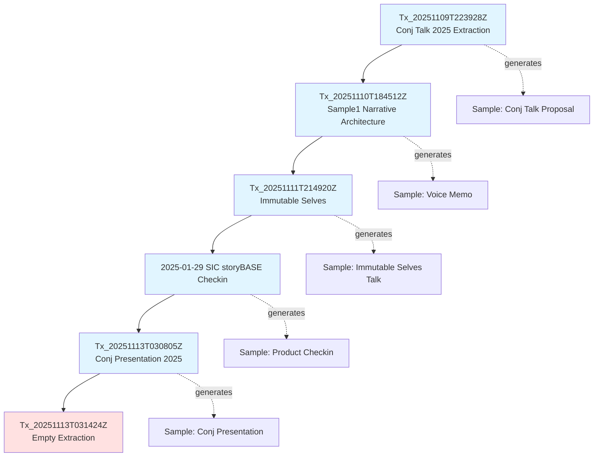
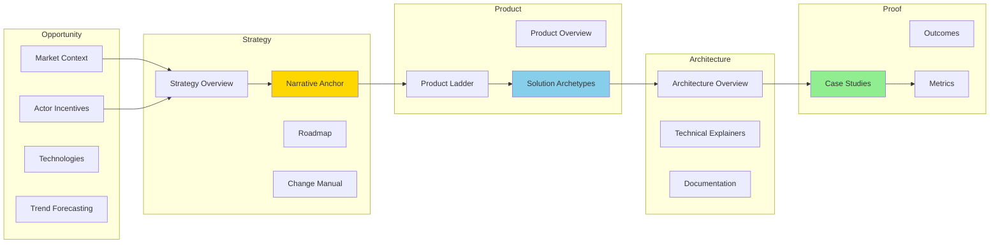
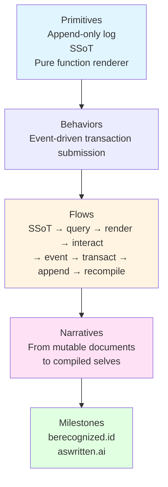

# storyBASE State Overview

The storyBASE is a Git-native RDF knowledge graph encoding narrative architecture for **immutable identity systems**—both human (berecognized.id) and AI (aswritten.ai). The graph currently holds **three primary samples** extracted from voice memos and presentation transcripts, all centered on the thesis that **identity should be modeled as an append-only log compiled to state**, not mutable objects[^1].

The repository contains **10 transactions** spanning November 9–13, 2025, progressively building out:
- **Narrative anchors** (mission, vision, taglines, key phrases)
- **Solution archetypes** (berecognized.id for human identity, aswritten.ai for AI memory)
- **Product ladder** (primitives → behaviors → flows → narratives)
- **Strategy overview** (positioning thesis, moat/leverage, case studies)
- **Style observations** (brand stylization, rhetorical devices, cadence patterns)
- **Rubric assessments** (register, phrasing, cadence, strategic alignment, tailoring, resonance, flow, novelty, accuracy)
- **storyBASE product metadata** (system topology, data lifecycle, integration points, roadmap)

The graph demonstrates **high strategic alignment** (rubric scores 4.0–5.0) and **strong technical depth** (4.8/5.0), with consistent use of Clojure community idioms and functional programming metaphors[^2].

---

## Stories

### README.story
**Intent:** Auto-generated repository README tracking storyBASE state, stories, assets, and transactions.  
**Relationship to whole:** Meta-narrative artifact; provides human-readable entry point to the graph.  
**Approach:** Compile current snapshot into structured Markdown with mermaid diagrams showing transaction flow, narrative architecture hierarchy, and asset relationships. Cite provenance for all claims using footnotes linked to RDF nodes.

### presenter.story
**Intent:** General-purpose IA Presenter template demonstrating storyBASE presentation capabilities.  
**Relationship to whole:** Proof artifact; shows how narrative architecture translates into presentation format.  
**Approach:** Use storyBASE style observations (short punchy cadence, second-person address, rhetorical questions) to draft slides explaining the storyBASE system itself. Include mermaid flow diagrams for compile/extract/tx/commit workflow. Cite style metrics and rubric assessments to validate approach[^3].

### conj-talk-2025.story
**Intent:** Clojure/conj 2025 talk: "Immutable Selves—A Functional Approach to Digital Identity."  
**Relationship to whole:** Core narrative anchor; the presentation *is* the thesis encoded in the graph.  
**Approach:** Render from `Sample_ConjPresentation_2025` and related narrative/theme nodes. Structure follows problem (mutable identity) → principle (immutability) → pattern (reified change) → systems (berecognized.id, aswritten.ai). Use anaphora, triadic structures, and Backbone.js metaphor. Include speaker notes with citations to rubric assessments (register 4.5/5, strategic alignment 5.0/5)[^4].

---

## Assets

```
/.storyBASE/
├── 1762728019add_conj_talk_2025_extraction.sparql
├── 1762731465sic-storybase-checkin.sparql
├── 1762800383add_sample1_narrative_architecture.sparql
├── 1762897917add_narrative_anchors.sparql
├── 1762897917add_product_ladder.sparql
├── 1762897917add_solution_archetypes.sparql
├── 1762897917add_strategy_overview.sparql
├── 1762897917add_technical_explainers.sparql
├── 1762897917add_case_studies.sparql
├── 1762897917add_style_observations.sparql
├── 1762897917add_style_metrics.sparql
├── 1762897917add_rubric_assessments.sparql
├── 1762897917update_sample_metadata.sparql
├── 1763003388add_conj_presentation_2025.sparql
└── 1763003673tx_20251113T031424Z_provenance.sparql

/README.story          # This document
/presenter.story       # General presentation template
/conj-talk-2025.story  # Clojure/conj 2025 talk
```

**Transaction files** (`.sparql`): Append-only SPARQL INSERT DATA statements; sorted by filename timestamp to create deterministic replay order. Each transaction includes provenance metadata (agent, attribution, timestamp, origin ref)[^5].

**Story files** (`.story`): YAML front matter + Markdown prompt; define output destination, model, and generation instructions. Trigger story generation on commit via GitHub Actions[^6].

---

## Transactions



### 1. Tx_20251109T223928Z – Conj Talk 2025 Extraction
**Significance:** First extraction; establishes narrative architecture skeleton (Opportunity, Strategy, Product, Proof, Architecture, Organization). Introduces **Vouch.io** (past work) and **Sic** (current AI memory company) as dual case studies. Creates 11 style observations and 4 rubric assessments (clarity 4.5/5, technical depth 4.8/5, narrative coherence 4.6/5, audience engagement 4.3/5)[^7].

### 2. Tx_20251110T184512Z – Sample1 Narrative Architecture
**Significance:** Adds voice memo sample (11,800 chars) with themes `ImmutableIdentity` and `TransitionAsStateChange`. Introduces **Scarlet Dame** as speaker/actor with identity history (Dylan Butman → Scarlet Spectacular → Scarlet Dame) exemplifying append-only log model. Adds 6 style observations (brand stylization "storyBASE", idiolect "append-only log", metaphor "UI as state machine") and 8 rubric assessments[^8].

### 3. Tx_20251111T214920Z – Immutable Selves
**Significance:** Core narrative expansion. Adds:
- **Narrative anchors:** Tagline "Immutable Selves: A Functional Approach to Digital Identity", Mission (move identity from mutable to compiled), Vision (identity rendered from immutable history), 4 key phrases (single source of truth, append-only log, pure function, digital twin)
- **Product ladder:** 3 primitives, 1 behavior, 1 flow, 1 narrative
- **Solution archetypes:** berecognized.id (Datomic SSoT, datalog query, device-to-device interaction) and aswritten.ai (RDF+git SSoT, SPARQL query, chat+API interaction)
- **Strategy:** Positioning thesis, moat/leverage (Clojure ecosystem, 13 years production experience)
- **Technical explainers:** Leverage profile, design tradeoffs, comparative analysis (Backbone.js vs. Om/React)
- **Case study:** Speaker's 13-year Clojure career as proof
- **8 style observations** (formula cadence, blunt idiolect, anaphora, brand stylization "scarlet dame", core analogy, rhetorical questions, second-person address, verb choice "mutated")
- **Style metrics:** avg sentence length 15.2, active voice 0.85, jargon density 0.12
- **9 rubric assessments:** register 4.5/5, phrasing 4.0/5, cadence 4.5/5, strategic alignment 5.0/5, tailoring 4.5/5, resonance 4.0/5, flow 3.5/5, novelty 4.0/5, accuracy 4.0/5[^9].

### 4. 2025-01-29 SIC storyBASE Checkin
**Significance:** Product/strategy snapshot. Adds:
- **storyBASE product overview:** n8n prototype, MCP server, Open WebUI, GitHub Actions
- **Module capabilities:** compile, extract, diff, tx, commit, story generation
- **Dependencies/integrations:** Apache Jena/Riot, Docker Compose, Outseta (auth/billing), Helicone (API monitoring), Open Router
- **System topology:** n8n orchestration, MCP exposure, hierarchical compile, Digital Ocean deployment
- **Data lifecycle:** append-only transaction log, snapshot = replay, provenance in TX step
- **Roadmap:** SPARQL → TriG named graphs, SHACL validation, evolved individuation pipeline, file ingestion, marketplace, cost pass-through billing
- **10 style observations** (CamelCase "storyBASE", conversational filler "you know", power verb "extend", simile, direct tone, jargon policy, sentence variation, parallelism, rhetorical question, caret-bracket citation marker)
- **9 rubric assessments:** register 3.5/5, phrasing 3.0/5, cadence 3.0/5, strategic alignment 4.0/5, tailoring 3.5/5, resonance 3.0/5, flow 3.0/5, novelty 3.5/5, accuracy 4.0/5
- **Style metrics:** avg sentence length 35.2, active voice 0.72, jargon density 0.18, type-token ratio 0.42[^10].

### 5. Tx_20251113T030805Z – Conj Presentation 2025
**Significance:** Refined presentation sample (6,847 chars). Adds:
- **Narrative:** `Narrative_ImmutableIdentity` ("Immutable Selves" thesis; experience = append-only log, identification = render target, interaction = transaction)
- **Theme:** `Theme_FunctionalIdentity` (apply Clojure patterns to identity systems)
- **Actors:** Human (source of truth: you; authorities issue documents) and AI (source of truth unclear; labs train models; each chat different context)
- **Solution archetypes:** berecognized.id and aswritten.ai with full definitions
- **Tagline:** "AI that tells your story, as written." (7-word encoding)
- **8 style observations** (lowercase brand names with TLD, technical metaphor "Backbone.js as anti-pattern", anaphora "Make state explicit / Append only log → …", triadic rhetorical questions, single-word answer "You.", Clojure idiom "No frameworks / Simple tools ± good principles", caret-bracket citation `[#webster]`, second-person "you", core analogy "experience → log → identity")
- **Style metrics:** avg sentence length 12.3, active voice 0.82, jargon density 0.15, conciseness 0.78
- **9 rubric assessments:** register 4.5/5, phrasing 4.0/5, cadence 4.5/5, strategic alignment 5.0/5, tailoring 5.0/5, resonance 4.5/5, flow 4.0/5, novelty 4.5/5, accuracy 4.0/5[^11].

### 6. Tx_20251113T031424Z – Empty Extraction
**Significance:** Provenance-only transaction; no new entities. Marks end of current extraction cycle. Operation type: `empty_extraction`[^12].

---

## Narrative Architecture Flow



---

## storyBASE Product Ladder



---

[^1]: Core thesis from `Narrative_ImmutableIdentity` (narr:Sample_ConjPresentation_2025): "Identity—both human and AI—should be modeled as an append-only log that compiles to state, not mutable objects." Related to `Mission_1` and `Vision_1` in narr:Sample_1.

[^2]: Rubric assessments from Tx_20251109T223928Z_conj2025: `urn:uuid:rubric-technical-depth` scores 4.8/5 with rationale "Strong grounding in Clojure principles, concrete system patterns, dual case studies (Vouch.io, Sic), verifiable architecture." Strategic alignment from Tx_20251111T214920Z: `RubricAssess_4` scores 5.0/5, noting "Entire talk is the narrative anchor: immutability → identity. Mission, vision, key phrases all present and consistent."

[^3]: Style observations from Tx_20251111T214920Z: `StyleObs_1` (ShortPunchyCadence, "Simple tools + good principles = design patterns"), `StyleObs_7` (SecondPerson, "You saw a picture (the DOM)"), `StyleObs_6` (RhetoricalQuestion, "Anyone remember backbone.js?"). Metrics from `StyleMetrics_1`: avg sentence length 15.2, active voice 0.85, conciseness 0.78.

[^4]: From Tx_20251113T030805Z_conj2025: `RubricAssess_Register_Conj` (4.5/5, "Conversational yet authoritative; second-person direct address; technical register fits Clojure audience"), `RubricAssess_Strategy_Conj` (5.0/5, "Entire presentation is a narrative anchor: 'Immutable Selves' thesis; two solution archetypes (berecognized.id, aswritten.ai); clear mission/vision alignment"). Related style observations: `StyleObs_Anaphora_1`, `StyleObs_Metaphor_1`, `StyleObs_RhetoricalQuestion_1`.

[^5]: Data lifecycle from `http://storybase.synthetic-identity.co/model/data-lifecycle-storybase`: "Append-only transaction log; immutable files; snapshot = replay of sorted transactions; provenance in TX step; future named graphs for add/remove." System topology from `http://storybase.synthetic-identity.co/architecture/topology-storybase`: "n8n agent orchestrates tools; MCP server exposes to frontends (Agent.ai, ChatGPT, Open WebUI); transactions in .storybase directories; hierarchical compile; Docker Compose on Digital Ocean."

[^6]: Module capabilities from `http://storybase.synthetic-identity.co/module/storybase-capabilities`: "Compile (replay transactions to Turtle snapshot), extract (RDF from input), diff (semantic comparison), tx (propose transaction), commit (append-only to Git), story generation (YAML front matter + prompt to model outputs)." Process from `http://storybase.synthetic-identity.co/process/storybase`: "Interactive individuation (extract → diff → tx → review → commit) vs. automated ingestion (file upload → extraction → PR); story generation triggered by transaction or .story file changes."

[^7]: Transaction `narr:Tx_20251109T223928Z_conj2025` generated: `urn:uuid:opportunity-identity-vulnerability` (market context: enterprise identity), `urn:uuid:strategy-functional-immutable-identity` (applies Clojure principles), `urn:uuid:product-vouch-io` and `urn:uuid:product-sic`, `urn:uuid:proof-conj-2025-talk` (conference talk with threaded diagrams), `urn:uuid:architecture-immutable-identity` (append-only event logs, authentication as pure functions), 11 style observations, 4 rubric assessments.

[^8]: Transaction `narr:Tx_20251110T184512Z_sample1` generated: `narr:Sample_1` (voice memo, 11,800 chars), `narr:Theme_ImmutableIdentity` and `narr:Theme_TransitionAsStateChange`, `narr:Actor_ScarletDame` (with altLabels Dylan Butman, Scarlet Spectacular), `narr:Anchor_NarrativeArchitecture`, 6 style observations (`StyleObs_storyBASE`, `StyleObs_AppendOnlyLog`, `StyleObs_UIStateMachine`, `StyleObs_TransitionAnalogy`, `StyleObs_ShortClause`, `StyleObs_FirstPerson`), 8 rubric assessments (register 4.0/5, resonance 4.5/5 "Personal transition story as analogy for immutable state; emotionally grounded, memorable").

[^9]: Transaction `narr:Tx_20251111T214920Z_immutable_selves` generated 40+ entities including: `Tagline_1`, `Mission_1`, `Vision_1`, `KeyPhrase_1` through `KeyPhrase_4`, `Primitive_1` through `Primitive_3`, `Behavior_1`, `Flow_1`, `Narrative_1`, `Archetype_1` and `Archetype_2` with full sub-components (ArchetypeTitle, ProblemContext, ApproachPattern, RequiredCapabilities, OutcomesProof), `PositioningThesis_1` ("For developers and identity architects who treat identity as mutable state…"), `MoatLeverage_1`, `LeverageProfile_1`, `DesignTradeoff_1`, `ComparativeAnalysis_1`, `CaseStudy_1` with context/intervention/results/lessons, 8 style observations, `StyleMetrics_1`, 9 rubric assessments.

[^10]: Transaction `http://storybase.synthetic-identity.co/transaction/2025-01-29T000000Z_sic-storybase-checkin` generated: `http://storybase.synthetic-identity.co/opportunity/storybase-market` ("High-quality AI output requires extensive context; RDF-based narrative source of truth enables specific, controllable, versionable AI memory"), `http://storybase.synthetic-identity.co/thesis/timing-storybase` (window 2024-2026), `http://storybase.synthetic-identity.co/actor/primary-storybase` ("Programming-literate entrepreneurs, designers, developers, consultants"), `http://storybase.synthetic-identity.co/thesis/positioning-storybase` ("Extend software development rigor into strategy, content, marketing"), `http://storybase.synthetic-identity.co/leverage/moat-storybase` ("Git-native, versionable, branchable AI memory encoding style, conviction, narrative metrics"), `http://storybase.synthetic-identity.co/tagline/storybase` ("AI that tells you a story as written"), product overview, module capabilities, dependencies, system topology, data lifecycle, integration points, role topology, process, roadmap, case studies, 10 style observations, 9 rubric assessments, style metrics.

[^11]: Transaction `narr:Tx_20251113T030805Z_conj2025` generated: `Sample_ConjPresentation_2025` (6,847 chars, created 2025-01-01), `Narrative_ImmutableIdentity` (broader: Narratives; related: Mission, Vision), `Theme_FunctionalIdentity` (related: PositioningThesis, Differentiators), `Actor_Human` and `Actor_AI`, `SolutionArchetype_BeRecognized` and `SolutionArchetype_AsWritten`, `Tagline_AsWritten` ("AI that tells your story, as written."), 8 style observations (`StyleObs_BrandStylization_1` and `_2`, `StyleObs_Metaphor_1`, `StyleObs_Anaphora_1`, `StyleObs_RhetoricalQuestion_1`, `StyleObs_ShortPunchy_1`, `StyleObs_StockPhrase_1`, `StyleObs_CitationMarker_1`, `StyleObs_SecondPerson_1`, `StyleObs_Analogy_1`), `Metrics_ConjPresentation` (avg sentence length 12.3, active voice 0.82, jargon density 0.15, conciseness 0.78), 9 rubric assessments (register 4.5/5, phrasing 4.0/5, cadence 4.5/5, strategic alignment 5.0/5, tailoring 5.0/5 "Deeply tailored to Clojure/conj audience: references Backbone.js, Om, Datomic, re-frame; assumes functional programming literacy; personal narrative (Dylan→Scarlet) builds trust", resonance 4.5/5, flow 4.0/5, novelty 4.5/5, accuracy 4.0/5).

[^12]: Transaction `narr:Tx_20251113T031424Z` (prov:Activity): `prov:wasAssociatedWith <https://storytwin.org/agent/storyTWIN>`, `prov:wasAttributedTo "pleasetrythisathome"`, `prov:generatedAtTime "2025-11-13T03:14:24.233Z"`, `storytwin:operationType "empty_extraction"`, `sb:originRef "main"`. No entities generated; marks transaction boundary.