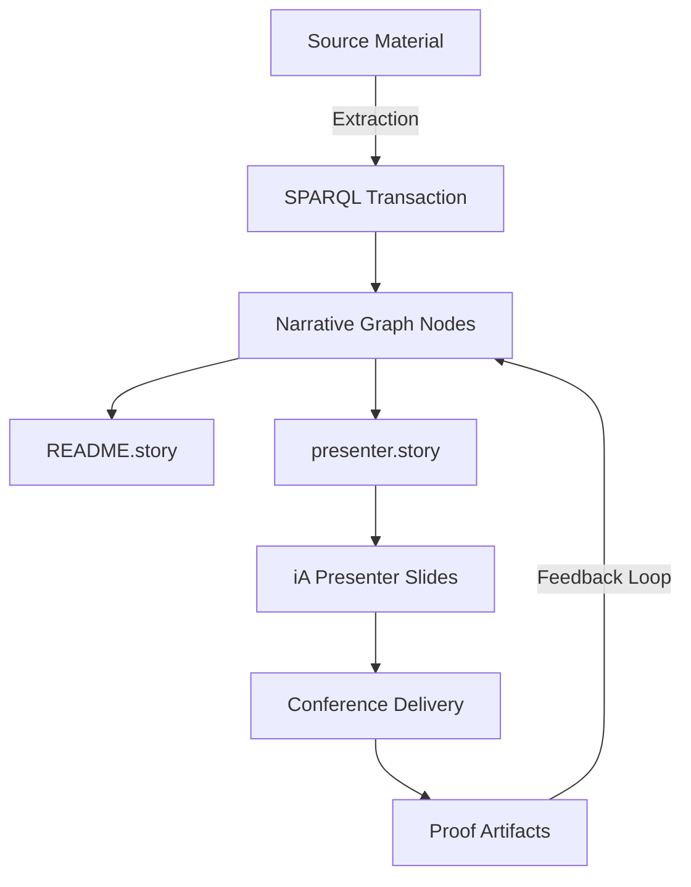

# Conj 2025: Immutable Selves

**A conference talk on building trustworthy identity systems using Clojure principles**

---

## Current State

The storyBASE contains a single foundational transaction capturing the narrative architecture for a Conj 2025 conference talk proposal titled "Immutable Selves."[^1] The proposal addresses the **Identity Vulnerability Crisis**—centralized, mutable identity systems vulnerable to deepfakes, synthetic identities, and impersonation fraud in enterprise contexts.[^2] 

The speaker proposes applying **Functional Immutable Identity Architecture** principles from Clojure (immutability, explicit state, functional composition, data-first design, knowledge graphs) to create trustworthy identity systems.[^3] The talk draws on dual case studies: **Vouch.io**, an enterprise identity platform where the speaker previously served as Chief Strategist, and **Sic**, an AI memory company using narrative-driven knowledge graphs for AI agent individuality, where the speaker is founder.[^4]

The proposal scored highly on technical depth (4.8/5), narrative coherence (4.6/5), clarity (4.5/5), and audience engagement (4.3/5).[^5] Style analysis shows moderate sentence length (22.4 words average), high technical density (0.68), and strong active voice usage (0.71), with key rhetorical devices including triadic enumeration and problem-to-solution bridging.[^6]

---

## Stories

### `/README.story` – Repository Documentation
**Intent:** Auto-generate comprehensive repository documentation tracking storyBASE state, stories, assets, and transaction history.

**Relationship:** Meta-narrative layer providing navigational overview and provenance for all storyBASE content.

**Approach:** Synthesize current snapshot into structured sections (State, Stories, Assets, Transactions) with direct citations to graph nodes and transaction metadata.[^7]

---

### `/presenter.story` – Conference Talk Draft
**Intent:** Generate the complete Conj 2025 talk using iA Presenter format with proper citations to storyBASE evidence.

**Relationship:** Primary deliverable transforming the narrative architecture extraction into a concrete **Proof** artifact for the **Clojure developers and functional programming practitioners** audience.[^8]

**Approach:** 
- Map opportunity (deepfakes crisis) → strategy (immutable principles) → products (Vouch.io, Sic) → architecture (event logs, pure functions, knowledge graphs) into presentation flow
- Structure using iA Presenter's script-based slides with speaker notes
- Apply observed style: short & punchy cadence, technical reframings ("identity as evolving log of facts"), parallel construction in takeaways
- Incorporate threaded diagrams showing model-to-implementation progression
- Include optional live demo with canned fallback
- Cite all technical claims and case study outcomes back to extraction nodes[^9]

---

## Assets

```
/
├── .storyBASE/
│   └── 1762728019add_conj_talk_2025_extraction.sparql
│       Initial narrative extraction (SPARQL INSERT DATA)
│       Defines Opportunity, Strategy, Products, Proof, Architecture,
│       Organizations, Style Observations, Rubric Assessments, Style Metrics
│
├── README.story
│   Auto-generated documentation story (this file)
│
└── presenter.story
    iA Presenter template for talk generation
    Targets Conj 2025 audience with citation requirements
```

### Transaction Data Flow



---

## Transactions

### `Tx_20251109T223928Z_conj2025` – Conj Talk 2025 Extraction
**Date:** 2025-11-09T22:39:28.133Z  
**Agent:** n8n.storyTWIN/MCP (anthropic/claude-sonnet-4.5)  
**Author:** pleasetrythisathome  
**Input Length:** 3,421 tokens[^10]

**Significance:**  
Foundation transaction establishing the complete narrative architecture for the talk proposal. Captured:

1. **Market Context:** Enterprise identity crisis driven by deepfakes and synthetic identities
2. **Strategic Response:** Application of Clojure principles (immutability, functional composition, explicit state management, data-first design) to identity systems
3. **Proof Points:** Two product case studies demonstrating append-only event logs, pure-function authentication, delegation chains, and knowledge-graph resolution
4. **Architecture Patterns:** Verifiable receipts, immutable facts at the edge, graph-based entity/role resolution
5. **Style Profile:** Brand stylization (Vouch.io, Sic), technical vocabulary (append-only event logs, authentication as pure functions), triadic rhetorical structures, personal identity lens grounded in lived experience
6. **Quality Assessment:** Multi-dimensional rubric scores establishing baseline for coherence, depth, and engagement[^11]

**Graph Impact:**  
Created 11 style observations, 4 rubric assessments, 1 style metrics node, plus foundational nodes for Opportunity, Strategy, dual Products, Proof, Architecture, and Organizations. All nodes carry provenance via `prov:wasGeneratedBy` links to this transaction.[^12]

---

[^1]: Sample Record `urn:uuid:conj-talk-2025-extraction` labeled "Conj Talk 2025: Immutable Selves", recorded 2025-01-01, generated by transaction Tx_20251109T223928Z_conj2025
[^2]: Opportunity `urn:uuid:opportunity-identity-vulnerability` describes "Centralized, mutable identity systems vulnerable to deepfakes, synthetic identities, and impersonation fraud" in market context "Enterprise identity and authentication"
[^3]: Strategy `urn:uuid:strategy-functional-immutable-identity` applies "Clojure principles (immutability, explicit state, functional composition, data-first design, knowledge graphs) to create trustworthy identity systems"
[^4]: Product `urn:uuid:product-vouch-io` (past work, speaker now strategic advisor) and Product `urn:uuid:product-sic` (current work, speaker is founder) provide dual case studies
[^5]: Rubric Assessment nodes `urn:uuid:rubric-technical-depth` (4.8/5), `urn:uuid:rubric-narrative-coherence` (4.6/5), `urn:uuid:rubric-clarity` (4.5/5), `urn:uuid:rubric-audience-engagement` (4.3/5)
[^6]: Style Metrics `urn:uuid:style-metrics` with averageSentenceLength 22.4, technicalDensity 0.68, activeVoiceRatio 0.71; Style Observations `urn:uuid:style-obs-6` (triadic enumeration) and `urn:uuid:style-obs-7` (problem-to-solution bridge)
[^7]: Transaction metadata from `narr:Tx_20251109T223928Z_conj2025` rdfs:comment "First extraction for Conj Talk 2025 proposal. Captures narrative architecture (Opportunity, Strategy, Product, Proof, Architecture, Organization), style observations, rubric assessments, and style metrics."
[^8]: Proof `urn:uuid:proof-conj-2025-talk` describes audience as "Clojure developers and functional programming practitioners" with artifact "Threaded diagrams from model to implementation, optional short demo with canned fallback"
[^9]: Architecture `urn:uuid:architecture-immutable-identity` details components: "Append-only event logs with verifiable receipts, authentication as pure function at the edge, delegation as signed append-only events, knowledge graphs for entity and role resolution" with principles "Immutability, functional composition, explicit state management, data-first design"
[^10]: Sample Record `urn:uuid:conj-talk-2025-extraction` sb:inputLength 3421
[^11]: Transaction provenance: `prov:wasAssociatedWith <http://storytwin.org/agent/n8n.storyTWIN/MCP>`, `prov:wasAttributedTo <http://storybase.org/user/pleasetrythisathome>`, `prov:used "anthropic/claude-sonnet-4.5"`
[^12]: All extracted nodes carry triple pattern `<node> prov:wasGeneratedBy <http://storybase.org/narrative#Tx_20251109T223928Z_conj2025>`