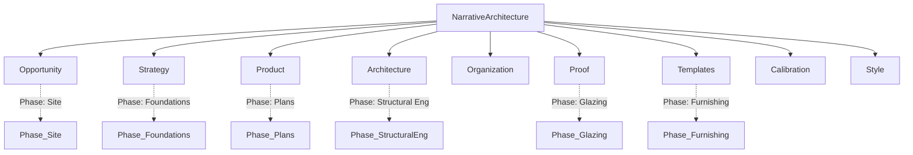

# storyBASE Repository — Current State

## State

The storyBASE graph is **empty**. No transactions have been recorded, no triples have been inserted, and the snapshot contains zero semantic data[^1]. The repository exists as a scaffolding of metadata and tooling, awaiting its first meaningful commit of narrative architecture knowledge.

[^1]: SNAPSHOT stats report `inserted: 0, deleted: 0` and warnings indicate "No transactions found in input."

---

## Stories

### `/README.story`
**Intent:** Generate a living document that tracks the evolution of the storyBASE repository—its graph state, active stories, asset inventory, and transaction history.

**Relationship to Whole:** Serves as the single source of truth for repository health and orientation. It is both a changelog and a roadmap indicator, ensuring that contributors and reviewers understand what exists, what is in flight, and what has changed.

**Approach from Current State:** Because the graph is empty, this README will document the *absence* of content as the baseline. When the first transaction populates the graph with nodes from the Narrative Architecture ontology—entities like `#Opportunity`, `#Strategy`, `#Product`, `#Proof`—the README will reflect those nodes, their relationships, and the rationale for their creation. Until then, it establishes the frame: the repository is initialized but unpopulated, and this document will evolve in lockstep with every commit that adds or modifies semantic triples.

---

## Assets

The repository currently holds **metadata and configuration artifacts** but no populated knowledge graph. Below is the structure as it stands:

```
/
├── README.story          # Story definition for this document
├── .story/               # (implied) story tooling & config
└── [ONTOLOGY]            # Narrative Architecture RDF schema (context only)
```

### Asset Descriptions

- **`/README.story`**  
  A `.story` file (YAML frontmatter + Markdown prompt) that instructs the `storyWRITER` agent to generate this README. It specifies `model: anthropic/claude-sonnet-4.5`, output destination `/`, and a template for summarizing state, stories, assets, and transactions.

- **Ontology (reference)**  
  The Narrative Architecture SKOS/RDF schema provided as context defines the vocabulary—top concepts (`Opportunity`, `Strategy`, `Product`, `Architecture`, `Organization`, `Proof`, `Templates`, `Calibration`, `Style`), their narrower concepts, and sequential implementation phases. This ontology is **not yet instantiated** in the graph; it exists as a blueprint awaiting data.



The diagram above shows the top-level concept scheme and its phased implementation model. No instances of these concepts are yet present in the snapshot.

---

## Transactions

**No transactions have been recorded.**[^2]

When the first transaction is committed—for example, asserting a `Market Context` node under `Opportunity` with properties like `TAM`, `Timing Thesis`, or `Segmentation`—this section will summarize:

- **Transaction ID** and timestamp  
- **Triples inserted** (subject, predicate, object)  
- **Significance:** What narrative question the transaction answers, which domain it populates, and how it advances the architecture's completeness  

Until then, the transaction log is silent, and the graph remains a blank slate awaiting its first story.

[^2]: SNAPSHOT warnings: "No transactions found in input. Provide items[0].json.transactions array or one item per transaction with json.query."

---

**Next Steps:**  
To populate storyBASE, commit transactions that instantiate concepts from the ontology—starting with `#Opportunity` (market context, actors, timing) and `#Strategy` (positioning, narrative anchor). Each transaction will be reflected here, building a traceable narrative architecture over time.