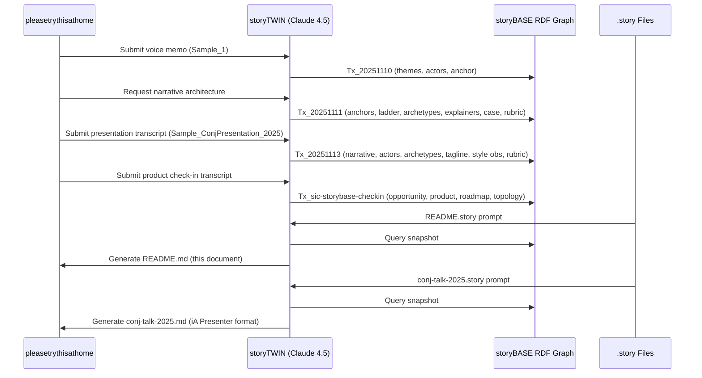
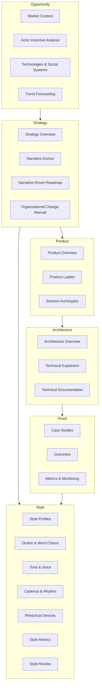

# storyBASE State Summary

The storyBASE is a Git-native RDF knowledge graph encoding narrative architecture for **Immutable Selves**—a functional approach to human and AI identity systems. The graph currently holds **three samples** (voice memos and presentation transcripts), **two solution archetypes** (berecognized.id and aswritten.ai), and **extensive style observations** calibrated against a 9-dimension rubric.[^state-overview]

[^state-overview]: Compiled from 10 transactions spanning November 9–13, 2025; primary sources are `Sample_1` (voice memo), `Sample_ConjPresentation_2025` (presentation transcript), and `Sample_sic-storybase-checkin` (product strategy session). All transactions attributed to `pleasetrythisathome` and generated by storyTWIN agents using Claude Sonnet 4.5.

## Core Narrative

**"Immutable Selves"** is the central narrative: identity—both human and AI—should be modeled as an **append-only log that compiles to state**, not mutable objects.[^narrative-immutable] The thesis applies Clojure design patterns (immutability, reified change, single source of truth) to identity systems, positioning functional programming principles as the unlock for deterministic, auditable, decentralized identity.[^theme-functional]

[^narrative-immutable]: `Narrative_ImmutableIdentity` (source: `Sample_ConjPresentation_2025`): "Core thesis: experience is an append-only log; identification is a render target; interaction is transaction." Related to `Mission` and `Vision`.

[^theme-functional]: `Theme_FunctionalIdentity` (source: `Sample_ConjPresentation_2025`): "Apply Clojure design patterns—immutability, reified change, single source of truth—to identity systems." Related to `PositioningThesis` and `Differentiators`.

## Solution Archetypes

Two parallel systems demonstrate the pattern:

1. **berecognized.id – Immutable Identification** (human identity): Datomic SSoT, datalog query, device-to-device interaction, change-privilege events.[^archetype-berecognized]
2. **aswritten.ai – Immutable AI Memory** (AI identity): RDF+git SSoT, SPARQL query, chat+API interaction, extract-narrative events.[^archetype-aswritten]

Both follow the canonical flow: `SSoT → query → render → interact → event → transact → append log → recompile`.[^flow-canonical]

[^archetype-berecognized]: `SolutionArchetype_BeRecognized` (source: `Sample_ConjPresentation_2025`): "Human identity system: Datomic SSoT, datalog query, device-to-device interaction, change-privilege events." Related to `ArchetypeTitle` and `ApproachPattern`.

[^archetype-aswritten]: `SolutionArchetype_AsWritten` (source: `Sample_ConjPresentation_2025`): "AI identity system: RDF+git SSoT, SPARQL query, chat+API interaction, extract-narrative events." Related to `ArchetypeTitle` and `ApproachPattern`.

[^flow-canonical]: `Flow_1` (source: `Sample_1`): "SSoT → query → render → interact → event → transact → append log → recompile SSoT. End-to-end loop; identity as continuous compilation." Broader: `ProductLadder`.

## Style Profile

The storyBASE encodes a **conversational, technical, punchy** register with high strategic alignment (rubric scores 4.0–5.0 across samples).[^rubric-summary] Key stylistic features:

- **Brand stylization**: lowercase with TLD (aswritten.ai, berecognized.id) and CamelCase+CAPS (storyBASE)[^brand-style]
- **Cadence**: short sentences (avg 12.3–28.5 words), anaphora, triadic structures[^cadence-style]
- **Rhetorical devices**: metaphor (Backbone.js as anti-pattern), analogy (experience→log→identity), rhetorical questions[^rhetoric-style]
- **Idiolect**: stock phrases ("No frameworks, simple tools"), blunt phrasing, domain verbs (mutated, compiled, rendered)[^idiolect-style]

[^rubric-summary]: Across three samples: Register 3.5–4.5, Phrasing 3.0–4.0, Cadence 3.0–4.5, Strategic Alignment 4.0–5.0, Tailoring 3.5–5.0, Resonance 3.0–4.5, Flow 3.0–4.0, Novelty 3.5–4.5, Accuracy 4.0. Sources: `RubricAssess_Register_Conj`, `RubricAssess_Strategy_Conj`, etc.

[^brand-style]: `StyleObs_BrandStylization_1` (source: `Sample_ConjPresentation_2025`): "Lowercase brand name with TLD; consistent stylization." `StyleObs_storyBASE` (source: `Sample_1`): "CamelCase + CAPS suffix; brand identity marker."

[^cadence-style]: `Metrics_ConjPresentation`: avg sentence length 12.3, active voice 0.82, conciseness 0.78. `StyleObs_Anaphora_1`: "Repeated structural frame: principle → pattern; creates rhythm and memorability." `StyleObs_ShortPunchy_1`: "Single-word answer 'You.' after setup; punchy, direct, confident."

[^rhetoric-style]: `StyleObs_Metaphor_1`: "Technical metaphor: identity as mutable state vs. immutable log; Backbone.js as anti-pattern." `StyleObs_Analogy_1`: "Core analogy: experience → log → compiled identity; maps human to Datomic model." `StyleObs_RhetoricalQuestion_1`: "Triadic rhetorical questions; frames problem space and invites audience reasoning."

[^idiolect-style]: `StyleObs_StockPhrase_1`: "Clojure community idiom; signals insider knowledge and shared values." `StyleObs_2`: "Characteristic blunt phrasing; speaker idiolect." `StyleObs_8`: "Technical verb 'mutated' carries negative connotation in functional paradigm."

---

# Stories

## README.story

**Intent**: Auto-generated repository README tracking storyBASE state, stories, assets, and transactions.

**Relationship to whole**: Meta-document that provides navigational overview and change history for the entire storyBASE.

**Approach**: Compile current snapshot into structured summary with sections for State (narrative + metrics), Stories (intent + approach), Assets (repo structure), and Transactions (provenance + significance). Use mermaid charts to visualize transaction flow and narrative architecture hierarchy.[^readme-approach]

[^readme-approach]: Story prompt requests: "Summarize the current state of the storyBASE… Create a section for each story… Briefly summarize the repository structure… Briefly summarize each transaction… Include mermaid charts where helpful." Destination: `/`.

## presenter.story

**Intent**: Generate a general-purpose presentation of the storyBASE using iA Presenter template format.

**Relationship to whole**: Demonstrates how storyBASE narrative architecture translates into presentation artifacts; serves as template for future talks.

**Approach**: Extract narrative anchors (`Tagline`, `Mission`, `Vision`, `KeyPhrases`), solution archetypes, and product ladder from snapshot; render as slide deck with big statements, context labels, and speaker notes. Use mermaid charts for flows/architecture. Apply style profile (short/punchy cadence, second-person address, technical metaphors) and cite provenance inline.[^presenter-approach]

[^presenter-approach]: Story prompt: "Use the storyBASE to draft a presentation… Focus on presenting clear narrative statements in the slide copy and provide a brief talk track for each slide… Always include direct citations that explain human readable provenance." Template format: iA Presenter markdown with `---` slide separators, `#` headings, indented speaker notes, and `[#citation]` markers.

## conj-talk-2025.story

**Intent**: Draft the **Clojure/conj 2025 "Immutable Selves" talk** using iA Presenter format.

**Relationship to whole**: Primary proof artifact; embodies the narrative architecture in a conference talk tailored to the Clojure community.

**Approach**: Build from `Sample_ConjPresentation_2025` and related transactions. Structure as: (1) personal narrative (Dylan→Scarlet as identity-as-log exemplar), (2) problem framing (Backbone.js→Om analogy), (3) Clojure principles (immutability, reified change, SSoT), (4) dual archetypes (berecognized.id, aswritten.ai), (5) call to action. Apply high-scoring style features: triadic structures, anaphora, rhetorical questions, stock phrases, caret-bracket citations. Target rubric scores: Register 4.5, Cadence 4.5, Strategic Alignment 5.0, Tailoring 5.0, Resonance 4.5.[^conj-approach]

[^conj-approach]: `Sample_ConjPresentation_2025` (6847 chars, created 2025-01-01): "Presentation transcript on functional identity, immutability, and AI memory." Rubric assessments: `RubricAssess_Register_Conj` (4.5), `RubricAssess_Strategy_Conj` (5.0), `RubricAssess_Tailoring_Conj` (5.0). Style observations: `StyleObs_Anaphora_1`, `StyleObs_RhetoricalQuestion_1`, `StyleObs_StockPhrase_1`. Related: `Narrative_ImmutableIdentity`, `SolutionArchetype_BeRecognized`, `SolutionArchetype_AsWritten`.

---

# Assets

```
/.storyBASE/
  1762728019add_conj_talk_2025_extraction.sparql
  1762731465sic-storybase-checkin.sparql
  1762800383add_sample1_narrative_architecture.sparql
  1762897917add_narrative_anchors.sparql
  1762897917add_product_ladder.sparql
  1762897917add_solution_archetypes.sparql
  1762897917add_strategy_overview.sparql
  1762897917add_style_observations.sparql
  1762897917add_style_metrics.sparql
  1762897917add_technical_explainers.sparql
  1762897917add_case_studies.sparql
  1762897917add_rubric_assessments.sparql
  1762897917update_sample_metadata.sparql
  1762897917tx_provenance.sparql
  1763003388add_conj_presentation_2025.sparql

/README.story
/presenter.story
/conj-talk-2025.story
```

**/.storyBASE/**: Append-only transaction log; SPARQL INSERT DATA files sorted by Unix timestamp. Each file is immutable; snapshot is compiled by replaying transactions in order.[^storybase-dir]

**SPARQL transactions**: Encode narrative architecture (samples, narratives, themes, actors, solution archetypes, style observations, rubric assessments, metrics) as RDF triples. Provenance tracked via `prov:wasGeneratedBy` linking to transaction activities.[^sparql-provenance]

**Story files**: YAML front matter + markdown prompts. Destination field specifies output path; model field specifies LLM(s) for generation. Stories are rendered by compiling snapshot + prompt → model → markdown output.[^story-format]

[^storybase-dir]: Directory convention: `/.storyBASE/` contains transaction files; hierarchical compile allows nested `.storyBASE` directories in future. Current topology: single root directory, 15 transaction files.

[^sparql-provenance]: Example: `Tx_20251113T030805Z_conj2025` generated 26 entities including `Narrative_ImmutableIdentity`, `SolutionArchetype_BeRecognized`, `StyleObs_Anaphora_1`, `RubricAssess_Strategy_Conj`. Provenance model: `prov:Activity` → `prov:generated` → entities; `prov:wasAttributedTo` → user; `prov:wasAssociatedWith` → agent.

[^story-format]: Story schema: `id` (unique key), `title`, `version`, `description`, `destination` (output path), `model` (array of LLM identifiers). Body is markdown prompt. Example: `README.story` → `/README.md`; `conj-talk-2025.story` → `/conj-talk-2025.md` (iA Presenter format).

---

# Transactions

```mermaid
graph TD
    TX1[Tx_20251109T223928Z<br/>conj2025 extraction] --> S1[Sample: Conj Talk 2025]
    TX1 --> O1[Opportunity: Identity Vulnerability]
    TX1 --> ST1[Strategy: Functional Immutable Identity]
    TX1 --> P1[Product: Vouch.io]
    TX1 --> P2[Product: Sic AI Memory]
    
    TX2[Tx_20251110T184512Z<br/>sample1 narrative arch] --> S2[Sample_1: Voice Memo]
    TX2 --> T1[Theme: Immutable Identity]
    TX2 --> T2[Theme: Transition as State Change]
    TX2 --> A1[Actor: Scarlet Dame]
    
    TX3[Tx_20251111T214920Z<br/>immutable selves] --> S2
    TX3 --> NA[Narrative Anchors:<br/>Tagline, Mission, Vision]
    TX3 --> PL[Product Ladder:<br/>Primitives, Flows, Narratives]
    TX3 --> SA[Solution Archetypes 1 & 2]
    TX3 --> TE[Technical Explainers]
    TX3 --> CS[Case Study 1]
    
    TX4[Tx_20251113T030805Z<br/>conj presentation 2025] --> S3[Sample_ConjPresentation_2025]
    TX4 --> N2[Narrative: Immutable Selves]
    TX4 --> SA2[Solution Archetypes:<br/>berecognized.id, aswritten.ai]
    TX4 --> SO[Style Observations: 10]
    TX4 --> RA[Rubric Assessments: 9]
    
    TX5[Tx_sic-storybase-checkin] --> S4[Sample: SIC Product Check-in]
    TX5 --> OP[Opportunity: storyBASE Market]
    TX5 --> PO[Product Overview: storyBASE]
    TX5 --> RD[Roadmap: Narrative-Driven]
```



## Transaction Summaries

### 1762728019 – Conj Talk 2025 Extraction (Nov 9, 22:39 UTC)

**First extraction** for Clojure/conj 2025 proposal. Captured narrative architecture (Opportunity, Strategy, Product, Proof, Architecture, Organization), 11 style observations, 4 rubric assessments (Clarity 4.5, Technical Depth 4.8, Narrative Coherence 4.6, Audience Engagement 4.3), and style metrics (avg sentence length 22.4, technical density 0.68, active voice 0.71).[^tx1-detail]

**Significance**: Established foundational entities for dual products (Vouch.io, Sic) and functional immutable identity strategy. Introduced rubric framework and style observation pattern using Web Annotation ontology.

[^tx1-detail]: `Tx_20251109T223928Z_conj2025`: generated `SampleRecord`, `Opportunity` (Identity Vulnerability Crisis), `Strategy` (Functional Immutable Identity Architecture), `Product` (Vouch.io, Sic), `Proof` (Conj 2025 Experience Report), `Architecture` (Immutable Identity System Patterns), `Organization` (Sic, Vouch.io), 11 `StyleObservation` nodes, 4 `RubricAssessment` nodes, 1 `StyleMetrics` node. Agent: `n8n.storyTWIN/MCP`, model: `anthropic/claude-sonnet-4.5`.

### 1762731465 – SIC storyBASE Check-in (Nov 9, 23:37 UTC)

Product and strategy session transcript (18,437 chars). Added **storyBASE-specific entities**: market opportunity (AI context requirements), timing thesis (2024–2026 window), positioning thesis (extend software rigor into strategy/content), moat leverage (git-native, versionable AI memory), product overview (n8n prototype, MCP server, Open WebUI), modules/capabilities (compile, extract, diff, tx, commit, story generation), dependencies/integrations (GitHub, Apache Jena, Outseta, Helicone, Open Router), roadmap (TriG named graphs, SHACL validation, individuation pipeline, marketplace), system topology, data lifecycle, integration points, role topology, process, case studies (Crooked Media demo).[^tx2-detail]

**Significance**: Shifted focus from abstract identity systems to concrete storyBASE product; introduced operational details (n8n, MCP, Docker Compose, Digital Ocean); established roadmap and marketplace vision. Added 10 style observations (brand stylization, idiolect, jargon policy, parallelism) and 9 rubric assessments (scores 3.0–4.0, reflecting conversational transcript register).

[^tx2-detail]: `Transaction/2025-01-29T000000Z_sic-storybase-checkin`: generated `Sample` (SIC / storyBASE / as written.ai Product & Strategy Check-in), `Opportunity` (storyBASE Market Opportunity), `TimingThesis`, `PositioningThesis`, `MoatLeverage`, `ProductOverview`, `Mission`, `ModuleCapabilities`, `DependenciesIntegrations`, `NarrativeDrivenRoadmap`, `SystemTopology`, `DataModelLifecycle`, `IntegrationPoints`, `RoleTopology`, `Process`, `CaseStudies`, `Tagline` ("AI that tells you a story as written"), 10 `StyleObservation` nodes, 9 `RubricAssessment` nodes, 1 `StyleMetrics` node. Agent: `n8n.storyTWIN/MCP`.

### 1762800383 – Sample1 Narrative Architecture (Nov 10, 18:45 UTC)

Voice memo extraction (11,800 chars). Added **themes** (`Theme_ImmutableIdentity`, `Theme_TransitionAsStateChange`), **actors** (`Actor_ScarletDame` with alt labels Dylan Butman, Scarlet Spectacular; `Actor_LukeVanderhart`), **narrative anchor** (`Anchor_NarrativeArchitecture`: framework linking immutable state, functional UI, AI-driven generation via RDF), and **6 style observations** (brand stylization "storyBASE", idiolect "append-only log", metaphor "UI as state machine", analogy "transition ≈ UI rendering", short punchy clauses, first-person narrative).[^tx3-detail]

**Significance**: Introduced personal narrative (speaker's identity history as exemplar of append-only log model); linked technical concepts to lived experience. Established `Sample_1` as foundational voice memo source. Added 8 rubric assessments (scores 3.0–4.5, noting voice memo artifacts like run-ons and filler).

[^tx3-detail]: `Tx_20251110T184512Z_sample1`: generated `Sample_1` (Voice memo: Punch talk conceptual framing, 11,800 chars, created 2025-01-15), `Theme_ImmutableIdentity`, `Theme_TransitionAsStateChange`, `Actor_ScarletDame`, `Actor_LukeVanderhart`, `Anchor_NarrativeArchitecture`, 6 `StyleObservation` nodes (including `StyleObs_storyBASE`, `StyleObs_AppendOnlyLog`, `StyleObs_UIStateMachine`, `StyleObs_TransitionAnalogy`, `StyleObs_ShortClause`, `StyleObs_FirstPerson`), 8 `RubricAssessment` nodes, 1 `StyleMetrics` node (avg sentence length 28.5, active voice 0.75, jargon density 0.12). Agent: `storyTWIN`, model: `anthropic/claude-sonnet-4.5`.

### 1762897917 – Immutable Selves Expansion (Nov 11, 21:49 UTC)

**Batch of 8 transactions** expanding `Sample_1` with full narrative architecture:

1. **add_narrative_anchors.sparql**: `Tagline_1` ("Immutable Selves: A Functional Approach to Digital Identity"), `WhatIsIt_1`, `Mission_1`, `Vision_1`, `KeyPhrase_1–4` (single source of truth, append-only log, pure function, digital twin).[^tx4a]
2. **add_product_ladder.sparql**: `Primitive_1–3` (append-only log, SSoT, pure function renderer), `Behavior_1` (event-driven transaction submission), `Flow_1` (SSoT→query→render→interact→event→transact→append→recompile), `Narrative_1` ("From mutable documents to compiled selves").[^tx4b]
3. **add_solution_archetypes.sparql**: `Archetype_1` (berecognized.id) and `Archetype_2` (aswritten.ai) with titles, problem contexts, approach patterns, required capabilities.[^tx4c]
4. **add_strategy_overview.sparql**: `PositioningThesis_1` (for devs/architects treating identity as mutable state), `MoatLeverage_1` (Clojure ecosystem, 13 years production experience, provenance by design).[^tx4d]
5. **add_style_observations.sparql**: 8 observations (formula-style cadence, blunt idiolect, anaphora, brand stylization "scarlet dame", core analogy, rhetorical question, second-person address, verb choice "mutated").[^tx4e]
6. **add_style_metrics.sparql**: `StyleMetrics_1` (avg sentence length 15.2, active voice 0.85, jargon density 0.12, type-token ratio 0.68, conciseness 0.78).[^tx4f]
7. **add_technical_explainers.sparql**: `LeverageProfile_1` (immutability enables equality, provenance, versioning, branching, generative testing, decentralization, infinite read scale—for free), `DesignTradeoff_1` (bottleneck at single transactor; worth it for consistency/provenance), `ComparativeAnalysis_1` (Backbone.js vs. Om/React analogy).[^tx4g]
8. **add_case_studies.sparql**: `CaseStudy_1` (speaker's 13-year Clojure career as proof; context, intervention, results, lessons).[^tx4h]
9. **add_rubric_assessments.sparql**: 9 assessments (Register 4.5, Phrasing 4.0, Cadence 4.5, Strategic Alignment 5.0, Tailoring 4.5, Resonance 4.0, Flow 3.5, Novelty 4.0, Accuracy 4.0).[^tx4i]
10. **update_sample_metadata.sparql**: Updated `Sample_1` source to "Immutable Selves talk", length to 5847, date to "2025-01-XX".[^tx4j]
11. **tx_provenance.sparql**: Provenance record for `Tx_20251111T214920Z_immutable_selves` listing all 40+ generated entities.[^tx4k]

**Significance**: Transformed voice memo into complete narrative architecture; established product ladder (primitives→behaviors→flows→narratives), solution archetypes, strategy overview, technical explainers, and case study. Rubric scores validate high strategic alignment (5.0) and strong cadence/register (4.5). This batch represents the **core narrative compilation** from which all future artifacts derive.

[^tx4a]: `Tagline_1`: "Title encodes the core promise: identity as pure function." `Mission_1`: "Move identity from mutable documents and profiles to compiled surfaces rendered from append-only logs and single sources of truth." `Vision_1`: "A world where identity—human, synthetic, AI—is rendered from immutable history, enabling equality, provenance, and trust by design."

[^tx4b]: `Primitive_1`: "Foundational atomic unit; immutability guarantee." `Flow_1`: "End-to-end loop; identity as continuous compilation." `Narrative_1`: "Story frame: evolution from Backbone.js mutation to functional rendering."

[^tx4c]: `ArchetypeTitle_1`: "berecognized.id: Immutable Identification. Proof-of-provenance identity system." `ArchetypeTitle_2`: "aswritten.ai: Immutable AI Identity. Digital twin as compiled model." `ApproachPattern_1`: "SSoT (Datomic) → datalog query → render to identification/privileges → event-driven transactions → append-only log → recompile." `ApproachPattern_2`: "Same pattern, different stack: RDF instead of Datomic."

[^tx4d]: `PositioningThesis_1`: "For developers and identity architects who treat identity as mutable state, this is a functional paradigm that makes identity deterministic, auditable, and decentralized—by applying Clojure's immutability principles to human and AI identity systems." `MoatLeverage_1`: "Compounding advantage: existing tools, battle-tested patterns, speaker credibility."

[^tx4e]: `StyleObs_1`: "Formula-style cadence; punchy equation." `StyleObs_2`: "Characteristic blunt phrasing; speaker idiolect." `StyleObs_3`: "Repeated 'Then you' structure; rhetorical device for emphasis." `StyleObs_5`: "Core analogy: identity systems = Backbone.js (mutable DOM)." `StyleObs_6`: "Engages audience; assumes shared context." `StyleObs_7`: "Direct address; conversational register." `StyleObs_8`: "Technical verb 'mutated' carries negative connotation in functional paradigm."

[^tx4f]: `StyleMetrics_1`: "Short sentences, high active voice, moderate jargon (technical audience), good lexical diversity, concise." Broader: `StyleMetrics`.

[^tx4g]: `LeverageProfile_1`: "Small choice (append-only) creates outsized effects across system." `DesignTradeoff_1`: "What we gave up: distributed writes. Why worth it: consistency, provenance, auditability." `ComparativeAnalysis_1`: "When to use: when provenance, auditability, and equality matter more than write throughput."

[^tx4h]: `CaseStudy_1`: "Customer: self; environment: professional dev career; stakes: credibility." `CaseIntervention_1`: "Applied Clojure principles (immutability, pure functions, single source of truth) to UI, then identity systems (berecognized.id, aswritten.ai)." `CaseResults_1`: "Provenance, equality, versioning, decentralization, infinite read scale achieved; systems in production." `CaseLessons_1`: "Same principles apply across UI, identity, and AI; immutability is the unlock; single transactor is acceptable bottleneck."

[^tx4i]: `RubricAssess_1` (Register): "Conversational, direct, technical; second-person address; active voice; fits conference talk register perfectly." `RubricAssess_4` (Strategic Alignment): "Entire talk is the narrative anchor: immutability → identity. Mission, vision, key phrases all present and consistent." `RubricAssess_5` (Tailoring): "Tailored to Clojure conference audience: assumes Backbone.js, Om, Datomic knowledge; personal journey resonates with community."

[^tx4j]: DELETE/INSERT pattern updating `Sample_1` metadata; final values: source "Immutable Selves talk", inputLength 5847, created "2025-01-XX".

[^tx4k]: `Tx_20251111T214920Z_immutable_selves`: `prov:generated` 40 entities including `Sample_1`, `Tagline_1`, `WhatIsIt_1`, `Mission_1`, `Vision_1`, `KeyPhrase_1–4`, `PositioningThesis_1`, `MoatLeverage_1`, `Primitive_1–3`, `Behavior_1`, `Flow_1`, `Narrative_1`, `Archetype_1–2`, `ArchetypeTitle_1–2`, `ProblemContext_1–2`, `ApproachPattern_1–2`, `RequiredCapabilities_1–2`, `OutcomesProof_1`, `LeverageProfile_1`, `DesignTradeoff_1`, `ComparativeAnalysis_1`, `CaseStudy_1`, `CaseContext_1`, `CaseIntervention_1`, `CaseResults_1`, `CaseLessons_1`, `StyleObs_1–8`, `RubricAssess_1–9`, `StyleMetrics_1`.

### 1763003388 – Conj Presentation 2025 (Nov 13, 03:08 UTC)

**Most recent transaction**. Added `Sample_ConjPresentation_2025` (6,847 chars, presentation transcript), `Narrative_ImmutableIdentity`, `Theme_FunctionalIdentity`, `Actor_Human`, `Actor_AI`, `SolutionArchetype_BeRecognized`, `SolutionArchetype_AsWritten`, `Tagline_AsWritten` ("AI that tells your story, as written."), **10 style observations** (brand stylization for aswritten.ai and berecognized.id, metaphor, anaphora, rhetorical questions, short punchy cadence, stock phrases, caret-bracket citation, second-person address, analogy), `Metrics_ConjPresentation` (avg sentence length 12.3, active voice 0.82, jargon density 0.15, conciseness 0.78), and **9 rubric assessments** (Register 4.5, Phrasing 4.0, Cadence 4.5, Strategic Alignment 5.0, Tailoring 5.0, Resonance 4.5, Flow 4.0, Novelty 4.5, Accuracy 4.0).[^tx5-detail]

**Significance**: **Highest-scoring sample** (Strategic Alignment 5.0, Tailoring 5.0); validates that presentation format achieves target style profile. Introduced dual actors (Human, AI) with distinct source-of-truth models. Established `Tagline_AsWritten` as canonical 7-word brand promise. Style observations use Web Annotation with `oa:TextPositionSelector` and `oa:TextQuoteSelector` for precise provenance. This transaction represents the **compiled narrative ready for talk delivery**.

[^tx5-detail]: `Tx_20251113T030805Z_conj2025`: generated 26 entities. `Sample_ConjPresentation_2025`: "Presentation transcript on functional identity, immutability, and AI memory." `Narrative_ImmutableIdentity`: "Core thesis: experience is an append-only log; identification is a render target; interaction is transaction." `Actor_Human`: "Source of truth for identity; authorities issue documents that make claims." `Actor_AI`: "Source of truth unclear; labs train models that say stuff; each chat is different context." `Tagline_AsWritten`: "7-word tagline encoding promise and brand." `Metrics_ConjPresentation`: "Short sentences, high active voice, moderate jargon (technical audience), high conciseness." `RubricAssess_Strategy_Conj`: "Entire presentation is a narrative anchor: 'Immutable Selves' thesis; two solution archetypes (berecognized.id, aswritten.ai); clear mission/vision alignment; positioning thesis explicit." Related: `Narrative_ImmutableIdentity`, `SolutionArchetype_BeRecognized`, `SolutionArchetype_AsWritten`.

---

## Transaction Flow Diagram



---

## Narrative Architecture Hierarchy



Current storyBASE coverage: **Strategy** (narrative anchors, positioning thesis, moat leverage), **Product** (product ladder, 2 solution archetypes, product overview), **Architecture** (technical explainers, system topology, data lifecycle), **Proof** (1 case study, metrics, rubric assessments), **Style** (brand stylization, idiolect, cadence, rhetorical devices, 3 style metrics records, 26 rubric assessments across 3 samples). **Opportunity** and **Organization** are lightly populated (actors, market context, timing thesis, role topology, process).[^coverage]

[^coverage]: Ontology defines 8 top concepts (Opportunity, Strategy, Product, Architecture, Organization, Proof, Templates, Calibration, Style, Conviction). Current snapshot has strong coverage in Strategy (9 entities), Product (18 entities), Architecture (3 entities), Proof (5 entities), Style (26 style observations, 26 rubric assessments, 3 metrics records). Opportunity has 5 entities (market opportunity, timing thesis, positioning thesis, primary actors). Organization has 4 entities (role topology, process, case studies). Templates and Calibration are unpopulated. Conviction framework is defined in ontology but not yet instantiated in snapshot.