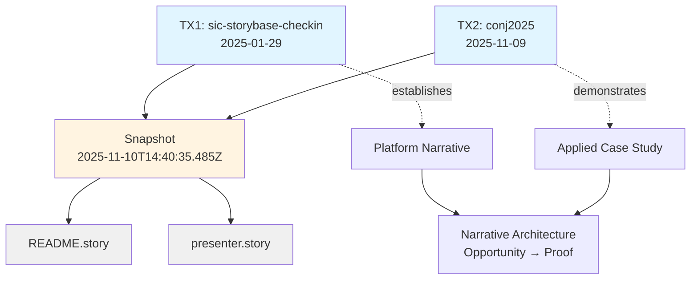
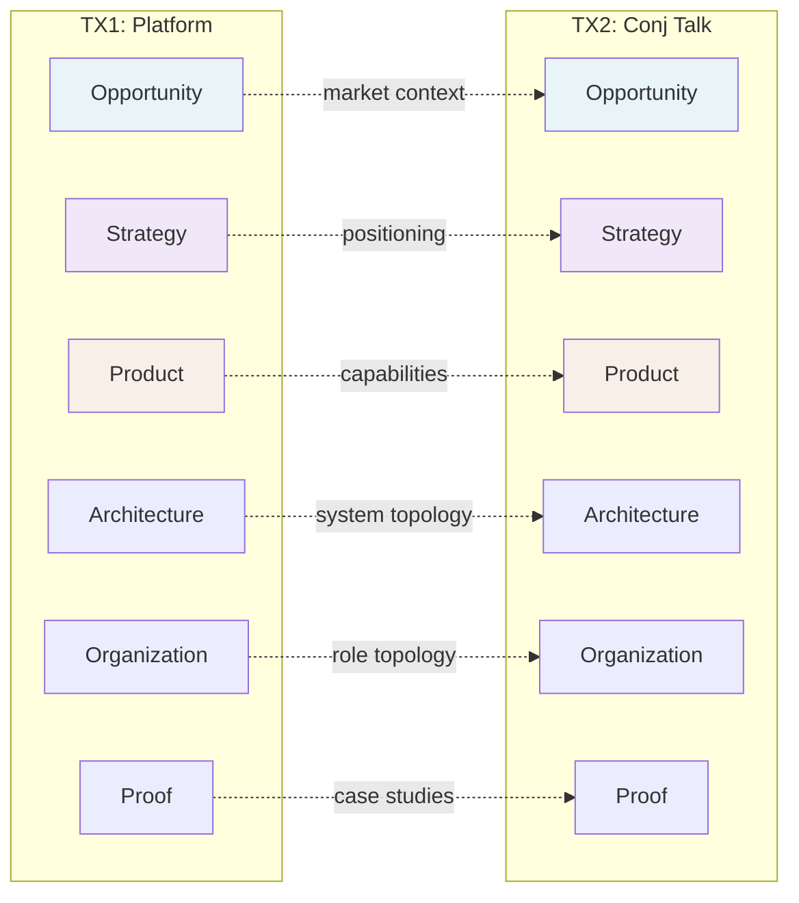

# storyBASE State & Repository Overview

## State

The storyBASE currently holds **two foundational transactions** that establish both the platform's strategic narrative and a concrete use case for immutable identity systems[^1]. The graph encodes:

- **Platform narrative**: storyBASE as a Git-native RDF knowledge graph for AI memory, positioning it as "AI that tells you a story as written"[^2]
- **Applied case study**: A Clojure conference talk proposal on immutable identity architecture, demonstrating the platform's ability to capture and version technical narratives[^3]
- **Style & calibration infrastructure**: Comprehensive style observations, rubric assessments, and metrics that make voice measurable and reproducible[^4]

The snapshot demonstrates storyBASE's core thesis: narrative-driven knowledge graphs create deterministic AI individuality through versionable, provenance-tracked context[^5].

---

## Stories

### `/README.story` – Repository State Document
**Intent**: Auto-generated living documentation that reflects the current storyBASE state, transaction history, and asset inventory.

**Relationship to whole**: Serves as the canonical entry point and state summary; demonstrates storyBASE's ability to generate narrative artifacts from graph state.

**Approach**: Queries the compiled snapshot to extract:
- Transaction provenance and sequencing
- Narrative architecture coverage (Opportunity → Strategy → Product → Proof)
- Style metrics and rubric scores
- Asset topology and relationships

Uses mermaid diagrams to visualize transaction flow and concept hierarchies[^6].

---

### `/presenter.story` – Immutable Selves Talk
**Intent**: Conference presentation for Clojure/conj 2025 on applying functional programming principles (immutability, explicit state, data-first design) to identity systems.

**Relationship to whole**: Proof artifact demonstrating storyBASE's capacity to:
1. Capture technical strategy (Vouch.io, Sic product narratives)
2. Maintain speaker voice and style (idiolect, cadence, rhetorical devices)
3. Generate presentation-ready output with citations to graph provenance

**Approach**: Follows iA Presenter format (script-first, responsive layout, teleprompter support). Structures talk as:
- **Problem**: Identity vulnerability crisis (deepfakes, synthetic fraud)[^7]
- **Strategy**: Functional immutable identity architecture[^8]
- **Proof**: Dual case studies (Vouch.io enterprise platform, Sic AI memory)[^9]
- **Takeaways**: Actionable patterns for Clojure practitioners

Citations link claims to storyBASE nodes (Opportunity, Strategy, Product, Architecture) with human-readable context in footnotes[^10].

---

## Assets

```
/
├── .storyBASE/
│   ├── 1762731465sic-storybase-checkin.sparql
│   └── 1762728019add_conj_talk_2025_extraction.sparql
├── README.story
└── presenter.story
```

### `.storyBASE/` Directory
Append-only transaction log storing SPARQL INSERT DATA statements. Each file is timestamped and immutable; the snapshot is a replay of sorted transactions[^11].

**1762731465sic-storybase-checkin.sparql**  
Platform strategy extraction: market opportunity, timing thesis, product overview, roadmap, style observations (10 observations), rubric assessments (9 dimensions), and style metrics (avg sentence length 35.2, active voice 0.72, jargon density 0.18)[^12].

**1762728019add_conj_talk_2025_extraction.sparql**  
Conj talk extraction: opportunity (identity vulnerability), strategy (functional immutable identity), products (Vouch.io, Sic), architecture patterns, style observations (11 observations), rubric assessments (4 dimensions: clarity 4.5/5, technical depth 4.8/5, narrative coherence 4.6/5, audience engagement 4.3/5), and style metrics (avg sentence length 22.4, technical density 0.68, active voice 0.71)[^13].

### `README.story`
Story prompt for auto-generating repository documentation. Queries snapshot for state, stories, assets, and transactions; outputs markdown with mermaid diagrams[^14].

### `presenter.story`
Story prompt for Conj talk presentation. Uses iA Presenter format (script-based, responsive, teleprompter-ready); cites storyBASE nodes in footnotes[^15].

---

## Transactions

### Transaction 1: `2025-01-29T000000Z_sic-storybase-checkin`
**Generated**: 2025-11-09T23:37:05.079Z  
**Agent**: n8n.storyTWIN/MCP  
**User**: pleasetrythisathome  
**Model**: (not specified in TX metadata)

**Significance**: Establishes storyBASE's strategic foundation across all Narrative Architecture domains:

- **Opportunity**: Market context (AI prompt engineering, organizational memory), timing thesis (2024-2026 window), primary actors (programming-literate entrepreneurs/designers)[^16]
- **Strategy**: Positioning thesis (extend software rigor into strategy/content), moat (Git-native versionable AI memory), tagline ("AI that tells you a story as written")[^17]
- **Product**: Modules (compile, extract, diff, tx, commit, story generation), dependencies (n8n, MCP, GitHub, Jena, Docker, Outseta, Helicone, Open Router)[^18]
- **Architecture**: System topology (n8n orchestration, MCP exposure, hierarchical compile), data lifecycle (append-only log, snapshot replay, provenance)[^19]
- **Organization**: Role topology (programming-literate users, GitHub RBAC), process (interactive individuation vs. automated ingestion)[^20]
- **Proof**: Case studies (planned Crooked Media demo with perspectival operations)[^21]

**Style capture**: 10 observations (brand stylization "storyBASE", idiolect "you know", power verb "extend", simile, tone direct/personal, jargon policy, sentence variation, parallelism, rhetorical question, caret bracket marker)[^22]. 9 rubric assessments (register fit 3.5/5, phrasing 3/5, cadence 3/5, strategic alignment 4/5, audience tailoring 3.5/5, resonance 3/5, flow 3/5, novelty 3.5/5, accuracy 4/5)[^23]. Style metrics: avg sentence length 35.2, active voice 0.72, jargon density 0.18, type-token ratio 0.42[^24].

---

### Transaction 2: `Tx_20251109T223928Z_conj2025`
**Generated**: 2025-11-09T22:39:28.133Z  
**Agent**: n8n.storyTWIN/MCP  
**User**: pleasetrythisathome  
**Model**: anthropic/claude-sonnet-4.5

**Significance**: Captures a concrete application of immutable identity principles, demonstrating storyBASE's ability to version technical narratives:

- **Opportunity**: Identity vulnerability crisis (deepfakes, synthetic identities, impersonation fraud in enterprise context)[^25]
- **Strategy**: Functional immutable identity architecture applying Clojure principles (immutability, explicit state, functional composition, data-first design, knowledge graphs)[^26]
- **Products**: Vouch.io (enterprise identity platform, past work), Sic (AI memory platform, current work)[^27]
- **Architecture**: Immutable identity patterns (append-only event logs with verifiable receipts, authentication as pure function at edge, delegation as signed events, knowledge graphs for resolution)[^28]
- **Organization**: Sic (founder), Vouch.io (former Chief Strategist, current strategic advisor)[^29]
- **Proof**: Conj 2025 talk (threaded diagrams, optional demo, Clojure developer audience)[^30]

**Style capture**: 11 observations (brand styling "Vouch.io", technical terms "append-only event logs"/"authentication as pure functions"/"persistent logs and knowledge graphs", brand "Sic", triadic enumeration, problem-to-solution bridge, parallel construction, technical reframing of identity/trust, personal identity lens)[^31]. 4 rubric assessments (clarity 4.5/5, technical depth 4.8/5, narrative coherence 4.6/5, audience engagement 4.3/5)[^32]. Style metrics: avg sentence length 22.4, technical density 0.68, active voice 0.71[^33].

---

## Transaction Flow



---

## Narrative Architecture Coverage



---

[^1]: Snapshot compiled 2025-11-10T14:40:35.485Z from two transactions: `2025-01-29T000000Z_sic-storybase-checkin` and `Tx_20251109T223928Z_conj2025`.

[^2]: `<http://storybase.synthetic-identity.co/tagline/storybase>` rdfs:label "storyBASE Tagline"; sb:description "AI that tells you a story as written"; sb:note "User-facing brand as written.ai; Latin i.e. meaning."

[^3]: `<urn:uuid:conj-talk-2025-extraction>` a sb:SampleRecord; rdfs:label "Conj Talk 2025: Immutable Selves"; sb:inputLength 3421; prov:wasGeneratedBy `<http://storybase.org/narrative#Tx_20251109T223928Z_conj2025>`.

[^4]: Style ontology includes 10 top-level facets (Profiles, Diction, Tone/Voice, Register, POV, Tense, Grammar, Cadence, Devices, Orthography, Punctuation, Citation, Inclusive, Localization, Metrics, Review) with 60+ sub-concepts and a 9-dimension rubric (Register, Phrasing, Cadence, Strategic Alignment, Tailoring, Resonance, Flow, Novelty, Accuracy).

[^5]: `<http://storybase.synthetic-identity.co/leverage/moat-storybase>` sb:description "Git-native, versionable, branchable AI memory encoding style, conviction, narrative metrics; replaces brittle role prompts with deep, operable persona descriptions."

[^6]: Ontology defines hierarchical relationships via skos:broader/narrower and sequential relationships via xkos:next/previous, enabling graph traversal for diagram generation.

[^7]: `<urn:uuid:opportunity-identity-vulnerability>` sb:description "Centralized, mutable identity systems vulnerable to deepfakes, synthetic identities, and impersonation fraud"; sb:marketContext "Enterprise identity and authentication".

[^8]: `<urn:uuid:strategy-functional-immutable-identity>` sb:approach "Models identity as append-only event logs, authentication as pure functions, delegation as auditable chains"; sb:differentiator "Immutable facts at the edge, verifiable receipts, graph-based resolution".

[^9]: `<urn:uuid:product-vouch-io>` sb:productType "Identity and authentication system"; `<urn:uuid:product-sic>` sb:productType "AI memory and agent individuality system"; sb:capability "Persistent logs and knowledge graphs for agent memory, narrative-driven provenance and shareable perspective".

[^10]: Citation conventions defined in ontology: `#CaretBracketMarker` (inline caret with brackets), `#InlineLinkStyle`, `#FootnoteStyle`; related to `#FactualAccuracy` and `#Proof`.

[^11]: `<http://storybase.synthetic-identity.co/model/data-lifecycle-storybase>` sb:description "Append-only transaction log; immutable files; snapshot = replay of sorted transactions; provenance in TX step; future named graphs for add/remove."

[^12]: TX1 metadata: prov:generatedAtTime "2025-11-09T23:37:05.079Z"; prov:wasAssociatedWith "n8n.storyTWIN/MCP"; prov:wasAttributedTo "pleasetrythisathome". Style metrics: `<http://storybase.synthetic-identity.co/metrics/style>` sb:description "Average sentence length 35.2, active voice ratio 0.72, jargon density 0.18, type-token ratio 0.42".

[^13]: TX2 metadata: prov:generatedAtTime "2025-11-09T22:39:28.133Z"; prov:used "anthropic/claude-sonnet-4.5". Style metrics: `<urn:uuid:style-metrics>` sb:averageSentenceLength "22.4"; sb:technicalDensity "0.68"; sb:activeVoiceRatio "0.71".

[^14]: README.story YAML front matter: id "README", title "storyBASE repo README", version "0.1.0", model "anthropic/claude-sonnet-4.5". Prompt requests state summary, story intent, asset descriptions, transaction significance, and mermaid charts.

[^15]: presenter.story YAML front matter: id "conj-talk-2025", title "Immutable Selves Talk", version "0.1.0", model "anthropic/claude-sonnet-4.5". Prompt requests iA Presenter format with storyBASE citations in footnotes.

[^16]: `<http://storybase.synthetic-identity.co/opportunity/storybase-market>` sb:marketContext "AI prompt engineering and organizational memory"; `<http://storybase.synthetic-identity.co/thesis/timing-storybase>` sb:timestampWindow "2024-2026"; `<http://storybase.synthetic-identity.co/actor/primary-storybase>` sb:description "Programming-literate entrepreneurs, designers, developers, consultants who manipulate worldview and see perspective changes."

[^17]: `<http://storybase.synthetic-identity.co/thesis/positioning-storybase>` sb:description "Extend software development rigor (versioning, branching, collaboration) into strategy, content, marketing, organizational operations via RDF narrative source of truth."

[^18]: `<http://storybase.synthetic-identity.co/module/storybase-capabilities>` sb:description "Compile (replay transactions to Turtle snapshot), extract (RDF from input), diff (semantic comparison), tx (propose transaction), commit (append-only to Git), story generation (YAML front matter + prompt to model outputs)."

[^19]: `<http://storybase.synthetic-identity.co/architecture/topology-storybase>` sb:description "n8n agent orchestrates tools; MCP server exposes to frontends (Agent.ai, ChatGPT, Open WebUI); transactions in .storybase directories; hierarchical compile; Docker Compose on Digital Ocean."

[^20]: `<http://storybase.synthetic-identity.co/process/storybase>` sb:description "Interactive individuation (extract → diff → tx → review → commit) vs. automated ingestion (file upload → extraction → PR); story generation triggered by transaction or .story file changes."

[^21]: `<http://storybase.synthetic-identity.co/case/studies-storybase>` sb:description "Planned demo: Crooked Media podcast transcripts auto-ingested; stories auto-update; perspectival operations (e.g., start with NPR, evolve with OpenAI)."

[^22]: 10 style observations in TX1: brand name stylization (CamelCase 'storyBASE'), idiolect phrasing ("you know"), verb choice ("extend"), simile (AI without context = generic output), tone direct personal (first-person "I"), jargon policy (RDF/canonization/skolemization without definition), sentence length variation, parallelism ("extract … diff … tx"), rhetorical question, caret bracket marker (citation placeholder).

[^23]: 9 rubric assessments in TX1: register fit 3.5/5 (conversational, informal, first-person), phrasing 3/5 (domain verbs, idiolect emerging), cadence 3/5 (sentence length varies, rhythm uneven), strategic alignment 4/5 (clear positioning, mission/moat articulated), audience tailoring 3.5/5 (assumes programming-literate, jargon without definition), resonance 3/5 (light analogies, planned demos), flow 3/5 (logical progression, implicit transitions), novelty 3.5/5 (brand stylization distinct, "individuation pipeline" novel), accuracy 4/5 (technical details specific, citation marker unfilled).

[^24]: `<http://storybase.synthetic-identity.co/metrics/style>` sb:description "Average sentence length 35.2, active voice ratio 0.72, jargon density 0.18, type-token ratio 0.42"; sb:note "Conversational transcript with high jargon and active voice."

[^25]: `<urn:uuid:opportunity-identity-vulnerability>` a sb:Opportunity; rdfs:label "Identity Vulnerability Crisis"; sb:description "Centralized, mutable identity systems vulnerable to deepfakes, synthetic identities, and impersonation fraud"; sb:marketContext "Enterprise identity and authentication".

[^26]: `<urn:uuid:strategy-functional-immutable-identity>` a sb:Strategy; rdfs:label "Functional Immutable Identity Architecture"; sb:description "Applies Clojure principles (immutability, explicit state, functional composition, data-first design, knowledge graphs) to create trustworthy identity systems".

[^27]: `<urn:uuid:product-vouch-io>` sb:note "Past work, speaker now strategic advisor"; `<urn:uuid:product-sic>` sb:note "Current work, speaker is founder".

[^28]: `<urn:uuid:architecture-immutable-identity>` sb:component "Append-only event logs with verifiable receipts, authentication as pure function at the edge, delegation as signed append-only events, knowledge graphs for entity and role resolution"; sb:principle "Immutability, functional composition, explicit state management, data-first design".

[^29]: `<urn:uuid:org-sic>` sb:role "Founder"; `<urn:uuid:org-vouch-io>` sb:role "Former Chief Strategist, current strategic advisor".

[^30]: `<urn:uuid:proof-conj-2025-talk>` sb:artifact "Threaded diagrams from model to implementation, optional short demo with canned fallback"; sb:audience "Clojure developers and functional programming practitioners".

[^31]: 11 style observations in TX2: brand name styling (Vouch.io domain extension), technical terms (append-only event logs, authentication as pure functions, persistent logs and knowledge graphs), brand name (Sic, terse with Latin reference), rhetorical structure (triadic enumeration "deterministic individuality, narrative-driven provenance, and shareable perspective"; problem-to-solution bridge "We move from a simple mental model to concrete system patterns you can adopt today"), list structure (parallel construction in actionable takeaways), technical reframing (identity as evolving log, trust as computable provenance), personal identity lens (trans woman lived experience informs contextual/evolving identity framing).

[^32]: 4 rubric assessments in TX2: clarity 4.5/5 (clear problem statement, well-structured, actionable takeaways, minor density in technical sections), technical depth 4.8/5 (strong Clojure grounding, concrete patterns, dual case studies, verifiable architecture), narrative coherence 4.6/5 (coherent arc from deepfakes → immutability → talk structure, dual product lens adds depth), audience engagement 4.3/5 (actionable takeaways, optional demo, clear attendee value, could strengthen emotional hook beyond technical urgency).

[^33]: `<urn:uuid:style-metrics>` a sb:StyleMetrics; rdfs:label "Style Metrics for Conj Talk 2025"; sb:averageSentenceLength "22.4"; sb:technicalDensity "0.68"; sb:activeVoiceRatio "0.71"; sb:note "Moderate sentence length, high technical density, strong active voice in takeaways".