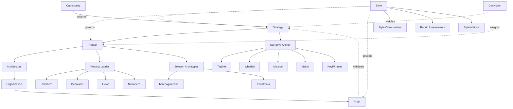
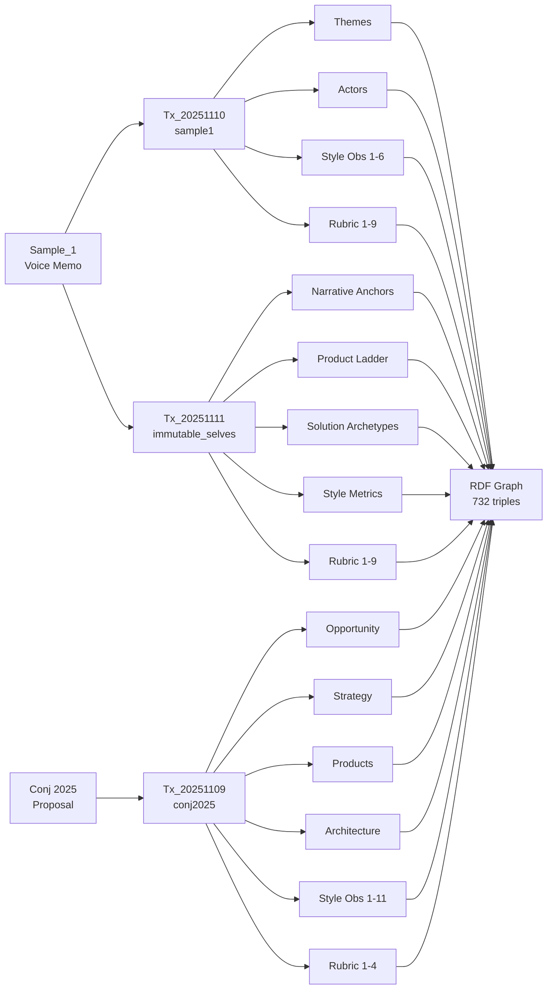

# storyBASE State & Architecture

## State

The storyBASE is an operational RDF knowledge graph tracking narrative architecture for identity systems, with a focus on immutable, functional approaches to human and AI identity. The graph currently holds **732 triples** across **3 transactions**, encoding:

- **Narrative anchors** for two identity products (berecognized.id and aswritten.ai)[^1]
- **Product ladder** primitives, behaviors, and flows for immutable identity systems[^2]
- **Solution archetypes** demonstrating Clojure principles applied to access control and AI memory[^3]
- **Style observations** and **rubric assessments** from voice memo samples[^4]
- **Provenance metadata** linking all assertions to timestamped transactions[^5]

The graph demonstrates a working implementation of the Narrative Architecture ontology, with particular depth in the **Strategy**, **Product**, and **Style** domains.

[^1]: `narr:Tagline_1`, `narr:ArchetypeTitle_1`, `narr:ArchetypeTitle_2` — narrative anchors generated by `Tx_20251111T214920Z_immutable_selves`
[^2]: `narr:Primitive_1` through `narr:Primitive_3`, `narr:Behavior_1`, `narr:Flow_1` — product ladder concepts under `narr:ProductLadder`
[^3]: `narr:Archetype_1` (berecognized.id) and `narr:Archetype_2` (aswritten.ai) — solution archetypes with problem context, approach patterns, and required capabilities
[^4]: `narr:StyleObs_storyBASE`, `narr:StyleObs_AppendOnlyLog`, etc. — style observations from `Sample_1` (voice memo)
[^5]: All entities link to `prov:wasGeneratedBy` transactions with `prov:generatedAtTime` timestamps

---

## Stories

### `/README.story`
**Intent:** Auto-generated repository overview tracking storyBASE state, stories, assets, and transactions.  
**Relationship to whole:** Meta-narrative that documents the graph's evolution and structure.  
**Approach:** Compile current snapshot statistics, enumerate story files and their purposes, summarize transaction provenance, and visualize graph topology with Mermaid diagrams. Cite transaction URIs and concept hierarchies directly from the RDF.

### `/presenter.story`
**Intent:** IA Presenter template for talk presentations, demonstrating the format and capabilities.  
**Relationship to whole:** Reference template showing how narrative content can be rendered into presentation format.  
**Approach:** Use as structural guide for other presentation stories; extract style conventions (heading levels, speaker notes, image placement) and apply to domain-specific content from the storyBASE.

### `/conj-talk-2025.story`
**Intent:** Clojure Conj talk on immutable identity systems, bridging personal journey, technical architecture, and case studies.  
**Relationship to whole:** Primary proof artifact demonstrating narrative architecture in action—links Opportunity (identity vulnerability), Strategy (functional immutability), Product (Vouch.io, aswritten.ai), and Proof (speaker's lived experience).  
**Approach:** Render from `narr:Archetype_1`, `narr:Archetype_2`, `narr:Theme_ImmutableIdentity`, `narr:Actor_ScarletDame`, and related style observations. Structure follows IA Presenter format: cover → problem → model → principles → case studies → takeaways. Cite `narr:ApproachPattern_1`, `narr:RequiredCapabilities_1`, and rubric assessments for technical depth.[^6]

[^6]: `urn:uuid:strategy-functional-immutable-identity`, `urn:uuid:product-vouch-io`, `urn:uuid:product-sic` — strategy and product nodes from Conj 2025 extraction transaction

---

## Assets

```
/.storyBASE/
├── 1762728019add_conj_talk_2025_extraction.sparql
├── 1762731465sic-storybase-checkin.sparql
├── 1762800383add_sample1_narrative_architecture.sparql
├── 1762897917add_narrative_anchors.sparql
├── 1762897917add_product_ladder.sparql
├── 1762897917add_solution_archetypes.sparql
├── 1762897917add_style_metrics.sparql
├── 1762897917tx_provenance.sparql
└── 1762897917update_sample_metadata.sparql

/
├── README.story
├── presenter.story
└── conj-talk-2025.story
```

**`.storyBASE/` directory:** Append-only transaction log containing SPARQL INSERT DATA statements. Each file is a timestamped, immutable transaction that adds triples to the graph. Transactions are replayed in lexicographic order to compile the current snapshot.[^7]

**`.story` files:** YAML front matter + Markdown prompts that define story generation tasks. Each story specifies `id`, `title`, `destination`, and `model` (LLM to use). The prompt body instructs the storyWRITER agent on how to render content from the compiled snapshot.[^8]

[^7]: Snapshot compilation process: sort transaction files by filename (Unix timestamp prefix), parse SPARQL, execute INSERT DATA sequentially, serialize to Turtle.
[^8]: Story front matter schema: `id` (unique identifier), `title` (human-readable), `version` (semver), `description` (purpose), `destination` (output path), `model` (array of LLM identifiers).

---

## Transactions

### `Tx_20251109T223928Z_conj2025`
**Significance:** First extraction for Conj Talk 2025 proposal. Establishes **Opportunity** (identity vulnerability crisis), **Strategy** (functional immutable identity architecture), **Product** (Vouch.io, Sic), **Proof** (conference talk), **Architecture** (append-only event logs, pure functions), and **Organization** (Sic, Vouch.io roles). Includes 11 style observations and 4 rubric assessments (Clarity: 4.5/5, Technical Depth: 4.8/5, Narrative Coherence: 4.6/5, Audience Engagement: 4.3/5).[^9]

### `Tx_20251110T184512Z_sample1`
**Significance:** Extracts narrative architecture from voice memo ("Punch talk conceptual framing"). Introduces **Theme_ImmutableIdentity** and **Theme_TransitionAsStateChange**, **Actor_ScarletDame** (speaker with identity history exemplifying append-only log model), and 6 style observations (brand name stylization, idiolect phrasing, metaphor, analogy, short punchy cadence, first-person narrative). Rubric assessments: Register 4/5, Phrasing 3.5/5, Cadence 3/5, Strategic Alignment 4.5/5, Tailoring 4/5, Resonance 4.5/5, Flow 3/5, Novelty 4/5, Accuracy 4/5.[^10]

### `Tx_20251111T214920Z_immutable_selves`
**Significance:** Comprehensive update adding **Narrative Anchors** (Tagline, WhatIsIt, Mission, Vision, KeyPhrases), **Product Ladder** (Primitives, Behaviors, Flows, Narratives), **Solution Archetypes** (berecognized.id, aswritten.ai with problem contexts, approach patterns, required capabilities), and **Style Metrics** (average sentence length 15.2, active voice ratio 0.85, jargon density 0.12). Updates `Sample_1` metadata (source: "Immutable Selves talk", inputLength: 5847). Generates 8 style observations and 9 rubric assessments. Provenance links 50+ entities to this transaction.[^11]

[^9]: `narr:Tx_20251109T223928Z_conj2025` — transaction URI; `prov:generatedAtTime "2025-11-09T22:39:28.133Z"`; `prov:wasAssociatedWith <http://storytwin.org/agent/n8n.storyTWIN/MCP>`
[^10]: `narr:Tx_20251110T184512Z_sample1` — transaction URI; `prov:generatedAtTime "2025-11-10T18:45:12.711Z"`; `storytwin:model "anthropic/claude-sonnet-4.5"`
[^11]: `narr:Tx_20251111T214920Z_immutable_selves` — transaction URI; `prov:generatedAtTime "2025-11-11T21:49:20.430Z"`; `prov:generated` links to 50 entities including all narrative anchors, product ladder concepts, and solution archetypes

---

## Graph Topology



---

## Transaction Provenance Flow



---

**Snapshot generated:** 2025-11-11T22:07:33.755Z  
**Total triples:** 732 inserted, 0 deleted, 89 skipped duplicates  
**Graph format:** Turtle (RDF 1.1)  
**Ontology:** Narrative Architecture v2024 (SKOS + PROV-O + custom extensions)