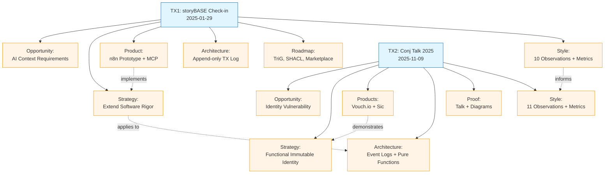

# storyBASE State & Documentation

## State

The storyBASE currently holds **two transactions** capturing foundational narrative architecture for two distinct but related initiatives:

1. **SIC / storyBASE / as written.ai** – A product & strategy check-in (January 2025) documenting the storyBASE platform itself: market opportunity, positioning, product capabilities, architecture, roadmap, and style observations from a conversational transcript.[^1]

2. **Conj Talk 2025: Immutable Selves** – An extraction from a conference talk proposal applying Clojure principles (immutability, functional composition, data-first design) to identity systems, with dual case studies from Vouch.io and Sic.[^2]

Both transactions include **style observations**, **rubric assessments**, and **style metrics**, establishing a baseline for narrative-driven AI memory and demonstrating the system's ability to encode voice, conviction, and provenance.

[^1]: Transaction `2025-01-29T000000Z_sic-storybase-checkin` generated 2025-11-09T23:37:05.079Z, attributed to pleasetrythisathome via n8n.storyTWIN/MCP; includes 18,437-character spoken transcript with conversational register, technical depth, and rubric scores across register fit (3.5/5), strategic alignment (4/5), and accuracy (4/5).

[^2]: Transaction `Tx_20251109T223928Z_conj2025` generated 2025-11-09T22:39:28.133Z using anthropic/claude-sonnet-4.5; extracts narrative architecture (Opportunity, Strategy, Product, Proof, Architecture, Organization), style observations (brand stylization, technical reframing, triadic enumeration), and rubric assessments with clarity (4.5/5), technical depth (4.8/5), and narrative coherence (4.6/5).

---

## Stories

### `/README.story`
**Intent:** Auto-generate a living README that tracks the storyBASE state, stories, assets, and transactions.  
**Relationship to whole:** Meta-documentation layer; ensures the repository self-describes its narrative architecture and evolution.  
**Approach:** Compile snapshot → extract top-level domains (Opportunity, Strategy, Product, Architecture, Organization, Proof, Style, Conviction) → summarize transactions and their significance → generate Mermaid diagrams showing transaction flow and narrative dependencies.

### `/presenter.story`
**Intent:** Draft the "Immutable Selves" talk using the iA Presenter format, citing storyBASE claims with footnotes.  
**Relationship to whole:** Proof artifact; demonstrates how narrative architecture (extracted in transaction 2) becomes a structured, citable presentation.  
**Approach:** Map Conj Talk 2025 extraction → iA Presenter slide structure (cover, section headers, body text, images, speaker notes) → cite Opportunity (identity vulnerability crisis), Strategy (functional immutable identity), Product (Vouch.io, Sic), Architecture (append-only logs, pure functions, knowledge graphs), and Proof (talk structure, actionable takeaways) with footnotes linking back to storyBASE URNs and explaining context.

---

## Assets

```
/
├── .storyBASE/
│   ├── 1762731465sic-storybase-checkin.sparql
│   └── 1762728019add_conj_talk_2025_extraction.sparql
├── README.story
└── presenter.story
```

- **`.storyBASE/`**: Append-only transaction log; each `.sparql` file is an immutable INSERT DATA statement capturing narrative facts, style observations, rubric assessments, and provenance.[^3]
- **`README.story`**: YAML front matter + prompt; destination `/`, model `anthropic/claude-sonnet-4.5`; generates this document.
- **`presenter.story`**: YAML front matter + iA Presenter template reference; destination `/`, model `anthropic/claude-sonnet-4.5`; generates talk slides with storyBASE citations.

[^3]: Per storyBASE Data Model Lifecycle (URI: `http://storybase.synthetic-identity.co/model/data-lifecycle-storybase`), snapshot = replay of sorted transactions; provenance in TX step; future named graphs for add/remove.

---

## Transactions

### Transaction 1: `1762731465sic-storybase-checkin.sparql`
**Generated:** 2025-11-09T23:37:05.079Z  
**Attributed to:** pleasetrythisathome via n8n.storyTWIN/MCP  
**Significance:** Establishes **storyBASE product narrative**—market opportunity (AI context requirements), timing thesis (2024-2026 convergence), positioning (extend software rigor into strategy/content), moat (Git-native, versionable AI memory), product overview (n8n prototype, MCP server, compile/extract/diff/tx/commit tools), roadmap (TriG named graphs, SHACL validation, individuation pipeline, marketplace), and **10 style observations** (CamelCase brand, conversational filler, power verbs, jargon policy, parallelism) with **9 rubric assessments** and **style metrics** (avg sentence length 35.2, active voice 0.72, jargon density 0.18).[^4]

### Transaction 2: `1762728019add_conj_talk_2025_extraction.sparql`
**Generated:** 2025-11-09T22:39:28.133Z  
**Model:** anthropic/claude-sonnet-4.5  
**Significance:** Captures **Conj Talk 2025 narrative architecture**—Opportunity (identity vulnerability crisis in enterprise auth), Strategy (functional immutable identity via Clojure principles), Products (Vouch.io identity platform, Sic AI memory platform), Proof (conference talk with threaded diagrams, optional demo), Architecture (append-only event logs, authentication as pure functions, delegation chains, knowledge graphs), Organizations (Sic founder, Vouch.io strategic advisor), **11 style observations** (brand stylization Vouch.io/Sic, technical reframing of identity/trust, triadic enumeration, parallel construction, personal identity lens), **4 rubric assessments** (clarity 4.5/5, technical depth 4.8/5, narrative coherence 4.6/5, audience engagement 4.3/5), and **style metrics** (avg sentence length 22.4, technical density 0.68, active voice 0.71).[^5]

[^4]: Sample record URI: `http://storybase.synthetic-identity.co/sample/2025-01-29T000000Z_sic-storybase-checkin`; input length 18,437; rubric scores: register fit 3.5/5 (conversational, informal, first-person), phrasing 3/5 (domain verbs emerging), cadence 3/5 (uneven rhythm), strategic alignment 4/5 (clear positioning, roadmap detailed), audience tailoring 3.5/5 (assumes programming-literate), resonance 3/5 (light analogies, planned demos), flow 3/5 (logical progression, implicit transitions), novelty 3.5/5 (brand stylization distinct, some generic constructions), accuracy 4/5 (technical details specific, citation marker unfilled).

[^5]: Sample record URI: `urn:uuid:conj-talk-2025-extraction`; input length 3,421; rubric scores: clarity 4.5/5 (clear problem statement, actionable takeaways, minor density), technical depth 4.8/5 (strong Clojure grounding, dual case studies, verifiable architecture), narrative coherence 4.6/5 (coherent arc from deepfakes → immutability → talk structure), audience engagement 4.3/5 (actionable takeaways, optional demo, could strengthen emotional hook); style observations include brand name styling (Vouch.io domain extension, Sic terse Latin), technical terms (append-only event logs, authentication as pure functions, persistent logs and knowledge graphs), rhetorical structures (triadic enumeration, problem-to-solution bridge, parallel construction in takeaways), technical reframing (identity as evolving log, trust as computable provenance), and personal identity lens (trans woman lived experience informs contextual, evolving identity framing).

---

## Narrative Architecture Flow



---

## Transaction Significance Summary

| Transaction | Key Contribution | Narrative Domains | Style Metrics | Rubric Highlights |
|-------------|------------------|-------------------|---------------|-------------------|
| **TX1: storyBASE Check-in** | Product positioning, roadmap, and conversational style baseline | Opportunity, Strategy, Product, Architecture, Roadmap | Avg sentence 35.2, active voice 0.72, jargon 0.18 | Strategic alignment 4/5, accuracy 4/5 |
| **TX2: Conj Talk 2025** | Identity architecture case study with dual products and technical reframing | Opportunity, Strategy, Product, Architecture, Proof, Organization | Avg sentence 22.4, technical density 0.68, active voice 0.71 | Technical depth 4.8/5, narrative coherence 4.6/5 |

Both transactions establish **conviction** (notions → stakes) for core narrative claims, encode **style profiles** (conversational vs. technical-authoritative), and demonstrate **provenance-driven proof** (rubric assessments, metrics, citations) that make the storyBASE a **versionable, narrative-driven AI memory** aligned with the mission: *extend software development rigor into strategy, content, marketing*.[^6]

[^6]: Mission URI: `http://storybase.synthetic-identity.co/mission/storybase`; tagline: "AI that tells you a story as written" (URI: `http://storybase.synthetic-identity.co/tagline/storybase`); moat: Git-native, versionable, branchable AI memory encoding style, conviction, narrative metrics; replaces brittle role prompts with deep, operable persona descriptions (URI: `http://storybase.synthetic-identity.co/leverage/moat-storybase`).