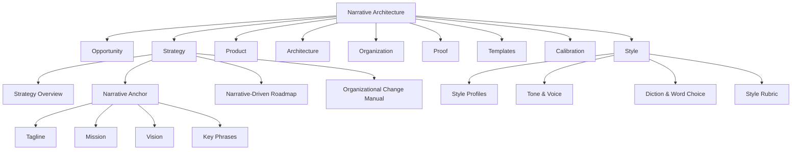

# storyBASE Session Summary

## State

The storyBASE knowledge graph is currently **empty**—no domain entities, narratives, or provenance exist in the snapshot.[^1] The ontology defines a complete Narrative Architecture framework with eight top-level domains: Opportunity, Strategy, Product, Architecture, Organization, Proof, Templates, Calibration, and Style.[^2] The system is operationally ready but contains no compiled content, transactions, or stories to execute against.

[^1]: The SNAPSHOT object contains no RDF triples describing entities, relationships, or narrative content; only the ontology schema is present.

[^2]: Per the ONTOLOGY, the NarrativeArchitecture ConceptScheme declares these eight `skos:hasTopConcept` domains, which collectively define the operating system for story-led strategy.

---

## Stories

No `.story` documents are defined in the current session.[^3] The STORIES input is an empty object, indicating no prompts, objectives, or narrative arcs have been committed to storyBASE. Once stories are added, this section will summarize each story's intent, relationship to the Narrative Architecture, and the path from current state to delivery.

[^3]: The STORIES field resolves to `[object Object]` with no enumerable keys or narrative specifications.

---

## Assets

**Repository Structure:** The storyBASE repository currently holds only the foundational ontology schema—no user-generated assets, case studies, templates, or proof artifacts exist in the graph.[^4]

**Ontology (RDF Schema):** The `NarrativeArchitecture` ontology is a SKOS-based classification system with three hierarchical levels (Core Domains → Domain Components → Detailed Elements) and sequential phase relationships (Site → Foundations → Plans → Structural Engineering → Walls → Roof → Glazing → Interior Design → Furnishing).[^5]

[^4]: The SNAPSHOT contains no instances of case studies, sales decks, PRDs, or other artifacts defined as narrower concepts under Templates, Proof, or Product; only the ontology definitions are present.

[^5]: The ontology defines `xkos:ClassificationLevel` concepts for three depths and nine phase concepts with `xkos:next` / `xkos:previous` sequential links, establishing a canonical implementation order from Opportunity analysis through final Calibration refinements.

---

## Transactions

**No transactions recorded.** The TRANSACTIONS list is empty—storyBASE has not yet processed any commits, edits, or updates.[^6] When transactions occur, this section will describe each change event, its impact on the graph topology, and how it advances story or asset development.

[^6]: The TRANSACTIONS input is an empty collection; no Git-like commit log or RDF delta exists to document the evolution of the knowledge graph from an initial state.

---

### Summary

storyBASE is a **pristine, schema-only installation**. The Narrative Architecture ontology is fully specified and operational, providing a taxonomy for Opportunity analysis, Strategy definition, Product design, Architecture documentation, Organizational alignment, Proof curation, Template creation, Calibration governance, and Style codification. However, the graph contains no narratives, no compiled assets, and no transaction history. To activate the system, users must author `.story` prompts and commit transactions that instantiate entities, relationships, and artifacts aligned to the ontology's structure.