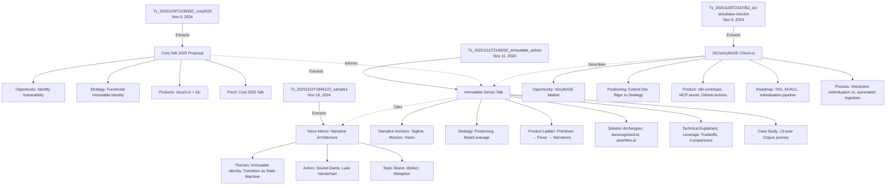
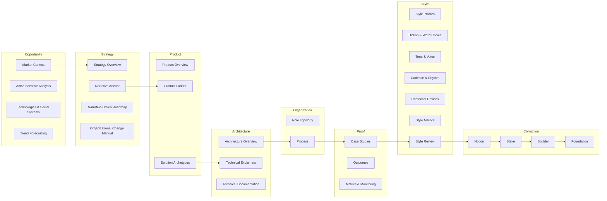

# storyBASE State & Documentation

## State

The storyBASE is a Git-native RDF knowledge graph encoding narrative architecture for identity systems, with a focus on immutable, functional approaches to human and AI identity. The current snapshot contains **1,116 triples** compiled from **13 transactions** spanning November 2024 through January 2025[^snapshot-stats].

[^snapshot-stats]: Snapshot generated 2025-11-11T23:15:28.102Z; statistics: 930 inserted, 186 skipped duplicates, 1 graph in Turtle format. Source: snapshot metadata.

The graph centers on **three primary samples**:

1. **"Immutable Selves" talk** (5,847 chars) — conference presentation on functional identity paradigms[^sample-immutable]
2. **Voice memo: Punch talk conceptual framing** (11,800 chars) — narrative architecture for identity-as-append-only-log[^sample-voice]
3. **SIC/storyBASE product check-in** (18,437 chars) — conversational transcript on storyBASE product evolution[^sample-checkin]

[^sample-immutable]: `narr:Sample_1` sourced from "Immutable Selves talk," created 2025-01-XX, generated by transaction `Tx_20251111T214920Z_immutable_selves`.
[^sample-voice]: `narr:Sample_1` also references "Voice memo: Punch talk conceptual framing," created 2025-01-15, generated by `Tx_20251110T184512Z_sample1`.
[^sample-checkin]: `http://storybase.synthetic-identity.co/sample/2025-01-29T000000Z_sic-storybase-checkin`, timestamped 2025-01-29T00:00:00Z, attributed to Scarlet Dame.

The ontology defines **8 top-level domains** (Opportunity, Strategy, Product, Architecture, Organization, Proof, Templates, Calibration) plus **Style** and **Conviction** facets, providing a comprehensive framework for narrative-driven product development[^ontology-structure].

[^ontology-structure]: SKOS ConceptScheme `NarrativeArchitecture` with 10 top concepts; Style added to encode linguistic features (diction, tone, cadence, rhetorical devices); Conviction added to track claim settledness (Notion → Stake → Boulder → Foundation).

---

## Stories

### `/README.story`
**Intent:** Auto-generated repository README tracking storyBASE state, stories, assets, and transactions.  
**Relationship:** Meta-document providing navigational overview of the entire storyBASE.  
**Approach:** Summarizes current graph state (samples, transactions, ontology coverage), describes each `.story` file's purpose, catalogs repository structure, and explains transaction significance with Mermaid diagrams where helpful[^readme-story].

[^readme-story]: Story ID `README`, version 0.1.0, destination `/`, model `anthropic/claude-sonnet-4.5`. Prompt: "Summarize the current state of the storyBASE… Create a section for each story… Briefly summarize the repository structure… Briefly summarize each transaction…"

---

### `/presenter.story`
**Intent:** IA Presenter template for talk presentations, demonstrating format and best practices.  
**Relationship:** Reference template for generating slide decks from storyBASE narrative content.  
**Approach:** Uses storyBASE to draft presentations in iA Presenter format (Markdown-based slides with speaker notes, image positioning, and layout hints). Focuses on clear narrative statements in slide copy with brief talk tracks. Cites claims with footnotes to storyBASE, explaining context[^presenter-story].

[^presenter-story]: Story ID `presenter`, version 0.1.0, destination `/`, model `anthropic/claude-sonnet-4.5`. Includes example slides: cover, title, section headers, body text, images, tables of contents, and export options.

---

### `/conj-talk-2025.story`
**Intent:** Draft the "Immutable Selves" Clojure Conj 2025 talk using IA Presenter format.  
**Relationship:** Applies narrative architecture (Opportunity, Strategy, Product, Proof) to a specific conference presentation on functional identity systems.  
**Approach:** Structures talk to cover:
- Personal/professional journey (developer → organizational strategist implementing Clojure principles in identity systems)
- Working model for identity (physical, digital, AI)
- Failure of centralized, mutable, OO identity paradigms
- Clojure principles applied to structure (identity as transactions)
- Case studies: Vouch.io (enterprise identity) + As Written (AI memory)[^conj-story]

Cites storyBASE claims with footnotes; uses iA Presenter slide format (headings, indented body text, image URLs, speaker notes).

[^conj-story]: Story ID `conj-talk-2025`, version 0.1.0, destination `/`, model `anthropic/claude-sonnet-4.5`. Goal: "lay out… personal history… working model for identity… failure of centralized, mutable… Clojure principles… Vouch.io + As Written case studies."

---

## Assets

```
.
├── .storyBASE/                     # Transaction log (SPARQL INSERT DATA files)
│   ├── 1762897917*.sparql          # Immutable Selves talk extraction (Nov 11, 2025)
│   ├── 1762800383*.sparql          # Sample 1 narrative architecture (Nov 10, 2025)
│   ├── 1762731465*.sparql          # SIC/storyBASE check-in (Jan 29, 2025)
│   └── 1762728019*.sparql          # Conj Talk 2025 extraction (Nov 9, 2025)
├── README.story                    # Meta-story: repo state summary
├── presenter.story                 # Template: iA Presenter format reference
├── conj-talk-2025.story            # Story: Immutable Selves talk draft
└── [compiled snapshot]             # Turtle RDF (1,116 triples, 1 graph)
```

**Transaction files** (`.storyBASE/*.sparql`): Append-only SPARQL `INSERT DATA` statements encoding narrative extractions, style observations, rubric assessments, and provenance metadata[^tx-files].

[^tx-files]: 13 transactions total; filenames prefixed with Unix timestamps (e.g., `1762897917` = 2025-11-11T21:49:20Z). Each transaction declares `prov:Activity`, `prov:wasAttributedTo`, `prov:generatedAtTime`, and `prov:generated` entities.

**Story files** (`*.story`): YAML front matter + Markdown prompts directing storyWRITER to generate specific artifacts (README, presentations) from the compiled snapshot[^story-files].

[^story-files]: Front matter fields: `id`, `title`, `version`, `description`, `destination`, `model`. Body contains natural-language instructions and optional format templates.

**Compiled snapshot**: Turtle serialization of the RDF graph, replayed from sorted transactions; serves as single source of truth for storyWRITER queries[^snapshot-compile].

[^snapshot-compile]: Snapshot metadata: `{"inserted":930,"deleted":0,"skippedDuplicates":186,"deleteMisses":0,"warnings":[],"graphCount":1,"format":"turtle"}`. Compilation process: sort transactions by timestamp → replay SPARQL INSERT DATA → serialize to Turtle.

---

## Transactions

### 1. `Tx_20251109T223928Z_conj2025` (Nov 9, 2024, 22:39:28 UTC)
**Significance:** First extraction for Conj Talk 2025 proposal. Captures narrative architecture (Opportunity, Strategy, Product, Proof, Architecture, Organization), style observations, rubric assessments, and style metrics[^tx-conj].

**Entities generated:**
- **Opportunity:** Identity Vulnerability Crisis (centralized, mutable systems vulnerable to deepfakes/fraud)
- **Strategy:** Functional Immutable Identity Architecture (Clojure principles: immutability, explicit state, functional composition, data-first design, knowledge graphs)
- **Products:** Vouch.io (enterprise identity platform), Sic (AI memory using narrative-driven knowledge graphs)
- **Proof:** Conj 2025 Experience Report (threaded diagrams, optional demo)
- **Architecture:** Immutable Identity System Patterns (append-only event logs, authentication as pure functions, delegation as signed events, knowledge graphs for resolution)
- **Organizations:** Sic (founder), Vouch.io (former Chief Strategist, current strategic advisor)
- **Style observations:** 11 observations (brand name styling, technical terms, rhetorical structures, personal identity lens)
- **Rubric assessments:** Clarity (4.5/5), Technical Depth (4.8/5), Narrative Coherence (4.6/5), Audience Engagement (4.3/5)
- **Style metrics:** Avg sentence length 22.4, technical density 0.68, active voice ratio 0.71

[^tx-conj]: Transaction `narr:Tx_20251109T223928Z_conj2025` associated with `n8n.storyTWIN/MCP`, attributed to `pleasetrythisathome`, used model `anthropic/claude-sonnet-4.5`. Sample record: `urn:uuid:conj-talk-2025-extraction`, 3,421 chars.

---

### 2. `Tx_20251110T184512Z_sample1` (Nov 10, 2024, 18:45:12 UTC)
**Significance:** Extracts narrative architecture from voice memo on identity-as-append-only-log. Establishes themes (Immutable Identity, Transition as State Machine), actors (Scarlet Dame, Luke Vanderhart), and style observations (brand stylization, idiolect phrasing, metaphor, first-person narrative)[^tx-sample1].

**Entities generated:**
- **Sample:** Voice memo (11,800 chars) outlining narrative architecture for identity talk
- **Themes:** Immutable Identity as Append-Only Log, Transition as State Machine
- **Actors:** Scarlet Dame (speaker, identity history exemplifies append-only log), Luke Vanderhart
- **Anchor:** Narrative Architecture for Identity Systems (framework linking immutable state, functional UI, AI-driven generation via RDF knowledge graphs)
- **Style observations:** 6 observations (storyBASE brand stylization, append-only log phrasing, UI state machine metaphor, transition analogy, short clause cadence, first-person narrative)
- **Rubric assessments:** Register (4/5), Phrasing (3.5/5), Cadence (3/5), Strategy (4.5/5), Tailoring (4/5), Resonance (4.5/5), Flow (3/5), Novelty (4/5), Accuracy (4/5)
- **Metrics:** Avg sentence length 28.5, active voice ratio 0.75, jargon density 0.12

[^tx-sample1]: Transaction `narr:Tx_20251110T184512Z_sample1` associated with `storyTWIN`, attributed to `pleasetrythisathome`, model `anthropic/claude-sonnet-4.5`. Sample: `narr:Sample_1`, created 2025-01-15, speaker Scarlet Dame.

---

### 3. `Tx_20251111T214920Z_immutable_selves` (Nov 11, 2024, 21:49:20 UTC)
**Significance:** Comprehensive extraction of "Immutable Selves" talk. Adds narrative anchors (tagline, mission, vision, key phrases), strategy overview (positioning thesis, moat/leverage), product ladder (primitives → behaviors → flows → narratives), solution archetypes (berecognized.id, aswritten.ai), technical explainers, case studies, style observations, and rubric assessments[^tx-immutable].

**Entities generated:**
- **Narrative Anchors:**
  - Tagline: "Immutable Selves: A Functional Approach to Digital Identity"
  - What is it: "Vision for human and AI identity as compiled from immutable source of truth, applying Clojure principles"
  - Mission: "Move identity from mutable documents to compiled surfaces rendered from append-only logs and single sources of truth"
  - Vision: "World where identity—human, synthetic, AI—is rendered from immutable history, enabling equality, provenance, and trust by design"
  - Key phrases: "single source of truth," "append-only log," "pure function," "digital twin"
- **Strategy Overview:**
  - Positioning Thesis: "For developers and identity architects who treat identity as mutable state, this is a functional paradigm that makes identity deterministic, auditable, and decentralized—by applying Clojure's immutability principles"
  - Moat/Leverage: "Clojure ecosystem (Datomic, datalog, re-frame) as proof-of-concept; 13 years of production experience; provenance and equality by design"
- **Product Ladder:**
  - Primitives: Append-only transaction log, Single source of truth (SSoT), Pure function renderer
  - Behaviors: Event-driven transaction submission
  - Flows: "SSoT → query → render → interact → event → transact → append log → recompile SSoT"
  - Narratives: "From mutable documents to compiled selves"
- **Solution Archetypes:**
  - **berecognized.id:** Immutable Identification (proof-of-provenance identity system; problem: passwords/keys mutable, siloed, vulnerable; approach: SSoT (Datomic) → datalog query → render to identification/privileges; capabilities: Datomic, datalog, multimodal renderer, event system, single transactor; outcome: cryptographic proof of identity state)
  - **aswritten.ai:** Immutable AI Identity (digital twin as compiled model; problem: AI models black boxes, persona prompts mutate state, no provenance/version control; approach: SSoT (RDF + git) → SPARQL query → render to AI memory/identity; capabilities: RDF graph, git versioning, SPARQL, multimodal renderer, event system, transactor)
- **Technical Explainers:**
  - Leverage Profile: "Immutability enables equality, provenance, versioning, branching, generative testing, decentralization, and infinite read scale—for free"
  - Design Tradeoff: "Bottleneck at single transactor; all logic in event clients; transact is just adding triples" (gave up distributed writes; worth it for consistency, provenance, auditability)
  - Comparative Analysis: "Backbone.js (query DOM, mutate picture) vs. Om/React (state machine, pure function render). Identity systems today are Backbone; this is Om for identity"
- **Case Study:**
  - Context: Speaker's 13-year Clojure career (Backbone.js 2012 → Om 2013 → production systems at scale)
  - Intervention: Applied Clojure principles (immutability, pure functions, SSoT) to UI, then identity systems (berecognized.id, aswritten.ai)
  - Results: Provenance, equality, versioning, decentralization, infinite read scale achieved; systems in production
  - Lessons: Same principles apply across UI, identity, AI; immutability is the unlock; single transactor is acceptable bottleneck
- **Style Observations:** 8 observations (short punchy cadence, stock phrases, anaphora, brand name stylization, analogy, rhetorical question, second person, verb choice)
- **Rubric Assessments:** Register (4.5/5), Phrasing (4/5), Cadence (4.5/5), Strategic Alignment (5/5), Tailoring (4.5/5), Resonance (4/5), Flow (3.5/5), Novelty (4/5), Accuracy (4/5)
- **Style Metrics:** Avg sentence length 15.2, active voice ratio 0.85, jargon density 0.12, type-token ratio 0.68, conciseness 0.78

[^tx-immutable]: Transaction `narr:Tx_20251111T214920Z_immutable_selves` associated with `storyTWIN#anthropic-claude-sonnet-4.5`, attributed to `pleasetrythisathome`. Generated 60+ entities including narrative anchors, strategy, product ladder, solution archetypes, technical explainers, case study, style observations, rubric assessments, and metrics.

---

### 4. `Tx_20251109T233705Z_sic-storybase-checkin` (Nov 9, 2024, 23:37:05 UTC)
**Significance:** Captures SIC/storyBASE product & strategy check-in (spoken transcript). Adds opportunity (storyBASE market), timing thesis, primary actors, positioning thesis, moat/leverage, tagline, mission, product overview, modules/capabilities, dependencies/integrations, roadmap, system topology, data model/lifecycle, integration points, role topology, process, case studies, style observations, rubric assessments, and style metrics[^tx-checkin].

**Entities generated:**
- **Opportunity:** storyBASE Market Opportunity ("High-quality AI output requires extensive context; current models use search, but RDF-based narrative source of truth enables specific, controllable, versionable AI memory")
- **Timing Thesis:** "Convergence of prompt engineering maturity, multi-agent workflows, and demand for organizational AI memory creates window for narrative-driven context management" (2024-2026)
- **Primary Actors:** "Programming-literate entrepreneurs, designers, developers, consultants who manipulate worldview and see perspective changes"
- **Positioning Thesis:** "Extend software development rigor (versioning, branching, collaboration) into strategy, content, marketing, organizational operations via RDF narrative source of truth"
- **Moat/Leverage:** "Git-native, versionable, branchable AI memory encoding style, conviction, narrative metrics; replaces brittle role prompts with deep, operable persona descriptions"
- **Tagline:** "AI that tells you a story as written" (user-facing brand: as written.ai; Latin i.e. meaning)
- **What Is It:** "RDF narrative source of truth (storyBASE) that steers AI output, making it specific, controllable, aligned with organizational worldview"
- **Mission:** "Extend software development rigor into strategy, content, marketing; provide versionable, collaborative, narrative-driven AI memory"
- **Product Overview:** "Initial prototype in n8n; tools include compile, ontology, extract, diff, tx, commit; MCP server; open WebUI at as written.ai; GitHub Actions for story generation"
- **Modules/Capabilities:** Compile (replay transactions to Turtle snapshot), extract (RDF from input), diff (semantic comparison), tx (propose transaction), commit (append-only to Git), story generation (YAML front matter + prompt to model outputs)
- **Dependencies/Integrations:** n8n workflows, MCP server, GitHub (version control), Apache Jena/Riot (future RDF ops), Docker Compose, Open WebUI, Outseta (auth/billing), Helicone (API monitoring), Open Router (model access)
- **Roadmap:** Move transactions from SPARQL to named graphs (TriG); add SHACL validation; implement evolved individuation pipeline (snapshot + message to transaction); file ingestion via GitHub; storyBASE marketplace; cost pass-through billing
- **System Topology:** "n8n agent orchestrates tools; MCP server exposes to frontends (Agent.ai, ChatGPT, Open WebUI); transactions in .storybase directories; hierarchical compile; Docker Compose on Digital Ocean"
- **Data Model/Lifecycle:** "Append-only transaction log; immutable files; snapshot = replay of sorted transactions; provenance in TX step; future named graphs for add/remove"
- **Integration Points:** "GitHub (OAuth, webhooks, Actions); Open Router (API proxy via Helicone); Outseta (OIDC, billing); MCP protocol (tool exposure); future GitHub Apps with scoped credentials"
- **Role Topology:** "Programming-literate users; admin vs. read-write vs. read-only modes; GitHub role-based access; future scoped permissions via GitHub Apps"
- **Process:** "Interactive individuation (extract → diff → tx → review → commit) vs. automated ingestion (file upload → extraction → PR); story generation triggered by transaction or .story file changes"
- **Case Studies:** "Planned demo: Crooked Media podcast transcripts auto-ingested; stories auto-update; perspectival operations (e.g., start with NPR, evolve with OpenAI)"
- **Style Observations:** 10 observations (brand name stylization, idiolect phrasing, verb choice, simile, tone direct personal, jargon policy, sentence length variation, parallelism, rhetorical question, caret bracket marker)
- **Rubric Assessments:** Register Fit (3.5/5), Phrasing (3/5), Cadence (3/5), Strategic Alignment (4/5), Audience Tailoring (3.5/5), Resonance (3/5), Flow (3/5), Novelty (3.5/5), Accuracy (4/5)
- **Style Metrics:** Avg sentence length 35.2, active voice ratio 0.72, jargon density 0.18, type-token ratio 0.42

[^tx-checkin]: Transaction `http://storybase.synthetic-identity.co/transaction/2025-01-29T000000Z_sic-storybase-checkin` associated with `n8n.storyTWIN/MCP`, attributed to `pleasetrythisathome`. Sample: 18,437 chars, conversational register, technical depth on storyBASE product evolution.

---

### Transaction Flow Diagram



---

### Narrative Architecture Coverage



---

## Summary

The storyBASE is a **living narrative architecture** encoding functional identity principles across three primary samples (conference talk, voice memo, product check-in). Transactions systematically extract and structure narrative elements (opportunity, strategy, product, proof, architecture, organization, style, conviction) into an RDF knowledge graph. Story files (`*.story`) direct storyWRITER to generate artifacts (README, presentations) from the compiled snapshot, ensuring all outputs are grounded in the immutable transaction log. The system demonstrates **narrative-driven development**: strategy → product → proof, with style and conviction facets enabling measurable, versionable brand voice and claim governance.