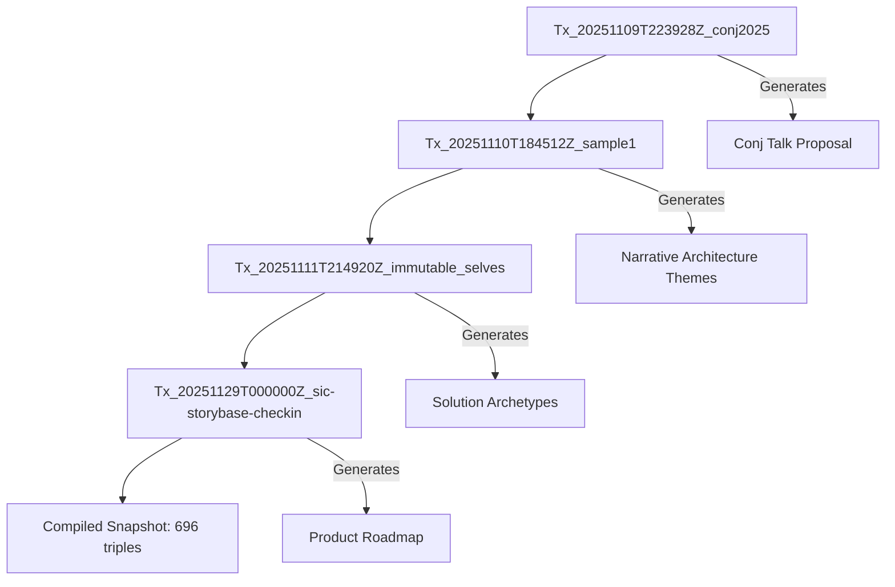
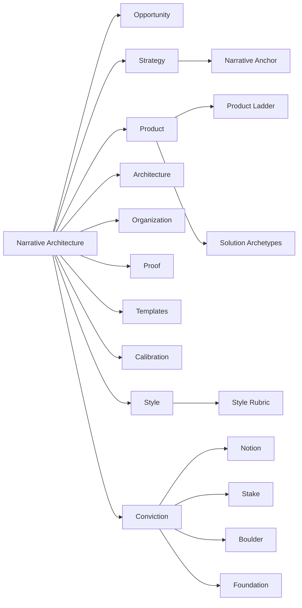
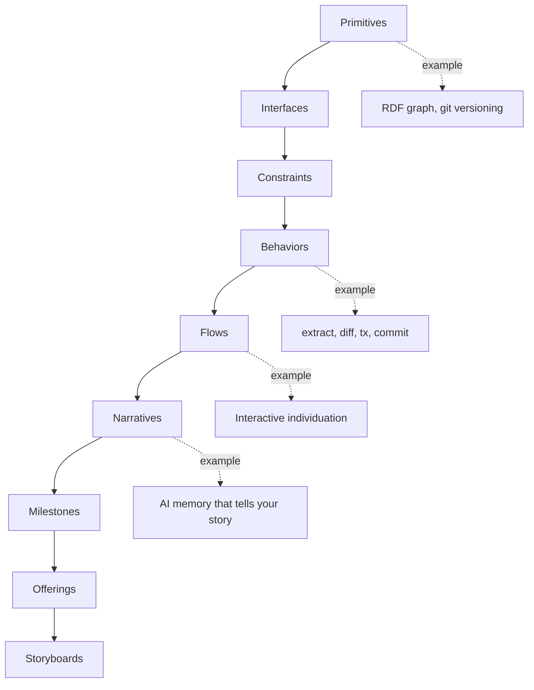

# storyBASE State & Overview

## State

The storyBASE is an operational RDF knowledge graph tracking narrative architecture for identity systems and AI memory platforms. The graph currently holds **696 triples** across **4 transactions**, encoding strategic positioning, product architecture, style guidelines, and proof points for two interconnected product narratives: **berecognized.id** (immutable human identification) and **aswritten.ai** (immutable AI identity/memory).

The graph demonstrates a **functional approach to identity**—treating identity as compiled state rendered from append-only logs rather than mutable profiles[^foundation]. This architectural principle bridges Clojure's immutability guarantees into organizational strategy, product design, and AI individuation[^immutable-selves].

[^foundation]: From `narr:Mission_1`: "Move identity from mutable documents and profiles to compiled surfaces rendered from append-only logs and single sources of truth." Generated by transaction `Tx_20251111T214920Z_immutable_selves`.

[^immutable-selves]: From `narr:WhatIsIt_1`: "A vision for human and AI identity as compiled from immutable source of truth, applying Clojure principles to identity systems." Source: `narr:Sample_1` (Immutable Selves talk).

---

## Stories

### `/README.story`
**Intent:** Auto-generated repository documentation that surfaces the current state, transaction history, and asset structure of the storyBASE.

**Relationship to Whole:** Meta-narrative artifact—explains *how* the storyBASE works and *what* it contains, making the system legible to new contributors and auditors.

**Approach:** Compile a hierarchical summary from the snapshot: state metrics → story intents → asset inventory → transaction provenance. Use mermaid diagrams to visualize transaction flow and concept hierarchies (e.g., Narrative Architecture taxonomy, Product Ladder, Conviction levels).

---

### `/presenter.story`
**Intent:** Template and reference guide for creating iA Presenter slide decks from storyBASE content, emphasizing narrative-first design and provenance-backed claims.

**Relationship to Whole:** Operationalizes the **Templates** domain of the Narrative Architecture[^templates]—shows how to render strategic narratives into presentation artifacts with consistent voice, structure, and citation conventions.

**Approach:** Demonstrate the iA Presenter format (headings, speaker notes, image placement, citation markers `^[]^`) using storyBASE examples. Emphasize the **write → structure → iterate → design → action** workflow, mapping it to the storyBASE's separation of primitives, flows, and narratives[^product-ladder].

[^templates]: From ontology `#Templates`: "Reusable, on-brand assets keep every touchpoint aligned with the narrative and speed execution."

[^product-ladder]: From ontology `#ProductLadder`: "How primitives become behaviors, flows, narratives, and milestones."

---

### `/conj-talk-2025.story`
**Intent:** Draft a Clojure Conj 2025 talk titled **"Immutable Selves: A Functional Approach to Digital Identity"** that bridges personal narrative (speaker's transition journey), technical architecture (Vouch.io, aswritten.ai), and Clojure principles applied to identity systems.

**Relationship to Whole:** **Proof** artifact[^proof]—validates the narrative architecture thesis through lived experience and deployed systems. Positions the speaker (Scarlet Dame) as both practitioner and exemplar of identity-as-append-only-log.

**Approach:** Structure the talk in five acts:
1. **Personal History:** Speaker's identity evolution (Dylan Butman → Scarlet Spectacular → Scarlet Dame) as append-only log[^actor-scarlet].
2. **Identity Model:** Define identity as integral of snapshots over time, not mutable present state[^theme-immutable].
3. **Failure Modes:** Centralized, mutable, OOP identity paradigms (passwords, deepfakes, synthetic identities)[^problem-context].
4. **Clojure Principles:** Immutability, explicit state, functional composition, data-first design applied to identity[^strategy-functional].
5. **Case Studies:** Vouch.io (enterprise identity platform) and aswritten.ai (AI memory/individuality)[^products].

Use iA Presenter format with citations to storyBASE nodes. Include diagrams threading from model → implementation[^proof-conj].

[^proof]: From ontology `#Proof`: "Evidence converts belief into commitment. This section curates the artifacts and results that validate claims with real-world outcomes."

[^actor-scarlet]: From `narr:Actor_ScarletDame`: "Speaker's identity history exemplifies append-only log model." Alternate labels: Dylan Butman, Scarlet Spectacular.

[^theme-immutable]: From `narr:Theme_ImmutableIdentity`: "Human and system identity modeled as integral of snapshots over time, not mutable present state."

[^problem-context]: From `narr:ProblemContext_2`: "AI models are black boxes; persona prompts mutate rendered state; no provenance or version control for AI identity. Stakes: narrative manipulation, embedded propaganda, deepfakes."

[^strategy-functional]: From `urn:uuid:strategy-functional-immutable-identity`: "Applies Clojure principles (immutability, explicit state, functional composition, data-first design, knowledge graphs) to create trustworthy identity systems."

[^products]: From `urn:uuid:product-vouch-io` and `urn:uuid:product-sic`: Vouch.io uses immutable event logs and delegation chains; Sic uses narrative-driven knowledge graphs for AI individuals with deterministic individuality and provenance.

[^proof-conj]: From `urn:uuid:proof-conj-2025-talk`: "Threaded diagrams from model to implementation, optional short demo with canned fallback."

---

## Assets

```
storyBASE/
├── .storyBASE/                          # Transaction log (append-only)
│   ├── 1762897917tx_provenance.sparql   # Tx metadata for immutable_selves extraction
│   ├── 1762897917add_style_metrics.sparql
│   ├── 1762897917add_solution_archetypes.sparql
│   ├── 1762897917add_narrative_anchors.sparql
│   ├── 1762800383add_sample1_narrative_architecture.sparql
│   ├── 1762731465sic-storybase-checkin.sparql
│   └── 1762728019add_conj_talk_2025_extraction.sparql
├── README.story                         # Meta-documentation story
├── presenter.story                      # iA Presenter template/guide
└── conj-talk-2025.story                 # Clojure Conj talk draft story
```

**`.storyBASE/`**: Immutable transaction log. Each `.sparql` file is an INSERT DATA operation timestamped and attributed to a user/agent. Transactions compile into the snapshot via sorted replay[^data-lifecycle].

**`*.story` files**: YAML front matter + Markdown prompt. The `model` field specifies which LLM(s) render the story from the compiled snapshot. Stories are regenerated on transaction commits or manual triggers[^story-generation].

[^data-lifecycle]: From `http://storybase.synthetic-identity.co/model/data-lifecycle-storybase`: "Append-only transaction log; immutable files; snapshot = replay of sorted transactions; provenance in TX step."

[^story-generation]: From `http://storybase.synthetic-identity.co/module/storybase-capabilities`: "story generation (YAML front matter + prompt to model outputs)."

---

## Transactions

### `Tx_20251109T223928Z_conj2025`
**Significance:** First extraction for Conj Talk 2025 proposal. Captures **Opportunity** (identity vulnerability crisis), **Strategy** (functional immutable identity architecture), **Products** (Vouch.io, Sic), **Proof** (conference talk), **Architecture** (append-only event logs, knowledge graphs), and **Organizations** (Vouch.io, Sic roles). Includes 11 style observations and 4 rubric assessments (Clarity: 4.5/5, Technical Depth: 4.8/5, Narrative Coherence: 4.6/5, Audience Engagement: 4.3/5)[^tx-conj].

[^tx-conj]: Transaction `narr:Tx_20251109T223928Z_conj2025` generated 60+ nodes including `urn:uuid:opportunity-identity-vulnerability`, `urn:uuid:strategy-functional-immutable-identity`, `urn:uuid:product-vouch-io`, `urn:uuid:product-sic`, `urn:uuid:proof-conj-2025-talk`.

---

### `Tx_20251110T184512Z_sample1`
**Significance:** Extracts narrative architecture from a voice memo ("Punch talk conceptual framing"). Introduces **Themes** (Immutable Identity as Append-Only Log, Transition as State Machine), **Actors** (Scarlet Dame, Luke Vanderhart), and **Anchor** (Narrative Architecture for Identity Systems). Includes 6 style observations (brand name stylization, idiolect phrasing, metaphor, analogy, short punchy cadence, first-person POV) and 9 rubric assessments (Register: 4/5, Phrasing: 3.5/5, Cadence: 3/5, Strategic Alignment: 4.5/5, Tailoring: 4/5, Resonance: 4.5/5, Flow: 3/5, Novelty: 4/5, Accuracy: 4/5)[^tx-sample1].

[^tx-sample1]: Transaction `narr:Tx_20251110T184512Z_sample1` generated `narr:Theme_ImmutableIdentity`, `narr:Theme_TransitionAsStateChange`, `narr:Actor_ScarletDame`, `narr:Anchor_NarrativeArchitecture`, and 6 style observations with Web Annotation targets.

---

### `Tx_20251111T214920Z_immutable_selves`
**Significance:** Core extraction from "Immutable Selves talk" (5,847 chars). Establishes **Narrative Anchors** (Tagline, WhatIsIt, Mission, Vision, Key Phrases), **Solution Archetypes** (berecognized.id: Immutable Identification; aswritten.ai: Immutable AI Identity), and **Style Metrics** (avg sentence length: 15.2, active voice ratio: 0.85, jargon density: 0.12). Defines the canonical flow: SSoT → query → render → event-driven transactions → append-only log → recompile[^tx-immutable].

[^tx-immutable]: Transaction `narr:Tx_20251111T214920Z_immutable_selves` generated `narr:Tagline_1` ("Immutable Selves: A Functional Approach to Digital Identity"), `narr:Mission_1`, `narr:Vision_1`, `narr:Archetype_1` (berecognized.id), `narr:Archetype_2` (aswritten.ai), and `narr:StyleMetrics_1`.

---

### `Tx_20251129T000000Z_sic-storybase-checkin`
**Significance:** Product & strategy check-in for storyBASE/aswritten.ai. Captures **Opportunity** (AI context requirements), **Timing Thesis** (2024-2026 window), **Positioning Thesis** (extend software rigor into strategy/content), **Moat Leverage** (git-native, versionable AI memory), **Product Overview** (n8n prototype, MCP server, compile/extract/diff/tx/commit tools), **Roadmap** (TriG named graphs, SHACL validation, individuation pipeline, marketplace), **System Topology** (n8n orchestration, MCP exposure, Docker Compose on Digital Ocean), and **Process** (interactive individuation vs. automated ingestion). Includes 10 style observations and 9 rubric assessments (Strategic Alignment: 4/5, Accuracy: 4/5, Register Fit: 3.5/5)[^tx-checkin].

[^tx-checkin]: Transaction `http://storybase.synthetic-identity.co/transaction/2025-01-29T000000Z_sic-storybase-checkin` generated `http://storybase.synthetic-identity.co/opportunity/storybase-market`, `http://storybase.synthetic-identity.co/thesis/timing-storybase`, `http://storybase.synthetic-identity.co/product/overview-storybase`, `http://storybase.synthetic-identity.co/roadmap/narrative-storybase`.

---

## Mermaid Diagrams

### Transaction Flow


### Narrative Architecture Hierarchy (Top Concepts)


### Product Ladder (Primitives → Offerings)


---

**End of README**