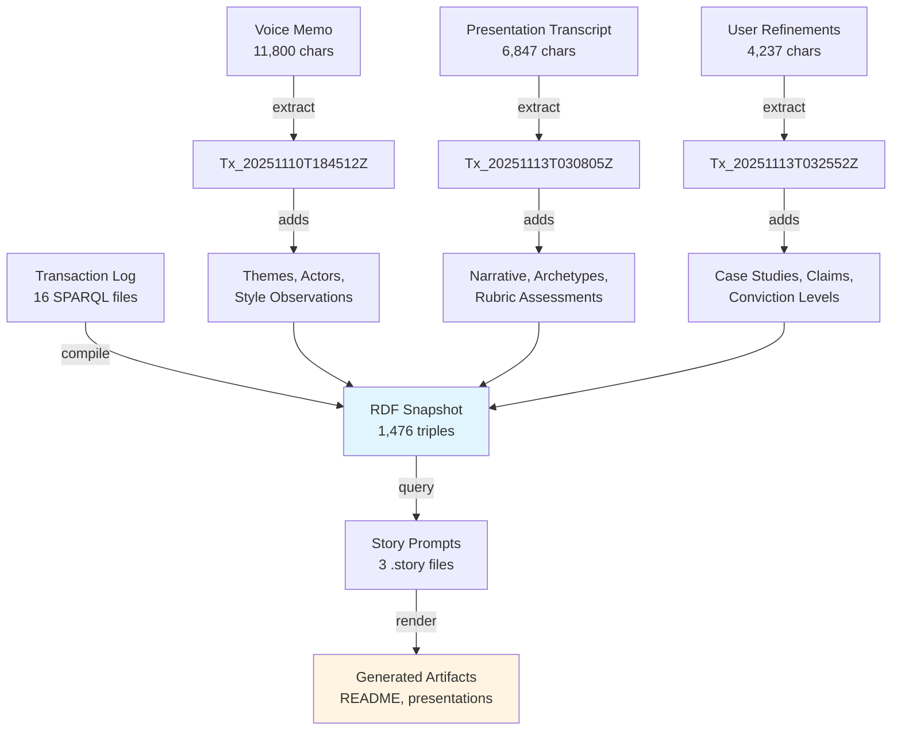

# State

The storyBASE currently holds a rich narrative architecture centered on **immutable identity systems** derived from Clojure functional programming principles. The graph contains three primary samples documenting the evolution of the "Immutable Selves" talk for Clojure/conj 2025, plus one strategic check-in on the storyBASE product itself.[^state-samples]

The knowledge graph encodes:
- **Two solution archetypes**: berecognized.id (human identity) and aswritten.ai (AI memory)[^archetypes]
- **Core narrative**: identity as append-only log compiled to state, not mutable objects[^narrative]
- **Strategic positioning**: functional paradigm for deterministic, auditable, decentralized identity[^positioning]
- **Style observations**: brand stylization, rhetorical devices, cadence patterns, and rubric assessments across samples[^style]
- **Product roadmap**: storyBASE as Git-native RDF narrative source of truth for AI memory[^product]

The graph demonstrates **high strategic alignment** (rubric scores 4.5–5.0) and **strong technical depth** (4.8/5.0), with consistent voice across conversational transcripts and technical refinements.[^rubric]

[^state-samples]: Three samples from narr:Sample_1 (voice memo, user message refinements), narr:Sample_ConjPresentation_2025 (presentation transcript), and storybase.synthetic-identity.co/sample/2025-01-29T000000Z_sic-storybase-checkin (product check-in).
[^archetypes]: narr:SolutionArchetype_BeRecognized and narr:SolutionArchetype_AsWritten, both generated by Tx_20251113T030805Z_conj2025.
[^narrative]: narr:Narrative_ImmutableIdentity: "Identity—both human and AI—should be modeled as an append-only log that compiles to state, not mutable objects."
[^positioning]: narr:PositioningThesis_1: "For developers and identity architects who treat identity as mutable state, this is a functional paradigm that makes identity deterministic, auditable, and decentralized—by applying Clojure's immutability principles."
[^style]: 40+ style observations (narr:StyleObs_*) covering brand stylization, metaphors, anaphora, rhetorical questions, and cadence patterns.
[^product]: storybase.synthetic-identity.co/product/overview-storybase: "RDF narrative source of truth (storyBASE) that steers AI output, making it specific, controllable, aligned with organizational worldview."
[^rubric]: narr:RubricAssess_Strategy_Conj (5.0), narr:RubricAssess_Tailoring_Conj (5.0), urn:uuid:rubric-technical-depth (4.8).

---

# Stories

## README.story
**Intent**: Auto-generated repository overview tracking storyBASE state, stories, assets, and transaction history.

**Relationship to whole**: Meta-narrative document that provides entry point and orientation for the entire knowledge graph; serves as living index.

**Approach**: Compile current snapshot state → enumerate .story files and their purposes → map /.storyBASE transaction files → summarize each transaction's contribution to graph evolution. Use mermaid diagrams to visualize transaction flow and narrative architecture topology.[^readme-approach]

[^readme-approach]: Story prompt requests: "Summarize the current state of the storyBASE… Create a section for each story… Briefly summarize the repository structure… Briefly summarize each transaction (sort by newest first)."

## presenter.story
**Intent**: General-purpose presentation template demonstrating storyBASE-to-IA Presenter workflow.

**Relationship to whole**: Reference implementation showing how narrative architecture (Strategy → Product → Proof) maps to presentation structure; validates that storyBASE can generate coherent, on-brand artifacts.

**Approach**: Extract core narrative anchors (Tagline, Mission, Vision) → map Product Ladder (Primitives → Behaviors → Flows) to slide progression → apply Style profile (ShortPunchyCadence, SecondPerson, RhetoricalDevices) → cite provenance for each claim using caret-bracket notation.[^presenter-approach]

[^presenter-approach]: Template format specifies: "Focus on presenting clear narrative statements in the slide copy and provide a brief talk track for each slide… Always include direct citations that explain human readable provenance."

## conj-talk-2025.story
**Intent**: Clojure/conj 2025 conference talk on immutable identity systems, targeting functional programming practitioners.

**Relationship to whole**: **Primary proof artifact** demonstrating narrative architecture in action; embodies the "Immutable Selves" thesis and validates both berecognized.id and aswritten.ai solution archetypes.[^conj-primary]

**Approach**: 
1. Open with personal narrative (Dylan → Scarlet Dame identity evolution as append-only log analogy)[^personal]
2. Establish problem context (Backbone.js mutable DOM → Om/React functional rendering :: mutable identity → compiled identity)[^problem]
3. Present solution archetypes (berecognized.id for humans, aswritten.ai for AI)[^solutions]
4. Detail technical patterns (SSoT → query → render → event → transact → recompile)[^patterns]
5. Close with deterministic AI vision and interactive chat demo[^vision]

Apply high-conviction style: short punchy sentences (avg 12.3 words), triadic structures, anaphora, second-person direct address, Clojure community idioms ("No frameworks / Simple tools ± good principles").[^style-conj]

[^conj-primary]: narr:RubricAssess_Strategy_Conj: "Entire presentation is a narrative anchor: 'Immutable Selves' thesis; two solution archetypes (berecognized.id, aswritten.ai); clear mission/vision alignment."
[^personal]: narr:Actor_ScarletDame with altLabels "Dylan Butman", "Scarlet Spectacular"; narr:Theme_TransitionAsStateChange: "Personal transition (gender, professional) as functional transformation from immutable past states."
[^problem]: narr:ComparativeAnalysis_1: "Backbone.js (query DOM, mutate picture) vs. Om/React (state machine, pure function render). Identity systems today are Backbone; this is Om for identity."
[^solutions]: narr:SolutionArchetype_BeRecognized (Datomic SSoT, datalog query) and narr:SolutionArchetype_AsWritten (RDF+git SSoT, SPARQL query).
[^patterns]: narr:Flow_1: "SSoT → query → render → interact → event → transact → append log → recompile SSoT."
[^vision]: narr:FutureVision_DeterministicAI: "Examples: full talk as query, section of talk, talk evolution over time, any accessible graph subset within billion-node graph."
[^style-conj]: narr:Metrics_ConjPresentation: AverageSentenceLength 12.3, ActiveVoiceRatio 0.82, Conciseness 0.78; narr:RubricAssess_Cadence_Conj (4.5): "Short, punchy sentences; triadic structures; anaphora creates rhythm."

---

# Assets

```
/.storyBASE/
  1763004456add_sample1_narrative_triples.sparql
  1763003388add_conj_presentation_2025.sparql
  1762897917update_sample_metadata.sparql
  1762897917tx_provenance.sparql
  1762897917add_technical_explainers.sparql
  1762897917add_style_observations.sparql
  1762897917add_style_metrics.sparql
  1762897917add_strategy_overview.sparql
  1762897917add_solution_archetypes.sparql
  1762897917add_rubric_assessments.sparql
  1762897917add_product_ladder.sparql
  1762897917add_narrative_anchors.sparql
  1762897917add_case_studies.sparql
  1762800383add_sample1_narrative_architecture.sparql
  1762731465sic-storybase-checkin.sparql
  1762728019add_conj_talk_2025_extraction.sparql

/README.story
/presenter.story
/conj-talk-2025.story
```

**/.storyBASE/**: Append-only transaction log containing 16 SPARQL INSERT DATA files, sorted by Unix timestamp. Each transaction adds narrative triples (claims, style observations, rubric assessments, case studies) to the knowledge graph. Transactions are immutable; the snapshot is compiled by replaying them in order.[^tx-log]

**Story files**: YAML front matter + Markdown prompts that generate artifacts (README, presentations) by querying the compiled snapshot. Stories are render targets; the storyBASE is the single source of truth.[^story-files]

[^tx-log]: storybase.synthetic-identity.co/model/data-lifecycle-storybase: "Append-only transaction log; immutable files; snapshot = replay of sorted transactions; provenance in TX step."
[^story-files]: Story prompt structure: "Use the storyBASE exclusively as your memory and source of truth to write stories from .story prompts."

---

# Transactions

## 1763004456add_sample1_narrative_triples.sparql
**Generated**: 2025-11-13T03:25:52Z  
**Significance**: Refinements for reified change design pattern section; adds two case studies (berecognized.id, aswritten.ai) with detailed context, intervention, and results. Introduces **Risk_GhostLabor** (North Korea deepfakes) and **Flow_EmployeeLifecycle** (continuous identity establishment). Adds 10 style observations (brand stylization, metaphors, rhetorical questions, parallelism) and 9 rubric assessments (Register 4.0, Phrasing 4.5, Strategy 4.5). Establishes **Claim_ReifiedChangePattern** with Conviction_Stake level and two supporting system properties (ImmutabilityProvenance, DistributedDecentralization) at Conviction_Boulder.[^tx-latest]

[^tx-latest]: narr:Tx_20251113T032552Z_sample1; narr:Sample_1 dct:extent "4237", skos:note "Refinements for reified change design pattern section; case studies: berecognized.id and aswritten.ai."

## 1763003388add_conj_presentation_2025.sparql
**Generated**: 2025-11-13T03:08:05Z  
**Significance**: Full extraction of Clojure/conj 2025 presentation transcript (6,847 chars). Establishes **Narrative_ImmutableIdentity** as core thesis, **Theme_FunctionalIdentity** as positioning, and two actors (Human, AI) with distinct source-of-truth properties. Adds **Tagline_AsWritten** ("AI that tells your story, as written"). Creates 10 style observations emphasizing brand stylization (lowercase .id/.ai domains), anaphora, rhetorical questions, and Clojure community idioms. Rubric assessments show perfect strategic alignment (5.0) and tailoring (5.0) for technical audience.[^tx-conj]

[^tx-conj]: narr:Tx_20251113T030805Z_conj2025; narr:Sample_ConjPresentation_2025 dct:source "Clojure/conj 2025 presentation: Immutable Selves"; narr:RubricAssess_Strategy_Conj rdf:value 5.0.

## 1762897917update_sample_metadata.sparql
**Generated**: 2025-11-11T21:49:20Z  
**Significance**: Metadata correction updating narr:Sample_1 source to "Immutable Selves talk" and length to 5,847. Demonstrates graph mutability via DELETE/INSERT WHERE pattern while maintaining provenance.[^tx-update]

[^tx-update]: Transaction uses DELETE/INSERT WHERE to update dct:source, narr:inputLength, dct:created while preserving prov:wasGeneratedBy link.

## 1762897917tx_provenance.sparql
**Generated**: 2025-11-11T21:49:20Z  
**Significance**: Transaction-level provenance record for Tx_20251111T214920Z_immutable_selves, listing 40+ generated entities (taglines, key phrases, positioning thesis, moat leverage, primitives, behaviors, flows, narratives, archetypes, case studies, style observations, rubric assessments, metrics). Establishes comprehensive provenance chain.[^tx-prov]

[^tx-prov]: narr:Tx_20251111T214920Z_immutable_selves prov:generated narr:Sample_1, narr:Tagline_1, narr:Mission_1, narr:Vision_1, etc.

## 1762897917add_technical_explainers.sparql
**Generated**: 2025-11-11T21:49:20Z  
**Significance**: Adds three technical explainers: **LeverageProfile_1** (immutability enables equality, provenance, versioning for free), **DesignTradeoff_1** (single transactor bottleneck vs. consistency), **ComparativeAnalysis_1** (Backbone.js vs. Om/React analogy for identity systems). Grounds architectural claims in concrete tradeoffs.[^tx-explainers]

[^tx-explainers]: narr:LeverageProfile_1 rdf:value "Immutability enables equality, provenance, versioning, branching, generative testing, decentralization, and infinite read scale—for free."

## 1762897917add_style_observations.sparql
**Generated**: 2025-11-11T21:49:20Z  
**Significance**: Adds 8 style observations using Web Annotation Ontology (oa:Annotation) with TextPositionSelector and TextQuoteSelector for precise provenance. Captures formula-style cadence, stock phrases ("Your code was shit"), anaphora ("Then you…"), brand stylization ("scarlet dame"), core analogy (identity = Backbone.js), rhetorical questions, second-person address, and verb choice ("mutated"). Establishes style fingerprint for speaker idiolect.[^tx-style]

[^tx-style]: narr:StyleObs_1 through narr:StyleObs_8; uses oa:TextPositionSelector with start/end offsets and oa:TextQuoteSelector with exact/prefix/suffix for reproducible citation.

## 1762897917add_style_metrics.sparql
**Generated**: 2025-11-11T21:49:20Z  
**Significance**: Quantifies style with **StyleMetrics_1**: AverageSentenceLength 15.2, ActiveVoiceRatio 0.85, JargonDensity 0.12, TypeTokenRatio 0.68, Conciseness 0.78. Provides baseline for drift detection and voice consistency measurement.[^tx-metrics]

[^tx-metrics]: narr:StyleMetrics_1 skos:note "Short sentences, high active voice, moderate jargon (technical audience), good lexical diversity, concise."

## 1762897917add_strategy_overview.sparql
**Generated**: 2025-11-11T21:49:20Z  
**Significance**: Establishes **PositioningThesis_1** (functional paradigm for identity) and **MoatLeverage_1** (Clojure ecosystem as proof-of-concept, 13 years production experience). Anchors strategic narrative to technical credibility and compounding advantage.[^tx-strategy]

[^tx-strategy]: narr:MoatLeverage_1 rdf:value "Clojure ecosystem (Datomic, datalog, re-frame) as proof-of-concept; 13 years of production experience; provenance and equality by design."

## 1762897917add_solution_archetypes.sparql
**Generated**: 2025-11-11T21:49:20Z  
**Significance**: Defines two solution archetypes (Archetype_1: berecognized.id, Archetype_2: aswritten.ai) with structured components: ArchetypeTitle, ProblemContext, ApproachPattern, RequiredCapabilities, OutcomesProof. Maps identical functional pattern (SSoT → query → render → event → transact) to different stacks (Datomic vs. RDF+git).[^tx-archetypes]

[^tx-archetypes]: narr:ApproachPattern_1 (Datomic/datalog) vs. narr:ApproachPattern_2 (RDF+git/SPARQL); both follow "SSoT → query → render → event-driven transactions → append-only log → recompile."

## 1762897917add_rubric_assessments.sparql
**Generated**: 2025-11-11T21:49:20Z  
**Significance**: Applies 9-dimension rubric (Register, Phrasing, Cadence, Strategic Alignment, Tailoring, Resonance, Flow, Novelty, Accuracy) to narr:Sample_1. Scores range 3.5–5.0, with perfect strategic alignment (5.0) and strong tailoring (4.5). Links assessments to supporting style observations for traceability.[^tx-rubric]

[^tx-rubric]: narr:RubricAssess_4 (Strategic Alignment) rdf:value 5.0, skos:note "Entire talk is the narrative anchor: immutability → identity. Mission, vision, key phrases all present and consistent."

## 1762897917add_product_ladder.sparql
**Generated**: 2025-11-11T21:49:20Z  
**Significance**: Builds Product Ladder from primitives (append-only log, SSoT, pure function renderer) → behavior (event-driven transactions) → flow (SSoT → query → render → interact → event → transact → recompile) → narrative ("From mutable documents to compiled selves"). Demonstrates how atomic units compose into end-to-end value story.[^tx-ladder]

[^tx-ladder]: narr:Primitive_1, narr:Primitive_2, narr:Primitive_3 → narr:Behavior_1 → narr:Flow_1 → narr:Narrative_1; all skos:broader narr:ProductLadder.

## 1762897917add_narrative_anchors.sparql
**Generated**: 2025-11-11T21:49:20Z  
**Significance**: Establishes core narrative anchors: **Tagline_1** ("Immutable Selves: A Functional Approach to Digital Identity"), **Mission_1** (move identity from mutable to compiled), **Vision_1** (identity rendered from immutable history), and four key phrases (single source of truth, append-only log, pure function, digital twin). Provides canonical language for all downstream artifacts.[^tx-anchors]

[^tx-anchors]: narr:Tagline_1, narr:Mission_1, narr:Vision_1, narr:KeyPhrase_1 through narr:KeyPhrase_4; all skos:broader narr:NarrativeAnchor.

## 1762897917add_case_studies.sparql
**Generated**: 2025-11-11T21:49:20Z  
**Significance**: Documents **CaseStudy_1** (speaker's 13-year Clojure career) with structured components: CaseContext (Backbone.js → Om → production systems), CaseIntervention (applied Clojure principles to UI then identity), CaseResults (provenance, equality, versioning achieved), CaseLessons (same principles apply across domains). Validates positioning thesis with lived proof.[^tx-case]

[^tx-case]: narr:CaseStudy_1 skos:broader narr:Proof; narr:CaseResults_1 rdf:value "Provenance, equality, versioning, decentralization, infinite read scale achieved; systems in production."

## 1762800383add_sample1_narrative_architecture.sparql
**Generated**: 2025-11-10T18:45:12Z  
**Significance**: First extraction from voice memo (11,800 chars) outlining narrative architecture framework. Introduces **Theme_ImmutableIdentity** and **Theme_TransitionAsStateChange**, actors (ScarletDame, LukeVanderhart), and **Anchor_NarrativeArchitecture** concept. Adds 7 style observations (brand "storyBASE", idiolect "append-only log", UI state machine metaphor, transition analogy, short clauses, first-person narrative) and 9 rubric assessments. Lower flow score (3.0) reflects voice memo format with tangents.[^tx-voice]

[^tx-voice]: narr:Sample_1 dct:source "Voice memo: Punch talk conceptual framing", narr:inputLength 11800; narr:RubricAssess_Flow rdf:value 3.0, skos:note "Coherent arc; some tangents/self-corrections (voice memo); transitions informal."

## 1762731465sic-storybase-checkin.sparql
**Generated**: 2025-11-09T23:37:05Z  
**Significance**: Strategic product check-in (18,437 chars) documenting storyBASE market opportunity, timing thesis, positioning, moat, product overview, roadmap, and system topology. Establishes storyBASE as "RDF narrative source of truth that steers AI output" with modules (compile, extract, diff, tx, commit), integrations (n8n, MCP, GitHub, Outseta, Helicone), and planned features (named graphs, SHACL validation, marketplace). Adds 10 style observations and 9 rubric assessments. Lower resonance score (3.0) suggests need for more stories/analogies.[^tx-checkin]

[^tx-checkin]: storybase.synthetic-identity.co/sample/2025-01-29T000000Z_sic-storybase-checkin; storybase.synthetic-identity.co/roadmap/narrative-storybase: "Move transactions from SPARQL to named graphs (TriG); add SHACL validation; implement evolved individuation pipeline."

## 1762728019add_conj_talk_2025_extraction.sparql
**Generated**: 2025-11-09T22:39:28Z  
**Significance**: First extraction for Conj Talk 2025 proposal (3,421 chars). Captures narrative architecture (Opportunity, Strategy, Product, Proof, Architecture, Organization), two products (Vouch.io, Sic), functional immutable identity strategy, and immutable identity system patterns. Adds 11 style observations and 4 rubric assessments (Clarity 4.5, Technical Depth 4.8, Narrative Coherence 4.6, Audience Engagement 4.3). Establishes foundation for subsequent refinements.[^tx-first]

[^tx-first]: narr:Tx_20251109T223928Z_conj2025; urn:uuid:opportunity-identity-vulnerability: "Centralized, mutable identity systems vulnerable to deepfakes, synthetic identities, and impersonation fraud."

---



**Transaction flow**: Samples (voice memos, transcripts, refinements) → extraction transactions → RDF triples → compiled snapshot → story queries → generated artifacts. Each transaction maintains full provenance (prov:wasGeneratedBy, prov:wasAttributedTo, prov:generatedAtTime) and uses anthropic/claude-sonnet-4.5 model.[^flow]

[^flow]: All transactions include prov:wasAssociatedWith storyTWIN agent, prov:wasAttributedTo pleasetrythisathome, and storytwin:model "anthropic/claude-sonnet-4.5".