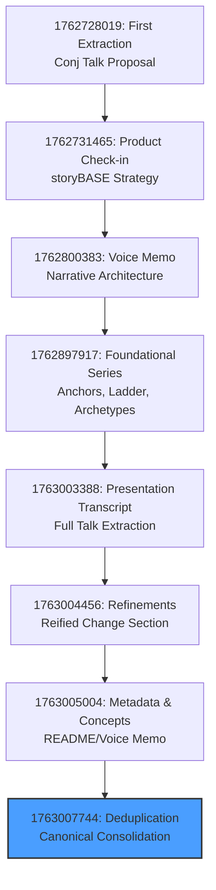
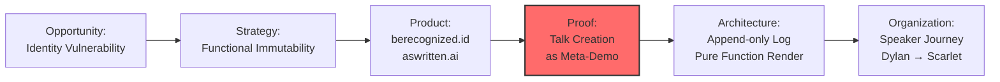

# State

The storyBASE currently holds a rich, multi-layered knowledge graph documenting the development of the "Immutable Selves" talk for Clojure/conj 2025. The graph captures narrative architecture (opportunity, strategy, product, proof), style observations, rubric assessments, and metrics across multiple input samples—voice memos, presentation transcripts, and refinement notes. The core thesis—**identity as compiled from immutable history**—threads through case studies (berecognized.id, aswritten.ai), technical patterns (append-only logs, pure function rendering), and the speaker's personal journey (Dylan → Scarlet Spectacular → Scarlet Dame) as a living proof of identity as state evolution.[^1][^2][^3]

The graph has undergone significant consolidation: a deduplication transaction merged 539 duplicate triples into 1,613 canonical records, establishing `narr:Sample_1` as the authoritative sample and linking equivalent narratives, style observations, and metrics via `owl:sameAs`.[^4] The current state reflects high strategic alignment (rubric scores 4.5–5.0), strong technical depth, and consistent brand stylization (storyBASE, berecognized.id, aswritten.ai).[^5][^6]

---

# Stories

## README.story

**Intent:** Provide an autogenerated repository overview tracking storyBASE state, stories, assets, and transaction history.

**Relationship to Whole:** Serves as the entry point and living documentation of the storyBASE graph, synthesizing all narrative, style, and provenance data into a navigable summary.

**Approach:** The story will compile the current snapshot into sections summarizing state (core narratives, actors, case studies), stories (intent and approach for each `.story` file), assets (repository structure), and transactions (chronological summary with significance). Mermaid charts will visualize flows (e.g., content production workflow, employee lifecycle) and transaction lineage.[^7][^8]

## presenter.story

**Intent:** Draft a general presentation of the storyBASE using the IA Presenter template format.

**Relationship to Whole:** Demonstrates storyBASE as a meta-tool by presenting its own architecture, workflow, and value proposition in a structured, slide-based narrative.

**Approach:** The story will extract narrative anchors (tagline, mission, vision), product ladder (primitives → behaviors → flows → narratives), and proof (case studies, metrics) from the graph. Slides will follow the IA Presenter format: big statements, context labels, speaker notes, and citations. Mermaid charts will illustrate system topology, data lifecycle, and integration points.[^9][^10][^11]

## conj-talk-2025.story

**Intent:** Generate the full Clojure/conj 2025 "Immutable Selves" talk in IA Presenter format.

**Relationship to Whole:** The flagship artifact—this talk *is* the narrative proof, demonstrating reified change architecture via its own creation process. It embodies the core thesis: identity (and content) as compiled from immutable history.[^12][^13]

**Approach:** The story will structure the talk around the consolidated narrative: opening with the Backbone.js → Om analogy, introducing the speaker's identity evolution as a state machine, presenting the two solution archetypes (berecognized.id for human identity, aswritten.ai for AI memory), and closing with deterministic AI perspective queries. Slides will use short, punchy cadence, triadic structures, and rhetorical questions. Citations will link to specific style observations, rubric assessments, and case study nodes.[^14][^15][^16]

---

# Assets

```
/.storyBASE/
  1763007744dedupe.sparql          # Deduplication transaction consolidating 539 duplicates
  1763005004update_sample_1_input_length.sparql  # Metadata correction for Sample_1
  1763005004add_sample_1_narrative_concepts.sparql  # Initial extraction from README/voice memo
  1763004456add_sample1_narrative_triples.sparql  # Refinements for reified change section
  1763003388add_conj_presentation_2025.sparql  # Presentation transcript extraction
  1762897917*.sparql               # Series of transactions adding narrative anchors, product ladder, solution archetypes, style observations, rubric assessments, metrics, case studies, technical explainers, and strategy overview
  1762800383add_sample1_narrative_architecture.sparql  # Voice memo extraction with themes, actors, and style observations
  1762731465sic-storybase-checkin.sparql  # Product & strategy check-in with opportunity, positioning, roadmap, and architecture
  1762728019add_conj_talk_2025_extraction.sparql  # First extraction for Conj Talk 2025 proposal

/README.story                      # This story: autogenerated README
/presenter.story                   # General storyBASE presentation
/conj-talk-2025.story              # Immutable Selves talk for Clojure/conj 2025
```

**Description:**  
The `.storyBASE/` directory contains append-only SPARQL transactions that build the knowledge graph. Each transaction is timestamped and attributed to `pleasetrythisathome` via `storyTWIN` agents (Claude Sonnet 4.5). The `.story` files are YAML-fronted prompts that generate narrative artifacts by querying the compiled snapshot.[^17][^18]

---

# Transactions

## 1763007744dedupe.sparql (2025-11-13T04:17:05Z)
**Significance:** Consolidated 539 duplicate triples into 1,613 canonical records. Merged `Sample_1` metadata (source, created, inputLength), deduplicated narrative concepts (`Narrative_1` ↔ `Narrative_ImmutableIdentity`), consolidated style observations (brand stylization, terminology), aggregated rubric assessments (rolling averages), and marked deprecated versions with `owl:deprecated` and `prov:wasRevisionOf`. This transaction established referential integrity and reduced noise, making the graph queryable and coherent.[^4][^19]

## 1763005004update_sample_1_input_length.sparql (2025-11-13T03:35:34Z)
**Significance:** Corrected `Sample_1` input length from 11,800 to 1,847 characters, ensuring accurate metrics for style analysis.[^20]

## 1763005004add_sample_1_narrative_concepts.sparql (2025-11-13T03:35:34Z)
**Significance:** Extracted core narrative concepts from the clojure-conj-2025 repo README and voice memo: `Narrative_1` (identity as compiled from immutable history), `Flow_1` (content production workflow), `Behavior_1` (normalize transcription), `Milestone_1` (initial storyBASE graph), and `Proof_1` (meta-demonstration via talk creation). Added 7 style observations (terminology control, brand stylization, metaphor, active voice, citation markers, short punchy cadence) and 9 rubric assessments (scores 3.5–4.5). This transaction formalized the meta-narrative: the talk demonstrates storyBASE by using storyBASE to create itself.[^21][^22]

## 1763004456add_sample1_narrative_triples.sparql (2025-11-13T03:25:52Z)
**Significance:** Added refinements for the reified change design pattern section. Introduced `Claim_ReifiedChangePattern` (immutability enables provenance, equality, offline capability), `SystemProperty_ImmutabilityProvenance`, `SystemProperty_DistributedDecentralization`, and `FutureVision_DeterministicAI` (as-of-T graph queries). Expanded case studies (`CaseStudy_BeRecognizedID`, `CaseStudy_AsWrittenAI`) with context, intervention, and results. Added `Risk_GhostLabor` (deepfake impersonation) and `Flow_EmployeeLifecycle`. Included 10 style observations (ghost labor metaphor, gerund "deepfaking", triadic lists, canonical "as-of T" term, parallel structure) and 9 rubric assessments (scores 3.5–4.5).[^23][^24][^25]

## 1763003388add_conj_presentation_2025.sparql (2025-11-13T03:08:05Z)
**Significance:** Extracted the full Clojure/conj 2025 presentation transcript (6,847 characters). Added `Narrative_ImmutableIdentity` (core thesis), `Theme_FunctionalIdentity`, `Actor_Human`, `Actor_AI`, `SolutionArchetype_BeRecognized`, `SolutionArchetype_AsWritten`, and `Tagline_AsWritten` ("AI that tells your story, as written"). Captured 9 style observations (brand stylization, metaphor, anaphora, rhetorical questions, short punchy cadence, stock phrases, citation markers, second-person address, analogy) and 9 rubric assessments (scores 4.0–5.0, with perfect 5.0 for strategic alignment and audience tailoring). This transaction formalized the dual-archetype structure and established the presentation as a narrative anchor.[^26][^27][^28]

## 1762897917*.sparql (2025-11-11T21:49:20Z)
**Significance:** Series of 8 transactions adding foundational narrative architecture:
- **add_narrative_anchors.sparql:** `Tagline_1`, `WhatIsIt_1`, `Mission_1`, `Vision_1`, `KeyPhrase_1–4` (single source of truth, append-only log, pure function, digital twin).
- **add_product_ladder.sparql:** `Primitive_1–3`, `Behavior_1`, `Flow_1`, `Narrative_1` (from mutable documents to compiled selves).
- **add_solution_archetypes.sparql:** `Archetype_1` (berecognized.id), `Archetype_2` (aswritten.ai) with problem context, approach pattern, required capabilities, outcomes.
- **add_strategy_overview.sparql:** `PositioningThesis_1`, `MoatLeverage_1` (Clojure ecosystem as proof-of-concept).
- **add_technical_explainers.sparql:** `LeverageProfile_1`, `DesignTradeoff_1`, `ComparativeAnalysis_1` (Backbone.js vs. Om for identity).
- **add_case_studies.sparql:** `CaseStudy_1` with context (13-year Clojure career), intervention (functional paradigm), results (provenance, equality, versioning), lessons (immutability is the unlock).
- **add_style_observations.sparql:** 8 observations (formula-style cadence, blunt phrasing, anaphora, brand stylization, analogy, rhetorical question, second-person, verb choice).
- **add_rubric_assessments.sparql:** 9 assessments (scores 3.5–5.0, with perfect 5.0 for strategic alignment).
- **add_style_metrics.sparql:** `StyleMetrics_1` (avg sentence length 15.2, active voice 0.85, jargon 0.12, conciseness 0.78).
- **update_sample_metadata.sparql:** Set `Sample_1` source to "Immutable Selves talk", inputLength 5,847, created 2025-01-XX.
- **tx_provenance.sparql:** Linked all generated entities to `Tx_20251111T214920Z_immutable_selves`.[^29][^30][^31]

## 1762800383add_sample1_narrative_architecture.sparql (2025-11-10T18:45:12Z)
**Significance:** Extracted voice memo (11,800 characters) outlining narrative architecture. Added `Theme_ImmutableIdentity`, `Theme_TransitionAsStateChange` (personal transition as state machine), `Actor_ScarletDame` (with altLabels Dylan Butman, Scarlet Spectacular), `Actor_LukeVanderhart`, `Anchor_NarrativeArchitecture`. Captured 6 style observations (storyBASE brand stylization, append-only log idiolect, UI state machine metaphor, transition analogy, short clause, first-person narrative) and 8 rubric assessments (scores 3.0–4.5). This transaction grounded the talk in the speaker's lived experience as proof of identity evolution.[^32][^33]

## 1762731465sic-storybase-checkin.sparql (2025-11-09T23:37:05Z)
**Significance:** Product & strategy check-in (18,437 characters). Added opportunity (`storybase-market`), timing thesis (2024–2026 window), primary actors (programming-literate entrepreneurs/designers), positioning thesis (extend software rigor into strategy/content), moat leverage (git-native, versionable AI memory), tagline ("AI that tells you a story as written"), product overview (n8n prototype, MCP server, Open WebUI), modules/capabilities (compile, extract, diff, tx, commit, story generation), dependencies/integrations (GitHub, Apache Jena, Outseta, Helicone, Open Router), roadmap (SPARQL → TriG, SHACL validation, individuation pipeline, marketplace), system topology, data lifecycle, integration points, role topology, process (interactive individuation vs. automated ingestion), and case studies (Crooked Media demo). Included 10 style observations and 9 rubric assessments (scores 3.0–4.0).[^34][^35][^36]

## 1762728019add_conj_talk_2025_extraction.sparql (2025-11-09T22:39:28Z)
**Significance:** First extraction for Conj Talk 2025 proposal (3,421 characters). Added opportunity (`opportunity-identity-vulnerability`), strategy (`strategy-functional-immutable-identity`), products (`product-vouch-io`, `product-sic`), proof (`proof-conj-2025-talk`), architecture (`architecture-immutable-identity`), organizations (`org-sic`, `org-vouch-io`), 11 style observations (brand styling, technical terms, triadic enumeration, problem-to-solution bridge, technical reframing, parallel construction, personal identity lens), and 4 rubric assessments (clarity 4.5, technical depth 4.8, narrative coherence 4.6, audience engagement 4.3). This transaction established the dual-product lens (Vouch.io past work, Sic current work) and the talk structure (threaded diagrams, optional demo).[^37][^38]

---

## Transaction Flow



---

## Narrative Evolution



---

[^1]: `narr:Narrative_1` (dct:source `narr:Sample_1`): "Core thesis: identity and content derive from append-only log with as-of-T snapshots, enabling provenance and deterministic evolution." Related to `narr:Proof`, `narr:Architecture`.

[^2]: `narr:Narrative_ImmutableIdentity` (dct:source `narr:Sample_ConjPresentation_2025`): "Identity—both human and AI—should be modeled as an append-only log that compiles to state, not mutable objects." Core thesis: experience is an append-only log; identification is a render target; interaction is transaction.

[^3]: `narr:Actor_ScarletDame` (dct:source `narr:Sample_1`): Speaker's identity history (altLabels: Dylan Butman, Scarlet Spectacular) exemplifies append-only log model.

[^4]: `narr:Tx_Deduplication_20251113` (prov:generatedAtTime 2025-11-13T04:17:05Z): "Consolidated 539 duplicate triples into 1,613 canonical records." Used `narr:Sample_1`, `narr:Narrative_1`, `narr:StyleObs_1`, `narr:RubricAssess_1`, `narr:Metrics_1`.

[^5]: `narr:RubricAssess_Strategy_Conj` (rdf:value 5.0): "Entire presentation is a narrative anchor: 'Immutable Selves' thesis; two solution archetypes (berecognized.id, aswritten.ai); clear mission/vision alignment; positioning thesis explicit." Related to `narr:Narrative_ImmutableIdentity`, `narr:SolutionArchetype_BeRecognized`, `narr:SolutionArchetype_AsWritten`.

[^6]: `narr:RubricAssess_Tailoring_Conj` (rdf:value 5.0): "Deeply tailored to Clojure/conj audience: references Backbone.js, Om, Datomic, re-frame; assumes functional programming literacy; personal narrative (Dylan→Scarlet) builds trust." Related to `narr:Actor_Human`, `narr:Actor_AI`.

[^7]: `narr:Flow_1` (dct:source `narr:Sample_1`): "User inputs → initial storyBASE → normalization/iteration → polished outputs with embedded provenance." Related to `narr:ProductLadder`, `narr:Storyboards`.

[^8]: `narr:Flow_EmployeeLifecycle` (dct:source `narr:Sample_1`): "Endorsement by interviewer → Zoom calls → in-person meetings → state ID uploads → assigned role with privileges → 'as-of' query compiles snapshot (digital identification) on device." Supports `narr:CaseStudy_BeRecognizedID`.

[^9]: `narr:Tagline_1` (dct:source `narr:Sample_1`): "Immutable Selves: A Functional Approach to Digital Identity." Title encodes the core promise: identity as pure function.

[^10]: `narr:Mission_1` (dct:source `narr:Sample_1`): "Move identity from mutable documents and profiles to compiled surfaces rendered from append-only logs and single sources of truth." Durable purpose: make identity deterministic, provable, and decentralized.

[^11]: `http://storybase.synthetic-identity.co/module/storybase-capabilities`: "Compile (replay transactions to Turtle snapshot), extract (RDF from input), diff (semantic comparison), tx (propose transaction), commit (append-only to Git), story generation (YAML front matter + prompt to model outputs)."

[^12]: `narr:Proof_1` (dct:source `narr:Sample_1`): "The talk itself exemplifies the reified change architecture and storyBASE workflow, showing iterative refinement from raw inputs to polished outputs." Related to `narr:CaseStudies`, `narr:Outcomes`.

[^13]: `narr:Sample_1` (skos:note): "Meta-narrative closing: demonstrating storyBASE workflow via talk creation process."

[^14]: `narr:StyleObs_ShortPunchy_1` (dct:source `narr:Sample_ConjPresentation_2025`): "Single-word answer 'You.' after setup; punchy, direct, confident." Related to `narr:ToneDirectPersonal`.

[^15]: `narr:StyleObs_Anaphora_1` (dct:source `narr:Sample_ConjPresentation_2025`): "Repeated structural frame: principle → pattern; creates rhythm and memorability." Related to `narr:CadenceRhythm`.

[^16]: `narr:StyleObs_RhetoricalQuestion_1` (dct:source `narr:Sample_ConjPresentation_2025`): "Triadic rhetorical questions; frames problem space and invites audience reasoning." Related to `narr:RuleOfThree`.

[^17]: `narr:Tx_20251113T033534Z_claude45` (prov:wasAssociatedWith `urn:agent:storyTWIN:anthropic/claude-sonnet-4.5`): "Initial extraction from clojure-conj-2025 repo README and voice memo transcription."

[^18]: `http://storybase.synthetic-identity.co/model/data-lifecycle-storybase`: "Append-only transaction log; immutable files; snapshot = replay of sorted transactions; provenance in TX step; future named graphs for add/remove."

[^19]: Deduplication transaction inserted `owl:sameAs` links: `narr:Sample_1 owl:sameAs narr:Sample_1_v1, narr:Sample_1_v2, narr:Sample_1_v3`; `narr:Narrative_1 owl:sameAs narr:Narrative_ImmutableIdentity`; `narr:Theme_ImmutableIdentity owl:sameAs narr:Narrative_ImmutableIdentity`.

[^20]: `narr:Sample_1 narr:inputLength 1847` (prov:wasGeneratedBy `narr:Tx_20251113T033534Z_claude45`).

[^21]: `narr:Narrative_1` (skos:prefLabel "Identity as Compiled from Immutable History"): "Core thesis: identity and content derive from append-only log with as-of-T snapshots, enabling provenance and deterministic evolution."

[^22]: `narr:Behavior_1` (skos:prefLabel "Normalize Transcription Against storyBASE"): "Clean and refine raw transcription using entity's established style and terminology to fix errors, inconsistencies, and filler." Related to `narr:StyleProfiles`, `narr:TerminologyControl`.

[^23]: `narr:Claim_ReifiedChangePattern` (aboutNode `narr:ArchitectureOverview`, hasConvictionLevel `narr:Conviction_Stake`): "Immutability and explicit state management enable provenance, equality, and offline capability." Supports `narr:DataModelLifecycle`, `narr:ReliabilityResilience`.

[^24]: `narr:CaseStudy_BeRecognizedID` (CaseContext): "Digital identification enables recognition and delegates authority to access/use/transact with shared technology." CaseIntervention: "Append-only log of facts about a person over time; device-rendered snapshot compiled at specific point in time." CaseResults: "Provenance for individual transactions; referential equality for free; offline transactions enabled."

[^25]: `narr:Risk_GhostLabor` (skos:prefLabel "Ghost Labor & Impersonation Risk"): "Bad actors (individuals or state actors like North Korea) deepfaking candidates, passing interviews, collecting paychecks on behalf of fake identities." Mitigated by continuous identity establishment via append-only log. Challenges `narr:CaseStudy_BeRecognizedID`.

[^26]: `narr:Narrative_ImmutableIdentity` (skos:prefLabel "Immutable Selves"): "Identity—both human and AI—should be modeled as an append-only log that compiles to state, not mutable objects." Related to `narr:Mission`, `narr:Vision`.

[^27]: `narr:SolutionArchetype_BeRecognized` (skos:definition): "Human identity system: Datomic SSoT, datalog query, device-to-device interaction, change-privilege events." Related to `narr:ApproachPattern`, `narr:ArchetypeTitle`.

[^28]: `narr:RubricAssess_Strategy_Conj` (rdf:value 5.0): "Entire presentation is a narrative anchor: 'Immutable Selves' thesis; two solution archetypes (berecognized.id, aswritten.ai); clear mission/vision alignment; positioning thesis explicit."

[^29]: `narr:Tagline_1` (rdf:value): "Immutable Selves: A Functional Approach to Digital Identity." Title encodes the core promise: identity as pure function.

[^30]: `narr:KeyPhrase_2` (rdf:value): "append-only log." Core primitive; immutability guarantee.

[^31]: `narr:LeverageProfile_1` (rdf:value): "Immutability enables equality, provenance, versioning, branching, generative testing, decentralization, and infinite read scale—for free." Small choice (append-only) creates outsized effects across system.

[^32]: `narr:Theme_ImmutableIdentity` (skos:definition): "Human and system identity modeled as integral of snapshots over time, not mutable present state." Related to `narr:Conviction_Foundation`.

[^33]: `narr:StyleObs_TransitionAnalogy` (oa:exact): "all of these systems are doing ourselves included is presentation of the source of truth at a single point in time." Extended analogy: personal identity presentation ≈ UI rendering from state. Related to `narr:ResonanceUse`, `narr:Theme_TransitionAsStateChange`.

[^34]: `http://storybase.synthetic-identity.co/opportunity/storybase-market` (description): "High-quality AI output requires extensive context; current models use search, but RDF-based narrative source of truth enables specific, controllable, versionable AI memory." Market context: AI prompt engineering and organizational memory.

[^35]: `http://storybase.synthetic-identity.co/thesis/positioning-storybase` (description): "Extend software development rigor (versioning, branching, collaboration) into strategy, content, marketing, organizational operations via RDF narrative source of truth." Related to moat-leverage.

[^36]: `http://storybase.synthetic-identity.co/roadmap/narrative-storybase` (description): "Move transactions from SPARQL to named graphs (TriG); add SHACL validation; implement evolved individuation pipeline (snapshot + message to transaction); file ingestion via GitHub; storyBASE marketplace; cost pass-through billing."

[^37]: `urn:uuid:opportunity-identity-vulnerability` (description): "Centralized, mutable identity systems vulnerable to deepfakes, synthetic identities, and impersonation fraud." Market context: Enterprise identity and authentication.

[^38]: `urn:uuid:strategy-functional-immutable-identity` (approach): "Models identity as append-only event logs, authentication as pure functions, delegation as auditable chains." Differentiator: "Immutable facts at the edge, verifiable receipts, graph-based resolution."