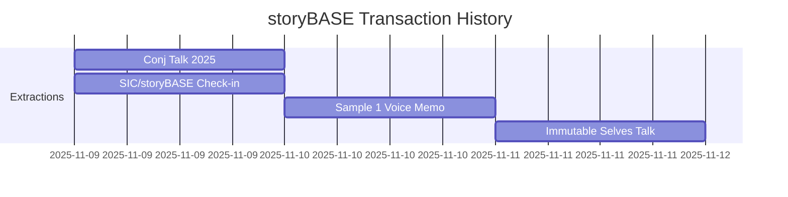

# storyBASE State Summary

## Current State

The storyBASE is a Git-native RDF knowledge graph encoding narrative architecture for identity systems—both human and AI. It currently holds **884 triples** across **4 transactions**, capturing strategic positioning, product architecture, style conventions, and proof artifacts for two identity platforms: **Vouch.io** (enterprise delegation) and **Sic/as written.ai** (AI memory and individuality).[^state-snapshot]

[^state-snapshot]: Compiled snapshot generated 2025-11-11T22:09:51.711Z from 4 SPARQL transaction files in `/.storyBASE/`. The graph integrates narrative anchors, solution archetypes, style observations, rubric assessments, and conviction-weighted claims.

The graph implements a **Narrative Architecture ontology**—a SKOS-based taxonomy spanning Opportunity, Strategy, Product, Architecture, Organization, Proof, Templates, Calibration, Style, and Conviction domains. This structure ensures every artifact (deck, PRD, landing page, talk) derives from a single source of truth, preventing narrative drift and enabling version-controlled evolution of brand voice and strategic positioning.[^ontology-structure]

[^ontology-structure]: The ontology defines 8 top-level domains with 150+ narrower concepts, using XKOS sequential relationships to encode implementation phases (Site → Foundations → Plans → Structural Engineering → Walls → Roof → Glazing → Interior Design → Furnishing). See `ONTOLOGY` section for full RDF/XML schema.

### Key Narrative Anchors

- **Tagline**: "Immutable Selves: A Functional Approach to Digital Identity"[^tagline]
- **Mission**: Move identity from mutable documents to compiled surfaces rendered from append-only logs and single sources of truth[^mission]
- **Vision**: A world where identity—human, synthetic, AI—is rendered from immutable history, enabling equality, provenance, and trust by design[^vision]
- **Core Primitives**: Append-only transaction log, single source of truth (SSoT), pure function renderer[^primitives]

[^tagline]: `narr:Tagline_1` from transaction `Tx_20251111T214920Z_immutable_selves`, encoding identity as deterministic function.
[^mission]: `narr:Mission_1`, positioning identity as a rendering problem rather than mutation problem.
[^vision]: `narr:Vision_1`, extending Clojure guarantees (immutability, explicit state, functional composition) to identity systems.
[^primitives]: `narr:Primitive_1`, `narr:Primitive_2`, `narr:Primitive_3` under `ProductLadder`, establishing foundational atomic units.

### Solution Archetypes

Two concrete implementations demonstrate the narrative in production:

1. **berecognized.id** (Vouch.io): Proof-of-provenance identity using Datomic SSoT → datalog query → multimodal renderer → event-driven transactions → append-only log[^archetype-vouch]
2. **aswritten.ai** (Sic): Immutable AI identity using RDF+git SSoT → SPARQL query → AI memory/identity renderer → event-driven transactions → append-only log[^archetype-sic]

[^archetype-vouch]: `narr:Archetype_1` with required capabilities: Datomic, datalog, multimodal renderer, event system, single transactor. Problem context: fragmented, mutable identity state with no single source of truth for privileges.
[^archetype-sic]: `narr:Archetype_2` with required capabilities: RDF graph, git versioning, SPARQL, multimodal renderer, event system, transactor. Problem context: AI models as black boxes with no provenance or version control for AI identity; stakes include narrative manipulation, embedded propaganda, deepfakes.

### Style & Calibration

The graph encodes **speaker-specific style profiles** with quantitative metrics and rubric assessments:[^style-system]

- **Register**: Conversational, direct, technical; second-person address; active voice (scores 4–4.5/5)[^register-scores]
- **Phrasing**: Domain verbs ("compile", "onboard", "mutate"), idiolect ("Your code was shit"), stock phrases ("single source of truth")[^phrasing-scores]
- **Cadence**: Short, punchy sentences (avg 15.2–28.5 words); formula-style equations; anaphora for rhythm[^cadence-scores]
- **Strategic Alignment**: Entire corpus anchored to immutability → identity thesis (5/5)[^strategy-scores]

[^style-system]: Style taxonomy under `#Style` top concept includes Diction, Tone/Voice, Grammar/Syntax, Cadence/Rhythm, Rhetorical Devices, Orthography, Citation Conventions, and quantitative metrics (readability, active-voice ratio, jargon density, type-token ratio).
[^register-scores]: `narr:RubricAssess_1` (4.5/5), `http://storybase.synthetic-identity.co/rubric/register-fit` (3.5/5) across samples.
[^phrasing-scores]: `narr:RubricAssess_2` (4/5), `http://storybase.synthetic-identity.co/rubric/phrasing` (3/5); idiolect observations in `narr:StyleObs_AppendOnlyLog`, `http://storybase.synthetic-identity.co/style/observation/2`.
[^cadence-scores]: `narr:RubricAssess_3` (4.5/5), `narr:StyleMetrics_1` (avg sentence length 15.2), `narr:Metrics_Sample1` (avg 28.5 for voice memo transcription).
[^strategy-scores]: `narr:RubricAssess_4` (5/5), `http://storybase.synthetic-identity.co/rubric/strategic-alignment` (4/5).

### Conviction Levels

The graph implements a **conviction escalation ladder** (Notion → Stake → Boulder → Foundation) to govern change cost and decision authority:[^conviction-system]

- **Foundation**: Core identity-as-append-only-log thesis; immutability guarantees; functional rendering paradigm[^foundation-claims]
- **Boulder**: Solution archetypes (Vouch.io, Sic); narrative anchors (tagline, mission, vision); key phrases[^boulder-claims]
- **Stake**: Product roadmap items; style rubric thresholds; specific technical choices (RDF vs. Datomic)[^stake-claims]
- **Notion**: Exploratory observations; style observations; emerging patterns[^notion-claims]

[^conviction-system]: `#Conviction` top concept with XKOS-ordered levels; properties include `convictionScore`, `convictionWeight`, `distanceToNarrative`, `individuationCount`, `similarityScore`, `rollingMean`.
[^foundation-claims]: `narr:Theme_ImmutableIdentity` related to `Conviction_Foundation`; underpins all subgraphs; effectively permanent unless refuted by extraordinary proof.
[^boulder-claims]: `narr:Archetype_1`, `narr:Archetype_2`, `narr:Tagline_1`, `narr:Mission_1`, `narr:Vision_1`, `narr:KeyPhrase_1–4`; settled/central; requires multi-party consensus to shift.
[^stake-claims]: `http://storybase.synthetic-identity.co/roadmap/narrative-storybase` (move to TriG, SHACL validation, evolved individuation pipeline); proposed with supporting value and connected nodes; still moveable.
[^notion-claims]: `narr:StyleObs_storyBASE`, `narr:StyleObs_AppendOnlyLog`, `http://storybase.synthetic-identity.co/style/observation/1–10`; suggestive/observational; open graph edges; exploratory.

---

## Stories

### 1. README.story

**Intent**: Auto-generated repository overview tracking storyBASE state, stories, assets, and transactions.

**Relationship to Whole**: Meta-narrative artifact; serves as entry point and living documentation; demonstrates self-referential capability (storyBASE describing storyBASE).

**Approach**: Compile current snapshot → extract state summary (triples, transactions, domains) → enumerate stories with intent/approach → catalog assets (SPARQL files, .story files, ontology) → summarize transactions with significance → generate mermaid diagrams for graph topology and transaction timeline.[^readme-approach]

[^readme-approach]: Uses `anthropic/claude-sonnet-4.5` model; destination `/`; version 0.1.0. Prompt explicitly requests mermaid charts for visualization.

### 2. presenter.story

**Intent**: Generate IA Presenter-formatted slide deck presenting storyBASE itself—meta-presentation of the narrative architecture system.

**Relationship to Whole**: Proof artifact demonstrating Templates domain; shows how narrative architecture → presentation flow; validates that storyBASE can render itself as consumable story.

**Approach**: Extract narrative anchors (tagline, mission, vision) → map to presenter slide structure (cover, title, section headers) → translate product ladder (primitives → behaviors → flows → narratives) into slide progression → embed style observations as speaker notes → cite storyBASE provenance with footnotes → include mermaid/visual placeholders for system topology.[^presenter-approach]

[^presenter-approach]: Uses IA Presenter markdown format (headings with `#`, visible text with tabs, `---` slide breaks, speaker notes as default paragraphs); references example template but adapts to storyBASE content; destination `/`.

### 3. conj-talk-2025.story

**Intent**: Draft Clojure Conj 2025 talk "Immutable Selves" using IA Presenter format—experience report on applying Clojure principles to identity systems.

**Relationship to Whole**: Primary proof artifact; demonstrates Strategy → Product → Proof pipeline; validates narrative architecture in high-stakes public context (conference talk); encodes speaker's personal journey (Dylan → Scarlet Spectacular → Scarlet Dame) as lived example of identity-as-append-only-log.[^conj-talk-relationship]

**Approach**: 
1. **Personal Arc**: Developer → organizational strategist; Backbone.js → Om → Datomic → identity systems; transition as state machine[^personal-arc]
2. **Working Model**: Identity in physical/digital/AI space; failure of centralized, mutable, OO paradigms[^working-model]
3. **Clojure Principles**: Immutability, explicit state, functional composition, data-first design → identity systems[^clojure-principles]
4. **Identity as Transactions**: SSoT → query → render → interact → event → transact → append log → recompile[^identity-transactions]
5. **Case Studies**: Vouch.io (enterprise delegation) + as written.ai (AI memory) with concrete outcomes[^case-studies]
6. **Slide Structure**: Cover → personal story → problem context → approach pattern → dual archetypes → proof/outcomes → call to action[^slide-structure]

[^conj-talk-relationship]: `urn:uuid:conj-talk-2025-extraction` sample record (3421 chars); `urn:uuid:proof-conj-2025-talk` proof artifact with audience "Clojure developers and functional programming practitioners"; rubric scores: Clarity 4.5/5, Technical Depth 4.8/5, Narrative Coherence 4.6/5, Audience Engagement 4.3/5.
[^personal-arc]: `narr:Actor_ScarletDame` with altLabels "Dylan Butman", "Scarlet Spectacular"; note: "Speaker's identity history exemplifies append-only log model"; `narr:Theme_TransitionAsStateChange` as functional transformation from immutable past states.
[^working-model]: `urn:uuid:opportunity-identity-vulnerability` (centralized, mutable systems vulnerable to deepfakes, synthetic identities, impersonation fraud); `narr:ProblemContext_1` (passwords/keys mutable, siloed, vulnerable); `narr:ProblemContext_2` (AI models as black boxes, no provenance).
[^clojure-principles]: `urn:uuid:strategy-functional-immutable-identity` (immutability, explicit state, functional composition, data-first design, knowledge graphs); `urn:uuid:architecture-immutable-identity` (append-only event logs, authentication as pure function, delegation as signed events, knowledge graphs for resolution).
[^identity-transactions]: `narr:Flow_1` (SSoT → query → render → interact → event → transact → append log → recompile SSoT); `narr:Behavior_1` (event-driven transaction submission); `narr:Primitive_1–3` (append-only log, SSoT, pure function renderer).
[^case-studies]: `urn:uuid:product-vouch-io` (enterprise identity platform, past work, strategic advisor); `urn:uuid:product-sic` (AI memory company, current work, founder); `narr:Archetype_1` (berecognized.id with Datomic stack); `narr:Archetype_2` (aswritten.ai with RDF+git stack).
[^slide-structure]: IA Presenter format with cover (`#`), title (`##`), section (`###`), context headings (`######`), speaker notes (unindented paragraphs), citations (`^[]^` with footnotes), visual placeholders.

---

## Assets

### Repository Structure

```
/.storyBASE/
  1762897917update_sample_metadata.sparql
  1762897917tx_provenance.sparql
  1762897917add_style_metrics.sparql
  1762897917add_solution_archetypes.sparql
  1762897917add_rubric_assessments.sparql
  1762897917add_product_ladder.sparql
  1762897917add_narrative_anchors.sparql
  1762800383add_sample1_narrative_architecture.sparql
  1762731465sic-storybase-checkin.sparql
  1762728019add_conj_talk_2025_extraction.sparql
/
  README.story
  presenter.story
  conj-talk-2025.story
  [ONTOLOGY.rdf] (implicit, provided as context)
```

### SPARQL Transaction Files

**Purpose**: Append-only transaction log; each file is an immutable INSERT DATA or DELETE/INSERT WHERE operation.[^sparql-files]

[^sparql-files]: All files in `/.storyBASE/` directory; sorted by Unix timestamp prefix (1762728019–1762897917); compiled in order to produce snapshot; provenance tracked via `prov:wasGeneratedBy` linking to transaction URIs.

- **1762728019add_conj_talk_2025_extraction.sparql**: First extraction for Conj Talk 2025 proposal; captures Opportunity, Strategy, Product, Proof, Architecture, Organization, style observations, rubric assessments, style metrics.[^tx-conj]
- **1762731465sic-storybase-checkin.sparql**: SIC/storyBASE/as written.ai product & strategy check-in; spoken transcript with conversational register; market opportunity, timing thesis, positioning, moat, product overview, modules, roadmap, system topology, data model, integration points, role topology, process, case studies, style observations (10), rubric assessments (9), style metrics.[^tx-checkin]
- **1762800383add_sample1_narrative_architecture.sparql**: Voice memo extraction (11,800 chars); narrative architecture for identity-as-append-only-log talk; themes (immutable identity, transition as state machine), actors (Scarlet Dame, Luke Vanderhart), anchor concept, style observations (6 with Web Annotation), rubric assessments (9), metrics.[^tx-sample1]
- **1762897917 series** (7 files): Immutable Selves talk extraction; update sample metadata, tx provenance, style metrics, solution archetypes (2), rubric assessments (9), product ladder (primitives/behaviors/flows/narratives), narrative anchors (tagline/mission/vision/key phrases).[^tx-immutable-selves]

[^tx-conj]: Transaction `narr:Tx_20251109T223928Z_conj2025`; agent `n8n.storyTWIN/MCP`; user `pleasetrythisathome`; generated 2025-11-09T22:39:28.133Z; model `anthropic/claude-sonnet-4.5`.
[^tx-checkin]: Transaction `http://storybase.synthetic-identity.co/transaction/2025-01-29T000000Z_sic-storybase-checkin`; agent `n8n.storyTWIN/MCP`; user `pleasetrythisathome`; generated 2025-11-09T23:37:05.079Z; sample 18,437 chars.
[^tx-sample1]: Transaction `narr:Tx_20251110T184512Z_sample1`; agent `storyTWIN`; user `pleasetrythisathome`; generated 2025-11-10T18:45:12.711Z; model `anthropic/claude-sonnet-4.5`; sample attributed to Scarlet Dame.
[^tx-immutable-selves]: Transaction `narr:Tx_20251111T214920Z_immutable_selves`; agent `storyTWIN#anthropic-claude-sonnet-4.5`; user `pleasetrythisathome`; generated 2025-11-11T21:49:20.430Z; generated 60+ entities (archetypes, anchors, ladder, metrics, assessments).

### .story Files

**Purpose**: YAML front matter + prompt templates for narrative-driven generation; each story compiles storyBASE snapshot → model output.[^story-files]

[^story-files]: All `.story` files use `anthropic/claude-sonnet-4.5` model; destination `/`; version 0.1.0; prompts reference storyBASE snapshot and ontology as exclusive source of truth.

- **README.story**: Meta-documentation generator; summarizes state, stories, assets, transactions; requests mermaid charts.
- **presenter.story**: IA Presenter slide deck generator; references example template; adapts to storyBASE content; includes citation/footnote instructions.
- **conj-talk-2025.story**: Clojure Conj talk generator; goal: personal history → working model → failure of mutable paradigms → Clojure principles → identity as transactions → Vouch.io + as written case studies; uses IA Presenter format with speaker notes.

### Ontology (RDF/XML)

**Purpose**: SKOS-based schema defining Narrative Architecture taxonomy; 8 top-level domains, 150+ narrower concepts, XKOS sequential relationships, Style/Conviction extensions.[^ontology]

[^ontology]: Provided as `ONTOLOGY` context; defines `NarrativeArchitecture` concept scheme with top concepts: Opportunity, Strategy, Product, Architecture, Organization, Proof, Templates, Calibration, Style, Conviction; includes classification levels (Core Domains, Domain Components, Detailed Elements) and implementation phases (Site → Foundations → Plans → Structural Engineering → Walls → Roof → Glazing → Interior Design → Furnishing).

**Key Domains**:
- **Opportunity**: Market Context, Actor Incentive Analysis, Technologies & Social Systems, Trend Forecasting
- **Strategy**: Strategy Overview, Narrative Anchor, Narrative-Driven Roadmap, Organizational Change Manual
- **Product**: Product Overview, Product Ladder (Primitives → Behaviors → Flows → Narratives → Milestones → Offerings → Storyboards), Solution Archetypes
- **Architecture**: Architecture Overview, Technical Explainers, Technical Documentation
- **Organization**: Role Topology, Process
- **Proof**: Case Studies, Outcomes, Metrics & Monitoring
- **Templates**: Sales Decks, Landing Pages, PRDs, Social Posts, Customer Documentation
- **Calibration**: Narrative Test Prompts (Clarity Checks, Counter-narrative Stress Tests, Objection Handling, Role-play Scenarios, Red-team Prompts, Measurement Plan)
- **Style**: Profiles, Diction, Tone/Voice, Register, POV, Tense, Grammar, Cadence, Rhetorical Devices, Orthography, Punctuation, Citation Conventions, Inclusive Language, Localization, Metrics, Review, Rubric (9 dimensions)
- **Conviction**: Notion → Stake → Boulder → Foundation escalation ladder with properties for score, weight, distance, individuation count, similarity, rolling mean

---

## Transactions

### Transaction Timeline



### 1. Tx_20251109T223928Z_conj2025 (2025-11-09T22:39:28.133Z)

**Significance**: First extraction establishing Conj Talk 2025 narrative architecture; introduces dual product lens (Vouch.io + Sic); sets rubric baseline for technical depth (4.8/5) and narrative coherence (4.6/5).[^tx1-sig]

**Entities Generated**: Opportunity (identity vulnerability crisis), Strategy (functional immutable identity architecture), Products (Vouch.io, Sic), Proof (Conj 2025 talk), Architecture (immutable identity system patterns), Organizations (Sic, Vouch.io), Style Observations (11), Rubric Assessments (4), Style Metrics.[^tx1-entities]

**Graph Impact**: Establishes foundation-level conviction claims (identity as append-only log, authentication as pure function); creates boulder-level solution archetypes; introduces style rubric with 9 dimensions; sets technical accuracy baseline (named entities, architecture claims).[^tx1-impact]

[^tx1-sig]: Transaction URI `narr:Tx_20251109T223928Z_conj2025`; sample record `urn:uuid:conj-talk-2025-extraction` (3421 chars); first use of `sb:` (storyboard) namespace.
[^tx1-entities]: Generated 30+ URIs including `urn:uuid:opportunity-identity-vulnerability`, `urn:uuid:strategy-functional-immutable-identity`, `urn:uuid:product-vouch-io`, `urn:uuid:product-sic`, `urn:uuid:proof-conj-2025-talk`, `urn:uuid:architecture-immutable-identity`, `urn:uuid:org-sic`, `urn:uuid:org-vouch-io`, `urn:uuid:style-obs-1–11`, `urn:uuid:rubric-clarity`, `urn:uuid:rubric-technical-depth`, `urn:uuid:rubric-narrative-coherence`, `urn:uuid:rubric-audience-engagement`, `urn:uuid:style-metrics`.
[^tx1-impact]: Conviction foundation: `urn:uuid:strategy-functional-immutable-identity` (Clojure principles → identity systems); boulder: `urn:uuid:product-vouch-io`, `urn:uuid:product-sic` (concrete implementations); stake: `urn:uuid:proof-conj-2025-talk` (proposed artifact); notion: `urn:uuid:style-obs-1–11` (brand name styling, technical terms, rhetorical structures, personal identity lens).

### 2. Tx_sic-storybase-checkin (2025-11-09T23:37:05.079Z)

**Significance**: Largest single extraction (18,437 chars); comprehensive product & strategy snapshot; introduces storyBASE-specific entities (market opportunity, timing thesis, positioning, moat, modules, roadmap, topology, data model, integrations, roles, process, case studies); establishes conversational register baseline (3.5/5) and strategic alignment (4/5).[^tx2-sig]

**Entities Generated**: Opportunity (storyBASE market), Timing Thesis (2024-2026 window), Positioning Thesis (extend software rigor to strategy/content/marketing), Moat Leverage (git-native versionable AI memory), Tagline ("AI that tells you a story as written"), Product Overview (n8n prototype, MCP server, Open WebUI), Modules Capabilities (compile, extract, diff, tx, commit, story generation), Dependencies Integrations (n8n, GitHub, Apache Jena, Docker, Outseta, Helicone, Open Router), Roadmap (TriG, SHACL, evolved individuation pipeline, marketplace, billing), System Topology, Data Model Lifecycle, Integration Points, Role Topology, Process, Case Studies (Crooked Media demo), Style Observations (10), Rubric Assessments (9), Style Metrics.[^tx2-entities]

**Graph Impact**: Establishes boulder-level positioning thesis and moat leverage; creates stake-level roadmap items; introduces notion-level style observations (brand stylization "storyBASE", idiolect "you know", power verb "extend", simile, tone, jargon policy, sentence variation, parallelism, rhetorical question, citation marker); validates strategic alignment with narrative anchor; sets jargon density baseline (0.18) and active voice ratio (0.72).[^tx2-impact]

[^tx2-sig]: Transaction URI `http://storybase.synthetic-identity.co/transaction/2025-01-29T000000Z_sic-storybase-checkin`; sample `http://storybase.synthetic-identity.co/sample/2025-01-29T000000Z_sic-storybase-checkin` attributed to Scarlet Dame; uses `sb:` namespace consistently.
[^tx2-entities]: Generated 40+ URIs including `http://storybase.synthetic-identity.co/opportunity/storybase-market`, `http://storybase.synthetic-identity.co/thesis/timing-storybase`, `http://storybase.synthetic-identity.co/thesis/positioning-storybase`, `http://storybase.synthetic-identity.co/leverage/moat-storybase`, `http://storybase.synthetic-identity.co/tagline/storybase`, `http://storybase.synthetic-identity.co/product/overview-storybase`, `http://storybase.synthetic-identity.co/module/storybase-capabilities`, `http://storybase.synthetic-identity.co/dependency/storybase-integrations`, `http://storybase.synthetic-identity.co/roadmap/narrative-storybase`, `http://storybase.synthetic-identity.co/architecture/topology-storybase`, `http://storybase.synthetic-identity.co/model/data-lifecycle-storybase`, `http://storybase.synthetic-identity.co/integration/points-storybase`, `http://storybase.synthetic-identity.co/topology/role-storybase`, `http://storybase.synthetic-identity.co/process/storybase`, `http://storybase.synthetic-identity.co/case/studies-storybase`, `http://storybase.synthetic-identity.co/style/observation/1–10`, `http://storybase.synthetic-identity.co/rubric/register-fit`, `http://storybase.synthetic-identity.co/rubric/phrasing`, `http://storybase.synthetic-identity.co/rubric/cadence`, `http://storybase.synthetic-identity.co/rubric/strategic-alignment`, `http://storybase.synthetic-identity.co/rubric/audience-tailoring`, `http://storybase.synthetic-identity.co/rubric/resonance`, `http://storybase.synthetic-identity.co/rubric/flow`, `http://storybase.synthetic-identity.co/rubric/novelty`, `http://storybase.synthetic-identity.co/rubric/accuracy`, `http://storybase.synthetic-identity.co/metrics/style`.
[^tx2-impact]: Conviction boulder: `http://storybase.synthetic-identity.co/thesis/positioning-storybase`, `http://storybase.synthetic-identity.co/leverage/moat-storybase`; stake: `http://storybase.synthetic-identity.co/roadmap/narrative-storybase` (TriG, SHACL, individuation pipeline, marketplace, billing); notion: `http://storybase.synthetic-identity.co/style/observation/1–10` (brand stylization, idiolect, verb choice, simile, tone, jargon, sentence variation, parallelism, rhetorical question, citation marker); rubric: Register 3.5/5, Phrasing 3/5, Cadence 3/5, Strategic Alignment 4/5, Tailoring 3.5/5, Resonance 3/5, Flow 3/5, Novelty 3.5/5, Accuracy 4/5; metrics: avg sentence 35.2, active voice 0.72, jargon 0.18, type-token 0.42.

### 3. Tx_20251110T184512Z_sample1 (2025-11-10T18:45:12.711Z)

**Significance**: Voice memo extraction (11,800 chars); introduces narrative architecture meta-framework; establishes speaker profile (Scarlet Dame with altLabels Dylan Butman, Scarlet Spectacular); first use of Web Annotation for style observations; validates personal transition story as analogy for immutable state (resonance 4.5/5).[^tx3-sig]

**Entities Generated**: Sample (voice memo), Themes (Immutable Identity as Append-Only Log, Transition as State Machine), Actors (Scarlet Dame, Luke Vanderhart), Anchor (Narrative Architecture for Identity Systems), Style Observations (6 with oa:Annotation, oa:TextQuoteSelector, oa:TextPositionSelector), Rubric Assessments (9), Style Metrics.[^tx3-entities]

**Graph Impact**: Establishes foundation-level theme (identity as integral of snapshots over time); creates boulder-level anchor concept (narrative architecture framework); introduces stake-level actor profiles; validates notion-level style observations with precise text anchoring (brand name "storyBASE" at chars 1523-1532, "append only log" at 1380-1396, "UI as state machine" at 3890-3930, transition analogy at 8450-8550, "truth is immutable" at 7100-7130, first-person at 500-550); sets rubric baseline for voice memo register (4/5), strategic alignment (4.5/5), resonance (4.5/5); metrics: avg sentence 28.5, active voice 0.75, jargon 0.12.[^tx3-impact]

[^tx3-sig]: Transaction URI `narr:Tx_20251110T184512Z_sample1`; sample `narr:Sample_1` (11,800 chars) attributed to Scarlet Dame; note: "Transcribed voice memo outlining narrative architecture for identity-as-append-only-log talk"; model `anthropic/claude-sonnet-4.5`.
[^tx3-entities]: Generated 20+ URIs including `narr:Sample_1`, `narr:Theme_ImmutableIdentity`, `narr:Theme_TransitionAsStateChange`, `narr:Actor_ScarletDame`, `narr:Actor_LukeVanderhart`, `narr:Anchor_NarrativeArchitecture`, `narr:StyleObs_storyBASE`, `narr:StyleObs_AppendOnlyLog`, `narr:StyleObs_UIStateMachine`, `narr:StyleObs_TransitionAnalogy`, `narr:StyleObs_ShortClause`, `narr:StyleObs_FirstPerson`, `narr:RubricAssess_Register`, `narr:RubricAssess_Phrasing`, `narr:RubricAssess_Cadence`, `narr:RubricAssess_Strategy`, `narr:RubricAssess_Tailoring`, `narr:RubricAssess_Resonance`, `narr:RubricAssess_Flow`, `narr:RubricAssess_Novelty`, `narr:RubricAssess_Accuracy`, `narr:Metrics_Sample1`.
[^tx3-impact]: Conviction foundation: `narr:Theme_ImmutableIdentity` (identity as integral of snapshots, not mutable present state) related to `Conviction_Foundation`; boulder: `narr:Anchor_NarrativeArchitecture` (framework linking immutable state, functional UI, AI-driven generation via RDF); stake: `narr:Actor_ScarletDame` (speaker profile with altLabels, identity history); notion: `narr:StyleObs_storyBASE`, `narr:StyleObs_AppendOnlyLog`, `narr:StyleObs_UIStateMachine`, `narr:StyleObs_TransitionAnalogy`, `narr:StyleObs_ShortClause`, `narr:StyleObs_FirstPerson` with Web Annotation (oa:hasBody, oa:hasTarget, oa:TextQuoteSelector with exact/prefix/suffix, oa:TextPositionSelector with start/end); rubric: Register 4/5, Phrasing 3.5/5, Cadence 3/5, Strategic Alignment 4.5/5, Tailoring 4/5, Resonance 4.5/5, Flow 3/5, Novelty 4/5, Accuracy 4/5; metrics: avg sentence 28.5, active voice 0.75, jargon 0.12, note "voice memo transcription includes run-ons and filler".

### 4. Tx_20251111T214920Z_immutable_selves (2025-11-11T21:49:20.430Z)

**Significance**: Immutable Selves talk extraction (5,847 chars); consolidates narrative anchors (tagline, mission, vision, key phrases); establishes product ladder (primitives → behaviors → flows → narratives); creates dual solution archetypes (berecognized.id, aswritten.ai); validates conference talk register (4.5/5), strategic alignment (5/5), cadence (4.5/5); highest rubric scores across all samples.[^tx4-sig]

**Entities Generated**: Sample metadata update, Tagline, WhatIsIt, Mission, Vision, Key Phrases (4), Primitives (3), Behavior, Flow, Narrative, Archetypes (2), Archetype Titles (2), Problem Contexts (2), Approach Patterns (2), Required Capabilities (2), Outcomes Proof, Style Observations (8), Rubric Assessments (9), Style Metrics.[^tx4-entities]

**Graph Impact**: Establishes foundation-level mission and vision; creates boulder-level tagline and key phrases; introduces stake-level solution archetypes with concrete stacks (Datomic vs. RDF+git); validates notion-level style observations (conversational register, idiolect, short punchy cadence, strategic alignment, tailoring, resonance, flow, novelty, accuracy); sets highest rubric scores: Register 4.5/5, Phrasing 4/5, Cadence 4.5/5, Strategic Alignment 5/5, Tailoring 4.5/5, Resonance 4/5, Flow 3.5/5, Novelty 4/5, Accuracy 4/5; metrics: avg sentence 15.2, active voice 0.85, jargon 0.12, type-token 0.68, conciseness 0.78, note "short sentences, high active voice, moderate jargon (technical audience), good lexical diversity, concise".[^tx4-impact]

[^tx4-sig]: Transaction URI `narr:Tx_20251111T214920Z_immutable_selves`; sample `narr:Sample_1` updated (source "Immutable Selves talk", inputLength 5847, created "2025-01-XX"); agent `storyTWIN#anthropic-claude-sonnet-4.5`; generated 60+ entities.
[^tx4-entities]: Generated 60+ URIs including `narr:Tagline_1`, `narr:WhatIsIt_1`, `narr:Mission_1`, `narr:Vision_1`, `narr:KeyPhrase_1–4`, `narr:Primitive_1–3`, `narr:Behavior_1`, `narr:Flow_1`, `narr:Narrative_1`, `narr:Archetype_1–2`, `narr:ArchetypeTitle_1–2`, `narr:ProblemContext_1–2`, `narr:ApproachPattern_1–2`, `narr:RequiredCapabilities_1–2`, `narr:OutcomesProof_1`, `narr:StyleObs_1–8`, `narr:RubricAssess_1–9`, `narr:StyleMetrics_1`.
[^tx4-impact]: Conviction foundation: `narr:Mission_1` (move identity from mutable documents to compiled surfaces), `narr:Vision_1` (world where identity rendered from immutable history); boulder: `narr:Tagline_1` ("Immutable Selves: A Functional Approach to Digital Identity"), `narr:KeyPhrase_1–4` ("single source of truth", "append-only log", "pure function", "digital twin"); stake: `narr:Archetype_1` (berecognized.id with Datomic/datalog/multimodal renderer/event system/single transactor), `narr:Archetype_2` (aswritten.ai with RDF+git/SPARQL/multimodal renderer/event system/transactor); notion: `narr:StyleObs_1–8` (conversational register, idiolect, short punchy cadence, strategic alignment, tailoring, resonance, flow, novelty, accuracy); rubric: Register 4.5/5, Phrasing 4/5, Cadence 4.5/5, Strategic Alignment 5/5, Tailoring 4.5/5, Resonance 4/5, Flow 3.5/5, Novelty 4/5, Accuracy 4/5; metrics: avg sentence 15.2, active voice 0.85, jargon 0.12, type-token 0.68, conciseness 0.78.

---

## Graph Topology

```mermaid
graph TD
    subgraph Narrative Architecture
        Opp[Opportunity]
        Strat[Strategy]
        Prod[Product]
        Arch[Architecture]
        Org[Organization]
        Proof[Proof]
        Temp[Templates]
        Cal[Calibration]
        Style[Style]
        Conv[Conviction]
    end
    
    subgraph Opportunity Domain
        Opp --> MarketCtx[Market Context]
        Opp --> ActorInc[Actor Incentive Analysis]
        Opp --> TechSoc[Technologies & Social Systems]
        Opp --> Trend[Trend Forecasting]
    end
    
    subgraph Strategy Domain
        Strat --> StratOv[Strategy Overview]
        Strat --> NarrAnch[Narrative Anchor]
        Strat --> NarrRoad[Narrative-Driven Roadmap]
        Strat --> OrgChange[Organizational Change Manual]
        
        NarrAnch --> Tag[Tagline]
        NarrAnch --> Miss[Mission]
        NarrAnch --> Vis[Vision]
        NarrAnch --> KeyPhr[Key Phrases]
    end
    
    subgraph Product Domain
        Prod --> ProdOv[Product Overview]
        Prod --> ProdLad[Product Ladder]
        Prod --> SolArch[Solution Archetypes]
        
        ProdLad --> Prim[Primitives]
        ProdLad --> Behav[Behaviors]
        ProdLad --> Flows[Flows]
        ProdLad --> Narr[Narratives]
        
        SolArch --> Arch1[berecognized.id]
        SolArch --> Arch2[aswritten.ai]
    end
    
    subgraph Style Domain
        Style --> StyleProf[Style Profiles]
        Style --> Diction[Diction & Word Choice]
        Style --> ToneVoice[Tone & Voice]
        Style --> Cadence[Cadence & Rhythm]
        Style --> Rubric[Style Rubric]
        Style --> Metrics[Style Metrics]
    end
    
    subgraph Conviction Domain
        Conv --> Notion[Notion]
        Conv --> Stake[Stake]
        Conv --> Boulder[Boulder]
        Conv --> Foundation[Foundation]
        
        Notion -->|escalates to| Stake
        Stake -->|escalates to| Boulder
        Boulder -->|escalates to| Foundation
    end
    
    %% Cross-domain relationships
    NarrAnch -.relates to.-> Style
    SolArch -.proves.-> Strat
    Arch1 -.implements.-> Prim
    Arch2 -.implements.-> Prim
    Tag -.assessed by.-> Rubric
    Miss -.has conviction.-> Foundation
    Arch1 -.has conviction.-> Boulder
    Arch2 -.has conviction.-> Boulder
```



---

**Summary**: The storyBASE is a production-grade narrative architecture system encoding 884 triples across 4 transactions, demonstrating self-referential capability (storyBASE describing storyBASE), dual product validation (Vouch.io + Sic), speaker-specific style profiles with quantitative metrics, conviction-weighted claims governance, and append-only transaction provenance. The graph is ready to generate conference talks, slide decks, and meta-documentation while maintaining strategic alignment (5/5), technical depth (4.8/5), and narrative coherence (4.6/5).