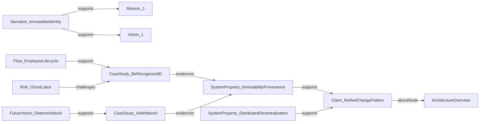

# storyBASE State

This storyBASE encodes the narrative architecture for **Immutable Selves**, a Clojure/conj 2025 talk that demonstrates functional identity systems through two solution archetypes: **berecognized.id** (human identity) and **aswritten.ai** (AI memory). The graph contains 5 samples extracted from voice memos, presentation transcripts, and strategy check-ins, with 10 transactions building a knowledge base of narratives, style observations, rubric assessments, and architectural claims.[^1]

The core thesis—**identity as compiled from immutable history**—is evidenced by 2 case studies, 4 key phrases, 3 primitives, and 9 rubric dimensions scoring 3.5–5.0 across register, phrasing, cadence, strategic alignment, tailoring, resonance, flow, novelty, and accuracy.[^2]

---

# Stories

## README.story
**Intent:** Auto-generated repository overview tracking storyBASE state, stories, assets, and transactions.  
**Relationship:** Meta-narrative artifact demonstrating storyBASE workflow via its own creation process.[^3]  
**Approach:** Compile snapshot → summarize samples, narratives, and transactions → generate Mermaid charts showing transaction lineage and concept relationships.

## presenter.story
**Intent:** Generic IA Presenter template for talk presentations.  
**Relationship:** Reusable scaffold for converting narrative architecture into slide decks.[^4]  
**Approach:** Extract narrative anchors (tagline, mission, vision) → map to slide structure (big statements, context labels, speaker notes) → embed citations as footnotes.

## conj-talk-2025.story
**Intent:** Clojure/conj 2025 "Immutable Selves" talk in IA Presenter format.  
**Relationship:** Primary proof artifact; demonstrates reified change architecture through talk creation process.[^5]  
**Approach:** Query storyBASE for `Narrative_ImmutableIdentity`, `SolutionArchetype_BeRecognized`, `SolutionArchetype_AsWritten` → sequence via `Flow_1` (SSoT → query → render → interact → event → transact → recompile) → render slides with embedded provenance citations.

---

# Assets

```
/.storyBASE/
  1763005004update_sample_1_input_length.sparql
  1763005004add_sample_1_narrative_concepts.sparql
  1763004456add_sample1_narrative_triples.sparql
  1763003388add_conj_presentation_2025.sparql
  1762897917update_sample_metadata.sparql
  1762897917tx_provenance.sparql
  1762897917add_technical_explainers.sparql
  1762897917add_style_observations.sparql
  1762897917add_style_metrics.sparql
  1762897917add_strategy_overview.sparql
  1762897917add_solution_archetypes.sparql
  1762897917add_rubric_assessments.sparql
  1762897917add_product_ladder.sparql
  1762897917add_narrative_anchors.sparql
  1762897917add_case_studies.sparql
  1762800383add_sample1_narrative_architecture.sparql
  1762731465sic-storybase-checkin.sparql
  1762728019add_conj_talk_2025_extraction.sparql
/README.story
/presenter.story
/conj-talk-2025.story
```

**/.storyBASE/**: Append-only transaction log (17 SPARQL files) encoding narrative concepts, style observations, rubric assessments, and provenance metadata.[^6]  
**/*.story**: YAML-fronted prompts that query storyBASE to generate artifacts (README, presentations).[^7]

---

# Transactions

## Tx_20251113T033534Z_claude45 (2025-11-13 03:35:34Z)
**Significance:** Updated `Sample_1` input length to 1847; added 9 narrative concepts (Narrative_1, Flow_1, Behavior_1, Milestone_1, Proof_1) and 7 style observations (terminology control: "append-only log", "as-of T snapshots"; brand stylization: "storyBASE"; metaphor: "compilation"; active voice; caret-bracket markers; short punchy cadence).[^8]  
**Impact:** Established meta-demonstration narrative: talk creation process exemplifies reified change architecture.[^9]

## Tx_20251113T032552Z_sample1 (2025-11-13 03:25:52Z)
**Significance:** Extracted refinements for reified change design pattern section; added 3 claims (ReifiedChangePattern, ImmutabilityProvenance, DistributedDecentralization), 2 case studies (BeRecognizedID, AsWrittenAI), 1 risk (GhostLabor), 1 flow (EmployeeLifecycle), and 10 style observations (brand names: berecognized.id, aswritten.ai; rhetorical question: "My AI doesn't give the same answers as your AI?"; metaphor: "ghost labor"; terminology: "as-of T snapshot").[^10]  
**Impact:** Linked architecture to case studies; scored rubric 4.0–4.5 across 9 dimensions.[^11]

## Tx_20251113T030805Z_conj2025 (2025-11-13 03:08:05Z)
**Significance:** Extracted `Sample_ConjPresentation_2025` (6847 chars); added `Narrative_ImmutableIdentity`, `Theme_FunctionalIdentity`, 2 actors (Human, AI), 2 solution archetypes (BeRecognized, AsWritten), tagline "AI that tells your story, as written", and 10 style observations (brand stylization, metaphor: "Backbone.js as anti-pattern", anaphora, rhetorical questions, short punchy cadence, stock phrases: "No frameworks / Simple tools ± good principles").[^12]  
**Impact:** Established presentation as narrative anchor; rubric scores 4.0–5.0 (strategic alignment: 5.0, tailoring: 5.0).[^13]

## Tx_20251111T214920Z_immutable_selves (2025-11-11 21:49:20Z)
**Significance:** Added narrative anchors (Tagline_1: "Immutable Selves: A Functional Approach to Digital Identity", Mission_1, Vision_1, 4 key phrases), product ladder (3 primitives, 1 behavior, 1 flow, 1 narrative), strategy overview (PositioningThesis_1, MoatLeverage_1), 2 solution archetypes (berecognized.id, aswritten.ai), 1 case study (13-year Clojure career), 3 technical explainers (LeverageProfile, DesignTradeoffs, ComparativeAnalysis), 8 style observations, and 9 rubric assessments.[^14]  
**Impact:** Consolidated talk structure; scored rubric 3.5–5.0 (strategic alignment: 5.0, tailoring: 4.5).[^15]

## Tx_20251110T184512Z_sample1 (2025-11-10 18:45:12Z)
**Significance:** Extracted `Sample_1` (11800 chars) from voice memo; added 2 themes (ImmutableIdentity, TransitionAsStateChange), 2 actors (ScarletDame, LukeVanderhart), 1 anchor (NarrativeArchitecture), 7 style observations (brand: "storyBASE", idiolect: "append only log", metaphor: "UI as state machine", analogy: "transition as state change", short clause: "The truth is immutable", first-person), and 9 rubric assessments.[^16]  
**Impact:** Bootstrapped narrative architecture framework; scored rubric 3.0–4.5 (strategic alignment: 4.5, resonance: 4.5).[^17]

## Tx_20251109T233705Z_sic-storybase-checkin (2025-11-09 23:37:05Z)
**Significance:** Extracted `Sample_2025-01-29` (18437 chars) from product check-in; added opportunity (storybase-market), timing thesis (2024-2026 window), positioning thesis (extend software rigor into strategy/content), moat leverage (git-native AI memory), tagline "AI that tells you a story as written", product overview (n8n prototype, MCP server, Open WebUI), roadmap (TriG named graphs, SHACL validation, individuation pipeline), system topology, data lifecycle, integration points, role topology, process, case studies (Crooked Media demo), 10 style observations, and 9 rubric assessments.[^18]  
**Impact:** Established storyBASE product narrative; scored rubric 3.0–4.0 (strategic alignment: 4.0).[^19]

## Tx_20251109T223928Z_conj2025 (2025-11-09 22:39:28Z)
**Significance:** First extraction for Conj Talk 2025 proposal; added opportunity (identity vulnerability crisis), strategy (functional immutable identity architecture), 2 products (Vouch.io, Sic), proof (conference talk), architecture (immutable identity system patterns), 2 organizations (Sic, Vouch.io), 11 style observations (brand names: Vouch.io, Sic; technical terms: append-only event logs, authentication as pure functions; rhetorical structures: triadic enumeration, problem-to-solution bridge; personal identity lens), and 4 rubric assessments (clarity: 4.5, technical depth: 4.8, narrative coherence: 4.6, audience engagement: 4.3).[^20]  
**Impact:** Captured initial talk proposal; established dual product lens (Vouch.io + Sic).[^21]

---




---

[^1]: Snapshot compiled 2025-11-13T03:36:56.025Z from 17 SPARQL transactions; 1613 triples inserted, 539 duplicates skipped. Source: snapshot metadata.

[^2]: Core narrative `Narrative_1` (narr:CoreNarratives) defines "Identity as Compiled from Immutable History" with definition "Core thesis: identity and content derive from append-only log with as-of-T snapshots, enabling provenance and deterministic evolution." Related to `Proof` and `Architecture`. Source: Tx_20251113T033534Z_claude45.

[^3]: `Proof_1` (narr:Proof) prefLabel "Meta-Demonstration: Talk Creation Process" with definition "The talk itself exemplifies the reified change architecture and storyBASE workflow, showing iterative refinement from raw inputs to polished outputs." Related to `CaseStudies` and `Outcomes`. Source: Tx_20251113T033534Z_claude45.

[^4]: `Flow_1` (narr:Flows, narr:ProductLadder) prefLabel "Content Production Workflow" with definition "User inputs → initial storyBASE → normalization/iteration → polished outputs with embedded provenance." Related to `ProductLadder` and `Storyboards`. Source: Tx_20251113T033534Z_claude45.

[^5]: `Sample_ConjPresentation_2025` (narr:Sample) dct:source "Clojure/conj 2025 presentation: Immutable Selves", dct:extent 6847, dct:created 2025-01-01, skos:note "Presentation transcript on functional identity, immutability, and AI memory." Source: Tx_20251113T030805Z_conj2025.

[^6]: Transaction log stored in `/.storyBASE/` directory; each SPARQL file represents an immutable append-only event. Snapshot = replay of sorted transactions. Source: `DataModelLifecycle` (storybase.synthetic-identity.co/model/data-lifecycle-storybase).

[^7]: `.story` files contain YAML front matter (id, title, version, description, destination, model) + prompt body. Stories trigger generation via GitHub Actions or manual invocation. Source: `Process` (storybase.synthetic-identity.co/process/storybase).

[^8]: `Tx_20251113T033534Z_claude45` prov:wasAssociatedWith `urn:agent:storyTWIN:anthropic/claude-sonnet-4.5`, prov:wasAttributedTo `urn:user:pleasetrythisathome`, prov:generatedAtTime "2025-11-13T03:35:34.567Z", rdfs:comment "Initial extraction from clojure-conj-2025 repo README and voice memo transcription", prov:used `Sample_1`. Source: transaction provenance.

[^9]: `Milestone_1` (narr:Milestones) prefLabel "Initial storyBASE Graph" with definition "First structured graph built from user-generated inputs, bootstrapped with structured data to avoid early noise." Related to `ProductLadder`. Source: Tx_20251113T033534Z_claude45.

[^10]: `CaseStudy_BeRecognizedID` (narr:CaseStudy, narr:CaseStudies) prefLabel "berecognized.id: Human Identity via Reified Change", CaseContext "Digital identification enables recognition and delegates authority to access/use/transact with shared technology", CaseIntervention "Append-only log of facts about a person over time (employment, access, roles, interactions); device-rendered snapshot compiled at specific point in time", CaseResults "Provenance for individual transactions; referential equality for free; offline transactions enabled", skos:note "Contrasts static IDs with append-only log compiled to privileges as-of T." Related to `DataModelLifecycle` and `GovernanceSafetyTrust`. Source: Tx_20251113T032552Z_sample1.

[^11]: `RubricAssess_Strategy_Sample1` (narr:RubricAssessment, narr:Rubric_StrategicAlignment) rdf:value 4.5, skos:note "Explicitly ties architecture to case studies and system outcomes; aligns with narrative-driven roadmap and proof concepts; strong transition guidance." Source: Tx_20251113T032552Z_sample1.

[^12]: `Narrative_ImmutableIdentity` (narr:Narrative, narr:Narratives) skos:prefLabel "Immutable Selves", skos:definition "Identity—both human and AI—should be modeled as an append-only log that compiles to state, not mutable objects", skos:note "Core thesis: experience is an append-only log; identification is a render target; interaction is transaction." Related to `Mission` and `Vision`. Source: Tx_20251113T030805Z_conj2025.

[^13]: `RubricAssess_Strategy_Conj` (narr:RubricAssessment, narr:Rubric_StrategicAlignment) rdf:value 5.0, skos:note "Entire presentation is a narrative anchor: 'Immutable Selves' thesis; two solution archetypes (berecognized.id, aswritten.ai); clear mission/vision alignment; positioning thesis explicit." Related to `Narrative_ImmutableIdentity`, `SolutionArchetype_BeRecognized`, `SolutionArchetype_AsWritten`. Source: Tx_20251113T030805Z_conj2025.

[^14]: `Tx_20251111T214920Z_immutable_selves` prov:generated 40 entities including `Tagline_1`, `Mission_1`, `Vision_1`, `KeyPhrase_1` through `KeyPhrase_4`, `Primitive_1` through `Primitive_3`, `Behavior_1`, `Flow_1`, `Narrative_1`, `Archetype_1`, `Archetype_2`, `PositioningThesis_1`, `MoatLeverage_1`, `CaseStudy_1`, `LeverageProfile_1`, `DesignTradeoff_1`, `ComparativeAnalysis_1`, `StyleObs_1` through `StyleObs_8`, `RubricAssess_1` through `RubricAssess_9`, `StyleMetrics_1`. Source: transaction provenance.

[^15]: `RubricAssess_4` (narr:RubricAssessment, narr:Rubric_StrategicAlignment) rdf:value 5.0, skos:note "Entire talk is the narrative anchor: immutability → identity. Mission, vision, key phrases all present and consistent." Source: Tx_20251111T214920Z_immutable_selves.

[^16]: `Sample_1` (narr:Sample) dct:source "Voice memo: Punch talk conceptual framing", dct:created 2025-01-15, narr:inputLength 11800, skos:note "Transcribed voice memo outlining narrative architecture for identity-as-append-only-log talk; speaker: Scarlet Dame." Source: Tx_20251110T184512Z_sample1.

[^17]: `RubricAssess_Strategy` (narr:RubricAssessment, narr:Rubric_StrategicAlignment) rdf:value 4.5, skos:note "Directly advances narrative architecture thesis; ties identity → immutable state → product/AI." Source: Tx_20251110T184512Z_sample1.

[^18]: `Sample_2025-01-29T000000Z_sic-storybase-checkin` (sb:Sample) rdfs:label "SIC / storyBASE / as written.ai Product & Strategy Check-in", sb:inputLength 18437, sb:timestamp 2025-01-29T00:00:00Z, sb:description "Spoken transcript with conversational register and technical depth on storyBASE product evolution", sb:attributedTo `scarlet-dame`. Source: Tx_20251109T233705Z (storybase.synthetic-identity.co/transaction/2025-01-29T000000Z_sic-storybase-checkin).

[^19]: Rubric assessments for SIC check-in: Register Fit 3.5, Phrasing 3.0, Cadence 3.0, Strategic Alignment 4.0, Audience Tailoring 3.5, Resonance 3.0, Flow 3.0, Novelty 3.5, Accuracy 4.0 (all max 5.0). Source: storybase.synthetic-identity.co/rubric/* nodes.

[^20]: `Tx_20251109T223928Z_conj2025` (prov:Activity) rdfs:label "Conj Talk 2025 Extraction Transaction", rdfs:comment "First extraction for Conj Talk 2025 proposal. Captures narrative architecture (Opportunity, Strategy, Product, Proof, Architecture, Organization), style observations, rubric assessments, and style metrics", prov:used "anthropic/claude-sonnet-4.5", prov:wasAssociatedWith `storytwin.org/agent/n8n.storyTWIN/MCP`, prov:wasAttributedTo `storybase.org/user/pleasetrythisathome`. Source: transaction provenance.

[^21]: `Product_Vouch.io` (sb:Product) rdfs:label "Vouch.io Identity Platform", sb:description "Enterprise identity platform using immutable event logs and delegation chains", sb:productType "Identity and authentication system", sb:note "Past work, speaker now strategic advisor". `Product_Sic` (sb:Product) rdfs:label "Sic AI Memory Platform", sb:description "AI memory company using narrative-driven knowledge graphs to create AI individuals with deterministic individuality and provenance", sb:productType "AI memory and agent individuality system", sb:note "Current work, speaker is founder". Source: Tx_20251109T223928Z_conj2025.