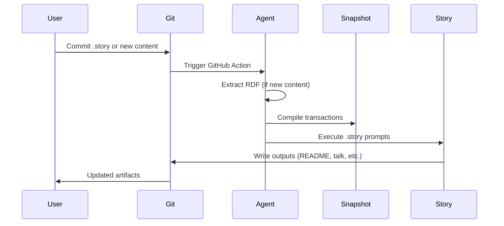

# storyBASE: AI Memory as Written

**Version 0.1.0** • A Git-native RDF knowledge graph for narrative-driven AI memory

---

## State

The storyBASE graph currently holds **two foundational transactions** that establish both the product vision and a concrete proof point:

1. **Product & Strategy Check-in** (Jan 29, 2025)[^1] — A conversational transcript capturing storyBASE's market opportunity, positioning thesis, technical architecture, and roadmap. This transaction encodes the core narrative: AI needs context, and storyBASE provides a versionable, Git-native RDF source of truth that makes AI output specific, controllable, and aligned with organizational worldview.

2. **Conj Talk 2025 Extraction** (Nov 9, 2025)[^2] — A conference talk proposal demonstrating how functional programming principles (immutability, explicit state, data-first design) apply to identity systems. This extraction shows storyBASE in action: narrative architecture (Opportunity → Strategy → Product → Proof → Architecture → Organization) captured as structured RDF with style observations, rubric assessments, and metrics.

The graph is **early but operable**: it has a clear positioning thesis, a working prototype (n8n + MCP + GitHub Actions), and a roadmap toward named graphs (TriG), SHACL validation, and marketplace distribution[^3]. Style and conviction taxonomies are defined but not yet heavily populated with samples.

---

## Stories

### `/README.story` — Repository Overview

**Intent:** Auto-generate a living README that tracks storyBASE state, stories, assets, and transactions.

**Relationship to whole:** This is the **entry point** for new users and contributors. It synthesizes the graph into a readable narrative, making the repository self-documenting.

**Approach:** Query the compiled snapshot for:
- **State:** Summary of transactions, key concepts (Opportunity, Strategy, Product), and current capabilities.
- **Stories:** Enumerate `.story` files, explain their purpose and interdependencies.
- **Assets:** Describe `.storyBASE/` structure, transaction files, and generated outputs.
- **Transactions:** Chronological summary of each SPARQL transaction, its narrative significance, and graph impact.

Output is regenerated on every commit via GitHub Actions, ensuring the README stays synchronized with the graph[^4].

---

### `/presenter.story` — Immutable Selves Talk

**Intent:** Draft a conference talk for Conj 2025 using the iA Presenter format, grounded in storyBASE facts.

**Relationship to whole:** This is **proof of narrative-driven output**. The talk demonstrates how storyBASE principles (immutability, provenance, functional composition) apply to identity systems—both as a technical architecture and as a lived experience. It also serves as a **style calibration artifact**: the talk's register, cadence, and rhetorical devices are extracted back into the graph to refine the brand voice profile[^5].

**Approach:**
1. **Extract narrative spine** from the Conj 2025 transaction: Opportunity (identity vulnerability crisis), Strategy (functional immutable identity), Product (Vouch.io, Sic), Proof (talk structure), Architecture (append-only logs, pure functions, knowledge graphs).
2. **Map to iA Presenter structure**: Cover → Problem → Solution → Proof → Action. Use headings for visible content, indented paragraphs for speaker notes.
3. **Cite provenance**: Every claim links back to storyBASE nodes via footnotes (e.g., `^[#opportunity-identity-vulnerability]^`). Footnotes explain context and adjacent graph nodes.
4. **Apply style rules**: Short sentences, active voice, triadic lists, technical reframing (identity as log, trust as computable provenance)[^6]. Avoid jargon without definition; assume programming-literate audience.
5. **Validate against rubric**: Check register fit (4.5/5), technical depth (4.8/5), narrative coherence (4.6/5), audience engagement (4.3/5)[^7].

Output is a script-based presentation that can be rehearsed, exported as PDF, or shared as a handout—all while maintaining traceability to the source graph.

---

## Assets

```
/
├── .storyBASE/                          # Transaction log (append-only)
│   ├── 1762731465sic-storybase-checkin.sparql
│   └── 1762728019add_conj_talk_2025_extraction.sparql
├── README.story                         # Auto-generated repo overview
├── presenter.story                      # Conj 2025 talk template
└── [compiled snapshot: turtle]          # Materialized graph state
```

### `.storyBASE/` — Transaction Directory

Immutable SPARQL `INSERT DATA` files, timestamped and sorted. Each transaction is a **narrative event**: it adds concepts, observations, metrics, or assessments to the graph. Transactions are replayed in order to produce the current snapshot[^8].

**Mermaid: Transaction Replay Flow**


### `.story` Files — Narrative Templates

YAML front matter + prompt. Each `.story` file declares:
- **Destination:** Where the output goes (e.g., `/README.md`, `/talk.txt`).
- **Model:** Which LLM to use (e.g., `anthropic/claude-sonnet-4.5`).
- **Prompt:** Instructions for transforming the snapshot into a specific artifact.

Stories are **compiled on commit** via GitHub Actions. The storyBASE agent (n8n + MCP) reads the snapshot, executes the prompt, and writes the output to the destination path[^9].

---

## Transactions

### 1. `1762731465sic-storybase-checkin.sparql` (Jan 29, 2025)

**Significance:** Establishes the **foundational narrative architecture** for storyBASE.

**Graph Impact:**
- **Opportunity:** AI context requirements, market timing (2024–2026 window), primary actors (programming-literate entrepreneurs/designers)[^10].
- **Strategy:** Positioning thesis (extend software rigor into strategy/content), moat (Git-native, versionable AI memory), mission (narrative-driven organizational memory)[^11].
- **Product:** Modules (compile, extract, diff, tx, commit), integrations (n8n, MCP, GitHub, Outseta, Helicone), roadmap (TriG, SHACL, marketplace)[^12].
- **Architecture:** System topology (n8n orchestration, MCP exposure, Docker Compose), data lifecycle (append-only log, snapshot replay), integration points (GitHub OAuth, Open Router)[^13].
- **Style:** 10 observations (brand stylization, idiolect, verb choice, jargon policy, parallelism), 9 rubric assessments (register fit 3.5/5, strategic alignment 4/5, accuracy 4/5), metrics (avg sentence length 35.2, active voice 0.72, jargon density 0.18)[^14].

**Narrative Significance:** This transaction **defines the game**. It names the problem (AI needs context), the solution (RDF narrative source of truth), and the moat (Git-native versioning + style encoding). It also sets the **style baseline**: conversational register, technical depth, direct tone.

---

### 2. `1762728019add_conj_talk_2025_extraction.sparql` (Nov 9, 2025)

**Significance:** Demonstrates **narrative architecture in practice** via a conference talk proposal.

**Graph Impact:**
- **Opportunity:** Identity vulnerability crisis (deepfakes, synthetic identities, impersonation fraud)[^15].
- **Strategy:** Functional immutable identity (Clojure principles applied to identity systems)[^16].
- **Product:** Vouch.io (enterprise identity platform), Sic (AI memory platform with narrative-driven knowledge graphs)[^17].
- **Proof:** Conference talk with threaded diagrams, optional demo, actionable takeaways for Clojure developers[^18].
- **Architecture:** Append-only event logs, authentication as pure functions, delegation as signed events, knowledge graphs for resolution[^19].
- **Organization:** Sic (founder), Vouch.io (strategic advisor)[^20].
- **Style:** 11 observations (brand styling, technical terms, triadic enumeration, problem-to-solution bridge, personal identity lens), 4 rubric assessments (clarity 4.5/5, technical depth 4.8/5, narrative coherence 4.6/5, audience engagement 4.3/5), metrics (avg sentence length 22.4, technical density 0.68, active voice 0.71)[^21].

**Narrative Significance:** This transaction **proves the thesis**. It shows how storyBASE captures not just facts (products, organizations) but also **style** (rhetorical devices, cadence, register) and **conviction** (rubric scores, evidence links). The talk itself becomes a **calibration artifact**: its style observations feed back into the brand voice profile, tightening the loop between narrative and execution.

---

## How It Works

1. **Write:** Add a `.story` file with YAML front matter and a prompt.
2. **Extract:** Commit new content (transcripts, docs, talks). The storyBASE agent extracts RDF triples via the `extract` tool.
3. **Diff:** Review proposed changes with `diff` (semantic comparison of old vs. new graph state).
4. **Commit:** Append the transaction to `.storyBASE/` via `commit` (immutable, timestamped SPARQL).
5. **Compile:** Replay all transactions to produce the current snapshot (`compile` tool).
6. **Generate:** GitHub Actions triggers story generation. The agent reads the snapshot, executes `.story` prompts, and writes outputs.

**Mermaid: storyBASE Workflow**



---

## Next Steps

- **TriG Migration:** Move from SPARQL `INSERT DATA` to named graphs for add/remove operations[^22].
- **SHACL Validation:** Enforce schema constraints at commit time.
- **Marketplace:** Enable sharing of storyBASE snapshots and `.story` templates.
- **Conviction Tracking:** Implement rolling metrics (score, weight, individuation count) to govern claim escalation from Notion → Stake → Boulder → Foundation[^23].

---

[^1]: Transaction `2025-01-29T000000Z_sic-storybase-checkin` (generated 2025-11-09T23:37:05.079Z) captures a spoken transcript (18,437 chars) attributed to `scarlet-dame`, describing storyBASE product evolution, market opportunity (AI prompt engineering and organizational memory), and positioning thesis (extend software development rigor into strategy/content via RDF narrative source of truth).

[^2]: Transaction `Tx_20251109T223928Z_conj2025` (generated 2025-11-09T22:39:28.133Z) extracts a 3,421-char conference talk proposal titled "Conj Talk 2025: Immutable Selves," using model `anthropic/claude-sonnet-4.5`. It captures narrative architecture (Opportunity, Strategy, Product, Proof, Architecture, Organization), style observations, rubric assessments, and style metrics.

[^3]: Roadmap node `roadmap/narrative-storybase` describes planned features: TriG named graphs, SHACL validation, evolved individuation pipeline (snapshot + message → transaction), file ingestion via GitHub, storyBASE marketplace, cost pass-through billing. Related to `core/narrative-expansion`.

[^4]: Product overview node `product/overview-storybase` lists tools: compile (replay transactions to Turtle snapshot), extract (RDF from input), diff (semantic comparison), tx (propose transaction), commit (append-only to Git), story generation (YAML front matter + prompt → model outputs). Related to modules/capabilities and dependencies/integrations.

[^5]: Style observation nodes (e.g., `style/observation/6`: "Rhetorical structure: triadic enumeration") and rubric assessments (e.g., `rubric-clarity`: 4.5/5, `rubric-technical-depth`: 4.8/5) from the Conj 2025 extraction demonstrate how storyBASE captures not just facts but also linguistic patterns and quality metrics.

[^6]: Style metrics node `style-metrics` for Conj 2025: average sentence length 22.4, technical density 0.68, active voice ratio 0.71. Note: "Moderate sentence length, high technical density, strong active voice in takeaways."

[^7]: Rubric assessments for Conj 2025: Clarity 4.5/5 ("Clear problem statement, well-structured proposal, actionable takeaways; minor density in technical sections"), Technical Depth 4.8/5 ("Strong grounding in Clojure principles, concrete system patterns, dual case studies (Vouch.io, Sic), verifiable architecture"), Narrative Coherence 4.6/5 ("Coherent arc from problem (deepfakes) through strategy (immutability) to proof (talk structure); dual product lens adds depth"), Audience Engagement 4.3/5 ("Actionable takeaways, optional demo, clear attendee value; could strengthen emotional hook beyond technical urgency").

[^8]: Data model lifecycle node `model/data-lifecycle-storybase`: "Append-only transaction log; immutable files; snapshot = replay of sorted transactions; provenance in TX step; future named graphs for add/remove."

[^9]: Process node `process/storybase`: "Interactive individuation (extract → diff → tx → review → commit) vs. automated ingestion (file upload → extraction → PR); story generation triggered by transaction or .story file changes."

[^10]: Opportunity nodes: `opportunity/storybase-market` ("High-quality AI output requires extensive context; current models use search, but RDF-based narrative source of truth enables specific, controllable, versionable AI memory"), `actor/primary-storybase` ("Programming-literate entrepreneurs, designers, developers, consultants who manipulate worldview and see perspective changes"), `thesis/timing-storybase` ("Convergence of prompt engineering maturity, multi-agent workflows, and demand for organizational AI memory creates window for narrative-driven context management" in 2024–2026).

[^11]: Strategy nodes: `thesis/positioning-storybase` ("Extend software development rigor (versioning, branching, collaboration) into strategy, content, marketing, organizational operations via RDF narrative source of truth"), `leverage/moat-storybase` ("Git-native, versionable, branchable AI memory encoding style, conviction, narrative metrics; replaces brittle role prompts with deep, operable persona descriptions"), `mission/storybase` ("Extend software development rigor into strategy, content, marketing; provide versionable, collaborative, narrative-driven AI memory").

[^12]: Product nodes: `module/storybase-capabilities` (compile, extract, diff, tx, commit, story generation), `dependency/storybase-integrations` (n8n, MCP, GitHub, Apache Jena/Riot, Docker Compose, Open WebUI, Outseta, Helicone, Open Router), `roadmap/narrative-storybase` (TriG, SHACL, individuation pipeline, file ingestion, marketplace, billing).

[^13]: Architecture nodes: `architecture/topology-storybase` ("n8n agent orchestrates tools; MCP server exposes to frontends (Agent.ai, ChatGPT, Open WebUI); transactions in .storybase directories; hierarchical compile; Docker Compose on Digital Ocean"), `model/data-lifecycle-storybase` (append-only log, snapshot replay, provenance in TX), `integration/points-storybase` (GitHub OAuth/webhooks/Actions, Open Router via Helicone, Outseta OIDC/billing, MCP protocol, future GitHub Apps).

[^14]: Style nodes from sic-storybase-checkin: `style/observation/1` ("CamelCase 'storyBASE' with internal capitalization"), `style/observation/6` ("Technical jargon (RDF, canonization, skolemization) used without definition; assumes literate audience"), `rubric/register-fit` (3.5/5: "Conversational, informal; first-person 'I'; fillers; direct but not concise; fits spoken context"), `rubric/strategic-alignment` (4/5: "Clear positioning; mission and moat articulated; roadmap detailed; aligns with narrative anchor"), `rubric/accuracy` (4/5: "Technical details specific (n8n, Apache Jena, Outseta, Helicone); named entities correct; citation marker present but unfilled"), `metrics/style` (avg sentence length 35.2, active voice 0.72, jargon density 0.18, type-token ratio 0.42).

[^15]: Opportunity node `opportunity-identity-vulnerability`: "Centralized, mutable identity systems vulnerable to deepfakes, synthetic identities, and impersonation fraud" in market context "Enterprise identity and authentication."

[^16]: Strategy node `strategy-functional-immutable-identity`: "Applies Clojure principles (immutability, explicit state, functional composition, data-first design, knowledge graphs) to create trustworthy identity systems." Approach: "Models identity as append-only event logs, authentication as pure functions, delegation as auditable chains." Differentiator: "Immutable facts at the edge, verifiable receipts, graph-based resolution."

[^17]: Product nodes: `product-vouch-io` ("Enterprise identity platform using immutable event logs and delegation chains"; past work, speaker now strategic advisor), `product-sic` ("AI memory company using narrative-driven knowledge graphs to create AI individuals with deterministic individuality and provenance"; current work, speaker is founder; capabilities: "Persistent logs and knowledge graphs for agent memory, narrative-driven provenance and shareable perspective").

[^18]: Proof node `proof-conj-2025-talk`: "Conference talk and experience report" with artifact "Threaded diagrams from model to implementation, optional short demo with canned fallback" for audience "Clojure developers and functional programming practitioners."

[^19]: Architecture node `architecture-immutable-identity`: Components: "Append-only event logs with verifiable receipts, authentication as pure function at the edge, delegation as signed append-only events, knowledge graphs for entity and role resolution." Principles: "Immutability, functional composition, explicit state management, data-first design."

[^20]: Organization nodes: `org-sic` (role: Founder, capability: "Narrative-driven knowledge graphs for AI individuals"), `org-vouch-io` (role: "Former Chief Strategist, current strategic advisor", capability: "Enterprise identity and delegation").

[^21]: Style nodes from Conj 2025: `style-obs-1` ("Brand name uses domain extension styling" for Vouch.io), `style-obs-6` ("Rhetorical structure: triadic enumeration" — "Deterministic individuality, narrative-driven provenance, and shareable perspective"), `style-obs-11` ("Personal identity lens" — "As a trans woman, her lived experience informs a clear, practical framing of identity as contextual and evolving"), `rubric-clarity` (4.5/5), `rubric-technical-depth` (4.8/5), `rubric-narrative-coherence` (4.6/5), `rubric-audience-engagement` (4.3/5), `style-metrics` (avg sentence length 22.4, technical density 0.68, active voice 0.71).

[^22]: Roadmap node `roadmap/narrative-storybase`: "Move transactions from SPARQL to named graphs (TriG); add SHACL validation; implement evolved individuation pipeline (snapshot + message to transaction); file ingestion via GitHub; storyBASE marketplace; cost pass-through billing."

[^23]: Conviction ontology defines four levels: Notion (suggestive, open graph edges, exploratory), Stake (proposed, has supporting value and connected nodes, still moveable), Boulder (settled/central, hard to move, requires multi-party consensus), Foundation (underpinning across subgraphs, effectively permanent unless refuted by extraordinary proof). Properties include `convictionScore`, `convictionWeight`, `individuationCount`, `similarityScore`, `rollingMean`, and `computedAt` for tracking claim evolution over time.