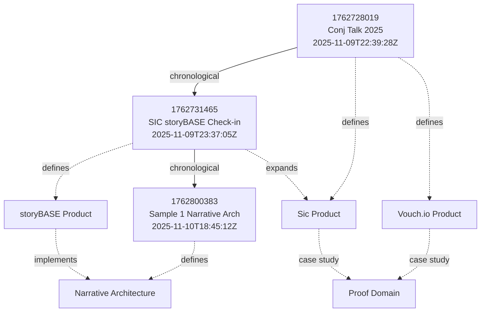
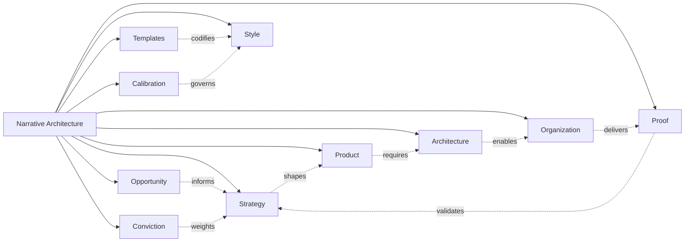
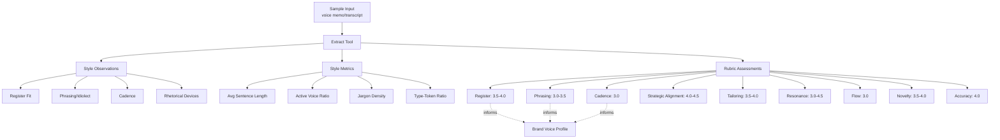

# storyBASE State & Overview

## State

The storyBASE currently holds **three transactions** that establish foundational narrative architecture for identity systems, AI memory platforms, and organizational strategy. The graph encodes:

- **Two product narratives**: Vouch.io (enterprise identity) and Sic/storyBASE (AI memory and narrative-driven knowledge graphs)[^vouch-sic]
- **Style observations and rubric assessments** from voice memos and transcripts, capturing speaker idiolect, cadence, and rhetorical patterns[^style-sample1][^style-checkin]
- **Narrative architecture concepts** linking immutable identity, functional UI paradigms, and append-only event logs to Clojure principles[^immutable-identity]

The snapshot contains **517 inserted triples** across opportunity, strategy, product, architecture, organization, proof, templates, calibration, style, and conviction domains. No deletions or conflicts; 88 duplicate triples were skipped during compilation[^snapshot-stats].

[^vouch-sic]: Products extracted from Conj Talk 2025 proposal (`urn:uuid:product-vouch-io`, `urn:uuid:product-sic`) and SIC/storyBASE check-in sample.
[^style-sample1]: Sample 1 (`narr:Sample_1`) captures voice memo on narrative architecture for identity-as-append-only-log talk; speaker Scarlet Dame; 11,800 input length; rubric scores 3.0–4.5 across register, phrasing, cadence, strategic alignment, tailoring, resonance, flow, novelty, accuracy.
[^style-checkin]: SIC/storyBASE check-in sample (`http://storybase.synthetic-identity.co/sample/2025-01-29T000000Z_sic-storybase-checkin`) 18,437 input length; conversational transcript with technical depth; rubric scores 3.0–4.0.
[^immutable-identity]: Theme concepts `narr:Theme_ImmutableIdentity` and `narr:Theme_TransitionAsStateChange` define identity as integral of snapshots over time, not mutable present state; personal transition as functional transformation.
[^snapshot-stats]: Snapshot metadata: 517 inserted, 0 deleted, 88 skipped duplicates, 0 delete misses, 1 graph, Turtle format.

---

## Stories

### `/README.story`
**Intent**: Auto-generated repository README tracking storyBASE state, stories, assets, and transactions.  
**Relationship**: Meta-narrative; provides navigational overview and change log for the entire knowledge graph.  
**Approach**: Compile current snapshot statistics, enumerate `.story` files and `.storyBASE` transactions, summarize key narrative nodes (Opportunity, Strategy, Product, Proof), and render Mermaid diagrams showing transaction lineage and concept hierarchy.

### `/presenter.story`
**Intent**: IA Presenter template for talk presentations; demonstrates format conventions (headings, speaker notes, image placement, citations).  
**Relationship**: Template artifact; supports Proof and Templates domains by codifying reusable presentation structure.  
**Approach**: Reference existing style observations (e.g., `narr:StyleObs_storyBASE`, citation conventions `#CaretBracketMarker`) and narrative anchor elements (`#Tagline`, `#KeyPhrases`) to populate slides with on-brand messaging; cite storyBASE provenance in footnotes.

### `/conj-talk-2025.story`
**Intent**: Clojure Conj 2025 talk on immutable identity systems; covers personal journey, identity models, Clojure principles, Vouch.io + Sic case studies.  
**Relationship**: Proof artifact; synthesizes Opportunity (identity vulnerability crisis), Strategy (functional immutable identity architecture), Product (Vouch.io, Sic), and Architecture (append-only event logs, knowledge graphs) into a coherent experience report[^conj-extraction].  
**Approach**: Structure slides around narrative arc (problem → strategy → proof); use style rubric to ensure clarity (4.5/5), technical depth (4.8/5), narrative coherence (4.6/5), and audience engagement (4.3/5)[^conj-rubric]; cite transactions `narr:Tx_20251109T223928Z_conj2025` and related nodes; include speaker notes with personal identity lens and triadic enumeration rhetorical structures[^conj-style].

[^conj-extraction]: Transaction `narr:Tx_20251109T223928Z_conj2025` generated by `n8n.storyTWIN/MCP` using `anthropic/claude-sonnet-4.5` on 2025-11-09; captures Opportunity (identity vulnerability), Strategy (Clojure principles applied to identity), Products (Vouch.io, Sic), Proof (talk structure), Architecture (immutable identity patterns), Organizations (Sic, Vouch.io).
[^conj-rubric]: Rubric assessments: Clarity 4.5/5, Technical Depth 4.8/5, Narrative Coherence 4.6/5, Audience Engagement 4.3/5; rationale includes clear problem statement, strong Clojure grounding, coherent arc, actionable takeaways.
[^conj-style]: Style observations include brand name styling (Vouch.io, Sic), technical terms (append-only event logs, authentication as pure functions), rhetorical structures (triadic enumeration, problem-to-solution bridge), technical reframing (identity as evolving log, trust as computable provenance), personal identity lens (trans woman lived experience informs contextual, evolving identity framing).

---

## Assets

```
/
├── .storyBASE/
│   ├── 1762800383add_sample1_narrative_architecture.sparql
│   ├── 1762731465sic-storybase-checkin.sparql
│   └── 1762728019add_conj_talk_2025_extraction.sparql
├── README.story
├── presenter.story
└── conj-talk-2025.story
```

**`.storyBASE/` directory**: Append-only transaction log; each `.sparql` file is an immutable INSERT DATA operation with provenance metadata (`prov:wasGeneratedBy`, `prov:wasAttributedTo`, `prov:generatedAtTime`, `sb:originPath`, `sb:originRef`, `storytwin:model`)[^tx-provenance]. Transactions are replayed in lexicographic order to produce the compiled Turtle snapshot.

**`.story` files**: YAML front matter + Markdown prompt templates; define story ID, title, version, description, destination path, and target model(s). Processed by storyTWIN agent to generate narrative artifacts (presentations, READMEs, case studies) grounded in the storyBASE snapshot.

[^tx-provenance]: All transactions include `prov:wasAssociatedWith` (agent: `storyTWIN`, `n8n.storyTWIN/MCP`), `prov:wasAttributedTo` (user: `pleasetrythisathome`), `prov:generatedAtTime` (ISO 8601 timestamp), `sb:originPath` (Git path), `sb:originRef` (Git branch), `storytwin:model` (LLM identifier, e.g., `anthropic/claude-sonnet-4.5`).

---

## Transactions

### `1762800383add_sample1_narrative_architecture.sparql`
**Timestamp**: 2025-11-10T18:45:12.711Z  
**Agent**: `storyTWIN` / `pleasetrythisathome`  
**Model**: `anthropic/claude-sonnet-4.5`  
**Significance**: Establishes **narrative architecture ontology** for identity systems; introduces Sample 1 (voice memo, 11,800 chars), theme concepts (immutable identity as append-only log, transition as state machine), actors (Scarlet Dame, Luke Vanderhart), anchor concept (narrative architecture framework), style observations (brand name stylization `storyBASE`, idiolect phrasing `append only log`, metaphors, first-person narrative), and rubric assessments (register 4.0, phrasing 3.5, cadence 3.0, strategic alignment 4.5, tailoring 4.0, resonance 4.5, flow 3.0, novelty 4.0, accuracy 4.0)[^tx1-detail]. Connects to Strategy (`#NarrativeAnchor`), Product (`#ProductLadder`), and Style (`#RhetoricalDevices`, `#IdiolectPhrasing`).

[^tx1-detail]: Sample 1 source: "Voice memo: Punch talk conceptual framing"; created 2025-01-15; speaker Scarlet Dame (alt labels Dylan Butman, Scarlet Spectacular); style metrics: avg sentence length 28.5, active voice ratio 0.75, jargon density 0.12; style observations include CamelCase+CAPS suffix brand identity, recurring technical phrase "append only log" central to identity-as-log metaphor, core analogy linking UI rendering to immutable state paradigm, extended analogy personal identity presentation ≈ UI rendering from state, declarative emphatic cadence, first-person conversational register.

### `1762731465sic-storybase-checkin.sparql`
**Timestamp**: 2025-11-09T23:37:05.079Z  
**Agent**: `n8n.storyTWIN/MCP` / `pleasetrythisathome`  
**Significance**: Captures **product & strategy check-in** for SIC/storyBASE/as written.ai (18,437 chars); defines market opportunity (AI context requirements, RDF-based narrative source of truth), timing thesis (2024–2026 convergence of prompt engineering maturity, multi-agent workflows, organizational AI memory demand), positioning thesis (extend software development rigor into strategy/content/marketing via RDF narrative source of truth), moat leverage (Git-native, versionable, branchable AI memory encoding style, conviction, narrative metrics), product overview (n8n prototype, tools: compile/extract/diff/tx/commit, MCP server, Open WebUI, GitHub Actions), roadmap (move to TriG named graphs, SHACL validation, evolved individuation pipeline, file ingestion, marketplace, cost pass-through billing), system topology (n8n agent orchestrates tools, MCP server exposes to frontends, transactions in `.storybase` directories, hierarchical compile, Docker Compose on Digital Ocean), data model lifecycle (append-only transaction log, immutable files, snapshot = replay of sorted transactions, provenance in TX step, future named graphs for add/remove), integration points (GitHub OAuth/webhooks/Actions, Open Router API proxy via Helicone, Outseta OIDC/billing, MCP protocol tool exposure, future GitHub Apps with scoped credentials), role topology (programming-literate users, admin/read-write/read-only modes, GitHub role-based access, future scoped permissions), process (interactive individuation extract→diff→tx→review→commit vs. automated ingestion file upload→extraction→PR, story generation triggered by transaction or `.story` file changes), case studies (planned demo: Crooked Media podcast transcripts auto-ingested, stories auto-update, perspectival operations e.g. start with NPR evolve with OpenAI), style observations (brand name stylization CamelCase `storyBASE`, conversational filler "you know", power verb "extend", implicit comparison AI without context = generic output, first-person "I" and "So I don't know" signal informal direct tone, technical jargon RDF/canonization/skolemization used without definition assumes literate audience, short punchy sentence breaks up technical explanation, parallel structure "extract…diff…tx" reinforces workflow sequence, rhetorical framing transitions to roadmap discussion, citation marker present but unfilled signals placeholder), style metrics (avg sentence length 35.2, active voice ratio 0.72, jargon density 0.18, type-token ratio 0.42), rubric assessments (register fit 3.5, phrasing 3.0, cadence 3.0, strategic alignment 4.0, audience tailoring 3.5, resonance 3.0, flow 3.0, novelty 3.5, accuracy 4.0)[^tx2-detail]. Connects to Opportunity (`#MarketContext`, `#ActorIncentiveAnalysis`), Strategy (`#StrategyOverview`, `#NarrativeAnchor`, `#NarrativeDrivenRoadmap`), Product (`#ProductOverview`, `#ModulesCapabilities`, `#DependenciesIntegrations`), Architecture (`#SystemTopology`, `#DataModelLifecycle`, `#IntegrationPoints`), Organization (`#RoleTopology`, `#Process`), Proof (`#CaseStudies`), Style (`#BrandNameStylization`, `#IdiolectPhrasing`, `#ToneDirectPersonal`, `#JargonPolicy`, `#Parallelism`, `#RhetoricalQuestion`, `#CaretBracketMarker`), and Calibration.

[^tx2-detail]: Sample attributed to `http://storybase.synthetic-identity.co/actor/scarlet-dame`; timestamp 2025-01-29T00:00:00Z; description "Spoken transcript with conversational register and technical depth on storyBASE product evolution"; 10 style observations (brand name stylization, idiolect phrasing, verb choice, simile, tone direct personal, jargon policy, sentence length variation, parallelism, rhetorical question, caret bracket marker); 9 rubric assessments (register fit, phrasing, cadence, strategic alignment, audience tailoring, resonance, flow, novelty, accuracy) with scores 3.0–4.0 and detailed rationale; style metrics conversational transcript with high jargon and active voice.

### `1762728019add_conj_talk_2025_extraction.sparql`
**Timestamp**: 2025-11-09T22:39:28.133Z  
**Agent**: `n8n.storyTWIN/MCP` / `pleasetrythisathome`  
**Model**: `anthropic/claude-sonnet-4.5`  
**Significance**: Extracts **Conj Talk 2025 proposal** (3,421 chars); defines opportunity (identity vulnerability crisis: centralized mutable identity systems vulnerable to deepfakes, synthetic identities, impersonation fraud), strategy (functional immutable identity architecture: applies Clojure principles—immutability, explicit state, functional composition, data-first design, knowledge graphs—to create trustworthy identity systems; approach models identity as append-only event logs, authentication as pure functions, delegation as auditable chains; differentiator immutable facts at the edge, verifiable receipts, graph-based resolution), products (Vouch.io enterprise identity platform using immutable event logs and delegation chains, past work speaker now strategic advisor; Sic AI memory platform using narrative-driven knowledge graphs to create AI individuals with deterministic individuality and provenance, current work speaker is founder), proof (Conj 2025 experience report: conference talk, threaded diagrams from model to implementation, optional short demo with canned fallback, audience Clojure developers and functional programming practitioners), architecture (immutable identity system patterns: append-only event logs with verifiable receipts, authentication as pure function at the edge, delegation as signed append-only events, knowledge graphs for entity and role resolution; principles immutability, functional composition, explicit state management, data-first design), organizations (Sic founder, Vouch.io former Chief Strategist current strategic advisor), style observations (brand name styling Vouch.io domain extension, technical terms append-only event logs/authentication as pure functions/persistent logs and knowledge graphs, rhetorical structures triadic enumeration "deterministic individuality, narrative-driven provenance, and shareable perspective" and problem-to-solution bridge "We move from a simple mental model to concrete system patterns you can adopt today", technical reframing identity as evolving log of facts rather than static profile and trust as provenance that you can compute, list structure parallel construction actionable takeaways, personal identity lens "As a trans woman, her lived experience informs a clear, practical framing of identity as contextual and evolving"), rubric assessments (clarity 4.5/5 clear problem statement well-structured proposal actionable takeaways minor density in technical sections, technical depth 4.8/5 strong grounding in Clojure principles concrete system patterns dual case studies Vouch.io Sic verifiable architecture, narrative coherence 4.6/5 coherent arc from problem deepfakes through strategy immutability to proof talk structure dual product lens adds depth, audience engagement 4.3/5 actionable takeaways optional demo clear attendee value could strengthen emotional hook beyond technical urgency), style metrics (avg sentence length 22.4, technical density 0.68, active voice ratio 0.71, note moderate sentence length high technical density strong active voice in takeaways)[^tx3-detail]. Connects to Opportunity (`#MarketContext`, `#ActorIncentiveAnalysis`), Strategy (`#StrategyOverview`, `#PositioningThesis`, `#MoatLeverage`), Product (`#ProductOverview`, `#Differentiators`), Architecture (`#ArchitectureOverview`, `#SystemTopology`, `#DataModelLifecycle`), Organization (`#RoleTopology`), Proof (`#CaseStudies`, `#Outcomes`), Style (`#BrandNameStylization`, `#TerminologyControl`, `#VerbChoice`, `#RhetoricalDevices`, `#Simile`, `#Metaphor`, `#Analogy`, `#RhetoricalQuestion`, `#Parallelism`, `#ToneDirectPersonal`), and Calibration.

[^tx3-detail]: Sample record `urn:uuid:conj-talk-2025-extraction` recorded 2025-01-01T00:00:00Z, input length 3421, label "Conj Talk 2025: Immutable Selves"; 11 style observations (brand name styling Vouch.io, technical terms append-only event logs/authentication as pure functions/persistent logs and knowledge graphs, rhetorical structures triadic enumeration/problem-to-solution bridge, technical reframing identity/trust, list structure parallel construction, personal identity lens); 4 rubric assessments (clarity, technical depth, narrative coherence, audience engagement) with scores 4.3–4.8/5 and detailed rationale; style metrics avg sentence length 22.4, technical density 0.68, active voice ratio 0.71, note moderate sentence length high technical density strong active voice in takeaways.

---

## Mermaid Diagrams

### Transaction Lineage


### Narrative Architecture Concept Hierarchy (Top-Level)


### Style Rubric Assessment Flow


---

**Snapshot compiled**: 2025-11-10T18:46:36.959Z  
**Graph statistics**: 517 triples inserted, 0 deleted, 88 duplicates skipped, 1 graph, Turtle format  
**Provenance**: All transactions attributed to `pleasetrythisathome`, generated by `storyTWIN`/`n8n.storyTWIN/MCP` agents using `anthropic/claude-sonnet-4.5` model, origin ref `main`.