# storyBASE State Overview

The storyBASE is a Git-native RDF knowledge graph encoding narrative architecture for **Immutable Selves**—a functional approach to human and AI identity systems. The graph currently holds **three samples** extracted from voice memos and presentation transcripts, all centered on applying Clojure's immutability principles (append-only logs, single source of truth, pure function rendering) to identity.[^1]

[^1]: Core narrative `narr:Narrative_ImmutableIdentity` defines the thesis: "Identity—both human and AI—should be modeled as an append-only log that compiles to state, not mutable objects" (source: `narr:Sample_ConjPresentation_2025`).

The graph contains **two solution archetypes**—**berecognized.id** (human identity via Datomic) and **aswritten.ai** (AI identity via RDF+git)—plus extensive style observations, rubric assessments, and strategic positioning.[^2] All transactions are append-only SPARQL files in `/.storyBASE`, compiled into a single Turtle snapshot.

[^2]: `narr:SolutionArchetype_BeRecognized` and `narr:SolutionArchetype_AsWritten` both follow the pattern: SSoT → query → render → event → transact → recompile (sources: `narr:ApproachPattern_1`, `narr:ApproachPattern_2`).

---

## Stories

### `/README.story` – Repository README

**Intent:** Auto-generate a README that tracks the storyBASE state, stories, assets, and transaction history.

**Relationship to whole:** Meta-documentation; provides human-readable entry point to the graph's current state and evolution.

**Approach:** Query the snapshot for samples, narratives, solution archetypes, and transactions; summarize each with provenance citations; include Mermaid diagrams showing transaction flow and narrative structure.

---

### `/presenter.story` – Repo Presentation

**Intent:** Draft a presentation *about* the storyBASE itself using the IA Presenter format.

**Relationship to whole:** Demonstrates storyBASE's capability to generate narrative artifacts from its own graph; meta-proof of the system.

**Approach:** Extract narrative anchors (`narr:Tagline_1`, `narr:Mission_1`, `narr:Vision_1`), product ladder primitives/flows, and style observations; structure as slides with talk tracks; cite graph provenance inline.[^3]

[^3]: Narrative anchor includes: Tagline "Immutable Selves: A Functional Approach to Digital Identity", Mission "Move identity from mutable documents to compiled surfaces", Vision "A world where identity is rendered from immutable history" (all from `narr:Sample_1`, generated by `narr:Tx_20251111T214920Z_immutable_selves`).

---

### `/conj-talk-2025.story` – Clojure/conj 2025 Talk

**Intent:** Generate the full Clojure/conj 2025 presentation on Immutable Selves in IA Presenter format.

**Relationship to whole:** Primary proof artifact; the talk *is* the narrative anchor made concrete for a technical audience.

**Approach:** Use `narr:Sample_ConjPresentation_2025` as source; structure around the core thesis (identity as append-only log), two solution archetypes (berecognized.id, aswritten.ai), and Clojure design patterns (immutability, reified change, SSoT); apply style observations (short punchy cadence, anaphora, rhetorical questions, stock phrases like "No frameworks / Simple tools ± good principles"); include Mermaid diagrams for flows; cite rubric assessments showing 4.5–5.0 scores on strategic alignment, tailoring, and resonance.[^4]

[^4]: Rubric assessments for Conj presentation: Register 4.5 ("conversational yet authoritative; second-person direct address"), Strategic Alignment 5.0 ("entire presentation is a narrative anchor"), Tailoring 5.0 ("deeply tailored to Clojure/conj audience"), Resonance 4.5 ("strong analogies, personal story adds emotional resonance") (all from `narr:Tx_20251113T030805Z_conj2025`).

---

## Assets

```
/.storyBASE/
  1762728019add_conj_talk_2025_extraction.sparql
  1762731465sic-storybase-checkin.sparql
  1762800383add_sample1_narrative_architecture.sparql
  1762897917add_narrative_anchors.sparql
  1762897917add_product_ladder.sparql
  1762897917add_solution_archetypes.sparql
  1762897917add_strategy_overview.sparql
  1762897917add_technical_explainers.sparql
  1762897917add_style_observations.sparql
  1762897917add_style_metrics.sparql
  1762897917add_rubric_assessments.sparql
  1762897917add_case_studies.sparql
  1762897917tx_provenance.sparql
  1762897917update_sample_metadata.sparql
  1763003388add_conj_presentation_2025.sparql

/README.story
/presenter.story
/conj-talk-2025.story
```

**`/.storyBASE/`**: Append-only transaction log; each `.sparql` file is an immutable INSERT DATA or DELETE/INSERT operation. Files are sorted lexicographically and replayed to produce the snapshot.[^5]

[^5]: System topology: "transactions in .storybase directories; hierarchical compile" (source: `http://storybase.synthetic-identity.co/architecture/topology-storybase`).

**`/*.story`**: YAML front matter + prompt templates for story generation; GitHub Actions trigger model outputs when these files or transactions change.[^6]

[^6]: Product overview: "GitHub Actions for story generation" (source: `http://storybase.synthetic-identity.co/product/overview-storybase`).

---

## Transactions

### `1762728019add_conj_talk_2025_extraction.sparql`
**Timestamp:** 2025-11-09T22:39:28Z  
**Significance:** First extraction for Conj Talk 2025 proposal; captures narrative architecture (Opportunity, Strategy, Product, Proof, Architecture, Organization), 11 style observations, 4 rubric assessments (Clarity 4.5, Technical Depth 4.8, Narrative Coherence 4.6, Audience Engagement 4.3), and style metrics (avg sentence length 22.4, active voice 0.71).[^7]

[^7]: Transaction `narr:Tx_20251109T223928Z_conj2025` generated products `urn:uuid:product-vouch-io` (Vouch.io Identity Platform) and `urn:uuid:product-sic` (Sic AI Memory Platform), plus strategy `urn:uuid:strategy-functional-immutable-identity` applying Clojure principles to identity.

---

### `1762731465sic-storybase-checkin.sparql`
**Timestamp:** 2025-11-09T23:37:05Z  
**Significance:** Product & strategy check-in; adds storyBASE market opportunity, timing thesis (2024–2026 window), positioning thesis ("extend software development rigor into strategy/content/marketing"), moat leverage (git-native, versionable AI memory), product overview (n8n prototype, MCP server, Open WebUI), roadmap (TriG named graphs, SHACL validation, individuation pipeline), and 10 style observations.[^8]

[^8]: Transaction `http://storybase.synthetic-identity.co/transaction/2025-01-29T000000Z_sic-storybase-checkin` generated `http://storybase.synthetic-identity.co/opportunity/storybase-market` ("High-quality AI output requires extensive context; RDF-based narrative source of truth enables specific, controllable, versionable AI memory") and `http://storybase.synthetic-identity.co/tagline/storybase` ("AI that tells you a story as written").

---

### `1762800383add_sample1_narrative_architecture.sparql`
**Timestamp:** 2025-11-10T18:45:12Z  
**Significance:** Adds `narr:Sample_1` (voice memo on narrative architecture, 11,800 chars); introduces themes `narr:Theme_ImmutableIdentity` and `narr:Theme_TransitionAsStateChange`; actors `narr:Actor_ScarletDame` (speaker, alt labels Dylan Butman / Scarlet Spectacular) and `narr:Actor_LukeVanderhart`; anchor concept `narr:Anchor_NarrativeArchitecture` linking immutable state, functional UI, and AI-driven generation via RDF; 6 style observations (brand stylization "storyBASE", idiolect "append-only log", metaphor "UI as state machine", transition analogy, short clause "The truth is immutable", first-person narrative); 8 rubric assessments (Register 4.0, Resonance 4.5, Strategy 4.5).[^9]

[^9]: `narr:Actor_ScarletDame` note: "Speaker's identity history exemplifies append-only log model" (source: `narr:Sample_1`, generated by `narr:Tx_20251110T184512Z_sample1`).

---

### `1762897917add_narrative_anchors.sparql`
**Timestamp:** 2025-11-11T21:49:20Z  
**Significance:** Establishes core narrative anchors for `narr:Sample_1`: `narr:Tagline_1` ("Immutable Selves: A Functional Approach to Digital Identity"), `narr:WhatIsIt_1` ("vision for human and AI identity as compiled from immutable source of truth"), `narr:Mission_1` ("Move identity from mutable documents to compiled surfaces"), `narr:Vision_1` ("world where identity is rendered from immutable history"), and four key phrases ("single source of truth", "append-only log", "pure function", "digital twin").[^10]

[^10]: All anchors sourced from `narr:Sample_1`, generated by `narr:Tx_20251111T214920Z_immutable_selves`.

---

### `1762897917add_product_ladder.sparql`
**Timestamp:** 2025-11-11T21:49:20Z  
**Significance:** Defines product ladder: 3 primitives (append-only transaction log, SSoT, pure function renderer), 1 behavior (event-driven transaction submission), 1 flow (SSoT → query → render → interact → event → transact → append log → recompile SSoT), 1 narrative ("From mutable documents to compiled selves").[^11]

[^11]: `narr:Flow_1` note: "End-to-end loop; identity as continuous compilation" (source: `narr:Sample_1`).

---

### `1762897917add_solution_archetypes.sparql`
**Timestamp:** 2025-11-11T21:49:20Z  
**Significance:** Adds two solution archetypes: `narr:Archetype_1` (berecognized.id: Immutable Identification; problem: fragmented mutable identity; approach: Datomic SSoT → datalog → render to privileges; outcome: cryptographic proof of identity state) and `narr:Archetype_2` (aswritten.ai: Immutable AI Identity; problem: AI black boxes with no provenance; approach: RDF+git SSoT → SPARQL → render to AI memory; capabilities: RDF graph, git versioning, SPARQL, multimodal renderer).[^12]

[^12]: `narr:ProblemContext_2` note: "Stakes: narrative manipulation, embedded propaganda, deepfakes" (source: `narr:Sample_1`).

---

### `1762897917add_strategy_overview.sparql`
**Timestamp:** 2025-11-11T21:49:20Z  
**Significance:** Adds `narr:PositioningThesis_1` ("For developers and identity architects who treat identity as mutable state, this is a functional paradigm that makes identity deterministic, auditable, and decentralized—by applying Clojure's immutability principles") and `narr:MoatLeverage_1` ("Clojure ecosystem as proof-of-concept; 13 years of production experience; provenance and equality by design").[^13]

[^13]: Both sourced from `narr:Sample_1`, generated by `narr:Tx_20251111T214920Z_immutable_selves`.

---

### `1762897917add_technical_explainers.sparql`
**Timestamp:** 2025-11-11T21:49:20Z  
**Significance:** Adds `narr:LeverageProfile_1` ("Immutability enables equality, provenance, versioning, branching, generative testing, decentralization, and infinite read scale—for free"), `narr:DesignTradeoff_1` ("Bottleneck at single transactor; all logic in event clients; transact is just adding triples"), `narr:ComparativeAnalysis_1` ("Backbone.js vs. Om/React; identity systems today are Backbone; this is Om for identity").[^14]

[^14]: `narr:ComparativeAnalysis_1` note: "When to use: when provenance, auditability, and equality matter more than write throughput" (source: `narr:Sample_1`).

---

### `1762897917add_style_observations.sparql`
**Timestamp:** 2025-11-11T21:49:20Z  
**Significance:** Adds 8 style observations with Web Annotation targets: `narr:StyleObs_1` (formula-style cadence "Simple tools + good principles = design patterns"), `narr:StyleObs_2` (stock phrase "Your code was shit. Let me refactor it for you."), `narr:StyleObs_3` (anaphora "You saw… Then you queried… Then you mutated"), `narr:StyleObs_4` (brand stylization "scarlet dame" lowercase), `narr:StyleObs_5` (core analogy: identity systems = Backbone.js), `narr:StyleObs_6` (rhetorical question "Anyone remember backbone.js?"), `narr:StyleObs_7` (second-person "You saw a picture"), `narr:StyleObs_8` (verb choice "mutated" with negative connotation).[^15]

[^15]: All observations use `oa:TextPositionSelector` and `oa:TextQuoteSelector` to anchor to exact character offsets in `narr:Sample_1`.

---

### `1762897917add_style_metrics.sparql`
**Timestamp:** 2025-11-11T21:49:20Z  
**Significance:** Adds `narr:StyleMetrics_1` for `narr:Sample_1`: average sentence length 15.2, active voice ratio 0.85, jargon density 0.12, type-token ratio 0.68, conciseness 0.78.[^16]

[^16]: Note: "Short sentences, high active voice, moderate jargon (technical audience), good lexical diversity, concise" (source: `narr:Sample_1`).

---

### `1762897917add_rubric_assessments.sparql`
**Timestamp:** 2025-11-11T21:49:20Z  
**Significance:** Adds 9 rubric assessments for `narr:Sample_1`: Register 4.5, Phrasing 4.0, Cadence 4.5, Strategic Alignment 5.0, Tailoring 4.5, Resonance 4.0, Flow 3.5, Novelty 4.0, Accuracy 4.0.[^17]

[^17]: `narr:RubricAssess_4` note: "Entire talk is the narrative anchor: immutability → identity. Mission, vision, key phrases all present and consistent" (broader: `narr:Rubric_StrategicAlignment`).

---

### `1762897917add_case_studies.sparql`
**Timestamp:** 2025-11-11T21:49:20Z  
**Significance:** Adds `narr:CaseStudy_1`: speaker's 13-year Clojure career (Backbone.js 2012 → Om 2013 → production systems); intervention: applied Clojure principles to UI then identity systems (berecognized.id, aswritten.ai); results: provenance, equality, versioning, decentralization, infinite read scale achieved; lessons: "Same principles apply across UI, identity, and AI; immutability is the unlock; single transactor is acceptable bottleneck."[^18]

[^18]: `narr:CaseContext_1` note: "Customer: self; environment: professional dev career; stakes: credibility" (source: `narr:Sample_1`).

---

### `1762897917tx_provenance.sparql`
**Timestamp:** 2025-11-11T21:49:20Z  
**Significance:** Transaction-level provenance for `narr:Tx_20251111T214920Z_immutable_selves`; associates with agent `storyTWIN#anthropic-claude-sonnet-4.5`, attributed to user `pleasetrythisathome`, generated 40+ entities (Sample_1, Tagline_1, Mission_1, Vision_1, KeyPhrase_1–4, PositioningThesis_1, MoatLeverage_1, Primitive_1–3, Behavior_1, Flow_1, Narrative_1, Archetype_1–2, ArchetypeTitle_1–2, ProblemContext_1–2, ApproachPattern_1–2, RequiredCapabilities_1–2, OutcomesProof_1, LeverageProfile_1, DesignTradeoff_1, ComparativeAnalysis_1, CaseStudy_1, CaseContext_1, CaseIntervention_1, CaseResults_1, CaseLessons_1, StyleObs_1–8, RubricAssess_1–9, StyleMetrics_1).[^19]

[^19]: Transaction `narr:Tx_20251111T214920Z_immutable_selves` generated at 2025-11-11T21:49:20.430Z, origin ref "main".

---

### `1762897917update_sample_metadata.sparql`
**Timestamp:** 2025-11-11T21:49:20Z  
**Significance:** Updates `narr:Sample_1` metadata: source "Immutable Selves talk", inputLength 5847, created "2025-01-XX"; DELETE/INSERT pattern shows metadata correction.[^20]

[^20]: Transaction uses WHERE clause to match old values before updating; provenance: `narr:Tx_20251111T214920Z_immutable_selves`.

---

### `1763003388add_conj_presentation_2025.sparql`
**Timestamp:** 2025-11-13T03:08:05Z  
**Significance:** Adds `narr:Sample_ConjPresentation_2025` (6,847 chars, "Clojure/conj 2025 presentation: Immutable Selves"); narrative `narr:Narrative_ImmutableIdentity` ("Identity—both human and AI—should be modeled as an append-only log that compiles to state"); theme `narr:Theme_FunctionalIdentity` ("Apply Clojure design patterns to identity systems"); actors `narr:Actor_Human` ("Source of truth for identity; authorities issue documents that make claims") and `narr:Actor_AI` ("Source of truth unclear; labs train models that say stuff"); solution archetypes `narr:SolutionArchetype_BeRecognized` and `narr:SolutionArchetype_AsWritten`; tagline `narr:Tagline_AsWritten` ("AI that tells your story, as written"); 8 style observations (brand stylization "aswritten.ai" and "berecognized.id" lowercase with TLD, metaphor "Identity is not mutable state / Yet we're treating it like Backbone.js", anaphora "Make state explicit / Append only log → Single source of truth / Everyone sees the same thing / Render as pure function", rhetorical questions "Where is the identity here? / Who is the authority? / What are the claims being made?", short punchy "Human Identity / Source of truth / You.", stock phrase "No frameworks / Simple tools ± good principles", citation marker `[#webster]`, second-person "Authorities issue documents that make claims about you", analogy "Experience is an append-only log that compiles to identity"); metrics (avg sentence length 12.3, active voice 0.82, jargon density 0.15, conciseness 0.78); 9 rubric assessments (Register 4.5, Phrasing 4.0, Cadence 4.5, Strategic Alignment 5.0, Tailoring 5.0, Resonance 4.5, Flow 4.0, Novelty 4.5, Accuracy 4.0).[^21]

[^21]: Transaction `narr:Tx_20251113T030805Z_conj2025` generated 27 entities; associated with "storyTWIN", attributed to "pleasetrythisathome", origin ref "main".

---

## Transaction Flow

```mermaid
graph TD
    A[narr:Tx_20251109T223928Z_conj2025<br/>2025-11-09T22:39:28Z] --> B[Conj Talk 2025 Extraction]
    B --> C[Opportunity: Identity Vulnerability]
    B --> D[Strategy: Functional Immutable Identity]
    B --> E[Products: Vouch.io, Sic]
    B --> F[Proof: Conj 2025 Talk]
    B --> G[11 Style Observations]
    B --> H[4 Rubric Assessments]
    
    I[narr:Tx_20251110T184512Z_sample1<br/>2025-11-10T18:45:12Z] --> J[Sample_1: Voice Memo]
    J --> K[Theme: Immutable Identity]
    J --> L[Actor: Scarlet Dame]
    J --> M[6 Style Observations]
    
    N[narr:Tx_20251111T214920Z_immutable_selves<br/>2025-11-11T21:49:20Z] --> O[40+ Entities]
    O --> P[Narrative Anchors]
    O --> Q[Product Ladder]
    O --> R[Solution Archetypes]
    O --> S[Strategy Overview]
    O --> T[Technical Explainers]
    O --> U[Case Study]
    
    V[narr:Tx_20251113T030805Z_conj2025<br/>2025-11-13T03:08:05Z] --> W[Sample_ConjPresentation_2025]
    W --> X[Narrative: Immutable Selves]
    W --> Y[2 Solution Archetypes]
    W --> Z[8 Style Observations]
    W --> AA[9 Rubric Assessments]
    W --> AB[Metrics: 12.3 avg sentence length]
```



---

## Narrative Structure

```mermaid
graph LR
    A[Narrative Anchor] --> B[Tagline:<br/>"Immutable Selves"]
    A --> C[Mission:<br/>Move identity to compiled surfaces]
    A --> D[Vision:<br/>Identity rendered from immutable history]
    
    E[Product Ladder] --> F[Primitives:<br/>Append-only log, SSoT, Pure function]
    F --> G[Behaviors:<br/>Event-driven transactions]
    G --> H[Flows:<br/>SSoT → query → render → interact → transact]
    H --> I[Narratives:<br/>Mutable documents → compiled selves]
    
    J[Solution Archetypes] --> K[berecognized.id:<br/>Datomic + datalog]
    J --> L[aswritten.ai:<br/>RDF + git + SPARQL]
    
    K --> H
    L --> H
    
    A --> I
```

---

**Snapshot stats:** 1,227 triples inserted, 0 deleted, 278 skipped duplicates, 1 graph, Turtle format.[^22]

[^22]: Snapshot generated 2025-11-13T03:09:59.591Z; compiled from 10 transactions spanning 2025-11-09 to 2025-11-13.