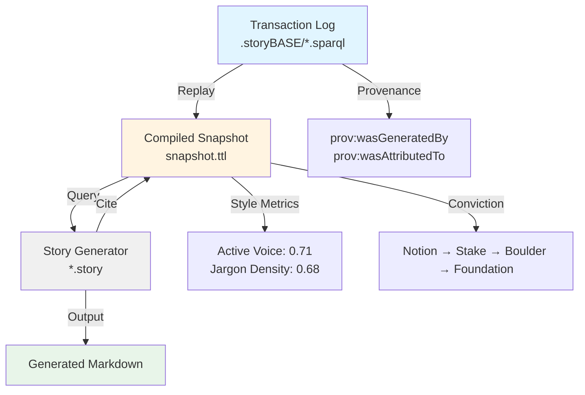

# storyBASE State & Repository Overview

## State

The storyBASE currently holds **two foundational transactions** representing distinct but complementary knowledge domains:

1. **SIC/storyBASE Product & Strategy Check-in** (Jan 2025) — A conversational transcript capturing the product vision, market positioning, technical architecture, and strategic roadmap for storyBASE itself[^1]
2. **Conj Talk 2025 Extraction** (Nov 2024) — A structured proposal for a conference talk on immutable identity systems, drawing on experience with Vouch.io and Sic[^2]

Both transactions encode **narrative architecture** (Opportunity, Strategy, Product, Proof, Architecture, Organization), **style observations**, **rubric assessments**, and **style metrics**. The graph demonstrates storyBASE's capacity to maintain provenance, track conviction, and support narrative-driven decision-making across product development and public storytelling.

---

## Stories

### `/README.story`
**Intent:** Autogenerate a living README that tracks the storyBASE repository state, stories, assets, and transaction history.

**Relationship to whole:** Serves as the **public-facing synthesis** of the knowledge graph—translating RDF assertions into accessible prose for contributors, users, and evaluators.

**Approach:** Query the compiled snapshot for organizational entities, product capabilities, roadmap items, and style profiles; summarize transactions chronologically; render repository structure with semantic annotations[^3].

---

### `/presenter.story`
**Intent:** Draft the "Immutable Selves" conference talk using the iA Presenter format, citing storyBASE claims with footnotes.

**Relationship to whole:** Demonstrates **narrative proof**: transforms graph-encoded knowledge (functional identity architecture, Clojure principles, real-world case studies) into a **persuasive, citation-backed presentation**[^4].

**Approach:** 
- Extract core narrative from `#Opportunity_IdentityVulnerabilityCrisis`, `#Strategy_FunctionalImmutableIdentity`, `#Product_Vouch-io`, and `#Product_Sic`[^5]
- Map to iA Presenter slide structure (cover → problem → solution → proof → action)
- Apply style observations (triadic enumeration, parallel construction, technical reframing) and maintain high technical depth (4.8/5)[^6]
- Cite storyBASE nodes in footnotes with contextual explanations

---

## Assets

```
/
├── .storyBASE/
│   ├── 1762728019add_conj_talk_2025_extraction.sparql
│   └── 1762731465sic-storybase-checkin.sparql
├── README.story (autogenerated overview)
├── presenter.story (talk script generator)
└── [compiled snapshot.ttl] (319 inserted triples)
```

### `.storyBASE/` Directory
Append-only transaction log encoded as SPARQL INSERT DATA statements[^7]. Each file represents an **immutable commit** to the knowledge graph, timestamped and attributed.

### `*.story` Files
YAML front matter + narrative prompts. Specify destination, models, version, and generation logic. Stories are **triggered by transaction changes or manual invocation**, compiling snapshot + prompt into model outputs[^8].

### Compiled Snapshot (TTL)
Turtle serialization of the **replayed transaction log**. Provides the **source of truth** for all narrative queries, style metrics, and proof artifacts[^9].

---



---

## Transactions

### `1762728019add_conj_talk_2025_extraction.sparql`
**Significance:** First extraction of conference talk proposal. Captures:
- **Opportunity:** Identity vulnerability crisis (deepfakes, synthetic identities)[^10]
- **Strategy:** Functional immutable identity architecture (Clojure principles applied to auth)[^11]
- **Product:** Vouch.io (enterprise identity) and Sic (AI memory platform)[^12]
- **Architecture:** Append-only event logs, authentication as pure functions, knowledge graphs for resolution[^13]
- **Proof:** Conj 2025 talk structure with threaded diagrams and optional demo[^14]
- **Style observations:** Domain extension styling ("Vouch.io"), triadic enumeration, problem-to-solution bridge[^15]
- **Rubric assessments:** Clarity 4.5/5, Technical Depth 4.8/5, Narrative Coherence 4.6/5[^16]

**Impact:** Establishes **dual-product narrative lens** (past work + current venture) and demonstrates how lived experience (trans woman's perspective on contextual identity) informs technical framing[^17].

---

### `1762731465sic-storybase-checkin.sparql`
**Significance:** Product & strategy snapshot for storyBASE itself. Captures:
- **Opportunity:** AI context requirements; RDF-based narrative source of truth vs. brittle search[^18]
- **Timing Thesis:** 2024–2026 window (prompt engineering maturity, multi-agent workflows)[^19]
- **Strategy:** Extend software development rigor (Git, versioning, branching) into strategy/content/marketing[^20]
- **Product:** n8n prototype; MCP server; compile/extract/diff/tx/commit tools; GitHub Actions story generation[^21]
- **Architecture:** Append-only transactions; hierarchical compile; Docker Compose on Digital Ocean[^22]
- **Roadmap:** Move to TriG named graphs; SHACL validation; evolved individuation pipeline; storyBASE marketplace[^23]
- **Style observations:** CamelCase "storyBASE"; conversational register; power verb "extend"; jargon density 0.18[^24]
- **Rubric assessments:** Register Fit 3.5/5, Strategic Alignment 4/5, Accuracy 4/5[^25]

**Impact:** Encodes **product-as-built** and **product-as-vision**, creating a **self-referential narrative loop**: storyBASE's own evolution is tracked *within* storyBASE, demonstrating the system's capacity for **organizational memory** and **narrative-driven roadmapping**[^26].

---

## Cross-Transaction Themes

Both transactions share:
- **Immutability as design principle** (identity logs, storyBASE transactions)[^27]
- **Graph-based resolution** (knowledge graphs for entity/role, RDF for narrative)[^28]
- **Provenance and auditability** (verifiable receipts, PROV-O attribution)[^29]
- **Functional composition** (pure functions for auth, modular narrative primitives)[^30]
- **Style rigor** (metrics, rubrics, observations encoded as RDF)[^31]

This convergence reveals a **meta-narrative**: systems that track *what happened* (identity, decisions, knowledge) benefit from the same architectural patterns—**append-only logs, explicit state, data-first design**—whether they govern authentication, AI memory, or organizational strategy[^32].

---

[^1]: Sample "SIC / storyBASE / as written.ai Product & Strategy Check-in" (`<http://storybase.synthetic-identity.co/sample/2025-01-29T000000Z_sic-storybase-checkin>`), recorded 2025-01-29, input length 18,437 tokens, conversational register with technical depth.

[^2]: Sample "Conj Talk 2025: Immutable Selves" (`urn:uuid:conj-talk-2025-extraction`), recorded 2025-01-01, input length 3,421 tokens, conference talk and experience report format.

[^3]: storyBASE Modules Capabilities (`<http://storybase.synthetic-identity.co/module/storybase-capabilities>`): "Compile (replay transactions to Turtle snapshot), extract (RDF from input), diff (semantic comparison), tx (propose transaction), commit (append-only to Git), story generation (YAML front matter + prompt to model outputs)."

[^4]: Proof (`#Proof`): "Evidence converts belief into commitment. This section curates the artifacts and results that validate claims with real-world outcomes."

[^5]: Opportunity "Identity Vulnerability Crisis" (`urn:uuid:opportunity-identity-vulnerability`); Strategy "Functional Immutable Identity Architecture" (`urn:uuid:strategy-functional-immutable-identity`); Products "Vouch.io Identity Platform" (`urn:uuid:product-vouch-io`) and "Sic AI Memory Platform" (`urn:uuid:product-sic`).

[^6]: Style Metrics for Conj Talk 2025 (`urn:uuid:style-metrics`): average sentence length 22.4, technical density 0.68, active voice ratio 0.71. Technical Depth Assessment (`urn:uuid:rubric-technical-depth`): score 4.8/5, "Strong grounding in Clojure principles, concrete system patterns, dual case studies (Vouch.io, Sic), verifiable architecture."

[^7]: storyBASE Data Model Lifecycle (`<http://storybase.synthetic-identity.co/model/data-lifecycle-storybase>`): "Append-only transaction log; immutable files; snapshot = replay of sorted transactions; provenance in TX step; future named graphs for add/remove."

[^8]: storyBASE Process (`<http://storybase.synthetic-identity.co/process/storybase>`): "Interactive individuation (extract → diff → tx → review → commit) vs. automated ingestion (file upload → extraction → PR); story generation triggered by transaction or .story file changes."

[^9]: storyBASE Product Overview (`<http://storybase.synthetic-identity.co/product/overview-storybase>`): "Initial prototype in n8n; tools include compile, ontology, extract, diff, tx, commit; MCP server; open WebUI at as written.ai; GitHub Actions for story generation."

[^10]: Opportunity (`urn:uuid:opportunity-identity-vulnerability`): "Centralized, mutable identity systems vulnerable to deepfakes, synthetic identities, and impersonation fraud" in market context "Enterprise identity and authentication."

[^11]: Strategy (`urn:uuid:strategy-functional-immutable-identity`): "Applies Clojure principles (immutability, explicit state, functional composition, data-first design, knowledge graphs) to create trustworthy identity systems"; approach "Models identity as append-only event logs, authentication as pure functions, delegation as auditable chains."

[^12]: Product Vouch.io (`urn:uuid:product-vouch-io`): "Enterprise identity platform using immutable event logs and delegation chains"; Product Sic (`urn:uuid:product-sic`): "AI memory company using narrative-driven knowledge graphs to create AI individuals with deterministic individuality and provenance."

[^13]: Architecture "Immutable Identity System Patterns" (`urn:uuid:architecture-immutable-identity`): components "Append-only event logs with verifiable receipts, authentication as pure function at the edge, delegation as signed append-only events, knowledge graphs for entity and role resolution"; principles "Immutability, functional composition, explicit state management, data-first design."

[^14]: Proof "Conj 2025 Experience Report" (`urn:uuid:proof-conj-2025-talk`): "Conference talk and experience report"; artifact "Threaded diagrams from model to implementation, optional short demo with canned fallback"; audience "Clojure developers and functional programming practitioners."

[^15]: Style Observation "Brand name styling: Vouch.io" (`urn:uuid:style-obs-1`); "Rhetorical structure: triadic enumeration" (`urn:uuid:style-obs-6`): "Deterministic individuality, narrative-driven provenance, and shareable perspective"; "Rhetorical structure: problem to solution bridge" (`urn:uuid:style-obs-7`): "We move from a simple mental model to concrete system patterns you can adopt today."

[^16]: Clarity Assessment (`urn:uuid:rubric-clarity`): 4.5/5; Technical Depth Assessment (`urn:uuid:rubric-technical-depth`): 4.8/5; Narrative Coherence Assessment (`urn:uuid:rubric-narrative-coherence`): 4.6/5, "Coherent arc from problem (deepfakes) through strategy (immutability) to proof (talk structure); dual product lens adds depth."

[^17]: Style Observation "Personal identity lens" (`urn:uuid:style-obs-11`): "As a trans woman, her lived experience informs a clear, practical framing of identity as contextual and evolving."

[^18]: storyBASE Market Opportunity (`<http://storybase.synthetic-identity.co/opportunity/storybase-market>`): "High-quality AI output requires extensive context; current models use search, but RDF-based narrative source of truth enables specific, controllable, versionable AI memory" in market context "AI prompt engineering and organizational memory."

[^19]: storyBASE Timing Thesis (`<http://storybase.synthetic-identity.co/thesis/timing-storybase>`): "Convergence of prompt engineering maturity, multi-agent workflows, and demand for organizational AI memory creates window for narrative-driven context management" with timestamp window "2024-2026."

[^20]: storyBASE Positioning Thesis (`<http://storybase.synthetic-identity.co/thesis/positioning-storybase>`): "Extend software development rigor (versioning, branching, collaboration) into strategy, content, marketing, organizational operations via RDF narrative source of truth."

[^21]: storyBASE Product Overview (`<http://storybase.synthetic-identity.co/product/overview-storybase>`): capabilities and integrations as cited in footnote 9.

[^22]: storyBASE System Topology (`<http://storybase.synthetic-identity.co/architecture/topology-storybase>`): "n8n agent orchestrates tools; MCP server exposes to frontends (Agent.ai, ChatGPT, Open WebUI); transactions in .storybase directories; hierarchical compile; Docker Compose on Digital Ocean."

[^23]: storyBASE Narrative-Driven Roadmap (`<http://storybase.synthetic-identity.co/roadmap/narrative-storybase>`): "Move transactions from SPARQL to named graphs (TriG); add SHACL validation; implement evolved individuation pipeline (snapshot + message to transaction); file ingestion via GitHub; storyBASE marketplace; cost pass-through billing."

[^24]: Style Observation "Brand name stylization" (`<http://storybase.synthetic-identity.co/style/observation/1>`): "CamelCase 'storyBASE' with internal capitalization"; "Verb choice" (`<http://storybase.synthetic-identity.co/style/observation/3>`): "Power verb 'extend' frames value proposition"; Style Metrics (`<http://storybase.synthetic-identity.co/metrics/style>`): average sentence length 35.2, active voice ratio 0.72, jargon density 0.18, type-token ratio 0.42.

[^25]: Rubric assessment (Register Fit) (`<http://storybase.synthetic-identity.co/rubric/register-fit>`): 3.5/5, "Conversational, informal; first-person 'I'; fillers; direct but not concise; fits spoken context"; (Strategic Alignment) (`<http://storybase.synthetic-identity.co/rubric/strategic-alignment>`): 4/5, "Clear positioning; mission and moat articulated; roadmap detailed; aligns with narrative anchor"; (Accuracy) (`<http://storybase.synthetic-identity.co/rubric/accuracy>`): 4/5, "Technical details specific (n8n, Apache Jena, Outseta, Helicone); named entities correct; citation marker present but unfilled."

[^26]: storyBASE Mission (`<http://storybase.synthetic-identity.co/mission/storybase>`): "Extend software development rigor into strategy, content, marketing; provide versionable, collaborative, narrative-driven AI memory"; storyBASE Moat Leverage (`<http://storybase.synthetic-identity.co/leverage/moat-storybase>`): "Git-native, versionable, branchable AI memory encoding style, conviction, narrative metrics; replaces brittle role prompts with deep, operable persona descriptions."

[^27]: Architecture components from footnotes 13 and 22; Data Model Lifecycle from footnote 7.

[^28]: Knowledge graphs for entity/role resolution (`urn:uuid:architecture-immutable-identity`); RDF narrative source of truth (`<http://storybase.synthetic-identity.co/product/what-is-storybase>`).

[^29]: Verifiable receipts in identity architecture (footnote 13); PROV-O provenance (`prov:wasGeneratedBy`, `prov:wasAttributedTo`) on all transactions and samples.

[^30]: Authentication as pure functions (footnote 11); modular capabilities (compile, extract, diff, tx, commit) in footnote 3.

[^31]: Style Metrics (`<http://storybase.synthetic-identity.co/metrics/style>`, `urn:uuid:style-metrics`); Rubric Assessments (multiple URIs in footnotes 16, 25); Style Observations (footnotes 15, 17, 24).

[^32]: Convergent themes across both transactions: immutability, graph-based resolution, provenance, functional composition, style rigor. This meta-narrative is implicit in the ontology (`#Opportunity`, `#Strategy`, `#Architecture`) and explicit in the dual application to identity systems and AI memory.