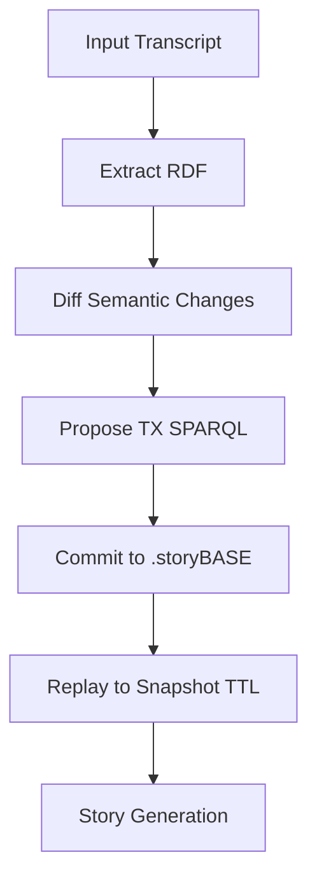

### State
The storyBASE graph represents an evolving RDF knowledge base for narrative-driven AI memory and identity systems, compiled from two append-only transactions. It encodes strategic, product, architectural, and stylistic elements for the storyBASE platform (an RDF-based AI context management tool) and a proposed Clojure conference talk on immutable identity architectures. Key entities include opportunities (e.g., AI memory market needs and identity vulnerabilities), theses (e.g., timing and positioning), products (e.g., storyBASE prototype and Sic AI platform), style observations (e.g., brand stylization and rhetorical devices), and rubric assessments (e.g., scores for clarity and technical depth). The graph uses immutable transactions for provenance, with 319 triples inserted across 1 graph (Turtle format). No deletions or duplicates were skipped. The snapshot was generated at 2025-11-10T01:22:58.816Z, reflecting a prototype state focused on extraction from spoken transcripts and proposals, with planned expansions like SHACL validation and named graphs.[^1][^2]

### Stories
#### README.story
This story serves as the repository's core documentation template, autogenerating a README to track the storyBASE system's state, narratives, and assets. Its intent is to provide an overview for users and contributors, ensuring alignment between the Git-native RDF graph and project artifacts. In relation to the whole, it acts as a meta-narrative hub, synthesizing transactions into readable summaries to bootstrap onboarding and maintain graph integrity across branches. From the current state, it will be approached by replaying the snapshot's transactions to populate sections on state, stories, assets, and transactions, emphasizing the storyBASE mission of versionable AI memory while incorporating recent extractions like the Conj 2025 talk for cross-narrative linkage.[^3]

#### presenter.story
This story outlines a presentation format for the "Immutable Selves" talk at Conj 2025, using the iA Presenter theme customized for SIC (Synthetic Identity Co.). Its intent is to structure a conference experience report on applying Clojure principles to immutable identity systems, including slides, speaker notes, and citations. In relation to the whole, it demonstrates proof-of-concept for storyBASE by extracting and rendering narrative architecture (opportunity, strategy, product) into a shareable artifact, bridging AI memory concepts from storyBASE with identity vulnerability themes. From the current state, it will be approached by querying the Conj 2025 extraction transaction for entities like the functional immutable identity strategy and Vouch.io/Sic products, then formatting into Markdown slides with graph citations for provenance, such as linking to style observations for rhetorical coherence.[^4]

### Assets
The repository structure centers on a Git-native setup with a `.storyBASE` directory for immutable SPARQL transactions, `.story` files for narrative prompts, and supporting YAML front matter for model invocation. Key assets include:

- **/.storyBASE Directory**: Stores append-only transaction logs as SPARQL files (e.g., `/1762731465sic-storybase-checkin.sparql` for the initial storyBASE check-in, timestamped ~2025-11-09T23:37Z, containing 18437 characters of extracted RDF on product overview, mission, and roadmap; `/1762728019add_conj_talk_2025_extraction.sparql` for the Conj 2025 proposal extraction, 3421 characters, adding opportunity and strategy entities). These enable hierarchical compilation to Turtle snapshots via tools like `compile` and `extract`. No mermaid charts are present, but the data lifecycle (append-only logs replayed to snapshots) could be diagrammed as:

- **/.story Files**: Narrative prompts like `/README.story` (autogeneration template for repo overview) and `/presenter.story` (iA Presenter format for talks, with SIC theme and citation guidelines). These trigger story generation via GitHub Actions, integrating with n8n workflows and MCP server for frontend exposure.[^5][^6]

### Transactions
- **2025-01-29T000000Z_sic-storybase-checkin** (file: `/1762731465sic-storybase-checkin.sparql`): This foundational transaction extracts a 18437-character spoken transcript on storyBASE evolution, inserting core entities like the market opportunity (RDF for controllable AI memory), timing thesis (2024-2026 window), positioning (extending Git rigor to strategy via RDF), moat leverage (versionable AI personas), mission (narrative-driven operations), product overview (n8n prototype with tools like compile/extract), roadmap (TriG migration, SHACL), architecture (n8n/MCP topology), processes (individuation pipeline), and case studies (podcast ingestion). It also adds 10 style observations (e.g., CamelCase branding, parallelism in workflows), style metrics (e.g., 35.2 avg sentence length, 0.72 active voice), and 9 rubric assessments (e.g., 4.0 strategic alignment, 3.5 audience tailoring). Attributed to "pleasetrythisathome" via n8n.storyTWIN/MCP at 2025-11-09T23:37:05.079Z. Significance: Establishes the storyBASE graph baseline, enabling versioning of AI narratives and linking to ontology concepts like Opportunity and ProductOverview; foundational for all subsequent extractions and story generation.[^1]

- **2025-11-09T223928Z_conj2025** (file: `/1762728019add_conj_talk_2025_extraction.sparql`): This transaction processes a 3421-character proposal for the Conj 2025 talk "Immutable Selves," inserting entities across narrative architecture: opportunity (identity vulnerabilities to deepfakes), strategy (Clojure-inspired immutable systems with append-only logs), products (Vouch.io as past identity platform, Sic as current AI memory with narrative graphs), proof (talk artifacts like diagrams for Clojure devs), architecture (event logs, pure functions, knowledge graphs), and organizations (SIC as founder role, Vouch.io as advisor). It includes 11 style observations (e.g., triadic enumeration, personal identity lens), 4 rubric assessments (e.g., 4.8 technical depth, 4.6 narrative coherence), and style metrics (e.g., 22.4 avg sentence length, 0.68 technical density). Attributed to "pleasetrythisathome" via n8n.storyTWIN/MCP using anthropic/claude-sonnet-4.5 at 2025-11-09T22:39:28.133Z. Significance: Extends the graph with identity-focused narratives, demonstrating storyBASE's extraction pipeline for proposals; links to storyBASE via shared RDF principles, enhancing proof (e.g., case studies) and calibration (e.g., style reviews) for cross-domain applications like AI individuation.[^2]

[^1]: Provenance from `<http://storybase.synthetic-identity.co/transaction/2025-01-29T000000Z_sic-storybase-checkin>` (a sb:Transaction node, associated with n8n.storyTWIN/MCP, adjacent to generated entities like sb:Opportunity and sb:StyleObservation; origin ref "main", empty path).
[^2]: Provenance from `<http://storybase.org/narrative#Tx_20251109T223928Z_conj2025>` (a prov:Activity node, associated with n8n.storyTWIN/MCP, adjacent to inserted entities like sb:Opportunity and sb:RubricAssessment; origin ref "main", path "/"; used model "anthropic/claude-sonnet-4.5").
[^3]: From `/README.story` asset in STORIES array (ext: "story", data includes YAML with id "README", models like anthropic/claude-sonnet-4.5; related to snapshot compilation via replay of txes).
[^4]: From `/presenter.story` asset in STORIES array (ext: "story", data includes YAML with id "conj-talk-2025", iA Presenter format; queries graph entities from Conj tx like urn:uuid:strategy-functional-immutable-identity).
[^5]: Repo structure inferred from tx paths (e.g., "/.storyBASE" dir with SPARQL ext files) and STORIES array; adjacent to sb:ProductOverview describing GitHub Actions for story generation.
[^6]: Mermaid derived from sb:Process and sb:ModuleCapabilities nodes (e.g., extract → diff → tx → commit workflow, replay to snapshot).