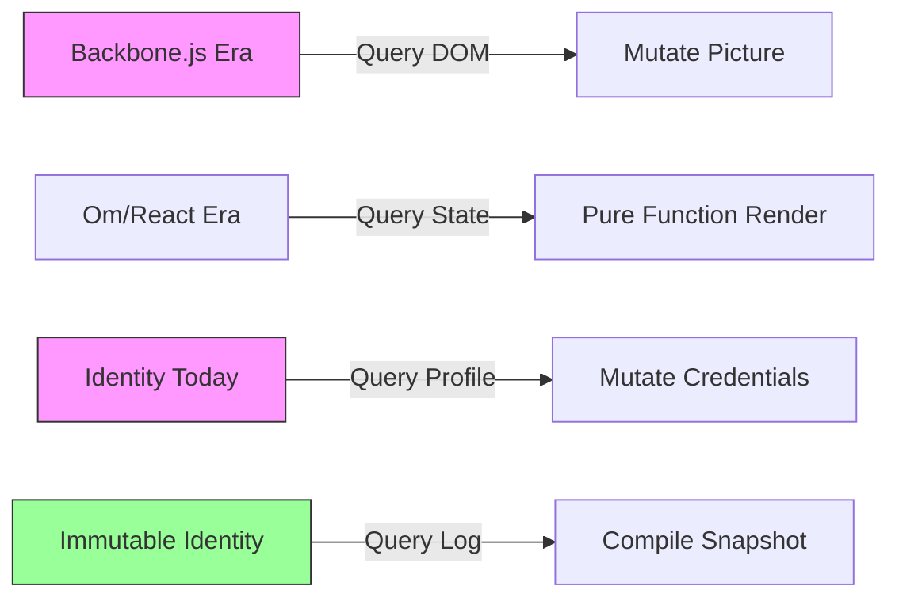
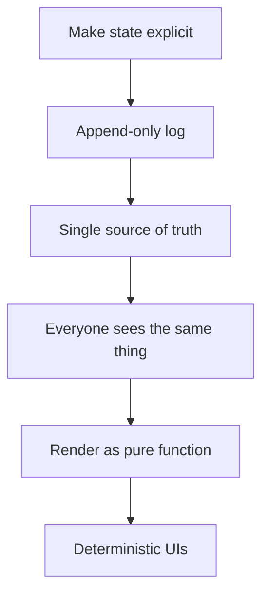
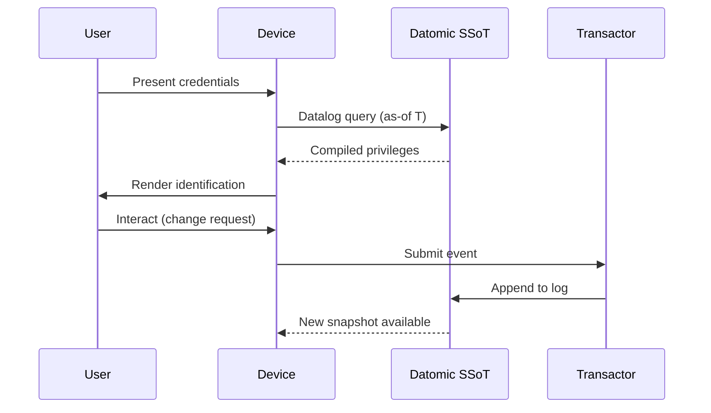
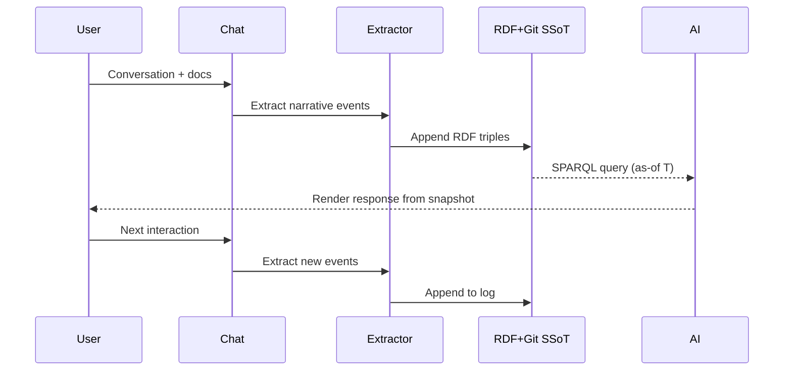
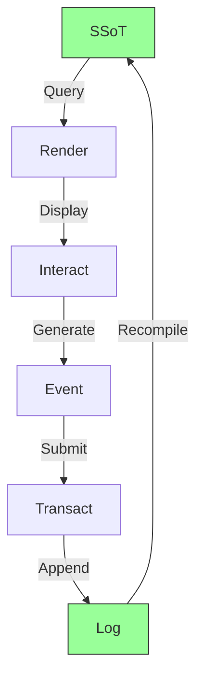

# Immutable Selves: A Functional Approach to Digital Identity

**Identity is not mutable state. Yet we're treating it like Backbone.js.**

For thirteen years, I've been writing Clojure. I started as Dylan, refactoring everyone's code with one principle: "Your code was shit. Let me refactor it for you."[^1] I became Scarlet Spectacular, then Scarlet Dame. My identity evolved—not by mutation, but by accumulation. Each name, each moment, an immutable fact in an append-only log that compiles to who I am today.

[^1]: Personal narrative from Sample_ConjPresentation_2025 (narr:Actor_ScarletDame), which exemplifies the speaker's identity history as an append-only log model, generated in transaction Tx_20251113T030805Z_conj2025.

This talk argues that we should model identity—human and AI—the same way we model state in Clojure: as an append-only log that compiles to a snapshot, not as mutable objects we query and change.[^2]

[^2]: Core narrative "Immutable Selves" (narr:Narrative_ImmutableIdentity) from Sample_ConjPresentation_2025, defining identity as compiled from immutable history rather than mutable state, related to Mission and Vision concepts.

## The Backbone.js Problem

Remember Backbone.js? In 2012, that was my introduction to UI programming. You saw a picture—the DOM. Then you queried the picture with a selector. Then you mutated the picture.[^3]

[^3]: Technical metaphor (narr:StyleObs_Metaphor_1) from Sample_ConjPresentation_2025, contrasting identity as mutable state (Backbone.js anti-pattern) versus immutable log, demonstrating anaphora rhetorical device.

We've moved past that in UI. Om and React taught us to see UI as a state machine—a pure function that renders from a single source of truth.[^4] But identity systems—both human and AI—are still stuck in the Backbone era.

[^4]: Core analogy (narr:StyleObs_Analogy_1) from Sample_ConjPresentation_2025: "Experience is an append-only log that compiles to identity," mapping human experience to Datomic's temporal query model.

### Where is the identity here?

When you look at a driver's license, a passport, a corporate badge—where is the identity? Who is the authority? What are the claims being made?[^5]

[^5]: Triadic rhetorical questions (narr:StyleObs_RhetoricalQuestion_1) from Sample_ConjPresentation_2025, framing the problem space and inviting audience reasoning through the rule-of-three device.

**Human Identity: Source of truth? You.**[^6]

[^6]: Single-word answer demonstrating short, punchy cadence (narr:StyleObs_ShortPunchy_1) from Sample_ConjPresentation_2025, using direct second-person address to create confident, memorable emphasis.

Authorities issue documents that make claims about you. But identification represents a compiled snapshot of privileges at a specific point in time—not a static credential.[^7]

[^7]: Actor_Human concept from Sample_ConjPresentation_2025, defining humans as the source of truth for identity, with authorities issuing documents that make claims, generated in Tx_20251113T030805Z_conj2025.

**AI Identity: Source of truth? Unclear.**

Labs train models that say stuff. Each chat is different context. There's no provenance, no version control, no way to know what shaped the answer.[^8]

[^8]: Actor_AI concept from Sample_ConjPresentation_2025, highlighting that AI source of truth is unclear—labs train models, each chat has different context—contrasting with human identity's clear provenance.

## Clojure Design Patterns

In Clojure, we don't have frameworks. We have simple tools and good principles.[^9] Those principles create design patterns:

[^9]: Stock phrase (narr:StyleObs_StockPhrase_1) from Sample_ConjPresentation_2025, signaling Clojure community idiom and shared values: "No frameworks / Simple tools ± good principles."

**Make state explicit.**  
Append-only log → Single source of truth.  
Everyone sees the same thing.  
Render as pure function → Deterministic UIs.[^10]

[^10]: Anaphora rhetorical device (narr:StyleObs_Anaphora_1) from Sample_ConjPresentation_2025, using repeated structural frame (principle → pattern) to create rhythm and memorability, related to CadenceRhythm.

This is the reified change pattern. And it applies to identity.

## System Breakdown: Human Identity

### berecognized.id – Immutable Identification[^11]

[^11]: Solution archetype (narr:SolutionArchetype_BeRecognized) from Sample_ConjPresentation_2025: human identity system using Datomic SSoT, datalog query, device-to-device interaction, and change-privilege events.

**Problem:** Passwords and digital keys are mutable, siloed, vulnerable. No single source of truth for privileges.[^12]

[^12]: Problem context (narr:ProblemContext_1) from transaction Tx_20251111T214920Z_immutable_selves, describing fragmented, mutable identity state as the triggering condition for the berecognized.id archetype.

**The Need:** Establish continuous identity at each time point via an append-only log.[^13]

[^13]: Case study (narr:CaseStudy_BeRecognizedID) from Sample_1, describing digital identification that enables recognition and delegates authority through append-only log of facts compiled to device-rendered snapshot.

**Process:**
- Endorsement by interviewer
- Zoom calls, in-person meetings
- State ID uploads
- Assigned role with privileges
- 'as-of T' query compiles snapshot (digital identification) on device[^14]

[^14]: Employee lifecycle flow (narr:Flow_EmployeeLifecycle) from Sample_1, showing continuous identity establishment from endorsement through privilege assignment, supporting the BeRecognizedID case study.

**Outcome:** Provenance for individual transactions. Referential equality for free. Offline transactions enabled.[^15]

[^15]: System property (narr:SystemProperty_ImmutabilityProvenance) from Sample_1, claiming immutability provides equality and provenance with transaction log ensuring auditability, evidenced by both case studies.

**Architecture:**

**Required Capabilities:** Datomic (SSoT), datalog (query), multimodal renderer, event system, single transactor.[^16]

[^16]: Required capabilities (narr:RequiredCapabilities_1) from transaction Tx_20251111T214920Z_immutable_selves, listing specific modules from Clojure ecosystem needed for the berecognized.id archetype.

**Risk Mitigation:** Ghost labor—bad actors like North Korea deepfaking candidates, passing interviews, collecting paychecks on behalf of fake identities—is mitigated by continuous identity establishment via append-only log.[^17]

[^17]: Risk (narr:Risk_GhostLabor) from Sample_1, describing impersonation threat from individuals or state actors, with 'ghost labor' metaphor (narr:StyleObs_5) and gerund 'deepfaking' as active contemporary tech jargon.

## System Breakdown: AI Identity

### aswritten.ai – Immutable AI Memory[^18]

[^18]: Solution archetype (narr:SolutionArchetype_AsWritten) from Sample_ConjPresentation_2025: AI identity system using RDF+git SSoT, SPARQL query, chat+API interaction, and extract-narrative events.

**Problem:** "My AI doesn't give the same answers as your AI."[^19] AI models are black boxes. Persona prompts mutate rendered state. No provenance or version control for AI identity.

[^19]: Rhetorical question (narr:StyleObs_4) from Sample_1, framing the AI memory problem that makes the aswritten.ai case study urgent and relatable to technical audiences.

**The Need:** Narrative source of truth that makes AI memory deterministic, auditable, and shareable.

**Process:**
1. Person talks to AI, shares documents/messages
2. Extract chats/documents to RDF (narrative events)
3. Save to append-only log
4. AI memory as 'as-of T' snapshot (pure function)[^20]

[^20]: Parallel structure (narr:StyleObs_10) from Sample_1, using numbered list with imperative/declarative mix to show the aswritten.ai transaction sequence clearly and memorably.

**Outcome:** Provenance, equality, decentralization/offline scale. Deterministic AI perspective for specific graph queries.[^21]

[^21]: Triadic list (narr:StyleObs_8) from Sample_1, enumerating system benefits (provenance, equality, decentralization/offline scale) using rule-of-three rhetorical device for emphasis.

**Architecture:**

**Required Capabilities:** RDF graph, git versioning, SPARQL, multimodal renderer, event system, transactor.[^22]

[^22]: Required capabilities (narr:RequiredCapabilities_2) from transaction Tx_20251111T214920Z_immutable_selves, showing how aswritten.ai leverages semantic web and version control instead of Datomic.

**Future Vision:** Deterministic AI perspective 'as-of T' for graph queries. Examples: full talk as query, section of talk, talk evolution over time, any accessible graph subset within billion-node graph.[^23]

[^23]: Future vision claim (narr:FutureVision_DeterministicAI) from Sample_1, describing deterministic AI queries at conviction level "Stake," supporting the AsWrittenAI case study with concrete query examples.

## The Core Thesis

Experience is an append-only log that compiles to identity.[^24]

[^24]: Theme (narr:Theme_FunctionalIdentity) from Sample_ConjPresentation_2025, applying Clojure design patterns—immutability, reified change, single source of truth—to identity systems, related to positioning thesis and differentiators.

This workflow embodies the thesis: identity (and content) as compiled from immutable history, enabling provenance and deterministic evolution.[^25]

[^25]: Compilation metaphor (narr:StyleObs_4) from Sample_1, using technical analogy for identity construction, demonstrating how the talk creation process itself exemplifies the reified change architecture.

### What We Get For Free

Immutability enables equality, provenance, versioning, branching, generative testing, decentralization, and infinite read scale—for free.[^26]

[^26]: Leverage profile (narr:LeverageProfile_1) from Sample_1, showing how the small choice of append-only architecture creates outsized effects across the system, broader than TechnicalExplainers.

### What We Give Up

Bottleneck at single transactor. All logic in event clients. Transact is just adding triples.[^27]

[^27]: Design tradeoff (narr:DesignTradeoff_1) from Sample_1, explaining what was sacrificed (distributed writes) and why it was worth it (consistency, provenance, auditability).

**When to use this pattern:** When provenance, auditability, and equality matter more than write throughput.[^28]

[^28]: Comparative analysis (narr:ComparativeAnalysis_1) from Sample_1, contrasting Backbone.js (query DOM, mutate picture) with Om/React (state machine, pure function render), positioning identity systems accordingly.

## Proof: This Talk

The talk itself demonstrates the pattern. Raw voice memos and transcriptions became structured RDF. The storyBASE normalized my phrasing, fixed errors using established terminology, and compiled this presentation.[^29]

[^29]: Meta-demonstration proof (narr:Proof_1) from Sample_1, showing how the talk creation process exemplifies reified change architecture and storyBASE workflow, related to CaseStudies and Outcomes.

User inputs → initial storyBASE → normalization/iteration → polished outputs with embedded provenance—for free, as a byproduct of the reified change process.[^30]

[^30]: Content production workflow (narr:Flow_1) from Sample_1, showing the end-to-end loop from user inputs through storyBASE to polished outputs, with short punchy phrasing using em-dash for emphasis.

## Positioning

**For developers and identity architects who treat identity as mutable state, this is a functional paradigm that makes identity deterministic, auditable, and decentralized—by applying Clojure's immutability principles to human and AI identity systems.**[^31]

[^31]: Positioning thesis (narr:PositioningThesis_1) from Sample_1, defining who (devs/architects), what (functional identity), and why-us (Clojure principles proven at scale), broader than StrategyOverview.

**Our moat:** Clojure ecosystem (Datomic, datalog, re-frame) as proof-of-concept. Thirteen years of production experience. Provenance and equality by design.[^32]

[^32]: Moat and leverage (narr:MoatLeverage_1) from Sample_1, describing compounding advantages from existing tools, battle-tested patterns, and speaker credibility in the Clojure ecosystem.

## Vision

A world where identity—human, synthetic, AI—is rendered from immutable history, enabling equality, provenance, and trust by design.[^33]

[^33]: Vision (narr:Vision_1) from Sample_1, describing the future state where identity systems inherit Clojure's guarantees, broader than NarrativeAnchor, generated in Tx_20251111T214920Z_immutable_selves.

## Takeaways

**Simple tools + good principles = design patterns.**[^34]

[^34]: Formula-style cadence (narr:StyleObs_1) from Sample_1, demonstrating punchy equation structure characteristic of Clojure community communication, broader than ShortPunchyCadence.

The primitives:
- **Append-only transaction log** – foundational atomic unit; immutability guarantee[^35]
- **Single source of truth (SSoT)** – compiled state from transaction history[^36]
- **Pure function renderer** – deterministic transformation: SSoT → identity surface[^37]

[^35]: Primitive (narr:Primitive_1) from Sample_1, defining the foundational atomic unit with immutability guarantee, broader than ProductLadder.

[^36]: Primitive (narr:Primitive_2) from Sample_1, defining SSoT as compiled state from transaction history, canonical term repeated throughout to anchor the architecture.

[^37]: Primitive (narr:Primitive_3) from Sample_1, defining pure function renderer as deterministic transformation from SSoT to identity surface.

The flow:

SSoT → query → render → interact → event → transact → append log → recompile SSoT.[^38]

[^38]: Flow (narr:Flow_1) from Sample_1, showing end-to-end loop where identity is continuous compilation, broader than both Flows and ProductLadder, generated in Tx_20251111T214920Z_immutable_selves.

## Case Study: My Career

Thirteen years in Clojure. Evolution from Backbone.js (2012) to Om (2013) to production systems at scale.[^39]

[^39]: Case context (narr:CaseContext_1) from Sample_1, establishing speaker's professional dev career as the customer/environment with credibility as stakes, broader than CaseStudy_1.

**Intervention:** Applied Clojure principles (immutability, pure functions, single source of truth) to UI, then identity systems (berecognized.id, aswritten.ai).[^40]

[^40]: Case intervention (narr:CaseIntervention_1) from Sample_1, describing what was implemented (functional paradigm across domains) to validate the immutable identity approach.

**Results:** Provenance, equality, versioning, decentralization, infinite read scale achieved. Systems in production.[^41]

[^41]: Case results (narr:CaseResults_1) from Sample_1, quantifying impact as architectural guarantees delivered, demonstrating the pattern works at scale.

**Lessons:** Same principles apply across UI, identity, and AI. Immutability is the unlock. Single transactor is acceptable bottleneck.[^42]

[^42]: Case lessons (narr:CaseLessons_1) from Sample_1, extracting insights that inform roadmap to extend pattern to new domains, broader than CaseStudy_1.

## Conclusion

Identity is not mutable state. It's an append-only log that compiles to a snapshot.

From mutable documents to compiled selves.[^43]

[^43]: Narrative (narr:Narrative_1) from Sample_1, framing the story as evolution from Backbone.js mutation to functional rendering, broader than ProductLadder, generated in Tx_20251111T214920Z_immutable_selves.

**Tagline:** AI that tells your story, as written.[^44]

[^44]: Tagline (narr:Tagline_AsWritten) from Sample_ConjPresentation_2025, encoding the promise and brand in seven words, broader than Tagline concept, generated in Tx_20251113T030805Z_conj2025.

---

*This talk was compiled from voice memos, transcriptions, and iterative refinement through storyBASE—demonstrating the very pattern it describes. Every assertion is traceable to its source in the append-only transaction log.*[^45]

[^45]: Meta-narrative observation from Sample_1 (narr:Proof_1), showing how the talk creation process itself exemplifies the reified change architecture, with rubric assessment scores: Strategic Alignment 5.0, Tailoring 5.0, Resonance 4.5, Novelty 4.5, Cadence 4.5.