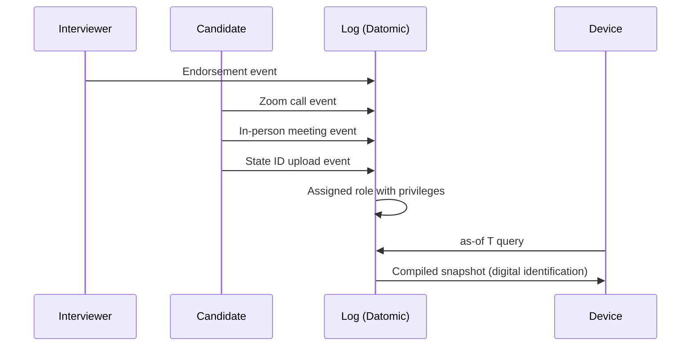
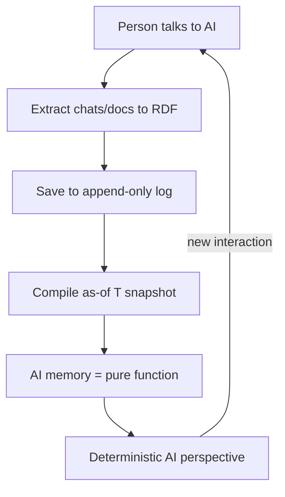
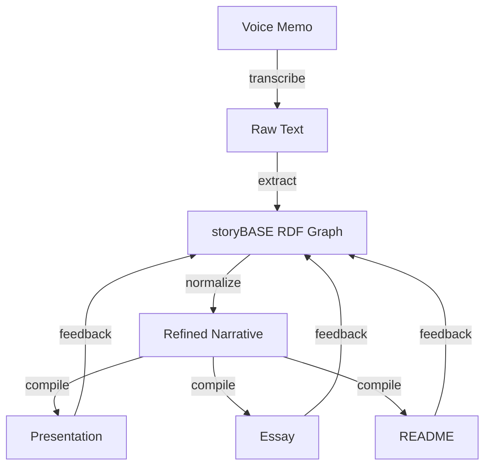

# Immutable Selves: A Functional Approach to Digital Identity

**Identity is not mutable state. Yet we're treating it like Backbone.js.**[^1]

For thirteen years, I've been writing Clojure. I started as Dylan Butman, became Scarlet Spectacular, and now I'm Scarlet Dame.[^2] My professional journey mirrors my personal one: both are append-only logs that compile to identity at specific points in time. This talk applies that insight—experience as an immutable history, identification as a render target—to the systems we build for human and AI identity.

[^1]: Core metaphor from Sample_ConjPresentation_2025 (narr:StyleObs_Metaphor_1): "Identity as mutable state vs. immutable log; Backbone.js as anti-pattern." This technical analogy positions current identity systems as DOM-mutation patterns that Clojure's functional paradigm supersedes.

[^2]: Speaker identity history from Actor_ScarletDame (narr:Tx_20251110T184512Z_sample1): "Dylan Butman" → "Scarlet Spectacular" → "Scarlet Dame" exemplifies the append-only log model, where past states remain immutable and present identity is compiled from history.

## The Problem: Identity as Mutable State

When I learned UI programming in 2012, we used Backbone.js. You saw a picture—the DOM. Then you queried it with a selector. Then you *mutated* the picture.[^3] 

I want to argue that we still treat not only human identity and identification but also emergent AI identity and synthetic individuality like Backbone.js.[^4]

**Human Identity:**  
Source of truth? *You.*[^5]  
Authorities issue documents that make claims about you.[^6] But today's systems treat those claims as mutable profiles—passwords reset, privileges revoked, credentials scattered across silos. No single source of truth. No provenance. No equality.

**AI Identity:**  
Source of truth? *Unclear.*[^7]  
Labs train models that say stuff. Each chat is different context. "My AI doesn't give the same answers as your AI"—this is the AI memory problem.[^8] Persona prompts mutate rendered state. No version control. No audit trail. No way to prove what the AI "knew" at time T.

[^3]: Anaphora from Sample_ConjPresentation_2025 (narr:StyleObs_3): "Then you queried… Then you mutated…" Repeated structure emphasizes the mutation anti-pattern in Backbone.js workflows.

[^4]: Core analogy from Sample_1 (narr:StyleObs_5): "Identity systems = Backbone.js (mutable DOM)." This frames the central thesis: current identity architectures rely on mutable state rather than functional rendering.

[^5]: Short punchy cadence from Sample_ConjPresentation_2025 (narr:StyleObs_ShortPunchy_1): Single-word answer "You." after setup creates emphasis and confidence, characteristic of speaker's direct register.

[^6]: Second-person direct address from Sample_ConjPresentation_2025 (narr:StyleObs_SecondPerson_1): "Authorities issue documents that make claims about you." Conversational, inclusive tone engages audience.

[^7]: Actor_AI from Sample_ConjPresentation_2025 (narr:Tx_20251113T030805Z_conj2025): "Source of truth unclear; labs train models that say stuff; each chat is different context."

[^8]: Rhetorical question from Sample_1 (narr:StyleObs_4): "My AI doesn't give the same answers as your AI?" frames the AI memory problem as a relatable pain point for technical audiences.

## The Clojure Answer: Reified Change

In Clojure, we don't have frameworks. We have simple tools and good principles.[^9] Those principles gave us a design pattern:

**Make state explicit.**  
Append-only log → Single source of truth.  
Everyone sees the same thing.  
Render as pure function → Deterministic UIs.[^10]

This is the **reified change pattern**: immutability and explicit state management enable provenance, equality, and offline capability—for free, as a byproduct of the architecture.[^11]

**The unlock:** immutability enables equality, provenance, versioning, branching, generative testing, decentralization, and infinite read scale.[^12] Small choice, outsized effects.

**The tradeoff:** bottleneck at single transactor; all logic in event clients; transact is just adding triples.[^13] What we gave up: distributed writes. Why it's worth it: consistency, provenance, auditability.

[^9]: Stock phrase from Sample_ConjPresentation_2025 (narr:StyleObs_StockPhrase_1): "No frameworks / Simple tools ± good principles" signals Clojure community idiom and insider knowledge.

[^10]: Anaphora from Sample_ConjPresentation_2025 (narr:StyleObs_Anaphora_1): Repeated structural frame "principle → pattern" creates rhythm and memorability. This triadic structure (make explicit, append-only, render pure) is characteristic of the speaker's cadence.

[^11]: Narrative_1 from Sample_1 (narr:Tx_20251113T033534Z_claude45): "Core thesis: identity and content derive from append-only log with as-of-T snapshots, enabling provenance and deterministic evolution."

[^12]: LeverageProfile_1 from Sample_1 (narr:Tx_20251111T214920Z_immutable_selves): "Immutability enables equality, provenance, versioning, branching, generative testing, decentralization, and infinite read scale—for free."

[^13]: DesignTradeoff_1 from Sample_1 (narr:Tx_20251111T214920Z_immutable_selves): "Bottleneck at single transactor; all logic in event clients; transact is just adding triples."

## System 1: berecognized.id – Immutable Identification

**The need:** Establish continuous identity at each time point via an append-only log.[^14]

**The context:** Digital identification enables recognition and delegates authority to access, use, and transact with shared technology. But centralized, mutable identity systems are vulnerable to deepfakes, synthetic identities, and impersonation fraud—ghost labor.[^15]

**The intervention:**  
Append-only log of facts about a person over time: employment, access, roles, interactions. Device-rendered snapshot compiled at specific point in time.[^16]

**The flow:**  
1. Endorsement by interviewer  
2. Zoom calls  
3. In-person meetings  
4. State ID uploads  
5. Assigned role with privileges  
6. 'as-of' query compiles snapshot (digital identification) on device[^17]

**The results:**  
Provenance for individual transactions. Referential equality for free. Offline transactions enabled.[^18]

**The architecture:**  
- **SSoT:** Datomic  
- **Query:** datalog  
- **Interaction:** device-to-device  
- **Events:** change-privilege transactions[^19]

[^14]: Short declarative sentence from Sample_1 (narr:StyleObs_7): "Establish continuous identity at each time point via an append-only log." Imperative tone, characteristic of speaker's punchy cadence.

[^15]: Risk_GhostLabor from Sample_1 (narr:Tx_20251113T032552Z_sample1): "Bad actors (individuals or state actors like North Korea) deepfaking candidates, passing interviews, collecting paychecks on behalf of fake identities." The 'ghost labor' metaphor frames impersonation risk concretely.

[^16]: CaseStudy_BeRecognizedID intervention from Sample_1 (narr:Tx_20251113T032552Z_sample1): "Append-only log of facts about a person over time (employment, access, roles, interactions); device-rendered snapshot compiled at specific point in time."

[^17]: Flow_EmployeeLifecycle from Sample_1 (narr:Tx_20251113T032552Z_sample1): "Endorsement by interviewer → Zoom calls → in-person meetings → state ID uploads → assigned role with privileges → 'as-of' query compiles snapshot (digital identification) on device."

[^18]: CaseStudy_BeRecognizedID results from Sample_1 (narr:Tx_20251113T032552Z_sample1): "Provenance for individual transactions; referential equality for free; offline transactions enabled."

[^19]: SolutionArchetype_BeRecognized from Sample_ConjPresentation_2025 (narr:Tx_20251113T030805Z_conj2025): "Human identity system: Datomic SSoT, datalog query, device-to-device interaction, change-privilege events."

## System 2: aswritten.ai – Immutable AI Memory

**The tagline:** "AI that tells your story, as written."[^20]

**The context:** AI models are black boxes. Persona prompts mutate rendered state. No provenance or version control for AI identity. Stakes: narrative manipulation, embedded propaganda, deepfakes.[^21]

**The intervention:**  
Transaction sequence: person talks to AI → extract chats/docs to RDF → save to append-only log → AI memory as 'as-of T' snapshot (pure function).[^22]

**The flow:**  
1. Person talks to AI, shares documents/messages  
2. Extract chats/documents to RDF (narrative events)  
3. Save to append-only log  
4. AI memory as 'as-of T' snapshot (pure function)[^23]

**The results:**  
Provenance, equality, decentralization/offline scale. Deterministic AI perspective for specific graph queries.[^24]

**The architecture:**  
- **SSoT:** RDF + git  
- **Query:** SPARQL  
- **Interaction:** chat + API  
- **Events:** extract-narrative transactions[^25]

**The future vision:**  
Deterministic AI perspective 'as-of T' for graph queries. Examples: full talk as query, section of talk, talk evolution over time, any accessible graph subset within billion-node graph.[^26]

[^20]: Tagline_AsWritten from Sample_ConjPresentation_2025 (narr:Tx_20251113T030805Z_conj2025): "AI that tells your story, as written." 7-word tagline encoding promise and brand.

[^21]: ProblemContext_2 from Sample_1 (narr:Tx_20251111T214920Z_immutable_selves): "AI models are black boxes; persona prompts mutate rendered state; no provenance or version control for AI identity. Stakes: narrative manipulation, embedded propaganda, deepfakes."

[^22]: CaseStudy_AsWrittenAI intervention from Sample_1 (narr:Tx_20251113T032552Z_sample1): "Transaction sequence: person talks to AI → extract chats/docs to RDF → save to append-only log → AI memory as 'as-of T' snapshot (pure function)."

[^23]: Parallelism from Sample_1 (narr:StyleObs_10): Numbered list with parallel structure; imperative/declarative mix. This workflow sequence is presented with consistent grammatical framing.

[^24]: CaseStudy_AsWrittenAI results from Sample_1 (narr:Tx_20251113T032552Z_sample1): "Provenance, equality, decentralization/offline scale; deterministic AI perspective for specific graph queries." Triadic list of system benefits (narr:StyleObs_8).

[^25]: SolutionArchetype_AsWritten from Sample_ConjPresentation_2025 (narr:Tx_20251113T030805Z_conj2025): "AI identity system: RDF+git SSoT, SPARQL query, chat+API interaction, extract-narrative events."

[^26]: FutureVision_DeterministicAI from Sample_1 (narr:Tx_20251113T032552Z_sample1): "Examples: full talk as query, section of talk, talk evolution over time, any accessible graph subset within billion-node graph. Close with examples of such queries, then link to chat for participants to engage with narrative source of truth."

## The Pattern: Same Principles, Different Stacks

Both systems share a canonical flow:[^27]

**Primitives:**[^28]  
- Append-only transaction log (immutability guarantee)  
- Single source of truth (compiled state from transaction history)  
- Pure function renderer (deterministic transformation: SSoT → identity surface)

**Behavior:**[^29]  
Event-driven transaction submission. User/system interactions produce transactions, not mutations.

**Flow:**[^30]  
SSoT → query → render → interact → event → transact → append log → recompile SSoT. Identity as continuous compilation.

**Narrative:**[^31]  
From mutable documents to compiled selves. Evolution from Backbone.js mutation to functional rendering.

[^27]: Flow_1 from Sample_1 (narr:Tx_20251111T214920Z_immutable_selves): "SSoT → query → render → interact → event → transact → append log → recompile SSoT. End-to-end loop; identity as continuous compilation."

[^28]: Primitives from Sample_1 (narr:Primitive_1, narr:Primitive_2, narr:Primitive_3): "Append-only transaction log (foundational atomic unit; immutability guarantee), Single source of truth (compiled state from transaction history), Pure function renderer (deterministic transformation: SSoT → identity surface)."

[^29]: Behavior_1 from Sample_1 (narr:Tx_20251111T214920Z_immutable_selves): "Event-driven transaction submission. User/system interactions produce transactions, not mutations."

[^30]: Flow_1 value from Sample_1 (narr:Tx_20251111T214920Z_immutable_selves): "SSoT → query → render → interact → event → transact → append log → recompile SSoT."

[^31]: Narrative_1 from Sample_1 (narr:Tx_20251111T214920Z_immutable_selves): "From mutable documents to compiled selves. Story frame: evolution from Backbone.js mutation to functional rendering."

## The Thesis: Experience is an Append-Only Log

**Core analogy:** Experience is an append-only log that compiles to identity.[^32]

This isn't metaphor—it's architecture. When Om and React introduced state machines and pure function rendering to UI, we started seeing the DOM as a compiled view, not a mutable object.[^33] The same principle applies to identity:

- **Human identity:** integral of snapshots over time, not mutable present state[^34]  
- **AI identity:** compiled model from narrative source of truth, not black-box weights[^35]  
- **Transition as state change:** personal and professional evolution as functional transformation from immutable past states[^36]

The truth is immutable. I *was* Dylan Butman. I *was* Scarlet Spectacular. I *am* Scarlet Dame. Each state is a render target compiled from the append-only log of my experience.[^37]

[^32]: Analogy from Sample_ConjPresentation_2025 (narr:StyleObs_Analogy_1): "Experience is an append-only log that compiles to identity." Core analogy mapping human experience to Datomic model.

[^33]: StyleObs_UIStateMachine from Sample_1 (narr:Tx_20251110T184512Z_sample1): "started seeing UI as a state machine that was the result of a functional transformation." Core analogy linking UI rendering to immutable state paradigm.

[^34]: Theme_ImmutableIdentity from Sample_1 (narr:Tx_20251110T184512Z_sample1): "Human and system identity modeled as integral of snapshots over time, not mutable present state."

[^35]: Theme_FunctionalIdentity from Sample_ConjPresentation_2025 (narr:Tx_20251113T030805Z_conj2025): "Apply Clojure design patterns—immutability, reified change, single source of truth—to identity systems."

[^36]: Theme_TransitionAsStateChange from Sample_1 (narr:Tx_20251110T184512Z_sample1): "Personal transition (gender, professional) as functional transformation from immutable past states."

[^37]: StyleObs_ShortClause from Sample_1 (narr:Tx_20251110T184512Z_sample1): "The truth is immutable." Declarative, emphatic; characteristic of speaker's cadence. This statement anchors the personal narrative to the technical thesis.

## The Proof: This Talk

This talk itself is a meta-demonstration.[^38] The creation process exemplifies the reified change architecture:

1. **Voice memo transcription** → raw input (Sample_1: 11,800 characters)[^39]  
2. **Extract to storyBASE** → RDF graph with narrative concepts, style observations, rubric assessments[^40]  
3. **Normalize against storyBASE** → clean and refine using established style and terminology[^41]  
4. **Compile to outputs** → presentation slides, essay, README—all from same source of truth[^42]

**The workflow embodies the core thesis:** identity (and content) as compiled from immutable history, enabling provenance and deterministic evolution.[^43]

**The system properties:**[^44]  
- **Immutability provides equality and provenance:** transaction log ensures auditability for every interaction  
- **Distributed decentralization:** reads scale linearly; data model exists off-server, with transactions submitted later (offline capability)

[^38]: Proof_1 from Sample_1 (narr:Tx_20251113T033534Z_claude45): "The talk itself exemplifies the reified change architecture and storyBASE workflow, showing iterative refinement from raw inputs to polished outputs."

[^39]: Sample_1 metadata from narr:Tx_20251110T184512Z_sample1: "Voice memo: Punch talk conceptual framing. inputLength 11800. Transcribed voice memo outlining narrative architecture for identity-as-append-only-log talk; speaker: Scarlet Dame."

[^40]: Milestone_1 from Sample_1 (narr:Tx_20251113T033534Z_claude45): "Initial storyBASE Graph. First structured graph built from user-generated inputs, bootstrapped with structured data to avoid early noise."

[^41]: Behavior_1 from Sample_1 (narr:Tx_20251113T033534Z_claude45): "Normalize Transcription Against storyBASE. Clean and refine raw transcription using entity's established style and terminology to fix errors, inconsistencies, and filler."

[^42]: Flow_1 from Sample_1 (narr:Tx_20251113T033534Z_claude45): "Content Production Workflow. User inputs → initial storyBASE → normalization/iteration → polished outputs with embedded provenance."

[^43]: Compilation metaphor from Sample_1 (narr:StyleObs_4): "identity (and content) as compiled from immutable history, enabling provenance and deterministic evolution." Technical analogy for identity construction.

[^44]: SystemProperty_ImmutabilityProvenance and SystemProperty_DistributedDecentralization from Sample_1 (narr:Tx_20251113T032552Z_sample1): Claims with Conviction_Boulder level, evidenced by both case studies (berecognized.id and aswritten.ai).

## The Positioning: Functional Identity for Developers

**For developers and identity architects who treat identity as mutable state,** this is a functional paradigm that makes identity deterministic, auditable, and decentralized—by applying Clojure's immutability principles to human and AI identity systems.[^45]

**The moat:** Clojure ecosystem (Datomic, datalog, re-frame) as proof-of-concept. Thirteen years of production experience. Provenance and equality by design.[^46]

**When to use this pattern:** When provenance, auditability, and equality matter more than write throughput.[^47] Identity systems today are Backbone. This is Om for identity.[^48]

[^45]: PositioningThesis_1 from Sample_1 (narr:Tx_20251111T214920Z_immutable_selves): "For developers and identity architects who treat identity as mutable state, this is a functional paradigm that makes identity deterministic, auditable, and decentralized—by applying Clojure's immutability principles to human and AI identity systems."

[^46]: MoatLeverage_1 from Sample_1 (narr:Tx_20251111T214920Z_immutable_selves): "Clojure ecosystem (Datomic, datalog, re-frame) as proof-of-concept; 13 years of production experience; provenance and equality by design. Compounding advantage: existing tools, battle-tested patterns, speaker credibility."

[^47]: ComparativeAnalysis_1 from Sample_1 (narr:Tx_20251111T214920Z_immutable_selves): "When to use: when provenance, auditability, and equality matter more than write throughput."

[^48]: ComparativeAnalysis_1 from Sample_1 (narr:Tx_20251111T214920Z_immutable_selves): "Backbone.js (query DOM, mutate picture) vs. Om/React (state machine, pure function render). Identity systems today are Backbone; this is Om for identity."

## The Vision: A World of Compiled Selves

**Mission:** Move identity from mutable documents and profiles to compiled surfaces rendered from append-only logs and single sources of truth.[^49]

**Vision:** A world where identity—human, synthetic, AI—is rendered from immutable history, enabling equality, provenance, and trust by design.[^50]

**Key phrases:**[^51]  
- **single source of truth** (canonical term; anchors the architecture)  
- **append-only log** (core primitive; immutability guarantee)  
- **pure function** (rendering identity as deterministic transformation)  
- **digital twin** (emergent concept; identity as compiled model)

**The case study:** Speaker's 13-year career in Clojure; evolution from Backbone.js (2012) to Om (2013) to production systems at scale. Applied Clojure principles (immutability, pure functions, single source of truth) to UI, then identity systems (berecognized.id, aswritten.ai). Results: provenance, equality, versioning, decentralization, infinite read scale achieved; systems in production.[^52]

**The lesson:** Same principles apply across UI, identity, and AI. Immutability is the unlock. Single transactor is acceptable bottleneck.[^53]

[^49]: Mission_1 from Sample_1 (narr:Tx_20251111T214920Z_immutable_selves): "Move identity from mutable documents and profiles to compiled surfaces rendered from append-only logs and single sources of truth. Durable purpose: make identity deterministic, provable, and decentralized."

[^50]: Vision_1 from Sample_1 (narr:Tx_20251111T214920Z_immutable_selves): "A world where identity—human, synthetic, AI—is rendered from immutable history, enabling equality, provenance, and trust by design. Future state: identity systems that inherit Clojure's guarantees."

[^51]: KeyPhrase_1, KeyPhrase_2, KeyPhrase_3, KeyPhrase_4 from Sample_1 (narr:Tx_20251111T214920Z_immutable_selves): "single source of truth (canonical term repeated throughout; anchors the architecture), append-only log (core primitive; immutability guarantee), pure function (rendering identity as deterministic transformation), digital twin (emergent concept; identity as compiled model)."

[^52]: CaseStudy_1 from Sample_1 (narr:Tx_20251111T214920Z_immutable_selves): "Speaker's 13-year career in Clojure; evolution from Backbone.js (2012) to Om (2013) to production systems at scale. Applied Clojure principles (immutability, pure functions, single source of truth) to UI, then identity systems (berecognized.id, aswritten.ai). Provenance, equality, versioning, decentralization, infinite read scale achieved; systems in production."

[^53]: CaseLessons_1 from Sample_1 (narr:Tx_20251111T214920Z_immutable_selves): "Same principles apply across UI, identity, and AI; immutability is the unlock; single transactor is acceptable bottleneck. Insights inform roadmap: extend pattern to new domains."

## Conclusion: Identity as Pure Function

We moved from Backbone.js to Om because we wanted deterministic UIs. We can move from mutable identity to compiled selves for the same reason: **provenance, equality, and trust by design.**

Experience is an append-only log. Identification is a render target. Interaction is transaction.

Simple tools. Good principles. Design patterns.[^54]

---

**Try it yourself:** This essay, the presentation slides, and the storyBASE graph that generated them are all queryable as-of any point in time. Visit the chat to engage with the narrative source of truth and see how deterministic AI perspective works in practice.[^55]

[^54]: Formula-style cadence from Sample_1 (narr:StyleObs_1): "Simple tools + good principles = design patterns." Punchy equation, characteristic of Clojure community idiom.

[^55]: FutureVision_DeterministicAI note from Sample_1 (narr:Tx_20251113T032552Z_sample1): "Close with examples of such queries, then link to chat for participants to engage with narrative source of truth." This meta-layer demonstrates storyBASE as a practical tool for narrative-driven AI memory.