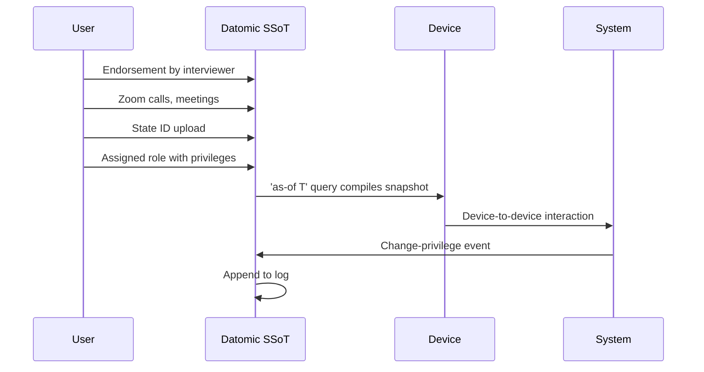
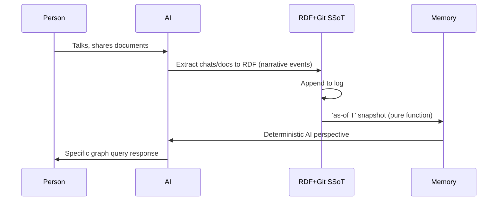

# Immutable Selves: A Functional Approach to Digital Identity

**Identity is not mutable state. Yet we're treating it like Backbone.js.**[^1]

For thirteen years, I've been writing Clojure. I started as Dylan Butman, became Scarlet Spectacular, and now I'm Scarlet Dame.[^2] My identity evolved through an append-only log of experiences—each name a snapshot compiled at a specific point in time. This isn't just a personal story. It's a design pattern.

We solved mutable state in UI development by moving from Backbone.js to Om and React: stop querying and mutating the DOM; instead, maintain a single source of truth and render it as a pure function.[^3] The same principle applies to identity systems—both human and AI. Yet today, we still treat identity as mutable documents and profiles, vulnerable to deepfakes, impersonation, and narrative drift.[^4]

This essay argues that identity should be modeled as an **append-only log that compiles to state**, not as mutable objects. I'll show how this pattern—reified change from Clojure principles—delivers provenance, equality, and decentralization for free, and demonstrate it through two systems: **berecognized.id** (human identity) and **aswritten.ai** (AI memory).[^5]

## The Problem: Identity as Mutable State

### Human Identity: Fragmented and Vulnerable

Passwords and digital keys are mutable, siloed, and vulnerable. There's no single source of truth for privileges.[^6] When a new employee joins, we issue credentials, grant access, and hope nothing breaks. When they leave, we revoke permissions and hope we didn't miss anything. The system treats identity as a snapshot—a static profile that can be edited, forged, or lost.

This creates real risk. Bad actors—individuals or state actors like North Korea—are deepfaking candidates, passing interviews, and collecting paychecks on behalf of fake identities.[^7] The need: **establish continuous identity at each time point via an append-only log**.[^8]

### AI Identity: Black Boxes Without Provenance

AI models are black boxes. Labs train models that say stuff; each chat is a different context.[^9] Persona prompts mutate rendered state with no provenance or version control for AI identity. The result: "My AI doesn't give the same answers as your AI."[^10]

Stakes are high: narrative manipulation, embedded propaganda, deepfakes. Without a source of truth, AI identity is as fragile as a mutable DOM.

## The Pattern: Reified Change

In Clojure, we don't have frameworks. We have **simple tools and good principles**.[^11] The design pattern that emerged:

**Make state explicit. Append-only log → Single source of truth. Everyone sees the same thing. Render as pure function → Deterministic UIs.**[^12]

This is reified change: immutability and explicit state management enable provenance, equality, and offline capability.[^13] The same pattern applies to identity.

## Solution Archetype 1: berecognized.id – Immutable Identification

### Problem Context

Digital identification enables recognition and delegates authority to access, use, and transact with shared technology. But current systems are mutable and fragmented.

### Approach Pattern

**SSoT (Datomic) → datalog query → render to identification/privileges → event-driven transactions → append-only log → recompile.**[^14]

### Employee Lifecycle Flow

1. **Endorsement by interviewer** → fact added to log
2. **Zoom calls, in-person meetings** → continuous identity establishment
3. **State ID uploads** → authority claims added
4. **Assigned role with privileges** → 'as-of T' snapshot query compiles digital identification on device[^15]

### Results

- **Provenance for individual transactions**: every privilege change is auditable
- **Referential equality for free**: hash of last transaction + SSoT state enables "be recognized" property[^16]
- **Offline transactions enabled**: data model exists off-server; transactions submitted later[^17]

### Required Capabilities

Datomic (SSoT), datalog (query), multimodal renderer, event system, single transactor.[^18]

## Solution Archetype 2: aswritten.ai – Immutable AI Memory

### Problem Context

AI memory is the narrative source of truth problem. Without it, every chat is a different context, and persona prompts are brittle mutations.[^19]

### Approach Pattern

**SSoT (RDF + git) → SPARQL query → render to AI memory/identity → event-driven transactions → append-only log → recompile.**[^20]

### Interaction Flow

1. **Person talks to AI, shares documents/messages**
2. **Extract chats/documents to RDF** (narrative events)
3. **Save to append-only log**
4. **AI memory as 'as-of T' snapshot** (pure function)
5. **Deterministic AI perspective** for specific graph queries[^21]

### Results

- **Provenance, equality, decentralization/offline scale**: same guarantees as human identity system
- **Deterministic AI perspective 'as-of T'**: query full talk, section of talk, talk evolution over time, any accessible graph subset within billion-node graph[^22]

### Required Capabilities

RDF graph, git versioning, SPARQL, multimodal renderer, event system, transactor.[^23]

## The Leverage: What You Get for Free

Immutability enables equality, provenance, versioning, branching, generative testing, decentralization, and infinite read scale—**for free**.[^24] Small choice (append-only) creates outsized effects across the system.

### Design Trade-offs

What we gave up: **distributed writes**. Bottleneck at single transactor; all logic in event clients; transact is just adding triples.[^25]

Why worth it: **consistency, provenance, auditability**. When provenance, auditability, and equality matter more than write throughput, this pattern wins.[^26]

### Comparative Analysis

**Backbone.js** (query DOM, mutate picture) vs. **Om/React** (state machine, pure function render). Identity systems today are Backbone. This is Om for identity.[^27]

## Meta-Demonstration: This Talk as Proof

The talk itself exemplifies the reified change architecture and storyBASE workflow.[^28] User inputs → initial storyBASE → normalization/iteration → polished outputs with embedded provenance.[^29] The content you're reading was compiled from voice memos, transcriptions, and iterative refinements—all tracked in an append-only log, normalized against established style and terminology.[^30]

This workflow embodies the core thesis: **identity (and content) as compiled from immutable history**, enabling provenance and deterministic evolution.[^31]

## Future Vision: Deterministic AI Perspective

Examples of 'as-of T' queries within a billion-node graph:
- Full talk as query
- Section of talk
- Talk evolution over time
- Any accessible graph subset[^32]

Close with examples of such queries, then link to chat for participants to engage with the narrative source of truth.[^33]

---

## Positioning Thesis

**For developers and identity architects who treat identity as mutable state, this is a functional paradigm that makes identity deterministic, auditable, and decentralized—by applying Clojure's immutability principles to human and AI identity systems.**[^34]

### Moat & Leverage

Clojure ecosystem (Datomic, datalog, re-frame) as proof-of-concept; 13 years of production experience; provenance and equality by design.[^35]

### Mission

Move identity from mutable documents and profiles to compiled surfaces rendered from append-only logs and single sources of truth.[^36]

### Vision

A world where identity—human, synthetic, AI—is rendered from immutable history, enabling equality, provenance, and trust by design.[^37]

---

## Takeaways

**Experience is an append-only log that compiles to identity.**[^38]

The same principles that gave us deterministic UIs can give us deterministic identity systems. Immutability isn't just a technical choice—it's a design pattern that makes trust computable, provenance innate, and equality free.

---

[^1]: Core metaphor from Sample_ConjPresentation_2025 (Narrative_ImmutableIdentity): "Identity is not mutable state / Yet we're treating it like Backbone.js" demonstrates technical metaphor comparing identity systems to anti-pattern (StyleObs_Metaphor_1).

[^2]: Personal narrative from Actor_ScarletDame (Sample_1): speaker's identity history (Dylan Butman → Scarlet Spectacular → Scarlet Dame) exemplifies append-only log model (Theme_TransitionAsStateChange).

[^3]: Historical context from Sample_ConjPresentation_2025 (CaseContext_1): speaker's 13-year career evolution from Backbone.js (2012) to Om (2013) to production systems at scale.

[^4]: Problem context from ProblemContext_2 (Archetype_2): "AI models are black boxes; persona prompts mutate rendered state; no provenance or version control for AI identity" with stakes of narrative manipulation, embedded propaganda, deepfakes.

[^5]: Two solution archetypes from Sample_ConjPresentation_2025: SolutionArchetype_BeRecognized (human identity: Datomic SSoT, datalog query, device-to-device interaction) and SolutionArchetype_AsWritten (AI identity: RDF+git SSoT, SPARQL query, chat+API interaction).

[^6]: From ProblemContext_1 (Archetype_1): "Passwords and digital keys are mutable, siloed, and vulnerable; no single source of truth for privileges" as triggering condition for fragmented, mutable identity state.

[^7]: Risk_GhostLabor from Sample_1: "Bad actors (individuals or state actors like North Korea) deepfaking candidates, passing interviews, collecting paychecks on behalf of fake identities" with 'ghost labor' metaphor (StyleObs_5).

[^8]: From Flow_EmployeeLifecycle (Sample_1): "Establish continuous identity at each time point via an append-only log" as short declarative sentence with imperative tone (StyleObs_7).

[^9]: Actor_AI from Sample_ConjPresentation_2025: "Source of truth unclear; labs train models that say stuff; each chat is different context."

[^10]: Rhetorical question from Sample_1 (StyleObs_4): "My AI doesn't give the same answers as your AI?" frames AI memory problem.

[^11]: Stock phrase from Sample_ConjPresentation_2025 (StyleObs_StockPhrase_1): "No frameworks / Simple tools ± good principles" signals Clojure community idiom and insider knowledge.

[^12]: Anaphora from Sample_ConjPresentation_2025 (StyleObs_Anaphora_1): "Make state explicit / Append only log -> Single source of truth / Everyone sees the same thing / Render as pure function" creates rhythm and memorability through repeated structural frame.

[^13]: Claim_ReifiedChangePattern from Sample_1: "Immutability and explicit state management enable provenance, equality, and offline capability" as core thesis about reified change design pattern from Clojure principles.

[^14]: ApproachPattern_1 from Archetype_1: canonical flow applied to access control.

[^15]: Flow_EmployeeLifecycle from Sample_1: "Endorsement by interviewer → Zoom calls → in-person meetings → state ID uploads → assigned role with privileges → 'as-of' query compiles snapshot (digital identification) on device."

[^16]: OutcomesProof_1 from Archetype_1: "Proof of provenance and authority innate; hash of last tx + SSoT state enables 'be recognized' property" as expected metric.

[^17]: SystemProperty_DistributedDecentralization from Sample_1: "Reads scale linearly; data model exists off-server, with transactions submitted later" evidenced by both case studies.

[^18]: RequiredCapabilities_1 from Archetype_1: specific modules from Clojure ecosystem.

[^19]: From CaseStudy_AsWrittenAI (Sample_1): "AI memory problem: 'My AI doesn't give the same answers as your AI'; need for narrative source of truth" as case context.

[^20]: ApproachPattern_2 from Archetype_2: "Same pattern, different stack: RDF instead of Datomic."

[^21]: From CaseStudy_AsWrittenAI intervention: "Transaction sequence: person talks to AI → extract chats/docs to RDF → save to append-only log → AI memory as 'as-of T' snapshot (pure function)" with parallel structure (StyleObs_10).

[^22]: FutureVision_DeterministicAI from Sample_1: "Examples: full talk as query, section of talk, talk evolution over time, any accessible graph subset within billion-node graph."

[^23]: RequiredCapabilities_2 from Archetype_2: "Leverages semantic web + version control."

[^24]: LeverageProfile_1 from Sample_1: "Immutability enables equality, provenance, versioning, branching, generative testing, decentralization, and infinite read scale—for free" as small choice creating outsized effects.

[^25]: DesignTradeoff_1 from Sample_1: "Bottleneck at single transactor; all logic in event clients; transact is just adding triples."

[^26]: ComparativeAnalysis_1 from Sample_1: "When to use: when provenance, auditability, and equality matter more than write throughput."

[^27]: ComparativeAnalysis_1: "Backbone.js (query DOM, mutate picture) vs. Om/React (state machine, pure function render). Identity systems today are Backbone; this is Om for identity."

[^28]: Proof_1 from Sample_1: "The talk itself exemplifies the reified change architecture and storyBASE workflow, showing iterative refinement from raw inputs to polished outputs."

[^29]: Flow_1 from Sample_1: "User inputs → initial storyBASE → normalization/iteration → polished outputs with embedded provenance" as content production workflow.

[^30]: Behavior_1 from Sample_1: "Clean and refine raw transcription using entity's established style and terminology to fix errors, inconsistencies, and filler" using precise terms like "append-only log" and "as-of T snapshots" (StyleObs_1, StyleObs_2).

[^31]: From Sample_1 (StyleObs_4): "identity (and content) as compiled from immutable history, enabling provenance" as compilation metaphor for identity construction.

[^32]: FutureVision_DeterministicAI definition from Sample_1.

[^33]: FutureVision_DeterministicAI note from Sample_1: "Close with examples of such queries, then link to chat for participants to engage with narrative source of truth."

[^34]: PositioningThesis_1 from Sample_1: "Who: devs/architects; What: functional identity; Why-us: Clojure principles proven at scale."

[^35]: MoatLeverage_1 from Sample_1: "Compounding advantage: existing tools, battle-tested patterns, speaker credibility."

[^36]: Mission_1 from Sample_1: "Durable purpose: make identity deterministic, provable, and decentralized."

[^37]: Vision_1 from Sample_1: "Future state: identity systems that inherit Clojure's guarantees."

[^38]: Core analogy from Sample_ConjPresentation_2025 (StyleObs_Analogy_1): "Experience is an append-only log that compiles to identity" maps human to Datomic model.