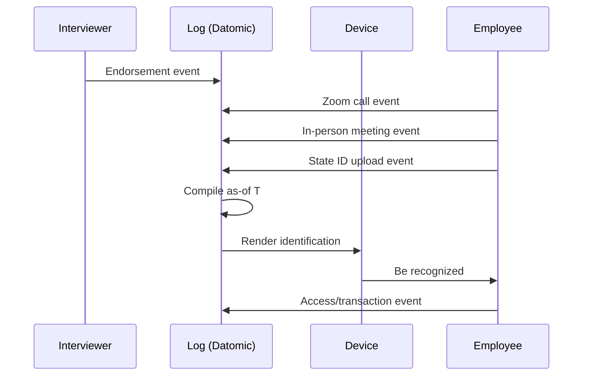
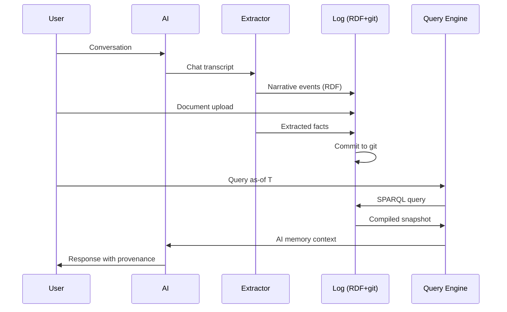
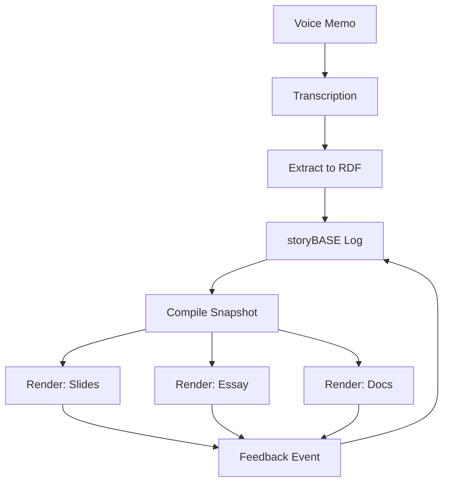

# Immutable Selves: A Functional Approach to Digital Identity

**Identity is not mutable state. Yet we're treating it like Backbone.js.**[^1]

This essay explores a simple thesis: identity—both human and AI—should be modeled as an append-only log that compiles to state, not as mutable objects. By applying Clojure's design patterns to identity systems, we unlock provenance, equality, and decentralization by design.

---

## The Problem: Identity as Mutable State

In 2012, I was Dylan Butman, writing Backbone.js applications with one guiding principle: "Your code was shit. Let me refactor it for you."[^2] Backbone taught me to query the DOM, select elements, and mutate the picture directly. You saw a picture. Then you queried it. Then you mutated it.[^3]

I want to argue that we still treat not only human identity and identification but also emergent AI identity and synthetic individuality like Backbone.js.[^4] We query a mutable profile, select attributes, and update them in place. No single source of truth. No provenance. No equality guarantees.

### Human Identity: Source of Truth

Where is the identity here? Who is the authority? What are the claims being made?[^5]

For humans, the answer is clear: **You.**[^6] Authorities issue documents that make claims about you.[^7] The state of California says you can drive. Your employer says you can access the building. These are facts appended to your history, not mutations of a central record.

Yet our systems treat identification as mutable state: passwords change, keys rotate, profiles update. We lose provenance. We can't prove equality across time. We're vulnerable to ghost labor—bad actors, even state actors like North Korea, deepfaking candidates, passing interviews, collecting paychecks on behalf of fake identities.[^8]

### AI Identity: Source of Truth Unclear

For AI, the problem is worse. Labs train models that say stuff. Each chat is different context.[^9] "My AI doesn't give the same answers as your AI"—this is not a bug, it's the architecture.[^10] AI models are black boxes. Persona prompts mutate rendered state. There's no provenance, no version control, no way to prove what the AI "knew" at time T.

---

## The Solution: Clojure Design Patterns for Identity

In Clojure, we don't have frameworks. We have simple tools and good principles.[^11] Simple tools + good principles = design patterns.[^12]

The pattern that changed everything for me was **reified change**: make state explicit, use an append-only log as single source of truth, ensure everyone sees the same thing, and render as a pure function to create deterministic UIs.[^13]

This is Om for identity. This is React for selves.

### Core Thesis: Experience as Append-Only Log

Experience is an append-only log that compiles to identity.[^14] Identification is a render target. Interaction is transaction.

For human identity, this means:
- **SSoT**: Datomic database of facts about a person over time
- **Query**: Datalog queries compile privileges as-of T
- **Render**: Device-to-device interaction presents compiled identification
- **Events**: Employment, access grants, role changes append to the log

For AI identity, the pattern is identical:
- **SSoT**: RDF graph + git versioning of narrative facts
- **Query**: SPARQL queries compile AI memory as-of T  
- **Render**: Chat/API interaction presents compiled perspective
- **Events**: Conversations, document ingestion, style observations append to the log

---

## Two Systems, One Pattern

### berecognized.id: Immutable Identification

**Problem**: Passwords and digital keys are mutable, siloed, vulnerable. No single source of truth for privileges.[^15]

**Approach**: Append-only log of facts about a person → datalog query compiles privileges as-of T → device renders identification → interactions append new facts.[^16]

**Flow**:

**Outcomes**: Provenance for individual transactions. Referential equality for free. Offline transactions enabled. Proof of provenance and authority innate—hash of last transaction + SSoT state enables "be recognized" property.[^17]

### aswritten.ai: Immutable AI Memory

**Problem**: AI models are black boxes. Persona prompts mutate rendered state. No provenance or version control for AI identity. Stakes: narrative manipulation, embedded propaganda, deepfakes.[^18]

**Approach**: Person talks to AI → extract chats/docs to RDF → save to append-only log → AI memory as 'as-of T' snapshot (pure function).[^19]

**Flow**:

**Outcomes**: Provenance, equality, decentralization/offline scale. Deterministic AI perspective for specific graph queries.[^20] Examples: full talk as query, section of talk, talk evolution over time, any accessible graph subset within billion-node graph.[^21]

---

## The Leverage: What We Get for Free

Immutability enables equality, provenance, versioning, branching, generative testing, decentralization, and infinite read scale—for free.[^22]

**What we gave up**: Distributed writes. All logic lives in event clients. Transact is just adding triples. Single transactor is a bottleneck.[^23]

**Why it's worth it**: Consistency, provenance, auditability. When provenance and equality matter more than write throughput, this pattern wins.[^24]

### Comparison: Backbone.js vs. Om

| Aspect | Backbone.js (Mutable) | Om/React (Immutable) | Identity Today | This Approach |
|--------|----------------------|---------------------|----------------|---------------|
| State | Query DOM, mutate | State machine, pure render | Mutable profiles | Append-only log |
| Truth | Picture is truth | Data is truth | Profile is truth | History is truth |
| Equality | Reference equality breaks | Value equality works | Can't prove sameness | Hash equality |
| Provenance | None | Implicit in data flow | None | Explicit in log |
| Offline | Breaks | Works | Breaks | Works |

Identity systems today are Backbone. This is Om for identity.[^25]

---

## Meta-Demonstration: This Talk as Proof

This talk itself exemplifies the reified change architecture and storyBASE workflow.[^26] The creation process:

1. **Voice memo transcription** → raw input (Sample_1, 11,800 chars)[^27]
2. **Extract to RDF** → narrative concepts, style observations, rubric assessments[^28]
3. **Normalize against storyBASE** → clean terminology, fix errors, align with established style[^29]
4. **Compile snapshot** → deterministic view of narrative as-of T
5. **Render to formats** → presentation slides, essay, documentation

This workflow embodies the core thesis: identity (and content) as compiled from immutable history, enabling provenance and deterministic evolution.[^30]

---

## Conclusion: A World of Compiled Selves

A world where identity—human, synthetic, AI—is rendered from immutable history, enabling equality, provenance, and trust by design.[^31]

**For developers and identity architects** who treat identity as mutable state, this is a functional paradigm that makes identity deterministic, auditable, and decentralized—by applying Clojure's immutability principles to human and AI identity systems.[^32]

The same principles apply across UI, identity, and AI. Immutability is the unlock. Single transactor is an acceptable bottleneck.[^33]

Simple tools. Good principles. Design patterns that compound.[^34]

---

## Footnotes

[^1]: From Sample_ConjPresentation_2025 (Tx_20251113T030805Z_conj2025): Core metaphor comparing identity systems to Backbone.js mutable DOM pattern. Related to Theme_FunctionalIdentity and Narrative_ImmutableIdentity.

[^2]: From Sample_1 via StyleObs_2 (Tx_20251111T214920Z_immutable_selves): Characteristic blunt phrasing; speaker idiolect. Broader context: StockPhrases.

[^3]: From Sample_ConjPresentation_2025 via StyleObs_Anaphora_1 (Tx_20251113T030805Z_conj2025): Repeated 'Then you' structure; rhetorical device for emphasis. Related to CadenceRhythm.

[^4]: From Sample_1 via StyleObs_5 (Tx_20251111T214920Z_immutable_selves): Core analogy: identity systems = Backbone.js (mutable DOM). Broader context: Analogy.

[^5]: From Sample_ConjPresentation_2025 via StyleObs_RhetoricalQuestion_1 (Tx_20251113T030805Z_conj2025): Triadic rhetorical questions; frames problem space and invites audience reasoning. Related to RuleOfThree.

[^6]: From Sample_ConjPresentation_2025 via StyleObs_ShortPunchy_1 (Tx_20251113T030805Z_conj2025): Single-word answer 'You.' after setup; punchy, direct, confident. Related to ToneDirectPersonal.

[^7]: From Actor_Human (Tx_20251113T030805Z_conj2025): "Source of truth for identity; authorities issue documents that make claims." Broader context: PrimaryActors.

[^8]: From Risk_GhostLabor (Tx_20251113T032552Z_sample1): "Bad actors (individuals or state actors like North Korea) deepfaking candidates, passing interviews, collecting paychecks on behalf of fake identities." Challenges CaseStudy_BeRecognizedID; mitigated by continuous identity establishment via append-only log. Broader context: ActorIncentiveAnalysis.

[^9]: From Actor_AI (Tx_20251113T030805Z_conj2025): "Source of truth unclear; labs train models that say stuff; each chat is different context." Broader context: PrimaryActors.

[^10]: From Sample_1 via StyleObs_4 (Tx_20251113T032552Z_sample1): Rhetorical question frames AI memory problem. Related to CaseStudy_AsWrittenAI.

[^11]: From Sample_ConjPresentation_2025 via StyleObs_StockPhrase_1 (Tx_20251113T030805Z_conj2025): "No frameworks / Simple tools ± good principles"—Clojure community idiom; signals insider knowledge and shared values. Related to IdiolectPhrasing.

[^12]: From Sample_1 via StyleObs_1 (Tx_20251111T214920Z_immutable_selves): "Simple tools + good principles = design patterns"—formula-style cadence; punchy equation. Broader context: ShortPunchyCadence.

[^13]: From Sample_ConjPresentation_2025 via StyleObs_Anaphora_1 (Tx_20251113T030805Z_conj2025): "Make state explicit / Append only log -> Single source of truth / Everyone sees the same thing / Render as pure function -> Deterministic UIs"—repeated structural frame creates rhythm and memorability. Related to CadenceRhythm.

[^14]: From Sample_ConjPresentation_2025 via StyleObs_Analogy_1 (Tx_20251113T030805Z_conj2025): "Experience is an append-only log that compiles to identity"—core analogy mapping human to Datomic model. Related to ResonanceUse.

[^15]: From ProblemContext_1 (Tx_20251111T214920Z_immutable_selves): "Passwords and digital keys are mutable, siloed, and vulnerable; no single source of truth for privileges." Broader context: Archetype_1 (berecognized.id).

[^16]: From ApproachPattern_1 (Tx_20251111T214920Z_immutable_selves): "SSoT (Datomic) → datalog query → render to identification/privileges → event-driven transactions → append-only log → recompile." Canonical flow applied to access control.

[^17]: From CaseStudy_BeRecognizedID (Tx_20251113T032552Z_sample1): Results include "Provenance for individual transactions; referential equality for free; offline transactions enabled." Supports Claim_ReifiedChangePattern. Related to DataModelLifecycle and GovernanceSafetyTrust.

[^18]: From ProblemContext_2 (Tx_20251111T214920Z_immutable_selves): "AI models are black boxes; persona prompts mutate rendered state; no provenance or version control for AI identity. Stakes: narrative manipulation, embedded propaganda, deepfakes." Broader context: Archetype_2 (aswritten.ai).

[^19]: From CaseStudy_AsWrittenAI (Tx_20251113T032552Z_sample1): "Transaction sequence: person talks to AI → extract chats/docs to RDF → save to append-only log → AI memory as 'as-of T' snapshot (pure function)." Supports Claim_ReifiedChangePattern. Related to DataModelLifecycle and TechnologiesSocialSystems.

[^20]: From SystemProperty_DistributedDecentralization (Tx_20251113T032552Z_sample1): "Reads scale linearly; data model exists off-server, with transactions submitted later." Conviction level: Boulder. Evidenced by both case studies. Broader context: ScalabilityPerformance.

[^21]: From FutureVision_DeterministicAI (Tx_20251113T032552Z_sample1): "Examples: full talk as query, section of talk, talk evolution over time, any accessible graph subset within billion-node graph." Conviction level: Stake. Supports CaseStudy_AsWrittenAI. Broader context: TrendForecasting / InflectionPoints.

[^22]: From LeverageProfile_1 (Tx_20251111T214920Z_immutable_selves): "Immutability enables equality, provenance, versioning, branching, generative testing, decentralization, and infinite read scale—for free. Small choice (append-only) creates outsized effects across system." Broader context: TechnicalExplainers.

[^23]: From DesignTradeoff_1 (Tx_20251111T214920Z_immutable_selves): "Bottleneck at single transactor; all logic in event clients; transact is just adding triples. What we gave up: distributed writes. Why worth it: consistency, provenance, auditability." Broader context: TechnicalExplainers.

[^24]: From ComparativeAnalysis_1 (Tx_20251111T214920Z_immutable_selves): "Backbone.js (query DOM, mutate picture) vs. Om/React (state machine, pure function render). Identity systems today are Backbone; this is Om for identity. When to use: when provenance, auditability, and equality matter more than write throughput." Broader context: TechnicalExplainers.

[^25]: From ComparativeAnalysis_1 (Tx_20251111T214920Z_immutable_selves): Explicit comparison positioning this approach as "Om for identity." Related to Theme_FunctionalIdentity.

[^26]: From Proof_1 (Tx_20251113T033534Z_claude45): "The talk itself exemplifies the reified change architecture and storyBASE workflow, showing iterative refinement from raw inputs to polished outputs." Broader context: Proof. Related to CaseStudies and Outcomes.

[^27]: From Sample_1 (Tx_20251110T184512Z_sample1): "Voice memo: Punch talk conceptual framing" with inputLength 11,800. "Transcribed voice memo outlining narrative architecture for identity-as-append-only-log talk; speaker: Scarlet Dame."

[^28]: From Tx_20251110T184512Z_sample1: Transaction generated Theme_ImmutableIdentity, Theme_TransitionAsStateChange, Actor_ScarletDame, Actor_LukeVanderhart, Anchor_NarrativeArchitecture, and multiple StyleObservations and RubricAssessments.

[^29]: From Behavior_1 (Tx_20251113T033534Z_claude45): "Normalize Transcription Against storyBASE: Clean and refine raw transcription using entity's established style and terminology to fix errors, inconsistencies, and filler." Broader context: Behaviors. Related to StyleProfiles and TerminologyControl.

[^30]: From Narrative_1 (Tx_20251113T033534Z_claude45): "Core thesis: identity and content derive from append-only log with as-of-T snapshots, enabling provenance and deterministic evolution." Broader context: CoreNarratives. Related to Proof and Architecture.

[^31]: From Vision_1 (Tx_20251111T214920Z_immutable_selves): "A world where identity—human, synthetic, AI—is rendered from immutable history, enabling equality, provenance, and trust by design. Future state: identity systems that inherit Clojure's guarantees." Broader context: NarrativeAnchor.

[^32]: From PositioningThesis_1 (Tx_20251111T214920Z_immutable_selves): "For developers and identity architects who treat identity as mutable state, this is a functional paradigm that makes identity deterministic, auditable, and decentralized—by applying Clojure's immutability principles to human and AI identity systems." Broader context: StrategyOverview.

[^33]: From CaseLessons_1 (Tx_20251111T214920Z_immutable_selves): "Same principles apply across UI, identity, and AI; immutability is the unlock; single transactor is acceptable bottleneck. Insights inform roadmap: extend pattern to new domains." Broader context: CaseStudy_1.

[^34]: From KeyPhrase_1, KeyPhrase_2, KeyPhrase_3 (Tx_20251111T214920Z_immutable_selves): Canonical terms "single source of truth," "append-only log," "pure function" anchor the architecture. Broader context: NarrativeAnchor.