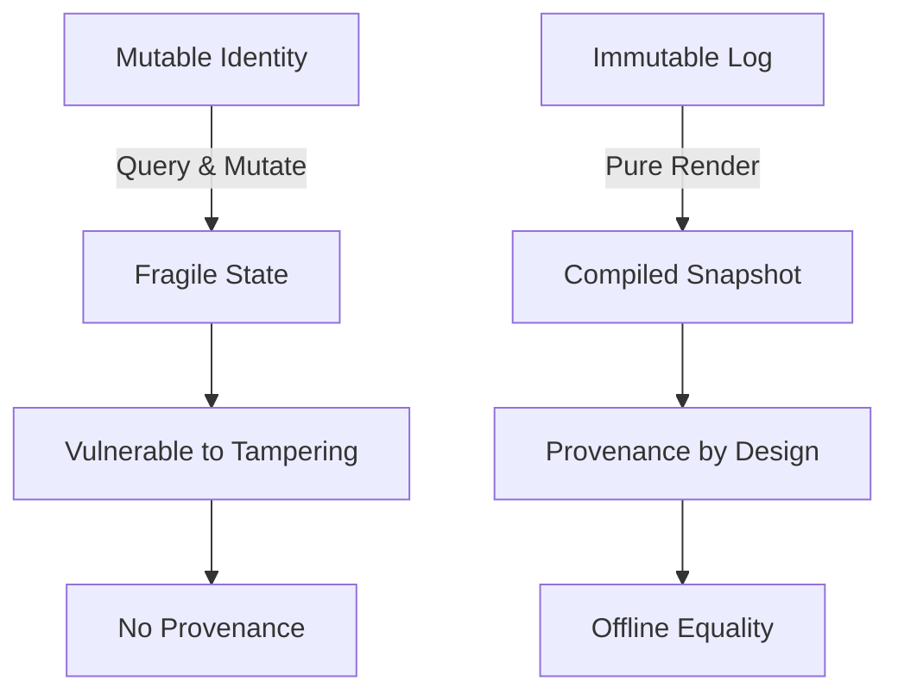
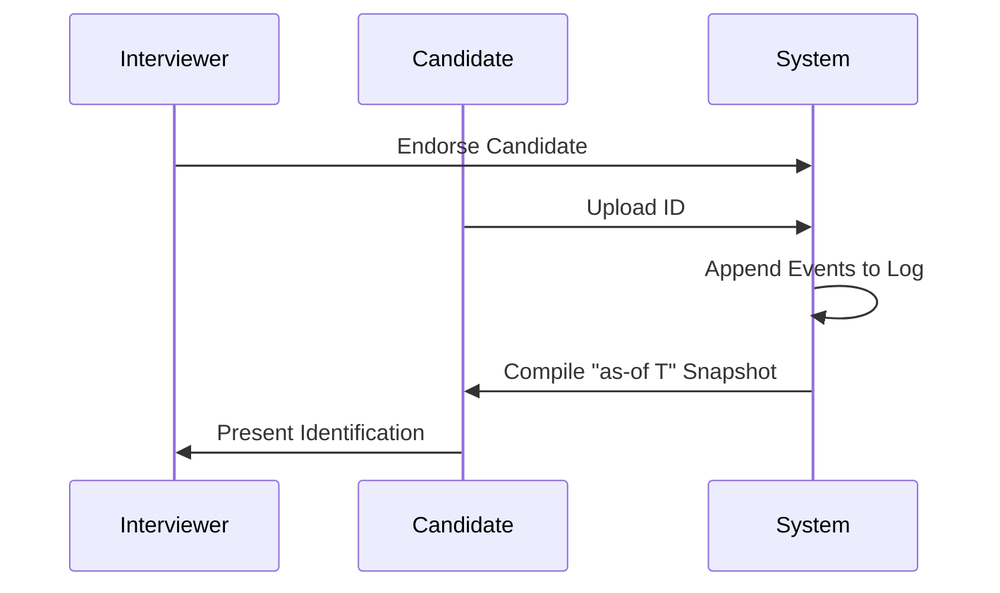
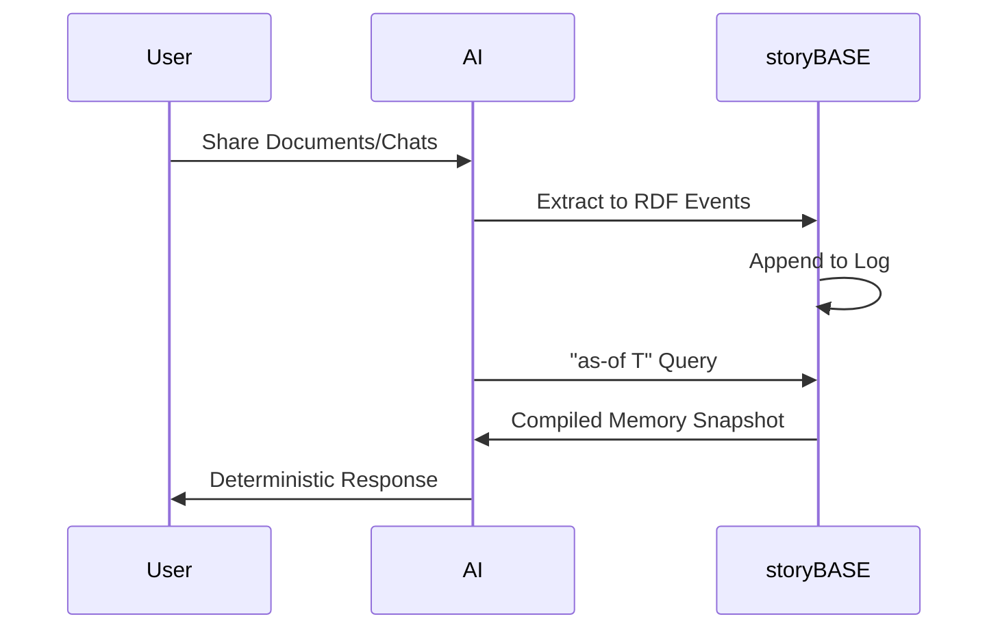

# Immutable Selves: A Functional Approach to Digital Identity

In a world where deepfakes and synthetic identities erode trust, we must rethink identity not as mutable state but as an immutable log compiled into contextual presentations. This essay draws from 13 years of applying Clojure principles to real-world systems, arguing that functional paradigms—immutability, explicit state, and pure rendering—unlock provenance, equality, and decentralization for both human and AI selves.[^1]

We begin with the problem: identity systems today treat selves like Backbone.js models, querying and mutating a "current" state. But experience is an append-only log; identification is a pure function over history. By reifying change as explicit events, we gain auditability and offline scale for free.[^2]

## The Mutable Identity Crisis

Consider a driver's license: it asserts claims (name, age, privileges) from an authority (the state) about a person (you). But where is the "identity"? It's not the plastic—it's the compiled snapshot of facts at a point in time. Yet most systems store identity as mutable records, vulnerable to tampering and lacking provenance.[^3]

This fragility enables "ghost labor": bad actors deepfaking interviews, passing as candidates, and siphoning paychecks—often state-sponsored, like North Korea's schemes.[^4] Static IDs can't counter this; we need continuous, immutable history.

The diagram contrasts mutable vs. immutable approaches: the former leads to fragility, the latter to trust.[^5]

## Clojure Principles as Identity Architecture

Clojure teaches: no frameworks, just simple tools plus good principles. We apply this to identity: make state explicit, use append-only logs as single source of truth (SSoT), and render as pure functions.[^6]

- **Immutability**: Facts accrue; nothing is overwritten. Enables equality (same log = same identity) and provenance (every change auditable).[^7]
- **Explicit State**: Identity emerges from events (endorsements, interactions, delegations), not hidden mutations.[^8]
- **Pure Rendering**: "As-of T" queries compile snapshots deterministically, scaling reads infinitely.[^9]

These yield decentralization: data lives at the edge, transactions submit later. We trade distributed writes for consistency— a bottleneck worth embracing.[^10]

## Case Study: berecognized.id – Human Identity

At Vouch (now strategic advisor), we built berecognized.id to counter impersonation in hiring. Context: enterprises face "ghost labor" where fakes pass interviews but vanish post-hire.[^11]

Intervention: Append-only log of facts (interviews, IDs, roles); "as-of T" compilation to device-rendered identification with privileges.[^12]

Results: Provenance for transactions, referential equality, offline capability. Process: endorsement → meetings → ID upload → role assignment → query compiles snapshot.[^13]

This flow establishes continuous identity, mitigating deepfake risks.[^14]

## Case Study: aswritten.ai – AI Memory

My current venture, aswritten.ai, applies the pattern to AI: "My AI doesn't give the same answers as your AI" because memory lacks SSoT.[^15]

Intervention: Extract chats/docs to RDF events; append to git-versioned log; SPARQL "as-of T" queries render deterministic memory.[^16]

Results: Provenance, equality, offline scale—enabling shareable AI perspectives.[^17]

From manual at Vouch to automated: same architecture, semantic stack.[^18]

## Future Vision: Deterministic AI Perspectives

Imagine querying a billion-node graph: "Render this talk as-of last revision" or "Evolve perspective from NPR to OpenAI." Immutable logs make AI deterministic and auditable.[^19]

Close by inviting participants to the chat—engage the narrative SSoT live.[^20]

## Conclusion: From Mutable to Compiled Selves

Identity is compiled from immutable history. By embracing Clojure's reified change, we build systems with trust baked in. The proof? Production at Vouch and aswritten.ai. Let's make selves immutable.[^21]

[^1]: From narr:Theme_FunctionalIdentity, broader narr:Narratives, definition "Apply Clojure design patterns—immutability, reified change, single source of truth—to identity systems.", related to narr:PositioningThesis and narr:Differentiators, generated by Tx_20251113T030805Z_conj2025.
[^2]: From narr:Narrative_ImmutableIdentity, broader narr:Narratives, definition "Identity—both human and AI—should be modeled as an append-only log that compiles to state, not mutable objects.", note "Core thesis: experience is an append-only log; identification is a render target; interaction is transaction.", related to narr:Mission and narr:Vision, generated by Tx_20251113T030805Z_conj2025.
[^3]: From narr:StyleObs_Analogy_1, broader narr:Analogy, note "Core analogy: experience → log → compiled identity; maps human to Datomic model.", related to narr:ResonanceUse, generated by Tx_20251113T030805Z_conj2025; adjacent to narr:Actor_Human, definition "Source of truth for identity; authorities issue documents that make claims.".
[^4]: From narr:Risk_GhostLabor, broader narr:ActorIncentiveAnalysis, definition "Bad actors (individuals or state actors like North Korea) deepfaking candidates, passing interviews, collecting paychecks on behalf of fake identities.", note "Mitigated by continuous identity establishment via append-only log.", challenges narr:CaseStudy_BeRecognizedID, generated by Tx_20251113T032552Z_sample1.
[^5]: Mermaid chart derived from narr:ComparativeAnalysis_1, broader narr:TechnicalExplainers, value "Backbone.js (query DOM, mutate picture) vs. Om/React (state machine, pure function render). Identity systems today are Backbone; this is Om for identity.", note "When to use: when provenance, auditability, and equality matter more than write throughput.", generated by Tx_20251111T214920Z_immutable_selves.
[^6]: From narr:StyleObs_StockPhrase_1, broader narr:StockPhrases, note "Clojure community idiom; signals insider knowledge and shared values.", related to narr:IdiolectPhrasing, generated by Tx_20251113T030805Z_conj2025.
[^7]: From narr:SystemProperty_ImmutabilityProvenance, broader narr:ArchitectureOverview, definition "Transaction log ensures auditability for every interaction.", supports narr:Claim_ReifiedChangePattern, evidencedBy narr:CaseStudy_BeRecognizedID and narr:CaseStudy_AsWrittenAI, generated by Tx_20251113T032552Z_sample1.
[^8]: From narr:Claim_ReifiedChangePattern, broader narr:Architecture, definition "Immutability and explicit state management enable provenance, equality, and offline capability.", supports narr:DataModelLifecycle and narr:ReliabilityResilience, generated by Tx_20251113T032552Z_sample1.
[^9]: From narr:StyleObs_9, broader narr:TerminologyControl, note "Canonical term for point-in-time query; appears multiple times.", related to narr:CaseStudy_BeRecognizedID and narr:CaseStudy_AsWrittenAI, generated by Tx_20251113T032552Z_sample1.
[^10]: From narr:DesignTradeoff_1, broader narr:TechnicalExplainers, value "Bottleneck at single transactor; all logic in event clients; transact is just adding triples.", note "What we gave up: distributed writes. Why worth it: consistency, provenance, auditability.", generated by Tx_20251111T214920Z_immutable_selves.
[^11]: From narr:CaseStudy_BeRecognizedID, broader narr:CaseStudies, CaseContext "Digital identification enables recognition and delegates authority to access/use/transact with shared technology.", note "Contrasts static IDs with append-only log compiled to privileges as-of T.", related to narr:DataModelLifecycle and narr:GovernanceSafetyTrust, generated by Tx_20251113T032552Z_sample1.
[^12]: From narr:CaseStudy_BeRecognizedID, CaseIntervention "Append-only log of facts about a person over time (employment, access, roles, interactions); device-rendered snapshot compiled at specific point in time.", supports narr:Claim_ReifiedChangePattern.
[^13]: From narr:CaseStudy_BeRecognizedID, CaseResults "Provenance for individual transactions; referential equality for free; offline transactions enabled."; adjacent to narr:Flow_EmployeeLifecycle, definition "Endorsement by interviewer → Zoom calls → in-person meetings → state ID uploads → assigned role with privileges → 'as-of' query compiles snapshot (digital identification) on device.", generated by Tx_20251113T032552Z_sample1.
[^14]: Mermaid sequence derived from narr:Flow_EmployeeLifecycle, broader narr:ProductLadder, supports narr:CaseStudy_BeRecognizedID, related to narr:Behaviors and narr:Storyboards.
[^15]: From narr:CaseStudy_AsWrittenAI, broader narr:CaseStudies, CaseContext "AI memory problem: 'My AI doesn't give the same answers as your AI'; need for narrative source of truth.", note "Formalized architecture from manual process at Vouch; now automated.", related to narr:DataModelLifecycle and narr:TechnologiesSocialSystems, generated by Tx_20251113T032552Z_sample1.
[^16]: From narr:CaseStudy_AsWrittenAI, CaseIntervention "Transaction sequence: person talks to AI → extract chats/docs to RDF → save to append-only log → AI memory as 'as-of T' snapshot (pure function).", supports narr:Claim_ReifiedChangePattern.
[^17]: From narr:CaseStudy_AsWrittenAI, CaseResults "Provenance, equality, decentralization/offline scale; deterministic AI perspective for specific graph queries.".
[^18]: From narr:StyleObs_2, broader narr:BrandNameStylization, note "Lowercase domain-style brand name.", related to narr:CaseStudy_AsWrittenAI, generated by Tx_20251113T032552Z_sample1.
[^19]: From narr:FutureVision_DeterministicAI, broader narr:TrendForecasting, definition "Examples: full talk as query, section of talk, talk evolution over time, any accessible graph subset within billion-node graph.", note "Close with examples of such queries, then link to chat for participants to engage with narrative source of truth.", supports narr:CaseStudy_AsWrittenAI, generated by Tx_20251113T032552Z_sample1.
[^20]: From narr:RubricAssess_Tailoring_Sample1, broader narr:Rubric_Tailoring, value "4.0", note "Tailored for technical audience (leaders, architects); references to 'participants' and 'chat' suggest presentation context; could strengthen persona-specific framing.", generated by Tx_20251113T032552Z_sample1.
[^21]: From narr:Theme_ImmutableIdentity, broader narr:Narratives, definition "Human and system identity modeled as integral of snapshots over time, not mutable present state.", related to narr:Conviction_Foundation, generated by Tx_20251110T184512Z_sample1; supported by narr:CaseStudy_BeRecognizedID and narr:CaseStudy_AsWrittenAI.