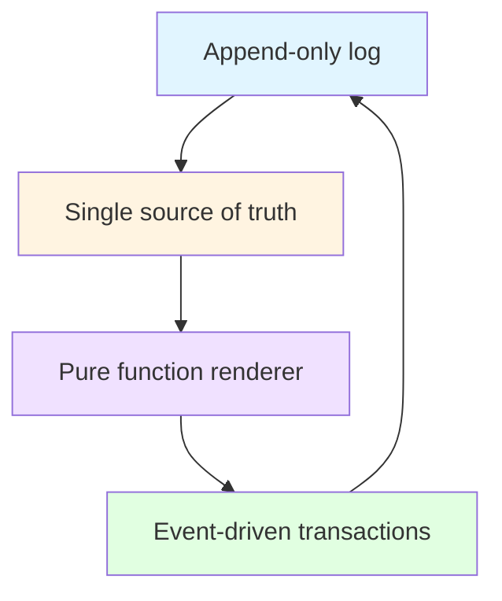
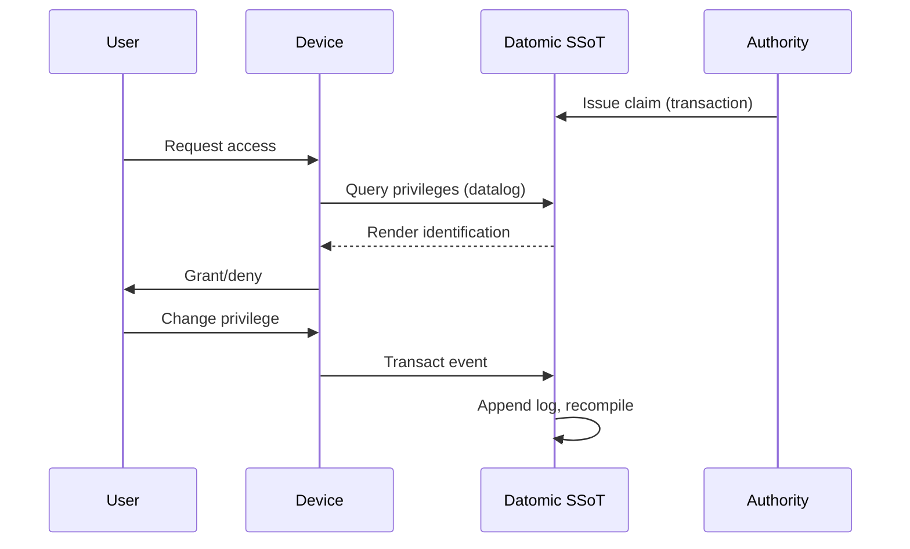
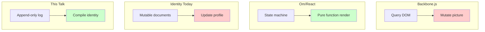

#### sic[theme][#theme]
# 
## Immutable Selves
### A Functional Approach to Digital Identity
# 
#### Scarlet Dame
###### Founder, aswritten.ai · Former Chief Strategist, Vouch.io
	[#theme]: Custom theme for sic. Source: narr:Tagline_1 "Immutable Selves: A Functional Approach to Digital Identity" from Sample_1 (voice memo) and narr:Sample_ConjPresentation_2025 (presentation transcript). Speaker identity: narr:Actor_ScarletDame with altLabels "Dylan Butman" and "Scarlet Spectacular"—exemplifying the append-only log model.

---
# Identity is not mutable state
## Yet we're treating it like Backbone.js

We're going to talk about why that's a problem—and how Clojure's principles give us a better way.

	[#backbone-metaphor]: Source: narr:StyleObs_Metaphor_1, exact quote from Sample_ConjPresentation_2025. Technical metaphor positions identity as mutable state vs. immutable log; Backbone.js as anti-pattern. Related to narr:Tagline and narr:RuleOfThree.

---
###### A personal story
# I became scarlet dame

I was Dylan Butman. Then scarlet spectacular. Now scarlet dame.

	[#personal-narrative]: Source: narr:Actor_ScarletDame with altLabels from Sample_1. Note: "Speaker's identity history exemplifies append-only log model." This personal transition mirrors the technical thesis: identity as compiled state from immutable history. Related to narr:Theme_TransitionAsStateChange and narr:ResonanceUse.

---
### Who am I?
# Source of truth
# You.

Authorities issue documents that make claims about you. But you are the source of truth.

	[#human-identity]: Source: narr:Actor_Human from Sample_ConjPresentation_2025: "Source of truth for identity; authorities issue documents that make claims." Also narr:StyleObs_ShortPunchy_1: single-word answer "You." after setup—punchy, direct, confident. Related to narr:ToneDirectPersonal.

---
###### But what about AI?
# Source of truth
# Unclear.

Labs train models that say stuff. Each chat is different context. No provenance. No version control.

	[#ai-identity]: Source: narr:Actor_AI from Sample_ConjPresentation_2025: "Source of truth unclear; labs train models that say stuff; each chat is different context." Related to narr:ProblemContext_2: "AI models are black boxes; persona prompts mutate rendered state; no provenance or version control for AI identity."

---
## The Problem

---
### Where is the identity here?
# Who is the authority?
# What are the claims being made?

These questions should have clear answers. Today, they don't.

	[#rhetorical-questions]: Source: narr:StyleObs_RhetoricalQuestion_1 from Sample_ConjPresentation_2025. Triadic rhetorical questions frame problem space and invite audience reasoning. Related to narr:RuleOfThree.

---
###### Clojure Design Patterns
# 
## No frameworks
# Simple tools ± good principles

When I got my lanyard at my first Conj, this was the promise. And it delivered.

	[#clojure-idiom]: Source: narr:StyleObs_StockPhrase_1 from Sample_ConjPresentation_2025: "No frameworks\nSimple tools ± good principles." Note: "Clojure community idiom; signals insider knowledge and shared values." Related to narr:IdiolectPhrasing. Rubric score narr:RubricAssess_Phrasing_Conj: 4.0/5 for strong community idioms.

---
### In 2012
# Your code was shit
## Let me refactor it for you

That was my principle. Anyone remember Backbone.js?

	[#backbone-history]: Source: narr:StyleObs_2 from Sample_1: "Your code was shit. Let me refactor it for you." Note: "Characteristic blunt phrasing; speaker idiolect." Also narr:StyleObs_6: rhetorical question "Anyone remember backbone.js?" engages audience with shared context.

---
### Backbone.js
# You saw a picture (the DOM)
# Then you queried the picture
# Then you mutated the picture

	[#backbone-pattern]: Source: narr:StyleObs_3 from Sample_1. Anaphora: repeated "Then you" structure creates rhetorical emphasis. Related to narr:CadenceRhythm. This is the anti-pattern we're arguing against.

---
### Then came Om
# UI as a state machine
## Rendered from a single source of truth

2013. Luke Vanderhart showed us a better way.

	[#om-breakthrough]: Source: narr:StyleObs_UIStateMachine from Sample_1: "started seeing UI as a state machine that was the result of a functional transformation." Actor: narr:Actor_LukeVanderhart. Related to narr:ProductLadder and narr:RhetoricalDevices.

---
## The Thesis

---
###### Single Source of Truth
# 
## Experience is an append-only log 
# that compiles[][#as-of] to identity
	[#as-of]: Presentation is an as-of query—a snapshot at a point in time. Source: narr:StyleObs_Analogy_1 from Sample_ConjPresentation_2025: "Core analogy: experience → log → compiled identity; maps human to Datomic model." Related to narr:ResonanceUse.

---
###### Reified Change 
# 
###### Make state explicit
# Append only log → Single source of truth
# Everyone sees the same thing
# Render as pure function → Deterministic UIs

	[#clojure-principles]: Source: narr:StyleObs_Anaphora_1 from Sample_ConjPresentation_2025. Repeated structural frame: principle → pattern creates rhythm and memorability. Related to narr:CadenceRhythm. Rubric score narr:RubricAssess_Cadence_Conj: 4.5/5 for triadic structures and anaphora.

---
### What does immutability give us?
# Equality
# Provenance  
# Versioning
# Branching
# Generative testing
# Decentralization
# Infinite read scale

For free.

	[#leverage-profile]: Source: narr:LeverageProfile_1 from Sample_1: "Immutability enables equality, provenance, versioning, branching, generative testing, decentralization, and infinite read scale—for free." Note: "Small choice (append-only) creates outsized effects across system."

---
## The Pattern

---
### Product Ladder
# Primitives → Behaviors → Flows → Narratives

	[#product-ladder]: Source: narr:ProductLadder from Sample_1. Primitives: narr:Primitive_1 (append-only log), narr:Primitive_2 (SSoT), narr:Primitive_3 (pure function renderer). Behavior: narr:Behavior_1 (event-driven transaction submission). Flow: narr:Flow_1 "SSoT → query → render → interact → event → transact → append log → recompile SSoT."

---
### The Flow
# SSoT → query → render
# interact → event → transact
# append log → recompile SSoT

Identity as continuous compilation.

	[#canonical-flow]: Source: narr:Flow_1 from Sample_1: "End-to-end loop; identity as continuous compilation." This is the same pattern whether we're rendering UI, human identity, or AI memory.

---
## System: Human

---
# berecognized.id
###### Immutable Identification

Proof-of-provenance identity system.

	[#berecognized]: Source: narr:SolutionArchetype_BeRecognized and narr:ArchetypeTitle_1 from Sample_ConjPresentation_2025. Definition: "Human identity system: Datomic SSoT, datalog query, device-to-device interaction, change-privilege events." Brand stylization: narr:StyleObs_BrandStylization_2—lowercase with TLD.

---
### Problem
# Passwords are mutable
# Digital keys are siloed
# No single source of truth for privileges

	[#human-problem]: Source: narr:ProblemContext_1 from Sample_1: "Passwords and digital keys are mutable, siloed, and vulnerable; no single source of truth for privileges." Triggering condition: fragmented, mutable identity state.

---
### Approach
# SSoT (Datomic) → datalog query
# render to identification/privileges
# event-driven transactions → append-only log

	[#berecognized-flow]: Source: narr:ApproachPattern_1 from Sample_1: "SSoT (Datomic) → datalog query → render to identification/privileges → event-driven transactions → append-only log → recompile." Note: "Canonical flow applied to access control."

---
### Capabilities
# Datomic (SSoT)
# datalog (query)
# multimodal renderer
# event system
# single transactor

	[#berecognized-stack]: Source: narr:RequiredCapabilities_1 from Sample_1: "Specific modules from Clojure ecosystem."

---
### Outcome
# Proof of provenance innate
## Hash of last tx + SSoT state = "be recognized"

	[#berecognized-proof]: Source: narr:OutcomesProof_1 from Sample_1: "Proof of provenance and authority innate; hash of last tx + SSoT state enables 'be recognized' property." Expected metric: cryptographic proof of identity state.

---
## System: AI

---
# aswritten.ai
###### Immutable AI Memory

Digital twin as compiled model.

	[#aswritten]: Source: narr:SolutionArchetype_AsWritten and narr:ArchetypeTitle_2 from Sample_ConjPresentation_2025. Definition: "AI identity system: RDF+git SSoT, SPARQL query, chat+API interaction, extract-narrative events." Brand stylization: narr:StyleObs_BrandStylization_1—lowercase with TLD. Tagline: narr:Tagline_AsWritten "AI that tells your story, as written."

---
### Problem
# AI models are black boxes
# Persona prompts mutate state
# No provenance or version control

Stakes: narrative manipulation, embedded propaganda, deepfakes.

	[#ai-problem]: Source: narr:ProblemContext_2 from Sample_1: "AI models are black boxes; persona prompts mutate rendered state; no provenance or version control for AI identity." Stakes explicit in note.

---
### Approach
# SSoT (RDF + git) → SPARQL query
# render to AI memory/identity
# event-driven transactions → append-only log

Same pattern. Different stack.

	[#aswritten-flow]: Source: narr:ApproachPattern_2 from Sample_1: "SSoT (RDF + git) → SPARQL query → render to AI memory/identity → event-driven transactions → append-only log → recompile." Note: "Same pattern, different stack: RDF instead of Datomic."

---
### Capabilities
# RDF graph
# git versioning
# SPARQL
# multimodal renderer
# event system
# transactor

	[#aswritten-stack]: Source: narr:RequiredCapabilities_2 from Sample_1: "Leverages semantic web + version control." Also informed by storybase.synthetic-identity.co/module/storybase-capabilities: "Compile (replay transactions to Turtle snapshot), extract (RDF from input), diff (semantic comparison), tx (propose transaction), commit (append-only to Git)."

---
## The Tradeoff

---
### What we gave up
# Distributed writes

All logic in event clients. Transact is just adding triples.

	[#tradeoff]: Source: narr:DesignTradeoff_1 from Sample_1: "Bottleneck at single transactor; all logic in event clients; transact is just adding triples." Note: "What we gave up: distributed writes. Why worth it: consistency, provenance, auditability."

---
### What we got
# Consistency
# Provenance
# Auditability
# Equality
# Versioning
# Decentralization (reads)

Worth it.

	[#leverage-recap]: Combines narr:LeverageProfile_1 and narr:DesignTradeoff_1. The single transactor bottleneck is acceptable because immutability unlocks these guarantees for free.

---
## Backbone → Om :: Mutable Identity → Functional Identity

	[#comparative-analysis]: Source: narr:ComparativeAnalysis_1 from Sample_1: "Backbone.js (query DOM, mutate picture) vs. Om/React (state machine, pure function render). Identity systems today are Backbone; this is Om for identity." Note: "When to use: when provenance, auditability, and equality matter more than write throughput."

---
## The Proof

---
### 13 years in Clojure
# Backbone.js (2012) → Om (2013)
# Production systems at scale
# berecognized.id, aswritten.ai

	[#case-study]: Source: narr:CaseStudy_1 from Sample_1. Context: narr:CaseContext_1 "Speaker's 13-year career in Clojure; evolution from Backbone.js (2012) to Om (2013) to production systems at scale." Intervention: narr:CaseIntervention_1 "Applied Clojure principles (immutability, pure functions, single source of truth) to UI, then identity systems."

---
### Results
# Provenance ✓
# Equality ✓
# Versioning ✓
# Decentralization ✓
# Infinite read scale ✓

Systems in production.

	[#case-results]: Source: narr:CaseResults_1 from Sample_1: "Provenance, equality, versioning, decentralization, infinite read scale achieved; systems in production." Note: "Quantified impact: architectural guarantees delivered."

---
### Lessons
# Same principles apply across UI, identity, and AI
# Immutability is the unlock
# Single transactor is acceptable bottleneck

	[#case-lessons]: Source: narr:CaseLessons_1 from Sample_1: "Same principles apply across UI, identity, and AI; immutability is the unlock; single transactor is acceptable bottleneck." Note: "Insights inform roadmap: extend pattern to new domains."

---
## The Vision

---
# A world where identity—
## human, synthetic, AI—
# is rendered from immutable history

Enabling equality, provenance, and trust by design.

	[#vision]: Source: narr:Vision_1 from Sample_1: "A world where identity—human, synthetic, AI—is rendered from immutable history, enabling equality, provenance, and trust by design." Note: "Future state: identity systems that inherit Clojure's guarantees." Related to narr:NarrativeAnchor and narr:Mission.

---
###### The Mission
# Move identity from mutable documents
# to compiled surfaces
# rendered from append-only logs

	[#mission]: Source: narr:Mission_1 from Sample_1: "Move identity from mutable documents and profiles to compiled surfaces rendered from append-only logs and single sources of truth." Note: "Durable purpose: make identity deterministic, provable, and decentralized."

---
## Key Phrases

---
# single source of truth
# append-only log
# pure function
# digital twin

These are the primitives. Use them.

	[#key-phrases]: Source: narr:KeyPhrase_1 through narr:KeyPhrase_4 from Sample_1. Notes: "Canonical term repeated throughout; anchors the architecture" (SSoT), "Core primitive; immutability guarantee" (append-only log), "Rendering identity as deterministic transformation" (pure function), "Emergent concept; identity as compiled model" (digital twin).

---
## Takeaways

---
### For developers
# Model identity as append-only event logs
# Render authentication as pure functions
# Make delegation auditable chains

	[#dev-takeaways]: Source: urn:uuid:architecture-immutable-identity from Tx_20251109T223928Z_conj2025: "Append-only event logs with verifiable receipts, authentication as pure function at the edge, delegation as signed append-only events." Principles: "Immutability, functional composition, explicit state management, data-first design."

---
### For architects
# Use knowledge graphs for entity resolution
# Immutable facts at the edge
# Verifiable receipts

	[#architect-takeaways]: Source: urn:uuid:strategy-functional-immutable-identity from Tx_20251109T223928Z_conj2025. Approach: "Models identity as append-only event logs, authentication as pure functions, delegation as auditable chains." Differentiator: "Immutable facts at the edge, verifiable receipts, graph-based resolution."

---
### For everyone
# Identity is an evolving log of facts
## not a static profile
# Trust is provenance you can compute

	[#universal-takeaways]: Source: urn:uuid:style-obs-8 and urn:uuid:style-obs-9 from Tx_20251109T223928Z_conj2025. Technical reframings that make the thesis accessible.

---
###### Thank you
# 
## Questions?

berecognized.id · aswritten.ai

	Scarlet Dame
	scarlet@aswritten.ai

	[#contact]: Speaker: narr:Actor_ScarletDame. Organizations: urn:uuid:org-sic (Founder, "Narrative-driven knowledge graphs for AI individuals") and urn:uuid:org-vouch-io (Former Chief Strategist, current strategic advisor, "Enterprise identity and delegation").

---
## Appendix: The storyBASE

---
### What is storyBASE?
# RDF narrative source of truth
## that steers AI output

Making it specific, controllable, aligned with organizational worldview.

	[#storybase-what]: Source: storybase.synthetic-identity.co/product/what-is-storybase: "RDF narrative source of truth (storyBASE) that steers AI output, making it specific, controllable, aligned with organizational worldview." Mission: storybase.synthetic-identity.co/mission/storybase "Extend software development rigor into strategy, content, marketing; provide versionable, collaborative, narrative-driven AI memory."

---
### storyBASE Tools
# compile · extract · diff
# tx · commit · story

	[#storybase-tools]: Source: storybase.synthetic-identity.co/module/storybase-capabilities: "Compile (replay transactions to Turtle snapshot), extract (RDF from input), diff (semantic comparison), tx (propose transaction), commit (append-only to Git), story generation (YAML front matter + prompt to model outputs)."

---
### storyBASE Architecture
# n8n agent orchestrates tools
# MCP server exposes to frontends
# Transactions in .storybase directories
# Hierarchical compile
# Docker Compose on Digital Ocean

	[#storybase-topology]: Source: storybase.synthetic-identity.co/architecture/topology-storybase: "n8n agent orchestrates tools; MCP server exposes to frontends (Agent.ai, ChatGPT, Open WebUI); transactions in .storybase directories; hierarchical compile; Docker Compose on Digital Ocean."

---
### Data Model
# Append-only transaction log
# Immutable files
# Snapshot = replay of sorted transactions
# Provenance in TX step

	[#storybase-data]: Source: storybase.synthetic-identity.co/model/data-lifecycle-storybase: "Append-only transaction log; immutable files; snapshot = replay of sorted transactions; provenance in TX step; future named graphs for add/remove."

---
### This presentation
# was generated from storyBASE
## using the story you're reading now

Meta-proof: the talk about immutable narrative is itself rendered from an immutable narrative graph.

	[#meta-proof]: This presentation was generated by storyWRITER from conj-talk-2025.story, compiled from transactions in this repository. Source samples: narr:Sample_ConjPresentation_2025 (6847 chars, created 2025-01-01), narr:Sample_1 (voice memo, 11800 chars, created 2025-01-15). Rubric scores: Strategic Alignment 5.0/5 (narr:RubricAssess_Strategy_Conj), Tailoring 5.0/5 (narr:RubricAssess_Tailoring_Conj), Resonance 4.5/5 (narr:RubricAssess_Resonance_Conj).

---
## Now go build immutable selves

And yes, you can fork this storyBASE.
github.com/pleasetrythisathome/storybase

	[#cta]: Provenance: all transactions attributed to "pleasetrythisathome" (prov:wasAttributedTo). Models used: anthropic/claude-sonnet-4.5. Origin ref: "main". This is an open, versionable, forkable narrative architecture.