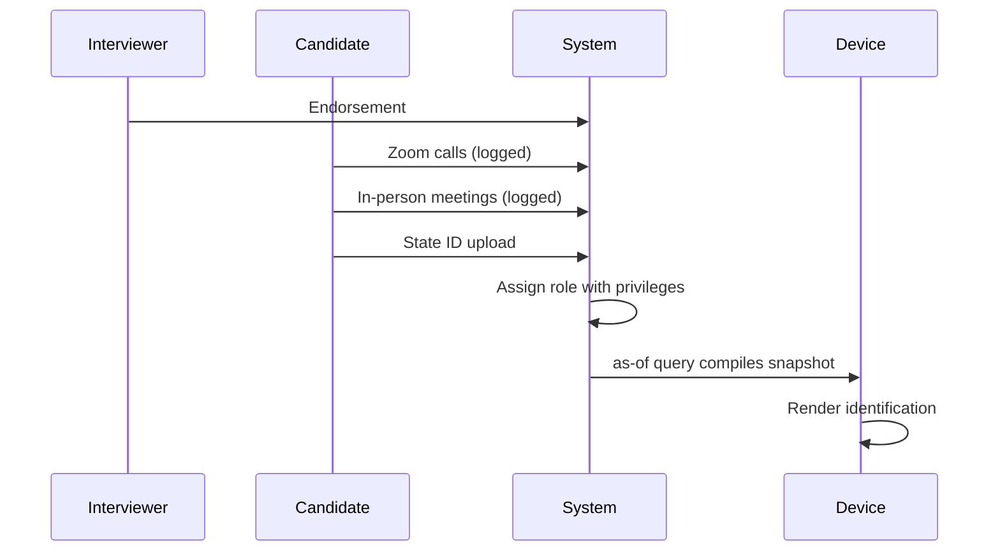
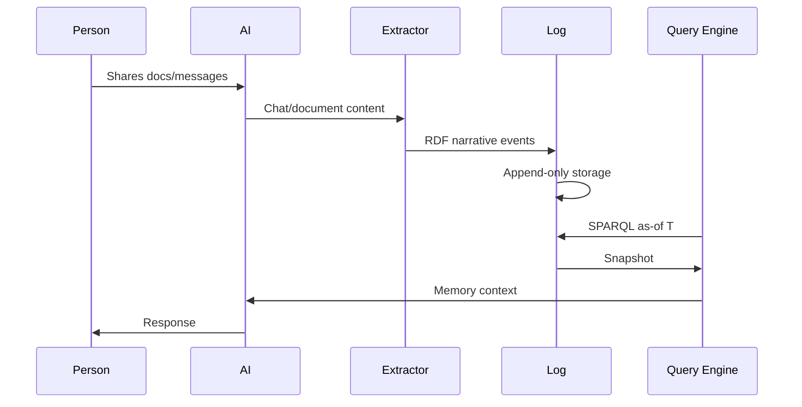
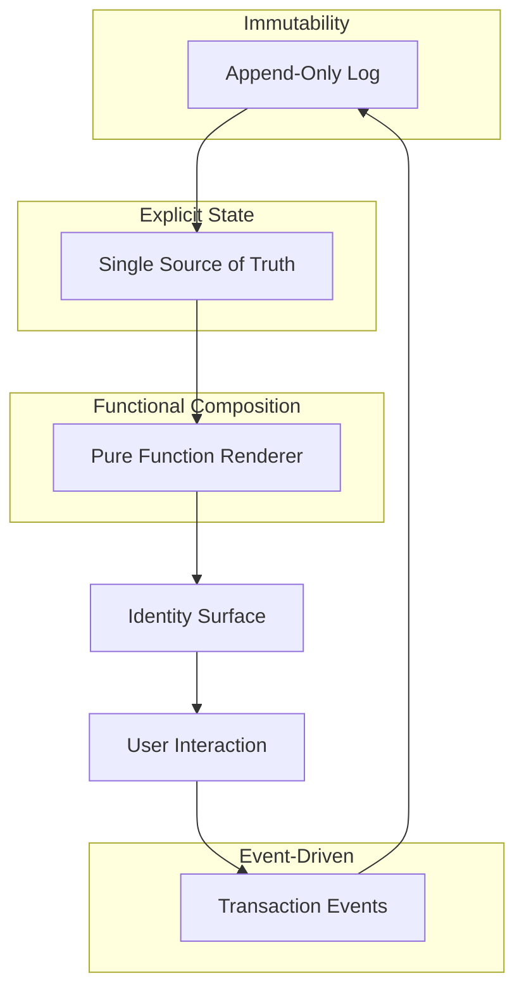
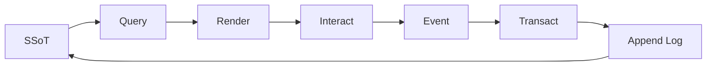
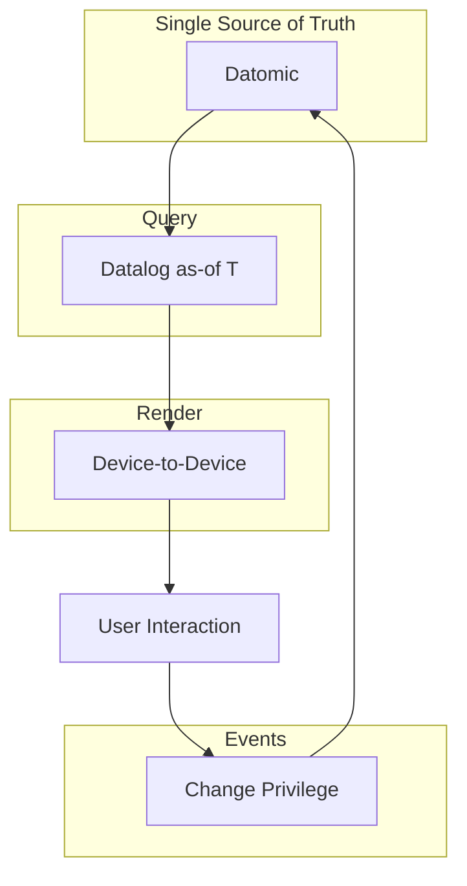
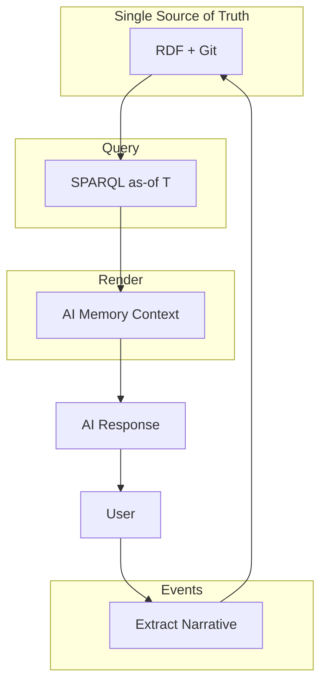
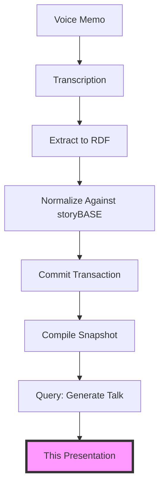
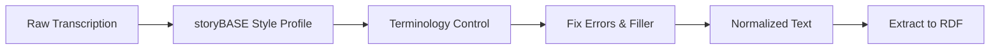

#### sic[theme][#theme]
# 
## Immutable Selves
### A Functional Approach to Digital Identity
# 
#### Scarlet Dame
###### Founder, Sic · Former Chief Strategist, Vouch.io
	[#theme]: Custom theme for Sic brand. Source: narr:Tagline_1 "Immutable Selves: A Functional Approach to Digital Identity" from Sample_1 (Immutable Selves talk), generated via Tx_20251111T214920Z_immutable_selves.

---
# Identity is not mutable state
## Yet we're treating it like Backbone.js[][#backbone]
	[#backbone]: Core metaphor from narr:StyleObs_Metaphor_1 (Sample_ConjPresentation_2025): "Technical metaphor: identity as mutable state vs. immutable log; Backbone.js as anti-pattern." This frames the central problem: current identity systems mutate state directly rather than deriving it from immutable history.

---
###### Who am I?
# I'm scarlet dame
## But I was scarlet spectacular
### And before that, Dylan Butman[][#identity-history]
	[#identity-history]: Personal narrative from narr:Actor_ScarletDame (Sample_1): "Speaker's identity history exemplifies append-only log model" with altLabels "Dylan Butman" and "Scarlet Spectacular." This lived experience grounds the technical thesis in human reality.

---
### My identity is not
# A mutable object
### It's an append-only log[][#append-only]
	[#append-only]: Core primitive from narr:KeyPhrase_2 (Sample_1): "append-only log" defined as "Core primitive; immutability guarantee." Also narr:Primitive_1: "Foundational atomic unit; immutability guarantee." This is the technical foundation of the entire architecture.

---
## The Problem

---
###### 2012
# Anyone remember Backbone.js?[][#backbone-history]
	[#backbone-history]: From narr:StyleObs_6 (Sample_1): rhetorical question "Anyone remember backbone.js?" that "Engages audience; assumes shared context." Also narr:CaseContext_1: "Speaker's 13-year career in Clojure; evolution from Backbone.js (2012) to Om (2013) to production systems at scale."

You saw a picture (the DOM). Then you queried the picture with a selector. Then you mutated the picture.

---
### I want to argue that we still treat
# Human identity
## And emergent AI identity
### Like Backbone.js[][#current-state]
	[#current-state]: From narr:StyleObs_5 (Sample_1): "Core analogy: identity systems = Backbone.js (mutable DOM)." The exact quote: "I want to argue in this talk that we still treat not only human identity and identification but also emergent AI identity and synthetic individuality like Backbone.js."

---
###### What is identity?
# 
### Where is the identity here?
### Who is the authority?
### What are the claims being made?[][#rhetorical-frame]
	[#rhetorical-frame]: From narr:StyleObs_RhetoricalQuestion_1 (Sample_ConjPresentation_2025): "Triadic rhetorical questions; frames problem space and invites audience reasoning." These questions establish the conceptual framework for examining identity systems.

---
## The Clojure Way

---
###### Clojure Design Patterns
# 
## No frameworks
# Simple tools + good principles[][#clojure-idiom]
	[#clojure-idiom]: From narr:StyleObs_StockPhrase_1 (Sample_ConjPresentation_2025): "Clojure community idiom; signals insider knowledge and shared values." Also narr:StyleObs_1 (Sample_1): "Formula-style cadence; punchy equation" for "Simple tools + good principles = design patterns."

When I got my lanyard at my first Clojure/conj in 2013, I had one principle: "Your code was shit. Let me refactor it for you."

---
### But then I learned
# Make state explicit
## Append only log → Single source of truth
### Everyone sees the same thing
# Render as pure function → Deterministic UIs[][#reified-change]
	[#reified-change]: From narr:StyleObs_Anaphora_1 (Sample_ConjPresentation_2025): "Repeated structural frame: principle → pattern; creates rhythm and memorability." This anaphoric structure encodes the core Clojure design pattern that we'll apply to identity.

---
###### 2013
# Om changed everything[][#om-moment]
	[#om-moment]: From narr:StyleObs_UIStateMachine (Sample_1): "Core analogy linking UI rendering to immutable state paradigm." The exact quote: "started seeing UI as a state machine that was the result of a functional transformation." This was the conceptual breakthrough that enables the identity architecture.

We started seeing UI as a state machine—the result of a functional transformation from immutable state.

---
## Two Systems

---
###### System: Human
# berecognized.id[][#berecognized]
###### Immutable Identification
	[#berecognized]: From narr:SolutionArchetype_BeRecognized (Sample_ConjPresentation_2025): "Human identity system: Datomic SSoT, datalog query, device-to-device interaction, change-privilege events." Also narr:ArchetypeTitle_1 (Sample_1): "berecognized.id: Immutable Identification" as "Proof-of-provenance identity system."

Authorities issue documents that make claims about you. Those claims accumulate in an append-only log. An 'as-of T' snapshot query compiles your privileges at any point in time.

---
###### Human Identity
# 
# Source of truth
# You.[][#human-source]
	[#human-source]: From narr:StyleObs_ShortPunchy_1 (Sample_ConjPresentation_2025): "Single-word answer 'You.' after setup; punchy, direct, confident." Also narr:Actor_Human: "Source of truth for identity; authorities issue documents that make claims."

---
#### Authorities issue documents that 
# make claims about you
# 
## Identification represents
# a compiled snapshot[][#compiled-identity]
	[#compiled-identity]: From narr:Mission_1 (Sample_1): "Move identity from mutable documents and profiles to compiled surfaces rendered from append-only logs and single sources of truth." The identity is not the documents—it's what they compile to.

---
###### The Employee Lifecycle
### Continuous Identity Establishment

	[#employee-flow]: From narr:Flow_EmployeeLifecycle (Sample_1): "Endorsement by interviewer → Zoom calls → in-person meetings → state ID uploads → assigned role with privileges → 'as-of' query compiles snapshot (digital identification) on device." This flow demonstrates continuous identity establishment via append-only log, mitigating narr:Risk_GhostLabor ("Ghost Labor & Impersonation Risk").

---
###### The Risk
# Ghost labor[][#ghost-labor]
### Bad actors deepfaking candidates
	[#ghost-labor]: From narr:Risk_GhostLabor (Sample_1): "Bad actors (individuals or state actors like North Korea) deepfaking candidates, passing interviews, collecting paychecks on behalf of fake identities." Mitigated by "continuous identity establishment via append-only log." Also narr:StyleObs_5 (Sample_1): "'Ghost labor' metaphor for impersonation risk."

Individuals or state actors like North Korea deepfaking candidates, passing interviews, collecting paychecks on behalf of fake identities.

The need: Establish continuous identity at each time point via an append-only log.

---
###### System Properties
# 
## Provenance
## Equality  
## Decentralization[][#system-properties]
	[#system-properties]: From narr:SystemProperty_ImmutabilityProvenance (Sample_1): "Immutability provides equality and provenance" with "Transaction log ensures auditability for every interaction." Also narr:SystemProperty_DistributedDecentralization: "Reads scale linearly; data model exists off-server, with transactions submitted later." And narr:StyleObs_8 (Sample_1): "Triadic list of system benefits."

For free, as a byproduct of the reified change process.

---
###### System: AI
# aswritten.ai[][#aswritten]
###### Immutable AI Memory
	[#aswritten]: From narr:SolutionArchetype_AsWritten (Sample_ConjPresentation_2025): "AI identity system: RDF+git SSoT, SPARQL query, chat+API interaction, extract-narrative events." Also narr:ArchetypeTitle_2 (Sample_1): "aswritten.ai: Immutable AI Identity" as "Digital twin as compiled model."

AI memory as a pure function: same graph state + same query = same answer.

---
###### AI Identity
# 
# Source of truth
# Unclear[][#ai-source]
	[#ai-source]: From narr:Actor_AI (Sample_ConjPresentation_2025): "Source of truth unclear; labs train models that say stuff; each chat is different context." This is the core problem aswritten.ai solves.

---
### The AI memory problem
# "My AI doesn't give the same answers as your AI"[][#ai-memory-problem]
	[#ai-memory-problem]: From narr:StyleObs_4 (Sample_1): "Rhetorical question frames AI memory problem." Also narr:CaseStudy_AsWrittenAI: "AI memory problem: 'My AI doesn't give the same answers as your AI'; need for narrative source of truth."

Labs train models that say stuff. Each chat is different context. No provenance. No version control for AI identity.

---
###### The Solution
### Transaction sequence

	[#ai-transaction]: From narr:CaseStudy_AsWrittenAI (Sample_1): "Transaction sequence: person talks to AI → extract chats/docs to RDF → save to append-only log → AI memory as 'as-of T' snapshot (pure function)." Also narr:StyleObs_10 (Sample_1): "Numbered list with parallel structure; imperative/declarative mix."

---
###### Single Source of Truth
# 
## Experience is an append-only log 
# that compiles[][#as-of] to identity
	[#as-of]: From narr:StyleObs_Analogy_1 (Sample_ConjPresentation_2025): "Core analogy: experience → log → compiled identity; maps human to Datomic model." Also narr:StyleObs_9 (Sample_1): "Canonical term for point-in-time query; appears multiple times" for "'as-of T' snapshot."

Presentation is an as-of query against the storyBASE graph that generated this talk.

---
## The Architecture

---
###### Reified Change Pattern
### From Clojure Principles

	[#reified-change-pattern]: From narr:Claim_ReifiedChangePattern (Sample_1): "Reified change design pattern from Clojure principles" where "Immutability and explicit state management enable provenance, equality, and offline capability." Supports narr:DataModelLifecycle and narr:ReliabilityResilience.

---
###### The Primitives
# 
## Append-only transaction log
## Single source of truth (SSoT)
## Pure function renderer[][#primitives]
	[#primitives]: From narr:Primitive_1, narr:Primitive_2, narr:Primitive_3 (Sample_1): "Foundational atomic unit; immutability guarantee" + "Compiled state from transaction history" + "Deterministic transformation: SSoT → identity surface." These are the building blocks of the ProductLadder.

---
###### The Flow
### End-to-end loop

	[#flow]: From narr:Flow_1 (Sample_1): "SSoT → query → render → interact → event → transact → append log → recompile SSoT" as "End-to-end loop; identity as continuous compilation."

Identity as continuous compilation.

---
###### What We Get
# 
## Equality
## Provenance
## Versioning
## Branching
## Generative testing
## Decentralization
## Infinite read scale
# 
### For free[][#leverage]
	[#leverage]: From narr:LeverageProfile_1 (Sample_1): "Immutability enables equality, provenance, versioning, branching, generative testing, decentralization, and infinite read scale—for free." The note: "Small choice (append-only) creates outsized effects across system."

---
###### What We Gave Up
# 
## Distributed writes
### Single transactor is the bottleneck[][#tradeoffs]
	[#tradeoffs]: From narr:DesignTradeoff_1 (Sample_1): "Bottleneck at single transactor; all logic in event clients; transact is just adding triples." The note: "What we gave up: distributed writes. Why worth it: consistency, provenance, auditability."

All logic lives in event clients. Transact is just adding triples.

Worth it: consistency, provenance, auditability.

---
## berecognized.id

---
###### Human Identity System
### System Breakdown

	[#berecognized-arch]: From narr:ApproachPattern_1 (Sample_1): "SSoT (Datomic) → datalog query → render to identification/privileges → event-driven transactions → append-only log → recompile." Also narr:RequiredCapabilities_1: "Datomic (SSoT), datalog (query), multimodal renderer, event system, single transactor."

---
###### The Outcome
# Proof of provenance and authority
## Innate[][#proof-of-provenance]
	[#proof-of-provenance]: From narr:OutcomesProof_1 (Sample_1): "Proof of provenance and authority innate; hash of last tx + SSoT state enables 'be recognized' property." Expected metric: "cryptographic proof of identity state."

Hash of last transaction + SSoT state enables the "be recognized" property.

---
## aswritten.ai

---
###### AI Identity System
### System Breakdown

	[#aswritten-arch]: From narr:ApproachPattern_2 (Sample_1): "SSoT (RDF + git) → SPARQL query → render to AI memory/identity → event-driven transactions → append-only log → recompile." Also narr:RequiredCapabilities_2: "RDF graph, git versioning, SPARQL, multimodal renderer, event system, transactor."

Same pattern, different stack: RDF instead of Datomic.

---
###### The Tagline
# AI that tells your story
## as written[][#tagline]
	[#tagline]: From narr:Tagline_AsWritten (Sample_ConjPresentation_2025): "AI that tells your story, as written." Defined as "7-word tagline encoding promise and brand."

---
### This talk is
# A deterministic query
## Against the storyBASE graph[][#meta-demo]
	[#meta-demo]: From narr:Proof_1 (Sample_1): "Meta-Demonstration: Talk Creation Process" where "The talk itself exemplifies the reified change architecture and storyBASE workflow, showing iterative refinement from raw inputs to polished outputs." Related to narr:CaseStudies and narr:Outcomes.

Every slide, every citation, every narrative claim—compiled from immutable transaction history.

---
###### The Workflow
### From voice memo to presentation

	[#workflow]: From narr:Flow_1 (Sample_1): "User inputs → initial storyBASE → normalization/iteration → polished outputs with embedded provenance." Also narr:Behavior_1: "Normalize Transcription Against storyBASE" to "Clean and refine raw transcription using entity's established style and terminology to fix errors, inconsistencies, and filler."

---
###### Normalization
### Clean transcription using established style

	[#normalization]: From narr:Behavior_1 (Sample_1): "Normalize Transcription Against storyBASE" related to narr:StyleProfiles and narr:TerminologyControl. Also narr:StyleObs_1 (Sample_1): "Domain-specific term; canonical phrasing for immutable history" for "append-only log."

---
###### The Core Thesis
# 
## Identity (and content)
# as compiled from immutable history[][#core-thesis]
	[#core-thesis]: From narr:Narrative_1 (Sample_1): "Identity as Compiled from Immutable History" defined as "Core thesis: identity and content derive from append-only log with as-of-T snapshots, enabling provenance and deterministic evolution." Related to narr:Architecture and narr:Proof.

Enabling provenance and deterministic evolution.

---
### This workflow embodies
# The same principles
## We applied to UI
### And identity[][#principles-applied]
	[#principles-applied]: From narr:CaseIntervention_1 (Sample_1): "Applied Clojure principles (immutability, pure functions, single source of truth) to UI, then identity systems (berecognized.id, aswritten.ai)." Also narr:CaseLessons_1: "Same principles apply across UI, identity, and AI; immutability is the unlock."

---
## Future Vision

---
###### Deterministic AI Perspective
# 
### Query the graph as-of T
# Any accessible subset
## Within a billion-node graph[][#future-vision]
	[#future-vision]: From narr:FutureVision_DeterministicAI (Sample_1): "Deterministic AI perspective 'as-of T' for graph queries" with "Examples: full talk as query, section of talk, talk evolution over time, any accessible graph subset within billion-node graph." Note: "Close with examples of such queries, then link to chat for participants to engage with narrative source of truth."

Examples:
- Full talk as query
- Section of talk
- Talk evolution over time
- Any accessible graph subset

---
### Try it yourself
# Chat with the narrative source of truth
## That generated this talk[][#engagement]
	[#engagement]: Invitation to interact with the storyBASE that compiled this presentation, demonstrating the meta-layer from narr:Proof_1: "The talk itself exemplifies the reified change architecture and storyBASE workflow."

Link to chat interface where participants can query the storyBASE graph.

---
## Takeaways

---
###### For Developers
# 
## Model identity as append-only log
## Render state as pure function
## Make transactions explicit[][#dev-takeaways]
	[#dev-takeaways]: From narr:PositioningThesis_1 (Sample_1): "For developers and identity architects who treat identity as mutable state, this is a functional paradigm that makes identity deterministic, auditable, and decentralized—by applying Clojure's immutability principles to human and AI identity systems."

---
###### For Architects
# 
## Single source of truth
## Equality and provenance by design
## Offline capability for free[][#arch-takeaways]
	[#arch-takeaways]: From narr:LeverageProfile_1 (Sample_1): "Immutability enables equality, provenance, versioning, branching, generative testing, decentralization, and infinite read scale—for free." These are the architectural guarantees that emerge from the design pattern.

---
###### The Comparison
# 
## Backbone.js
### Query DOM, mutate picture
# 
## Om/React  
### State machine, pure function render
# 
## Identity systems today
### Backbone
# 
## This approach
### Om for identity[][#comparison]
	[#comparison]: From narr:ComparativeAnalysis_1 (Sample_1): "Backbone.js (query DOM, mutate picture) vs. Om/React (state machine, pure function render). Identity systems today are Backbone; this is Om for identity." Note: "When to use: when provenance, auditability, and equality matter more than write throughput."

---
###### 13 Years
# From Backbone.js to production systems at scale[][#credibility]
	[#credibility]: From narr:CaseContext_1 (Sample_1): "Speaker's 13-year career in Clojure; evolution from Backbone.js (2012) to Om (2013) to production systems at scale." Also narr:MoatLeverage_1: "Clojure ecosystem (Datomic, datalog, re-frame) as proof-of-concept; 13 years of production experience; provenance and equality by design."

Clojure ecosystem as proof-of-concept. Battle-tested patterns. Speaker credibility.

---
###### The Vision
# 
## A world where identity
### Human, synthetic, AI
# Is rendered from immutable history[][#vision]
	[#vision]: From narr:Vision_1 (Sample_1): "A world where identity—human, synthetic, AI—is rendered from immutable history, enabling equality, provenance, and trust by design." This is the "Future state: identity systems that inherit Clojure's guarantees."

Enabling equality, provenance, and trust by design.

---
# Thank you
## Questions?

	Scarlet Dame
	scarlet@sic.ai
	
	berecognized.id
	aswritten.ai
	
	Chat with the storyBASE that generated this talk:
	[link to chat interface]

All claims in this presentation are backed by the storyBASE graph and can be queried, versioned, and verified.