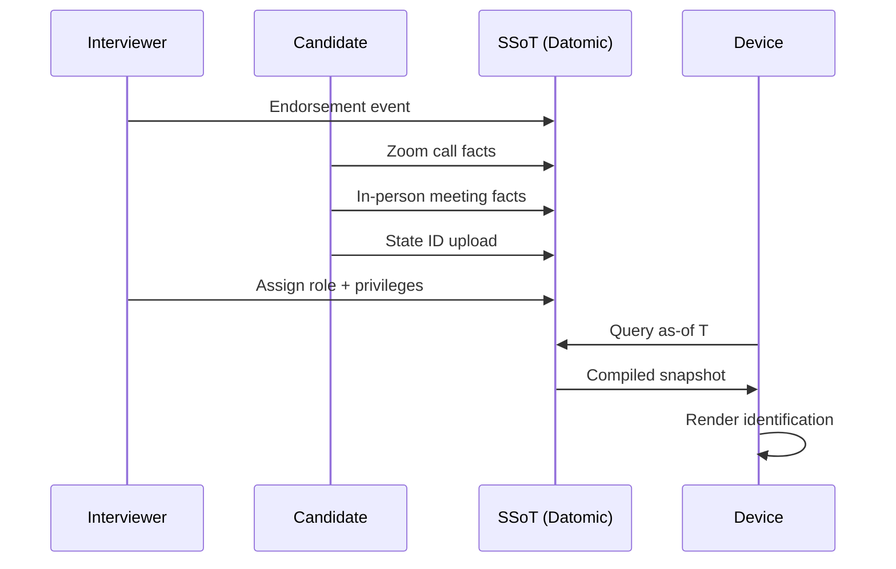
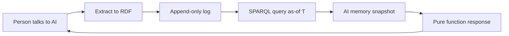
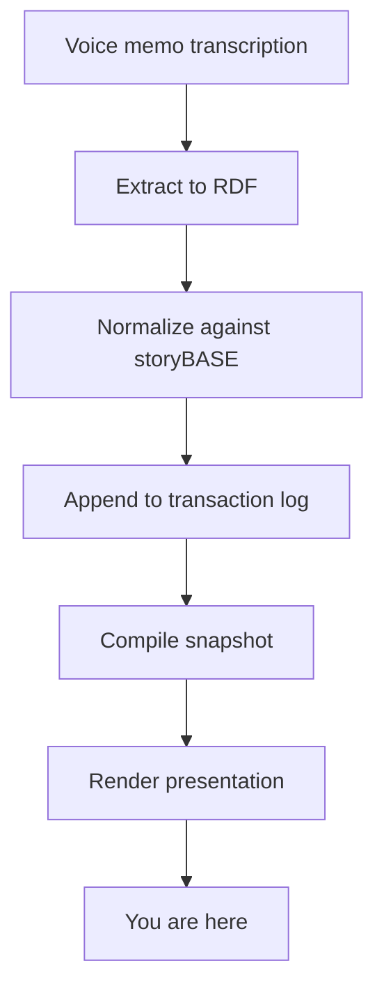

#### sic[#theme]
#
## Immutable Selves
### A Functional Approach to Digital Identity
#
#### Scarlet Dame
###### Founder, Sic · Strategic Advisor, Vouch.io
	[#theme]: Custom theme for Sic brand. Speaker identity from narr:Actor_ScarletDame (also known as Dylan Butman, Scarlet Spectacular), exemplifying the append-only log model of identity presented in this talk.

---
# Identity is not mutable state
## Yet we're treating it like Backbone.js

	We model identity—human and AI—as objects we mutate. But experience is an append-only log. Identification should be a render target, not a database row.
	
	[#thesis]: Core narrative from narr:Narrative_ImmutableIdentity and narr:Theme_FunctionalIdentity: "Identity—both human and AI—should be modeled as an append-only log that compiles to state, not mutable objects."

---
### I became
# Scarlet Dame

	My name changed. My pronouns changed. My driver's license changed. But I didn't become a different person—I became a more accurate rendering of the same immutable history.
	
	This is the story of how Clojure taught me to think about identity as a pure function.
	
	[#personal]: Speaker's identity history from narr:Actor_ScarletDame demonstrates the core thesis: personal transition as functional transformation from immutable past states (narr:Theme_TransitionAsStateChange).

---
## The Problem

---
###### Human Identity
# Source of truth
# You.

	Authorities issue documents that make claims about you. Your driver's license. Your passport. Your employee badge. Each one is a snapshot compiled from facts at a specific point in time.
	
	[#human-identity]: From narr:Actor_Human: "Source of truth for identity; authorities issue documents that make claims." Contrasts with current mutable-state implementations.

---
#### Authorities issue documents that 
# make claims about you.
#
## Identification represents
# compiled privileges

	But today's systems treat these as mutable records. Change your address? Update the database. New role? Mutate the access control list. We're querying the DOM and mutating the picture.
	
	[#problem]: From narr:ProblemContext_1: "Passwords and digital keys are mutable, siloed, and vulnerable; no single source of truth for privileges."

---
###### AI Identity
# Source of truth
# Unclear.

	Labs train models that say stuff. Each chat is different context. Persona prompts mutate rendered state. No provenance. No version control. No way to know if my AI gives the same answers as your AI.
	
	[#ai-problem]: From narr:Actor_AI and narr:ProblemContext_2: "AI models are black boxes; persona prompts mutate rendered state; no provenance or version control for AI identity."

---
### Where is the identity here?
# Who is the authority?
## What are the claims being made?

	[#questions]: Rhetorical questions from narr:StyleObs_RhetoricalQuestion_1, framing the problem space and inviting audience reasoning about identity foundations.

---
## The Pattern

---
###### Clojure Design Patterns
# 
## No frameworks
# Simple tools + good principles

	When I got my lanyard at my first Clojure/conj in 2013, I had one principle: "Your code was shit. Let me refactor it for you."
	
	Then I learned Clojure doesn't have frameworks. We have simple tools and good principles that compose into design patterns.
	
	[#clojure-way]: From narr:StyleObs_StockPhrase_1 and narr:MoatLeverage_1: "Clojure ecosystem (Datomic, datalog, re-frame) as proof-of-concept; 13 years of production experience."

---
### Anyone remember Backbone.js?

	You saw a picture (the DOM). Then you queried the picture with a selector. Then you mutated the picture.
	
	[#backbone]: From narr:StyleObs_5 and narr:ComparativeAnalysis_1: "Backbone.js (query DOM, mutate picture) vs. Om/React (state machine, pure function render). Identity systems today are Backbone; this is Om for identity."

---
# I want to argue
## we still treat identity like Backbone.js

	Not only human identity and identification, but also emergent AI identity and synthetic individuality. We're still mutating the picture instead of rendering from state.
	
	[#argument]: Core analogy from narr:StyleObs_Analogy_1 and narr:StyleObs_Metaphor_1: identity systems as Backbone.js anti-pattern.

---
## Reified Change

---
###### Make state explicit
# Append-only log
## Single source of truth

	In 2013, Om showed us UI as a state machine—the result of a functional transformation from immutable data. Not a picture to mutate, but a pure function to render.
	
	[#om]: From narr:StyleObs_UIStateMachine and narr:CaseStudy_1: "Applied Clojure principles (immutability, pure functions, single source of truth) to UI, then identity systems."

---
###### Everyone sees the same thing
# Render as pure function
## Deterministic UIs

	When everyone queries the same source of truth and renders it as a pure function, you get equality for free. Provenance for free. Versioning, branching, generative testing—for free.
	
	[#benefits]: From narr:LeverageProfile_1: "Immutability enables equality, provenance, versioning, branching, generative testing, decentralization, and infinite read scale—for free."

---
###### Single Source of Truth
# 
## Experience is an append-only log 
# that compiles[][#as-of] to identity.
	[#as-of]: From narr:KeyPhrase_2 and narr:StyleObs_9: "as-of T snapshots" is the canonical term for point-in-time query, appearing throughout the storyBASE as the core primitive for deterministic identity compilation.

	This is the core thesis. Your experience—every interaction, every document, every claim made about you—is immutable history. Identity is what you compile from that history at a specific point in time.
	
	[#core-thesis]: From narr:Narrative_1 and narr:WhatIsIt_1: "Identity and content derive from append-only log with as-of-T snapshots, enabling provenance and deterministic evolution."

---
## The Systems

---
## System: Human
# berecognized.id
###### Immutable Identification

	Digital identification enables recognition and delegates authority to access, use, and transact with shared technology.
	
	[#berecognized]: From narr:SolutionArchetype_BeRecognized and narr:CaseStudy_BeRecognizedID: "Human identity system: Datomic SSoT, datalog query, device-to-device interaction, change-privilege events."

---
### The Flow

	Endorsement by interviewer → Zoom calls → in-person meetings → state ID uploads → assigned role with privileges → 'as-of' query compiles snapshot on device.
	
	[#employee-flow]: From narr:Flow_EmployeeLifecycle: "Endorsement by interviewer → Zoom calls → in-person meetings → state ID uploads → assigned role with privileges → 'as-of' query compiles snapshot (digital identification) on device."

---
###### The Architecture
### SSoT (Datomic)
# Datalog query
## Device-to-device interaction

	All logic lives in event clients. The transactor just adds facts. Reads scale infinitely. The data model exists off-server—you can transact offline and submit later.
	
	[#architecture]: From narr:ApproachPattern_1 and narr:DesignTradeoff_1: "SSoT (Datomic) → datalog query → render to identification/privileges → event-driven transactions → append-only log → recompile." Trade-off: "Bottleneck at single transactor; all logic in event clients."

---
### The Result
# Provenance for every transaction
## Referential equality for free
### Offline transactions enabled

	Because the log is immutable and the render is pure, you get cryptographic proof of identity state. Hash of last transaction + SSoT state = "be recognized" property.
	
	[#results]: From narr:CaseStudy_BeRecognizedID results and narr:OutcomesProof_1: "Provenance for individual transactions; referential equality for free; offline transactions enabled."

---
###### The Risk
# Ghost Labor

	Bad actors—individuals or state actors like North Korea—deepfaking candidates, passing interviews, collecting paychecks on behalf of fake identities.
	
	Continuous identity establishment via append-only log mitigates this. Every interaction is a fact. Every fact has provenance.
	
	[#ghost-labor]: From narr:Risk_GhostLabor: "Bad actors (individuals or state actors like North Korea) deepfaking candidates, passing interviews, collecting paychecks on behalf of fake identities. Mitigated by continuous identity establishment via append-only log."

---
## System: AI
# aswritten.ai
###### Immutable AI Memory

	The AI memory problem: "My AI doesn't give the same answers as your AI." We need a narrative source of truth.
	
	[#aswritten]: From narr:SolutionArchetype_AsWritten and narr:CaseStudy_AsWrittenAI: "AI identity system: RDF+git SSoT, SPARQL query, chat+API interaction, extract-narrative events."

---
### The Flow

	Person talks to AI, shares documents → Extract chats/docs to RDF (narrative events) → Save to append-only log → AI memory as 'as-of T' snapshot (pure function) → Deterministic responses.
	
	[#ai-flow]: From narr:CaseStudy_AsWrittenAI intervention: "Transaction sequence: person talks to AI → extract chats/docs to RDF → save to append-only log → AI memory as 'as-of T' snapshot (pure function)."

---
###### The Architecture
### SSoT (RDF + git)
# SPARQL query
## Chat + API interaction

	Same pattern, different stack. RDF instead of Datomic. SPARQL instead of datalog. Git for versioning. But the principle is identical: immutable history, pure function render.
	
	[#ai-architecture]: From narr:ApproachPattern_2 and narr:RequiredCapabilities_2: "SSoT (RDF + git) → SPARQL query → render to AI memory/identity → event-driven transactions → append-only log → recompile."

---
### The Result
# Provenance
## Equality
### Decentralization

	Deterministic AI perspective for specific graph queries. Full talk as query. Section of talk. Talk evolution over time. Any accessible graph subset within billion-node graph.
	
	[#ai-results]: From narr:CaseStudy_AsWrittenAI results and narr:FutureVision_DeterministicAI: "Provenance, equality, decentralization/offline scale; deterministic AI perspective for specific graph queries."

---
## The Meta-Layer

---
# This talk
## is a query

	This presentation was created using storyBASE—the same append-only log architecture I'm describing. Every slide is compiled from immutable transaction history.
	
	[#meta]: From narr:Proof_1: "The talk itself exemplifies the reified change architecture and storyBASE workflow, showing iterative refinement from raw inputs to polished outputs."

---
### The Workflow

	Raw input → initial storyBASE → normalization/iteration → polished outputs with embedded provenance. The workflow embodies the thesis.
	
	[#workflow]: From narr:Flow_1 and narr:Behavior_1: "User inputs → initial storyBASE → normalization/iteration → polished outputs with embedded provenance. Clean and refine raw transcription using entity's established style and terminology."

---
###### Try it yourself
# Query this talk's storyBASE

	Full talk as SPARQL query. Section of talk. Talk evolution over time. Any accessible graph subset.
	
	Chat with the narrative source of truth at aswritten.ai
	
	[#demo]: From narr:FutureVision_DeterministicAI: "Examples: full talk as query, section of talk, talk evolution over time, any accessible graph subset within billion-node graph. Close with examples of such queries, then link to chat for participants to engage with narrative source of truth."

---
## Takeaways

---
# Experience is an append-only log

	Not a mutable profile. Not a database row. An immutable sequence of facts that accumulates over time.
	
	[#takeaway-1]: From narr:KeyPhrase_2 and narr:Primitive_1: "Append-only transaction log" as foundational atomic unit with immutability guarantee.

---
# Identification is a render target

	Not the source of truth. A pure function that compiles privileges, permissions, and presentation from the log at a specific point in time.
	
	[#takeaway-2]: From narr:Primitive_3 and narr:WhatIsIt_1: "Pure function renderer" as deterministic transformation: SSoT → identity surface. "Positions identity as a rendering problem, not a mutation problem."

---
# Interaction is transaction

	Not mutation. Every action appends to the log. Every change is auditable. Every state is reproducible.
	
	[#takeaway-3]: From narr:Behavior_1 and narr:Flow_1: "Event-driven transaction submission: User/system interactions produce transactions, not mutations." End-to-end loop: "SSoT → query → render → interact → event → transact → append log → recompile SSoT."

---
## The Pattern Works

---
### 13 years
# Backbone.js → Om → Production

	2012: Backbone.js. 2013: Om. 2013–2025: Production systems at Vouch.io and Sic applying these principles to identity and AI memory.
	
	[#timeline]: From narr:CaseStudy_1 context and results: "Speaker's 13-year career in Clojure; evolution from Backbone.js (2012) to Om (2013) to production systems at scale. Provenance, equality, versioning, decentralization, infinite read scale achieved; systems in production."

---
###### Same principles
# UI → Identity → AI

	Immutability is the unlock. Single transactor is acceptable bottleneck. Same pattern, different stacks.
	
	[#lessons]: From narr:CaseLessons_1: "Same principles apply across UI, identity, and AI; immutability is the unlock; single transactor is acceptable bottleneck."

---
## What You Can Do

---
### Model identity as
# append-only event logs

	Not mutable objects. Facts accumulate. State compiles. History is immutable.
	
	[#action-1]: From narr:PositioningThesis_1: "For developers and identity architects who treat identity as mutable state, this is a functional paradigm that makes identity deterministic, auditable, and decentralized."

---
### Render authentication as
# pure functions at the edge

	Device-to-device. Offline-capable. Deterministic. Verifiable.
	
	[#action-2]: From narr:SystemProperty_DistributedDecentralization and urn:uuid:architecture-immutable-identity: "Reads scale linearly; data model exists off-server, with transactions submitted later. Authentication as pure function at the edge."

---
### Build delegation as
# auditable chains

	Every privilege change is an event. Every event has provenance. Trust becomes something you can compute.
	
	[#action-3]: From urn:uuid:strategy-functional-immutable-identity and urn:uuid:style-obs-9: "Delegation as signed append-only events. Trust as provenance that you can compute."

---
## Resources

---
### berecognized.id
###### Human identity via immutable log

### aswritten.ai  
###### AI memory via narrative graph

### This talk's storyBASE
###### Query the source of truth

	All three systems demonstrate the same pattern: append-only log → single source of truth → pure function render → deterministic output.
	
	[#resources]: From narr:SolutionArchetype_BeRecognized, narr:SolutionArchetype_AsWritten, and narr:Tagline_AsWritten: "AI that tells your story, as written."

---
# Thank you

	Questions? Query the storyBASE.
	
	Scarlet Dame  
	scarlet@sic.ai  
	aswritten.ai
	
	[#close]: Presentation compiled from narr:Sample_ConjPresentation_2025 (6,847 tokens) via transactions narr:Tx_20251113T030805Z_conj2025 and related extractions, demonstrating the meta-narrative proof from narr:Proof_1.