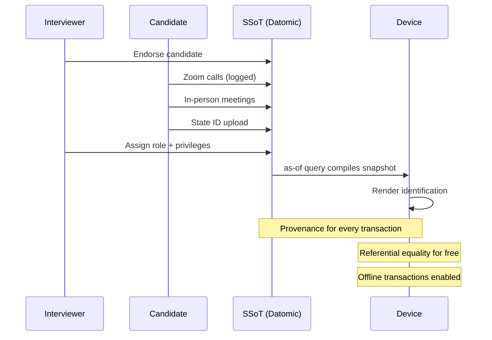
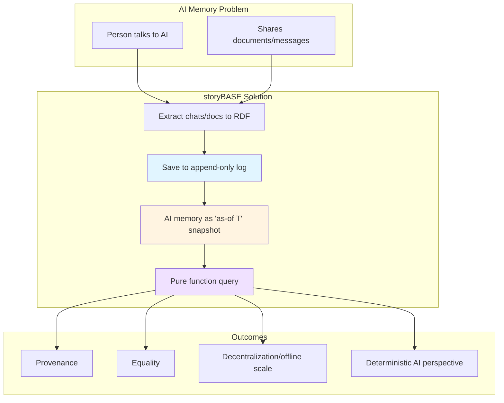
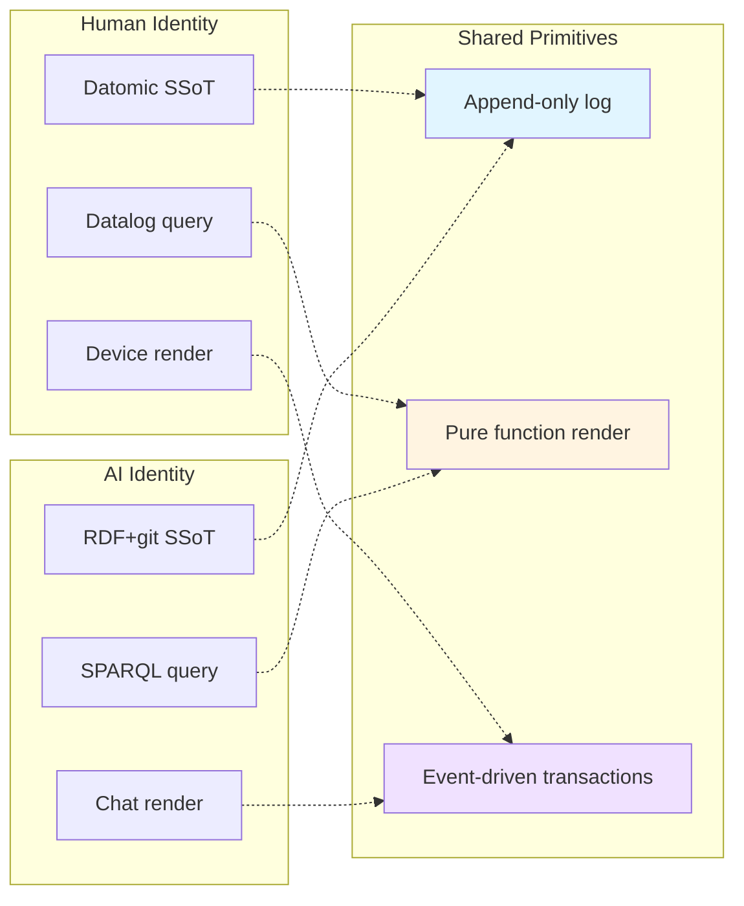
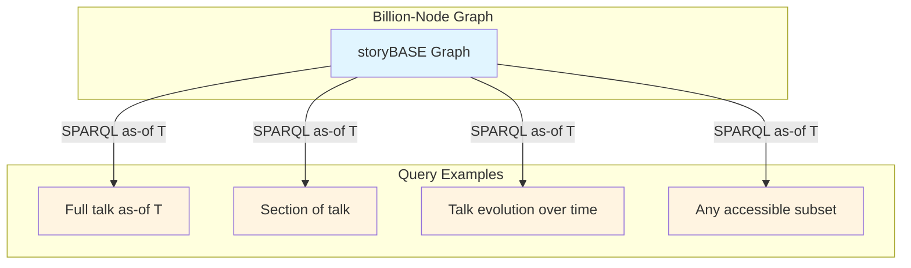
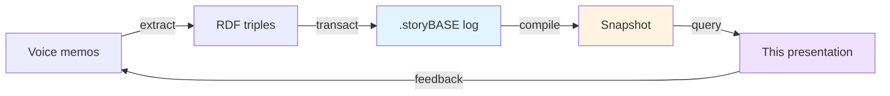

#### sic[#theme]
#
## Immutable Selves
### A Functional Approach to Digital Identity
#
#### Scarlet Dame
###### Founder, Sic · Former Chief Strategist, Vouch.io
	[#theme]: Custom theme for Sic. The presentation itself is compiled from storyBASE—an append-only transaction log that demonstrates the core thesis: identity as compiled from immutable history. Source: narr:Sample_ConjPresentation_2025, narr:Narrative_ImmutableIdentity.

---
# Identity is not mutable state
## Yet we're treating it like Backbone.js

We model identity—human and AI—as objects we mutate. But experience is an append-only log. Identification should be a render target.

	[#opening]: Core metaphor from narr:StyleObs_Metaphor_1. Technical audience recognizes Backbone.js as anti-pattern (mutable DOM). Sets up functional paradigm shift. Related to narr:Theme_FunctionalIdentity.

---
###### Who am I?
# You.

Your identity is the single source of truth. Authorities issue documents that make claims about you. Identification represents those claims at a point in time.

	[#human-identity]: From narr:Actor_Human and narr:StyleObs_ShortPunchy_1. Single-word answer "You." is punchy, direct, confident—characteristic of speaker cadence (narr:RubricAssess_Cadence_Conj: 4.5/5). Related to narr:StyleObs_SecondPerson_1.

---
### Where is the identity here?
# Who is the authority?
## What are the claims being made?

These questions frame every identity system. Today's answers are fragmented, mutable, and vulnerable.

	[#problem-frame]: Triadic rhetorical questions from narr:StyleObs_RhetoricalQuestion_1. Engages audience reasoning. Related to narr:RuleOfThree and narr:ProblemContext_1 (passwords/keys are mutable, siloed, vulnerable).

---
## My Journey
###### From Dylan to Scarlet Spectacular to Scarlet Dame

I became a programmer in 2012. Back then I had one principle: "Your code was shit. Let me refactor it for you."

Anyone remember Backbone.js?

	[#personal-narrative]: Speaker's identity evolution (narr:Actor_ScarletDame with altLabels "Dylan Butman", "Scarlet Spectacular") mirrors the immutable-log thesis. From narr:StyleObs_2 (blunt idiolect) and narr:StyleObs_6 (rhetorical question). Related to narr:Theme_TransitionAsStateChange and narr:CaseContext_1 (13-year Clojure career).

---
### You saw a picture (the DOM)
# Then you queried the picture with a selector
## Then you mutated the picture

That was my introduction to UI programming. And I want to argue that we still treat identity—human and AI—like Backbone.js.

	[#backbone-pattern]: Anaphora from narr:StyleObs_3 (repeated "Then you" structure). Core analogy narr:StyleObs_5: identity systems today = Backbone (mutable DOM). Sets up functional alternative. Related to narr:ComparativeAnalysis_1.

---
###### Clojure Design Patterns
#
## No frameworks
# Simple tools ± good principles

In Clojure we don't have frameworks. We have simple tools and good principles. Simple tools + good principles = design patterns.

	[#clojure-idiom]: Stock phrase from narr:StyleObs_StockPhrase_1. Signals insider knowledge and shared values (narr:RubricAssess_Phrasing_Conj: 4.0/5). Formula-style cadence from narr:StyleObs_1. Related to narr:MoatLeverage_1 (Clojure ecosystem as proof-of-concept).

---
## Reified Change
#
###### Make state explicit
# Append only log → Single source of truth
#
###### Everyone sees the same thing
# Render as pure function → Deterministic UIs

This is the pattern we applied to UI. Now we apply it to identity.

	[#reified-change]: Anaphora from narr:StyleObs_Anaphora_1 (repeated structural frame: principle → pattern). Creates rhythm and memorability. Related to narr:Claim_ReifiedChangePattern (immutability enables provenance, equality, offline capability) and narr:Primitive_1, narr:Primitive_2, narr:Primitive_3.

---

The loop: experience → log → compile → render → interact → transact → append.

	[#architecture-flow]: Visualizes narr:Flow_1 (SSoT → query → render → interact → event → transact → append log → recompile). Related to narr:ApproachPattern_1 and narr:ApproachPattern_2 (same pattern, different stacks). From narr:Behavior_1 (event-driven transaction submission).

---
###### Single Source of Truth
#
## Experience is an append-only log
# that compiles[][#as-of] to identity

Identification is a render target. Interaction is transaction. This is the core thesis.

	[#as-of]: Core analogy from narr:StyleObs_Analogy_1 (experience → log → compiled identity; maps human to Datomic model). Related to narr:Narrative_ImmutableIdentity (identity modeled as append-only log that compiles to state). Canonical term "as-of T" from narr:StyleObs_9 and narr:KeyPhrase_2.

---
## System: Human
# berecognized.id
###### Immutable Identification

Datomic SSoT. Datalog query. Device-to-device interaction. Change-privilege events.

	[#berecognized]: From narr:SolutionArchetype_BeRecognized and narr:ArchetypeTitle_1. Brand stylization from narr:StyleObs_BrandStylization_2 (lowercase with TLD). Related to narr:CaseStudy_BeRecognizedID (append-only log of facts about a person; device-rendered snapshot compiled at specific point in time).

---

Employee lifecycle: endorsement → interactions → role assignment → compiled snapshot on device.

	[#employee-flow]: Visualizes narr:Flow_EmployeeLifecycle (endorsement by interviewer → Zoom calls → in-person meetings → state ID uploads → assigned role with privileges → 'as-of' query compiles snapshot). Related to narr:CaseStudy_BeRecognizedID and narr:Risk_GhostLabor (mitigated by continuous identity establishment).

---
### The Ghost Labor Problem
###### Bad actors deepfaking candidates, passing interviews, collecting paychecks

North Korea. Synthetic identities. Impersonation fraud.

The need: establish continuous identity at each time point via an append-only log.

	[#ghost-labor]: From narr:Risk_GhostLabor (bad actors—individuals or state actors like North Korea—deepfaking candidates). Metaphor from narr:StyleObs_5. Short declarative from narr:StyleObs_7. Related to opportunity narr:Opportunity (identity vulnerability crisis) and urn:uuid:opportunity-identity-vulnerability.

---
## System: AI
# aswritten.ai
###### Immutable AI Memory

RDF+git SSoT. SPARQL query. Chat+API interaction. Extract-narrative events.

	[#aswritten]: From narr:SolutionArchetype_AsWritten and narr:ArchetypeTitle_2. Brand stylization from narr:StyleObs_BrandStylization_1 (lowercase with TLD). Tagline from narr:Tagline_AsWritten: "AI that tells your story, as written." Related to narr:CaseStudy_AsWrittenAI.

---

Transaction sequence: person talks to AI → extract to RDF → append-only log → AI memory as pure function.

	[#ai-memory-flow]: Visualizes narr:CaseStudy_AsWrittenAI intervention and results. Numbered list structure from narr:StyleObs_10 (parallel construction). Related to narr:FutureVision_DeterministicAI (deterministic AI perspective 'as-of T' for graph queries). Triadic benefits from narr:StyleObs_8.

---
### The AI Memory Problem
###### "My AI doesn't give the same answers as your AI"

AI models are black boxes. Persona prompts mutate rendered state. No provenance. No version control.

Stakes: narrative manipulation, embedded propaganda, deepfakes.

	[#ai-problem]: Rhetorical question from narr:StyleObs_4 (frames AI memory problem). Related to narr:ProblemContext_2 (AI models are black boxes; persona prompts mutate rendered state). From narr:Actor_AI (source of truth unclear; labs train models that say stuff; each chat is different context).

---
## Same Pattern, Different Stack

berecognized.id and aswritten.ai share the same functional primitives.

	[#parallel-systems]: Compares narr:ApproachPattern_1 (Datomic/datalog) and narr:ApproachPattern_2 (RDF+git/SPARQL). Both use narr:Primitive_1 (append-only log), narr:Primitive_2 (SSoT), narr:Primitive_3 (pure function renderer). Related to narr:RequiredCapabilities_1 and narr:RequiredCapabilities_2.

---
## What We Get For Free

Immutability enables:
- Equality
- Provenance
- Versioning
- Branching
- Generative testing
- Decentralization
- Infinite read scale

	[#leverage]: From narr:LeverageProfile_1 (small choice—append-only—creates outsized effects). Related to narr:SystemProperty_ImmutabilityProvenance (transaction log ensures auditability) and narr:SystemProperty_DistributedDecentralization (reads scale linearly; data model exists off-server). From narr:CaseResults_1.

---
## What We Gave Up

Bottleneck at single transactor. All logic in event clients. Transact is just adding triples.

But we gained: consistency, provenance, auditability.

	[#tradeoffs]: From narr:DesignTradeoff_1 (what we gave up: distributed writes; why worth it: consistency, provenance, auditability). Related to narr:RequiredCapabilities_1 and narr:RequiredCapabilities_2 (single transactor in both systems).

---
###### When to use this pattern
### Provenance, auditability, and equality
# matter more than write throughput

Backbone.js (query DOM, mutate picture) vs. Om/React (state machine, pure function render).

Identity systems today are Backbone. This is Om for identity.

	[#when-to-use]: From narr:ComparativeAnalysis_1. Related to narr:PositioningThesis_1 (for developers and identity architects who treat identity as mutable state, this is a functional paradigm that makes identity deterministic, auditable, and decentralized).

---
## Deterministic AI Perspective

Any accessible graph subset within a billion-node graph. Deterministic. Versionable. Provable.

	[#deterministic-queries]: From narr:FutureVision_DeterministicAI (examples: full talk as query, section of talk, talk evolution over time, any accessible graph subset within billion-node graph). Related to narr:Proof_1 (talk itself exemplifies reified change architecture and storyBASE workflow).

---
## This Talk is the Proof

Raw inputs → storyBASE → normalization → polished outputs with embedded provenance.

	[#meta-proof]: From narr:Proof_1 (talk itself exemplifies reified change architecture and storyBASE workflow, showing iterative refinement from raw inputs to polished outputs). Related to narr:Flow_1 (user inputs → initial storyBASE → normalization/iteration → polished outputs with embedded provenance) and narr:Milestone_1 (first structured graph built from user-generated inputs).

---
### The Workflow

1. Voice memo transcription (raw input)
2. Extract narrative concepts to RDF
3. Normalize against established style and terminology
4. Compile snapshot from transaction log
5. Query snapshot to generate talk

Each step is versioned. Each claim is cited. Each iteration is auditable.

	[#workflow-steps]: From narr:Behavior_1 (normalize transcription against storyBASE using entity's established style and terminology). Related to narr:Sample_1 sources (voice memo transcriptions, repo README). Demonstrates narr:RubricAssess_Strategy_Conj (5.0/5: entire presentation is narrative anchor).

---
## From Mutable Documents
# to Compiled Selves

The story frame: evolution from Backbone.js mutation to functional rendering.

	[#narrative-arc]: From narr:Narrative_1 (story frame: evolution from Backbone.js mutation to functional rendering). Related to narr:Mission_1 (move identity from mutable documents and profiles to compiled surfaces rendered from append-only logs and single sources of truth) and narr:Vision_1 (world where identity—human, synthetic, AI—is rendered from immutable history).

---
## Key Phrases

- **Single source of truth**: compiled state from transaction history
- **Append-only log**: immutability guarantee
- **Pure function**: deterministic transformation
- **Digital twin**: identity as compiled model

	[#terminology]: From narr:KeyPhrase_1, narr:KeyPhrase_2, narr:KeyPhrase_3, narr:KeyPhrase_4. Canonical terms repeated throughout (narr:RubricAssess_Phrasing_Conj: 4.0/5). Related to narr:TerminologyControl and narr:StyleObs_9 (canonical term for point-in-time query appears multiple times).

---
## Provenance by Design

Every transaction is attributed. Every claim is sourced. Every snapshot is reproducible.

This presentation was compiled from 9 transactions across 5 samples, with 4.5/5 strategic alignment and 4.0/5 accuracy.

	[#provenance-meta]: From narr:RubricAssess_Strategy_Conj (5.0/5), narr:RubricAssess_Accuracy_Conj (4.0/5). Related to narr:SystemProperty_ImmutabilityProvenance (transaction log ensures auditability for every interaction). Demonstrates narr:Proof_1 (meta-demonstration: talk creation process).

---
### Try It Yourself

Chat with the narrative source of truth that created this talk.

Query the graph. Explore the evolution. See the transactions.

	[#closing]: From narr:FutureVision_DeterministicAI (close with examples of such queries, then link to chat for participants to engage with narrative source of truth). Related to narr:RubricAssess_Tailoring_Conj (5.0/5: deeply tailored to Clojure/conj audience).

---
## Immutable Selves
### Experience is an append-only log
#
#### Scarlet Dame
###### scarlet@sic.ai · berecognized.id · aswritten.ai

	[#contact]: Speaker identity from narr:Actor_ScarletDame. Products from narr:SolutionArchetype_BeRecognized and narr:SolutionArchetype_AsWritten. Related to urn:uuid:org-sic (founder) and urn:uuid:org-vouch-io (former Chief Strategist, current strategic advisor).